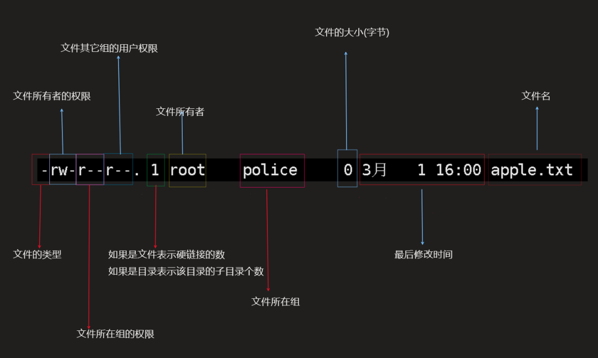

# Linux基础命令

## **ls（查看文件或目录）**

```
ls [属性] [文件或目录]
-a 查看全部文件（隐藏的文件也查看）
-l 查看文件的详细情况
-lh 查看文件的详细情况，并转换文件大小格式
-r 查看文件时，位置反转
```


## **pwd（查看当前目录的绝对路径）**

```
pwd
```


## **du（查看目录、文件所占用磁盘空间的大小）**


```
du [属性]du [属性] [文件名]#查看指定文件大小
-h                ：以人类可读的方式显示
-a                ：显示目录占用的磁盘空间大小，还要显示其下目录和文件占用磁盘空间的大小
-s                ：显示目录占用的磁盘空间大小，不要显示其下子目录和文件占用的磁盘空间大小
-c                ：显示几个目录或文件占用的磁盘空间大小，还要统计它们的总和
--apparent-size   ：显示目录或文件自身的大小
-l                ：统计硬链接占用磁盘空间的大小
-L                ：统计符号链接所指向的文件占用的磁盘空间大小　　
```


## **cd指令（切换目录）**

这个也是重点，十分之重。

```shell
cd
cd ~ 
#返回家目录
cd [目录]
#进入下级目录
cd ..
#返回上级目录
cd ../../xxx.xx
#相对路径跳转
cd /home/ubuntu/api
#绝对路径跳
```


## **mkdir指令（创建目录）**

主要用来创建目录（文件夹）

```
mkdir [文件夹名]
-p #创建多级目录
```


## **rmdir指令（删除文件或目录）**

这个指令相信大家都不陌生，删库跑路的事也常有发生，所以用这个指令一定要小心再小心，删了就很难找回了。

```shell
rmdir [目录]
#有内容时无法删除

rm -rf [目录或文件名]
#递归强制删除所有文件

rm -r [目录或文件名]
#递归删除整个文件夹，有提示

rm -f [目录或文件名]
#强制删除不提示
```


## **touch指令（创建文件不编辑）**

简单的创造一个空文件但不编辑。

```shell
touch [文件名字]
```


## **cp指令（复制指令）**

顾名思义就是copy的简写，就是复制并粘贴。

```shell
cp -r [需要复制的文件名或目录名] [复制到终点目录]
```


## **mv指令（移动指令还可以重命名）**

mv指令就是move，但还有重命名的作用。

```shell
mv [给它爱.txt] [吃鸡.txt]
#两个文件在同一目录下就是重命名

mv [文件目录1] [文件目录2]
#如果两个不同目录就剪切
```


## **ln软链接**

link软链接，类似于Windows系统里面的创建快捷方式一样，可以比较方便的实现文件应用的共享。

```shell
ln -s [需要软链接的目录文件] [放置位置]
```


## **history指令（查看历史命令）**

这个指令的作用是用来查看历史命令，可以在你忘记命令或是找出原因的情况下给你帮助。

```shell
history 
#查看全部历史命令
history 10
#查看最近10条命令
history | more
#在more上查看
！4执行第四条指令
history | grep "ls"
#查找历史命令中ls命令
```


## **man（查看命令手册）**

```shell
man [命令]
[命令] --help
```


## **用户及用户组：**

首先我们得知道从哪里看到我们的用户以及用户组。（一般一个用户组可以拥有很多用户）

```shell
cat /etc/passwd
#查看用户
cat /etc/group
#查看用户组
cat /etc/shadow
#查看用户的密码（需要root权限）
#里面是加密的密码，需要根据加密方式进行解密
```

```shell
创建组
Groupadd 组名

创建一个用户fox，并放入组内
Useradd -g 组名 用户名

Passwd 用户名
给一个用户指定密码

Logout登出

chgrp 组名 文件名/目录
修改文件所在的组

改变用户所在组
Usermod  -g 新组名 用户名
Usermod  -d 目录名 用户名 改变该用户登录的初始目录
```


知道怎样查询该Linux系统的用户及密码之后，我们发现这样查询要接上grep指令才可能快速一点，所以我们可以偷偷懒：

```shell
id  [用户名]
#查询是否有这个用户名并且显示所在组
w
#查看当前活跃的用户列表
```


## **文件权限**



简单来说：

- 第0位显示文件类型（d，-，l，c，b）
- l是连接，相当于快捷方式
- d是目录，相当于文件夹
- c是字符设备文件，鼠标，键盘等
- b是设备，如块设备、硬盘
- -是普通文件
- 1-3位确定所有者拥有的权限
- 4-6位确定所属用户组拥有的权限
- 7-9位确定其他用户拥有的文件权限

其中r代表可读（read），w代表可写（write），x代表可执行（execute）。

并且rwx的数字表示都不一样，所以开发者就将r=4，w=2.x=1作为更便携的表示方法，并且由他们排列组合，能够完整将权限组合表示出来，所以我们一般用数字来表示文件权限！

7种情况如下：

- 1x
- 2w
- 3wx
- 4r
- 5rx
- 6rw
- 7rwx