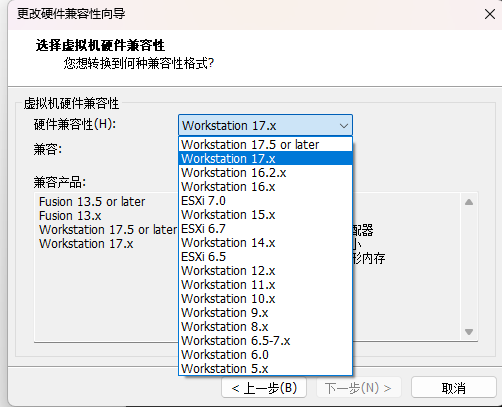
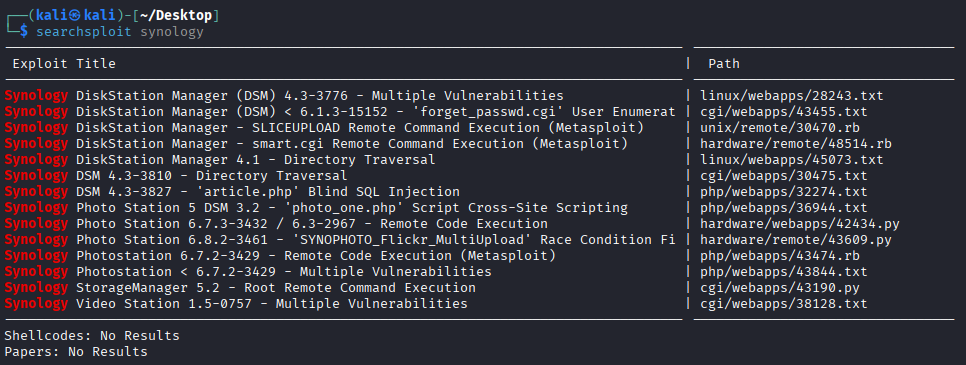

# Kali环境配置

虚拟机直接安装个人版版，免费使用即可，不用破解


kali的iso镜像就直接官网下载即可，安装的时候选择系统为debian


==切记切记切记，要拍摄快照==


## 鼠标本来好好的，突然不见了，但是可以虚空控制

是的，这是一个很吊诡的现象，我当时找了很久都找不到原因。一般都是apt update之后出现的现象。

如果你尝试了网上很多操作之后还是不行，试试下面这个：


关闭虚拟机之后，点击升级此虚拟机


然后将兼容性格式调到17.x



保存即可，鼠标就出现了。


## 换源过程中文件尺寸不符

```
┌──(kali㉿kali)-[~/Desktop]
└─$ sudo apt-get update
获取:1 http://kali.download/kali kali-rolling InRelease [41.5 kB]
获取:2 http://172.31.247.35:8081/IXC50dc9a0e44e3505ad1ff87524251cfba/kali kali-rolling/main amd64 Packages [20.3 MB]
忽略:2 http://172.31.247.35:8081/IXC50dc9a0e44e3505ad1ff87524251cfba/kali kali-rolling/main amd64 Packages
忽略:2 http://kali.download/kali kali-rolling/main amd64 Packages            
获取:3 http://172.31.247.35:8081/IXCefe387bf8f037cacb46bf6e3501d195d/kali kali-rolling/main amd64 Contents (deb) [49.4 MB]
忽略:3 http://172.31.247.35:8081/IXCefe387bf8f037cacb46bf6e3501d195d/kali kali-rolling/main amd64 Contents (deb)
获取:4 http://kali.download/kali kali-rolling/contrib amd64 Packages [112 kB]      
获取:5 http://kali.download/kali kali-rolling/contrib amd64 Contents (deb) [274 kB]
获取:6 http://kali.download/kali kali-rolling/non-free amd64 Packages [197 kB]
获取:7 http://kali.download/kali kali-rolling/non-free amd64 Contents (deb) [877 kB]
获取:8 http://kali.download/kali kali-rolling/non-free-firmware amd64 Packages [10.6 kB]
获取:9 http://kali.download/kali kali-rolling/non-free-firmware amd64 Contents (deb) [23.1 kB]
忽略:3 http://kali.download/kali kali-rolling/main amd64 Contents (deb)                          
获取:2 http://kali.download/kali kali-rolling/main amd64 Packages [79.9 MB]                      
忽略:3 http://kali.download/kali kali-rolling/main amd64 Contents (deb)                                                                                    
错误:3 http://http.kali.org/kali kali-rolling/main amd64 Contents (deb)                                                                                    
  文件尺寸不符(48702276 != 49418198)。您使用的镜像正在同步中？ [IP: 172.31.247.35 8081]
已下载 79.9 MB，耗时 16秒 (4,900 kB/s)                                                                                                                     
正在读取软件包列表... 完成
E: 无法下载 http://http.kali.org/kali/dists/kali-rolling/main/Contents-amd64  文件尺寸不符(48702276 != 49418198)。您使用的镜像正在同步中？ [IP: 172.31.247.35 8081]
E: 部分索引文件下载失败。如果忽略它们，那将转而使用旧的索引文件。
N: 仓库'Kali Linux'将其'firmware component'值从'non-free'修改到了'non-free-firmware'
N: More information about this can be found online at: https://www.kali.org/blog/non-free-firmware-transition/
```


问题出现：

要么我们的网络有异常，连接不上更新源；要么就是你的更新源不对，如果你的更新源是官方源，出现这种情况很正常，因为官方源对国内来说，有很多其实是连接不上的，打不开的，只需要换成国内的其它[kali Linux更新源](https://www.fujieace.com/kali-linux/update-source.html)就可以了。


转到换源处解决问题


## 更换安装源（自动化）

有一个项目可以直接换源，使用那个项目就行了：

```
https://linuxmirrors.cn/
```

可以提供换系统镜像源或者docker镜像源，非常方便

```
bash <(curl -sSL https://linuxmirrors.cn/main.sh)
```


Docker换源：

```
bash <(curl -sSL https://linuxmirrors.cn/docker.sh)
```


## NAT模式没有分配ip（网卡显示DOWN）

这个是虚拟机配置问题，可以看一下你之前有没有更改什么


现在是解决方案：

显示网卡DOWN

```
┌──(root㉿kali)-[/etc]
└─# ip a                            
1: lo: <LOOPBACK,UP,LOWER_UP> mtu 65536 qdisc noqueue state UNKNOWN group default qlen 1000
    link/loopback 00:00:00:00:00:00 brd 00:00:00:00:00:00
    inet 127.0.0.1/8 scope host lo
       valid_lft forever preferred_lft forever
    inet6 ::1/128 scope host noprefixroute 
       valid_lft forever preferred_lft forever
3: eth0: <NO-CARRIER,BROADCAST,MULTICAST,UP> mtu 1500 qdisc fq_codel state DOWN group default qlen 1000
    link/ether 00:0c:29:40:f6:5f brd ff:ff:ff:ff:ff:ff
```


输入下面的暂时可用

```
dhclient eth0
```


直接虚拟机点击`编辑`->`更改设置`->`还原默认设置`


然后点击具体虚拟机，右键打开虚拟机设置，选中网络适配器，勾选已连接和启动时连接即可。


此时再输入`ip a`

```
┌──(kali㉿kali)-[~/Desktop]
└─$ ip a
1: lo: <LOOPBACK,UP,LOWER_UP> mtu 65536 qdisc noqueue state UNKNOWN group default qlen 1000
    link/loopback 00:00:00:00:00:00 brd 00:00:00:00:00:00
    inet 127.0.0.1/8 scope host lo
       valid_lft forever preferred_lft forever
    inet6 ::1/128 scope host noprefixroute 
       valid_lft forever preferred_lft forever
2: eth0: <BROADCAST,MULTICAST,UP,LOWER_UP> mtu 1500 qdisc fq_codel state UP group default qlen 1000
    link/ether 00:0c:29:40:f6:5f brd ff:ff:ff:ff:ff:ff
    inet6 fe80::a8d5:57c5:86ac:b626/64 scope link tentative noprefixroute 
       valid_lft forever preferred_lft forever
```


解决该错误。


## 源更新失败（签名出错）

W: GPG 错误：http://mirrors.ustc.edu.cn/kali kali-rolling InRelease: 下列签名无效： EXPKEYSIG ED444FF07D8D0BF6 Kali Linux Repository <devel@kali.org>
E: 仓库 “http://mirrors.ustc.edu.cn/kali kali-rolling InRelease” 没有数字签名。
N: 无法安全地用该源进行更新，所以默认禁用该源。
N: 参见 apt-secure(8) 手册以了解仓库创建和用户配置方面的细节。

```bash
wget archive.kali.org/archive-key.asc   //下载签名
 
sudo apt-key add archive-key.asc   //安装签名
```

ubuntu

```
sudo apt-key adv --keyserver keyserver.ubuntu.com --recv-keys F42ED6FBAB17C654
sudo apt-get update
```


可以的话，安装签名先删除之前的`archive-key.asc`

```
sudo apt-key del archive-key.asc   //删除签名
```


## 安装东西

vscode 记得配置中文环境

deb包就使用dpkg进行安装

直接Tab键就不用输入xxxx.deb了

```bash
sudo dpkg -i xxxxx.deb
```


## 桌面美化

```shell
sudo apt-get update 
```


```shell
sudo apt install kali-desktop-gnome
```

选择`gdm3`桌面


```shell
reboot
```


```
保存快照谢谢
```

当然上面没有选择正确可以改：

```shell
sudo dpkg-reconfigure gdm3
```


然后显示gdm3服务未激活

```
┌──(kali㉿kali)-[~/Desktop]
└─$ sudo dpkg-reconfigure gdm3   
gdm.service is not active, cannot reload.
invoke-rc.d: initscript gdm3, action "reload" failed.
```


`gdm.service is not active, cannot reload.`

还以为是真的出现错误，其实只需要重启就能切换到gdm3


可用下面进行查看验证

```
cat /etc/X11/default-display-manager

如果是GDM3，它会返回
/usr/sbin/gdm3
```


## 更换为中文(空格勾选)

```
sudo apkg-reconfigure locales
```


一直往下拉选择

使用上下箭头或鼠标滚轮找到`en_US.UTF-8 UTF-8`，点击空格取消勾选。

接着空格勾选 `zh-CN.UTF-8.UTF-8 `选项，然后点击回车确认。

最后选择语言为`zh_CN.UTF-8`，再次回车确认。

然后保存

```
reboot
```


## 基础自定义

重置超级用户密码

```
passwd root
```

添加普通用户

```
adduser jiangxiao
```

加速kali运行

一些基本的加速软件 preload

```
apt-get install preload
```

识别用户最常用的程序，将二进制文件和依赖预先加载至内存


bleachbit释放磁盘空间

```
apt-get install bleachbit
```


## 虚拟机共享文件夹


与Windows共享文件夹，这个其实安装了vmware tools也能实现相同功能，这里就是在设置里面找到共享文件夹菜单，创建操作系统中已经存在的共享文件夹的路径，在编辑虚拟机设置里面的选项里头就能看到设置了

需要注意的是，共享文件夹在外面设置之后，里面还要进行挂载操作

```
sudo mount -t fuse.vmhgfs-fuse .host:/ /mnt/hgfs -o allow_other
```

```
sudo mount -t fuse.vmhgfs-fuse .host:/ 挂载点 -o allow_other
```

```
sudo mount -t fuse.vmhgfs-fuse .host:/ /mnt/windows-share -o allow_other
```

如果虚拟机重启，需要再次挂载共享文件夹。

所以可以写一个bash，开机一键启动


## 安装软件依赖问题

```
无法满足的依赖关系：
 kali-themes : 破坏: gnome-shell (>= 47~) 但是 47.1-1kali1 正要被安装
Error: 错误，pkgProblemResolver::Resolve 发生故障，这可能是有软件包被要求保持现状的缘故。
```

原因：系统太旧而源太新

 

解决方法：

**破坏什么依赖强制安装什么依赖**，

比如

`gnome-session-common` : 破坏: eog (< 3.36.0) 但是 3.26.1-1 正要被安装

`apt install eog `


## 安装AppImage后缀的应用

这里用cherrystudio作为演示


最简单的方式就是直接添加可执行的权限

```
chmod 777 Cherry-Studio-1.4.3-x86_64.AppImage
```

然后直接运行

```
./Cherry-Studio-1.4.3-x86_64.AppImage
```

但是这种方法不会有图标

你直接放在桌面上就可以双击启动了！！

------------------------------

不这么简单的如下：

创建应用文件

```
mkdir /opt/CherryStudio
```


移动文件

```
mv Cherry-Studio-1.4.3-x86_64.AppImage /opt/CherryStudio
```


设置权限

```
chmod -R a+x /opt/CherryStudio
```


在系统菜单中创建应用图标

```
cd /usr/share/applications
 
vim CherryStudio.desktop
 
# 编辑内容
[Desktop Entry]
Type=Application
Encoding=UTF-8
Name=CherryStudio // 应用程序名称
Comment=A sample application
Exec=/opt/CherryStudio # 应用程序启动文件的路径
Icon=/opt/{application icon} # 应用程序图标文件路径
Terminal=false
```


## 运行如果没有配置环境变量

运行php如果没有配置环境变量直接在文件最上面加这一行东西。

```
#!/usr/bin/php
```


## bp证书

直接配置好之后，浏览器打开 /burp

点击下载，然后浏览器设置里面搜certificates，从view certificates导入即可


## python下载临时换源

```
pip3 install gevent -i https://pypi.tuna.tsinghua.edu.cn/simple 
```


## searchsploit搜索漏洞

kali里面提供了一个可以直接搜索漏洞的工具，它的数据源是ExploitDB

比如说模糊搜索群晖的漏洞

```
searchsploit synology
```




然后后面不是有个POC嘛，直接-m再输入他们的数字代号就行了。

```
searchsploit -m 38128
```

然后这些默认下载到当前路径，你就可以查看或者利用了。有一些是改包的具体信息，有一些是可运行的脚本。


你可以写一个脚本定时更新，做出重要指示：漏洞一定要能利用！

```
searchsploit -u
```

更多操作还是-h进行查看。不过以上三步就够用了。


## theHarvester报错解决

遇到：

```
 Executing “theHarvester -h”
Traceback (most recent call last):
  File "/usr/bin/theHarvester", line 7, in <module>
    from theHarvester import __main__
  File "/usr/lib/python3/dist-packages/theHarvester/__main__.py", line 4, in <module>
    from theHarvester.discovery import dnssearch, takeover, shodansearch
  File "/usr/lib/python3/dist-packages/theHarvester/discovery/takeover.py", line 1, in <module>
    from theHarvester.lib.core import *
  File "/usr/lib/python3/dist-packages/theHarvester/lib/core.py", line 6, in <module>
    import aiohttp
  File "/usr/lib/python3/dist-packages/aiohttp/__init__.py", line 6, in <module>
    from .client import (
  File "/usr/lib/python3/dist-packages/aiohttp/client.py", line 35, in <module>
    from . import hdrs, http, payload
  File "/usr/lib/python3/dist-packages/aiohttp/http.py", line 7, in <module>
    from .http_parser import (
  File "/usr/lib/python3/dist-packages/aiohttp/http_parser.py", line 15, in <module>
    from .helpers import NO_EXTENSIONS, BaseTimerContext
  File "/usr/lib/python3/dist-packages/aiohttp/helpers.py", line 667, in <module>
    class CeilTimeout(async_timeout.timeout):
TypeError: function() argument 'code' must be code, not str
```


解决方法：

```
sudo apt-get update
```

```
pip3 install gevent -i https://pypi.tuna.tsinghua.edu.cn/simple 
```

```
sudo apt-get install --reinstall python3-apt
```


## metasploit使用方法


shellcode

自动攻击脚本

kali自带


打开

```bash
msfconsole
```


查询漏洞

```
search ms17_010
```


使用模块，直接use查询的全称

```
use xxxxx/xxxxx/xxxxx/xxxx/xxxx
```


进入到模块，查看配置，一般你用模块都是直接show options，你就知道填什么参数了。

```
show options
```


```
ping 目标ip
```


然后一个一个去set设置

```
set LHOST xxx.xx.xxx.x
```

设置listen攻击端口

```
set LPORT 12345
```


运行

```
run
```


然后help查看具体功能

```
help
```


永恒之蓝漏洞


永恒之蓝是指2017年4月14日，黑客团体Shadow Brokers（影子经纪人）公布一大批网络攻击工具，其中就包括“永恒之蓝”工具，利用Windows系统的SMB漏洞获取系统最高权限。5月12日，不法分子改造“永恒之蓝”制作了wannacry勒索病毒，被勒索支付高额赎金才能解密恢复文件


wannacry：缓冲区溢出漏洞


