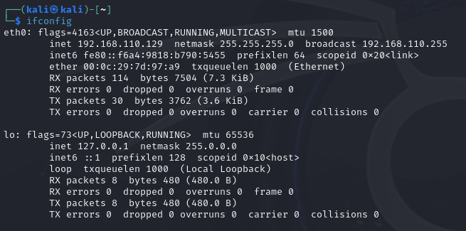

# netdiscover

## 简述

网络扫描工具

ARP扫描发现活动主机


发送ARP请求检查网络ARP流量，自动扫描网络地，不容易被人发现


官方文档：

```bash
$ netdiscover -h
Netdiscover 0.10 [Active/passive ARP reconnaissance tool]
Written by: Jaime Penalba <jpenalbae@gmail.com>

Usage: netdiscover [-i device] [-r range | -l file | -p] [-m file] [-F filter] [-s time] [-c count] [-n node] [-dfPLNS]
  -i device: your network device
  -r range: scan a given range instead of auto scan. 192.168.6.0/24,/16,/8
  -l file: scan the list of ranges contained into the given file
  -p passive mode: do not send anything, only sniff
  -m file: scan a list of known MACs and host names
  -F filter: customize pcap filter expression (default: "arp")
  -s time: time to sleep between each ARP request (milliseconds)
  -c count: number of times to send each ARP request (for nets with packet loss)
  -n node: last source IP octet used for scanning (from 2 to 253)
  -d ignore home config files for autoscan and fast mode
  -f enable fastmode scan, saves a lot of time, recommended for auto
  -P print results in a format suitable for parsing by another program and stop after active scan
  -L similar to -P but continue listening after the active scan is completed
  -N Do not print header. Only valid when -P or -L is enabled.
  -S enable sleep time suppression between each request (hardcore mode)

If -r, -l or -p are not enabled, netdiscover will scan for common LAN addresses.
```


## 实际使用


## 扫描当前网段下的存活主机

```
ifconfig
```

查本地的ip地址




扫描当前网段下的，就直接改形式就可以了：

```shell
sudo netdiscover -r 192.168.110.0/24
```


nmap搭配使用，扫描端口、系统信息

```
nmap 发现的ip地址 -O
```


