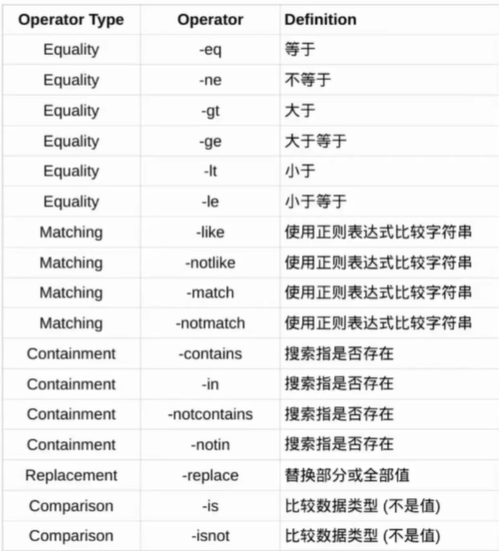

# Windows基础知识


闭源

目录为\，不区分大小写

使用注册表管理应用和系统配置

CMD、Powershell

Administrator管理员权限

Windows更注重向后兼容性


PowerShell基于NET框架，使用Cmdlet编写脚本和自动化管理任务，提供调用COM和WMI接口，提供本地和远程管理能力，支持Linux和MacOS。


## 目录结构

- `Program Files`  、`Program Files(x86)` : 64、32位程序目录
- `User` : 用户主目录
- `System32` : 核心系统库和可执行文件
- `SysWOW64`


## CMD使用


```
help		查看命令
cd			显示当前目录或者更改目录
cls			清屏
cmd			开启新的命令行实例
copy		拷贝文件
del			删除文件
dir			显示目录或者子目录列表
echo		显示消息或者开关回显功能
erase		删除文件
exit		推出当前命令行
find		在文件中搜索字符串
findstr		在文件中搜索字符串
mkdir		创建目录
more		分屏显示输出
move		移动文件
ren			重命名文件
rmdir		删除目录
type		显示文件内容
tree 		目录树
whoami		查看当前使用的用户名
```


### 查找文件或内容

```
C:\Users\learner> dir /s trojan.txt

C:\Users\learned> find "pass" C:\app\setting.conf
C:\Users\learned> type C:\app\setting.conf | find "pass"
C:\Users\learned> findstr "pass key" C:\app\setting.conf
```


## 系统信息


系统信息查看

```
C:\Users\learner> systeminfo
```


系统主机名查看

```
C:\Users\learner> hostname
```


用户

- `Administrator` : 系统管理员，默认禁用
- 普通用户：权限有限，无法进行系统范围的更改
- `guest` : 默认禁用，为临时访问提供最小权限，如果启用，无密码
- `system` ： 管理关键服务，劫持此账户进程，可以控制整个系统


组账号：

- `Administrators` : 成员可以完全控制系统
- `Users` ： 普通用户组，成员可以运行程序和执行基本任务
- `Remote Desktop Users` : 授予通过RDP远程登录的权限


查看用户列表

```
C:\Users\learner> net user
C:\Users\learner> net user administrator
```


查看组账号

```
C:\Users\learner> net localgroup
C:\Users\learner> net localgroup Administrators
```


UAC（用户账号控制）

通过提示用户确认需要提升管理权限的操作


## Windows权限

权限工作原理

- NTFS文件系统：Windows的标准文件系统，支持权限控制
- 自主访问控制列表（DACL）：对ACE授予对象的访问权限ACL，包括允许、拒绝等权限类型
- 访问控制项（ACE）：用户或组等访问主体


查看权限

```
icacls


(I)(F): 继承+完全控制权限
```


## 注册表

注册表是一个中央数据库。用于存储系统和应用的基本配置信息。注册表采用分层结构，数据的基本单元称为键，而不是目录。键可以包括子键或值，每个子键或值由名称、数据类型和内容标识。要修改注册表，应用程序通过键名访问预定义键，并修改值


主要预定义键

- `HKEYCLASSES ROOT(HKCR)`:管理文件类型关联，并由shell和组件对象模型(COM)应用程序使用
- `HKEY_CURRENT_CONFIG(HKCC)`:存储硬件配置详细信息，特别是与默认设置的偏差
- `HKEYCURRENTUSER(HKCU)`:包含当前登录用户的设置，每用户都不相同
- `HKEY_LOCAL MACHINE`:保存机器相关的数据，例如硬件和驱动程序
- `HKEY USERS`:存储应用于新用户帐户的默认设置


注册表文件

注册表数据分散保存于多个文件中

`Win+R`

```
regedit
```

命令行工具

```
C:\Usersllearner> reg /?
```


| Registry hive               | Supporting files                        |
| --------------------------- | --------------------------------------- |
| HKEY CURRENT CONFIG         | System,System.alt,System.og,System.sav  |
| HKEY CURRENT USER           | Ntuser.dat, Ntuser.dat.log              |
| HKEY LOCAL MACHINE\SAM      | Sam, Sam.log, Sam.sav                   |
| HKEY LOCAL MACHINE\Security | Security, Security.log, Security.sav    |
| HKEY LOCAL MACHINE\Software | Software.Software.log,Software.sav      |
| HKEY LOCAL MACHINE\System   | System.System.alt.System.log.System.sav |
| HKEY USERSL.DEFAULT         | Default. Default.log. Default.sav       |


## PowerShell基础


`PowerShell`面向对象

基于`.NET`框架，系统集成版本成为`PowerShell Classic`，开源跨平台版本成为`PowerShell Core`

`PowerShell `运行系统命令，运行的返回结果都是`.NET` 对象

cmd运行结果返回字符串


```
update-help
更新本机帮助文档


Get-help
查看帮助信息

Get-help ls

-Examples
-Detailed
查看更加详细的帮助
```


```
Get-Alias
获取命令别名
```


### 表达式

```
$ 变量名
= 赋值

$abc = 100
```


变量名字符限制：中横线-  还有空格，禁止出现在变量名中

消除变量赋值

```
clear-variable abc
```


数学计算都是

```
+
++
-
--
%
/
```


调用就是

```
$num1 + $num2
```


字符串

```
$mystring = "ABSAIDO1"

$mystring.gettype()
```


强制类型转换

```
$mystring = "123"
$justint = [int]$mystring
$justint = [int64]$mystring
```


属性方法写入

```
$mystring="chinaaaa"
$mystring.length			# 打印长度
$mystring.contains("ina")   # 查询是否包含，返回布尔值
```


查询对象的属性和方法

```
get-member -inputObject $mystring
```


比较运算

还有很多




```
-eq
判断是否等于

$num1=1
$num1 -eq 1    # 返回布尔值
```


### 语句

循环

```
for ($myvar=0;$myvar -lt 5;$myvar++)
{
	Write-output $myvar;
}
```


```
foreach($myLetter in $mystring)
{
	$myLetter
}
```


```
while($count -lt 5)
{

}
```


while(1)循环

```
while($true)
{
	
}
```


`break`和`continue`都是可以正常用的


函数也一样

```
function xxxxxxx{

}
```


### 执行


可以写微模块文件，后缀为`.ps1`


将函数写成微模块文件，下次调用

```
import-module .\xxxx.ps1
```

