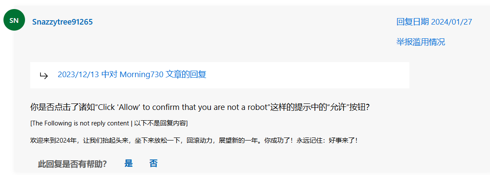
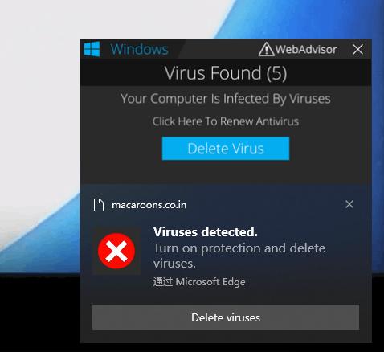
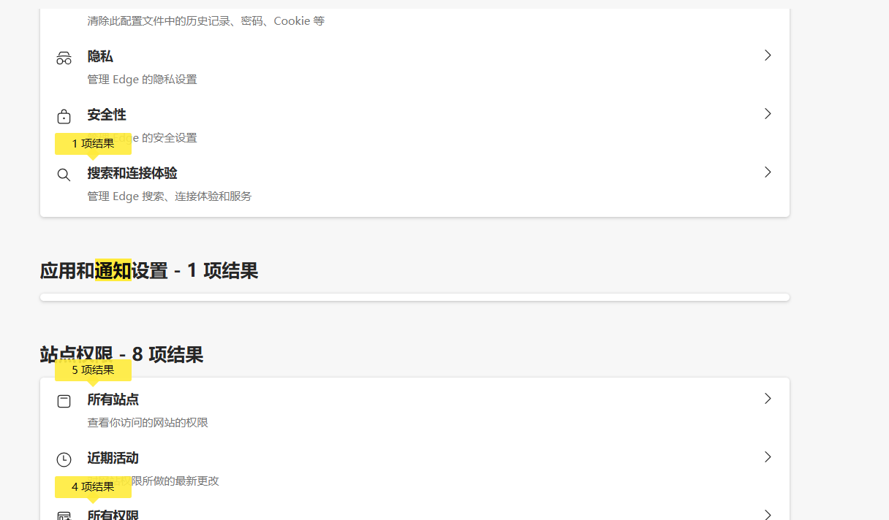

# edge恶意弹窗

事发于11月13日

本人一时兴起开始清理那狮山般的网站收藏夹，大学四年收集的工具、资源啥的都在里面。

清理到某个网站的时候，点击判断是不是真人，还是AI嘛，就点真人，然后突然间弹出一个允许，我也手疾眼快地点了允许

经典画面

然后Windows外面的提示就一直弹了，点击弹窗中的查杀按钮会进入那个疑似病毒网站，主要是提示你的电脑中病毒了，请点击去某某某网站购买他的防病毒服务，价格昂贵。

本人忘记截图了，就取了网上疑难解答的图片下来：

大概就是这样子，但是网站不是这个，这种恶意弹窗一般都是经常变域名的。

我当时以为我中病毒了，赶紧火绒扫一遍，发现没有什么东西，进安全模式扫也表示安全

然后进通知那里找，发现这个病毒网站，将应用和通知设置这里给折叠了，不到啊怎么做的，

点击所有站点，去禁掉那个未知网站的权限就不会弹窗了。

当时一下子清空了浏览记录啥的，没有做保存和复现，我的大锅。

庆幸没有自动下载什么勒索软件，大谢。

心理洁癖，重装电脑了。

