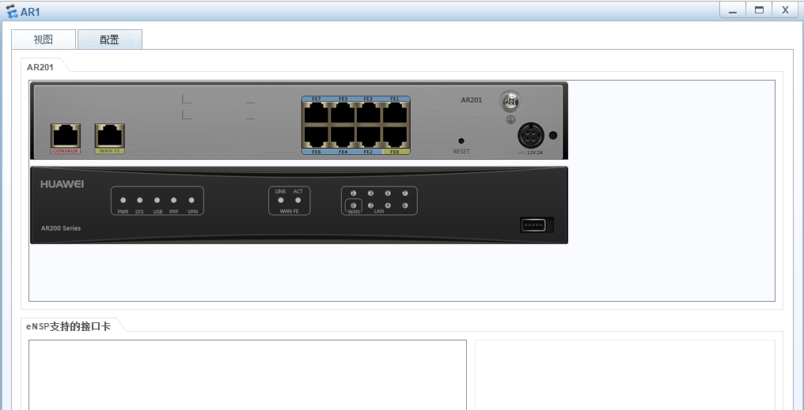
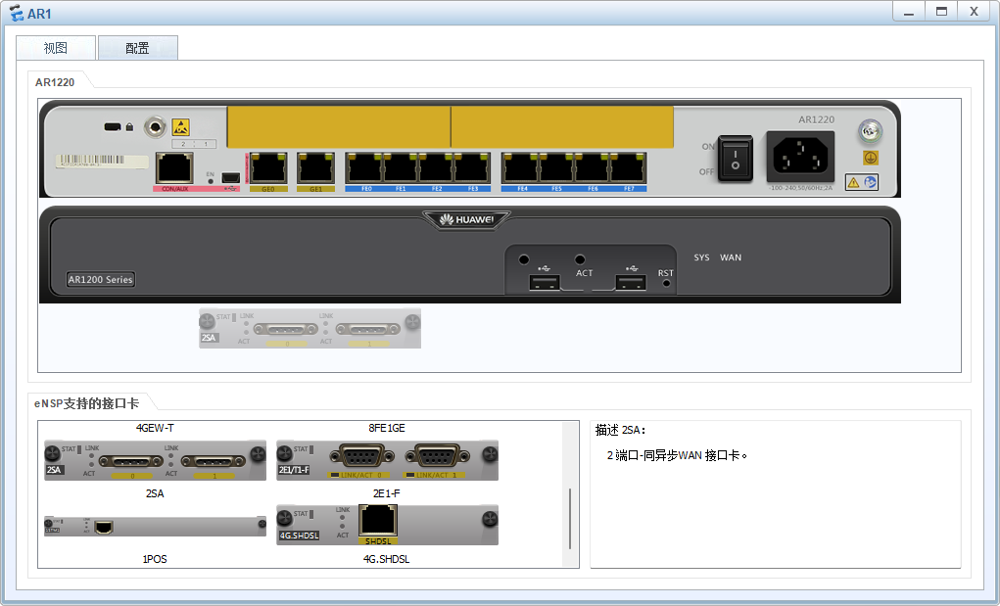
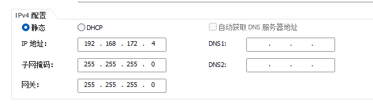

# eNSP网络仿真工具

## 0. eNSP是什么？

​	eNSP全称(Enterprise Network Simulation Platform)，是一款华为提供的网络仿真模拟器，对华为系列的企业级网络路由器、交换机等设备进行在线仿真。提供给那些没有设备、资金紧张的课题组、个人用户等一个亲手配置设备的机会和可能接触到的第一个大型网络模拟器，用于学习网络技术。

## 1. 软件安装

搭建环境参考此文章，建议wireshark下最新版本，ensp内网nas有得下载，走内网渠道更快

安装教程：[win10、11下安装eNSP（1.3.00）并完美运行_ensp最新版-CSDN博客](https://blog.csdn.net/qq_45945548/article/details/124512961)

重点提醒：任何软件依赖都不要有中文路径


## 2. 认识eNSP各大模块

当你安装完软件，点进去可以看到，然后点击左上角的新建拓扑，即可看到此页面

[](https://imgse.com/i/pAtdfoV)

观察左边有一系列的设备，可以挨个点击，可以看到各个设备的具体描述，如CON、USB、Console等资源，现在我们来逐个了解一下，仅仅是了解。

### 2.0 路由器

​	路由器是啥就不用多说了，不知道的回去补知识点。

​	AR201路由器是面向小企业网络的设备，相当于一台路由器和一台交换机的组合，8个FE端口是交换机端口，路由器使用逻辑接口VLANIF1和交换机连接，值得注意的是，交换机的所有端口默认都属于VLANIF 1

​	设备详细信息可以将AR201拖至拓扑画布区域，右键点击选中设置，这样就可以看到设备的现实模样，可以加深记忆。

​	这就是设备介绍中所说的，1个CON/AUX接口，固定8FE接口，1个WAN侧uplink接口，1个USB接口

[](https://imgse.com/i/pAtdzWD)

[](https://imgse.com/i/pAtwpSe)


2.1 交换机

2.2 无线局域网

2.3 防火墙

2.4 PC

​	常用就是用第一个PC个人电脑即可

2.5 Cloud

2.6 设备连线

​	设备连线使用Auto即可


​	其余同理，询问GPT。不再赘述。


## 3. 教程配套实验

### 3.0 模块添加与设备连线

​	使用两台AR1220路由器，每台路由器添加“2端口-同异步WAN接口卡”模块

添加模块还是路由器右击，点击设置，视图界面可以看到eNSP支持的接口卡，我们逐个点击，一般是在后面的，可以看到接口卡描述。找到相应的接口卡之后，拖拽至黄色区域，就可以添加！

[](https://imgse.com/i/pAtwhnA)


初步接线图如下：

[](https://imgse.com/i/pAtwTtf)

这里可以选择先配置PC1的IP地址、子网掩码和网关。

[](https://imgse.com/i/pAtR4FH)


同理，设置PC2的IP地址、子网掩码、网关：

[](https://imgse.com/i/pAtRIfA)

### 3.1 配置路由器名称和接口地址

#### 3.1.0 系统视图配置VLANIF 1接口地址

我们可以设置两台PC的ip地址


然后框选所有设备，点击那个明显的启动按钮。

然后要等图中的红点全部变绿，我们再进行下一步操作。


然后设置两台路由器，

这里选择先配置AR1，还是一样右击选择CLI，配置AR2同理


我们就进入到这个黑黑的东西了


我们用这个案例熟悉初步的命令配置操作


```
?			# 查看用户视图下所有可以执行的命令
```

----------------------------------------------------------

==备注==

​	需要注意的是当左边的名称打印的是<>，意味着你在用户视图，如果是[]，则是系统视图

如：

```
<Huawei>		# 用户视图
<Huawei>system-view		#进入系统视图的指令

[Huawei]interface Serial 2/0/0   # 进入接口视图
[Huawei-Serial2/0/0]			# 接口视图

[Huawei]ospf 1					# 进入协议视图
[Huawei-ospf-1]					# 协议视图

[Huawei]aaa						# 进入AAA视图
[Huawei-aaa]					# AAA视图

[Huawei]acl 2000				# 进入ACL视图
[Huawei-acl-basic-2000]			# ACL视图

[Huawei]ip pool office1			# 进入地址池视图
[Huawei-ip-pool-office1]		# 地址池视图

...
```

并且在任何视图里面都可以进行如下操作：

```
quit			# 返回上一级视图
return			# 返回用户视图
Ctrl+Z			# 返回系统视图
```


---------------------------------------

### 

然后：

```
<Huawei>system-view			#进入系统视图
[Huawei]sysname R1			#改名，操作一次便可，不改也行
[R1]interface Vlanif 1		#进入接口视图，指明配置接口
[R1-Vlanif1]ip address 192.168.1.1 24 #添加IP地址和子网掩码
[R1-Vlanif1]undo shutdown	# 启用接口
[R1-Vlanif1]quit	# 返回上一级视图
```


```
[R1]display interface brief		#显示接口摘要信息
```

此时可以看到Seria12/0/0 的PHY为up，即是设置成功：

[](https://imgse.com/i/pAt0NUP)


#### 3.1.1 配置广域网接口地址

```
[R1]interface Serial 2/0/0

[R1-Serial2/0/0]ip address 192.168.2.1 255.255.255.0

[R1-Serial2/0/0]undo shutdown

[R1-Serial2/0/0]display this
```


-------------


删除接口下的地址：

```
[R1-Vlanif1]undo ip address
```


删除特定地址：

```
[R1-Vlanif1]undo ip address 192.168.8.252 24
```


关闭端口：

```
[R1-Vlanif1]shutdown
```


启用接口：

```
[R1-Vlanif1]undo shutdown
```


---------------


#### 3.1.2 查看接口的IP地址相关信息

```
[R1]display ip interface brief
```


#### 3.1.3 保存配置，重启防丢失

```
[R1]display current-configuration			# 查看当前配置
	
[R1]quit									# 推出系统视图

<R1>save									# 保存配置到内存

<R1>display saved-configuration				# 查看保存的配置
```


#### 3.1.4 查看内存中保存的配置文件

```
<R1>dir										# 列出内存中的文件     
```

里面的 `vrpcfg.zip` 就是配置文件


省流版：配置R2

```
<Huawei>system-view			#进入系统视图
[Huawei]sysname R2			#改名，操作一次便可，不改也行
[R2]interface Vlanif 1		#进入接口视图，指明配置接口
[R2-Vlanif1]ip address 192.168.2.2 24 #添加IP地址和子网掩码
[R2-Vlanif1]undo shutdown	# 启用接口
[R2-Vlanif1]quit	# 返回上一级视图<Huawei>
[R2]display interface brief		#显示接口摘要信息

[R2]interface Serial 2/0/0

[R2-Serial2/0/0]ip address 192.168.3.1 255.255.255.0

[R2-Serial2/0/0]undo shutdown

[R2-Serial2/0/0]display this

[R2]display current-configuration			# 查看当前配置
	
[R2]quit									# 推出系统视图

<R2>save									# 保存配置到内存

<R2>display saved-configuration				# 查看保存的配置
```


## 4. 案例大全

[华为eNSP入门实验，Vlan配置，路由配置，用户模式，链路聚合-CSDN博客](https://blog.csdn.net/m0_46085118/article/details/131224141)

### 同一交换机下的PC通信


应该默认Vlan都为1，所以不用配置就可以了，两台PC机要在同一网段下



另一台配置为

```
192.168.172。8
```


下面是设置为Vlan2的命令：

```
#进入命令行控制模式
system-view
# 对设备命名
sysname p1
# 创建VLAN
vlan 2
quit 

# 将端口指定到VLAN中
interface GigabitEthernet 0/0/1
port link-type access
port default vlan 2
quit
```


### 不同交换机下的PC通信


### 静态路由通信


## 5. 命令备忘录


## 6. 网络知识

[计算机网络基础知识总结 | 菜鸟教程](https://www.runoob.com/w3cnote/summary-of-network.html)

