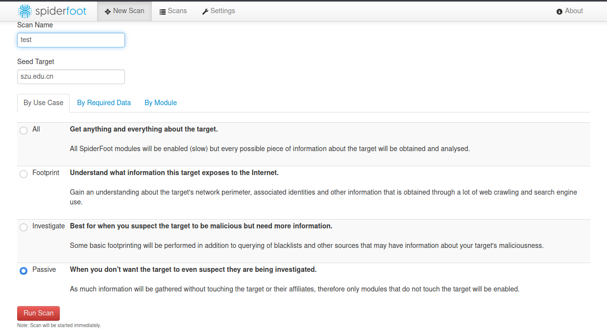

# edu信息收集

参考资料：

[手把手教学 edu src 漏洞挖掘（非常详细）零基础入门到精通，收藏这一篇就够了_edusrc-CSDN博客](https://blog.csdn.net/Javachichi/article/details/140313655)

[edusrc挖掘技巧汇总+信息收集各种姿势 - 先知社区](https://xz.aliyun.com/t/15285?time__1311=GqjxnD0D2DuQGQD%2FirPBKISOYqKxY5i3Px)

[SRC-edu 信息泄露快速刷分上分拓扑思路_src edu-CSDN博客](https://blog.csdn.net/qq_29437513/article/details/124328269)


## 术语

- 足迹分析：系统收集广泛被动信息
- 枚举：主动收集详细数据
- AD：Active Directory，它集中管理内网IT基础架构，且禁止互联网访问


## 域名信息泄露

合法行为，只是查找数据库而已。

第三方网站直接收集：

- [**FOFA**]( https://fofa.info/)

- [**Shodan**](https://www.shodan.io)

- [**Zoomeye**](https://www.zoomeye.org/)

- [**Hunter**](https://hunter.qianxin.com/)

- [**360Quake**](https://quake.360.net)

- [**intelligence**](https://intelx.io/)

- [**DNSDumpster.com巨好用**](https://dnsdumpster.com/)

  

都是挺好用的，避免使用自己的ip进行第一波攻击


建议直接用这个就可以了：[**DNSDumpster.com巨好用**](https://dnsdumpster.com/)


### kali-theHarvervester

Kali-Linux里面可以使用`theHarvester`进行收集，这个工具就是一个集成的，调用这几个存储库进行查询

案例：

```
theHarvester -d "megacorpone.com" -b dnsdumpster,subdomainfinderc99,subdomaincenter -r
```


### DNS记录类型


- NS：名称服务器记录
- A：IPv4地址记录
- AAAA：IPv6地址记录
- MX：邮件交换记录
- PTR反向查找记录
- CNAME：规范名称记录
- TXT：文本记录


## 邮箱信息泄露

[Find email addresses and send cold emails • Hunter](https://hunter.io/)


[Mozilla Monitor](https://monitor.mozilla.org/)


拿着学校的邮箱在一些网站上搜索，可以发现一些子域名下的邮箱，比如老师或者学生的，在邮箱里面找到学号或者工号


## github信息泄露

手工搜集：

```
in:name baidu               #标题搜索含有关键字baidu
in:descripton baidu         #仓库描述搜索含有关键字
in:readme baidu             #Readme文件搜素含有关键字
stars:>3000 baidu           #stars数量大于3000的搜索关键字
stars:1000..3000 baidu      #stars数量大于1000小于3000的搜索关键字
forks:>1000 baidu           #forks数量大于1000的搜索关键字
forks:1000..3000 baidu      #forks数量大于1000小于3000的搜索关键字
size:>=5000 baidu           #指定仓库大于5000k(5M)的搜索关键字
pushed:>2019-02-12 baidu    #发布时间大于2019-02-12的搜索关键字
created:>2019-02-12 baidu   #创建时间大于2019-02-12的搜索关键字
user:name                   #用户名搜素
license:apache-2.0 baidu    #明确仓库的 LICENSE 搜索关键字
language:java baidu         #在java语言的代码中搜索关键字
user:baidu in:name baidu    #组合搜索,用户名baidu的标题含有baidu的
```


比较常用的就是readme和标题、仓库搜索

搜索相关域名，或者学校名的缩写等，查找高危的账号姓名


自动搜集：

GitDorker 是一款github自动信息收集工具，它利用 GitHub 搜索 API 和作者从各种来源编译的大量 GitHub dorks 列表，以提供给定搜索查询的 github 上存储的敏感信息的概述。

https://github.com/obheda12/GitDorker


## Google信息泄露

```
1.site:域名 intext:管理|后 台|登陆|用户名|密码|验证码|系统|帐号|manage|admin|login|system

2.site:域名 inurl:login|admin|manage|manager|admin_login|login_admin|system

3.site:域名 intext:"手册"

4.site:域名 intext:"忘记密码"

5.site:域名 intext:"工号"

6.site:域名 intext:"优秀员工"

7.site:域名 intext:"身份证号码"

8.site:域名 intext:"手机号"

9.site:edu.cn   "无犯罪记录证明" "SFZH" filetype:pdf

10.site:edu.cn   "情况属实,特此证明" "身份证号" filetype:pdf

11.site:edu.cn   "特发此证" "身份证号" filetype:pdf

12.site:edu.cn   "法定代表人" filetype:pdf

13.site:edu.cn  "年月.*" "聘任时间" "SFZH"  filetype:pdf  -学号 -准考证

14.site:edu.cn  "破格*" "SFZH"  filetype:pdf   -学号 -准考证 

15.site:edu.cn  "汉*"  "SFZH" filetype:pdf   -学号 -准考证

16.site:edu.cn   "同意推荐其参评*"  filetype:pdf +SFZH -学号 -准考证 

17.site:edu.cn   "*出版合同"  filetype:pdf +SFZH -学号 -准考证 

18.site:edu.cn   "甲方代表*"   filetype:pdf +SFZH -学号 -准考证

19.site:edu.cn   "甲方代表人"   filetype:pdf +SFZH -学号 -准考证 

20.site:edu.cn "甲方聘请乙方" filetype:pdf +SFZH -学号 -准考证

21.site:edu.cn "甲方的权利和义务" filetype:pdf +SFZH -学号 -准考证 

22.site:edu.cn inurl:"xxx/xxxx" filetype:pdf +SFZH -学号 -准考证

```


这样子可以进行某些搜索，有时候会给你个惊喜

重点查找学号密码

运维手册等等


一个更加好的自动生成的工具：

[Hacker Dork Generator](https://iamunixtz.github.io/LazyDork/)


## 备案号泄露

企查查和小蓝本

爬虫工具进行付费查询

[wgpsec/ENScan_GO: 一款基于各大企业信息API的工具，解决在遇到的各种针对国内企业信息收集难题。一键收集控股公司ICP备案、APP、小程序、微信公众号等信息聚合导出。](https://github.com/wgpsec/ENScan_GO)

上面是最新版


这个是python老版本：[wgpsec/ENScan: 基于各大API的一款企业信息查询工具，为了更快速的获取企业的信息，省去收集的麻烦过程，web端于plat平台上线](https://github.com/wgpsec/ENScan)

```bash
python ENScan.py -k keyword.txt
//keyword.txt里面填企业名称
```


## 密码泄露

查询数据库

https://dehashed.com/

跟踪密码泄露，显示明文密码


## edusrc

关注一下这个学校的网站是什么公司开发的，然后看这个公司有没有爆出最新的day和漏洞，然后趁它没有更新的时候进行打


https://src.sjtu.edu.cn/    重点关注教育漏洞报告平台


http://zone-h.com/?zh=1

https://haveibeenpwned.com

http://testfire.net/

[全能啥都有](http://exploit-db.com)


## whois

```
whois megacorpone.com
```

主动查域名

- 提供域名的注册信息，用于后续的主动信息收集

- 注册商信息，揭示管理域的服务，可以用于社会工程攻击


## 逻辑漏洞


弱口令

登录验证绕过

爆破账户

明文存储密码

忘记密码重置密码绕过


# 手动探查


探查重点：

- 以普通用户身份浏览网站，收集员工姓名、电子邮件、网站支持的技术
- 社交媒体链接，隐私泄露
- 网站技术栈
- 泄露凭证、API密钥
- 电子邮件列表
- 子域名链接


## DNS枚举

手动解析，解析域名为ip地址

```
host 域名
```


自动化枚举：

```
dnsrecon -d 域名 -D dns.txt -t brt

/dns.txt  在 /usr/share/dnsenum/dns.txt
```

DNS爆破取决于字典的质量


## Nmap端口扫描

主机发现：

扫描端口范围

```
sudo nmap -sn 192.168.50.150-155
```


扫描原理，SYN扫描，发送SYN包，如果返回SYN-ACK包，则端口开放。传统上SYN被认为是隐身，因为一些设备不记录半开连接

具体命令去查看nmap区


## SpiderFoot自动化扫描

SpiderFoot开源自动化信息收集工具，kali自带，开启之后就是网页图形化界面给你用了，但注意用的还是你的ip

```
spiderfoot -l 127.0.0.1:8000

然后访问
http://127.0.0.1:8000
```


建议方式不要选All，直接选被动搜集比较好




# 渗透测试流程


## 枚举

- 信息收集
- 搜索引擎、第三方工具
- 主机发现、端口发现、应用发现、应用版本发现、漏洞扫描
- AD重点枚举


## 漏洞评估

- 分析数据并搜索可能存在的漏洞弱点，评估优先级
- 漏洞编号查询，在野漏洞利用
- 判断漏洞是否可用


## 突破边界

- 利用漏洞获得对远程主机的初始访问权，立足点或初始访问
- 以立足点为跳板机，循环枚举内网网段、应用服务
- 社工钓鱼建立立足点


## 权限提升

- 利用系统软件漏洞、权限泄露、机密信息泄露等漏洞获得更高权限
- 本地信息枚举，获得提权方法和途径


## 横向移动

- 扩大对内网的访问权
- 内网中不同计算机控制移动称为横向移动
- 管理员的内网多系统多主机可能会使用重复的密码


## 渗透测试报告

- 你的价值体现
- 客户关注的点
- 管理层能认识风险类型及其大小的途径


# 登录页面测试思路

- 万能密码 `admin' or 1=1 --+`
- 明文传输
- 弱口令爆破
- 用户名枚举
- 未授权
- 返回凭证
- 密码找回
- 短信轰炸
- 验证码暴力
- cookie伪造
- jwt伪造
- 注册admin覆盖
- 目录扫描
