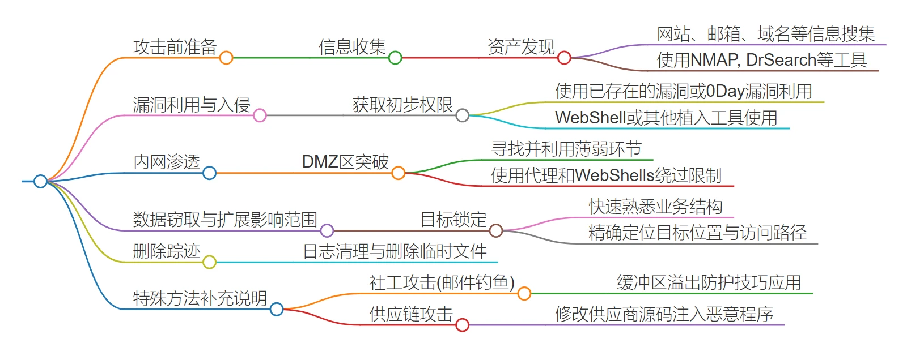

# 红队attack

## 红队流程

第一步是信息收集，包括搜集目标的基本资料和潜在弱点。

- 使用Nmap等扫描工具寻找开放端口和服务。
- Dr Search等搜索公开信息。
-  利用各类搜索引擎挖掘更多细节。 

第二步是漏洞利用，获得初步入侵权限。

-  寻找已知漏洞并尝试利用。
-  如0-day漏洞、NZ/NES等工具。
-  成功后表示取得进展。

第三步是在内部网络继续渗透，扩大战果。

- 收集重要数据或凭证。 
- 查看内网配置，识别关键节点。
- 根据具体环境选择策略，例如活动目录或工作组模式下的不同操作方法。 

第四步是清理痕迹，掩盖行踪。

- 删除临时文件、修改登录记录等。
-  注意反追溯措施的重要性。

此外，提到几种辅助手段和技术，例如：

- 社工攻击（钓鱼邮件）提高成功率；
- 供应链攻击绕过传统防线。

信息收集详情可以看edu信息收集一文

ATT&CK框架

https://attack.mitre.org/tactics

入口权限=>内网搜集=>免杀提权=>抓取登录凭证=>跨平台横向=>入口维持=>数据回传=>定期权限维护

## 信息收集

whois子域名扫描

https://whois.aliyun.com

https://whois.chinaz.com

...

备案信息

http://beian.miit.gov.cn

http://icp.chinaz.com

http://icplishi.com

google hacking

https://www,exploit.db.com/google-hacking-database

IP反查域名，通过域名获取子域名，子域名再查ip

域名查询

http://ip.tool.chinaz.com/

http://ipchaxun.com/

http://site.ip138.com/

目标C段检测

nmap

绕过CDN

多地ping

http://ping.chinaz.com/

http://ping.aizhan.com/

http://www.webkaka.com/Ping.aspx

国外ping

https://ping.eu/ping/

工具

https://github.com/Pluto-123/Bypass_cdn

端口扫描

nmap

## 网站信息收集

- 操作系统
- Web容器类型
- 中间件
- 脚本语言
- 数据库类型
- CMS类型

常见CMS：

- WordPress
- Joomla
- Drupal
- dedecms
- Discuz
- phpcms

在线识别工具：

http://whatweb.bugscaner.com/look/

CMS检测识别工具

wpscan

CMSeek

joomscan

TPscan

敏感文件目录

脚本查找

dirb

dirmap

dirsearch

Nday漏洞

- 后台弱口令
- SSRF
- SQL注入
- 越权
- 命令执行/反序列化
- 任意文件上传/下载
- 文件包含
- XSS业务逻辑漏洞

钓鱼攻击

钓鱼平台搭建

https://xz.aliyun.com/t/11898

https://blog.csdn.net/god_zzZ/article/details/122610708

针对目标的话术模板

常规木马信件

宏，压缩包，捆绑，office漏洞，木马链接

免杀github-ByPassAV

