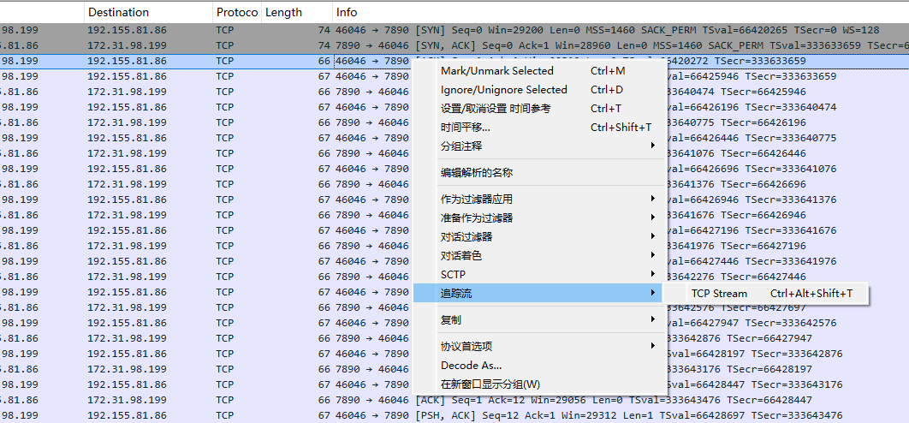
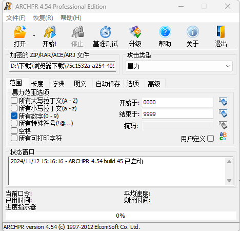

# 流量分析


网络流量分析是指捕捉网络中流动的数据包，并通过查看包内部数据以及进行相关的协议、流量分析、统计等来发现网络运行过程中出现的问题。

CTF比赛中，通常比赛中会提供一个包含流量数据的 PCAP 文件，进行分析。


工具链一般就是`wireshark`、`tcpdump`


本文不说细节点，这东西要见多就懂了，慢慢积累


## 考点分布

- 明文密码
- ping报文信息
- 恶意流量
- 一句话木马
- 压缩包提取解密
- 目录扫描
- 地理信息泄露
- WiFi无线密码解密
- 蓝牙obex文件分段下载
- ftp文件解密
- 键盘流量解密
- 鼠标流量解密
- WebShell流量分析
  - AntSword
  - Behinder
  - Godzilla

- 自定义黑客行为


## 题目


### BUUCTF-easycap


观察嘛，你就观察

全都是TCP流，然后观察到length有点意思，66，67，66，67这样间隔出现

点开第一个66，没东西，第一个67，最后一个有`F`

设想就是67有信息

然后下一个67，L

果然，flag藏在length=67的tcp流，追踪它🐎




改一下形式，就是flag了

```
flag{385b87afc8671dee07550290d16a8071}
```


### BUUCTF-数据包中的线索

题目描述：

公安机关近期截获到某网络犯罪团伙在线交流的数据包，但无法分析出具体的交流内容，聪明的你能帮公安机关找到线索吗？ 注意：得到的 flag 请包上 flag{} 提交

先关注一些上层的协议，如http、ftp等

直接过滤器


看了一下，最后一个好多东西

不到啊，哥们啥也不懂

直接看到后面一个等于号就应激反应了

直接一些在线网站，或者随波逐流转base64为图片即可


我测，这不那谁嘛？

```
flag{209acebf6324a09671abc31c869de72c}
```


### BUUCTF-被偷走的文件

题目描述：

一黑客入侵了某公司盗取了重要的机密文件，还好管理员记录了文件被盗走时的流量，请分析该流量，分析出该黑客盗走了什么文件。 注意：得到的 flag 请包上 flag{} 提交


这道题有非预期，压根就不用打开wireshark了，因为在binwalk眼里pcap和rar拼在一起，直接binwalk分离即可

啥提示都没有，那就是爆破，啥提示都没有那就是4位数，你问我为什么， 你去问出题人



压缩包密码 `5790`

解压出一个`flag.txt`

拿到flag

```
flag{6fe99a5d03fb01f833ec3caa80358fa3}
```


预期就是打开wireshark

然后搜ftp，可以看到一个Request： RETR flag.rar

然后搜索ftp-data

或者直接看也行，可以看到一个rar压缩包的数据


### BUUCTF-秘密文件

题目描述：

深夜里，Hack偷偷的潜入了某公司的内网，趁着深夜偷走了公司的秘密文件，公司的网络管理员通过通过监控工具成功的截取Hack入侵时数据流量，但是却无法分析出Hack到底偷走了什么机密文件，你能帮帮管理员分析出Hack到底偷走了什么机密文件吗？ 注意：得到的 flag 请包上 flag{} 提交


一样非预期，binwalk分离，爆破密码，得到压缩包密码`1903`

得到flag

```
flag{d72e5a671aa50fa5f400e5d10eedeaa5}
```


预期，还是打开wireshark

过滤器为ftp，就可以看到泄露的文件了


然后在上下文的附近找一下就有了


### BUUCTF-菜刀666

题目描述：

流量分析，你能找到flag吗 注意：得到的 flag 请包上 flag{} 提交


菜刀懂得都懂，这道题就是考菜刀的报文结构了


直接过滤器设为http

可以意料到的是，全部POST /upload/1.php   应该都是webshell的命令

流量包附近再看

可以看到


它上传了`6666.jpg` 、`flag.txt` 、`hello.zip`


往上找发现有一个


太多零了，太有规律了，直接看z2=FFD8············FFD9   那一大段的东西转成jpg图片形式即可：

```python
s=''
import binascii
out=open('keyword.jpg','wb')
out.write(binascii.unhexlify(s))
out.close()
```

get到密码：

```
Th1s_1s_p4sswd_!!!
```

然后再`foremost`分离,可以得到一个zip

输入密码就可以拿到flag了

```
flag{3OpWdJ-JP6FzK-koCMAK-VkfWBq-75Un2z}
```


### 网鼎杯-青龙组初赛Misc01

题目描述：某单位网络遭到非法的攻击，安全人员对流量调查取证之后保存了关键证据，发现人员的定位信息存在泄露，请对其进行分析。flag为用户位置信息进行32位md5哈希值

提交的flag格式：wdflag{xxxxx}


题目考点是了解一个新的协议嘛，文件名也做了提示MME

发现流量包中的协议主要有：`DIAMETER`、`S1AP/NAS-EPS`、`GTPv2`、`S1AP`

问一问GPT，发现 `DIAMETER`、`GTPv2` 是比较可能的方向


慢慢看，发现一个`diameter.EPS-Location-Information`

下面再发现一个`MME-Location-Information`

往里面找，发现一个

`diameter.E-UTRAN-Cell-Global-Identity`

值为：

`802f208f26ae77`


答案：

```
wdflag{f9243fa9f18aec525ccb1ea3bd5dd190}
```


### 网鼎杯-青龙组初赛Misc03

题目描述：近日某公司服务器遭到恶意攻击，随后公司立即对流量监测系统中遭受攻击时段的流量进行了取证，但是公司某一网络安全实习生进行分析溯源后并未找到攻击者的攻击IP，于是公司决定将这个任务重新交给更具经验的你来进行，接手工作后，你立即对其进行了深入调查！

提交的flag格式：wdflag{攻击IP}


打开Ipv4统计


看到第一个ip就是答案了，用wdflag包一下，其他都是干扰项，就是跳板机扫网站

```
wdflag{39.168.5.60}
```


### BugKu-ping

下载下来，wireshark打开，发现全是ICMP报文，并且每一个都一样长

点开一两个看看

发现报文最后面的字符就是flag的内容

- 做法0：

手动拼接，真正意义上的ping

- 做法1：

python提取

```python
from scapy.all import * 

packets = rdpcap('ping.pcap') 
flag = '' 
for packet in packets: 
    flag=flag+chr(packet[Raw].load[0]) 
    print(flag)
```


- 做法2：

```bash
tshark -r ping.pcap -T fields -e data.data | cut -c -2 | awk '{printf($1)}'
```


拿到flag：

```
flag{dc76a1eee6e3822877ed627e0a04ab4a}
```

