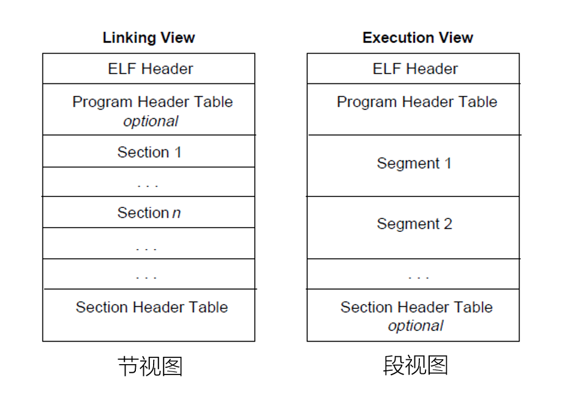
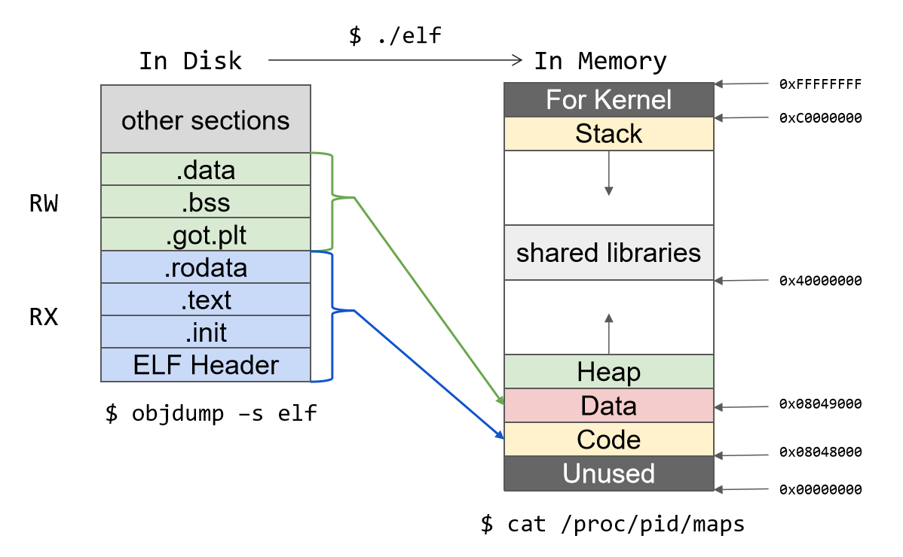
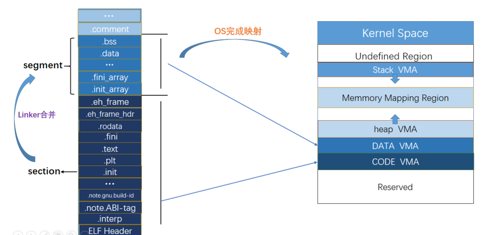
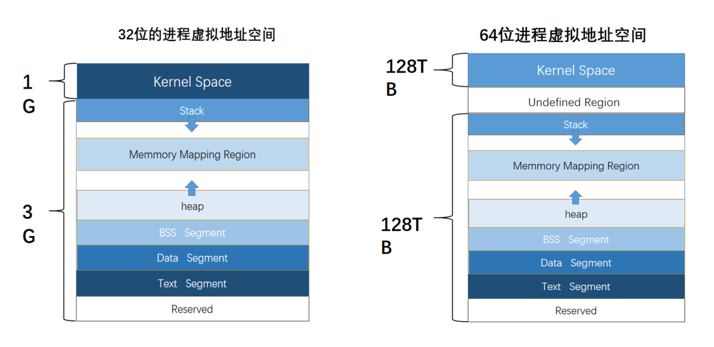
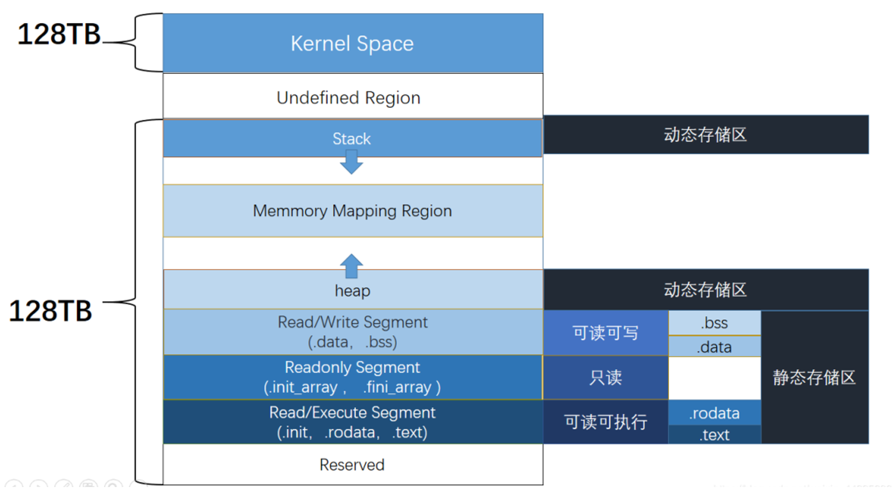
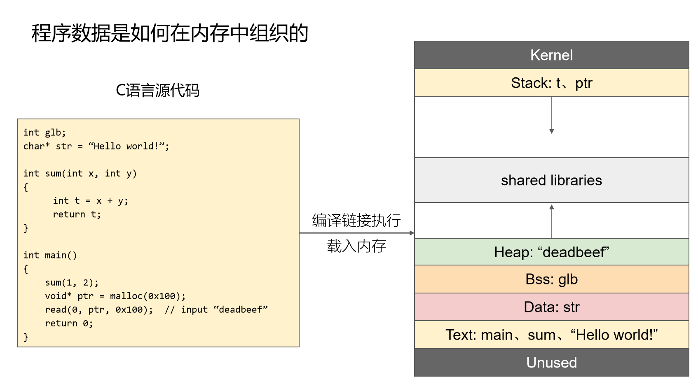

# ELF文件


## 编译原理


编译过程大概可以分为下面5个步骤：

- 词法分析：输出有意义的词素
- 语法分析：根据词法单元的第一个分量构建树型的中间表示形式，语法树
- 语义分析：检测源程序是否满足语言定义的语义约束，收集类型信息，生成代码、类型检查、类型转换
- 中间代码生成和优化：生成类机器语言的中间表示，三地址码
- 代码生成和优化：中间表示形式映射到目标机器语言


具体到GCC编译过程主要是四阶段：

- 预处理(Preprocess)，就是处理预处理指令、注释、行号、文件名标识等等
- 编译(Compile)，翻译成汇编代码
- 汇编(Assemble)，将汇编代码按照对照表进行翻译成对应的机器码
- 链接(Link)，动态或者静态链接，程序所需要的链接库，主要包括地址、空间分配、符号绑定、重定位


GCC编译过程使用的工具链为`ccl`、 `as`、 `collect2` 这三个工具


- `ccl`编译器，对应预处理和编译，将`hello.c` 编译为`hello.s` 
- `as` 汇编器，将`hello.s` 汇编成`hello.o` 目标文件
- `collect2` 是`ld`命令的封装，将C语言运行是时的库(CRT)中的目标文件以及所需要的动态链接库链接到可执行文件中


## Unix-ELF


ELF文件主要有四种类型：

- `.exec` 可执行文件，就是程序
- `.rel` 可重定位文件，`.o` 文件，PIC，尚未链接的文件
- `.dyn` 共享目标文件，动态链接库文件
- `core dump` 核心转储文件，进程意外终止是的进程地址空间的转储


狭义的来说，常说的ELF文件都是指第一种的可执行文件


## ELF文件结构

ELF文件头

在Linux可以使用该指令进行查看

```
readelf -h file
```

头部为 `7f 45 4c 46`


系统将目标文件分为很多节，可是使用`-S` 进行查看

```
readelf -S file
```


下面给出ELF文件中常见的节

| 节名                  | 说明                                                         |
| --------------------- | ------------------------------------------------------------ |
| `.comment`            | 版本控制信息，如编译器的版本                                 |
| `.debug_XXX`          | DWARF格式的调试信息                                          |
| `.strtab`             | 字符串表                                                     |
| `.shstrtab`           | 节名的字符串表                                               |
| `.symtab`             | 符号表                                                       |
| `.dynamic`            | `ld.so`使用的动态链接库                                      |
| `.dynstr`             | 动态链接的字符串表                                           |
| `.dynsym`             | 动态链接的符号表                                             |
| `.got`                | 全局偏移量表(global offset table)，用于保存全局变量引用的地址 |
| `.got.plt`            | 全局偏移量表，用于保存函数引用的地址                         |
| `.plt`                | 过程链接表(procedure linkage table)，用于延迟绑定            |
| `.hash`               | 符号哈希表                                                   |
| `.rela.dyn`           | 变量的动态重定位表                                           |
| `.rela.plt`           | 函数的动态重定位表                                           |
| `.rel.text/rela.text` | 静态重定位表                                                 |
| `.rel.XXX/rela.XXX`   | 其他节的静态重定位表                                         |
| `.note.XXX`           | 额外的编译信息                                               |
| `.eh_frame`           | 用于操作异常的`frame unwind` 信息                            |
| `.init/.fini`         | 程序初始化和终止的代码                                       |


## 磁盘与内存中的ELF

磁盘中的ELF（可执行文件）和内存中的ELF（进程内存映像）




运行中的映射情况如下：



这张图需要注意几点，`Stack`从高地址向低地址生长，`heap`从低地址向高地址生长。


## 进程虚拟地址空间

ELF文件运行的时候系统完成对虚拟地址空间的映射：




虚拟内存中：

- 用户空间每个进程一份
- 内核空间每个进程共享一份
- mmap段中的动态链接库，仅在物理内存中装载一份


在学习的32位和64位的进程虚拟地址空间中布局基本一致：




以64位为例，具体情况如下：





在这里引入段（segment）与节（section）的概念

- 代码段包含了代码与只读数据
- 数据段包含了可读可写数据
- 栈段


一个段包含多个节，如代码段包含：

- text
- rodata
- hash
- dynsym
- dynstr
- plt
- rel.got
- 。。。。。


==段视图用于整体把握进程的内存区域的rwx权限的划分==

==节视图用于ELF文件编译链接的时候与在磁盘上存储时的文件结构的组织==


程序举例：




## 静态链接


链接由链接器完成，分为

- 编译时链接，ct
- 加载时链接，lt
- 运行时链接，rt


一般后缀为`.a` 的文件就是静态链接库文件


## 动态链接

免去浪费磁盘和内存空间的问题

但是引入了PIC和延迟绑定


由于一个程序的数据段和代码段的相对距离总是保持不变的，所以指令和变量之间的距离是一个常量，于是引入GOT，位于数据段的开头，保存全局变量和库函数的引用，在加载的时候会进行重定位。

后面引入RELRO机制，将GOT分为GOT和GOT.PLT ，前者保存全局变量引用，内存中只读。后者保存函数引用，可读可写


一般文件后缀为`.so` 的就是动态链接库文件


## 延迟绑定

一个非常非常重要的机制

就是当函数第一次被调用，动态链接器才回去进行符号查找、重定位等操作

实现原理，利用plt和got来进行实现


plt段的PLT是一个数组，

- PLT[0]，跳转到动态链接库
- PLT[1]，调用系统启动函数`_libc_start_main()`
- PLT[2]，被调用的各个函数条目


.got.plt段的got也是一个数组

- GOT[0]，动态链接器在解析函数地址时候所需要的两个地址(.dynamic 和 relor 条目)
- GOT[1]，同GOT[0]
- GOT[2]，动态链接器`ld-linux.so`的入口
- GOT[3]，被调用的函数条目


调用`func`函数时：

```
call --> func@plt --> plt[0]=func@GOT --> push GOT[1] --> GOT[2] --> GOT[4]=func --> func
```


1. 函数地址的基本概念
   - **静态函数地址（编译时确定）**：在编译程序时，每个函数在二进制文件内部有一个相对的偏移地址。这个地址是基于二进制文件的布局确定的，例如在 ELF 文件的代码段（`.text`段）中，函数按照编译顺序排列，它们之间有相对固定的偏移。像`elf.sym['function_name']`获取的就是这种在编译阶段确定的函数在 ELF 文件中的相对地址。
2. PLT（过程链接表）和 GOT（全局偏移表）的作用与关系
   - PLT 的作用
     - **延迟绑定**：PLT 主要用于实现延迟绑定机制。当程序调用一个外部函数（如`libc`中的函数）时，它首先会进入 PLT。以`puts`函数为例，程序代码中调用`puts`时，实际上是跳转到`puts@plt`（`puts`在 PLT 中的入口）。在程序刚开始运行时，PLT 中的条目只包含跳转到动态链接器（`ld - linux.so`）的代码，而不是真正的函数地址。
     - **代码位置固定**：PLT 在 ELF 文件中有固定的位置，它是程序代码段的一部分。`elf.sym['puts']`获取的函数地址可能就是`puts`在 PLT 中的地址（对于外部函数）。
   - GOT 的作用
     - **存储真实地址**：GOT 用于存储外部函数在内存中的实际运行时地址。当动态链接器解析了外部函数的地址后，会将这个地址填充到 GOT 对应的条目中。例如，`elf.got['puts']`获取的是`puts`函数在 GOT 中的地址，这个地址所存储的值就是`puts`函数在内存中的实际运行时地址。
     - **动态更新**：在程序运行初期，GOT 中的外部函数地址可能是未填充的（初始化为一些特殊值），当第一次调用外部函数时，动态链接器会被触发去解析函数地址并填充到 GOT 中。
   - 两者的关系
     - **PLT 间接调用 GOT**：当程序通过 PLT 调用外部函数时，PLT 中的代码会间接跳转到 GOT 中存储的函数实际地址。具体来说，PLT 中的代码会先检查 GOT 中对应函数地址是否已经解析，如果没有解析，就会调用动态链接器来解析地址并填充到 GOT，然后跳转到 GOT 中的地址执行函数。
