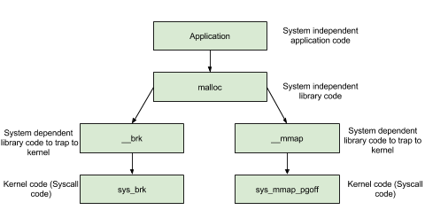

# pwn堆入门

参考资料：

[堆利用 - CTF Wiki](https://ctf-wiki.org/pwn/linux/user-mode/heap/ptmalloc2/introduction/)

[「Pwn教学」有趣的Pwn博主的Unlink堆攻击教学_哔哩哔哩_bilibili](https://www.bilibili.com/video/BV1kP4y1k7RD/?spm_id_from=333.337.search-card.all.click&vd_source=f264368eefdba6c9e52d63931d176453)

入门还是以glibc为主


## 定义

什么是堆？


在程序运行过程中，堆可以提供动态分配的内存，允许程序申请大小未知的内存。

由低地址向高地址方向增长。


在Linux里面有一个基本的内存管理思想，就是只有当真正访问一个地址的时候，系统才会建立虚拟页面和物理页面的映射关系


CTF比赛中有关堆的PWN题大多是基于Linux的ptmalloc2-glibc堆块管理机制的。

## glibc里的堆操作


一般C++、C里面经常可以遇到关于申请堆的操作


malloc

**函数原型：**

```c
void *malloc(size_t size);
```

**作用：**

- `malloc` 用于从堆上分配一块指定大小的内存，并返回指向这块内存的指针。该内存块中的内容是未初始化的，即内存中的数据是随机的。
- 如果分配失败，则返回 `NULL`。


`free` 函数原型

```c
void free(void *ptr);
```

作用

- `free` 释放由 `malloc`、`calloc` 或 `realloc` 分配的内存块。
- 在释放内存之前，`ptr` 必须指向有效的、动态分配的内存块。释放后，`ptr` 变得无效，但该指针本身不会自动置为 `NULL`，所以它仍然可以被访问（如果没有明确设为 `NULL`）。


内存分配中又涉及到系统调用


图来源与Ctf-Wiki



可以清楚看到只有调用brk的时候，堆段才会出现


## 堆结构

malloc申请出来的用户内存叫做`chunk`

一般结构如下：

```c
struct malloc_chunk {

  INTERNAL_SIZE_T      prev_size;  /* Size of previous chunk (if free).  */
  INTERNAL_SIZE_T      size;       /* Size in bytes, including overhead. */

  struct malloc_chunk* fd;         /* double links -- used only if free. */
  struct malloc_chunk* bk;

  /* Only used for large blocks: pointer to next larger size.  */
  struct malloc_chunk* fd_nextsize; /* double links -- used only if free. */
  struct malloc_chunk* bk_nextsize;
};
```

```
size_t` 被定义为 `unsigned long
```


解释一下结构体：

- **prev_size**, 如果该 `chunk` 的 **物理相邻的前一地址 chunk（两个指针的地址差值为前一 chunk 大小）** 是空闲的话，那该字段记录的是前一个 `chunk` 的大小 (包括 `chunk` 头)。否则，该字段可以用来存储物理相邻的前一个 chunk 的数据。
- **size** ，该 `chunk` 的大小，大小必须是 `MALLOC_ALIGNMENT` 的整数倍。如果申请的内存大小不是 `MALLOC_ALIGNMENT` 的整数倍，会被转换满足大小的最小的 `MALLOC_ALIGNMENT` 的倍数，这通过 `request2size()` 宏完成。
- fd 指向下一个（非物理相邻）空闲的 `chunk` 。
- bk 指向上一个（非物理相邻）空闲的 `chunk` 。
- fd_nextsize 指向前一个与当前 `chunk` 大小不同的第一个空闲块，不包含 bin 的头指针。
- bk_nextsize 指向后一个与当前 `chunk` 大小不同的第一个空闲块，不包含 bin 的头指针。


## 堆的数据结构


### Unlink

unlink将双向链表（只存储空闲的chunk）中的一个元素取出来，在malloc和free中使用

实现宏为：

```c
/* Take a chunk off a bin list */
// unlink p
#define unlink(AV, P, BK, FD) {                                           
    // 由于 P 已经在双向链表中，所以有两个地方记录其大小，所以检查一下其大小是否一致。
    if (__builtin_expect (chunksize(P) != prev_size (next_chunk(P)), 0))     
      malloc_printerr ("corrupted size vs. prev_size");             
    FD = P->fd;                                                                     
    BK = P->bk;                                                                     
    // 防止攻击者简单篡改空闲的 chunk 的 fd 与 bk 来实现任意写的效果。
    if (__builtin_expect (FD->bk != P || BK->fd != P, 0))                      
      malloc_printerr (check_action, "corrupted double-linked list", P, AV);  
    else {                                                                     
        FD->bk = BK;                                                              
        BK->fd = FD;                                                              
        // 下面主要考虑 P 对应的 nextsize 双向链表的修改
        if (!in_smallbin_range (chunksize_nomask (P))                              
            // 如果P->fd_nextsize为 NULL，表明 P 未插入到 nextsize 链表中。
            // 那么其实也就没有必要对 nextsize 字段进行修改了。
            // 这里没有去判断 bk_nextsize 字段，可能会出问题。
            && __builtin_expect (P->fd_nextsize != NULL, 0)) {                     
            // 类似于小的 chunk 的检查思路
            if (__builtin_expect (P->fd_nextsize->bk_nextsize != P, 0)             
                || __builtin_expect (P->bk_nextsize->fd_nextsize != P, 0))    
              malloc_printerr (check_action,                                      
                               "corrupted double-linked list (not small)",    
                               P, AV);                                              
            // 这里说明 P 已经在 nextsize 链表中了。
            // 如果 FD 没有在 nextsize 链表中
            if (FD->fd_nextsize == NULL) {                                      
                // 如果 nextsize 串起来的双链表只有 P 本身，那就直接拿走 P
                // 令 FD 为 nextsize 串起来的
                if (P->fd_nextsize == P)                                      
                  FD->fd_nextsize = FD->bk_nextsize = FD;                      
                else {                                                              
                // 否则我们需要将 FD 插入到 nextsize 形成的双链表中
                    FD->fd_nextsize = P->fd_nextsize;                              
                    FD->bk_nextsize = P->bk_nextsize;                              
                    P->fd_nextsize->bk_nextsize = FD;                             
                    P->bk_nextsize->fd_nextsize = FD;                             
                  }                                                            
              } else {                                                             
                // 如果在的话，直接拿走即可
                P->fd_nextsize->bk_nextsize = P->bk_nextsize;                      
                P->bk_nextsize->fd_nextsize = P->fd_nextsize;                      
              }                                                                     
          }                                                                   
      }                                                                           
}
```


简单来说就是：

```
FD = P -> fd;
BK = p -> bk;
FD -> bk = BK;
BK -> fd = FD;
```


上述有漏洞，可以泄露libc地址或者堆地址

- libc 地址
  - P 位于双向链表头部，bk 泄漏
  - P 位于双向链表尾部，fd 泄漏
  - 双向链表只包含一个空闲 chunk 时，P 位于双向链表中，fd 和 bk 均可以泄漏
- 泄漏堆地址，双向链表包含多个空闲 chunk
  - P 位于双向链表头部，fd 泄漏
  - P 位于双向链表中，fd 和 bk 均可以泄漏
  - P 位于双向链表尾部，bk 泄漏


缺少很多知识。。。。。


## 堆溢出

很显然就是向堆块写数据的时候超过分配给它的字节空间，导致数据溢出，覆盖物理相邻的高地址的下一个堆块


一般CTF或者实战中堆溢出分为几步：

- 寻找堆分配函数
- 寻找危险函数
- 确定填充长度


堆分配函数这个好理解，就是找malloc、calloc（分配的时候会自动清空，这对我们来说就是一个surprise）

还有就是realloc，会自动进行malloc和free的条件分配

- 当 realloc(ptr,size) 的 size 不等于 ptr 的 size 时
  - 如果申请 size > 原来 size
    - 如果 chunk 与 top chunk 相邻，直接扩展这个 chunk 到新 size 大小
    - 如果 chunk 与 top chunk 不相邻，相当于 free(ptr),malloc(new_size)
  - 如果申请 size < 原来 size
    - 如果相差不足以容得下一个最小 chunk(64 位下 32 个字节，32 位下 16 个字节)，则保持不变
    - 如果相差可以容得下一个最小 chunk，则切割原 chunk 为两部分，free 掉后一部分
- 当 realloc(ptr,size) 的 size 等于 0 时，相当于 free(ptr)
- 当 realloc(ptr,size) 的 size 等于 ptr 的 size，不进行任何操作


危险函数，

这里不是指栈溢出中的危险函数，那都直接system了，这里指的是一些无限制输入输出的函数，比如gets、scanf、sprintf

又或者一些判断特性，如strcpy、strcat


确定填充长度

这里主要是计算写入的地址和覆盖的地址之间的距离

注意大小对齐


## 利用姿势：

### 普通堆溢出（Basic Heap Overflow）：

- 程序直接覆盖堆上相邻的数据结构或变量，导致内存错误或程序异常行为。

### 堆上溢出与堆喷射（Heap Spraying）：

- 攻击者在堆上填充大量恶意数据，使得程序能够执行一个恶意载荷。通过在堆上“喷射”恶意代码段，可以在堆溢出时将控制权转移到特定位置。

### 堆双重释放（Double Free）：

- 程序释放相同的内存两次。通过这个漏洞，攻击者可以修改堆管理数据结构（如`malloc`的自由链表），进而控制堆内存的分配和释放，最终实现任意代码执行。

### 堆块合并/拆分：

- 利用堆块合并时的不当处理，操控内存块的合并和分配逻辑，通过堆管理机制来达成溢出、信息泄露或控制转移。

### 伪造堆数据结构：

- 攻击者通过构造特定的数据结构并覆盖堆上的元数据（如前后指针、堆块大小等）来修改堆内存分配逻辑，从而控制程序流。


### Use-After-Free

- 内存块被释放后，其对应的指针没有被设置为 NULL ，然后在它下一次被使用之前，没有代码对这块内存块进行修改
- 内存块被释放后，其对应的指针没有被设置为 NULL，但是在它下一次使用之前，有代码对这块内存进行了修改


只要他是删除的时候只是free，没有设置为null，就可能有Use After Free


案例程序：

```c
#include <stdio.h>
#include <string.h>
#include <malloc.h>
#include <stdlib.h>
unsigned long long target[100];
int main(){
    unsigned long long *p = malloc(0x10);
    free(p);
    p[0] = target;		// p_chunk -> fd is modified
    target[0] = 0;		// prev_size
    target[1] = 0x21;	// size
    malloc(0x10);		// must be same as p
    char *q = malloc(0x10);		// must be same as target
    memcpy(q,"hello",6);
    printf("%s\n",&target[2]);
    return 0;
}
```


案例：

pwn141

思路：

- 申请 note0，real content size 为 16（大小与 note 大小所在的 bin 不一样即可）
- 申请 note1，real content size 为 16（大小与 note 大小所在的 bin 不一样即可）
- 释放 note0
- 释放 note1
- 此时，大小为 16 的 fast bin chunk 中链表为 note1->note0
- 申请 note2，并且设置 real content 的大小为 8，那么根据堆的分配规则
- note2 其实会分配 note1 对应的内存块。
- real content 对应的 chunk 其实是 note0。
- 如果我们这时候向 note2 real content 的 chunk 部分写入 magic 的地址，那么由于我们没有 note0 为 NULL。当我们再次尝试输出 note0 的时候，程序就会调用 use函数。

具体去看那个


### Unlink

glibc管理内存会倾向把两个不需要的内存空间合并起来，避免碎片化内存

Unlink操作则是把两个物理相邻的堆块合并，变成一个新的，但是同时因为Bin是用双向列表链接的，


利用：


### Off-By-One


Off by one和off by null都是一种发生在程序中的非预期函数功能，指非预期的溢出1个字节，或者非预期地溢出“\x00”这个nu字节。其利用手法，涉及libcmalloc函数中的前向合并和后向合并。为了不让概念混淆，在此，我认为，前向合并，是指内存堆块，向低地址方向合并;后向合并，是指内存堆块，向程序地高地址方向合并。Off by one和off by nul，一般地利用手法，是用来做堆叠或者布局(风水)。


堆叠

就是可先来介绍堆叠，因为off by系列的目的之一，以用来做“堆叠”那先要明确目的(其实，先从目的讲或者先从过程讲，都不是很完美)。在堆叠中，一般有向前叠，或者向后叠两种。堆鲁使用前向合并的逻辑比较多，后向合并的逻辑，模板化的利用，我倒是暂时还没见过。原因是，做堆香，有个难点，是前后向合并逻辑中的unlink宏。这个宏，会检查堆块的size和下一个堆块记录的prev size是否相等，不相等的话，unlink这个堆块，就会报错。


所以，前向合并的逻辑，比较好走通。因为，可以forge下-个堆块的prev size。后向合并的逻辑，，一般不走，因为它涉及下下个堆块的prev inuse bit。向后堆看，一般用libc堆的perfect fit来绕。意思是，不让程序，把unsorted bin中的堆放到其它bins里，而是因为大小正好相等，而直接被分配出来这样子，就躲过了放到bins里，然后unlink拿出来，然后被切。之前说过，unlink时会报错。