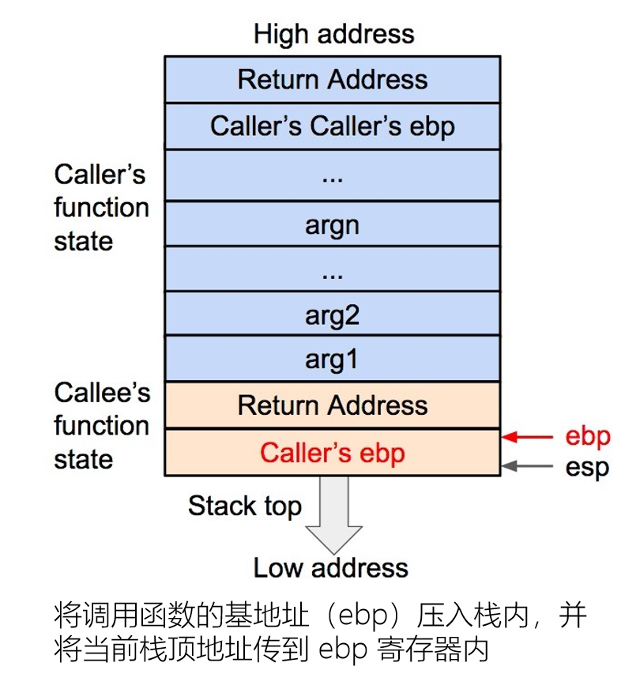
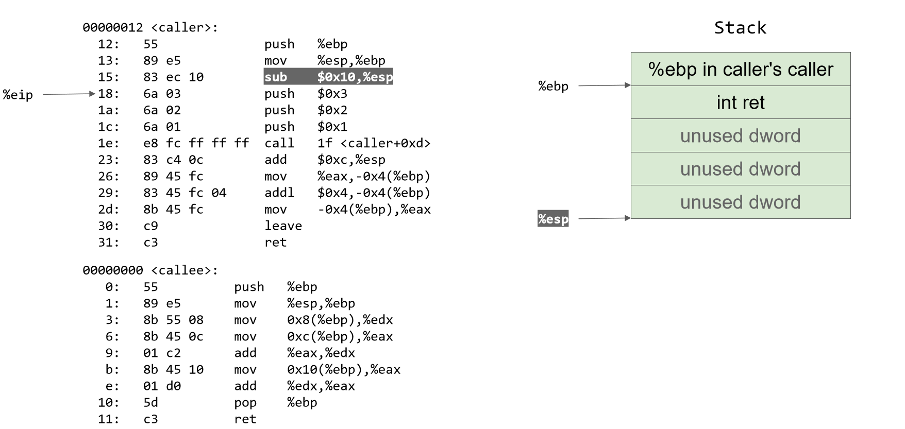
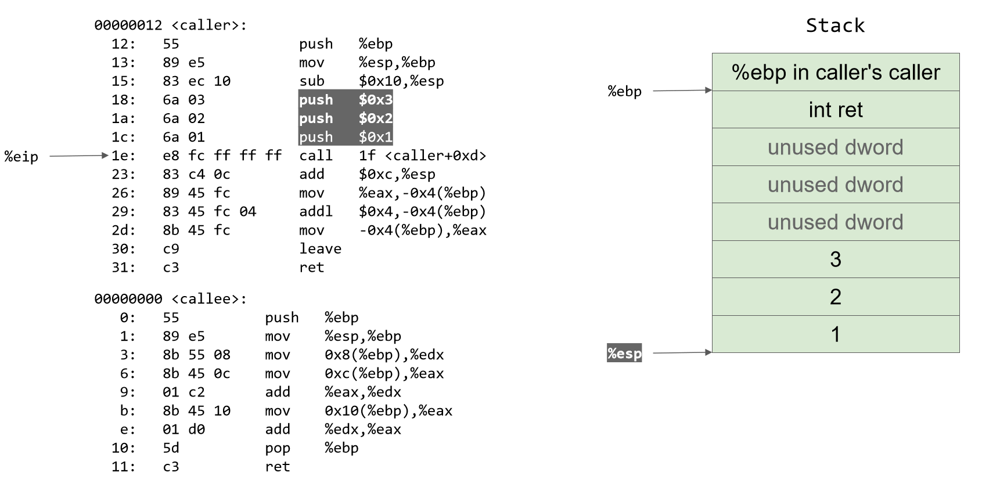

# pwn栈入门


## 栈帧结构


- 函数调用栈：程序运行时内存一段连续的区域，用来保存函数运行时的状态信息，包括函数参数与局部变量等
- 函数调用栈在内存中从高地址向低地址生长，所以栈顶对应的内存地址在压栈时变小，退栈时变大。


## 函数调用栈的大致过程

### esp存储栈顶

### ebp存储当前函数/传参

### eip存储下一个要执行的指令

函数状态主要涉及三个寄存器

- `esp`：存储函数调用栈的栈顶地址，在压栈和退栈的时候发生变化
- `ebp` :  存储当前函数状态的基地址，在函数运行时不变，可以用来索引确定函数参数或局部变量的位置
- `eip` : 用来存储即将执行的程序指令的地址，cpu就是依照eip的存储内容读取指令并执行，此时eip指向下一条要执行的指令，通常时上一个指令的相邻指令


函数调用的核心从汇编上来看就是保护现场，还原现场


### 1.压入被调函数的参数

这里定义调用函数为caller，被调用函数为callee


如果callee需要传参，那就将callee的参数逆序依次压入栈中，没有的话就没有这一步：


### 2.压入下一条指令地址


将调用函数caller进行调用之后的下一条指令地址作为返回地址压入栈内。

用于保存caller的eip信息。


### 3.压入当前调用函数的基地址

`勘误：==图中的栈顶的ebp是callee的==`


将当前调用函数的基地址，也就时当前的ebp寄存器的值压入栈内，并且将ebp寄存器的值更新为当前栈顶的地址。

用于保存调用函数caller的ebp内存着的基地址信息得以保存。

ebp被更新为被调用函数callee的基地址。




### 4.压入被调用函数的局部变量


将被调用函数callee的局部变量等数据压入栈内


下面就是恢复现场

### 5.弹出被调函数的局部变量


被调用函数的局部变量会从栈内直接弹出，栈顶会指向被调用函数callee的基地址


### 6.弹出调用函数的基地址

将基地址内存储的调用函数caller的基地址从栈内弹出，然后存在ebp寄存器内。这样调用函数caller的ebp信息得以恢复，此时栈顶会指向返回地址


### 7.弹出返回地址，恢复eip

将返回地址从栈内弹出，并存在eip寄存器内，这样调用函数caller的eip信息就会得到恢复

至此调用函数caller的函数状态就全部恢复了，之后就是执行调用函数的指令了。


## 程序展示

假设有如下调用关系：

```c
int callee(int a,int b,int c){
    return a+b+c;
}

int caller(void){
    int ret;
    ret = callee(1,2,3);
    ret+=4;
    return ret;
}
```


函数调用栈的工作方式：cdecl

多图警告：







gif图


## 不同系统传参区别


x86

- 使用栈来传参
- 使用eax存放返回值


amd64

- 前六个参数依次存放于`rdi` 、`rsi`、 `rdx` 、`rcx` 、`r8`、`r9`寄存器中
- 第7个及以后的参数存放在栈中


## 缓冲区溢出

写入的数据覆写了合法内存区域

- 栈溢出
- 堆溢出
- Data段溢出


## 传参的时候要加个p32（0）的原因


因为system的时候，函数调用会自动压入ebp，所以system调用的参数是下一个p32的地方


先传参，再执行函数


## 栈溢出32位和64位的区别


## ret2csu

劫持泛称

`_libc_csu_init `

ROP的一种，并不成为大类

作为布置场景的函数，就是将值填入很多寄存器中

控制rdx、rsi、edi的低32位


