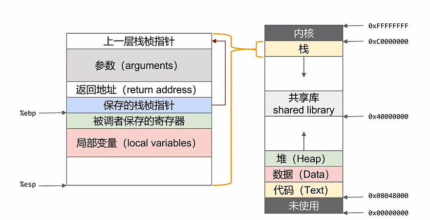

# pwn汇编


- mov
- lea
- add/sub
- push
- pop
- cmp
- jmp
- j
- call
- leave
- ret
- nop滑梯，硬编码，nop可以绕过ASLR


重点掌握


MOV

```
MOV DEST,SRC		; 将源操作数传送给目标
```


LEA

```
LEA REG,SRC			; 将源操作数的有效地址送给指定的寄存器
```


PUSH

```
PUSH VALUE 			; 把目标值压栈，同时SP指针-1字长
```


POP

```
POP DEST			; 将栈顶的值弹出至目的存储位置，同时SP指针+1字长
```


LEAVE

```
在函数返回时，恢复父函数栈帧的指令
```

就是将ebp和esp拉到相同的位置


- MOV esp ebp
- pop ebp
- 此时ebp在若是恶意地址，那就实现栈迁移


RET

```
在函数返回时，控制程序执行流返回父函数的指令
等效于：
POP RIP（这条指令并不存在，就是意思是这个意思）
```


`intel` 和 `AT&T` 汇编的两种风格：


注意，intel操作数在右边，二AT&T在左边


push ebp就等于将ebp的值保存到栈中，并且将当前esp下移

pop ebp就等于将ebp的值从栈中取出来，将ebp指向这个值


## 函数跳转时候的栈变化

函数调用可以分解为如下步骤：

- 父函数将调用参数从后向前压栈
- 将返回地址压栈保存
- 跳转到子函数起始地址执行
- 子函数将父函数栈帧起始地址 rpb 压栈
- 将 rbp 的值设置为当前 rsp 的值，即将 rbp 指向子函数栈帧的起始地址

上述过程中，保存返回地址和跳转到子函数处执行由 call 一条指令完成，在 call 指令执行完成时，已经进入了子程序中，因而将上一栈帧 rbp 压栈的操作，需要由子程序来完成


返回：

函数返回时，返回值保存在 rax 寄存器中。之后需要将栈的结构恢复到函数调用之前的状态，并跳转到父函数的返回地址处继续执行
由于函数调用时已经保存了返回地址和父函数栈帧的起始地址，要恢复到子函数调用之前的父栈帧，我们只需要执行以下两条指令：


## 调用函数

调用一个函数时，先将堆栈原先的基址（EBP）入栈，以保存之前任务的信息。然后将栈顶指针的值赋给EBP，将之前的栈顶作为新的基址（栈底），然后再这个基址上开辟相应的空间用作被调用函数的堆栈。函数返回后，从EBP中可取出之前的ESP值，使栈顶恢复函数调用前的位置；再从恢复后的栈顶可弹出之前的EBP值，因为这个值在函数调用前一步被压入堆栈。这样，EBP和ESP就都恢复了调用前的位置，堆栈恢复函数调用前的状态。





## 六十四位汇编传参

参数少于7，参数从左到右放入寄存器，rdi，rsi，rdx，rcx，r8，r9

参数大于7，前六个一样，但是后面是从右向左放入栈中，和32汇编一样

实例：

 H(a, b, c, d, e, f, g, h);

 a->%rdi, b->%rsi, c->%rdx, d->%rcx, e->%r8, f->%r9 

h->8(%esp) g->(%esp) 

call H

也就是说传入参数要去寻找对应的寄存器，多少个参数就找多少个寄存器