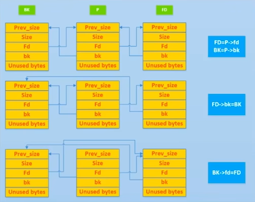

# 堆入门

参考资料：

[堆利用 - CTF Wiki](https://ctf-wiki.org/pwn/linux/user-mode/heap/ptmalloc2/introduction/)

[「Pwn教学」有趣的Pwn博主的Unlink堆攻击教学_哔哩哔哩_bilibili](https://www.bilibili.com/video/BV1kP4y1k7RD/?spm_id_from=333.337.search-card.all.click&vd_source=f264368eefdba6c9e52d63931d176453)

入门还是以glibc为主


## 利用姿势：

### Use-After-Free

- 内存块被释放后，其对应的指针没有被设置为 NULL ，然后在它下一次被使用之前，没有代码对这块内存块进行修改
- 内存块被释放后，其对应的指针没有被设置为 NULL，但是在它下一次使用之前，有代码对这块内存进行了修改


只要他是删除的时候只是free，没有设置为null，就可能有Use After Free


案例程序：

```c
#include <stdio.h>
#include <string.h>
#include <malloc.h>
#include <stdlib.h>
unsigned long long target[100];
int main(){
    unsigned long long *p = malloc(0x10);
    free(p);
    p[0] = target;		// p_chunk -> fd is modified
    target[0] = 0;		// prev_size
    target[1] = 0x21;	// size
    malloc(0x10);		// must be same as p
    char *q = malloc(0x10);		// must be same as target
    memcpy(q,"hello",6);
    printf("%s\n",&target[2]);
    return 0;
}
```


案例：

pwn141

思路：

- 申请 note0，real content size 为 16（大小与 note 大小所在的 bin 不一样即可）
- 申请 note1，real content size 为 16（大小与 note 大小所在的 bin 不一样即可）
- 释放 note0
- 释放 note1
- 此时，大小为 16 的 fast bin chunk 中链表为 note1->note0
- 申请 note2，并且设置 real content 的大小为 8，那么根据堆的分配规则
- note2 其实会分配 note1 对应的内存块。
- real content 对应的 chunk 其实是 note0。
- 如果我们这时候向 note2 real content 的 chunk 部分写入 magic 的地址，那么由于我们没有 note0 为 NULL。当我们再次尝试输出 note0 的时候，程序就会调用 use函数。

具体去看那个


### Unlink

glibc管理内存会倾向把两个不需要的内存空间合并起来，避免碎片化内存

Unlink操作则是把两个物理相邻的堆块合并，变成一个新的，但是同时因为Bin是用双向列表链接的，




利用：


### Off-By-One


Off by one和off by null都是一种发生在程序中的非预期函数功能，指非预期的溢出1个字节，或者非预期地溢出“\x00”这个nu字节。其利用手法，涉及libcmalloc函数中的前向合并和后向合并。为了不让概念混淆，在此，我认为，前向合并，是指内存堆块，向低地址方向合并;后向合并，是指内存堆块，向程序地高地址方向合并。Off by one和off by nul，一般地利用手法，是用来做堆叠或者布局(风水)。


堆叠

就是可先来介绍堆叠，因为off by系列的目的之一，以用来做“堆叠”那先要明确目的(其实，先从目的讲或者先从过程讲，都不是很完美)。在堆叠中，一般有向前叠，或者向后叠两种。堆鲁使用前向合并的逻辑比较多，后向合并的逻辑，模板化的利用，我倒是暂时还没见过。原因是，做堆香，有个难点，是前后向合并逻辑中的unlink宏。这个宏，会检查堆块的size和下一个堆块记录的prev size是否相等，不相等的话，unlink这个堆块，就会报错。


所以，前向合并的逻辑，比较好走通。因为，可以forge下-个堆块的prev size。后向合并的逻辑，，一般不走，因为它涉及下下个堆块的prev inuse bit。向后堆看，一般用libc堆的perfect fit来绕。意思是，不让程序，把unsorted bin中的堆放到其它bins里，而是因为大小正好相等，而直接被分配出来这样子，就躲过了放到bins里，然后unlink拿出来，然后被切。之前说过，unlink时会报错。