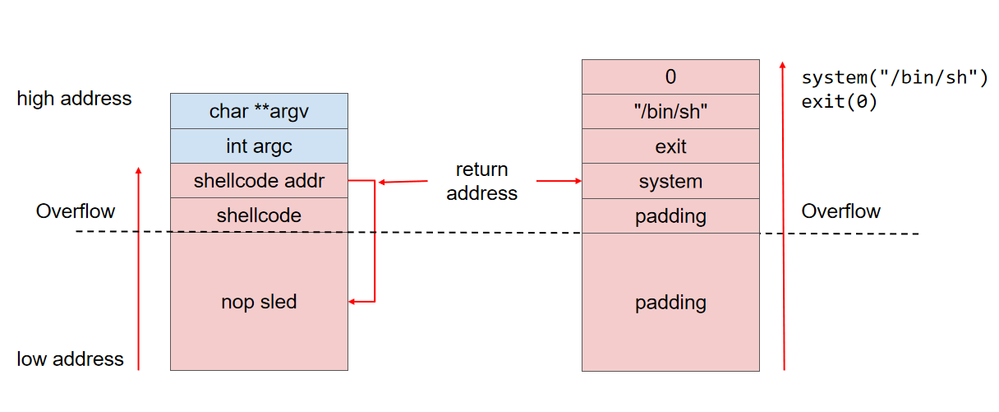

# 花式ROP


## ROP滑梯绕过ASLR

ROP滑梯可以绕过`ASLR`




## 栈迁移


LEAVE

```
在函数返回时，恢复父函数栈帧的指令
```

就是将ebp和esp拉到相同的位置

- MOV esp ebp
- pop ebp
- 此时ebp在若是恶意地址，那就实现栈迁移


本质：rbp/rsp 迁移到其他地方的一种手段

使用指令：leave，pop rbpv

实际做法就是在缓冲区写危险函数，然后最后控制范围函数到`leave ret`


栈迁移传统思路：

- 找机会去泄露栈空间的地址然后把栈迁移到我们可以控制的栈空间，或者迁移到堆空间，大致思路就是覆盖rbp为我们想要迁移到的地方，然后在溢出的位置上填上leave ret


- rbp位置上填写bss段可写地址，然后在返回地址填上主函数自己的read，这样就可以把栈迁移到bss段了

特点，溢出0x8，第一时间要想到栈迁移


## Canary绕过

低版本libc，直接利用库函数缺陷溢出，将指针替换为需要泄露出的字符串地址，主动触发检测，打印`flag`


子进程爆破Canary值，有fork的话


两种思路：

- 将Canaries的值泄露出来，然后栈溢出的时候精准覆盖
- 同时篡改TLS和栈上的Canaries，绕过检查

 


## 盲打

就是没有给出文件给你，只给了远程服务器给你


- 枚举，判断栈溢出长度
- 爆破，按照字节爆破进行，32位情况下，至多爆破1024次，64位至多2048次，找到canary的值


盲ROP

Blind ROP

- 使用 libc_csu_init 结尾的一段 gadgets 来实现，同时可以使用 plt 来获取write地址
- 在write的参数里面，rdx是用来限制输出长度的，一般不会为0
- 可以通过 strcmp 来实现，在执行 strcmp 的时候，rdx会被设置为字符串的长度，所以只要找到 strcmp 就可以实现控制rdx


找gadget

- 执行代码的时候陷入循环，就是出题人向你透露这一段gadget
- 构造payload识别正在执行的指令的效果


步骤：

- 找出栈溢出长度
- 找到一个让程序不崩溃的地址
- 找出BROP_gadgets
- 打印出put@plt的地址
- 然后多次put，把程序dump下来
- ida分析
- 再`libcsearch` 去 `ret2libc`


一个简单判断栈溢出长度的程序

```python
from pwn import *
i=1
while 1:
    try:
        p=remote("127.0.0.1",9999)
        p.recvuntil("WelCome my friend,Do you know password?\n")
        p.send('a'*i)
        data=p.recv()
        p.close()
        if not data.startwith('No password'):
            return i-1
        else:
            return i+1
	execpt EOFEror:
        p.close()
        return i-1
size=getsize()
print "size is [%s]"%size
```

