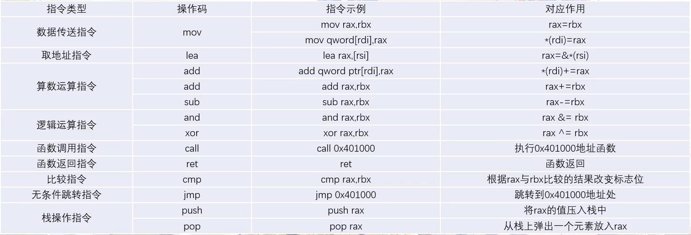
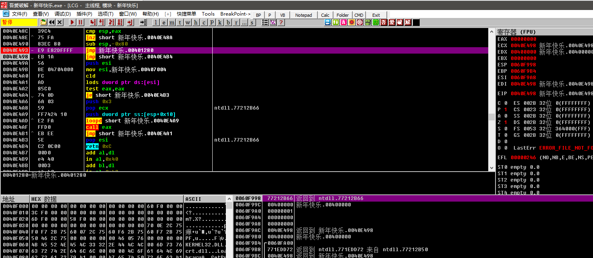
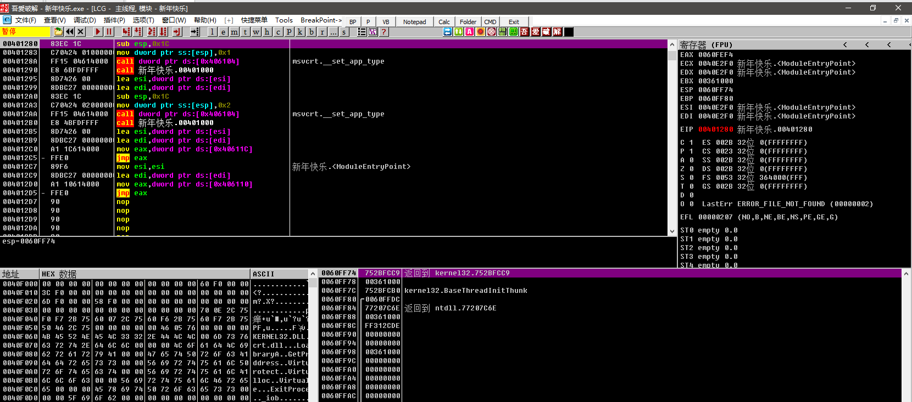
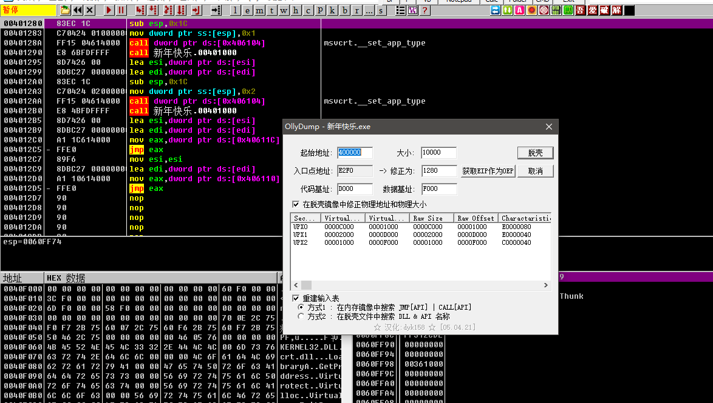

# reverse


## CTF竞赛中的逆向定义：

涉及Windows、Linux、Android平台的多种编程技术，要求利用常用工具对源代码及二进制文件进行逆向分析，掌握Android移动应用APK文件的逆向分析，掌握加解密、内核编程、算法、反调试和代码混淆技术。——《全国大学生信息安全竞赛参赛指南》


ctf逆向赛题的共同点

输入x，数据处理，判断输入是否正确


## 常规逆向流程

- 使用strings/file/binwalk/strace 等工具收集信息（Linux）下的strings非常好用，容易出现非预期，搜集信息进行网上查询
- 判断是否存在代码混淆、加壳、反调试，设法破除
- 静态分析，定位关键代码
- 动态调试，验证静态分析猜想
- 正向算法推理逆向算法
- python脚本求解flag


工具：

exeinfo pe、ida、DIE、gdb


反汇编

反编译

动态调试


## 出题思路

- 怎样接受用户输入，就可以划分出题方式
- 以什么形式来变处理数据，加壳之类
- 判断输入是否正确，直接输出flag、输入就是flag、输入变换之后就是flag（base64之类


## 基础知识点

### IDA：

通过FLIRT算法，识别函数首尾的字节特征，将机器码翻译成静态库函数的调用。


### PE和ELF：

| PE   | ELF  |
| ---- | ---- |
| .exe | elf  |
| .dll | .so  |
| .lib | .a   |


### NOP：

x86 CPU上的NOP指令实质上是XCHG EAX 机器码0x90


### x86和x64的区别：

x86表示32位机器，x64表示64位机器

x86就是Intel，x64就是AT&T


### 机器码和汇编语言：

机器码就是CPU上直接执行的二进制指令

汇编语言就是机器语言的助记符

一般就是x86和x86-64


### x86寄存器：

早期x86CPU只有8个寄存器，现在100多个寄存器都变为通用寄存器。

- EAX
- EBX
- ECX
- EDX
- EDI
- ESI
- EBP
- ESP

前七个都是通用的寄存器，最后一个ESP用来保存当前Stack的地址

| 通用寄存器     | EAX  | RBX  | ECX  | EDX  | ESI  | EDI  |
| -------------- | ---- | ---- | ---- | ---- | ---- | ---- |
| 栈顶指针寄存器 | ESP  |      |      |      |      |      |
| 栈底指针寄存器 | EBP  |      |      |      |      |      |
| 指令计数器     | EIP  |      |      |      |      |      |
| 段寄存器       | CS   | DS   | SS   | ES   | FS   | GS   |


### x86-64寄存器：


| 通用寄存器     | RAX  | RBX  | RCX  | RDX  | RSI  | RDI  | R8-R15 |
| -------------- | ---- | ---- | ---- | ---- | ---- | ---- | ------ |
| 栈顶指针寄存器 | RSP  |      |      |      |      |      |        |
| 栈底指针寄存器 | RBP  |      |      |      |      |      |        |
| 指令计数器     | RIP  |      |      |      |      |      |        |
| 段寄存器       | CS   | DS   | SS   | ES   | FS   | GS   |        |


### 16位寄存器：


| 通用寄存器     | AX   | BX   | CX   | DX   | SI   | DI   |
| -------------- | ---- | ---- | ---- | ---- | ---- | ---- |
| 栈顶指针寄存器 | SP   |      |      |      |      |      |
| 栈底指针寄存器 | BP   |      |      |      |      |      |
| 指令计数器     | IP   |      |      |      |      |      |
| 段寄存器       | CS   | DS   | SS   | ES   | FS   | GS   |


### 调用约定：

x86 32位

__cdecl : 参数从右向左依次压入栈，调用完毕后，由调用者负责将这些压入的参数清理，返回值位于EAX中。

__stdcal : 参数从右向左依次压入栈，调用完毕后，由被调用者负责将这些压入的参数清理，返回值位于EAX中。

__thiscall : 类方法，将this指针放入ECX，压入栈

__fastcall : 加速调用，将第一个参数放入ECX，第二个放入EDX，依次入栈


x86-x64

Microsoft x64 前四个参数放入RDI\RSI\RDX\RCX，剩下的参数从右到左依次压入栈中

SystemV x64 在Linux MacOS上使用，比Microsoft  多了两个寄存器，使用RDI、RSI、RDX、R8、R9，剩下的参数从右到左依次压入栈中


## 汇编语言：




## 保护壳

加载到内存中，先于程序运行，拿到控制权，任何保护并加载程序。

加壳就是利用特殊的算法，对exe、dll文件里的资源进行压缩。类似winzip效果


分类：

- 压缩壳：通过压缩算法压缩软件大小
- 加密壳：利用各种反跟踪技术保护程序不被调试、脱壳、反编译


类型：

- unpack -> execute 全部程序代码解压到内存中再继续执行程序代码
- unpack -> execute->unpack->execute ...  解压部分代码，边解压边执行代码
- unpack->[decoder | encoded code]->decode->execute 程序代码编码，解压后再运行和拿书将真正的程序代码解码执行


## 案例


[【攻防世界】crypt | 坠入星野的月🌙](https://www.uf4te.cn/posts/5bfdd0f4.html)

攻防世界crypt，一个很好的wp


### 案例一


ctfshow-re3

```
int __cdecl main(int argc, const char **argv, const char **envp)
{
  size_t v3; // rax
  int v5; // [rsp+Ch] [rbp-134h] BYREF
  unsigned int i; // [rsp+10h] [rbp-130h]
  int v7; // [rsp+14h] [rbp-12Ch]
  int v8; // [rsp+18h] [rbp-128h]
  int v9; // [rsp+1Ch] [rbp-124h]
  int v10; // [rsp+20h] [rbp-120h]
  int v11; // [rsp+24h] [rbp-11Ch]
  int v12; // [rsp+28h] [rbp-118h]
  int v13; // [rsp+2Ch] [rbp-114h]
  int v14; // [rsp+30h] [rbp-110h]
  int v15; // [rsp+34h] [rbp-10Ch]
  unsigned __int64 v16; // [rsp+38h] [rbp-108h]
  int v17[8]; // [rsp+40h] [rbp-100h]
  char s[5]; // [rsp+60h] [rbp-E0h] BYREF
  char v19[107]; // [rsp+65h] [rbp-DBh] BYREF
  char dest[104]; // [rsp+D0h] [rbp-70h] BYREF
  unsigned __int64 v21; // [rsp+138h] [rbp-8h]

  v21 = __readfsqword(0x28u);
  v7 = 80;
  v8 = 64227;
  v9 = 226312059;
  v10 = -1540056586;
  v11 = 5;
  v12 = 16;
  v13 = 3833;
  v5 = 0;
  puts("plz input the key:");
  __isoc99_scanf("%s", s);
  v3 = strlen(s);
  strncpy(dest, v19, v3 - 6);
  dest[strlen(s) - 6] = 0;
  __isoc99_sscanf(dest, "%x", &v5);
  v17[0] = v7;
  v17[1] = v8;
  v17[2] = v9;
  v17[3] = v10;
  v17[4] = (v11 << 12) + v12;
  v17[5] = v13;
  v17[6] = v5;
  v16 = 0LL;
  for ( i = 0; i <= 6; ++i )
  {
    for ( v16 += (unsigned int)v17[i]; v16 > 0xFFFF; v16 = v15 + (unsigned int)(unsigned __int16)v16 )
    {
      v14 = (unsigned __int16)v16;
      v15 = v16 >> 16;
    }
  }
  if ( v16 == 0xFFFF )
    puts("OK");
  else
    puts("Error");
  return 0;
}
```


逆向程序：

```python
for i in range(0xffff):
    v17 = [80,64227,226312059,0xA43499F6,(5 << 12) + 16,3833, i]
    v16 = 0
    
    for j in range(7):
        v16 += v17[j]
        while v16 > 0xffff:
            v15 = v16 >> 16
            v16 = (v15 + (v16 & 0xffff)) & 0xffffffff
            
    if v16 == 0xffff:
        print(hex(i))
```


### 案例二


```c
void __fastcall __noreturn sub_1400010E0(char *a1, __int64 a2)
{
  int v2; // er9
  __int64 v3; // r8
  char *v4; // r10
  char v5; // al
  __int64 v6; // rbx
  char v7; // cl
  char v8; // [rsp+1Fh] [rbp-3F9h]
  char v9; // [rsp+20h] [rbp-3F8h] BYREF

  v2 = 0;
  v3 = (__int64)a1;
  if ( a1 )
  {
    v4 = &v9;
    do
    {
      ++v4;
      ++v2;
      a1 = &a4890572163qwe[-26 * (v3 / 26)];    // // )(*&^%489$!057@#><:2163qwe
      v5 = a1[v3];
      v3 /= 26i64;
      a2 = v3;
      *(v4 - 1) = v5;
    }
    while ( v3 );
  }
  v6 = v2;
  while ( v6 )
  {
    v7 = *(&v8 + v6--);
    sub_1400011E0(v7 ^ 7);
  }
  ((void (__fastcall __noreturn *)(char *, __int64, __int64))sub_140001220)(a1, a2, v3);
}
```


```c
void __noreturn sub_140001220()
{
  __int64 v0; // r9
  int v1; // ecx
  __int64 v2; // rdx
  char v3; // al
  int v4; // er8
  __int64 v5; // r9
  char v6; // cl
  int v7; // eax

  v0 = qword_140004620;
  v1 = 0;
  v2 = 0i64;
  while ( 1 )
  {
    v3 = *(_BYTE *)v0;
    v4 = v1 + 1;
    v5 = *(_QWORD *)(v0 + 8);
    if ( v3 != aV4pY59[v2 - 1] )
      v4 = v1;
    qword_140004620 = v5;
    if ( !v5 )
      break;
    v6 = *(_BYTE *)v5;
    v7 = v4 + 1;
    v0 = *(_QWORD *)(v5 + 8);
    if ( v6 != aV4pY59[v2] )
      v7 = v4;
    qword_140004620 = v0;
    if ( v0 )
    {
      v2 += 2i64;
      v1 = v7;
      if ( v2 < 14 )
        continue;
    }
    goto LABEL_11;
  }
  v7 = v4;
LABEL_11:
  if ( v7 == 14 )
    sub_1400012E0();
  sub_1400012B0();
}
```


逆向程序：

```python
table = ')(*&^%489$!057@#><:2163qwe'
check = '/..v4p$$!>Y59-'
for i in range(len(check)):
    d = ''
    d += chr(ord(check[i])^7)
d = '())q3w##&9^2>*'         #d为异或7之后的结果
for i in range(len(d)):
    c = 0
    c = table.index(d[i])      #c为d在table表中对应的各个索引值
c = [1,0,0,23,22,24,15,15,3,8,4,19,16,2]
flag = 0
for i in range(len(c)):
    flag *= 26
    flag += c[i]
print(flag)
```


### 2018网鼎beijing

```python
a=[0x61,0x4C,0x67,0x59,0x69,0x29,0x6E,0x42,0x62,0x0D,0x65,0x71,0x66,0x34,0x6A,0x0C6,0x6D,0x8A,0x6C,0x7F,0x7B,0x0AE,0x7A,0x92,0x7D,0x0EC,0x5F,0x657]
f=a[0:28:2]

list = [0x6,0x9,0x0,0x1,0xa,0x0,0x8,0x0,0xb,0x2,0x3,0x1,0xd,0x4,0x5,0x2,0x7,0x2,0x3,0x1,0xc]

result = ''
for i in range(21):
    char = chr(f[list[i]])
    result += char

print(result)
```


## C语言函数特辑


### memset（）

==memset() 函数将指定的值 c 复制到 str 所指向的内存区域的前 n 个字节中，这可以用于将内存块清零或设置为特定值。==

```c
void *memset(void *str, int c, size_t n)
```


```c
   strcpy(str,"This is string.h library function");
   memset(str,'$',7);
    This is string.h library function
    $$$$$$$ string.h library function
```


### strcmp（）

C 库函数 **int strcmp(const char \*str1, const char \*str2)** 把 **str1** 所指向的字符串和 **str2** 所指向的字符串进行比较。

```
int strcmp(const char *str1, const char *str2)
```

- 如果返回值小于 0，则表示 str1 小于 str2。
- 如果返回值大于 0，则表示 str1 大于 str2。
- 如果返回值等于 0，则表示 str1 等于 str2。


### strncpy（）

```c
char *strncpy(char *dest, const char *src, size_t n)
```

- **dest** -- 指向用于存储复制内容的目标数组。
- **src** -- 要复制的字符串。
- **n** -- 要从源中复制的字符数。


### strcpy（）

```c
char *strcpy(char *dest, const char *src)
```

C 库函数 **char \*strcpy(char \*dest, const char \*src)** 把 **src** 所指向的字符串复制到 **dest**。

- **dest** -- 指向用于存储复制内容的目标数组。
- **src** -- 要复制的字符串。


```c
#include <stdio.h>
#include <string.h>
 
int main ()
{
  char str1[]="Sample string";
  char str2[40];
  char str3[40];
  strcpy (str2,str1);
  strcpy (str3,"copy successful");
  printf ("str1: %s\nstr2: %s\nstr3: %s\n",str1,str2,str3);
  return 0;
}
```


finall

```
str1: Sample string
str2: Sample string
str3: copy successful
```


### strcat（）

```c
char *strcat(char *dest, const char *src)
```

- **dest** -- 指向目标数组，该数组包含了一个 C 字符串，且足够容纳追加后的字符串。
- **src** -- 指向要追加的字符串，该字符串不会覆盖目标字符串。


```c
#include <stdio.h>
#include <string.h>
 
int main ()
{
   char src[50], dest[50];
 
   strcpy(src,  "This is source");
   strcpy(dest, "This is destination");
 
   strcat(dest, src);
 
   printf("最终的目标字符串： |%s|", dest);
   
   return(0);
}
```

```
最终的目标字符串： |This is destinationThis is source|
```


## IDA-Python


```
print(hex(idc.here()))          #获取当前地址
print(hex(idc.get_screen_ea())) #另一种获取当前地址的函数
print(hex(ida_ida.inf_get_min_ea())) #获取当前最小地址
print(hex(ida_ida.inf_get_max_ea())) #获取当前最大地址
print(hex(idc.read_selection_start()))#如果你选择了某块地址 那么使用此函数则返回你选择的这块地址的起始地址
print(hex(idc.read_selection_end())) #同上 返回结束地址.
 
if idaapi.BADADDR == idc.here(): 
    print("BadAddress addr invalid")
else: 
    print("addr is ok")
```


| 函数            | 说明                        |
| --------------- | --------------------------- |
| **Byte(addr)**  | 以字节为单位获取地址处的值  |
| **Word(addr)**  | 同上. 以2字节(字)的单位获取 |
| **Dword(addr)** | 4字节                       |
| **Qword(addr)** | 8字节                       |


脚本案例：


## 代码混淆

使用OLLVM、movfuscator，花指令，虚拟化、SMC等工具进行混淆


## SMC

SMC，self modifying code 动态代码加密技术

加密方式：

- 修改PE文件的Section Header
- 使用API Hook实现代码的加解密
- 使用VMProtect等第三方加密工具


异或加密

VirtualProtect 是 Windows 操作系统中的一个 API 函数，它允许应用程序改变一个内存页的保护属性。


函数原型：

```c
BOOL VirtualProtect(
  LPCVOID lpAddress,  // 要改变保护属性的内存页的起始地址
  SIZE_T dwSize,      // 内存页的大小
  DWORD flNewProtect, // 新的保护属性
  PDWORD lpflOldProtect // 存储旧的保护属性
);
```


## Unity外挂

Unity游戏

典型游戏：王者荣耀、原神、永劫无间、明日方舟、森林之子


## 脱壳步骤 

拖进OD

运气号可以直接看到jmp，或者签到题

ESP定律方法找OEP


找 popad

直接找到下面的一个jmp，然后下一个断点

F2 下断点



F9 运行到这里


F8 跳转到OEP



然后鼠标右键，使用插件脱壳



然后另存即可，拖进ida看一下，虽然有upx的函数标识，但是代码确实是脱壳成功了。

