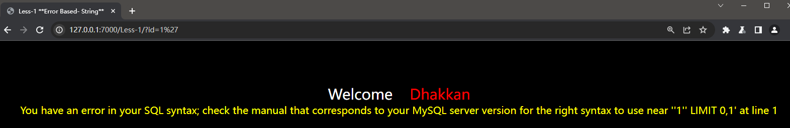

# SQL-Labs靶场全解

## 搭建

值得注意的是SQL-labs这个经典的靶场需要php版本在5.5及其以下版本

靶场源码：[GitHub - Audi-1/sqli-labs: SQLI labs to test error based, Blind boolean based, Time based.](https://github.com/Audi-1/sqli-labs)

参考资料：mysql注入天书


## Page-1(Basic Challenges)

### Less-1 GET-Error based-Single quotes-String

字符型注入

```
http://127.0.0.1:7000/Less-1/?id=1'
```



由上得知，存在字符型漏洞

```
构造
?id=1'or 1=1#
```

输入之后的语句应该为：

```
Select ****** where id='1'or 1=1#' LIMIT 0,1
```


### Less-2 GET-Error based-Intiger based

## Page-2(Advanced Injections)


## Page-3(Stacked Injections)


## Page-4(Challenges)