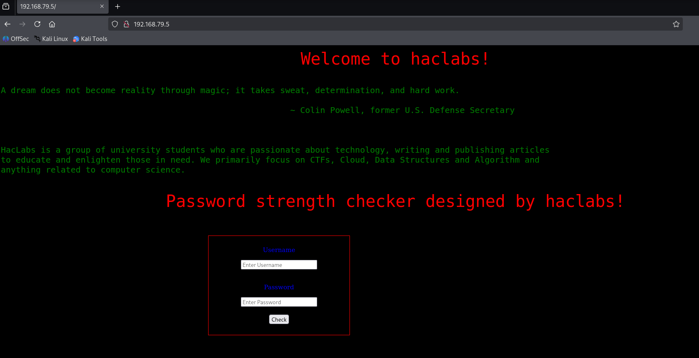

# VulnHub-HACLABS:DECEPTION1.1

## 靶机下载链接

https://vulnhub.com/entry/haclabs-deception11,440/

## 简要描述

This machine is the next part of Deception machine. This time try harder to get root!
这台机器是欺骗机的下一个部分。这一次更加努力地生根！

To complete this challenge you need to find 3 flags.
要完成此挑战，您需要找到 3 个旗帜。

flag 2 : Password to unzip the zip file.
flag 2 ：解压缩 zip 文件的密码。

flag 1 : Present in /home/yash/
标志 1 ：出现在 /home/yash/ 中

flag 0 : Present in /root/
标志 0 ：出现在 /root/ 中

This is a beginner/intermediate level machine.
这是一台初级/中级机器。

Technical Information :  技术信息：

- machine is based on Ubuntu 64bit
  机器基于 Ubuntu 64 位
- Tested on virtualBox 在 virtualBox 上测试
- DHCP is enabled (set as bridged networking)
  启用 DHCP （设置为桥接网络）

NOTE : you may face connection lost issue , no problem restart the virtual machine and everything will start to work again!
注意：您可能会遇到连接丢失问题，没有问题重新启动虚拟机，一切都将重新开始工作！

I found "646563657074696f6e312e31" this while creating the machine .
我在创建机器时发现了“646563657074696f6e312e31”这个。


## 安装

运行虚拟机的时候可能会报这个错误

End kernel panic - not syncing: attempted to kill the idle task

直接设置处理器核心数为2，显存为32MB即可，具体教程如下：

https://blog.csdn.net/weixin_51900414/article/details/136439092


## 转为vmware兼容的格式

参考链接：https://stackoverflow.com/questions/29071662/fail-to-import-ova-file-to-vmware-player

直接virtualbox导出为OVF格式1.0

然后将虚拟机导入vmware中即可


还是和no_name一个做法


## Attack

### 解压密码

还没创建就已经开始了

这边提示解压密码就是flag1

我们看提示：

```
646563657074696f6e312e31
```


解压密码如下：

```
deception1.1
```


解压之后还是导出，一样做法：

### capacity mismatch for disk解决

但是这里遇到了一个capacity mismatch for disk的问题

==纯粹是我们vmware没事找事做了==

解决方法如下：参考链接https://rivers.chaitin.cn/blog/cqouru90lnec5jjugah0

- 使用记事本打开VirtualBox的配置文件，后缀为`*.vbox`的文件


- 搜索`Image uuid`


```
<Image uuid="{86384671-5e5e-4568-a1b2-921198f06e5c}"/>
```

- 到VirtualBox的安装路径中使用VBoxManage.exe进行显示虚拟硬盘的详细信息

```
.\VBoxManage.exe showhdinfo 86384671-5e5e-4568-a1b2-921198f06e5c
```


```
Capacity: 31524 MBytes
```

将这个数值转为字节：

```
33060532224
```


- 打开导出的ova解压文件中的`*.ovf`文件进行修改


- 搜索`ovf:capacity=`


```
<Disk ovf:capacity="33056112640" ovf:diskId="vmdisk1" ovf:fileRef="file1" ovf:format="http://www.vmware.com/interfaces/specifications/vmdk.html#streamOptimized" vbox:uuid="5edcf472-5ea7-4434-83e6-de646b08e170"/>
```

将这个数值修改为上面的字节值

- 更新sha1值，在解压目录中打开powershell

```
Get-FileHash -Path .\646563657074696f6e20312e31.ovf -Algorithm SHA1
```


```
5C6A47D6B5EE3838F7365A7A3C5A179059CFEEB8
```

- 将上述计算的sha1值复制到mf文件中


- 然后导入虚拟机，选中你解压的那个路径的ovf就成功了

- 将桥接改为nat，方便vmware的kali连接


建议还是装VirtualBox的kali吧，这样就不用去麻烦这些有的没的。

放弃了，这台机子有点问题，非virtualBox不可，直接kali也弄个virtualbox的版本


==不做了，这个映像一直崩溃，网络还时不时掉，一点体验感都没有==

参考writeup：

https://juejin.cn/post/7268945005749911608

### 主机存活检测

```
sudo netdiscover -i eth0 -r 192.168.79.0/24
```


### 端口扫描

```
sudo nmap -sS 192.168.79.5 -p-
```


可以看到开放了22和80端口

### 服务扫描

```
sudo nmap -A -sV -sT 192.168.79.5 -p22,80
```


那就具体看一下吧


### 80端口探索



啥都不检查的话初步判断可能就是SQL注入


### nikto工具扫描

```
nikto -h http://192.168.79.5
```


```
http://192.168.79.5/manual/en/index.html
```

看起来是一个Apache的文档说明页面


估计入手就是从主页面入手了


### 尝试弱密码

```
admin
Passwd0?
```


### 尝试SQL注入

```

```


最后得到：

```
0000flagflagflagflag.php
```


```
00001111.php
```


```
?page=
```

任意文件读取


```
/var/password.txt
```


```
ya5h** 需要进行爆破
```


脚本如下：


```
ssh登录即可
```


```
cat flag0.txt
```


日志文件有写入权限，会执行这个，并且是root权限，所以反弹shell写进去


```
/home/yash/perm.sh
```


在root目录下读取到flag

```
cat root_flag.txt
```

