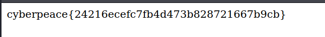

# 攻防世界Web新手区

好，鸽了这么旧，学业繁忙的我就出一篇简单的攻防世界Web新手区的WriteUp吧，顺带作为自己的复习笔记。

[攻防世界 (xctf.org.cn)](https://adworld.xctf.org.cn/)

[](https://imgtu.com/i/5Ml9Hg)

攻防世界，一大CTFers的网站，上面有在线靶场以及竞赛等资源，推荐初学者上去学习。

我们今天看一下Web新手区的一些WP吧！

## 1.view_source

[](https://imgtu.com/i/5MlubF)

基础的第一关，却是后面无数关的基础。

作为一个Web手，查看网页源代码是必须会的一件事情！！

点进网页一看：

[](https://imgtu.com/i/5Mls2t)

1. flag不在这里，那应该在源代码里。

2. 你可以鼠标右键点击选中查看源代码或是直接按住`F12`查看源代码！

[](https://imgtu.com/i/5M1SR1)

```txt
cyberpeace{ac663108a3ddfa45faa8fac4ed963ece} 
```

3. 这样，就可以直接看到flag了，直接复制粘贴，就通过第一关了！！


## 2.robots

[](https://imgtu.com/i/5M3AXV)

如果以前有用python写过网络爬虫的话，相信肯定不会对robots.txt陌生。

它最直接的作用就是告诉爬虫们，哪些可以爬，哪些不可以爬。

robots.txt是一个协议，而不是一个命令。

需要注意的是：

- User-agent：* 代表所有的搜索引擎种类
- Disallow：禁止爬寻目录
- Allow：允许爬寻目录
- Sitemap：网站的地图

[](https://imgtu.com/i/5M8Su6)

1. 看，直接在网址后面加个访问robots.txt。

2. 就出来disallow的内容，再直接把`robots.txt`删掉，在后面加上f1ag_1s_h3re.php。


[](https://imgtu.com/i/5MG8oD)


```txt
cyberpeace{dfd27487cbf007ab6e0b0cb365766360}
```

3. 就可以得到flag了，你就通过第二关了！！！

## 3.backup

[](https://imgtu.com/i/5MGTkF)

看到题目描述，x老师忘记删除备份文件了！

并且：

[](https://imgtu.com/i/5MJCfH)

这么一大坨文字摆在这里了！！

那我们还是来了解一下备份文件吧！

备份文件的后缀一般为

- .git
- .svn
- .bak
- .swp
- .~
- .bash_history
- .bkf

那我们直接一个个去试吧，不过记得.git备份文件一般是在运行git init初始化代码库的时候，会在当前目录下面产生一个.git的隐藏文件，用来记录代码的变更记录等等。在发布代码的时候，把.git这个目录没有删除，直接发布了。使用这个文件，可以用来恢复源代码。

而bash_history通常是记录Linux下的用户的命令历史记录。

.swp一般是编辑文件时产生的隐藏文件，它是一个临时交换文件，用来备份缓冲区中的内容。

.svn管理备份随时间改变的各种数据，会记录每一个文件得到修改更新变动，是版本管理的利器。

.bak就是最经典的备份文件后缀；

所以我们就直接把.bak加到地址末尾，会弹出下载文件；

[](https://imgtu.com/i/5MU3PU)


下载保存文件，打开查看，就得到flag了！！！

[](https://imgtu.com/i/5MUgsA)


```txt
Cyberpeace{855A1C4B3401294CB6604CCC98BDE334}
```


## 4.cookie

[](https://imgtu.com/i/5MacfU)

cookie原译为曲奇饼，实则为一个保存载客户机中的简单文本文件，它就相当于一张身份证一样，里面存储着你在某个网页中的隐私数据，拥有cookie，你就能在Http的世界里被服务端所服务。

二话不说，打开Burp Suite，代理啥的我就不教了，自己去网上折腾一番就可以知道怎么设置代理服务器了！

[](https://imgtu.com/i/5Mdxv4)

噢，直接来了个提示，`look-here=cookie.php`那就直接访问试试！

直接在地址后面加上/cookie.php,出现提示！

[](https://imgtu.com/i/5MwIJK)

那我们依旧是查看抓包的记录，果然在报文头处得到了flag

[](https://imgtu.com/i/5MwoRO)

```txt
cyberpeace{0938a721aa9dcd294c9a583697836fca}
```

## 5.disabled_button

[](https://imgtu.com/i/5QyNnO)

这个题目很简单，一个不能按的按钮，那我们直接按`F12`来查看一下源代码吧！

[](https://imgtu.com/i/5QywAH)

检查元素，挪到按钮处，然后发现disabled

[](https://imgtu.com/i/5Qy2DS)

把disabled=""给删除掉就可以了！！

再点击按钮，就出来flag了！！！

[](https://imgtu.com/i/5QyfEQ)

```txt
cyberpeace{959a633de7840d6f112a00023154e32c}
```

直接提交完事！

## 6.weak_auth

[](https://imgtu.com/i/5QyjUJ)

先看一下描述，一个登陆验证页面，随手设置一个密码，猜测可能是sql万能密码，或者是密码爆破之类的！！

点进去瞅一眼：

[](https://imgtu.com/i/5Q6N2q)

额，毫无提示，点一下login看看

[](https://imgtu.com/i/5Q6Ux0)

点一下之后发现提示：please login as admin

那我们就知道用户名是admin，二话不说，直接爆破！

还是用burp suite进行抓包

[](https://imgtu.com/i/5Q6sIJ)

进行爆破，

[](https://imgtu.com/i/5Q6oIH)

设置好爆破字段，导入字典包；

这里kali自带了一个密码字典，我们也可以去github上找到一些大型的密码字典，这里我就随便设几个密码，来跑一个样例！

[](https://imgtu.com/i/5Q6WM6)

就直接选择simple list ，导入字典，进行爆破‘，点击右上角开始stack！

[](https://imgtu.com/i/5Q6zdg)

当出现后面值不一样时，我们就可以进行尝试，这里得出的是123456

那直接返回页面，用户名：admin，密码：123456

直接登录，得到flag

[](https://imgtu.com/i/5QckQ0)

```txt
cyberpeace{24216ecefc7fb4d473b828721667b9cb}
```

## 7.simple_php

[](https://imgtu.com/i/5QcKY9)

果然，又出现大梗了！

`PHP是世界上最好的语言`

那我们就来看一下吧！

[](https://imgtu.com/i/5QctTe)

啥话都没说，就摆了段代码在我们的面前emm

那我们就来简单审计一下吧。

首先先要用GET方法传入a、b两个值，并且a==0且a为真，b不是数字却要b大于1234，这样听起来有点迷惑。那我们查询一下php的用法！

```php
== 绕过
php中有两种比较符号
=== 会同时比较字符串的值和类型
== 会先将字符串换成相同类型，再作比较，属于弱类型比较
== 对于所有0e开头的都为相等

is_numeric() 判断变量是否为数字或数字字符串
is_numeric() 函数会判断如果是数字和数字字符串则返回 TRUE，否则返回 FALSE,且php中弱类型比较时，会使('1234a' == 1234)为真，或者'12345%00'
```

那我们可以构造：

- ?a='0'&b=1235a
- ?a=a&b=12345a
- ?a='0e&b=12359a
- 还有很多构造方法，没有过滤的后果，然后随便弄一个就可以得到flag了！！！

[](https://imgtu.com/i/5QgUBT)


```txt
Cyberpeace{647E37C7627CC3E4019EC69324F66C7C} 
```

## 8.get_post

[](https://imgtu.com/i/5QgRHO)

直接点吧，看到了一句提示！

[](https://imgtu.com/i/5Qg7vt)

请用GET方式提交一个a=1

那直接打开HackBar，提交！

[](https://imgtu.com/i/5Qgv5Q)

提交之后，又出来一句话，用POST方式提交b=2

那依旧用HackBar进行提交

[](https://imgtu.com/i/5Q2irV)

直接就得出flag了！！

```txt
cyberpeace{5dbc48d711c4eed763409558c2e6975f}
```

不过，我们不能为了做题而做题，我们应该还要了解一下题外知识！！

[](https://imgtu.com/i/5Q2n2R)

Http的方法有很多种，甚至于，你先与服务器协调一致，可以采用自定义方法进行请求与相应！！

## 9.xff_referer

[](https://imgtu.com/i/5Q2rdS)

看到xff以及referer应该是要伪造报文之类的，然后点进去瞅瞅！

首先我们得知道xff与referer是什么东西！

- **X-Forwarded-For**（**XFF**）是用来识别通过HTTP代理或负载均衡方式连接到Web服务器的客户端最原始的IP地址的HTTP请求头字段。Squid 缓存代理服务器的开发人员最早引入了这一HTTP头字段，并由IETF在HTTP头字段标准化草案中正式提出。 当今多数 缓存服务器 的用户为大型ISP，为了通过缓存的方式来降低他们的外部带宽，他们常常通过鼓励或强制用户使用代理服务器来接入 互联网 。 有些情况下，这些代理服务器是透明代理，用户甚至不知道自己正在使用代理上网。

- **HTTP Referer**是header的一部分，当浏览器向web服务器发送请求的时候，一般会带上Referer，告诉服务器该网页是从哪个页面链接过来的，服务器因此可以获得一些信息用于处理。
- 上述解释采自百度百科

[](https://imgtu.com/i/5Q2sIg)

看提示就是要伪造XFF：

依旧抓包：

[](https://imgtu.com/i/5Q2bW9)

转发，得出另一个提示！

[](https://imgtu.com/i/5Q2OQ1)

这是伪造referer，然后抓包和上一个XFF一起伪造：

[](https://imgtu.com/i/5QRSoD)

转发，得到flag！！

[](https://imgtu.com/i/5QR9Fe)

复制粘贴提交就可以了！！！

```txt
cyberpeace{8782ddf3a1086b66ce36aefd1ef9a218}
```

## 10.webshell

[](https://imgtu.com/i/5QRmTS)

webshell，来到好玩的一关了！

一般都是eval，可以用菜刀或者weevely来进入后门。

这里我们就直接用HackBar来进行简单的webshell操作！！

[](https://imgtu.com/i/5QR8O0)

我们先来搜索一番，PHP语言中的eval的作用！

1.eval() 函数把字符串按照 PHP 代码来计算。

2.该字符串必须是合法的 PHP 代码，且必须以分号结尾。

3.如果没有在代码字符串中调用 return 语句，则返回 NULL。如果代码中存在解析错误，则 eval() 函数返回 false。

所以它会直接执行eval内的任何语句，把字符串当成代码执行！！

那我们直接POST构造传值！

[](https://imgtu.com/i/5QRcTO)

```php
shell=system("ls");
```


然后就出来提示了！

[](https://imgtu.com/i/5Q4T2Q)

- ls是Linux系统中查看当前目录下文件的命令

直接就看到了当前目录下有一个flag.txt，接着用cat来访问该文件，得到flag！

[](https://imgtu.com/i/5Q4Lbq)

```txt
cyberpeace{0327593210c5d1606a43f61ab7791ed2}
```


## 11.commad_execution

欸，又是这个常见的ping功能，rce准备

[](https://imgtu.com/i/5Q4zPU)

老规矩，先试个本地回环进行测试，很好地完成了功能！！

[](https://imgtu.com/i/5Q5p24)

Linux内命令拼接可以用；或者 管道符 | 或者&符 来进行拼接

```shell
127.0.0.1|ls
```

[](https://imgtu.com/i/5Qo6v4)

很好什么都没有发现

然后直接寻找吧！

```shell
127.0.0.1|find / -name flag.*
```

[](https://imgtu.com/i/5Qo2r9)

得到在/home/flag.txt下

然后cat查看！！

```shell
127.0.0.1|cat flag.txt
```

[](https://imgtu.com/i/5QofV1)

得到flag！！！

```txt
cyberpeace{c3c70bbb893a6ea850881c22a97ea1fa}
```

## 12.simple_js

这道题目，单纯就是先设置个障碍，玩一下心态，然后后面把答案赤裸裸地摆了出来！！

[](https://imgtu.com/i/5Qoo8O)

然后有个密码框，一直填一直错，就查看源代码，发现JS代码：

```js
<html>
<head>
    <title>JS</title> 
    <script type="text/javascript"> 
    <!--下面就是关键函数了-->    
    function dechiffre(pass_enc){

        var pass = "70,65,85,88,32,80,65,83,83,87,79,82,68,32,72,65,72,65";
        var tab  = pass_enc.split(',');
        var tab2 = pass.split(',');
        var i,j,k,l=0,m,n,o,p = "";
        i = 0;
        j = tab.length;
        k = j + (l) + (n=0);
        n = tab2.length;
        
        for(i = (o=0); i < (k = j = n); i++ ){
              o = tab[i-l];
              p += String.fromCharCode((o = tab2[i]));
              if(i == 5)
                   break;
              }
        for(i = (o=0); i < (k = j = n); i++ ){
              o = tab[i-l];
              if(i > 5 && i < k-1)
                   p += String.fromCharCode((o = tab2[i]));
              }
//上面一点卵用都没有，直接看下面
        p += String.fromCharCode(tab2[17]);
        pass = p;
        return pass;
    }
//长字符十六进制转换，直接用python解得：[55,56,54,79,115,69,114,116,107,49,50]
//然后再ascii码输出，得到flag，然后再根据flag格式构造就可以了！！

    String["fromCharCode"](dechiffre("\x35\x35\x2c\x35\x36\x2c\x35\x34\x2c\x37\x39\x2c\x31\x31\x35\x2c\x36\x39\x2c\x31\x31\x34\x2c\x31\x31\x36\x2c\x31\x30\x37\x2c\x34\x39\x2c\x35\x30"));

    h = window.prompt('Enter password');
    alert( dechiffre(h) );

</script>
</head>
</html>
```

```txt
\x35\x35\x2c\x35\x36\x2c\x35\x34\x2c\x37\x39\x2c\x31\x31\x35\x2c\x36\x39\x2c\x31\x31\x34\x2c\x31\x31\x36\x2c\x31\x30\x37\x2c\x34\x39\x2c\x35\x30
//截取下来放pycharm里！
```

[](https://imgtu.com/i/5QovIP)

输出：

[](https://imgtu.com/i/5QTirj)

然后遍历输出ascii转字符：

[](https://imgtu.com/i/5QTFqs)

得到答案：

[](https://imgtu.com/i/5QTeiV)

然后用flag格式进行构造：

```txt
Cyberpeace{786OsErtk12}
```

得到flag，提交，完事！！！


