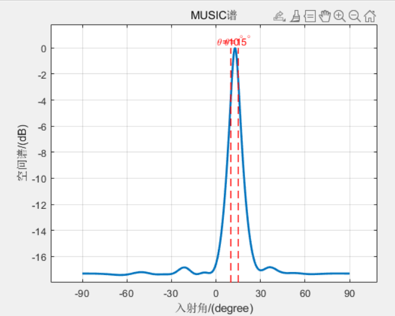

# 多维信号处理大作业


## music经典算法

```matlab
clear; close all;
%%%%%%%% MUSIC for Uniform Linear Array%%%%%%%%
derad = pi/180;      %角度->弧度
N = 10;               % 阵元个数        
M = 2;               % 信源数目
theta = [20 25];  % 待估计角度
snr = 10;            % 信噪比
K = 60;             % 快拍数
 
dd = 0.5;            % 阵元间距 
d=0:dd:(N-1)*dd;
A=exp(-1i*2*pi*d.'*sin(theta*derad));  %方向矢量

%%%%构建信号模型%%%%%
S=randn(M,K);             %信源信号，入射信号
X=A*S;                    %构造接收信号
X1=awgn(X,snr,'measured'); %将白色高斯噪声添加到信号中
% 计算协方差矩阵
Rxx=X1*X1'/K;
% 特征值分解
[EV,D]=eig(Rxx);                   %特征值分解
EVA=diag(D)';                      %将特征值矩阵对角线提取并转为一行
[EVA,I]=sort(EVA);                 %将特征值排序 从小到大
EV=fliplr(EV(:,I));                % 对应特征矢量排序
                 
% 遍历每个角度，计算空间谱
for iang = 1:361
    angle(iang)=(iang-181)/2;
    phim=derad*angle(iang);
    a=exp(-1i*2*pi*d*sin(phim)).'; 
    En=EV(:,M+1:N);                   % 取矩阵的第M+1到N列组成噪声子空间
    Pmusic(iang)=1/(a'*En*En'*a);
end

Pmusic=abs(Pmusic);
Pmmax=max(Pmusic);
Pmusic=10*log10(Pmusic/Pmmax);            % 归一化处理

h=plot(angle,Pmusic);
set(h,'Linewidth',2);

% 绘制信号源的实际角度
hold on;
for i = 1:M
    plot([theta(i) theta(i)], ylim, 'r--', 'LineWidth', 1);  % 红色虚线标记信号源的角度
    % text(theta(i), max(Pmusic), ['\theta=' num2str(theta(i)) '^\circ'], ...
    %     'HorizontalAlignment', 'center', 'VerticalAlignment', 'bottom', 'FontSize', 10, 'Color', 'r');
end
hold off;

% 图表设置
xlabel('入射角/(degree)');
ylabel('空间谱/(dB)');
title('MUSIC谱');
set(gca, 'XTick',[-90:30:90]);
% legend('MUSIC谱', '实际信号源');
grid on;

```


## 改进算法

```matlab
clear; close all;
%%%%%%%% MUSIC for Uniform Linear Array (Optimized) %%%%%%%%
derad = pi/180;      %角度->弧度
N = 10;               % 阵元个数        
M = 2;               % 信源数目
theta = [20 25];  % 待估计角度
snr = 10;            % 信噪比
K = 60;             % 快拍数
dd = 0.5;            % 阵元间距 
d = 0:dd:(N-1)*dd;
A = exp(-1i*2*pi*d.'*sin(theta*derad));  %方向矢量

%%%%构建信号模型%%%%%
S = randn(M,K);             %信源信号，入射信号
X = A * S;                    %构造接收信号
X1 = awgn(X,snr,'measured'); %添加噪声
Rxx = X1 * X1' / K;         %计算协方差矩阵
[EV, D] = eig(Rxx);         %特征值分解
EVA = diag(D)';             %特征值
[EVA, I] = sort(EVA);       %排序特征值
EV = fliplr(EV(:,I));       %排序特征矢量

% 遍历角度并计算空间谱
for iang = 1:361
    angle(iang) = (iang-181)/2;
    phim = derad*angle(iang);
    a = exp(-1i*2*pi*d*sin(phim)).'; 
    En = EV(:, M+1:N);  % 噪声子空间
    Pmusic(iang) = 1 / (a' * En * En' * a);  % MUSIC谱
end

% 平滑处理
Pmusic_smooth = smooth(Pmusic, 5); 

% 归一化
Pmusic = abs(Pmusic_smooth);
Pmmax = max(Pmusic);
Pmusic = 10 * log10(Pmusic / Pmmax);

h = plot(angle, Pmusic);
set(h, 'LineWidth', 2);

% 绘制信号源的实际角度
hold on;
for i = 1:M
    plot([theta(i) theta(i)], ylim, 'r--', 'LineWidth', 1);  % 红色虚线标记信号源的角度
    text(theta(i), max(Pmusic), ['\theta=' num2str(theta(i)) '^\circ'], ...
         'HorizontalAlignment', 'center', 'VerticalAlignment', 'bottom', 'FontSize', 10, 'Color', 'r');
end
hold off;

% 图表设置
xlabel('入射角/(degree)');
ylabel('空间谱/(dB)');
title('Optimized MUSIC谱');
set(gca, 'XTick', [-90:30:90]);
grid on;

```


可以看到经典的music算法在处理快拍数较小，方向角度间距较小，信噪比低的谱估计的效果并不好。




所以引入一个改进的music算法，针对这一情况


两个算法合在一起：

```matlab
clear; close all;
%%%%%%%% MUSIC for Uniform Linear Array (Combined) %%%%%%%%
derad = pi/180;      %角度->弧度
N = 10;               % 阵元个数        
M = 2;                % 信源数目
theta = [21 23];      % 待估计角度
snr = 20;             % 信噪比
K = 60;               % 快拍数
dd = 0.5;             % 阵元间距 
d = 0:dd:(N-1)*dd;
A = exp(-1i*2*pi*d.'*sin(theta*derad));  %方向矢量

%%%%构建信号模型%%%%%
S = randn(M,K);              %信源信号，入射信号
X = A * S;                   %构造接收信号
X1 = awgn(X,snr,'measured'); %添加噪声
Rxx = X1 * X1' / K;         %计算协方差矩阵
[EV, D] = eig(Rxx);         %特征值分解
EVA = diag(D)';             %特征值
[EVA, I] = sort(EVA);       %排序特征值
EV = fliplr(EV(:,I));       %排序特征矢量

% 计算原始MUSIC谱
for iang = 1:361
    angle(iang) = (iang-181)/2;
    phim = derad*angle(iang);
    a = exp(-1i*2*pi*d*sin(phim)).'; 
    En = EV(:, M+1:N);  % 噪声子空间
    Pmusic(iang) = 1 / (a' * En * En' * a);  % MUSIC谱
end

% 计算优化后的MUSIC谱（平滑处理）
Pmusic_smooth = smooth(Pmusic, 5); 
Pmusic_optimized = abs(Pmusic_smooth);
Pmmax = max(Pmusic_optimized);
Pmusic_optimized = 10 * log10(Pmusic_optimized / Pmmax);

% 绘制空间谱
figure;
hold on;
h1 = plot(angle, 10*log10(abs(Pmusic) / max(abs(Pmusic))), 'b-', 'LineWidth', 2); % 原始MUSIC谱，蓝色实线
h2 = plot(angle, Pmusic_optimized, 'r--', 'LineWidth', 2); % 优化后的MUSIC谱，红色虚线

% 绘制信号源的实际角度
for i = 1:M
    plot([theta(i) theta(i)], ylim, 'r--', 'LineWidth', 1);  % 红色虚线标记信号源的角度
    text(theta(i), max(Pmusic_optimized), ['\theta=' num2str(theta(i)) '^\circ'], ...
         'HorizontalAlignment', 'center', 'VerticalAlignment', 'bottom', 'FontSize', 10, 'Color', 'r');
end
hold off;

% 图表设置
xlabel('入射角/(degree)');
ylabel('空间谱/(dB)');
title('MUSIC谱与优化后的MUSIC谱');
set(gca, 'XTick', [-90:30:90]);
legend([h1, h2], {'MUSIC谱', '优化后的MUSIC谱'}, 'Location', 'northeast');
grid on;

```

