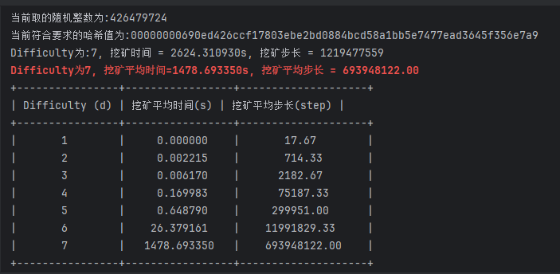
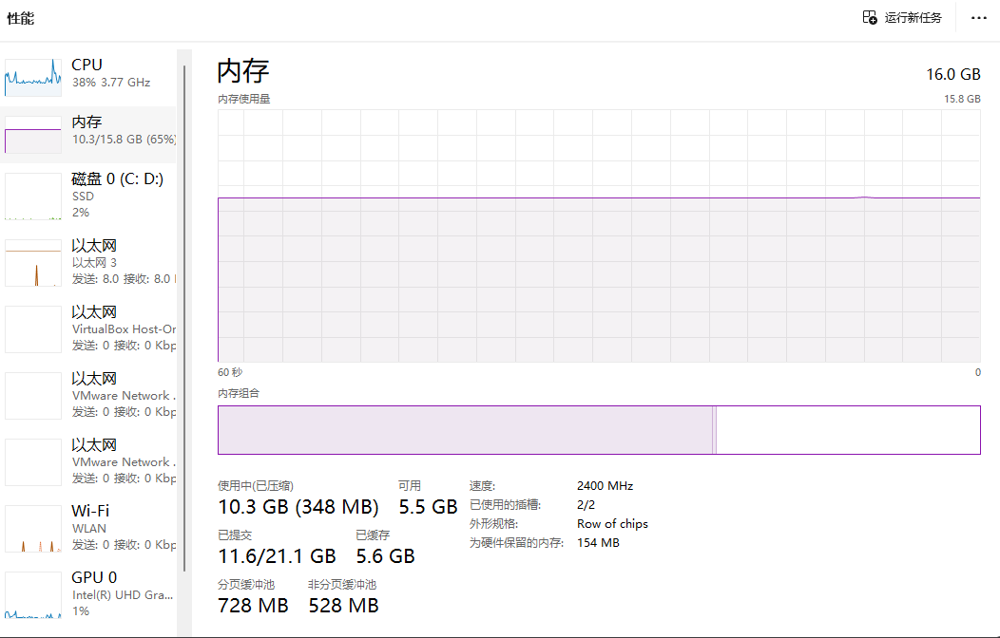
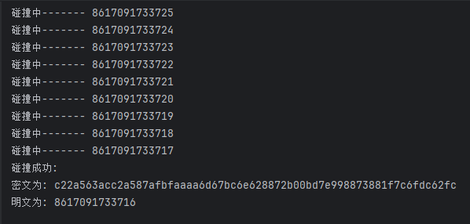

# 信息安全工程作业——挖矿算法模拟


作业人：`ZhangJunTian`


## 0. 作业描述

比特币“挖矿”算法简化模拟	

参数：哈希函数采用SHA-256；挖矿难度为整数d（>0），代表哈希值前导字符串为0的数量，d值越小难度越小，d值越大难度越大

1. 随机生成一个整数x
2.  对x生成哈希值h=H(x)
3. 对h的前导字符串进行判定：如为d个0则挖矿成功；否则回到步骤1


输出：d=1，2，3，4，5时挖矿成功耗时（可取3组数平均值）


## 1. 实现算法

```python
import hashlib												# 导入哈希函数库
import random												# 导入随机数函数
import time													# 导入时间模块
from prettytable import PrettyTable							# 导入绘制表格的库
# 导入numpy库，里面也有random函数，也是可以的。

def mine(difficulty):
    prefix_str = '0' * difficulty							# 根据输入参数生成前导字符串
    attempts = 0											# 初始化步长计数器
    start_time = time.time()								# 获取当前程序开始运行的时间戳
    
    while True:
        x = random.randint(0, 2**32)  						# 随机生成一个整数
        h = hashlib.sha256(str(x).encode()).hexdigest()  	# 生成SHA-256哈希值
        attempts += 1										# 计算步长
        if h.startswith(prefix_str):  						# 检查哈希值前导字符串
            print(f"当前取的随机整数为:{x}")
            print(f"当前符合要求的哈希值为:{h}")
            break
    
    end_time = time.time()									# 获取当前程序运行结束的时间戳
    return end_time - start_time, attempts					# 返回挖矿消耗的时间和相应while运行次数

def average_mining_time(difficulty, iterations=3):			# 计算平均时长函数
    total_time = 0
    total_attempts = 0
    
    for _ in range(iterations):								# 每一次前导0的尝试
        elapsed_time, attempts = mine(difficulty)
        total_time += elapsed_time
        total_attempts += attempts
        print(f"Difficulty为:{difficulty}, 挖矿时间 = {elapsed_time:.6f}s, 挖矿步长 = {attempts}")

    average_time = total_time / iterations
    average_attempts = total_attempts / iterations
    
    print(f"\033[1;31mDifficulty为{difficulty}, 挖矿平均时间={average_time:.6f}s, 挖矿平均步长 = {average_attempts:.2f}\033[0m")
    # 红色文字展示，容易分辨
    
    return average_time,average_attempts

# 创建表格,易于展示
table = PrettyTable()
table.field_names = ["Difficulty (d)", "挖矿平均时间(s)","挖矿平均步长(step)"]    

# 不同挖矿难度遍历执行
for d in range(1, 8):
    average_time,average_attempts = average_mining_time(d)
    table.add_row([d, f"{average_time:.6f}",f"{average_attempts:.2f}"])

print(table)
```


## 2. 运行结果


由于每次运行结果的差异都是不确定的，但是总的来说difficulty的值越大，耗费时间就越长。这里选取某一分辨较好的运行结果作为展示。

因为程序使用随机数来进行取值，所以在某些情况下有最优解，当然最坏的情况就是2**32次遍历。


### 2.0 test1

```
当前取的随机整数为:3696789060
当前符合要求的哈希值为:0dd2e709945758eb8b1fb97e117cc27f8564073354c2d49e9949451a00b381c4
Difficulty为:1, 挖矿时间 = 0.001007s, 挖矿步长 = 75
当前取的随机整数为:3405745798
当前符合要求的哈希值为:09b249b1e26a3b6f48b72e6f360e339b6ae04f7c3c691268efc3b0d5c689a32b
Difficulty为:1, 挖矿时间 = 0.000000s, 挖矿步长 = 10
当前取的随机整数为:1810442326
当前符合要求的哈希值为:06476d6992d99bb178d1bf3831fb2ec0ceb5a6c84b5e0661db0130b24acebd7d
Difficulty为:1, 挖矿时间 = 0.000000s, 挖矿步长 = 6
Difficulty为1, 挖矿平均时间=0.000336s, 挖矿平均步长 = 30.33
当前取的随机整数为:1769019426
当前符合要求的哈希值为:0054d5f7ad3e62f8681fe65f1ccf5bc94f68459593246722ab2b3c5b3f23d4f0
Difficulty为:2, 挖矿时间 = 0.000000s, 挖矿步长 = 64
当前取的随机整数为:760331474
当前符合要求的哈希值为:00aa62e29a6c342b17d1122064123102280b9087a21972d6b51135ea3de113d7
Difficulty为:2, 挖矿时间 = 0.001107s, 挖矿步长 = 362
当前取的随机整数为:108091365
当前符合要求的哈希值为:009f9f82d530307513e6b1d83afc20fbc5d87758b5dec70515067c07bb9aa980
Difficulty为:2, 挖矿时间 = 0.001015s, 挖矿步长 = 153
Difficulty为2, 挖矿平均时间=0.000707s, 挖矿平均步长 = 193.00
当前取的随机整数为:1074539291
当前符合要求的哈希值为:0009a32a2f97c3bfcf0f4290c3785a72b5f9b6503fd590491835eead9591dd28
Difficulty为:3, 挖矿时间 = 0.001021s, 挖矿步长 = 777
当前取的随机整数为:1223974109
当前符合要求的哈希值为:000aff73e3ab52a08b0046cf4fbf40f106b802136ccdba7f5e3b27123e6aca76
Difficulty为:3, 挖矿时间 = 0.009270s, 挖矿步长 = 2926
当前取的随机整数为:101501561
当前符合要求的哈希值为:000cd190f892c5c50ca7e14aaf27ff7d24b7658ab8820d9dcfb3c6eeca7a14de
Difficulty为:3, 挖矿时间 = 0.043366s, 挖矿步长 = 14319
Difficulty为3, 挖矿平均时间=0.017886s, 挖矿平均步长 = 6007.33
当前取的随机整数为:1756292686
当前符合要求的哈希值为:0000dab34c55e11ea74136f5cd8a994df41143bf0e6bcddda1407da1e1676a80
Difficulty为:4, 挖矿时间 = 0.248495s, 挖矿步长 = 81545
当前取的随机整数为:1815141777
当前符合要求的哈希值为:0000ee1d8aff34e6fe42b898dde491e42ce02e4213a1b46b4d05f3c001ce031d
Difficulty为:4, 挖矿时间 = 0.115979s, 挖矿步长 = 43001
当前取的随机整数为:670380251
当前符合要求的哈希值为:00000ad3a36ca5abd16be83890bda51c41c339795338226bd18643199580a77b
Difficulty为:4, 挖矿时间 = 0.063094s, 挖矿步长 = 18490
Difficulty为4, 挖矿平均时间=0.142523s, 挖矿平均步长 = 47678.67
当前取的随机整数为:507045335
当前符合要求的哈希值为:000004cdb03979e2c6900b9e380179052de0ea4c0c93976115399944f5b4ac92
Difficulty为:5, 挖矿时间 = 1.128444s, 挖矿步长 = 376439
当前取的随机整数为:4187377576
当前符合要求的哈希值为:000004779fced314d7685e838f87e0bf827ad79f69b88f170634da920c009820
Difficulty为:5, 挖矿时间 = 1.953277s, 挖矿步长 = 597805
当前取的随机整数为:620574440
当前符合要求的哈希值为:00000cdb56d079e208ce36e5f4d4fecd2af0bf1e5fc9e0f8cd2f6d1e016b4fdb
Difficulty为:5, 挖矿时间 = 0.199678s, 挖矿步长 = 54877
Difficulty为5, 挖矿平均时间=1.093800s, 挖矿平均步长 = 343040.33
当前取的随机整数为:4127342147
当前符合要求的哈希值为:000000e8b9ce442aa6e07617d11a96cdd212bc98b4b6071309d40aaa2acfae6d
Difficulty为:6, 挖矿时间 = 27.978750s, 挖矿步长 = 8164941
当前取的随机整数为:2436297719
当前符合要求的哈希值为:000000e17c5ef434941c7058755c283d7552587c77466757a1e6786018599871
Difficulty为:6, 挖矿时间 = 66.471643s, 挖矿步长 = 20098978
当前取的随机整数为:2916941158
当前符合要求的哈希值为:000000b62402c17990a6f0c502563010d618baf9a40adb84573948d18f51d789
Difficulty为:6, 挖矿时间 = 0.019322s, 挖矿步长 = 7247
Difficulty为6, 挖矿平均时间=31.489905s, 挖矿平均步长 = 9423722.00
当前取的随机整数为:939146957
当前符合要求的哈希值为:000000068190c8b5ec2744a49c3201d6a431b2deb1517d0a7d2ceb11a09e4208
Difficulty为:7, 挖矿时间 = 1002.243037s, 挖矿步长 = 292808854
当前取的随机整数为:3772744375
当前符合要求的哈希值为:00000005ffefa27bb122925790a484c53cf8ccf22bfa544dff22f41b626b6db1
Difficulty为:7, 挖矿时间 = 7.267559s, 挖矿步长 = 2209460
当前取的随机整数为:3349448012
当前符合要求的哈希值为:00000007fcca374e56156ac59de73b7d6642b13320db95d4e728faf9fe8e272f
Difficulty为:7, 挖矿时间 = 1243.739244s, 挖矿步长 = 377991114
Difficulty为7, 挖矿平均时间=751.083280s, 挖矿平均步长 = 224336476.00
+----------------+-----------------+--------------------+
| Difficulty (d) | 挖矿平均时间(s)   | 挖矿平均步长(step)   |
+----------------+-----------------+--------------------+
|       1        |     0.000336    |       30.33        |
|       2        |     0.000707    |       193.00       |
|       3        |     0.017886    |      6007.33       |
|       4        |     0.142523    |      47678.67      |
|       5        |     1.093800    |     343040.33      |
|       6        |    31.489905    |     9423722.00     |
|       7        |    751.083280   |    224336476.00    |
+----------------+-----------------+--------------------+
```


### 2.1 test2

运行结果：

```
当前取的随机整数为:1112561876
当前符合要求的哈希值为:0c017f0d7a0a71937a0c2c954238d49b7708dfbbe3956e0a1152e8e801bd9518
Difficulty为:1, 挖矿时间 = 0.000000s, 挖矿步长 = 19
当前取的随机整数为:2810973809
当前符合要求的哈希值为:08d3e3af9df55c5da710132375ea2903257148298e6a898a1418e8d13c25eb71
Difficulty为:1, 挖矿时间 = 0.000000s, 挖矿步长 = 23
当前取的随机整数为:2519272527
当前符合要求的哈希值为:0e366ebfa4dc5b819d87f5b1f3f0fad6e58590d402fba6a6e41931d6c03e9838
Difficulty为:1, 挖矿时间 = 0.000000s, 挖矿步长 = 11
Difficulty为1, 挖矿平均时间=0.000000s, 挖矿平均步长 = 17.67
当前取的随机整数为:1011089603
当前符合要求的哈希值为:0046d22fb8a82f547e071452c21ca4943d4d40fc0863c310a8e9e851d72e84e8
Difficulty为:2, 挖矿时间 = 0.000000s, 挖矿步长 = 69
当前取的随机整数为:1699613990
当前符合要求的哈希值为:00efcb11efb1de73baaf74f1cb08fe5ea62e616d733d694716b9c17648871a33
Difficulty为:2, 挖矿时间 = 0.005647s, 挖矿步长 = 1791
当前取的随机整数为:2655654056
当前符合要求的哈希值为:0095baaf0ad25d9fceb42b1a1f606445ed143bc91606180b1cedd5a053125a20
Difficulty为:2, 挖矿时间 = 0.000998s, 挖矿步长 = 283
Difficulty为2, 挖矿平均时间=0.002215s, 挖矿平均步长 = 714.33
当前取的随机整数为:630473776
当前符合要求的哈希值为:0009e9e2b22fdd222aa3926bd8070014fea2725a47eab2fc6a1c17b4cafacb2b
Difficulty为:3, 挖矿时间 = 0.003461s, 挖矿步长 = 910
当前取的随机整数为:646370998
当前符合要求的哈希值为:000ca743a529c6117d96444553cb185c1250d76e7fe6be8ef2ed7d168c45c9d1
Difficulty为:3, 挖矿时间 = 0.001750s, 挖矿步长 = 324
当前取的随机整数为:3296752603
当前符合要求的哈希值为:000eb6e128c64f187c1c82772b5f0bd9596d680e25256ec4dd96d4594da05a09
Difficulty为:3, 挖矿时间 = 0.013299s, 挖矿步长 = 5314
Difficulty为3, 挖矿平均时间=0.006170s, 挖矿平均步长 = 2182.67
当前取的随机整数为:2103754074
当前符合要求的哈希值为:0000a57938e3c5b5b29030e9dd1aa4c4c62068f7437868a44a089b5fcb4e1aa8
Difficulty为:4, 挖矿时间 = 0.150403s, 挖矿步长 = 67185
当前取的随机整数为:2384666724
当前符合要求的哈希值为:0000cee24b37d3b3e91fe3e956e9c377ab82ebe935bb31e1acdccee9024833fa
Difficulty为:4, 挖矿时间 = 0.009429s, 挖矿步长 = 4883
当前取的随机整数为:911126637
当前符合要求的哈希值为:0000320009ffc058f7890758145d1ede55b90b60ab9e75c240480cedf27f8eef
Difficulty为:4, 挖矿时间 = 0.350115s, 挖矿步长 = 153494
Difficulty为4, 挖矿平均时间=0.169983s, 挖矿平均步长 = 75187.33
当前取的随机整数为:4182026068
当前符合要求的哈希值为:00000eb1da48776d690a3d4bb803fab0304b00267ab9c9c392a6795b4d756959
Difficulty为:5, 挖矿时间 = 0.184981s, 挖矿步长 = 92551
当前取的随机整数为:1545288657
当前符合要求的哈希值为:0000035327649e44851b64b6164dec82598d787498392abb1e08440821bac7ba
Difficulty为:5, 挖矿时间 = 1.367931s, 挖矿步长 = 627305
当前取的随机整数为:1725575388
当前符合要求的哈希值为:000000ceaa00d6da73ef54673c95001c28e615c5ca0760066c4215e3271b6096
Difficulty为:5, 挖矿时间 = 0.393458s, 挖矿步长 = 179997
Difficulty为5, 挖矿平均时间=0.648790s, 挖矿平均步长 = 299951.00
当前取的随机整数为:1369860881
当前符合要求的哈希值为:000000968cff0448ca0e334c4c7125b200002f045eac8f22dad22794919cd3f7
Difficulty为:6, 挖矿时间 = 67.251582s, 挖矿步长 = 30482725
当前取的随机整数为:1342030760
当前符合要求的哈希值为:0000007b51f7d557a9205a0e3b7e103bbe13c1e7803bd35f5d0e2e1bf60398c6
Difficulty为:6, 挖矿时间 = 8.202019s, 挖矿步长 = 3795850
当前取的随机整数为:1423315577
当前符合要求的哈希值为:000000778217f4bd1f34645d17ad4d982de13bf7d22ea419261d6397e689a4e8
Difficulty为:6, 挖矿时间 = 3.683883s, 挖矿步长 = 1696913
Difficulty为6, 挖矿平均时间=26.379161s, 挖矿平均步长 = 11991829.33
当前取的随机整数为:1316429626
当前符合要求的哈希值为:0000000eb243b12f99d8686bcc6d9954aac3e0bd8e376d182dfee4d21d3497b1
Difficulty为:7, 挖矿时间 = 343.678653s, 挖矿步长 = 162251868
当前取的随机整数为:426479724
当前符合要求的哈希值为:00000000690ed426ccf17803ebe2bd0884bcd58a1bb5e7477ead3645f356e7a9
Difficulty为:7, 挖矿时间 = 1468.090466s, 挖矿步长 = 700114939
当前取的随机整数为:426479724
当前符合要求的哈希值为:00000000690ed426ccf17803ebe2bd0884bcd58a1bb5e7477ead3645f356e7a9
Difficulty为:7, 挖矿时间 = 2624.310930s, 挖矿步长 = 1219477559
Difficulty为7, 挖矿平均时间=1478.693350s, 挖矿平均步长 = 693948122.00
+----------------+-----------------+--------------------+
| Difficulty (d) | 挖矿平均时间(s) | 挖矿平均步长(step) |
+----------------+-----------------+--------------------+
|       1        |     0.000000    |       17.67        |
|       2        |     0.002215    |       714.33       |
|       3        |     0.006170    |      2182.67       |
|       4        |     0.169983    |      75187.33      |
|       5        |     0.648790    |     299951.00      |
|       6        |    26.379161    |    11991829.33     |
|       7        |   1478.693350   |    693948122.00    |
+----------------+-----------------+--------------------+
```


test2运行截图




## 3. 系统资源

程序运行的时候系统资源占用情况：




可以看到`PyCharm`的内存占用，电脑带不动。


## 4. 实验结果

分析数据发现，难度小于5的时候，能够在1、2s内完成所有测试，但是可以看到随着难度的上升，平均挖矿时间也在上升

test1实验中难度为7的时候有一个非预期的，所以按照规律而言，平均时间应该可以达到$10^3$ s 这个量级

难度设置为8的时候，电脑得等很久，索性我就没有进行难度为8的测试。


## 5. 实际拓展 

### 5.0 简述

在做`网鼎杯Crypto`的时候发现一道题目


`AirDrop`是苹果公司推出的一项无线传输功能


当用户启动 AirDrop 功能时，苹果会将用户电话号码、电子邮箱以加密形式传播到其 Wi-Fi 和蓝牙范围内，以检测附近可连接设备。


如果用户与另一设备通过 AirDrop 匹配成功，双方将会交换电话和电子邮件信息的完整的加密散列（SHA-256 散列）。


2019年左右，达姆施塔特工业大学的研究人员发现，该功能用于查找和验证某人的过程可能会暴露用户的联系人信息，可能将用户 Apple 账号绑定的电话号码和电子邮箱泄露给附近的苹果设备。


这个漏洞发表在安全顶会`USENIX Security 2021` 

`PrivateDrop: Practical Privacy-Preserving Authentication for Apple AirDrop`


### 5.1 哈希碰撞

然后它可以这样利用：

假设不知道你的手机号码，但是可以通过社工进行得知，你是首批放号的中国联通号码

实际情况下可以是任意条件，如果是熟人作案的话更快拿到信息

现在截取了一段AirDrop传输的时候泄露的哈希值，那我们可以通过哈希碰撞进行查找你的手机号码


具体详情很复杂，这里给一个最简单的演示：

```python
import hashlib

target_hash = 'c22a563acc2a587afbfaaaa6d67bc6e628872b00bd7e998873881f7c6fdc62fc'
start = 8617000000000
end = 8617099999999

for i in range(end,start,-1):
    plainText = str(i)
    cipherText = hashlib.sha256(plainText.encode('utf-8')).hexdigest()
    
    if cipherText == target_hash:
        print("碰撞成功:")
        print("密文为:", cipherText)
        print("明文为:", plainText)
        break
    else:
        print("碰撞中-------",i)
```

运行结果：

```
密文为: c22a563acc2a587afbfaaaa6d67bc6e628872b00bd7e998873881f7c6fdc62fc
明文为: 8617091733716
```




找到号码，最直接就是社工库寻找，就可以一大堆的信息出来了。


### 5.2 利用方式

跑出来结果，后续是继续收集信息，还是社工库找人，或是钓鱼、信息售卖都有可能被利用。

泄露的哈希值不仅仅是手机号码，还有邮箱等等。

黑客可以在笔记本电脑上放置一份预先编译的电话号码散列清单，然后坐在公共场所附近，尝试建立 AirDrop 连接，被动或主动收集附近 iPhone 信息。

一种是最简单、最强大的被动攻击。攻击者只需要监控附近开启隔空投送的用户，就可以获得其电话号码、电子邮箱，而无需提前预知任何信息。


<br>


