# 生物特征识别


`ZhangJunTian`


## 0. 作业描述

1、选取开源生物特征库，具体生物特征类型不限；

2、选定并理解生物特征识别算法，或机器学习算法；

3、编写程序随机选择生物特征并识别；

4、统计识别的拒识率、误识率和速度等性能指标。

需要报告的同学：学号mod5==3


## 1. 名词解释


拿到题目，先解释名词：

- **开源生物特征库**：指公开提供、生物特征数据可供研究或开发使用的数据集。
- **拒识率 (FRR)**：系统不识别真实用户的比例。
- **误识率 (FAR)**：系统错误接受非真实用户的比例。
- **平均处理时间**：处理一张图片所需的平均时间。


## 2. 开源生物特征库

本文选取的数据集为：

LFW：http://vis-www.cs.umass.edu/lfw/

已经对齐且大小为112x112

数据集下载：http://vis-www.cs.umass.edu/lfw/lfw.tgz

lfw数据集都是一些公众人物的照片，内含多种人种和特征人群的图片

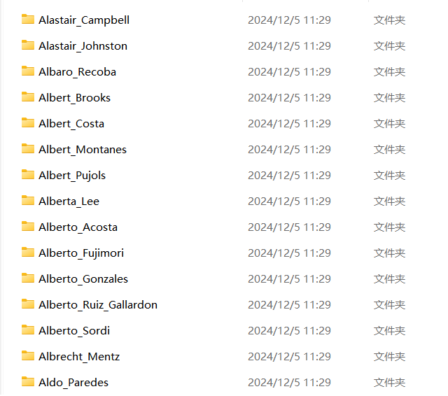


## 3. 生物特征识别算法

​	本实验采用的是人脸识别使用了**人脸识别**作为生物特征识别的算法，具体的算法是 基于LBPH（局部二值模式直方图，Local Binary Patterns Histograms）的人脸识别算法。

​	训练阶段使用LBPH算法通过 `detect_and_extract_face`函数提取出每张训练图片的面部特征

​	并使用 `cv2.face.LBPHFaceRecognizer_create()`创建了一个LBPH人脸识别器。


LBFH的过程：

- 预处理，正式处理前的操作，如转为灰度图、调整大小等
- 局部二值模式（LBP），每个像素的值和邻域像素的二进制模式一起描述了局部区域的纹理特征
- 构建直方图，计算每个小区域的LBP值，并生成直方图，生成图像的“指纹”
- 进行识别时，对输入图像进行相同的处理，生成特征直方图，然后通过计算输入图像与训练数据中所有图像的直方图距离（如欧几里得距离），选择最小的距离对应的标签作为识别结果。


LBFH优缺点：

- 优点：
  - 计算效率高
  - 不受光照、角度变化的影响
  - 简单
- 缺点：
  - 缺乏细致的特征，如表情
  - 对极端姿态的容错性差


`Opencv`中有实现LBFH的方法，直接使用`OpenCV`即可

```
pip install opencv-python opencv-contrib-python
```


### 3.0 LBFH算法训练程序

```python
import os
import random
import cv2
import numpy as np

# 数据集路径
DATASET_PATH = "lfw"  # 替换为LFW或其他数据集路径

# 加载图片和标签
def load_dataset(dataset_path, max_samples=100):
    print("正在加载数据集...")
    images, labels = [], []
    for label in os.listdir(dataset_path):
        label_path = os.path.join(dataset_path, label)
        if not os.path.isdir(label_path):
            continue
        for img_file in os.listdir(label_path):
            img_path = os.path.join(label_path, img_file)
            images.append(img_path)
            labels.append(label)
            if len(images) >= max_samples:
                break
    print(f"数据集加载完毕，共加载了 {len(images)} 张图片。")
    return images, labels

# 人脸检测与特征提取
def detect_and_extract_face(image_path, face_cascade):
    image = cv2.imread(image_path, cv2.IMREAD_GRAYSCALE)  # 读取灰度图像
    faces = face_cascade.detectMultiScale(image, scaleFactor=1.1, minNeighbors=5)
    if len(faces) == 0:
        return None  # 未检测到人脸
    x, y, w, h = faces[0]  # 选择第一个人脸
    face = image[y:y + h, x:x + w]
    return cv2.resize(face, (100, 100))  # 归一化大小

# 主函数
if __name__ == "__main__":
    # 加载数据
    images, labels = load_dataset(DATASET_PATH, max_samples=200)

    # 随机划分数据集
    indices = list(range(len(images)))
    random.shuffle(indices)
    train_indices = indices[: int(0.7 * len(indices))]
    test_indices = indices[int(0.7 * len(indices)):]

    train_images = [images[i] for i in train_indices]
    train_labels = [labels[i] for i in train_indices]
    test_images = [images[i] for i in test_indices]
    test_labels = [labels[i] for i in test_indices]

    # 加载人脸检测模型（Haar 级联分类器）
    face_cascade = cv2.CascadeClassifier(cv2.data.haarcascades + 'haarcascade_frontalface_default.xml')

    # 初始化人脸识别器（LBPH）
    recognizer = cv2.face.LBPHFaceRecognizer_create()

    # 提取训练数据
    train_faces = []
    valid_train_images = []  # 新列表用于存储有效的图片路径
    valid_train_labels = []  # 新列表用于存储有效的标签

    print("正在提取训练数据...")
    for i, img_path in enumerate(train_images):
        if i % 20 == 0:
            print(f"正在处理第 {i+1}/{len(train_images)} 张训练图片...")
        face = detect_and_extract_face(img_path, face_cascade)
        if face is not None:
            train_faces.append(face)
            valid_train_images.append(img_path)  # 保存有效的图片路径
            valid_train_labels.append(train_labels[i])  # 保存有效的标签
        else:
            print(f"未检测到人脸：{train_images[i]}")  # 调试信息

    # 使用有效的训练数据和标签进行训练
    recognizer.train(train_faces, np.array(range(len(train_faces))))

    # 更新后的训练集和标签
    train_images = valid_train_images
    train_labels = valid_train_labels

    # 保存训练好的模型
    recognizer.save("trainer.xml")
    print("训练数据集已保存为 trainer.xml")

    print(f"训练数据集生成并保存完毕，已成功提取 {len(train_faces)} 张有效的训练图片。")

```


### 3.1 程序运行结果截图

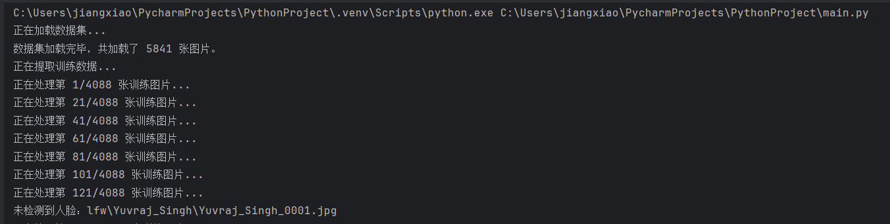

中间省去大部分........

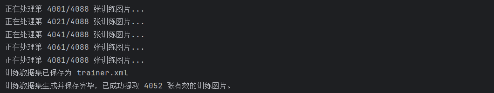


### 3.2 训练后的数据集

数据集较大，截取了`trainer.xml` 的一部分内容作为展示：

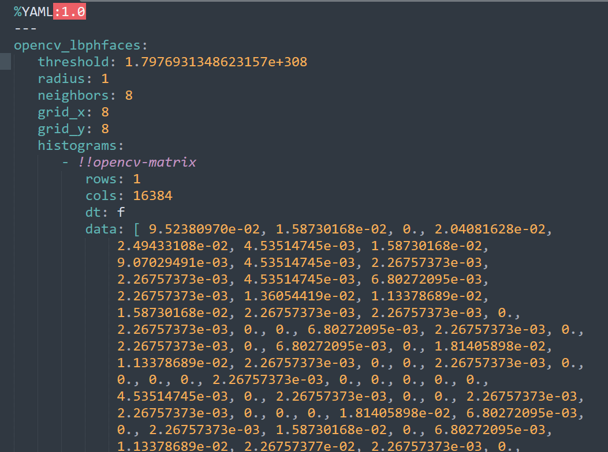


​	==为了后续人脸识别的准确度，后续就使用网络上流行的别人以及训练好的且准确度较好的数据集了。==


## 4. 统计识别的拒识率、误识率和速度等性能指标

训练完数据集就是识别了，拿着之前生成的`trainer.xml` 作为训练好的模型，用OpenCV内置的Haar级联分类器即可。


### 4.0 定义真实标签

首先要处理识别的拒识率、误识率等要先定义真实的标签个数，最经典就是手动打标签，但这里移除了 `labels` 字典的定义和引用，改为使用识别器的输出标签来进行误识和拒识的判断。

正常做法应该是定义一个labels，然后按照LFW数据集来进行定义标签

```
    labels = {
        'agirl.png': 1,
        'aman.png': 1,
        'more_people.jpg': [1,2],
        'giegie.jpg': 1,
        'dog_and_people.jpg': 1,
    }
```


这里使用判断拒识和误识的方式是通过识别的 `confidence` 置信度值。如果置信度低，则认为是拒识，如果标签与期望不符，则认为是误识。

### 4.1 识别程序

```python
import cv2 as cv
import os
import time
import numpy as np

# 单次检测
def face_detect_demo(img, image_path, recognizer, face_detect):
    gray = cv.cvtColor(img, cv.COLOR_BGR2GRAY)  # 转灰度化，减少运算
    faces = face_detect.detectMultiScale(gray, 1.1, 4)  # 检测人脸，返回人脸参数

    print(f"检测到 {len(faces)} 张人脸")

    # 初始化计数器
    false_rejects = 0  # 拒识（False Rejection）计数
    false_accepts = 0  # 误识（False Acceptance）计数
    total_faces = len(faces)  # 检测到的人脸总数

    # 获取图像的基本名称（文件名）
    image_name = os.path.basename(image_path)

    # 遍历检测到的每一张人脸
    for (x, y, w, h) in faces:
        face = gray[y:y + h, x:x + w]  # 提取人脸区域

        # 识别人脸
        label, confidence = recognizer.predict(face)
        print(f"识别到的人脸标签: {label}, 置信度: {confidence}")

        # 标记拒识（False Rejection）和误识（False Acceptance）
        # 假设识别出的标签与实际标签匹配（此处可以依据其他标准来评估是否正确）
        if confidence < 100:  # 置信度较低，视为拒识
            false_rejects += 1
        elif label != 1:  # 如果标签不匹配，可以视为误识
            false_accepts += 1

        # 在人脸周围画矩形框，并标注识别结果
        cv.rectangle(img, (x, y), (x + w, y + h), color=(0, 0, 255), thickness=2)  # 识别到的脸用矩形画出
        cv.putText(img, str(label), (x, y - 10), cv.FONT_HERSHEY_SIMPLEX, 0.9, (0, 255, 0), 2)  # 写上标签

    # 保存处理后的图片
    output_path = f"output_{image_name}"
    cv.imwrite(output_path, img)  # 保存图像
    print(f"处理后的图片已保存: {output_path}")

    return false_rejects, false_accepts, total_faces

# 遍历文件夹，多次检测
def detect_more():
    path = 'lfw_test'  # 测试集路径
    image_paths = [os.path.join(path, f) for f in os.listdir(path) if
                   f.endswith('.png') or f.endswith('.jpg')]  # 只加载图像文件

    # 初始化LBPH识别器
    recognizer = cv.face.LBPHFaceRecognizer_create()
    recognizer.read('trainer.xml')  # 读取训练好的模型

    # 加载Haar级联分类器进行人脸检测
    face_detect = cv.CascadeClassifier(cv.data.haarcascades + 'haarcascade_frontalface_default.xml')

    # 性能指标统计
    total_faces_detected = 0
    total_false_rejects = 0
    total_false_accepts = 0
    total_processing_time = 0
    total_images = 0

    for image_path in image_paths:
        print(f"正在处理: {image_path}")
        img = cv.imread(image_path)

        start_time = time.time()  # 记录处理开始时间
        false_rejects, false_accepts, faces_detected = face_detect_demo(img, image_path, recognizer, face_detect)
        end_time = time.time()  # 记录处理结束时间

        # 更新性能指标
        total_faces_detected += faces_detected
        total_false_rejects += false_rejects
        total_false_accepts += false_accepts
        total_processing_time += (end_time - start_time)
        total_images += 1

        # 打印当前图像的性能指标
        if faces_detected > 0:
            frr = false_rejects / faces_detected
            far = false_accepts / faces_detected
            print(f"图像 {image_path} - 拒识率 (FRR): {frr * 100:.2f}%, 误识率 (FAR): {far * 100:.2f}%")
        else:
            print(f"图像 {image_path} 没有检测到人脸，跳过拒识率和误识率计算。")

    # 汇总性能指标
    if total_faces_detected > 0:
        frr = total_false_rejects / total_faces_detected
        far = total_false_accepts / total_faces_detected
        avg_time = total_processing_time / total_images

        print(f"\n总共检测到人脸数量: {total_faces_detected}")
        print(f"总拒识率 (FRR): {frr * 100:.2f}%")
        print(f"总误识率 (FAR): {far * 100:.2f}%")
        print(f"平均处理时间: {avg_time:.4f} 秒/张图片")
    else:
        print("未检测到任何人脸，无法计算性能指标。")

if __name__ == '__main__':
    # 检测图像并统计性能指标
    detect_more()

    # 释放内存
    cv.destroyAllWindows()

```


### 4.2 运行结果

#### 单人脸

##### akid

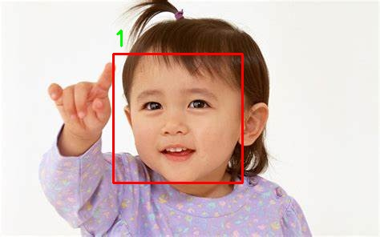


##### agirl

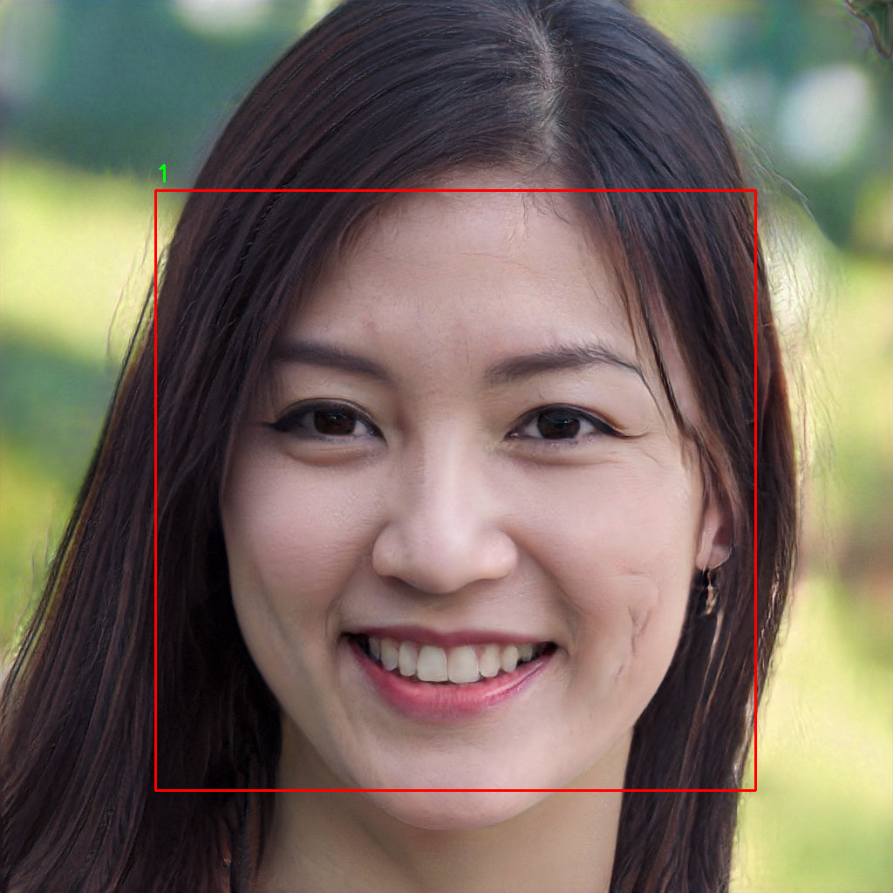


##### aman

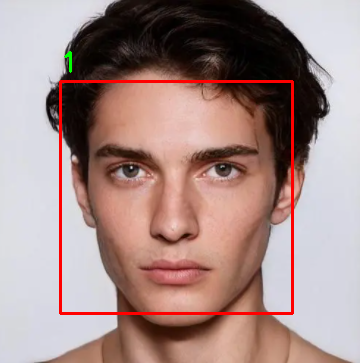


##### giegie


由上可以看到单人脸的识别率都是挺高的，但是`agirl`的置信度不太高，`akid`、`aman`、`giegie`的置信度挺高的

```
正在处理: lfw_test\agirl.png
检测到 1 张人脸
识别到的人脸标签: 1, 置信度: 64.18343734518412

正在处理: lfw_test\akid.jpg
检测到 1 张人脸
识别到的人脸标签: 1, 置信度: 91.26257771065748

正在处理: lfw_test\aman.png
检测到 1 张人脸
识别到的人脸标签: 1, 置信度: 96.27491454125555

正在处理: lfw_test\giegie.jpg
检测到 1 张人脸
识别到的人脸标签: 1, 置信度: 125.89591684042922
```


#### 多人脸

##### dog_and_people

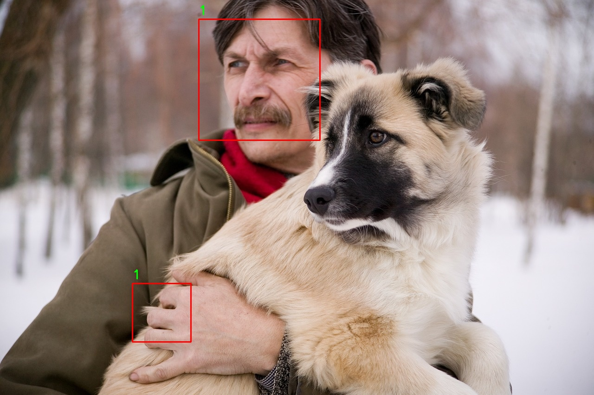


标签打到手上，一个误判，不过庆幸的是没有往狗的脸上标记。


##### starmore

可以看到识别不到的情况一般都是脸部形态不太明显，还有一些地方进行二次判定的

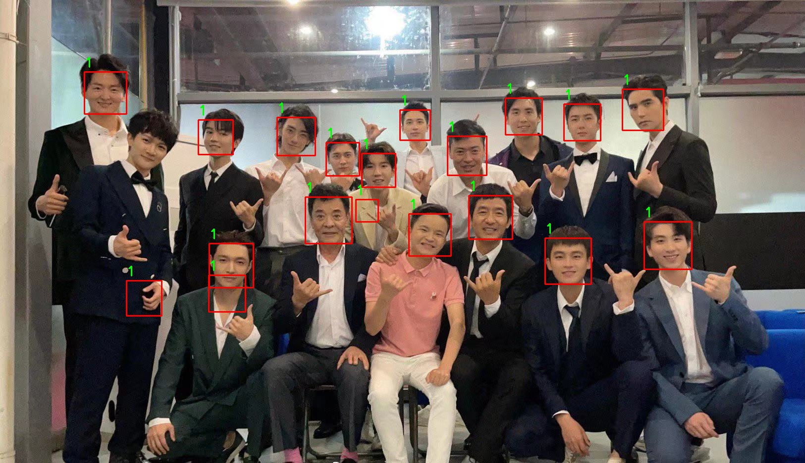


##### more_people

经典的图片，只不过顿德尔没有识别到，都怀疑是不是标签遮到了hh

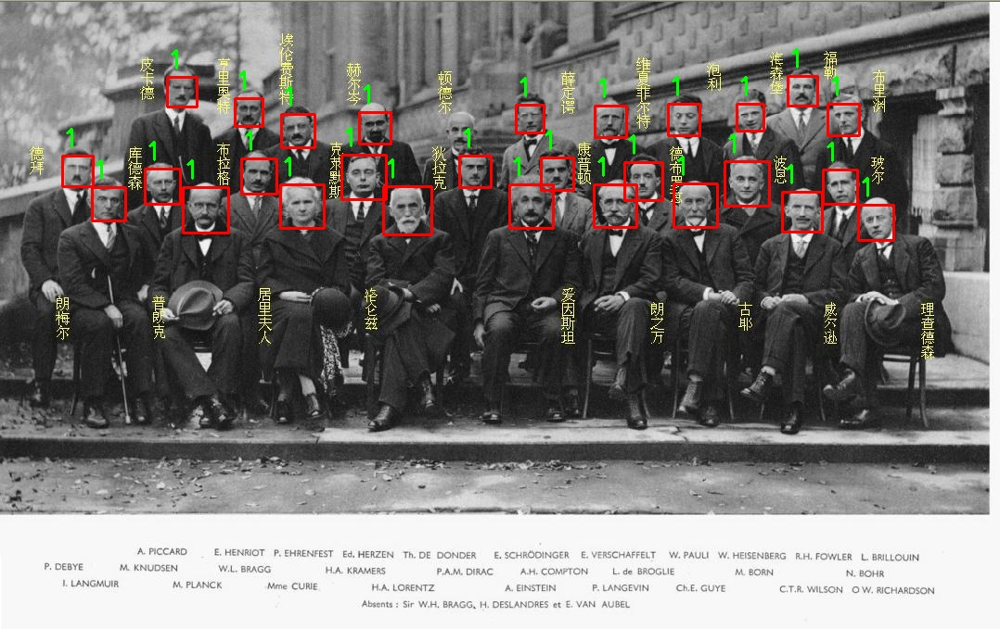


##### moremoremore

一堆各样的人脸，不过一个侧脸没有识别到

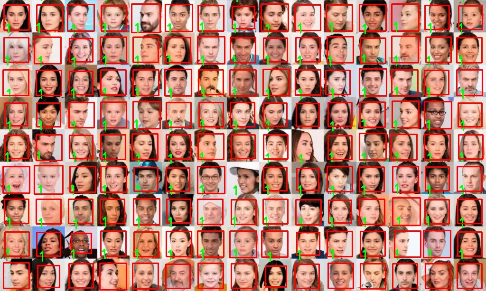


### 总程序

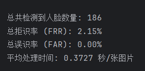


## 5. 结论

**人脸检测与识别效果**：Haar级联分类器和LBPH识别器相结合，能够有效地检测并识别人脸，适合在较为简单的环境下使用。

**误识与拒识**：误识率（FAR）和拒识率（FRR）依赖于模型训练质量及输入图像的质量，低置信度通常导致较高的拒识率，而标签不匹配可能导致误识。

**性能评估**：通过对多张图像的处理，能够计算出平均处理时间和整体的拒识率与误识率，为进一步优化模型提供了依据。


简单的训练数据集出来的模型的识别率还是有待提高的


## 6. 拓展

上网查询了一下，行业中对人脸识别进行了大量的优化

包括但不限于：

在行业中，提高人脸识别率的常用方法包括：

1. **深度学习模型**：
   - **卷积神经网络 (CNNs)**：用于提取更为细致的特征，能够显著提高识别准确率，尤其在复杂环境下。
   - **ResNet、VGG、Inception 等预训练模型**：这些模型在大规模数据集（如 ImageNet）上进行训练，可以迁移到人脸识别任务中，极大提升识别性能。
2. **数据增强**：
   - **图像预处理与数据增强**：通过旋转、翻转、裁剪、亮度调整等技术，增加训练数据的多样性，提升模型的鲁棒性。
3. **更强的人脸检测算法**：
   - **MTCNN**（Multi-task Cascaded Convolutional Networks）：能够更精确地检测人脸，尤其是在复杂背景下。
   - **Dlib**：Dlib的人脸检测与关键点定位表现也非常优秀，适用于高精度要求的场景。
4. **多模态融合**：
   - **结合其他生物特征**：例如，通过结合声纹、虹膜或指纹信息，增加识别的准确度。
5. **人脸识别的优化算法**：
   - **特征嵌入与度量学习**：如 **FaceNet**、**ArcFace** 等模型，使用深度度量学习技术来将人脸映射到一个高维空间，计算其相似度，能显著提高准确性，特别是在面对高变化和复杂背景时。
6. **大规模数据集训练**：
   - **训练数据的多样性和量**：更大的训练数据集能够帮助模型学习到更复杂的特征，提高在不同环境下的表现。
7. **微调与迁移学习**：
   - **迁移学习**：利用已有的强大模型进行微调，尤其是当数据集较小时，通过迁移学习可提高准确度，减少过拟合。
8. **硬件加速与并行计算**：
   - **GPU加速**：使用GPU进行并行计算，能提高训练速度，提升模型的精度。