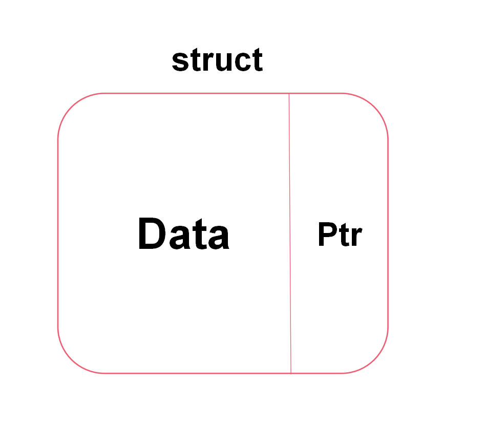
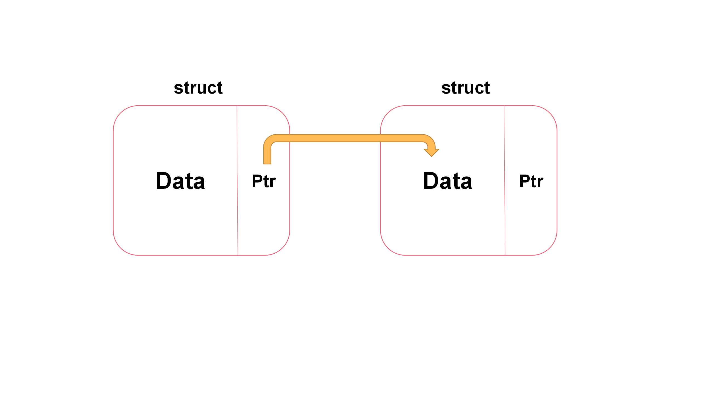

# 链表专栏

[TOC]

是的，这里是专门学习链表的专栏，从Easy到Hard，做个总结。是的，只是总结和题目的归纳，不做其他详细的教学。

本文可能有点过长，耐心观看，且少图，太多题了，看图请去看官解！

全文题目来源于 **[LeetCode](https://leetcode.cn/)** ，感谢。

本文参考代码大部分来源于**[LeetCode](https://leetcode.cn/)**，感谢。

本文首发于LeetCode and CSDN

- LeetCode ： [jiang-xiao-a4 - 力扣（LeetCode）](https://leetcode.cn/u/jiang-xiao-a4/)
- CSDN：[CSDN-bifenglededaima](https://blog.csdn.net/weixin_51334923?spm=1010.2135.3001.5343)

**须知：**

- 本文只为应用，基础概念简单带过，主要为了刷题而写，非工程代码，对内存泄漏方面可能没太注意；
- 本文参考都是C++代码，想要其他代码可以仿照着写或者直接点进链接去官方看官解；
- 本文中答案显示只做参考，并且我一般都用迭代法来做；
- 链表是最基础的数据结构之一，不能说精通吧，也要来个《熟悉》；
- **链表题目的万能方法——画图。**


## 一.什么是链表？

链表如名字所示，像一条项链一样串着，并且可以像项链一样杂乱存储摆放在物理存储单元里。

它不像以前学习的数组在存储单元里是连续存放的，所以这里排出个问题，我怎么知道每一个链表存储在那里？并且有了数组之后，我为什么还需要链表？

以前学C语言的时候都学过struct吧，通过这个我们可以构建自定义的数据结构，而不仅仅是int，char这种类型的

单链表即是如此：

[](https://imgse.com/i/pSMh51s)

看，它一个链表节点里包含了Data区和一个Ptr指针区

[](https://imgse.com/i/pSMISw6)


经典的单链表定义Cpp代码如下：

```cpp
struct ListNode {
	int val;
	ListNode *next;
    ListNode() : val(0), next(nullptr) {}
	ListNode(int x) : val(x), next(NULL) {}
    ListNode(int x, ListNode *next) : val(x), next(next) {}
};
```


使用如下：

```cpp
cout<< pre->val << endl;				// 打印pre节点的值
ListNode *pre = new ListNode(0);		// 创建一个pre节点，val=0，next指向nullptr
ListNode *prev = new ListNode(0,head);	//创建一个prev节点，val=0，next指向head，相当于在head之前创建了一个哑节点，十分常用，一定要会
ListNode *cur = new LisNode();			// 创建一个cur节点，val=0，next指向nullptr
ListNode *tail = pre -> next;			// 让tail = pre->next； 就相当于改名 pre的下一个节点叫做tail
pre = pre->next;						// pre = pre->next 移动，效果就是当前pre变成之前pre的下一个节点了！
```


**可是链表不仅有单向链表，还有双向链表、单向循环链表、双向循环链表...**

**但是只了解单链表基本可以满足面试和leetcode大部分题目的要求**

所以这里稍微做个简单的了解

- 双向链表就是比单向链表多一个指向之前一个节点的指针，就是双向链表的每一个节点既可以访问它的prev，也可以访问next；

- 单向循环链表就是还是单向，但是首节点和尾节点是连接在一起的，就是尾节点的next是首节点；

- 双向循环链表就无需解释了，和上面差不多。

==**跳表、双端链表、有序链表之类，等再强大一点再来了解吧！**==

----------------

回到上面那个问题，有了数组为什么还要用链表？

如 C++

```cpp
vector<int> Ans={1,2,3,4,5,6};
```

你想要在3和4之间插入一个穷凶极恶的数值114514，你会怎么办？

1. 你想要再来个数组，并且长度是`Ans`的+1位，然后一个个赋值过去，到3之后就赋值114514，然后后面又继续赋值回去？
2. 或者原地扩容，两两替换到4之前插入114514？
3. ...


可以想到上述的做法数量小的时候似乎可以，如果有几百万的数据，那个要插入的值偏偏在中间怎么办？那你要替换（几百万/2）次吗？

或者经典案例，像飞行射击游戏，战机的子弹位置和数量都是不可预测的，会根据用户的操作进行频繁变化，这时候又怎么办呢？

所以诸多案例证明，链表这个东西的出现是有一定道理的。

并且相比数组而言，链表：

- 能够在 O(1) 时间内在给定结点之后或列表开头添加一个新结点；

- 能够在 O(1) 时间内删除第一个结点


---------------


## 二.链表基本操作

了解了基本的知识，应该可以达到掌握自己设计链表，链表节点的增删查改之类的基础操作！

题目摘自  **[LeetCode](https://leetcode.cn/)**

-------------------

### 1.设计链表

**[707. 设计链表 ](https://leetcode.cn/problems/design-linked-list/)（链表的基础概念）**

**难度：Medium**

**题目要求：**

在链表类中实现这些功能：

```cpp
// get(index)：获取链表中第 index 个节点的值。如果索引无效，则返回-1。
// addAtHead(val)：在链表的第一个元素之前添加一个值为 val 的节点。插入后，新节点将成为链表的第一个节点。
// addAtTail(val)：将值为 val 的节点追加到链表的最后一个元素。
// addAtIndex(index,val)：在链表中的第 index 个节点之前添加值为 val  的节点。如果 index 等于链表的长度，则该节点将附加到链表的末尾。如果 index 大于链表长度，则不会插入节点。如果index小于0，则在头部插入节点。
// deleteAtIndex(index)：如果索引 index 有效，则删除链表中的第 index 个节点。
```

**原题链接：**https://leetcode.cn/problems/design-linked-list/


**题解：**

**思路讲解**：

题目不再需要自己写struct内容，直接在类中定义即可。且根据题目意思，还要来一个存储链表长度的size！

分别分析一下五个函数都要我们做什么？

get(index)，首先应该要判断index和size的关系，然后从头节点处遍历index位，返回index位的val即可！

addAtIndex(index,val)，解决了就可以解决addAtHead(val)与addAtTail(val)，因为二者是它的特殊情况。思路和那个插入链表节点的做法差不多！

deleteAtIndex(index)，删除链表节点，同理要提前判断index的有效性，size也要随之更改！

**Cpp代码：**

```cpp
class MyLinkedList {
public:
    MyLinkedList() {
        this->size=0;
        this->head=new ListNode(0);
    }
    
    int get(int index) {
        if(index<0||index>=size){
            return -1;
        }
        ListNode *cur = head;
        for(int i=0;i<=index;i++){
            cur =cur->next;
        }
        return cur->val;
    }
    
    void addAtHead(int val) {
        addAtIndex(0,val);
    }
    
    void addAtTail(int val) {
        addAtIndex(size,val);
    }
    
    void addAtIndex(int index, int val) {
        if(index>size)return;
        index=max(0,index);
        size++;
        ListNode *pred = head;
        for(int i=0;i<index;i++){
            pred = pred->next;
        }
        ListNode *toAdd = new ListNode(val);
        toAdd->next=pred->next;
        pred->next=toAdd;
    }
    
    void deleteAtIndex(int index) {
        if(index<0||index>=size)return;
        size--;
        ListNode *pred =head;
        for(int i=0;i<index;i++){
            pred = pred->next;
        } 
        ListNode *p = pred->next;
        pred->next=pred->next->next;
        delete p;
    }
private:
    int size;
    ListNode *head;
};

/**
 * Your MyLinkedList object will be instantiated and called as such:
 * MyLinkedList* obj = new MyLinkedList();
 * int param_1 = obj->get(index);
 * obj->addAtHead(val);
 * obj->addAtTail(val);
 * obj->addAtIndex(index,val);
 * obj->deleteAtIndex(index);
 */
```


------------------------

### 2.删除给定的节点

**[237. 删除链表中的节点 ](https://leetcode.cn/problems/delete-node-in-a-linked-list/) （直接给节点删除）**

**难度：Medium**

**题目要求：**

有一个单链表的 head，我们想删除它其中的一个节点 node。

给你一个需要删除的节点 node 。你将 无法访问 第一个节点  head。

链表的所有值都是 唯一的，并且保证给定的节点 node 不是链表中的最后一个节点。

删除给定的节点。注意，删除节点并不是指从内存中删除它。这里的意思是：

- 给定节点的值不应该存在于链表中。
- 链表中的节点数应该减少 1。
- node 前面的所有值顺序相同。
- node 后面的所有值顺序相同。


**原题链接：**https://leetcode.cn/problems/delete-node-in-a-linked-list/


**题解：**

**思路讲解**：

这道题没啥的，但要注意一下，题目给的node恰恰是要你去删除的那个节点。所以听leetcode网友的话，就是整容手术，无法直接删除，那就伪装成下一个节点继续生活吧！

**Cpp代码：**

操作整个结构体

```c++
class Solution {
public:
    void deleteNode(ListNode* node) {
        *node=*node->next;
    }
};
```

操作结构体内每个元素

```c++
class Solution {
public:
    void deleteNode(ListNode* node) {
        node->val=node->next->val;
        node->next=node->next->next;
    }
};
```


-----------------------------------

### 3.删除val值节点（仅有一个）

**[剑指 Offer 18. 删除链表的节点 ](https://leetcode.cn/problems/shan-chu-lian-biao-de-jie-dian-lcof/) （删除val值的节点且仅有一个）**

**难度：Easy**

**题目要求：** 

给定单向链表的头指针和一个要删除的节点的值，定义一个函数删除该节点。

返回删除后的链表的头节点。

```cpp
输入: head = [4,5,1,9], val = 5
输出: [4,1,9]
解释: 给定你链表中值为 5 的第二个节点，那么在调用了你的函数之后，该链表应变为 4 -> 1 -> 9.
```

**原题链接：** https://leetcode.cn/problems/shan-chu-lian-biao-de-jie-dian-lcof/


**题解：**

**思路讲解**：

因为链表的特殊性，不像数组那样可以找到之后对该位进行操作。所以你得保存val值为目标值的那个节点的上一个节点，让上一个节点和当前节点的下一个节点链接起来！

**Cpp代码：**

```c++
class Solution {
public:
    ListNode* deleteNode(ListNode* head, int val) {
        ListNode* pre = head;
        ListNode* cur = head->next;
        if(pre->val==val){return head->next;}
        while(cur!=nullptr&&cur->val!=val){
            pre = cur;
            cur = cur->next;
        }
        if(cur!=NULL){pre->next=cur->next;}
        return head;
    }
};
```


**C语言版本：**

```c
/**
 * Definition for singly-linked list.
 * struct ListNode {
 *     int val;
 *     struct ListNode *next;
 * };
 */


struct ListNode* deleteNode(struct ListNode* head, int val){
    struct ListNode* dummyHead = (struct ListNode*)malloc(sizeof(struct ListNode));
    dummyHead->next=head;
    struct ListNode* cur = dummyHead;
    while(cur->next!=NULL){
        if(cur->next->val==val){
            cur->next=cur->next->next;
            break;
        }
        else cur=cur->next;
    }
    struct ListNode* retNode = dummyHead->next;
    free(dummyHead);
    return retNode;
}
```


**Linus版本：**

```c
/**
 * Definition for singly-linked list.
 * struct ListNode {
 *     int val;
 *     struct ListNode *next;
 * };
 */


struct ListNode* deleteNode(struct ListNode* head, int val){
    struct ListNode** indirect = &head;
    for(;*indirect;indirect=&((*indirect)->next)){
        if((*indirect)->val==val){
            *indirect = (*indirect)->next;
            break;
        }
    }
    return head;
}
```


-----------------------

### 4.删除val值节点（可能有多个）

**[203. 移除链表元素 ](https://leetcode.cn/problems/remove-linked-list-elements/)（删除val值的节点可能有多个）**

**难度：Easy**

**题目要求：**

给你一个链表的头节点 `head` 和一个整数 `val` ，请你删除链表中所有满足 `Node.val == val` 的节点，并返回 **新的头节点** 。

```cpp
输入：head = [1,2,6,3,4,5,6], val = 6
输出：[1,2,3,4,5]
    
输入：head = [7,7,7,7], val = 7
输出：[]
```

**原题链接：**https://leetcode.cn/problems/remove-linked-list-elements/


**题解：**

**思路讲解**：

这种题目套路一般都是来一个哑节点，因为万一你头节点的val值就是目标值，要删除怎么办？

创建了哑节点之后，就一直遍历到底，判断，移指针就可以了。

**Cpp代码：**

```cpp
/**
 * Definition for singly-linked list.
 * struct ListNode {
 *     int val;
 *     ListNode *next;
 *     ListNode() : val(0), next(nullptr) {}
 *     ListNode(int x) : val(x), next(nullptr) {}
 *     ListNode(int x, ListNode *next) : val(x), next(next) {}
 * };
 */
class Solution {
public:
    ListNode* removeElements(ListNode* head, int val) {
        struct ListNode* dummyHead=new ListNode(0,head);
        struct ListNode* temp=dummyHead;
        while(temp->next!=NULL){
            if(temp->next->val==val){
                temp->next=temp->next->next;
            }
            else{
                temp=temp->next;
            }
        }
        return dummyHead->next;
    }
};
```


-----------------------------

### 5.删除重复元素（只保留第一个）

**[83. 删除排序链表中的重复元素 ](https://leetcode.cn/problems/remove-duplicates-from-sorted-list/)（重复元素只保留第一个出现的节点）**

**难度：Easy**

**题目要求：**

给定一个已排序的链表的头 `head` ， *删除所有重复的元素，使每个元素只出现一次* 。返回 *已排序的链表* 。

```cpp
输入：head = [1,1,2]
输出：[1,2]

输入：head = [1,1,2,3,3]
输出：[1,2,3]
```

**原题链接：**https://leetcode.cn/problems/remove-duplicates-from-sorted-list/


**题解：**

**思路讲解**：

这一道题和上一道题目稍稍有点不一样，这个不是删除所有的val值，而是要保留重复元素的第一个，所以看起来代码有点差不多。还是一样做法。

**Cpp代码：**

```c++
class Solution {
public:
    ListNode* deleteDuplicates(ListNode* head) {
        struct ListNode* temp = head;
        if(!head){return head;}
        while(temp->next){
            if(temp->val!=temp->next->val){
                temp=temp->next;
            }
            else{
                temp->next=temp->next->next;
            }
        }
        return head;
    }
};
```


----------------------

### 6.删除重复元素（不保留重复的任何一个）

**[82. 删除排序链表中的重复元素 II](https://leetcode.cn/problems/remove-duplicates-from-sorted-list-ii/)（删除val值存在2个以上的所有val=this->val的节点）**

**难度：Medium**

**题目要求：**

给定一个已排序的链表的头 `head` ， *删除原始链表中所有重复数字的节点，只留下不同的数字* 。返回 *已排序的链表* 。

```cpp
输入：head = [1,2,3,3,4,4,5]
输出：[1,2,5]
    
输入：head = [1,1,1,2,3]
输出：[2,3]
```

**原题链接：**https://leetcode.cn/problems/remove-duplicates-from-sorted-list-ii/


**题解：**

**思路讲解**：

这道题直接让我们把重复出现的节点都删除掉，还是一样做法，只不过移动指针时候要注意修改一点

**Cpp代码：**

```cpp
/**
 * Definition for singly-linked list.
 * struct ListNode {
 *     int val;
 *     ListNode *next;
 *     ListNode() : val(0), next(nullptr) {}
 *     ListNode(int x) : val(x), next(nullptr) {}
 *     ListNode(int x, ListNode *next) : val(x), next(next) {}
 * };
 */
class Solution {
public:
    ListNode* deleteDuplicates(ListNode* head) {
        if (!head)return head;
        ListNode* dummy = new ListNode(0, head);
        ListNode* cur = dummy;
        while (cur->next && cur->next->next) {
            if (cur->next->val == cur->next->next->val) {
                int x = cur->next->val;
                while (cur->next && cur->next->val == x)cur->next = cur->next->next;
            }
            else cur = cur->next;
        }
        return dummy->next;
    }
};
```


----------------

### 7.逆序打印链表

**[剑指 Offer 06. 从尾到头打印链表 ](https://leetcode.cn/problems/cong-wei-dao-tou-da-yin-lian-biao-lcof/)（逆序打印链表）**

**难度：Easy**

**题目要求：**

输入一个链表的头节点，从尾到头反过来返回每个节点的值（用数组返回）。

```cpp
输入：head = [1,3,2]
输出：[2,3,1]
```

**原题链接：**https://leetcode.cn/problems/cong-wei-dao-tou-da-yin-lian-biao-lcof/


**题解：**

**思路讲解**：

逆序打印链表，而且要求返回值是个数组形式。所以我们可以直接定义个数组，然后头插。或者顺序存储，逆序复制。

再或者拿一个栈来存储，遍历完再输入到一个数组里头返回！

**Cpp代码：**

遍历插入

```c++
class Solution {
public:
    vector<int> reversePrint(ListNode* head) {
        //方法一
        vector<int> nums;
        while(head!=NULL){
            nums.insert(nums.begin(),head->val);
            head=head->next;
        }
        return nums;
    }
};
```

数组改进：

```cpp
class Solution {
public:
    vector<int> reversePrint(ListNode* head) {
        // 数组法改进
        struct ListNode* pre = head;
        int len = 0 ;
        while(pre){
            len++;
            pre = pre->next;
        }
        vector<int> Ans(len);
        pre = head;
        while(pre){
            Ans[len-1] = pre->val;
            pre = pre->next;
            len--;
        }
        return Ans;
    }
};
```

压栈做法：

```c++
class Solution {
public:
    vector<int> reversePrint(ListNode* head) {
        //方法二
        stack<ListNode*> stk;
        struct ListNode* pre = head;
        vector<int> Ans;
        while(pre){
            stk.push(pre);
            pre = pre->next;
        }
        while(!stk.empty()){
            Ans.push_back(stk.top()->val);
            stk.pop();
        }
        return Ans;
    }
};
```


----------------------

### 8.逆序打印不可变链表

**[1265. 逆序打印不可变链表](https://leetcode.cn/problems/print-immutable-linked-list-in-reverse/)（加深对链表的理解）**

**难度：Medium**

**题目要求：**

给您一个不可变的链表，使用下列接口逆序打印每个节点的值：

- ImmutableListNode: 描述不可变链表的接口，链表的头节点已给出。

您需要使用以下函数来访问此链表（您 不能 直接访问 ImmutableListNode）：

- ImmutableListNode.printValue()：打印当前节点的值。

- ImmutableListNode.getNext()：返回下一个节点。

输入只用来内部初始化链表。您不可以通过修改链表解决问题。也就是说，您只能通过上述 API 来操作链表。

```cpp
输入：head = [1,2,3,4]
输出：[4,3,2,1]
```

**原题链接：**https://leetcode.cn/problems/print-immutable-linked-list-in-reverse/


**题解：**

**思路讲解**：

这道题目比较有意思，同样是逆序打印链表，但是题目只给了你两个API函数，一个是打印当前节点值，一个是指向下一个节点的指针，那么我们怎么去思考呢？

毫无疑问，你可以无脑栈方法。而且我认为用栈来做是比较简单的hh。

这里有个新思路，就是用时间换空间。可以想到一个双指针，第一次遍历到链表末尾，然后打印；第二次遍历到末尾的前一个节点，然后打印，一直到头节点处，停止打印。不过可以想到这个时间复杂度挺高的。

**Cpp代码：**

```cpp
/**
 * // This is the ImmutableListNode's API interface.
 * // You should not implement it, or speculate about its implementation.
 * class ImmutableListNode {
 * public:
 *    void printValue(); // print the value of the node.
 *    ImmutableListNode* getNext(); // return the next node.
 * };
 */

class Solution {
public:
    void printLinkedListInReverse(ImmutableListNode* head) {
        // 栈方法
        // stack<ImmutableListNode*> stk;
        // ImmutableListNode* pre = head;
        // while(pre){
        //     stk.push(pre);
        //     pre = pre->getNext();
        // }
        // while(!stk.empty()){
        //     stk.top()->printValue();
        //     stk.pop();
        // }

        // 双指针
        if (head == nullptr)return;
        ImmutableListNode* fast_begin = head->getNext();
        while (fast_begin != nullptr) {
            ImmutableListNode* slow = head;
            ImmutableListNode* fast = fast_begin;
            while (fast != nullptr) {
                slow = slow->getNext();
                fast = fast->getNext();
            }
            slow->printValue();
            fast_begin = fast_begin->getNext();
        }
        head->printValue();
    }
};
```


-----------------------

### 9.删除链表的中间节点

**[2095. 删除链表的中间节点](https://leetcode.cn/problems/delete-the-middle-node-of-a-linked-list/)（找中点+删除节点）**

**难度：Medium**

**题目要求：**

给你一个链表的头节点 head 。删除链表的中间节点 ，并返回修改后的链表的头节点 head 。

长度为 n 链表的中间节点是从头数起第 ⌊n / 2⌋ 个节点（下标从 0 开始），其中 ⌊x⌋ 表示小于或等于 x 的最大整数。

```cpp
输入：head = [1,3,4,7,1,2,6]
输出：[1,3,4,1,2,6]
    
输入：head = [1,2,3,4]
输出：[1,2,4]
    
输入：head = [2,1]
输出：[2]    
```

**原题链接：**https://leetcode.cn/problems/delete-the-middle-node-of-a-linked-list/


**题解：**

**思路讲解**：

这道题是寻找链表中点的进阶版，但还是挺简单的。需要注意的是，你需要保存中点之前的那个节点，去和中点的下一个节点进行链接！

**Cpp代码：**

```cpp
/**
 * Definition for singly-linked list.
 * struct ListNode {
 *     int val;
 *     ListNode *next;
 *     ListNode() : val(0), next(nullptr) {}
 *     ListNode(int x) : val(x), next(nullptr) {}
 *     ListNode(int x, ListNode *next) : val(x), next(next) {}
 * };
 */
class Solution {
public:
    ListNode* deleteMiddle(ListNode* head) {
        if(!head||!head->next)return nullptr;
        ListNode* slow = head;
        ListNode* fast = head;
        ListNode* prev = nullptr;
        while(fast&&fast->next){
            prev = slow;
            slow = slow->next;
            fast = fast->next->next;
        }
        prev->next = slow->next;
        return head;

    }
};
```


---------------------------------

### 10.对链表进行插入排序

**[147. 对链表进行插入排序 ](https://leetcode.cn/problems/insertion-sort-list/)**

**难度：Medium**

**题目要求：**

给定单个链表的头 head ，使用 插入排序 对链表进行排序，并返回 排序后链表的头 。

插入排序 算法的步骤:

插入排序是迭代的，每次只移动一个元素，直到所有元素可以形成一个有序的输出列表。
每次迭代中，插入排序只从输入数据中移除一个待排序的元素，找到它在序列中适当的位置，并将其插入。
重复直到所有输入数据插入完为止。
下面是插入排序算法的一个图形示例。部分排序的列表(黑色)最初只包含列表中的第一个元素。每次迭代时，从输入数据中删除一个元素(红色)，并就地插入已排序的列表中。

对链表进行插入排序。

```cpp
输入: head = [4,2,1,3]
输出: [1,2,3,4]

输入: head = [-1,5,3,4,0]
输出: [-1,0,3,4,5]
```

**原题链接：**https://leetcode.cn/problems/insertion-sort-list/


**题解：**

**思路讲解**：

这道题就是要模仿数组排序一样，对链表进行排序，可以想到这是一个综合的考核。回想一下插入排序是怎么排的？

下面是数组的最基础版代码，没优化

```cpp
void insert_sort()
{
    for (int i = 1; i < n; i++)
    {
        int j = i;
        while (j > 0 && a[j - 1] > a[j])
            swap(a[j - 1], a[j]), j--;
    }
}
```

模仿这个思路进行链表的插入排序

就是每一次判断一个节点时，都要去和之前排好序的部分链表进行比较。并且由于链表的特殊性，每次只能够从头节点开始遍历，所以细节需要考量一下！

当然你也可以直接把链表的值放进数组里，排完序再放回去。可是要是题目说不可能更改节点的值呢？只能更改指针的指向，那那时候怎么办呢？

面试一般放进数组里头，面试官直接说《好的，你已经加入我们企业的人才储备库！》

**Cpp代码：**

```cpp
/**
 * Definition for singly-linked list.
 * struct ListNode {
 *     int val;
 *     ListNode *next;
 *     ListNode() : val(0), next(nullptr) {}
 *     ListNode(int x) : val(x), next(nullptr) {}
 *     ListNode(int x, ListNode *next) : val(x), next(next) {}
 * };
 */
class Solution {
public:
    ListNode* insertionSortList(ListNode* head) {
        //插入排序排序链表
        struct ListNode* newHead = new ListNode(0,head);
        struct ListNode* lastHead = head;
        struct ListNode* cur = head->next;
        while(cur){
            if(lastHead->val<=cur->val){
                lastHead = lastHead->next;
            }
            else{
                struct ListNode* prev = newHead;
                while(prev->next->val<=cur->val)prev=prev->next;
                lastHead->next=cur->next;
                cur->next=prev->next;
                prev->next=cur;
            }
            cur=lastHead->next;
        }
        return newHead->next;
    }
};
```


------

### 11.排序链表

**[148. 排序链表 ](https://leetcode.cn/problems/sort-list/)**

**难度：Medium**

**题目要求：**

给你链表的头结点 `head` ，请将其按 **升序** 排列并返回 **排序后的链表** 。

请你突破自己，将数组中十大排序都尝试一遍，主要是插入、快速、归并等要熟记并掌握。

！！注意！！ leecode数据集可能更新，常规快排可能超时

```cpp
输入：head = [-1,5,3,4,0]
输出：[-1,0,3,4,5]

输入：head = [4,2,1,3]
输出：[1,2,3,4]
```

**原题链接：**https://leetcode.cn/problems/sort-list/


**题解：**

**思路讲解**：

这道题只说排序链表，任何以前学过的排序方法，经典的十大排序方法都可以往上试一试，只要能通过时间和空间要求就可以了。

一般主要掌握插入、快排、归并

**Cpp代码：**

自顶向下归并排序

```cpp
/**
 * Definition for singly-linked list.
 * struct ListNode {
 *     int val;
 *     ListNode *next;
 *     ListNode() : val(0), next(nullptr) {}
 *     ListNode(int x) : val(x), next(nullptr) {}
 *     ListNode(int x, ListNode *next) : val(x), next(next) {}
 * };
 */
class Solution {
public:
    ListNode* sortList(ListNode* headA,ListNode* headB){
        if(headA==nullptr)return headA;
        if(headA->next==headB){
            headA->next=nullptr;
            return headA;
        }
        struct ListNode* fast = headA;
        struct ListNode* slow = headA;
        while(fast!=headB){
            slow = slow->next;
            fast = fast->next;
            if(fast!=headB)fast=fast->next;
        }
        struct ListNode* mid = slow;
        return merge(sortList(headA,mid),sortList(mid,headB));
    }
    ListNode* merge(ListNode* headA,ListNode* headB){
        struct ListNode* newHead = new ListNode(0);
        struct ListNode* temp = newHead,*temp1=headA,*temp2=headB;
        while(temp1&&temp2){
            if(temp1->val<=temp2->val){
                temp->next=temp1;
                temp1=temp1->next;
            }
            else{
                temp->next=temp2;
                temp2=temp2->next;
            }
            temp=temp->next;
        }
        temp->next=temp1?temp1:temp2;
        return newHead->next;
    }
    ListNode* sortList(ListNode* head) {
        // 额外空间
        // vector<int> Ans;
        // struct ListNode* pre = head;
        // while(pre){
        //     Ans.push_back(pre->val);
        //     pre=pre->next;
        // }
        // pre = head;
        // sort(Ans.begin(),Ans.end());
        // for(int num:Ans){
        //     pre->val=num;
        //     pre=pre->next;
        // }
        // return head;

        // 自顶向下归并排序（快慢指针找链表中点、两排序链表合并）
        return sortList(head,nullptr);

    }
};
```


## 三.链表经典模拟

题目怎么说就怎么做emm

### 1.给单链表加1

**[369. 给单链表加一 ](https://leetcode.cn/problems/plus-one-linked-list/)**

**难度：Medium**

**题目要求：**

给定一个用**链表**表示的非负整数， 然后将这个整数 *再加上 1* 。

这些数字的存储是这样的：最高位有效的数字位于链表的首位 `head` 。

```cpp
输入: head = [1,2,3]
输出: [1,2,4]

输入: head = [9,9,9]
输出: [1,0,0,0]

输入: head = [0]
输出: [1]
```

**原题链接：**https://leetcode.cn/problems/plus-one-linked-list/


**题解：**

**思路讲解：**

题目怎么说就怎么做，直接找9的位置即可，因为最后一位不为9，则直接+1即可！

这道题因为最低位在链表的最后一位，才这样子做。

如果题目说最低位在链表的head节点处呢？那时候又是什么样的思路？

**Cpp代码：**

```cpp
/**
 * Definition for singly-linked list.
 * struct ListNode {
 *     int val;
 *     ListNode *next;
 *     ListNode() : val(0), next(nullptr) {}
 *     ListNode(int x) : val(x), next(nullptr) {}
 *     ListNode(int x, ListNode *next) : val(x), next(next) {}
 * };
 */
class Solution {
public:
    ListNode* plusOne(ListNode* head) {
        if(head==nullptr)return head;
        ListNode* fast=head;
        ListNode* slow=new ListNode(0,head);//哑节点
        while(fast)
        {
            if(fast->val!=9)slow=fast;//快指针用来帮慢指针定位最后一串9之前的位置
            fast=fast->next;
        }
        ListNode* cur=slow->next;
        while(cur)//慢指针之后的所有9（若存在9）全部置零
        {
            cur->val=0;
            cur=cur->next;
        }
        slow->val++;//慢指针本身加一
        return slow->next==head?slow:head;//若是慢指针停在哑节点位置，说明数字全是9，返回哑节点
    }
};
```


----------------

### 2.两数相加（两链表数据最低位在头节点处）

**[2. 两数相加 ](https://leetcode.cn/problems/add-two-numbers/)**

**难度：Medium**

**题目要求：**

给你两个 非空 的链表，表示两个非负的整数。它们每位数字都是按照 逆序 的方式存储的，并且每个节点只能存储 一位 数字。

请你将两个数相加，并以相同形式返回一个表示和的链表。

你可以假设除了数字 0 之外，这两个数都不会以 0 开头。


```cpp
输入：l1 = [2,4,3], l2 = [5,6,4]
输出：[7,0,8]
解释：342 + 465 = 807.
    
输入：l1 = [9,9,9,9,9,9,9], l2 = [9,9,9,9]
输出：[8,9,9,9,0,0,0,1]
```

**原题链接：**https://leetcode.cn/problems/add-two-numbers/


**题解：**

**思路讲解：**

双指针分别指向两个链表，分别取值，然后要判断进位位，还是比较简单的。可以先背下来，这套做法不仅仅在链表里面用到，其他数据结构也很经常用到。

**Cpp代码：**

```c++
class Solution {
public:
    ListNode* addTwoNumbers(ListNode* l1, ListNode* l2) {
        struct ListNode* head=nullptr;
        struct ListNode* tail=nullptr;
        int flag=0;
        while(l1||l2){
            int m = l1 ? l1 -> val : 0;
            int n = l2 ? l2 -> val : 0;
            int sum = m + n + flag;
            flag = sum >= 10 ? 1 : 0;            
            if(!head){head = tail = new ListNode(sum%10);}
            else{
                tail -> next =new ListNode(sum%10);
                tail = tail -> next;
            }
            
            if(l1){l1 = l1 -> next;}
            if(l2){l2 = l2 -> next;}
            if(!l1&&!l2&&sum>=10){tail -> next =new ListNode(1);}
        }
        return head;

        }
};
```


------------------

### 3.两数相加Ⅱ（两链表数据最低位在最后节点处）

**[445. 两数相加 II ](https://leetcode.cn/problems/add-two-numbers-ii/)**

**难度：Medium**

**题目要求：**

给你两个 非空 链表来代表两个非负整数。数字最高位位于链表开始位置。它们的每个节点只存储一位数字。将这两数相加会返回一个新的链表。

你可以假设除了数字 0 之外，这两个数字都不会以零开头。


```cpp
输入：l1 = [7,2,4,3], l2 = [5,6,4]
输出：[7,8,0,7]

输入：l1 = [2,4,3], l2 = [5,6,4]
输出：[8,0,7]
```

**原题链接：**https://leetcode.cn/problems/add-two-numbers-ii/


**题解：**

**思路讲解：**

这道题和上一道题是两道可以放在一起玩的题目，都是两数相加。但是这道题的数据最低位是在链表末尾，这下就把我们震撼到了，到底如何做，才能从后位到前相加呢！？

一眼dj，鉴定为栈。

是的，栈是最简单的方法！

**Cpp代码：**

[445. 两数相加 II ](https://leetcode.cn/problems/add-two-numbers-ii/)

```cpp
/**
 * Definition for singly-linked list.
 * struct ListNode {
 *     int val;
 *     ListNode *next;
 *     ListNode() : val(0), next(nullptr) {}
 *     ListNode(int x) : val(x), next(nullptr) {}
 *     ListNode(int x, ListNode *next) : val(x), next(next) {}
 * };
 */
class Solution {
public:
    ListNode* addTwoNumbers(ListNode* l1, ListNode* l2) {
        // 三栈不可取，简直暴力做法
        // stack<int> stk1,stk2,stk3;
        // struct ListNode* pre1 = l1;
        // struct ListNode* pre2 = l2;
        // struct ListNode* Ans = new ListNode(-1);
        // struct ListNode* newHead = Ans;
        // while(pre1){
        //     stk1.push(pre1->val);
        //     pre1 = pre1->next;
        // }
        // while(pre2){
        //     stk2.push(pre2->val);
        //     pre2 = pre2->next;
        // }
        // pre1 = l1;
        // pre2 = l2;
        // int flag = 0;

        // while(!stk1.empty() || !stk2.empty()){
        //     int m = stk1.empty() ? 0 : stk1.top();
        //     int n = stk2.empty() ? 0 : stk2.top();
        //     int sum = m + n + flag;
        //     flag = sum>=10 ? 1:0;
        //     stk3.push(sum%10);
        //     if(!stk1.empty())stk1.pop();
        //     if(!stk2.empty())stk2.pop();
        // }
        // if(flag)stk3.push(1);       
        // while(!stk3.empty()){
        //     Ans->next=new ListNode(stk3.top());
        //     Ans = Ans->next;
        //     stk3.pop();
        // }
        // return newHead->next;

        // 两栈做法
        stack<int> s1, s2;
        while (l1) {
            s1.push(l1 -> val);
            l1 = l1 -> next;
        }
        while (l2) {
            s2.push(l2 -> val);
            l2 = l2 -> next;
        }
        int flag = 0;
        ListNode* ans = nullptr;
        while (!s1.empty() || !s2.empty() || flag != 0) {
            int a = s1.empty() ? 0 : s1.top();
            int b = s2.empty() ? 0 : s2.top();
            if (!s1.empty()) s1.pop();
            if (!s2.empty()) s2.pop();
            int sum = a + b + flag;
            flag = sum>=10 ? 1:0;
            struct ListNode* curnode = new ListNode(sum%10);
            curnode -> next = ans;
            ans = curnode;
        }
        return ans;
    }
};
```


-----------------

### 4.旋转链表（和旋转字符串一个样）

**[61. 旋转链表](https://leetcode.cn/problems/rotate-list/)**

**难度：Medium**

**题目要求：**

给你一个链表的头节点 `head` ，旋转链表，将链表每个节点向右移动 `k` 个位置。


```cpp
输入：head = [1,2,3,4,5], k = 2
输出：[4,5,1,2,3]

输入：head = [0,1,2], k = 4
输出：[2,0,1]
```

**原题链接：**https://leetcode.cn/problems/rotate-list/


**题解：**

**思路讲解：**

这种题目第一眼要想到，k和len的关系，你k移动len，2*len，3\*len对结果并没有影响！我们只需要找到旋转后的应当是头节点的那个节点，然后让上一个节点指向nullptr，头节点接到原来链表的末尾即可！

**Cpp代码：**

```cpp
class Solution{
public:
    ListNode* rotateRight(ListNode* head,int k){
        if(!head||!head->next){return head;}
        int n=1;
        ListNode *cur=head;
        while(cur->next){
            n++;
            cur=cur->next;
        }
        cur->next=head;
        for(int i=0;i<n-k%n-1;i++){head=head->next;}
        ListNode *newHead=head->next;
        head->next=nullptr;
        return newHead;
    }
};
```


-------------------

### 5.两两交换链表中的节点

**[24. 两两交换链表中的节点](https://leetcode.cn/problems/swap-nodes-in-pairs/)**

**难度：Medium**

**题目要求：**

给你一个链表，两两交换其中相邻的节点，并返回交换后链表的头节点。你必须在不修改节点内部的值的情况下完成本题（即，只能进行节点交换）。


```cpp
输入：head = [1,2,3,4]
输出：[2,1,4,3]
```

**原题链接：**https://leetcode.cn/problems/swap-nodes-in-pairs/


**题解：**

**思路讲解：**

按照题目要求进行相邻两个节点为一组的节点交换

那我们应当要保留两个节点为一组的上节点和下节点，再进行翻转


**Cpp代码：**

```cpp
/**
 * Definition for singly-linked list.
 * struct ListNode {
 *     int val;
 *     ListNode *next;
 *     ListNode() : val(0), next(nullptr) {}
 *     ListNode(int x) : val(x), next(nullptr) {}
 *     ListNode(int x, ListNode *next) : val(x), next(next) {}
 * };
 */
class Solution {
public:
    ListNode* swapPairs(ListNode* head) {
        //迭代法
        // if(!head||!head->next)return head;
        // struct ListNode* newHead = new ListNode(0,head);
        // struct ListNode* cur = newHead;
        // while(cur->next!=nullptr&&cur->next->next!=nullptr){
        //     struct ListNode* node1 = cur->next;
        //     struct ListNode* node2 = cur->next->next;
        //     cur->next=node2;
        //     node1->next=node2->next;
        //     node2->next=node1;
        //     cur=node1;
        // }
        // return newHead->next;

        //递归法，十分帅，给LeetCode大佬拜了
        if(!head||!head->next)return head;
        struct ListNode* one = head;
        struct ListNode* two = one->next;
        struct ListNode* three = two->next;

        two->next=one;
        one->next=swapPairs(three);
        return two;
    }
};
```


-------------------

### 6.分割链表

**[86. 分隔链表](https://leetcode.cn/problems/partition-list/)**

**难度：Medium**

**题目要求：**

给你一个链表的头节点 head 和一个特定值 x ，请你对链表进行分隔，使得所有 小于 x 的节点都出现在 大于或等于 x 的节点之前。

你应当 保留 两个分区中每个节点的初始相对位置。


```cpp
输入：head = [1,4,3,2,5,2], x = 3
输出：[1,2,2,4,3,5]
```

**原题链接：**https://leetcode.cn/problems/partition-list/


**题解：**

**思路讲解：**

排排坐，吃果果。大于18岁的往右边坐，小于18岁的往左边坐。你问x是什么？x就是18岁啊。

那当人变成链表，你要如何处理复杂的指向变化呢？

一种简单的方法就是分两条队，一队小于18岁，一队大于18岁。把人分好了，再进行合并！

**Cpp代码：**

```cpp
/**
 * Definition for singly-linked list.
 * struct ListNode {
 *     int val;
 *     ListNode *next;
 *     ListNode() : val(0), next(nullptr) {}
 *     ListNode(int x) : val(x), next(nullptr) {}
 *     ListNode(int x, ListNode *next) : val(x), next(next) {}
 * };
 */
class Solution {
public:
    ListNode* partition(ListNode* head, int x) {
        ListNode* small = new ListNode(0);
        ListNode* smallHead = small;
        ListNode* large = new ListNode(0);
        ListNode* largeHead = large;
        while (head != nullptr) {
            if (head->val < x) {
                small->next = head;
                small = small->next;
            } else {
                large->next = head;
                large = large->next;
            }
            head = head->next;
        }
        large->next = nullptr;
        small->next = largeHead->next;
        return smallHead->next;
    }
};
```


-----------------------

### 7.奇偶链表

**[328. 奇偶链表 ](https://leetcode.cn/problems/odd-even-linked-list/)**

**难度：Medium**

**题目要求：**

给定单链表的头节点 head ，将所有索引为奇数的节点和索引为偶数的节点分别组合在一起，然后返回重新排序的列表。

第一个节点的索引被认为是 奇数 ， 第二个节点的索引为 偶数 ，以此类推。

请注意，偶数组和奇数组内部的相对顺序应该与输入时保持一致。

你必须在 O(1) 的额外空间复杂度和 O(n) 的时间复杂度下解决这个问题。


```cpp
输入: head = [1,2,3,4,5]
输出: [1,3,5,2,4]

输入: head = [2,1,3,5,6,4,7]
输出: [2,3,6,7,1,5,4]
```

**原题链接：**https://leetcode.cn/problems/plus-one-linked-list/


**题解：**

**思路讲解：**

还是一样，题目叫你怎么做，你就怎么做。他要你奇数位置的节点往前排，偶数位置节点往后排。注意，注意，这里并不是叫排节点值，而是相当于节点下标值

**Cpp代码：**

```cpp
/**
 * Definition for singly-linked list.
 * struct ListNode {
 *     int val;
 *     ListNode *next;
 *     ListNode() : val(0), next(nullptr) {}
 *     ListNode(int x) : val(x), next(nullptr) {}
 *     ListNode(int x, ListNode *next) : val(x), next(next) {}
 * };
 */
class Solution {
public:
    ListNode* oddEvenList(ListNode* head) {
        if(head == NULL || head->next == NULL) return head;
        struct ListNode *pA=head;
        struct ListNode *pB=head -> next;
        struct ListNode *pB_Head=pB;
        while(pB!=NULL && pB->next!=NULL){
            pA->next=pA->next->next;
            pB->next=pB->next->next;
            pA=pA->next;
            pB=pB->next;
        }
        pA->next=pB_Head;
        return head;
    }
};
```


-------------------------------

### 8.合并零之间的节点

**[2181. 合并零之间的节点](https://leetcode.cn/problems/merge-nodes-in-between-zeros/)**

**难度：Medium**

**题目要求：**

给你一个链表的头节点 head ，该链表包含由 0 分隔开的一连串整数。链表的 开端 和 末尾 的节点都满足 Node.val == 0 。

对于每两个相邻的 0 ，请你将它们之间的所有节点合并成一个节点，其值是所有已合并节点的值之和。然后将所有 0 移除，修改后的链表不应该含有任何 0 。

 返回修改后链表的头节点 head 。


```cpp
输入：head = [0,3,1,0,4,5,2,0]
输出：[4,11]
解释：
上图表示输入的链表。修改后的链表包含：
- 标记为绿色的节点之和：3 + 1 = 4
- 标记为红色的节点之和：4 + 5 + 2 = 11
    
输入：head = [0,1,0,3,0,2,2,0]
输出：[1,3,4]
解释：
上图表示输入的链表。修改后的链表包含：
- 标记为绿色的节点之和：1 = 1
- 标记为红色的节点之和：3 = 3
- 标记为黄色的节点之和：2 + 2 = 4
```

**原题链接：**https://leetcode.cn/problems/plus-one-linked-list/


**题解：**

**思路讲解：**

这道题也有点意思，但还是一样，题目怎么说，你照做就行了，一直遍历，把两个零之间的内容进行累加求和，再进行下一步

**Cpp代码：**

```cpp
/**
 * Definition for singly-linked list.
 * struct ListNode {
 *     int val;
 *     ListNode *next;
 *     ListNode() : val(0), next(nullptr) {}
 *     ListNode(int x) : val(x), next(nullptr) {}
 *     ListNode(int x, ListNode *next) : val(x), next(next) {}
 * };
 */
class Solution {
public:
    ListNode* mergeNodes(ListNode* head) {
        // ListNode* pre = head;
        // ListNode* Ans = new ListNode(0);
        // ListNode* res = Ans;
        // while(pre->next){
        //     if(pre->val==0){
        //         ListNode* now = pre->next;
        //         int sum = 0;
        //         while(now&&now->val!=0){
        //             sum+=now->val;
        //             now=now->next;
        //         }
        //         res->next = new ListNode(sum);
        //         res=res->next;

        //         pre = now;
        //     }
        // }
        // return Ans->next;

        // 原地修改
        ListNode *pre = head;
        int sum = 0;
        for (ListNode *cur = head->next; cur != NULL; cur = cur->next) {
            sum += cur->val;      /* 节点元素累和 */
            if (cur->val == 0) {  /* 当前节点为0, 进行节点修改 */
                pre->val = sum;
                pre->next = (cur->next == NULL) ? NULL : cur; /* 最后一个节点特殊判断 */
                pre = cur;
                sum = 0;
            }
        }
        return head;
    }
};
```


--------------------


## 四.基础操作之后的进阶操作

LeetCode有一些题目原型是Easy档的简单题，但是通过修改条件或者增加要求，就变成了中等或者困难题目，对于这类题目可以总结归类一下，然后更舒服地刷题


### 1.相关题目——从翻转链表到反转特定长度链表再到k个一组翻转链表

为什么这样子选择呢？因为翻转链表是基础操作，后面发展到了给个特定值，只翻转特定范围内的链表。再到一些骚操作，k个一组翻转链表一直到链表遍历完！这个难度是层层递进的，且非常好理解，所以这样子安排了。


**[206. 翻转链表 ](https://leetcode.cn/problems/reverse-linked-list/)**

**[剑指 Offer 24. 反转链表 - 力扣（LeetCode）](https://leetcode.cn/problems/fan-zhuan-lian-biao-lcof/)**

**[剑指 Offer II 024. 反转链表 - 力扣（LeetCode）](https://leetcode.cn/problems/UHnkqh/)**

上面三道题是同一道题，刷任意一道都可以！

**难度：Easy**

**题目要求：**

给你单链表的头节点 `head` ，请你反转链表，并返回反转后的链表。

```cpp
输入：head = [1,2,3,4,5]
输出：[5,4,3,2,1]
```


**原题链接：**https://leetcode.cn/problems/reverse-linked-list/ 、https://leetcode.cn/problems/fan-zhuan-lian-biao-lcof/ 、https://leetcode.cn/problems/UHnkqh/


**题解：**

**思路讲解：**

头插法，画个图理解理解就可以了，常规操作。

**Cpp代码：**

要求头尾，尾变头；

迭代法：

```c++
class Solution {
public:
    ListNode* reverseList(ListNode* head) {
        struct ListNode* pre = nullptr;
        struct ListNode* cur = head;
        while(cur){
            struct ListNode* next = cur->next;
            cur -> next =pre;
            pre = cur;
            cur = next;
        }
        return pre;

    }
};
```


C语言：

```c
/**
 * Definition for singly-linked list.
 * struct ListNode {
 *     int val;
 *     struct ListNode *next;
 * };
 */


struct ListNode* reverseList(struct ListNode* head){
    struct ListNode* prev = NULL;
    struct ListNode* tail = head;
    while(tail){
        struct ListNode* next = tail->next;
        tail->next=prev;
        prev=tail;
        tail=next;
    }
    return prev;
}
```


---------------


**[92. 反转链表 II ](https://leetcode.cn/problems/reverse-linked-list-ii/)**

**难度：Medium**

**题目要求：**

给你单链表的头指针 head 和两个整数 left 和 right ，其中 left <= right 。请你反转从位置 left 到位置 right 的链表节点，返回 反转后的链表 。


```cpp
输入：head = [1,2,3,4,5], left = 2, right = 4
输出：[1,4,3,2,5]
```

**原题链接：**https://leetcode.cn/problems/reverse-linked-list-ii/


**题解：**

**思路讲解：**

这一道题和上一道题有些许改变，但还是很容易能解决。此题不再是翻转全部，而是翻转特定区域的链表。所以提前保存好要保存的节点就可以了！

循环遍历到left和right的位置，保存上下两端，切断翻转再接回去就可以了。

**Cpp代码：**

```cpp
/**
 * Definition for singly-linked list.
 * struct ListNode {
 *     int val;
 *     ListNode *next;
 *     ListNode() : val(0), next(nullptr) {}
 *     ListNode(int x) : val(x), next(nullptr) {}
 *     ListNode(int x, ListNode *next) : val(x), next(next) {}
 * };
 */
class Solution {
public:
    void reverseList(ListNode* head){
        struct ListNode* pre = nullptr;
        struct ListNode* cur = head;
        while(cur){
            struct ListNode* next = cur->next;
            cur->next = pre;
            pre = cur;
            cur = next;
        }
    }
    
    ListNode* reverseBetween(ListNode* head, int left, int right) {
        if(left==right||!head||!head->next)return head;
        struct ListNode* dummy = new ListNode(0,head);
        //如果题目没有构造函数之类的，要用malloc
        //ListNode* dummy = (LstNode*)malloc(sizeof(ListNode));
        struct ListNode* frontHead = dummy;
        for(int i=0;i<left-1;i++){
            frontHead=frontHead->next;
        }
        struct ListNode* endHead = frontHead;
        for(int i=0;i<right-left+1;i++){
            endHead=endHead->next;
        }
        struct ListNode* prev = frontHead->next;
        struct ListNode* end = endHead->next;
		
        frontHead->next=nullptr;
        endHead->next=nullptr;

        reverseList(prev);

        frontHead->next=endHead;
        prev->next=end;

        return dummy->next;
    }
};
```


-----------


**[25. K 个一组翻转链表](https://leetcode.cn/problems/reverse-nodes-in-k-group/)**

**难度：Hard**

**题目要求：**

给你链表的头节点 head ，每 k 个节点一组进行翻转，请你返回修改后的链表。

k 是一个正整数，它的值小于或等于链表的长度。如果节点总数不是 k 的整数倍，那么请将最后剩余的节点保持原有顺序。

你不能只是单纯的改变节点内部的值，而是需要实际进行节点交换。


```cpp
输入：head = [1,2,3,4,5], k = 2
输出：[2,1,4,3,5]
    
输入：head = [1,2,3,4,5], k = 3
输出：[3,2,1,4,5]
```

**原题链接：**https://leetcode.cn/problems/reverse-nodes-in-k-group/


**题解：**

**思路讲解：**

这一道题和上一道题有些许改变，但还是很容易能解决。此题不再是翻转全部，而是翻转特定区域的链表。所以提前保存好要保存的节点就可以了！

循环遍历到left和right的位置，保存上下两端，切断翻转再接回去就可以了。

思路很清晰就是一次弄出k个节点，然后切断，翻转，再拼接；

创建虚拟节点，遍历出要翻转的节点，保存首尾地址，进行翻转，然后拼接回去；

**Cpp代码：**

```cpp
/**
 * Definition for singly-linked list.
 * struct ListNode {
 *     int val;
 *     ListNode *next;
 *     ListNode() : val(0), next(nullptr) {}
 *     ListNode(int x) : val(x), next(nullptr) {}
 *     ListNode(int x, ListNode *next) : val(x), next(next) {}
 * };
 */
class Solution {
public:
    ListNode* reverseKGroup(ListNode* head, int k) {
        ListNode* roll = new ListNode(0);//创建虚拟节点
        roll -> next = head;//虚拟节点的下一个节点为头节点
        ListNode *start = roll ;
        ListNode *end = roll ;

        while(1){
            //遍历循环探链表真相
            //----------------------------------
            for(int i=0;i<k&&end;i++)end=end->next;//遍历k个节点
            //----------------------------------
            
            //指针为空即退出循环
            //----------------------------------
            if(!end)break;//end指针遍历null即退出循环
            //----------------------------------
            
		    //新建节点保节点信息
            //----------------------------------
            ListNode* startNext = start->next;//创建两个节点来保存原有的两个关键节点信息，不让二者在翻转子链表的过程中收到影响；
            ListNode* endNext = end->next;
		   //-----------------------------------
            
            //断开链表求单独翻转
            //-----------------------------------
            end -> next = nullptr;		//断开链表，指向nullptr
            start -> next = reverseList(start->next);//调用刚刚写的翻转链表的函数，进行切割好的子链表的翻转操作；
		   //-----------------------------------
            
            //链表翻转后有所指向
            //-----------------------------------
            startNext -> next = endNext;//通过翻转前保存的关键节点的信息进行拼接
            //-----------------------------------
            
            //重新定位预备下次操作
            //----------------------------------
            start = end = startNext;//进行定位
            //----------------------------------
        }
        return roll->next;      //返回翻转后的头节点，就是虚拟节点的下一个节点
    }

    ListNode* reverseList(ListNode* head){		//翻转链表操作，返回头节点 pre
        ListNode* pre = nullptr;
        ListNode* cur = head;      
        while(cur){
            ListNode* next = cur->next;
            cur -> next = pre;
            pre = cur;
            cur = next;
        }
        return pre;
    }
};
```


**这块可以跳转到我的CSDN，那里有几张丑陋的图可以看一下**

**http://t.csdn.cn/4HPFl**

**（夹带私货了）（bushi**

-----------------


### 2.相关题目——从合并两个有序链表到合并K个升序链表

为什么这样子安排呢？因为合并两个有序链表掌握之后，合并k个升序链表可以简单地看作是k个链表两两不重复合并的结果，当然你可以运用分治的思想进行时间复杂度的化简。


**[21. 合并两个有序链表 ](https://leetcode.cn/problems/merge-two-sorted-lists/)**

**难度：Easy**

**题目要求：**

将两个升序链表合并为一个新的 **升序** 链表并返回。新链表是通过拼接给定的两个链表的所有节点组成的。 


```cpp
输入：l1 = [1,2,4], l2 = [1,3,4]
输出：[1,1,2,3,4,4]

输入：l1 = [], l2 = [0]
输出：[0]
```

**原题链接：**https://leetcode.cn/problems/merge-two-sorted-lists/


**题解：**

**思路讲解：**

直接定义双指针，然后判断，哪个小就放进答案，而那个指针要自增，一直到某个链表排完，直接将另一个没排完的链表接在答案末尾即可！

**Cpp代码：**

递归法：

```c++
class Solution {
public:
    ListNode* mergeTwoLists(ListNode* list1, ListNode* list2) {
        if(list1==nullptr){
            return list2;
        }
        else if(list2==nullptr){
            return list1;
        }
        else if(list1->val<list2->val){
            list1->next=mergeTwoLists(list1->next,list2);
            return list1;
        }else{
            list2->next=mergeTwoLists(list1,list2->next);
            return list2;
        }
    }
};
```

迭代法：

```c++
class Solution {
public:
    ListNode* mergeTwoLists(ListNode* list1, ListNode* list2) {
        struct ListNode* preHead = new ListNode(-1);
        struct ListNode* temp = preHead;
        while(list1!=nullptr&&list2!=nullptr){
            if(list1->val<list2->val){
                temp->next=list1;
                list1=list1->next;
            }
            else{
                temp->next=list2;
                list2=list2->next;
            }
            temp=temp->next;
        }
        temp->next=list1==nullptr?list2:list1;
        return preHead->next;
    }
};
```


-----------------


**[23. 合并K个升序链表](https://leetcode.cn/problems/merge-k-sorted-lists/)**

**[剑指 Offer II 078. 合并排序链表 - 力扣（LeetCode）](https://leetcode.cn/problems/vvXgSW/)**

**难度：Hard**

**题目要求：**

给你一个链表数组，每个链表都已经按升序排列。

请你将所有链表合并到一个升序链表中，返回合并后的链表。

```cpp
输入：lists = [[1,4,5],[1,3,4],[2,6]]
输出：[1,1,2,3,4,4,5,6]
```

**原题链接：**https://leetcode.cn/problems/merge-k-sorted-lists/ 、 https://leetcode.cn/problems/vvXgSW/


**题解：**

**思路讲解：**

上一道题我们学会了两个链表的合并，这下上升到了K个链表。最直观的想法就是两两合并，但我们还可以做出什么优化呢？想想，再好好想想！

**Cpp代码：**

```cpp
/**
 * Definition for singly-linked list.
 * struct ListNode {
 *     int val;
 *     ListNode *next;
 *     ListNode() : val(0), next(nullptr) {}
 *     ListNode(int x) : val(x), next(nullptr) {}
 *     ListNode(int x, ListNode *next) : val(x), next(next) {}
 * };
 */
class Solution {
public:
    ListNode* mergeKLists(vector<ListNode*>& lists) {

        //第一种方法：两两合并
        // ListNode* res = nullptr;
        // for(auto list:lists){
        //     res = merge2Lists(res,list);
        // }
        // return res;
        
        // 分治
        int len = lists.size();
        if(len == 0){
            return NULL;
        }
        while(len>1){
            int index = 0;
            for(int i=0; i<len;i=i+2){
                if( i == len -1){
                    lists[index]=lists[i];
                    index++;
                }else{
                    lists[index]=merge2Lists(lists[i],lists[i+1]);
                    index++;
                }
            }
            len = index;
        }
        return lists[0];
    }
    
private: 
    ListNode* merge2Lists(ListNode* list1,ListNode* list2){
        ListNode *pre = new ListNode(0);
        ListNode *cur = pre;
        while(list1!=nullptr&&list2!=nullptr){
            if(list1->val<list2->val){
                cur->next=list1;
                list1 = list1->next;
            }
            else{
                cur->next = list2 ; 
                list2 = list2 -> next ;
            }
            cur = cur -> next ;
        }
        cur -> next = list1==nullptr?list2:list1;
        return pre -> next;
    }
};
```


--------------------


### 3.相关题目——从链表倒数第k个节点到删除链表第n个节点

为什么这样子选择呢？主要是因为前面找到倒数第k个节点然后返回，后面就是直接删除，然后返回头节点。这个递进关系更为好！


**[剑指 Offer 22. 链表中倒数第k个节点](https://leetcode.cn/problems/lian-biao-zhong-dao-shu-di-kge-jie-dian-lcof/)**

**难度：Easy**

**题目要求：**

输入一个链表，输出该链表中倒数第k个节点。为了符合大多数人的习惯，本题从1开始计数，即链表的尾节点是倒数第1个节点。

例如，一个链表有 6 个节点，从头节点开始，它们的值依次是 1、2、3、4、5、6。这个链表的倒数第 3 个节点是值为 4 的节点。

```cpp
给定一个链表: 1->2->3->4->5, 和 k = 2.

返回链表 4->5.
```

**原题链接：**https://leetcode.cn/problems/lian-biao-zhong-dao-shu-di-kge-jie-dian-lcof/


**题解：**

**思路讲解：**

小明和小红比赛跑步100米，假设小明小红不相上下，小明先跑30米，然后小红再出发，那等小明到终点时，小红距离终点多少米呢？

看这道题就是问你这样一个简单的问题！直接回答即可！

**Cpp代码：**

```cpp
/**
 * Definition for singly-linked list.
 * struct ListNode {
 *     int val;
 *     ListNode *next;
 *     ListNode(int x) : val(x), next(NULL) {}
 * };
 */
class Solution {
public:
    ListNode* getKthFromEnd(ListNode* head, int k) {
        ListNode* cur = head;
        ListNode* pre = head;
        while(k > 0){
            cur=cur->next;
            k--;        
        }
    
        while(cur){
            pre = pre -> next;
            cur = cur -> next;
        }
        return pre;
    }
};
```


-------


**[剑指 Offer II 021. 删除链表的倒数第 n 个结点 ](https://leetcode.cn/problems/SLwz0R/)**

**难度：Medium**

**题目要求：**

给定一个链表，删除链表的倒数第 `n` 个结点，并且返回链表的头结点。


```cpp
输入：head = [1,2,3,4,5], n = 2
输出：[1,2,3,5]
```

**原题链接：**https://leetcode.cn/problems/SLwz0R/


**题解：**

**思路讲解：**

比上一道小明小红跑步比赛更进一步，要求删除倒数第n个节点。之前已经找到了倒数第n个节点在哪里，接下来就是删除链表节点的常规操作了吧！

**Cpp代码：**

```cpp
/**
 * Definition for singly-linked list.
 * struct ListNode {
 *     int val;
 *     ListNode *next;
 *     ListNode() : val(0), next(nullptr) {}
 *     ListNode(int x) : val(x), next(nullptr) {}
 *     ListNode(int x, ListNode *next) : val(x), next(next) {}
 * };
 */
class Solution {
public:
    ListNode* removeNthFromEnd(ListNode* head, int n) {
        struct ListNode* dummy = new ListNode(0,head);
        struct ListNode* fast = head;
        struct ListNode* low = dummy;
        while(n>0){
            fast = fast -> next;
            n--;
        }
        while(fast){
            fast = fast -> next;
            low = low -> next;
        }
        low -> next = low -> next -> next;
        struct ListNode* ans = dummy -> next;
        delete dummy;
        return ans;
    }
};
```


-----------------


### 4.相关题目——从链表相交到判断有无环再到链表环的入口节点

为什么这样子选择呢？其实之后后面两个形成递进关系，但是第一个做法也差不多，所以一起放进来了。


**[面试题 02.07. 链表相交 ](https://leetcode.cn/problems/intersection-of-two-linked-lists-lcci/)**

**[160. 相交链表 ](https://leetcode.cn/problems/intersection-of-two-linked-lists/)**

**[剑指 Offer II 023. 两个链表的第一个重合节点 ](https://leetcode.cn/problems/3u1WK4/)**

**[剑指 Offer 52. 两个链表的第一个公共节点 ](https://leetcode.cn/problems/liang-ge-lian-biao-de-di-yi-ge-gong-gong-jie-dian-lcof/)**

上面四道题是同一道题，刷任意一道都可以！

**难度：Easy**

**题目要求：**

给你两个单链表的头节点 `headA` 和 `headB` ，请你找出并返回两个单链表相交的起始节点。如果两个链表没有交点，返回 `null` 。


```cpp
输入：intersectVal = 8, listA = [4,1,8,4,5], listB = [5,0,1,8,4,5], skipA = 2, skipB = 3
输出：Intersected at '8'
```

原题链接：https://leetcode.cn/problems/intersection-of-two-linked-lists-lcci/ 、https://leetcode.cn/problems/intersection-of-two-linked-lists/ 、 https://leetcode.cn/problems/3u1WK4/ 、https://leetcode.cn/problems/liang-ge-lian-biao-de-di-yi-ge-gong-gong-jie-dian-lcof/


**题解：**

**思路讲解：**

哈希表容易理解，双指针稍微演示一下指针移动的流程就可以明白了！

**Cpp代码：**

双指针：

```c++
class Solution {
public:
    ListNode *getIntersectionNode(ListNode *headA, ListNode *headB) {
        struct ListNode* pA = headA;
        struct ListNode* pB = headB;
        while(pA!=nullptr||pB!=nullptr){
            if(pA==pB){return pA;}
            pA=pA==nullptr?headB:pA->next;
            pB=pB==nullptr?headA:pB->next;
        }
        return NULL;
    }
};
```

哈希表：先遍历headA，再遍历headB；

```c++
class Solution {
public:
    ListNode *getIntersectionNode(ListNode *headA, ListNode *headB) {
        unordered_set<ListNode*> cur;
        struct ListNode* temp = headA;
        while(temp!=nullptr){
            cur.insert(temp);
            temp = temp->next;
        }
        temp = headB;
        while(temp!=nullptr){
            if(cur.count(temp)){
                return temp;
            }
            temp=temp->next;
        }
        return NULL;
    }
};
```


----------------


**[141. 环形链表 ](https://leetcode.cn/problems/linked-list-cycle/)**

**难度：Easy**

**题目要求：**

给你一个链表的头节点 head ，判断链表中是否有环。

如果链表中有某个节点，可以通过连续跟踪 next 指针再次到达，则链表中存在环。 为了表示给定链表中的环，评测系统内部使用整数 pos 来表示链表尾连接到链表中的位置（索引从 0 开始）。注意：pos 不作为参数进行传递 。仅仅是为了标识链表的实际情况。

如果链表中存在环 ，则返回 true 。 否则，返回 false 。


```cpp
输入：head = [3,2,0,-4], pos = 1
输出：true
解释：链表中有一个环，其尾部连接到第二个节点。
```

**原题链接：**https://leetcode.cn/problems/linked-list-cycle/


**题解：**

**思路讲解：**

这道题是简化版，只是让你判断有没有环，也就是说有环的话，链表遍历可能会一直下去且至少能出现一个重复已经遍历过的节点；而没有环的话，链表会遍历完退出。

**Cpp代码：**

快慢指针

```c++
class Solution {
public:
    bool hasCycle(ListNode *head) {
        if(head==NULL||head->next==NULL){return false;}
        struct ListNode* slow = head;
        struct ListNode* fast = head->next;
        while(slow!=fast){
            if(fast == NULL || fast ->next == NULL ){
                return false;
            }
            slow = slow->next;
            fast = fast->next->next;
        }
        return true;
    }
};
```

哈希表：

```c++
class Solution {
public:
    bool hasCycle(ListNode *head) {
        unordered_set<ListNode*> per;
        while(head!=nullptr){
            if(per.count(head)){return true;}
            per.insert(head);
            head = head -> next;
        }
        return false;
    }
};
```


-------------------------


**[剑指 Offer II 022. 链表中环的入口节点](https://leetcode.cn/problems/c32eOV/)**

**[142. 环形链表 II](https://leetcode.cn/problems/linked-list-cycle-ii/)**

上面两道题目都一样，任意取一道

**难度：Medium**

**题目要求：**

给定一个链表，返回链表开始入环的第一个节点。 从链表的头节点开始沿着 next 指针进入环的第一个节点为环的入口节点。如果链表无环，则返回 null。

为了表示给定链表中的环，我们使用整数 pos 来表示链表尾连接到链表中的位置（索引从 0 开始）。 如果 pos 是 -1，则在该链表中没有环。注意，pos 仅仅是用于标识环的情况，并不会作为参数传递到函数中。

说明：不允许修改给定的链表。


```cpp
输入：head = [3,2,0,-4], pos = 1
输出：返回索引为 1 的链表节点
解释：链表中有一个环，其尾部连接到第二个节点
```

**原题链接：**https://leetcode.cn/problems/c32eOV/


**题解：**

**思路讲解：**

这道题是进阶版，不仅要你判断是否有环了，还要你返回这个环的首节点。当然可以像上一道题哈希表、快慢指针等做法！

**Cpp代码：**

```cpp
/**
 * Definition for singly-linked list.
 * struct ListNode {
 *     int val;
 *     ListNode *next;
 *     ListNode(int x) : val(x), next(NULL) {}
 * };
 */
class Solution {
public:
    ListNode *detectCycle(ListNode *head) {
        // 哈希表
        // ListNode* pre = head;
        // unordered_set<ListNode*> map;
        // while(pre){
        //     if(map.count(pre))return pre;
        //     else map.insert(pre);
        //     pre=pre->next;
        // }
        // return nullptr;

        // 双指针
        if(!head||!head->next)return nullptr;
        ListNode* slow = head;
        ListNode* fast = head;
        while(fast&&fast->next){
            slow=slow->next;
            fast=fast->next->next;
            if(slow==fast)break;
        }
        if(slow!=fast)return nullptr;
        fast = head;
        while(slow!=fast){
            slow=slow->next;
            fast=fast->next;
        }
        return slow;
    }
};
```


-------------------


### 5.相关题目——从找链表中点到翻转链表到回文链表再到重排链表

为什么这样子选择呢？因为重排链表的操作过于之骚，后面读一下题目的意思，你可以选择找到链表中点，将初始链表切断成两个链表，然后后面的链表进行翻转。两个新链表进行合并就可以得到答案。看，这个效果更承前启后了！


**[876. 链表的中间结点 ](https://leetcode.cn/problems/middle-of-the-linked-list/)（快慢指针秒解）**

**难度：Easy**

**题目要求：**

给定一个头结点为 `head` 的非空单链表，返回链表的中间结点。

如果有两个中间结点，则返回第二个中间结点。

```cpp
输入：[1,2,3,4,5,6]
输出：此列表中的结点 4 (序列化形式：[4,5,6])
由于该列表有两个中间结点，值分别为 3 和 4，我们返回第二个结点。
```

**原题链接：**https://leetcode.cn/problems/middle-of-the-linked-list/


**题解：**

**思路讲解：**

链表中间节点，直接快慢指针。慢指针走一步，快指针走两步，那么快指针走完的时候，慢指针也就刚好到链表的中间了！

**Cpp代码：**

```cpp
/**
 * Definition for singly-linked list.
 * struct ListNode {
 *     int val;
 *     ListNode *next;
 *     ListNode() : val(0), next(nullptr) {}
 *     ListNode(int x) : val(x), next(nullptr) {}
 *     ListNode(int x, ListNode *next) : val(x), next(next) {}
 * };
 */
class Solution {
public:
    ListNode* middleNode(ListNode* head) {
        struct ListNode* slow=head;
        struct ListNode* fast=head;
        while(fast!=NULL&&fast->next!=NULL){
            slow=slow->next;
            fast=fast->next->next;
        }
        return slow;
    }
};
```


-----


**206翻转链表这里就不再赘述了**


---------------


**[剑指 Offer II 027. 回文链表 ](https://leetcode.cn/problems/aMhZSa/)**

**难度：Easy**

**题目要求：**

给定一个链表的 **头节点** `head` **，**请判断其是否为回文链表。

如果一个链表是回文，那么链表节点序列从前往后看和从后往前看是相同的。


```cpp
输入: head = [1,2,3,3,2,1]
输出: true
```

**原题链接：**https://leetcode.cn/problems/aMhZSa/


**题解：**

**思路讲解：**

回文数字，就是正着读反着读都是一样的数字。链表也一样，我们可以直接遍历放进数组里头，再进行判断。

当然，这里我们不这样子做。直接找到链表中点，切断后翻转后半链表，双指针同时从两边向中间逼近读取判断即可！

**Cpp代码：**

```cpp
/**
 * Definition for singly-linked list.
 * struct ListNode {
 *     int val;
 *     ListNode *next;
 *     ListNode() : val(0), next(nullptr) {}
 *     ListNode(int x) : val(x), next(nullptr) {}
 *     ListNode(int x, ListNode *next) : val(x), next(next) {}
 * };
 */
class Solution {
public:
    bool isPalindrome(ListNode* head) {
        //遍历数值放数组，然后双指针
        // struct ListNode* pA = head;
        // vector<int> nums;
        // int i = 0,j = -1; 
        // while(pA){
        //     nums.emplace_back(pA->val);
        //     pA = pA -> next;
        //     j++;
        // } 
        // while(i<j){
        //     if(nums[i]!=nums[j]){return false;}
        //     i++;
        //     j--;
        // }
        // return true;

        //找中点，翻转，遍历两个链表
        struct ListNode* fast = head;
        struct ListNode* slow = head;
        struct ListNode* pre = nullptr;
        while(fast&&fast->next){
            fast = fast->next->next;//快指针是慢指针的两倍，所以更快

            ListNode* temp = slow ->next;
            slow -> next = pre;
            pre = slow;
            slow = temp;
        }
        if(fast)slow=slow->next;
        while(slow){
            if(slow->val!=pre->val){return false;}
            slow = slow -> next;
            pre = pre -> next;
        }
        return true;
    }
};
```


------------------


**[143. 重排链表](https://leetcode.cn/problems/reorder-list/)**

**难度：Medium**

**题目要求：**

给定一个单链表 L 的头节点 head ，单链表 L 表示为：

L0 → L1 → … → Ln - 1 → Ln
		请将其重新排列后变为：

L0 → Ln → L1 → Ln - 1 → L2 → Ln - 2 → …
		不能只是单纯的改变节点内部的值，而是需要实际的进行节点交换。

```cpp
输入：head = [1,2,3,4,5]
输出：[1,5,2,4,3]
```

**原题链接：**https://leetcode.cn/problems/reorder-list/


**题解：**

**思路讲解：**

其实跟回文链表差不多，只不过不再是一一判断了，而是一个接着一个接到答案里头！

找中间节点，然后分隔，然后后半段逆序输出，然后两链表合并

**Cpp代码：**

```cpp
/**
 * Definition for singly-linked list.
 * struct ListNode {
 *     int val;
 *     ListNode *next;
 *     ListNode() : val(0), next(nullptr) {}
 *     ListNode(int x) : val(x), next(nullptr) {}
 *     ListNode(int x, ListNode *next) : val(x), next(next) {}
 * };
 */
class Solution {
public:
    void reorderList(ListNode* head) {
        // if(!head||!head->next)return;
        // vector<ListNode*> Ans;
        // struct ListNode* newHead = head;
        // while(newHead){
        //     Ans.emplace_back(newHead);
        //     newHead=newHead->next;
        // }
        // int i=0,j=Ans.size()-1;
        // while(i<j){
        //     Ans[i]->next=Ans[j];
        //     i++;
        //     if(i==j)break;
        //     Ans[j]->next=Ans[i];
        //     j--;
        // }
        // Ans[i]->next=nullptr;

        // 找中间节点，然后分隔，然后后半段逆序输出，然后两链表合并
        if(!head)return;
        ListNode* mid = middleNode(head);
        ListNode* l1 = head;
        ListNode* l2 = mid->next;
        mid->next=nullptr;
        l2 = reverseList(l2);
        mergeList(l1,l2);
    }
    // 寻找链表中点
    ListNode* middleNode(ListNode* head){
        ListNode* slow = head;
        ListNode* fast = head;
        while(fast&&fast->next){
            slow=slow->next;
            fast=fast->next->next;
        }
        return slow;
    }
    // 翻转链表
    ListNode* reverseList(ListNode* head){
        ListNode* pre = nullptr;
        ListNode* cur = head;
        while(cur){
            ListNode* next = cur->next;
            cur->next = pre;
            pre = cur;
            cur = next;
        }
        return pre;
    }
    // 两链表合并
    void mergeList(ListNode* list1,ListNode* list2){
        ListNode* l1_temp;
        ListNode* l2_temp;
        while(list1&&list2){
            l1_temp=list1->next;
            l2_temp=list2->next;

            list1->next=list2;
            list1=l1_temp;

            list2->next=list1;
            list2=l2_temp;
        }
    }
};
```


-----------------


## 五.链表与其他数据结构联姻

出题人为了综合考察面试者的数据结构掌握的能力，往往不会单独搬出一个链表的题目当作机考题，可能会顺带和其他数据结构，如树、数组、栈等，进行考察。


### 1.相关题目——二叉树&&链表

**[114. 二叉树展开为链表](https://leetcode.cn/problems/flatten-binary-tree-to-linked-list/)**

**难度：Medium**

**题目要求：**

给你二叉树的根结点 root ，请你将它展开为一个单链表：

展开后的单链表应该同样使用 TreeNode ，其中 right 子指针指向链表中下一个结点，而左子指针始终为 null 。
展开后的单链表应该与二叉树 先序遍历 顺序相同。


```cpp
输入：root = [1,2,5,3,4,null,6]
输出：[1,null,2,null,3,null,4,null,5,null,6]
```

**原题链接：**https://leetcode.cn/problems/flatten-binary-tree-to-linked-list/


**题解：**

**思路讲解：**

哟，还和二叉树结合在一起了，二叉树前序遍历会吧？你可以直接放进数组里头，然后再连接。

**Cpp代码：**

```cpp
/**
 * Definition for a binary tree node.
 * struct TreeNode {
 *     int val;
 *     TreeNode *left;
 *     TreeNode *right;
 *     TreeNode() : val(0), left(nullptr), right(nullptr) {}
 *     TreeNode(int x) : val(x), left(nullptr), right(nullptr) {}
 *     TreeNode(int x, TreeNode *left, TreeNode *right) : val(x), left(left), right(right) {}
 * };
 */
class Solution {
private:
    vector<TreeNode*> Ans;
public:
    void Pre_order(TreeNode* root){
        if(root){
            Ans.push_back(root);
            Pre_order(root->left);
            Pre_order(root->right);
        }
    }
    void flatten(TreeNode* root) {
        Pre_order(root);
        for(int i=1;i<Ans.size();i++){
            TreeNode *prev = Ans[i-1], *curr = Ans[i];
            prev->left = nullptr;
            prev->right = curr;
        }
    }
};
```


**其实题目还有很多，像层序遍历，二叉搜索树，树转链表组等，这里就不写上去了，到后面几种数据结构熟悉之后，大伙再找题目做！**

------------------


### 2.相关题目——哈希表&&双向链表

**[146. LRU 缓存 - 力扣（LeetCode）](https://leetcode.cn/problems/lru-cache/)**

**难度：Medium**

**题目要求：**

请你设计并实现一个满足  LRU (最近最少使用) 缓存 约束的数据结构。
		实现 LRUCache 类：

​		LRUCache(int capacity) 以 正整数 作为容量 capacity 初始化 LRU 缓存

​		int get(int key) 如果关键字 key 存在于缓存中，则返回关键字的值，否则返回 -1 。

​		void put(int key, int value) 如果关键字 key 已经存在，则变更其数据值 value ；如果不存在，则向缓存中插入该组 key-value 。如果插入操作导致关键字数量超过 capacity ，则应该 逐出 最久未使用的关键字。

​		函数 get 和 put 必须以 O(1) 的平均时间复杂度运行。


```cpp
输入
["LRUCache", "put", "put", "get", "put", "get", "put", "get", "get", "get"]
[[2], [1, 1], [2, 2], [1], [3, 3], [2], [4, 4], [1], [3], [4]]
输出
[null, null, null, 1, null, -1, null, -1, 3, 4]

解释
LRUCache lRUCache = new LRUCache(2);
lRUCache.put(1, 1); // 缓存是 {1=1}
lRUCache.put(2, 2); // 缓存是 {1=1, 2=2}
lRUCache.get(1);    // 返回 1
lRUCache.put(3, 3); // 该操作会使得关键字 2 作废，缓存是 {1=1, 3=3}
lRUCache.get(2);    // 返回 -1 (未找到)
lRUCache.put(4, 4); // 该操作会使得关键字 1 作废，缓存是 {4=4, 3=3}
lRUCache.get(1);    // 返回 -1 (未找到)
lRUCache.get(3);    // 返回 3
lRUCache.get(4);    // 返回 4
```

**原题链接：**https://leetcode.cn/problems/lru-cache/


**题解：**

**思路讲解：**

这道题目十分有参考价值，尤其是设计操作系统类的岗位，考点众多，和哈希表结合起来，考察了双向链表以及LRU存储等。一定要掌握

**Cpp代码：**

```cpp
struct DLinkedNode {
    int key, value;
    DLinkedNode* prev;
    DLinkedNode* next;
    DLinkedNode(): key(0), value(0), prev(nullptr), next(nullptr) {}
    DLinkedNode(int _key, int _value): key(_key), value(_value), prev(nullptr), next(nullptr) {}
};// 自定义双向链表

class LRUCache {
private:
    unordered_map<int, DLinkedNode*> cache;
    DLinkedNode* head;
    DLinkedNode* tail;
    int size;
    int capacity;

public:
    LRUCache(int _capacity): capacity(_capacity), size(0) {
        // 使用伪头部和伪尾部节点
        head = new DLinkedNode();
        tail = new DLinkedNode();
        head->next = tail;
        tail->prev = head;
        // 初始化 让链表闭环
    }
    
    int get(int key) {
        if (!cache.count(key))return -1;
        // 如果 key 存在，先通过哈希表定位，再移到头部
        DLinkedNode* node = cache[key];
        moveToHead(node);
        return node->value;
    }
    
    void put(int key, int value) {
        if (!cache.count(key)) {
            // 如果 key 不存在，创建一个新的节点
            DLinkedNode* node = new DLinkedNode(key, value);
            // 添加进哈希表
            cache[key] = node;
            // 添加至双向链表的头部
            addToHead(node);
            ++size;
            if (size > capacity) {
                // 如果超出容量，删除双向链表的尾部节点
                DLinkedNode* removed = removeTail();
                // 删除哈希表中对应的项
                cache.erase(removed->key);
                // 防止内存泄漏
                delete removed;
                --size;
            }
        }
        else {
            // 如果 key 存在，先通过哈希表定位，再修改 value，并移到头部
            DLinkedNode* node = cache[key];
            node->value = value;
            moveToHead(node);
        }
    }

    void addToHead(DLinkedNode* node) {
        node->prev = head;
        node->next = head->next;

        head->next->prev = node;
        head->next = node;
    }
    
    void removeNode(DLinkedNode* node) {
        node->prev->next = node->next;
        node->next->prev = node->prev;
    }

    void moveToHead(DLinkedNode* node) {
        removeNode(node);
        addToHead(node);
    }

    DLinkedNode* removeTail() {
        DLinkedNode* node = tail->prev;

        // removeNode(node);
        node->prev->next = node->next;
        node->next->prev = node->prev;
        
        return node;
    }
};
/**
 * Your LRUCache object will be instantiated and called as such:
 * LRUCache* obj = new LRUCache(capacity);
 * int param_1 = obj->get(key);
 * obj->put(key,value);
 */
```


-------------------------


### 3.相关题目——哈希表&&链表

**[817. 链表组件](https://leetcode.cn/problems/linked-list-components/)**

**难度：Medium**

**题目要求：**

给定链表头结点 head，该链表上的每个结点都有一个 唯一的整型值 。同时给定列表 nums，该列表是上述链表中整型值的一个子集。

返回列表 nums 中组件的个数，这里对组件的定义为：链表中一段最长连续结点的值（该值必须在列表 nums 中）构成的集合。


```cpp
输入: head = [0,1,2,3], nums = [0,1,3]
输出: 2
解释: 链表中,0 和 1 是相连接的，且 nums 中不包含 2，所以 [0, 1] 是 nums 的一个组件，同理 [3] 也是一个组件，故返回 2。

输入: head = [0,1,2,3,4], nums = [0,3,1,4]
输出: 2
解释: 链表中，0 和 1 是相连接的，3 和 4 是相连接的，所以 [0, 1] 和 [3, 4] 是两个组件，故返回 2。
  
```

**原题链接：**https://leetcode.cn/problems/linked-list-components/

**题解：**

**思路讲解：**

看题目意思就可以了，就是找连续子序列个数，这里用哈希集合来做，比较容易理解

**Cpp代码：**

```cpp
/**
 * Definition for singly-linked list.
 * struct ListNode {
 *     int val;
 *     ListNode *next;
 *     ListNode() : val(0), next(nullptr) {}
 *     ListNode(int x) : val(x), next(nullptr) {}
 *     ListNode(int x, ListNode *next) : val(x), next(next) {}
 * };
 */
class Solution {
public:
    int numComponents(ListNode* head, vector<int>& nums) {
        unordered_set<int> s(nums.begin(),nums.end());
        ListNode* pre = head;
        int r = 1, Ans = 0;
        while(pre){
            if(s.count(pre->val)) Ans += r, r = 0;
            else r = 1;
            pre = pre->next;
        }
        return Ans;
    }
};
```


---------------------------


### 4.待续

链表和其他数据结构一起考察五花八门，很难列全，大伙们到时候做到相关题目再去了解即可！


-------------


## 六.链表小结

再次感谢 力扣（LeetCode）链接：**https://leetcode.cn/**


**重要内容：**

**链表给定节点增删方便，数组按索引读取方便**

**画图，画图，画图，一定要画图，再不画图，你没做过的题目干想半天都没有；再不画图，你就不知道后面怎么做！**

**链表在FreeRTOS、Linux等操作系统里面应用十分广，小至任务队列，大至互斥同步都有它的身影；**

**malloc函数的底层实现是操作系统有一个可用内存块连接成的空闲链表。调用malloc时，它将遍历该链表寻找足够大的内存空间，将该块一分为二（一块与用户申请的大小相等，另一块为剩下来的碎片，会返回链表），调用free函数时，内存块重现连接回链表；（重要）**

**socket中：poll不再使用BitsMap来存储所关注的文件描述符，取而代之使用动态数组，以链表形式来组织；epoll使用事件驱动的机制，内核里维护了一个链表来记录就绪事件。（重要）**

**PCB通常是通过链表的方式进行组织，把具有相同状态的进程链在一起，组成各种队列，如就绪队列、阻塞队列等（重要）**

**单链表结构：**

```cpp
struct ListNode {
	int val;
	ListNode *next;
    ListNode() : val(0), next(nullptr) {}
	ListNode(int x) : val(x), next(NULL) {}
    ListNode(int x, ListNode *next) : val(x), next(next) {}
};
```


**我认为的一些重要的综合题：**

**[25. K 个一组翻转链表](https://leetcode.cn/problems/reverse-nodes-in-k-group/)**

**[23. 合并K个升序链表](https://leetcode.cn/problems/merge-k-sorted-lists/)**

**[剑指 Offer II 021. 删除链表的倒数第 n 个结点 ](https://leetcode.cn/problems/SLwz0R/)**

**[剑指 Offer II 022. 链表中环的入口节点](https://leetcode.cn/problems/c32eOV/)**

**[143. 重排链表](https://leetcode.cn/problems/reorder-list/)**

**[146. LRU 缓存 - 力扣（LeetCode）](https://leetcode.cn/problems/lru-cache/)**


## 七.写在最后

好了，链表做题路线暂时更新到这里，希望本文对你能有所帮助，完结撒花！

[](https://imgse.com/i/pSQyOw4)

[](https://imgse.com/i/pSQyXTJ)


