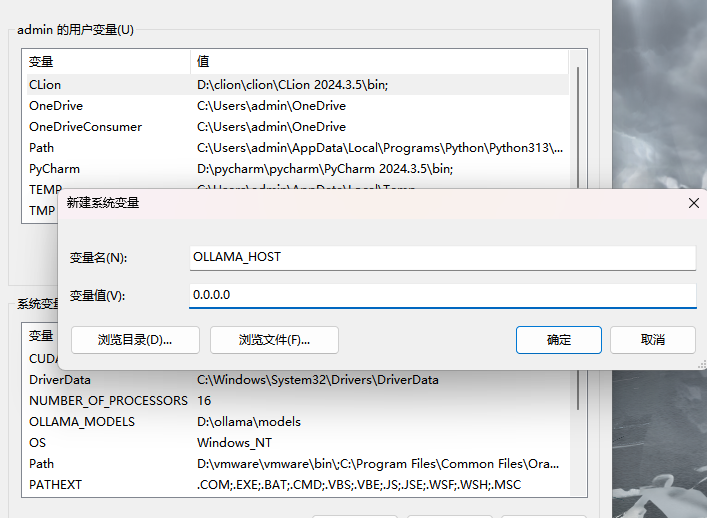
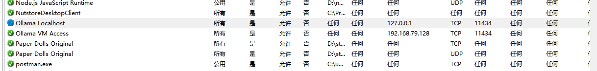

# ollama鉴权


现在的需求如下，本机windows运行了ollama服务，想要让虚拟机的kali进行访问，然后为了安全起见，其他ip不可访问该端口，并且访问的时候要加上密钥


## 端口开放

- 右键点击“此电脑”或“计算机”，选择“属性”。
- 在左侧点击“高级系统设置”。
- 在弹出的窗口中，点击“环境变量”。
- 在“系统变量”部分，点击“新建”。
- 在“变量名”输入框中，输入OLLAMA_HOST。
- 在“变量值”输入框中，输入0.0.0.0，然后点击“确定”。
- 设置完成后，确保关闭并重新打开命令行窗口，使新的环境变量生效。




## 防火墙防护

powershell命令输入，然后后面要开放什么就继续加，使用管理员权限进行设置！

```
# 允许Kali虚拟机IP
New-NetFirewallRule -DisplayName "Ollama VM Access" -Direction Inbound -LocalPort 11434 -Protocol TCP -Action Allow -RemoteAddress 192.168.79.128

# 允许本地访问
New-NetFirewallRule -DisplayName "Ollama Localhost" -Direction Inbound -LocalPort 11434 -Protocol TCP -Action Allow -RemoteAddress 127.0.0.1

# 阻止其他所有IP（可选）
New-NetFirewallRule -DisplayName "Block Ollama" -Direction Inbound -LocalPort 11434 -Protocol TCP -Action Block -RemoteAddress Any
```

如果要撤回设置，逐条删除：

```
# 1. 删除 Kali 虚拟机访问规则
Remove-NetFirewallRule -DisplayName "Ollama VM Access"

# 2. 删除本地访问规则
Remove-NetFirewallRule -DisplayName "Ollama Localhost"

# 3. 删除阻止其他 IP 的规则
Remove-NetFirewallRule -DisplayName "Block Ollama"
```


匹配删除：

```
Get-NetFirewallRule -DisplayName "Ollama*" | Remove-NetFirewallRule
```


验证：

```
Get-NetFirewallRule -DisplayName "Ollama*" | Format-Table DisplayName, Enabled, Action
```


也可以去控制面板里面的防火墙高级设置中的入站规则进行查看：




## 访问

注意网关具体查看如下：

kali里面输入查看主机ip，然后访问http://192.168.79.2:11434 即可

```
ip route show default | awk '{print $3}'  # 查看网关（通常是主机IP）
```

