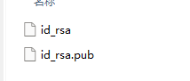
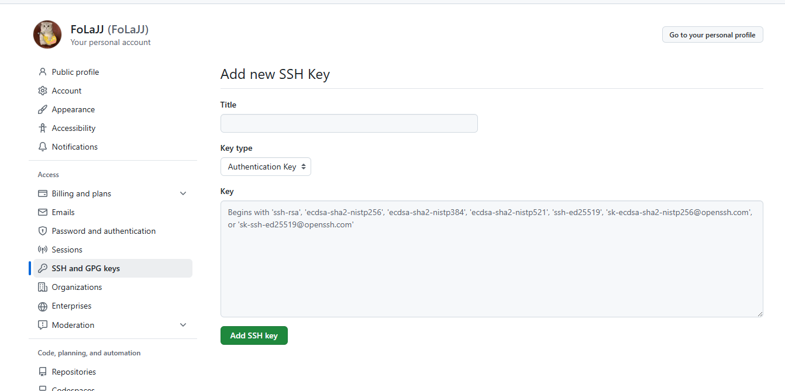
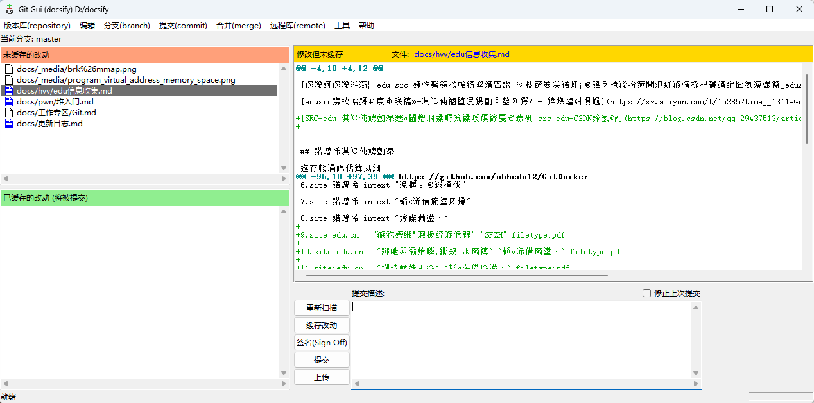

# Git

Git 是 Linus Torvalds 为了帮助管理 Linux 内核开发而开发的一个开放源码的版本控制软件。


## 信息身份：

```
配置用户名：git config --global user.name “github上注册的用户名”
配置用户邮箱：git config --global user.email “GitHub上注册时的邮箱”
```


```
ssh-keygen -t rsa -C "GitHub上注册时的邮箱"
```

用户主目录里找到.ssh目录，里面有id_rsa和id_rsa.pub两个文件，这两个就是SSH Key的秘钥对，id_rsa是私钥，不能泄露出去，id_rsa.pub是公钥，可以放心地告诉任何人



然后将.pub的内容复制到github页面上设置的`SSH and GPG keys`配置即可





然后输入：

```
ssh -T git@github.com
```

`successfully `  就证明成功无密码连接了


## 代理设置

清除代理

```
git config --global --unset http.proxy 
git config --global --unset https.proxy 
```


配置代理

```
git config --global http.proxy http://127.0.0.1:7890
```


查看配置

```
git config --global -l
```


## **安装（ubuntu环境下）**

```shell
sudo apt-get install git
```

**查看版本号**

```shell
git --version
```


## **初始化仓库操作（init）**

```shell
git init
```

可以看到生成了一个`.git`的隐藏子目录，可以查看。


## **添加文件到暂存区（add）**

添加一个或多个文件到暂存区：

```shell
git add	[file1]	[file2]
```

添加指定目录到暂存区，包括子目录：

```shell
git add [dir]
```

添加当前目录下的所有文件到暂存区：

```shell
git add .
```


## **将暂存区的内容添加到本地仓库中（commit）**

提交暂存区到本地仓库中：

```shell
git commit -m [message]
```

message是一些备注信息；

提交指定文件：

```shell
git commit [file1] [file2] ... -m [message]
```

**-a** 参数设置修改文件后不需要执行 git add 命令，直接来提交

```shell
$ git commit -a
```


## **查看文件是否被再次更改（status）**

```shell
git status <-s>
-s 获得简短的输出结果
```


## **比较文件的不同（diff）**

显示暂存区和工作区的差异:

```shell
$ git diff [file]
```

显示暂存区和上一次提交(commit)的差异:

```shell
$ git diff --cached [file]
或
$ git diff --staged [file]
```

显示两次提交之间的差异:

```shell
$ git diff [first-branch]...[second-branch]
```


## **回退版本（reset）**

git reset 命令用于回退版本，可以指定退回某一次提交的版本。

git reset 命令语法格式如下：

```shell
git reset [--soft | --mixed | --hard] [HEAD]
```

**--mixed** 为默认，可以不用带该参数，用于重置暂存区的文件与上一次的提交(commit)保持一致，工作区文件内容保持不变。

```shell
git reset  [HEAD] 
```

回退一百个版本：

```c
git reset --hard HEAD~100
```


## **拷贝操作（clone）**

```shell
git clone <repo> <directory>
```

- repo：Git仓库
- directory：本地目录

如：

```shell
git clone git://github.com/schacon/grit.git mygrit
```

后面一个参数可填可不填，不填就默认存到当前目录；


## **查看提交历史（log）**

```shell
git log <--oneline> <--graph> <--reverse> <--author==xxx>
```

- --oneline看最简版本；
- --graph ，查看历史中什么时候出现了分支、合并；
- **--reverse** 参数来逆向显示所有日志。
- --author 查看某作者的提交记录

下面是查看Linus的提交记录；

```shell
$ git log --author=Linus --oneline -5
81b50f3 Move 'builtin-*' into a 'builtin/' subdirectory
3bb7256 make "index-pack" a built-in
377d027 make "git pack-redundant" a built-in
b532581 make "git unpack-file" a built-in
112dd51 make "mktag" a built-in
```


## **查看修改记录（blame）**

用于查看某文件的修改记录：

```shell
git blame <file>
```


## **上传本地版本与远程合并（push）**

**git push** 命令用于从将本地的分支版本上传到远程并合并。

命令格式如下：

```shell
git push <远程主机名> <本地分支名>:<远程分支名>
```

如果本地分支名与远程分支名相同，则可以省略冒号：

```shell
git push <远程主机名> <本地分支名>
```


## **下载远程代码然后与本地合并（pull）**

**git pull** 命令用于从远程获取代码并合并本地的版本。

**git pull** 其实就是 **git fetch** 和 **git merge FETCH_HEAD** 的简写。

命令格式如下：

```shell
git pull <远程主机名> <远程分支名>:<本地分支名>
```


`git fetch` 命令用于从远程仓库下载最新的代码，但是不会自动将代码合并到本地分支中。它只是将最新的代码下载到本地，然后将其存储在远程跟踪分支中。通过使用 `git fetch`，您可以在本地查看远程仓库中的最新代码，然后可以手动将其合并到本地分支中。

`git pull` 命令可以让您从远程仓库下载最新的代码，并自动将其合并到本地分支中。它实际上是一个包含两个步骤的命令，首先它运行 `git fetch` 命令来下载代码，然后运行 `git merge` 命令来合并代码到本地分支中。


## git-gui


这是一个git gui软件，如果不想记命令的话，或者本身你的工作地方可以使用桌面互动的话，就可以选择随意一款gui软件，这边选择经典款



打开就是这样，和命令行一样，配置好github的rsa就可以了，功能都在上面不用教了，


汉化版的话就是要去下载一个文件，是`zh_cn.msg`，放在下面文件目录下，没有msgs的话就自己创建一个吧

`D:\gitbash\gitbash\Git\mingw64\share\git-gui\lib\msgs`


## 上传出问题

一般就是开梯子导致的：

```
完美解决 fatal: unable to access ‘https://github.com/.../.git‘: Could not resolve host: github.com
```


先关闭梯子，关闭系统代理


直接在gitbash中：

```
git config --global --unset http.proxy 
git config --global --unset https.proxy
```


然后cmd执行：

```
ipconfig /flushdns
```


重新push即可。