# eNSP网络仿真工具

## 0. eNSP是什么？

​	eNSP全称(Enterprise Network Simulation Platform)，是一款华为提供的网络仿真模拟器，对华为系列的企业级网络路由器、交换机等设备进行在线仿真。提供给那些没有设备、资金紧张的课题组、个人用户等一个亲手配置设备的机会和可能接触到的第一个大型网络模拟器，用于学习网络技术。

## 1. 软件安装

搭建环境参考此文章，建议wireshark下最新版本，ensp内网nas有得下载，走内网渠道更快

安装教程：[win10、11下安装eNSP（1.3.00）并完美运行_ensp最新版-CSDN博客](https://blog.csdn.net/qq_45945548/article/details/124512961)

重点提醒：任何软件依赖都不要有中文路径


## 2. 认识eNSP各大模块

当你安装完软件，点进去可以看到，然后点击左上角的新建拓扑，即可看到此页面

[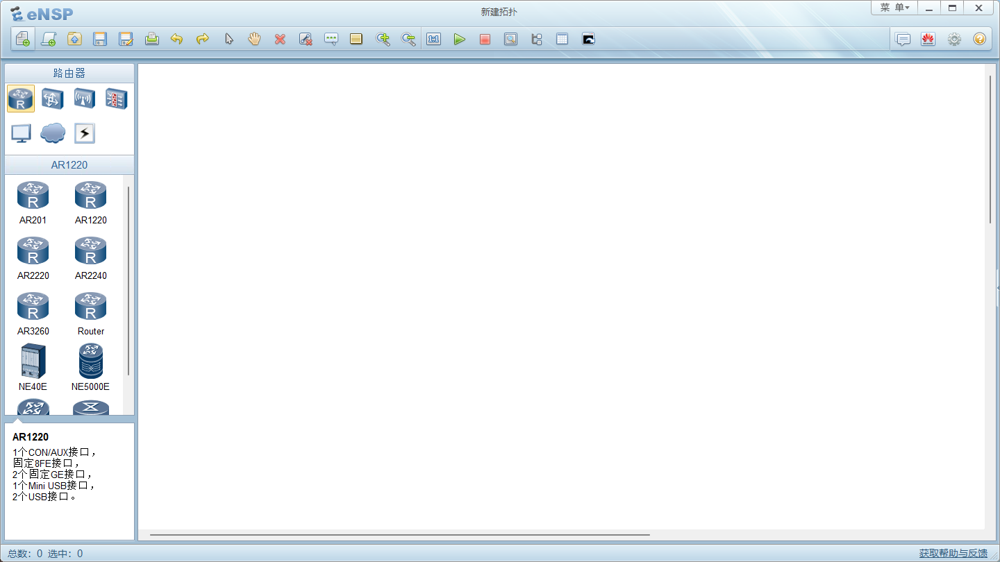](https://imgse.com/i/pAtdfoV)

观察左边有一系列的设备，可以挨个点击，可以看到各个设备的具体描述，如CON、USB、Console等资源，现在我们来逐个了解一下，仅仅是了解。

### 2.0 路由器

​	路由器是啥就不用多说了，不知道的回去补知识点。

​	AR201路由器是面向小企业网络的设备，相当于一台路由器和一台交换机的组合，8个FE端口是交换机端口，路由器使用逻辑接口VLANIF1和交换机连接，值得注意的是，交换机的所有端口默认都属于VLANIF 1

​	设备详细信息可以将AR201拖至拓扑画布区域，右键点击选中设置，这样就可以看到设备的现实模样，可以加深记忆。

​	这就是设备介绍中所说的，1个CON/AUX接口，固定8FE接口，1个WAN侧uplink接口，1个USB接口

[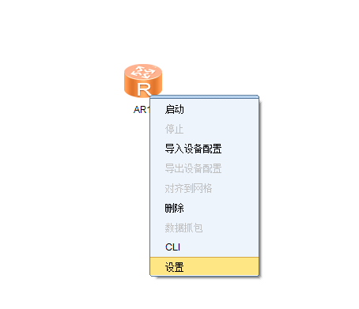](https://imgse.com/i/pAtdzWD)

[](https://imgse.com/i/pAtwpSe)


2.1 交换机

2.2 无线局域网

2.3 防火墙

2.4 PC

​	常用就是用第一个PC个人电脑即可

2.5 Cloud

2.6 设备连线

​	设备连线使用Auto即可

​	Copper自行选择

​	Serial串行口

​	POS 光纤

​	CTL console口

​	其余同理，询问GPT。不再赘述。


## 3.vrp系统指令

==备注==

```
?			# 查看用户视图下所有可以执行的命令
```


需要注意的是当左边的名称打印的是<>，意味着你在用户视图，如果是[]，则是系统视图

如：

```
<Huawei>		# 用户视图
<Huawei>system-view		#进入系统视图的指令

[Huawei]interface Serial 2/0/0   # 进入接口视图
[Huawei-Serial2/0/0]			# 接口视图

[Huawei]ospf 1					# 进入协议视图
[Huawei-ospf-1]					# 协议视图

[Huawei]aaa						# 进入AAA视图
[Huawei-aaa]					# AAA视图

[Huawei]acl 2000				# 进入ACL视图
[Huawei-acl-basic-2000]			# ACL视图

[Huawei]ip pool office1			# 进入地址池视图
[Huawei-ip-pool-office1]		# 地址池视图

...
```

并且在任何视图里面都可以进行如下操作：

```
quit			# 返回上一级视图
return			# 返回用户视图
Ctrl+Z			# 返回系统视图
```

只需要记住两个就可以了

```
return返回最上级
Ctrl+Z返回第二级
```


### 用户视图

用户视图查看当前配置：

```
dis
Tab
display cu
Tab
display current-configuration
```

关闭设备之前要进行保存

```
return
save
```


### 系统视图

```
sys
tab
```


```
sy AP1
直接重命名
```


```
[Huawei]
```


### 协议视图

配置ip地址

```
int
tab
interface e0/0/0
```


删除命令

```
vlan 10

undo vlan 10
```


### PC机配置ip地址

直接双击打开设置就即可


### 路由器配置ip地址

路由器要进入接口里面进行配置

```
[R1]int g0/0/0
[R1]ip add
tab
[R1]ip address 192.168.1.254 24
```


### 交换机配置ip地址

三层交换机，要用vlan进行封装

```
[Huawei]vlan 10
[Huawei]int vlan 10
[Huawei-vlanif10]ip address 192.168.2.254 24
[Huawei-vlanif10]Ctrl+Z
[Huawei]int g0/0/1
[Huawei-GigabitEthernet0/0/1]port link-type access
[Huawei-GigabitEthernet0/0/1]port default
```


## 3. 教程配套实验

### 3.0 模块添加与设备连线

​	使用两台AR1220路由器，每台路由器添加“2端口-同异步WAN接口卡”模块

添加模块还是路由器右击，点击设置，视图界面可以看到eNSP支持的接口卡，我们逐个点击，一般是在后面的，可以看到接口卡描述。找到相应的接口卡之后，拖拽至黄色区域，就可以添加！

[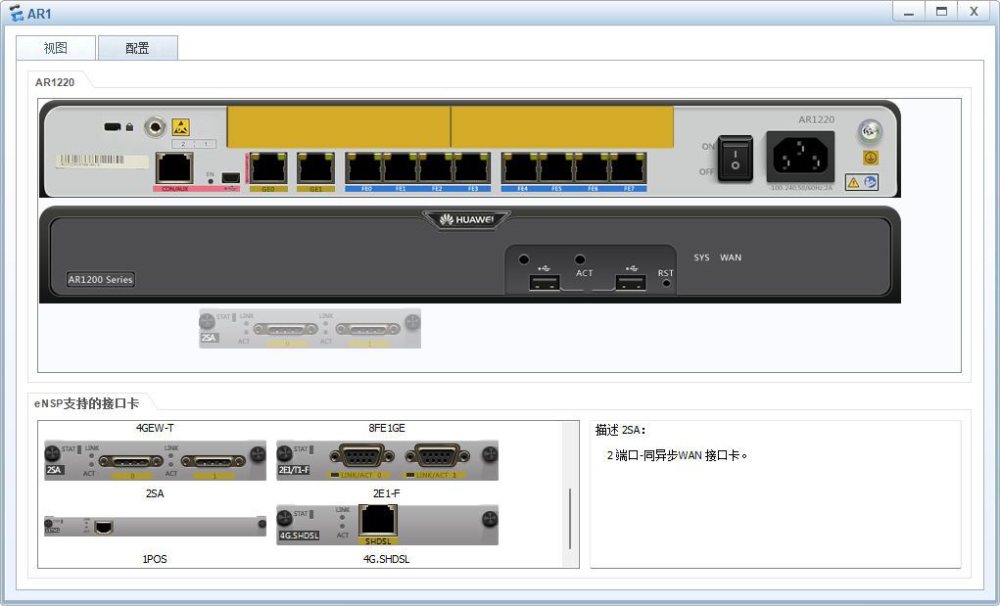](https://imgse.com/i/pAtwhnA)


初步接线图如下：

[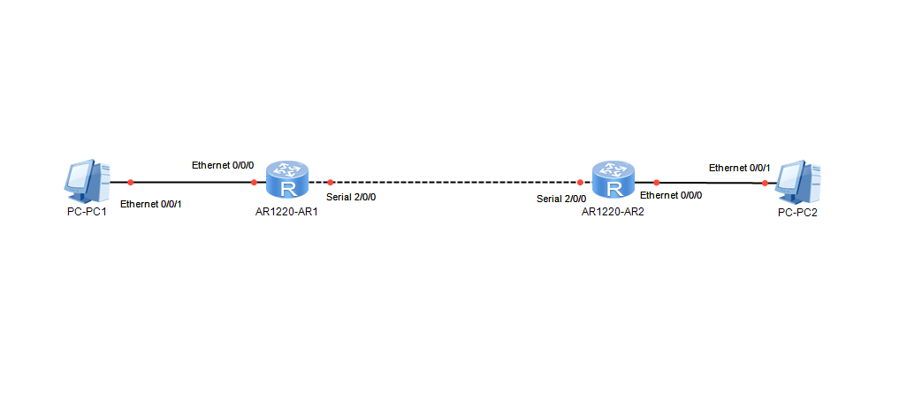](https://imgse.com/i/pAtwTtf)

这里可以选择先配置PC1的IP地址、子网掩码和网关。

[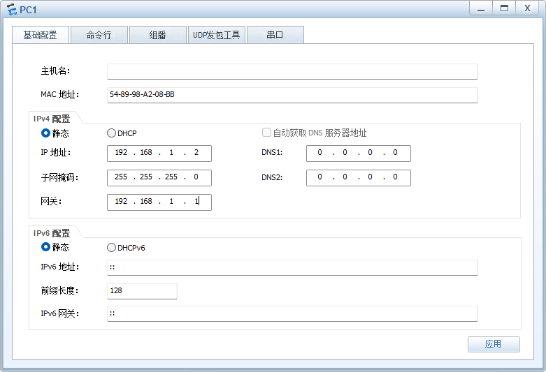](https://imgse.com/i/pAtR4FH)


同理，设置PC2的IP地址、子网掩码、网关：

[](https://imgse.com/i/pAtRIfA)

### 3.1 配置路由器名称和接口地址

#### 3.1.0 系统视图配置VLANIF 1接口地址

我们可以设置两台PC的ip地址


然后框选所有设备，点击那个明显的启动按钮。

然后要等图中的红点全部变绿，我们再进行下一步操作。


然后设置两台路由器，

这里选择先配置AR1，还是一样右击选择CLI，配置AR2同理


我们就进入到这个黑黑的东西了


我们用这个案例熟悉初步的命令配置操作


```

```


然后：

```
<Huawei>system-view			#进入系统视图
[Huawei]sysname R1			#改名，操作一次便可，不改也行
[R1]interface Vlanif 1		#进入接口视图，指明配置接口
[R1-Vlanif1]ip address 192.168.1.1 24 #添加IP地址和子网掩码
[R1-Vlanif1]undo shutdown	# 启用接口
[R1-Vlanif1]quit	# 返回上一级视图
```


```
[R1]display interface brief		#显示接口摘要信息
```

此时可以看到Seria12/0/0 的PHY为up，即是设置成功：

[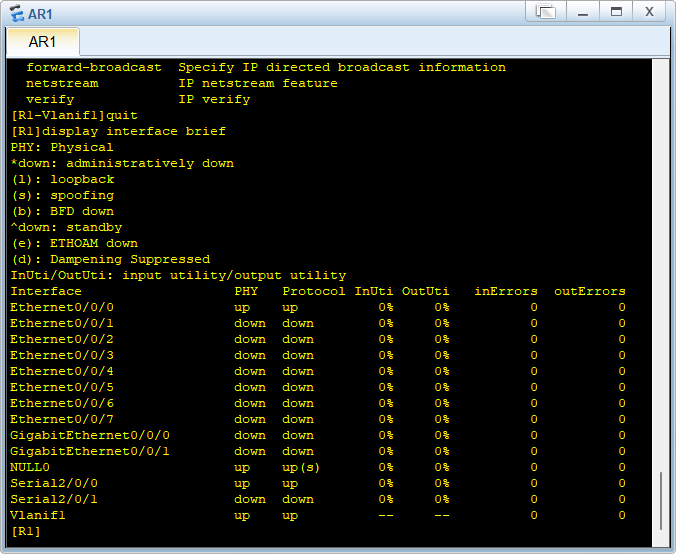](https://imgse.com/i/pAt0NUP)


#### 3.1.1 配置广域网接口地址

```
[R1]interface Serial 2/0/0

[R1-Serial2/0/0]ip address 192.168.2.1 255.255.255.0

[R1-Serial2/0/0]undo shutdown

[R1-Serial2/0/0]display this
```


-------------


删除接口下的地址：

```
[R1-Vlanif1]undo ip address
```


删除特定地址：

```
[R1-Vlanif1]undo ip address 192.168.8.252 24
```


关闭端口：

```
[R1-Vlanif1]shutdown
```


启用接口：

```
[R1-Vlanif1]undo shutdown
```


---------------


#### 3.1.2 查看接口的IP地址相关信息

```
[R1]display ip interface brief
```


#### 3.1.3 保存配置，重启防丢失

```
[R1]display current-configuration			# 查看当前配置
	
[R1]quit									# 推出系统视图

<R1>save									# 保存配置到内存

<R1>display saved-configuration				# 查看保存的配置
```


#### 3.1.4 查看内存中保存的配置文件

```
<R1>dir										# 列出内存中的文件     
```

里面的 `vrpcfg.zip` 就是配置文件


省流版：配置R2

```
<Huawei>system-view			#进入系统视图
[Huawei]sysname R2			#改名，操作一次便可，不改也行
[R2]interface Vlanif 1		#进入接口视图，指明配置接口
[R2-Vlanif1]ip address 192.168.2.2 24 #添加IP地址和子网掩码
[R2-Vlanif1]undo shutdown	# 启用接口
[R2-Vlanif1]quit	# 返回上一级视图<Huawei>
[R2]display interface brief		#显示接口摘要信息

[R2]interface Serial 2/0/0

[R2-Serial2/0/0]ip address 192.168.3.1 255.255.255.0

[R2-Serial2/0/0]undo shutdown

[R2-Serial2/0/0]display this

[R2]display current-configuration			# 查看当前配置
	
[R2]quit									# 推出系统视图

<R2>save									# 保存配置到内存

<R2>display saved-configuration				# 查看保存的配置
```


## 4. 案例大全


### IP和网关


```
PC1

IP地址：192.168.1.1
子网掩码：255.255.255.0
网关：192.168.1.254
```


```
PC2

IP地址：192.168.2.1
子网掩码：255.255.255.0
网关：192.168.2.254
```


```
AR1

<Huawei>sys
[Huawei]int g0/0/1
[Huawei-GigabitEthernet0/0/1]ip address 192.168.1.254 24
```


```
LSW1
<Huawei>sys
[Huawei]vlan 10
[Huawei-vlan10]q
[Huawei]in vlan 10
[Huawei-Vlanif10]ip address 192.168.2.254 24

[Huawei]int g0/0/1
[Huawei-GigabitEthernet0/0/1]port link-type access
[Huawei-GigabitEthernet0/0/1]port default vlan 10
```


实现功能仅仅是主机与连线上的网关进行通信：

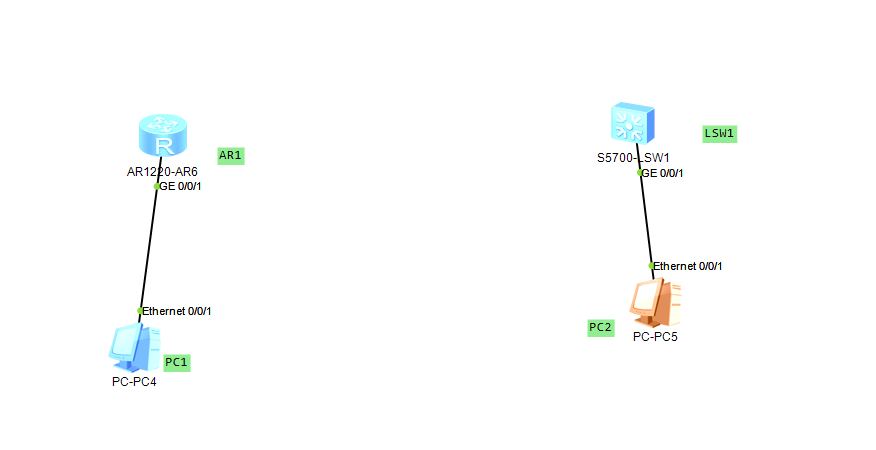


### 静态路由

静态路由关键命令

```
ip route 目标网段 子网掩码 下一跳
```


```
PC1
ip地址：192.168.1.1
子网掩码：255.255.255.0
网关：192.168.1.254
```


```
PC2
ip地址：192.168.2.1
子网掩码：255.255.255.0
网关：192.168.2.254
```


记得选用AR1220

```
AR1

<Huawei>undo ter mon   # 关闭泛洪信息
<Huawei>sys
[Huawei]int g0/0/0
[Huawei-GigabitEthernet0/0/0]ip address 192.168.1.254 24   # 和PC1相连的接口
[Huawei-GigabitEthernet0/0/0]int g0/0/1   # 进入和AR2相连的接口
[Huawei-GigabitEthernet0/0/1]ip address 10.0.0.1 24
### 配置静态路由
[Huawei]q
[Huawei]ip route-static 192.168.2.0 255.255.255.0 10.0.0.2    # 就是告诉路由器要找那个ip就去10.0.0.2那边找


```


```
AR2
<Huawei>undo ter mon   # 关闭泛洪信息
<Huawei>sys
[Huawei]int g0/0/0
[Huawei-GigabitEthernet0/0/0]ip address 192.168.2.254 24   # 和PC1相连的接口
[Huawei-GigabitEthernet0/0/0]int g0/0/1   # 进入和AR2相连的接口
[Huawei-GigabitEthernet0/0/1]ip address 10.0.0.2 24
### 配置静态路由
[Huawei]ip route-static 192.168.1.0 255.255.255.0 10.0.0.1    # 就是告诉路由器要找那个ip就去10.0.0.1那边找
[Huawei]q
```

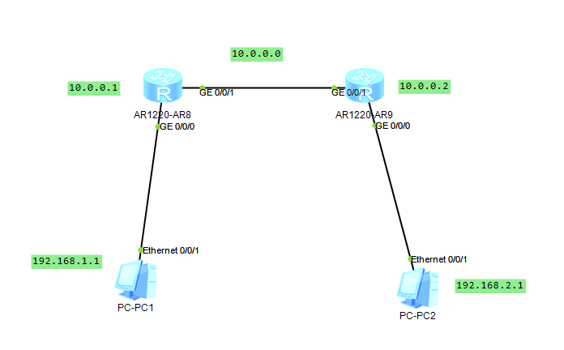


### 动态路由

rip

ospf

isis


RIP


两台AR都要进行配置

```
[R1]rip
[R1-rip-1]network 10.0.0.0     # 加上直连的


假设直连的有PC1的ip地址网段和另一台AR2的ip地址网段，注意注意是网段，不是ip地址
进到rip要重复宣告两次
[R1-rip-1]network 192.168.1.0
[R1-rip-1]network 10.0.0.0

```


### 单臂路由


### vlan子网划分

二层交换机上面进行实验

同一网段下的通信阻隔


假设有4台主机，分别连到两台交换机上去

分别设置为

```
PC1

ip地址：192.168.1.1
子网掩码：255.255.255.0
网关：192.168.1.254

PC2、PC3、PC4的ip地址递增
```


想要设置

PC1和PC3 为vlan10

PC2和PC4 为vlan20


LSW1

```
<Huawei> sys
[Huawei] sy LSW1
[LSW1]un in en   # 关闭提示信息
[LSW1]vlan 10      # 创建vlan10
[LSW1-vlan10]vlan 20      # 创建vlan20
[LSW1-vlan10]q
[LSW1]int eth0/0/1
[LSW1-Ethernet0/0/1]port link-type access   # 配置接口类型为access
[LSW1-Ethernet0/0/1]port default vlan 10   # 0/0/1接口配置为vlan10默认
[LSW1-Ethernet0/0/1]int eth0/0/2 
[LSW1-Ethernet0/0/2]prot link-type access # 配置接口类型为access
[LSW1-Ethernet0/0/2]port default vlan 20   # 0/0/2接口配置为vlan20默认
[LSW1-Ethernet0/0/2]int eth0/0/3			# 进入和另一台交换机连接的接口
[LSW1-Ethernet0/0/3]port link-type trunk    # 配置接口类型
[LSW1-Ethernet0/0/3]port trunk allow-pass vlan 10 20   # 允许vlan10，20通过
```


LSW2

```
<Huawei> sys
[Huawei] sy LSW2
[LSW2]un in en   # 关闭提示信息
[LSW2]vlan 10      # 创建vlan10
[LSW2-vlan10]vlan 20      # 创建vlan20 
[LSW2-vlan10]q
[LSW2]int eth0/0/1
[LSW2-Ethernet0/0/1]port link-type access   # 配置接口类型为access
[LSW2-Ethernet0/0/1]port default vlan 10   # 0/0/1接口配置为vlan10默认
[LSW2-Ethernet0/0/1]int eth0/0/2 
[LSW2-Ethernet0/0/2]prot link-type access # 配置接口类型为access
[LSW2-Ethernet0/0/2]port default vlan 20   # 0/0/2接口配置为vlan20默认
[LSW2-Ethernet0/0/2]int eth0/0/3			# 进入和另一台交换机连接的接口
[LSW2-Ethernet0/0/3]port link-type trunk    # 配置接口类型为trunk
[LSW2-Ethernet0/0/3]port trunk allow-pass vlan 10 20   # 允许vlan10，20通过
```


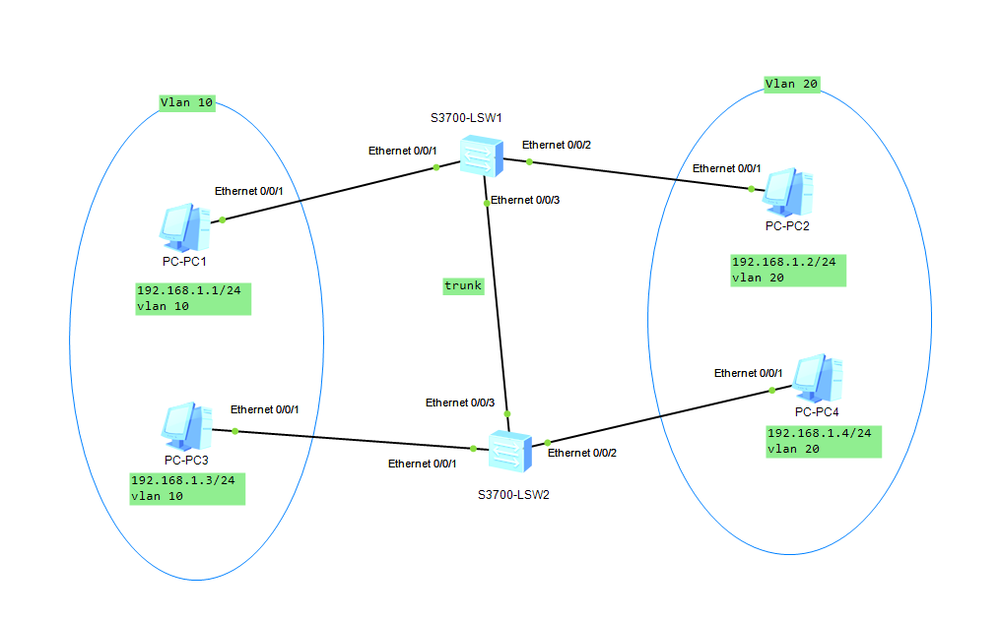


[华为eNSP入门实验，Vlan配置，路由配置，用户模式，链路聚合-CSDN博客](https://blog.csdn.net/m0_46085118/article/details/131224141)

### 同一交换机下的PC通信


应该默认Vlan都为1，所以不用配置就可以了，两台PC机要在同一网段下

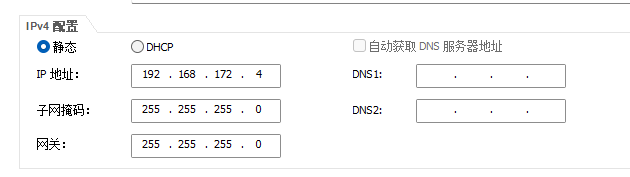

另一台配置为

```
192.168.172。8
```


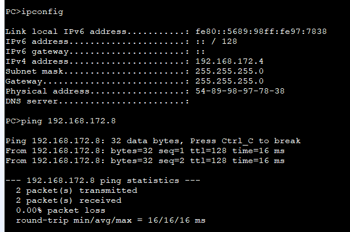


下面是设置为Vlan2的命令：

```
#进入命令行控制模式
system-view
# 对设备命名
sysname p1
# 创建VLAN
vlan 2
quit 

# 将端口指定到VLAN中
interface GigabitEthernet 0/0/1
port link-type access
port default vlan 2
quit
```


### 不同交换机下的PC通信


### 同一交换机不同网段的通信

直接三层交换机配置

```
LSW2
<Huawei>sys
[Huawei]int vlan1
[Huawei-Vlanif1]ip address 192.168.1.254 24
[Huawei-Vlanif1]ip address 192.168.2.254 24 sub              # 配置从ip
```

就配完了

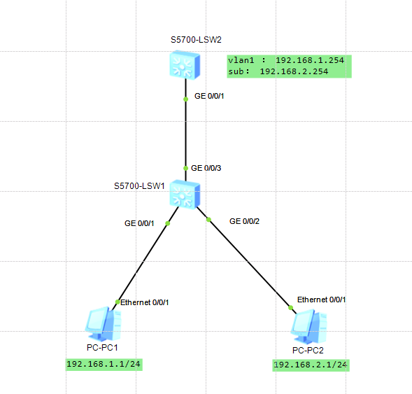


### 链路聚合

手动配置

```
LSW1
<Huawei>un in en
<Huawei>sys
[Huawei]int Eth-Trunk 1
[Huawei-Eth-Trunk1]mode manual load-balance
[Huawei-Eth-Trunk1]q
[Huawei]int g0/0/1
[Huawei-GigabitEthernet0/0/1]eth-trunk 1
[Huawei-GigabitEthernet0/0/1]int g0/0/2
[Huawei-GigabitEthernet0/0/2]eth-trunk 1
```


```
LSW2
<Huawei>un in en
<Huawei>sys
[Huawei]int Eth-Trunk 1
[Huawei-Eth-Trunk1]mode manual load-balance
[Huawei-Eth-Trunk1]q
[Huawei]int g0/0/1
[Huawei-GigabitEthernet0/0/1]eth-trunk 1
[Huawei-GigabitEthernet0/0/1]int g0/0/2
[Huawei-GigabitEthernet0/0/2]eth-trunk 1
```


就是在逻辑上把两根线变成一根线，提高带宽

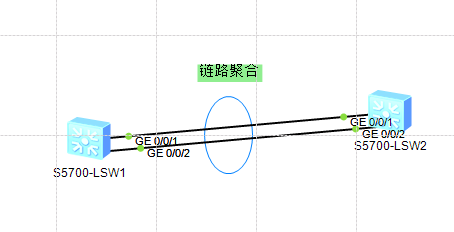


### 密码模式

进入串口模式

啥都不设置，选择串口连接，就可以连上去

可以直接在电脑端进行设置

```
<Huawei>sys
[Huawei]user-interface console 0
[Huawei-ui-console0]authentication-mode password
[Huawei-ui-console0]set authentication password cipher    # 看机子，有些不用这一句
123
[Huawei-ui-console0]user privilege level 3
[Huawei-ui-console0]q
<Huawei>q


restart

输入password：
就可以连接上了
```


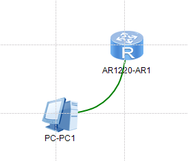


### 三层交换机实现VLAN间路由

根据图来配PC机


```
LSW2

<Huawei> sys
[Huawei] sy LSW2
[LSW2]un in en   # 关闭提示信息
[LSW2]vlan 10      # 创建vlan10
[LSW2-vlan10]q
[LSW2]int g0/0/1
[LSW2-GigabitEthernet0/0/1]port link-type trunk    # 配置接口类型
[LSW2-GigabitEthernet0/0/1]port trunk allow-pass vlan 10   # 允许vlan10通过
[LSW2-GigabitEthernet0/0/1]int g0/0/2
[LSW2-GigabitEthernet0/0/2]port link-type access    # 配置接口类型
[LSW2-GigabitEthernet0/0/2]port default vlan 10   # 绑定vlan10
```


```
LSW4

<Huawei> sys
[Huawei] sy LSW4
[LSW4]un in en   # 关闭提示信息
[LSW4]vlan 10      # 创建vlan20
[LSW4-vlan10]vlan 20
[LSW4-vlan20]q

[LSW4]int g0/0/1
[LSW4-GigabitEthernet0/0/1]port link-type trunk    # 配置接口类型
[LSW4-GigabitEthernet0/0/1]port trunk allow-pass vlan 10 20   # 允许vlan10，20通过
[LSW4-GigabitEthernet0/0/1]int g0/0/2

[LSW4-GigabitEthernet0/0/2]port link-type access    # 配置接口类型
[LSW4-GigabitEthernet0/0/2]port default vlan 10   # 绑定vlan10
[LSW4-GigabitEthernet0/0/2]int g0/0/3

[LSW4-GigabitEthernet0/0/3]port link-type access    # 配置接口类型
[LSW4-GigabitEthernet0/0/3]port default vlan 20   # 绑定vlan10
[LSW4-GigabitEthernet0/0/3]q
```


```
LSW3

<Huawei> sys
[Huawei] sy LSW3
[LSW3]un in en   # 关闭提示信息
[LSW3]vlan 20      # 创建vlan20
[LSW3-vlan20]q
[LSW3]int g0/0/1
[LSW3-GigabitEthernet0/0/1]port link-type trunk    # 配置接口类型
[LSW3-GigabitEthernet0/0/1]port trunk allow-pass vlan 20   # 允许vlan10通过
[LSW3-GigabitEthernet0/0/1]int g0/0/2
[LSW3-GigabitEthernet0/0/2]port link-type access    # 配置接口类型
[LSW3-GigabitEthernet0/0/2]port default vlan 20   # 绑定vlan20
```


```
LSW1
<Huawei> sys
[Huawei] sy LSW1
[LSW1]un in en   # 关闭提示信息
[LSW1]vlan batch 10 20 30    # 连接vlan 10 20 30

[LSW1]int eth0/0/1
[LSW1-Ethernet0/0/1]port link-type trunk   # 配置接口类型为access
[LSW1-Ethernet0/0/1]port trunk allow-pass vlan 10    # 允许vlan10通过
[LSW1-Ethernet0/0/1]int eth0/0/2 
[LSW1-Ethernet0/0/2]prot link-type trunk # 配置接口类型为access
[LSW1-Ethernet0/0/2]port trunk allow-pass vlan 20    # 允许vlan20通过
[LSW1-Ethernet0/0/2]int eth0/0/3			# 进入和另一台交换机连接的接口
[LSW1-Ethernet0/0/3]port link-type trunk    # 配置接口类型
[LSW1-Ethernet0/0/3]port trunk allow-pass vlan 10 20   # 允许vlan10，20通过


[LSW1]int vlanif 10
[LSW1-Vlanif10]ip address 192.168.1.254 24
[LSW1-Vlanif10]q
[LSW1]int vlanif 20
[LSW1-Vlanif20]ip address 192.168.2.254 24
[LSW1-Vlanif20]q
[LSW1]int vlanif 30
[LSW1-Vlanif30]ip address 192.168.3.254 24
[LSW1-Vlanif30]q
[LSW1]ip route-static 0.0.0.0 24 192.168.3.1

```


```
AR1
<Huawei>undo ter mon   # 关闭泛洪信息
<Huawei>sys
[Huawei]int g0/0/0
[Huawei-GigabitEthernet0/0/0]ip address 192.168.3.1 24   # 和PC1相连的接口
### 配置静态路由
[Huawei]ip route-static 192.168.1.0 24 192.168.3.254
[Huawei]ip route-static 192.168.2.0 24 192.168.3.254
```


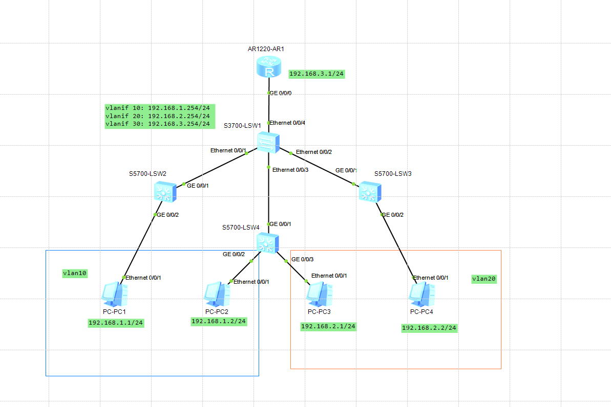


### 考核

四台主机，三个子网，两台三层交换机，一个路由配置

#### 网络设计：

- **PC1**：192.168.1.1/24，网关：192.168.1.254
- **PC2**：192.168.3.1/24，网关：192.168.3.254
- **PC3**：192.168.2.1/24，网关：192.168.2.254
- **PC4**：192.168.3.2/24，网关：192.168.3.254
- **VLAN设计**：
  - VLAN 10：PC2 和 PC4
  - VLAN 20：PC1
  - VLAN 30：PC3

​	现在有ensp仿真实验，有两个三层交换机和四台主机，要求如下： PC1的ip为192.168.1.1/24，网关为192.168.1.254，vlan20； PC2的ip为192.168.3.1/24，网关为192.168.3.254，vlan10； PC3的ip为192.168.2.1/24，网关为192.168.2.254，vlan30； PC4的ip为192.168.3.2/24，网关为192.168.3.254，vlan10； 现在有两台三层交换机。其中PC1连在LSW1的g0/0/1，PC2连在LSW1的g0/0/2，PC3连在LSW2的g0/0/1，PC4连在LSW2的g0/0/2，其中LSW1的g0/0/3和LSW2的g0/0/3相连，并且LSW1的g0/0/3的ip要配置为10.0.0.1/24，LSW2的g0/0/3的ip要配置为10.0.0.2/24

​	现在要求如下： PC1和PC3要通过静态路由的方式进行联通，PC2和PC4要通过子网的方式进行联通，除此之外其他任意两台主机不能相互ping通，如PC1和PC2无法ping通，PC1和PC4无法ping通，PC2和PC3无法ping通，PC3和PC4无法ping通。请给出两台LSW的配置。注意配置环境为ensp华为模拟器

### 总程序

接线图：

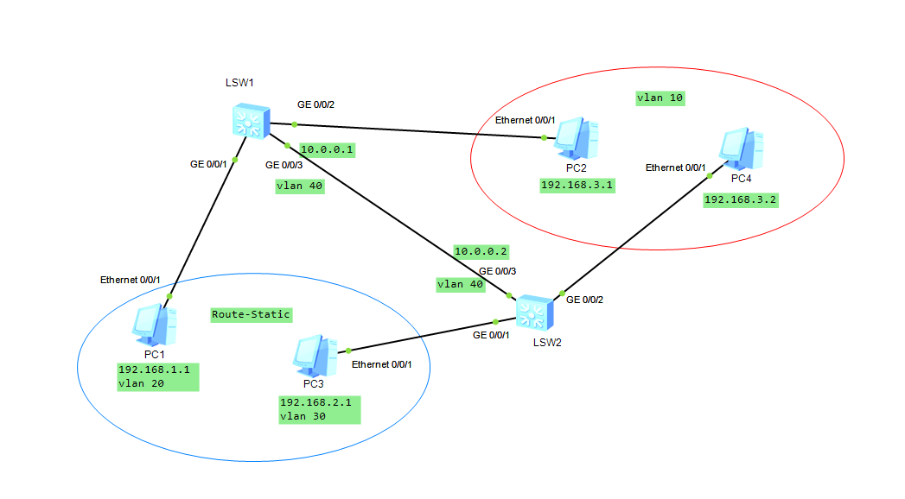

LSW1:


```
sys
sys LSW1
un in en
vlan batch 10 20 30 40

int vlan20
ip address 192.168.1.254 24

int vlan40
ip address  10.0.0.1 24

int g0/0/1
port link-type access
port default vlan 20

int g0/0/2
port link-type access
port default vlan 10

int g0/0/3
port link-type trunk
port trunk allow-pass vlan all

q
ip route-static 192.168.2.0 24 10.0.0.2
```


LSW2:

```
sys
sys LSW2
un in en
vlan batch 10 20 30 40

int vlan30
ip address 192.168.2.254 24

int vlan40
ip address 10.0.0.2 24

int g0/0/1
port link-type access
port default vlan 30

int g0/0/2
port link-type access
port default vlan 10

int g0/0/3
port link-type trunk
port trunk allow-pass vlan all

q
ip route-static 192.168.1.0 24 10.0.0.1
```


## 5. 命令备忘录


## 6. 网络知识

[计算机网络基础知识总结 | 菜鸟教程](https://www.runoob.com/w3cnote/summary-of-network.html)


### 子网划分


假设一台公司有530台计算机要连接到局域网：

- 确定适合的子网掩码：
  - 530台计算机需要主机数量至少为530
  - 计算2^m > 530
- 确定子网掩码
  - 2^9=512 不够
  - 2^10=1024 足够
  - 因此，m=10，子网掩码的主机部分为10个0
  - 子网掩码的二进制表示 `1111 1111.1111 1111.1111 1100.0000 0000` 即`255.255.252.0`


子网掩码计算：

- 子网掩码 `255.255.255.0`：
  - 二进制表示：`11111111.11111111.11111111.00000000`
  - 后面8个0.即m=8
  - 最大容纳：2^8-2=256-2=254      要减去广播地址和网络地址


子网划分习题：[软考网络工程师1：IP子网划分_哔哩哔哩_bilibili](https://www.bilibili.com/video/BV1uu4m1P7gV/?spm_id_from=333.337.search-card.all.click&vd_source=f264368eefdba6c9e52d63931d176453)

