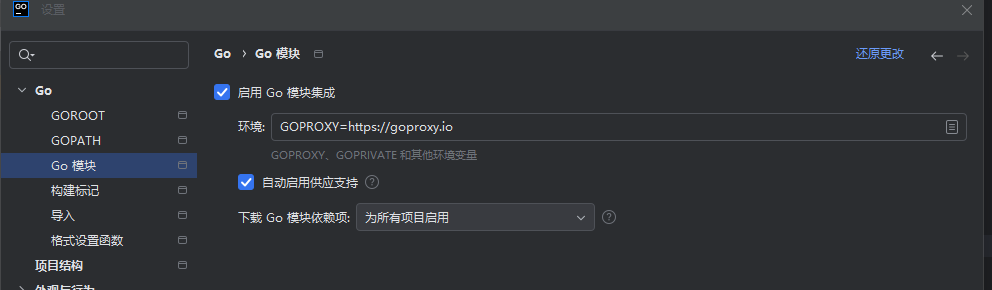

# golang


## web

### Demo

```go
package main
import (
	"fmt"
	"net/http"
)
func main() {
	http.HandleFunc("/", func(w http.ResponseWriter, r *http.Request) {
		fmt.Fprintf(w, "<h1>Hello World</h1>")
	})
	http.ListenAndServe(":8080", nil)
}
```


### handle处理

`handle`处理请求

函数有二：

- http.Handle
- http.HandleFunc


http.ListenAndServer()

- 第一个参数是网络地址，默认就是80
- 第二个参数就是handler，如果是nil，那就是DefaultServeMux


DefaultServeMux是一个类似路由器的东西，多路复用器，也是一个handler


监听有两种声明的方法，两个都是等价的：

方法一：

```
http.ListenAndServe(":8080", nil)
```

方法二：

```go
server := &http.Server{
	Addr:    ":8080",
	Handler: http.DefaultServeMux,
}
server.ListenAndServe()
```


handler处理事件也有两种声明方式：

一种是自定义，然后向DefaultServeMux去注册自己的handler

```go
package main

import (
	"net/http"
)

type helloHandler struct{}

func (h helloHandler) ServeHTTP(w http.ResponseWriter, r *http.Request) {
	w.Write([]byte("hello world!!!!!"))
}

func main() {
	mh := helloHandler{}
	server := &http.Server{
		Addr:    ":8080",
		Handler: nil,
	}

	http.Handle("/", &mh)
	server.ListenAndServe()
}

```


第二种方法：

```
http.HandleFunc("/", func(w http.ResponseWriter, r *http.Request) {
	fmt.Fprintf(w, "<h1>Hello World</h1>")
})
```


值得注意的是，也可以像下面一样定义，可以自定义方法，该函数方法直接类型转换为Handler类型

```
http.Handle("/", http.HandlerFunc(welcome))
```


### 内置的Handler

```
http.NotFoundHandler()

给每个请求都是404
```


```
http.RedirectHandler(url string,code int)

两个参数传入，给定状态码跳转到指定的URL
```


```
http.StripPrefix(prefix string,h handler)

去掉URL中的前缀,移除前缀后给另一个handler进行处理
```


```
http.TimeoutHandler(h Handler,dt time.Duration,msg string)

指定时间运行传入的h
```


```
http.fileServer(root FileSystem)Handler

基于root的文件系统来响应请求

func (d Dir) Open(name string)(File,error)
```


### 文件读取handler

```go
package main

import (
	"net/http"
)

func main() {
	http.HandleFunc("/", func(w http.ResponseWriter, r *http.Request) {
		http.ServeFile(w, r, "html"+r.URL.Path)
	})

	http.ListenAndServe(":8080", nil)
}

```

注意那个"html"是你的html文件放的文件夹，他就会自动读取index.html文件了


还可以用上面内置的Handler进行处理，更快更简洁：

```go
package main
import (
	"net/http"
)
func main() {
	http.ListenAndServe(":8080", http.FileServer(http.Dir("html")))
}
```


### 表单处理

先定义基本的表单

```
<form action="/process" method="post">
    <input type="text" name="first_name"/>
    <input type="text" name="last_name"/>
    <input type="submit"/>
</form>
```


指定发送的数据对格式

下面指定的格式就会让浏览器将表单数据编码到查询的字符串里面

```
<form action="/process" method="post" enctype="application/x-www-form-urlencoded"></form>
```


如果是上传大量的文件

```
enctype="multipart-MIME"
```


综合上面就是：

```go
package main

import (
	"fmt"
	"net/http"
)

func main() {
	server := http.Server{
		Addr: ":8080",
	}
	http.HandleFunc("/", func(w http.ResponseWriter, r *http.Request) {
		http.ServeFile(w, r, "html"+r.URL.Path)
	})

	http.HandleFunc("/process", func(w http.ResponseWriter, r *http.Request) {
		r.ParseForm()
		fmt.Fprintln(w, r.Form)
	})

	server.ListenAndServe()
}
```


返回数据：

注意这个map返回的各项键值对的顺序是不一定的

```
map[first_name:[12312] last_name:[123213]]
```


### 上传文件

表单如下：

```html
<h1>表单二</h1>
<form action="/process?hello=world&thread=123" method="post" enctype="multipart/form-data">
    <input type="text" name="hello" value="sau sheong"/>
    <input type="text" name="post" value="456"/>
    <input type="file" name="uploaded">
    <input type="submit">
</form>
```


```go
package main

import (
	"fmt"
	"io"
	"net/http"
)

func process(w http.ResponseWriter, r *http.Request) {

	file, _, err := r.FormFile("uploaded")
	if err != nil {
		data, err := io.ReadAll(file)
		if err != nil {
			fmt.Fprintln(w, string(data))
		}
	}
}
func main() {
	server := http.Server{
		Addr: ":8080",
	}
	http.HandleFunc("/", func(w http.ResponseWriter, r *http.Request) {
		http.ServeFile(w, r, "html"+r.URL.Path)
	})
	http.HandleFunc("/process", process)
	server.ListenAndServe()
}

```


读取文件的`ioutil.ReadAll`已经被弃用了，现在需要使用`io.ReadAll`


### json


### 模板

就像jinja2一样

```html
<!DOCTYPE html>
<html lang="en">
<head>
    <meta charset="UTF-8">
    <title>模板</title>
</head>
<body>
{{.}}
</body>
</html>
```


main.go

```go
package main

import (
	"net/http"
	"text/template"
)

func process(w http.ResponseWriter, r *http.Request) {
	t, _ := template.ParseFiles("html/templates.html")
	t.Execute(w, "Hello World!")
}

func main() {
	server := http.Server{
		Addr: ":8080",
	}
	http.HandleFunc("/", func(w http.ResponseWriter, r *http.Request) {
		http.ServeFile(w, r, "html"+r.URL.Path)
	})
	http.HandleFunc("/process", process)

	err := server.ListenAndServe()
	if err != nil {
		return
	}
}
```


直接访问/process，就有hello world


解析模板：

- ParseFiles
- ParseGlob
- Parse


### 数据库

```go
package main

import (
	"context"
	"database/sql"
	"fmt"
	"log"
)

var db *sql.DB

const (
	server   = "localhost"
	port     = 1433
	user     = "root"
	password = "xxx"
	database = "test"
)

func main() {
	connStr := fmt.Sprintf("server=%s;user id=%s;password=%s;database=%s", server, user, password, database)

	db, err := sql.Open("sqlserver", connStr)

	if err != nil {
		log.Fatal(err.Error())
	}

	ctx := context.Background()

	err = db.PingContext(ctx)

	if err != nil {
		log.Fatalln(err.Error())
	}

	fmt.Println("Successfully connected!")
}

```


## Gin

记得配置：



经典Hello World

```go
package main

import "github.com/gin-gonic/gin"

func main() {
	ginServer := gin.Default()
	ginServer.GET("/", func(context *gin.Context) {
		context.JSON(200, gin.H{
			"Message": "Hello World",
		})
	})
	ginServer.Run(":80")
}

```


### RESTful API

前后端分离

- get
- post
- put
- delete


### 响应页面

全局加载页面

```
ginServer.LoadHTMLGlob("templates/*")
```


传参：

html

```
{{.message}}
```


main.go

```go
package main

import (
	"github.com/gin-gonic/gin"
	"net/http"
)

func main() {
	ginServer := gin.Default()

	// 加载静态页面
	ginServer.LoadHTMLGlob("templates/*")

	ginServer.GET("/", func(c *gin.Context) {
		c.HTML(http.StatusOK, "index.html", gin.H{
			"message": "flag{d123-dasd1-fadsf12-23423dfs}",
		})
	})

	ginServer.Run(":80")
}

```


加载文件：

html里面：

```
    <link rel="stylesheet" href="/static/css/main.css">
    <script src="/static/js/main.js"></script>
```


go文件中：

```
	// 加载资源文件
	ginServer.Static("/static", "./static")
```


### 传参方式

传参，两种风格传参

```
/url?userid=xxxxxxxx&username=xxxxx

/url/info/1/xxxxxxxx
```


访问：

```
http://localhost/user/info?userid=123412412&username=987654321
```


go

```go
package main

import (
	"github.com/gin-gonic/gin"
	"net/http"
)

func main() {
	ginServer := gin.Default()

	// 加载静态页面
	ginServer.LoadHTMLGlob("templates/*")

	// 加载资源文件
	ginServer.Static("/static", "./static")

	ginServer.GET("/", func(c *gin.Context) {
		c.HTML(http.StatusOK, "index.html", gin.H{
			"message": "flag{d123-dasd1-fadsf12-23423dfs}",
		})
	})

	ginServer.GET("/user/info", func(c *gin.Context) {
		userid := c.Query("userid")
		username := c.Query("username")
		c.JSON(http.StatusOK, gin.H{
			"userid":   userid,
			"username": username,
		})
	})

	ginServer.Run(":80")
}

```


restful-api 传参方式二：

```
/user/info/1/xxxxxx
```


访问：

```
http://localhost/user/info/2/zhang
```


核心go

```go
	ginServer.GET("/user/info/:userid/:username", func(c *gin.Context) {
		userid := c.Param("userid")
		username := c.Param("username")
		c.JSON(http.StatusOK, gin.H{
			"userid":   userid,
			"username": username,
		})
	})
```


### 传递json

```go
	ginServer.POST("/json", func(c *gin.Context) {
		data, _ := c.GetRawData()

		var m map[string]interface {
		}
		_ = json.Unmarshal(data, &m)
		c.JSON(http.StatusOK, m)
	})
```


### 表单

```go
	ginServer.POST("/user/add", func(c *gin.Context) {
		username := c.PostForm("username")
		password := c.PostForm("password")
		c.JSON(http.StatusOK, gin.H{
			"msg":      "success",
			"username": username,
			"password": password,
		})
	})
```


```html
<form action="/user/add" method="post">
    <p>username: <input type="text" name="username"></p>
    <p>password: <input type="text" name="password"></p>
    <button type="submit">提交</button>
</form>
```


### 路由重定向

http.StatusMovedPermanently代号就是301

```go
	ginServer.GET("/text", func(c *gin.Context) {
		c.Redirect(http.StatusMovedPermanently, "https://www.baidu.com")
	})
```


### 404默认页面

```go
	ginServer.NoRoute(func(c *gin.Context) {
		c.HTML(http.StatusNotFound, "404.html", nil)
	})
```


nil可以编程其他的函数


### 路由组

```go
	// 路由组
	userGroup := ginServer.Group("/user")
	{
		userGroup.GET("/add", func(c *gin.Context) {})
		userGroup.POST("/login", func(c *gin.Context) {})
		userGroup.POST("/logout", func(c *gin.Context) {})
	}

	orderGroup := ginServer.Group("/order")
	{
		orderGroup.GET("/info", func(c *gin.Context) {})
		orderGroup.DELETE("/delete", func(c *gin.Context) {})
	}
```

就是访问/user/add，/order/info之类的路由就可以直接弄了


### 中间件（拦截器）


```go
// 自定义Go中间件 拦截器
func myHandler() gin.HandlerFunc {
	return func(c *gin.Context) {
		c.Set("usersession", "userid-1")
		// c.Next() // 放行
		// c.Abort() // 阻止
	}
}


func main(){
	...
    
    // 注册中间件
	ginServer.Use(myHandler())
    
    ginServer.GET("/user/info", myHandler(), func(c *gin.Context) {
		// 取出中间件中的值
		usersession := c.MustGet("usersession").(string)
		log.Println("====================>", usersession)

		userid := c.Query("userid")
		username := c.Query("username")
		c.JSON(http.StatusOK, gin.H{
			"userid":   userid,
			"username": username,
		})
	})
}
```


