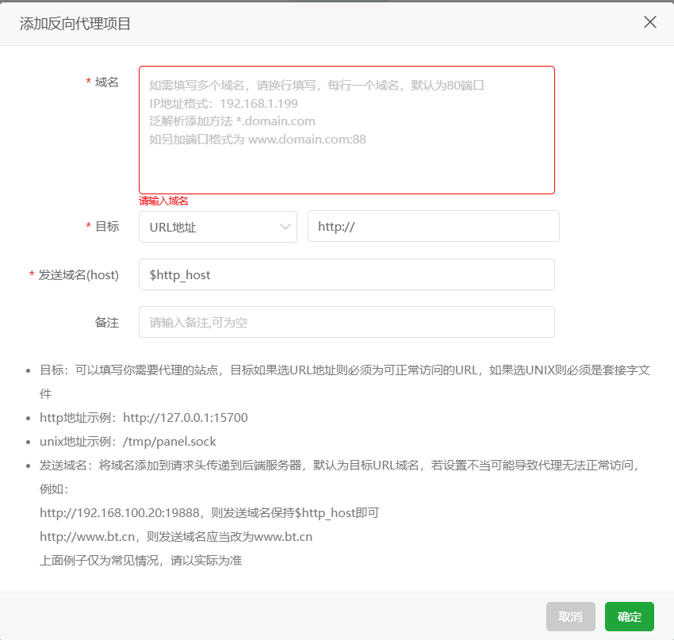

# nginx


反向代理


## github pages代理


现在有一个需求，我的云服务器可以访问到`github.io`，但是一些主机被墙了完全访问不到`github.io`，所以可能会带来一些麻烦。现在在云服务器上使用`nginx` 添加反向代理实现，访问云服务器的主机ip，可以直接看到`github.io`的页面


配置文件：

```nginx
proxy_cache_path /www/wwwroot/117.27.231.170/proxy_cache_dir levels=1:2 keys_zone=117_27_231_170_cache:20m inactive=1d max_size=5g;

server {
    listen 10086;
    
listen [::]:10086;
    
    server_name 117.27.231.170;
    index index.php index.html index.htm default.php default.htm default.html;
    root /www/wwwroot/117.27.231.170;

    #CERT-APPLY-CHECK--START
    # 用于SSL证书申请时的文件验证相关配置 -- 请勿删除
    include /www/server/panel/vhost/nginx/well-known/117.27.231.170.conf;
    #CERT-APPLY-CHECK--END

    #SSL-START SSL相关配置，请勿删除或修改下一行带注释的404规则
    #error_page 404/404.html;
    #SSL-END
    #REDIRECT START
    
    #REDIRECT END

    #ERROR-PAGE-START  错误页配置，可以注释、删除或修改
    #error_page 404 /404.html;
    #error_page 502 /502.html;
    #ERROR-PAGE-END

    #PHP-INFO-START  PHP引用配置，可以注释或修改
        #SECURITY-START 防盗链配置
    location ~ .*\.(jpg,jpeg,gif,png,js,css)$
    {
        expires      30d;
        access_log /dev/null;
        valid_referers none blocked 117.27.231.170:10086;
        if ($invalid_referer){
           return 404;
        }
    }
    #SECURITY-END
    include enable-php-00.conf;
    #PHP-INFO-END

    #IP-RESTRICT-START 限制访问ip的配置，IP黑白名单
    
    
    #IP-RESTRICT-END

    #BASICAUTH START
    
    #BASICAUTH END

    #SUB_FILTER START
    
    #SUB_FILTER END

    #GZIP START
    
    #GZIP END

    #GLOBAL-CACHE START
    
    proxy_cache 117_27_231_170_cache;
    proxy_cache_key $host$uri$is_args$args;
    proxy_ignore_headers Set-Cookie Cache-Control expires X-Accel-Expires;
    proxy_cache_valid 200 304 301 302 3d;
    proxy_cache_valid 404 1m;
    location ~ .*\.(css|js|jpe?g|gif|png|webp|woff|eot|ttf|svg|ico|css\.map|js\.map)$
    {
        expires 3d;
        error_log /dev/null;
        access_log /dev/null;
    }
    #GLOBAL-CACHE END

    #WEBSOCKET-SUPPORT START
    proxy_http_version 1.1;
      proxy_set_header Upgrade $http_upgrade;
      proxy_set_header Connection $connection_upgrade;
    #WEBSOCKET-SUPPORT END

    #PROXY-CONF-START
    location ^~ / {
      
      
      proxy_pass https://folajj.github.io;
      proxy_set_header Host folajj.github.io;
      proxy_set_header X-Real-IP $remote_addr;
      proxy_set_header X-Real-Port $remote_port;
      proxy_set_header X-Forwarded-For $proxy_add_x_forwarded_for;
      proxy_set_header X-Forwarded-Proto $scheme;
      proxy_set_header X-Forwarded-Host $host;
      proxy_set_header X-Forwarded-Port $server_port;
      proxy_set_header REMOTE-HOST $remote_addr;
      proxy_ssl_server_name on;
      proxy_connect_timeout 60s;
      proxy_send_timeout 600s;
      proxy_read_timeout 600s;
      proxy_http_version 1.1;
      proxy_set_header Upgrade $http_upgrade;
      proxy_set_header Connection $connection_upgrade;    

    }
    
    #PROXY-CONF-END

    #SERVER-BLOCK START
    
    #SERVER-BLOCK END

    #禁止访问的文件或目录
    location ~ ^/(\.user.ini|\.htaccess|\.git|\.env|\.svn|\.project|LICENSE|README.md)
    {
        return 404;
    }

    #一键申请SSL证书验证目录相关设置
    location /.well-known{
        allow all;
    }

    #禁止在证书验证目录放入敏感文件
    if ( $uri ~ "^/\.well-known/.*\.(php|jsp|py|js|css|lua|ts|go|zip|tar\.gz|rar|7z|sql|bak)$" ) {
        return 403;
    }

    #LOG START
    access_log  /www/wwwlogs/117.27.231.170.log;
    error_log  /www/wwwlogs/117.27.231.170.error.log;
    
    #LOG END
}
```


bt上面设置也是挺简单的：

- `域名` ：有域名就写域名，没有域名就写你的ip地址，要是想指定端口，那就`ip:port` 或者 `域名:port`
- `目标` ： 就是你要代理的网站，比如你是`xxxx.github.io` , 那就改成 `https://xxxx.github.io`

设置完一定要让nginx重启，让服务生效，就成功了。


后续设置建议就是加上缓存，这样缓存过的页面就可以加速访问了！

