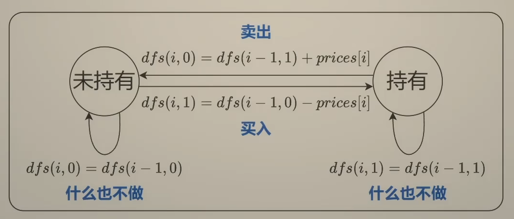
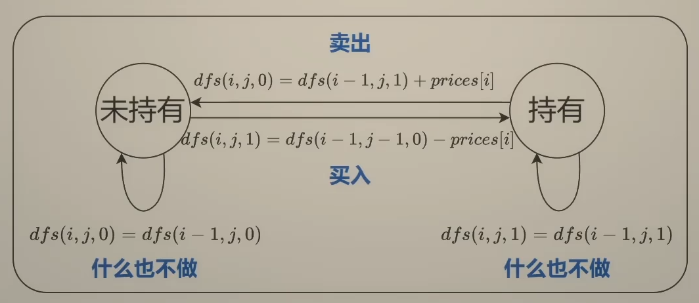

# dp专题——买卖股票的最佳时机

这一系列问题是经典的dp问题，而且在原有基础上有许多变种，如手续费、买卖两次、冷冻期等，这边就搜集了几道题目系统学习一下。

参考视频：【买卖股票的最佳时机【基础算法精讲 21】】 https://www.bilibili.com/video/BV1ho4y1W7QK/?share_source=copy_web&vd_source=c3e71390155db06a2adc54171b6c3a0a


## 买卖股票的最佳时机

题目链接：https://leetcode.cn/problems/best-time-to-buy-and-sell-stock

题目特征：你只能选择 **某一天** 买入这只股票，并选择在 **未来的某一个不同的日子** 卖出该股票

固然可以使用暴力做法，直接两次遍历，寻找最大的利润，当然也会超时，无法通过：

```cpp
class Solution {
public:
    int maxProfit(vector<int>& prices) {
        int n = (int)prices.size(), ans = 0;
        for (int i = 0; i < n; ++i){
            for (int j = i + 1; j < n; ++j) {
                ans = max(ans, prices[j] - prices[i]);
            }
        }
        return ans;
    }
};
```

由于只是买入卖出一支股票一次而已，所以我们应该知道第i天之前，股票价格最小值，才能抄底，作为买入价

然后在循环的时候找到第i天和前面最低价格的差值的最大值即可

所以需要维护profit记录当前利润最大值，minPrices记录第i天之前最低价格

本质上就是寻找波峰和波谷，但需要注意的就是波峰必须在波谷出现之后。此时波峰减波谷就是利润最大值。

```cpp
class Solution {
public:
    int maxProfit(vector<int>& prices) {
		int Profit = 0;
        int minPrices = INT_MAX;
        for(auto p:prices){
            minPrices = min(minPrices,p);
            Profit = max(Profit,p-minPrices);
        }
        return Profit;
    }
};
```


## ==买卖股票的最佳时机Ⅱ==

题目链接：https://leetcode.cn/problems/best-time-to-buy-and-sell-stock-ii/

题目特征：在每一天，你可以决定是否购买和/或出售股票。你在任何时候 **最多** 只能持有 **一股** 股票。你也可以先购买，然后在 **同一天** 出售。


思路：从最后一天开始思考，倒着思考

假设

```
prices = [7,1,5,3,6,4]
```

- 从第0天到第5天的利润=从第0天到第4天的利润+第5天的利润，其余不去考虑，目的是写出递推式
- 考虑第五天的操作：买入、卖出、什么也不做

```
从第0天到第5天结束的利润=从第0天到第4天结束的利润+第5天的利润
从第0天到第5天结束的利润=从第0天到第3天结束的利润+第4天的利润+第5天的利润
....
```

分解为子问题，从第0天到第i-1天结束时，持有/未持有股票的最大利润

第i天就卖出、买入、什么也不做

所以就开始想递归中，需要传递什么参数，第一个参数肯定是前i天，第二个参数是是否持有股票

i-1天的结束就是i天的开始，也就是第i天开始的最大利润，所以可以有如下的状态机：



```
未持有股票时什么也不做：dfs(i,0) = dfs(i-1,0);
持有股票时什么也不做：dfs(i,1) = dfs(i-1,1);
持有股票时卖出：dfs(i,0) = dfs(i-1,1)+prices[i];
未持有股票时买入：dfs(i,1) = dfs(i-1,0)-prices[i];
```

我们关注到一个子问题上，未持有的状态去向有两个，持有的状态去向也是两个，关注利润最大的那个去向，所以可以有表达式如下：

```cpp
dfs(i,0)=max(dfs(i-1,0),dfs(i-1,1)+prices[i]);
dfs(i,1)=max(dfs(i-1,1),dfs(i-1,0)-prices[i]);
```

边界考虑就是第0天利润为0，且未持有股票，且可以预想的是最后一天之前必定要将股票甩出去，才能最优化利润，`dfs(n-1,1)`必然严格小于`dfs(n-1,0)`

所以程序入口直接写作`dfs(n-1,0)`

所以可以直接写程序如下：

```cpp
class Solution {
    int dfs(int nday,bool isHold,vector<int>& prices){
        if(nday<0)return isHold == 1 ? INT_MIN : 0;
        if(isHold){
            return max(dfs(nday-1,true,prices),dfs(nday-1,false,prices)-prices[nday]);
        }
        else return max(dfs(nday-1,false,prices),dfs(nday-1,true,prices)+prices[nday]);
    }
public:
    
    int maxProfit(vector<int>& prices) {
        int nday = prices.size();
        return dfs(nday-1,false,prices);
    }
};
```

上述在数据量小的时候还是可以的，但在leetcode，你还得练，这里先修改为记忆化搜索：

引入一个二维数组：

```cpp
class Solution {
private:
    vector<vector<int>> memo;  
    int dfs(int nday, bool isHold, vector<int>& prices) {
        if (nday < 0) {
            return isHold ? INT_MIN : 0;
        }
        if (memo[nday][isHold] != -1) {
            return memo[nday][isHold];
        }
        int res;
        if (isHold) {
            res = max(
                dfs(nday - 1, true, prices),  
                dfs(nday - 1, false, prices) - prices[nday]  
            );
        } else {
            res = max(
                dfs(nday - 1, false, prices),  
                dfs(nday - 1, true, prices) + prices[nday]  
            );
        }
        memo[nday][isHold] = res;
        return res;
    }

public:
    int maxProfit(vector<int>& prices) {
        int nday = prices.size();
        memo.assign(nday, vector<int>(2, -1));  
        return dfs(nday - 1, false, prices);
    }
};
```

上面都是递归，系统消耗也大，而且还用了一个二维数组，所以要将递归转为递推

```
f[i][0] = max(f[i-1][0],f[i-1][1]+prices[i])
f[i][1] = max(f[i-1][1],f[i-1][0]-prices[i])
```

其实你看这个式子和上面递归中传递的参数也是类似的，但是需要注意的就是这是数组，并没有`f[-1][0]`和`f[-1][1]`这样的取值，下标越界了，所以得插入一个状态

最后的递推式如下：

```
f[0][0] = [0]
f[0][1] = -inf
f[i+1][0] = max(f[i][0],f[i][1]+prices[i])
f[i+1][1] = max(f[i][1],f[i][0]-prices[i])

入口为
f[n][0]
```

所以要创建一个`(n+1,2)`的数组

```cpp
class Solution {
public:
    int maxProfit(vector<int>& prices) {
        int n = prices.size();
        vector<vector<int>> f(n+1,vector<int>(2,0));
        f[0][1] = INT_MIN;
        for(int i=0;i<n;++i){
            f[i+1][0] = max(f[i][0],f[i][1]+prices[i]);
            f[i+1][1] = max(f[i][1],f[i][0]-prices[i]);
        }
        return f[n][0];
    }
};
```


回顾代码，`f[i+1]` 其实只用到`f[i]`这一个状态，所以仅仅需要长为2的数组，或者就不用数组了，直接用变量表示

```cpp
class Solution {
public:
    int maxProfit(vector<int>& prices) {
        int f0 = 0;
        int f1 = INT_MIN;
        for(auto p:prices){
            int newF0 = max(f0,f1 + p);
            f1 = max(f1,f0-p);
            f0 = newF0;
        }
        return f0;
    }
};
```


本题还可以使用贪心算法求解：但是不适合推广，只适合无限次交易和T+0交易（也就是多次买入卖出和当天买入卖出）

```cpp
class Solution {
public:
    int maxProfit(vector<int>& prices) {
        int ans=0;
        for(int i=1;i<prices.size();i++){
            if(prices[i]>prices[i-1]){
                ans+=prices[i]-prices[i-1];
            }
        }
        return ans;
    }
};
```


## 买卖股票的最佳时机含冷冻期（Ⅱ变种）

题目链接：https://leetcode.cn/problems/best-time-to-buy-and-sell-stock-with-cooldown/

题目特征：卖出股票后，你无法在第二天买入股票 (即冷冻期为 1 天)。你不能同时参与多笔交易（你必须在再次购买前出售掉之前的股票）。


换句话说就是买入股票的前一天不能有卖出操作，跟打家劫舍有一个变形很像，就是偷了这家就不能偷相邻的这家了，会报警

对于`f[i]`而言，就是一旦选上了，就直接跳过`f[i-1]`，直接考虑`f[i-2]`这个情况

基本上代码框架和买卖股票的最佳时机Ⅱ这个是类似的：

考虑递归：只需要修改isHold==1的情况中的nday-2即可

```cpp
class Solution {
    int dfs(int nday,bool isHold,vector<int>& prices){
        if(nday<0)return isHold == 1 ? INT_MIN : 0;
        if(isHold==1){
            return max(dfs(nday-1,true,prices),dfs(nday-2,false,prices)-prices[nday]);
        }
        else return max(dfs(nday-1,false,prices),dfs(nday-1,true,prices)+prices[nday]);
    }
public:
    int maxProfit(vector<int>& prices) {
        int nday = prices.size();
        return dfs(nday-1,false,prices);
    }
};
```

但是这种一般都是超出时间限制，还是一样二维数组优化：

```cpp
class Solution {
private:
    vector<vector<int>> memo;  
    int dfs(int nday, bool isHold, vector<int>& prices) {
        if (nday < 0) {
            return isHold ? INT_MIN : 0;
        }
        if (memo[nday][isHold] != -1) {
            return memo[nday][isHold];
        }
        int res;
        if (isHold) {
            res = max(
                dfs(nday - 1, true, prices),  
                dfs(nday - 2, false, prices) - prices[nday]  
            );
        } else {
            res = max(
                dfs(nday - 1, false, prices),  
                dfs(nday - 1, true, prices) + prices[nday]  
            );
        }
        memo[nday][isHold] = res;
        return res;
    }

public:
    int maxProfit(vector<int>& prices) {
        int nday = prices.size();
        memo.assign(nday, vector<int>(2, -1));  
        return dfs(nday - 1, false, prices);
    }
};
```

递推式：dp

```cpp
class Solution {
public:
    int maxProfit(vector<int>& prices) {
        int n = prices.size();
        if (n <= 1) return 0;
        vector<vector<int>> dp(n, vector<int>(2, 0));
        dp[0][0] = 0;                     
        dp[0][1] = -prices[0];            
        dp[1][0] = max(dp[0][0], dp[0][1] + prices[1]);  
        dp[1][1] = max(dp[0][1], -prices[1]);            
        for (int i = 2; i < n; i++) {    
            dp[i][0] = max(dp[i-1][0], dp[i-1][1] + prices[i]);
            dp[i][1] = max(dp[i-1][1], dp[i-2][0] - prices[i]);
        }
        return dp[n-1][0];  
    }
};
```

优化空间复杂度，这次就是要用三个变量来代替了

```cpp
class Solution {
public:
    int maxProfit(vector<int>& prices) {
        int n = prices.size();
        if (n <= 1) return 0;
        int f2 = 0;       
        int f0 = 0;      
        int f1 = -prices[0];  
        for (int i = 1; i < n; i++) {
            int new_f0 = max(f0, f1 + prices[i]);
            int new_f1 = max(f1, (i >= 2 ? f2 : 0) - prices[i]); 
            f2 = f0;      
            f0 = new_f0;  
            f1 = new_f1;  
        }
        return f0;
    }
};
```


## 买卖股票的最佳时机含手续费（Ⅱ变种）

题目链接：https://leetcode.cn/problems/best-time-to-buy-and-sell-stock-with-transaction-fee/

题目特征：你可以无限次地完成交易，但是你每笔交易都需要付手续费。如果你已经购买了一个股票，在卖出它之前你就不能再继续购买股票了。这里的一笔交易指买入持有并卖出股票的整个过程，每笔交易你只需要为支付一次手续费。

还是和最佳时机Ⅱ类似，都是基于这道题的变种题

但是需要注意的就是可能会溢出，所以代码应该如下：

```cpp
class Solution {
private:
    vector<vector<int>> memo;  
    int Myfee;

    int dfs(int nday, bool isHold, vector<int>& prices) {
        if (nday < 0) {
            return isHold ? INT_MIN / 2 : 0;
        }
        if (memo[nday][isHold] != -1) {
            return memo[nday][isHold];
        }

        int res;
        if (isHold) {
            res = max(
                dfs(nday - 1, true, prices),  
                dfs(nday - 1, false, prices) - prices[nday]  // 买入时不扣手续费
            );
        } else {
            res = max(
                dfs(nday - 1, false, prices),  
                dfs(nday - 1, true, prices) + (prices[nday] - Myfee)  // 卖出时扣手续费
            );
        }

        memo[nday][isHold] = res;
        return res;
    }

public:
    int maxProfit(vector<int>& prices, int fee) {
        int nday = prices.size();
        if (nday <= 1) return 0;  // 边界条件检查

        Myfee = fee;
        memo.assign(nday, vector<int>(2, -1));  
        return dfs(nday - 1, false, prices);
    }
};
```

递推也是如下：

```cpp
class Solution {
public:
    int maxProfit(vector<int>& prices, int fee) {
        int n = prices.size();
        vector<vector<int>> f(n+1,vector<int>(2,0));
        f[0][1] = INT_MIN;
        for(int i=0;i<n;++i){
            f[i+1][0] = max(f[i][0],f[i][1]+prices[i]);
            f[i+1][1] = max(f[i][1],f[i][0]-prices[i]-fee);
        }
        return f[n][0];
    }
};
```

优化空间复杂度：

```cpp
class Solution {
public:
    int maxProfit(vector<int>& prices,int fee) {
        int f0 = 0;
        int f1 = INT_MIN;
        for(auto p:prices){
            int newF0 = max(f0,f1 + p);
            f1 = max(f1,f0-p-fee);
            f0 = newF0;
        }
        return f0;
    }
};
```


## ==买卖股票的最佳时机Ⅳ（至多交易k次）==

题目链接：https://leetcode.cn/problems/best-time-to-buy-and-sell-stock-iv/

题目特征：你最多可以完成 `k` 笔交易。也就是说，你最多可以买 `k` 次，卖 `k` 次。你不能同时参与多笔交易（你必须在再次购买前出售掉之前的股票）。


就是限制交易次数：

同上面的一样，定义函数嘛，然后现在要传的参数有第i天结束，目前完成多少次交易了，是否持有股票



```
未持有股票时什么也不做：dfs(i,j,0) = dfs(i-1,j,0);
持有股票时什么也不做：dfs(i,j,1) = dfs(i-1,j,1);
持有股票时卖出：dfs(i,j,0) = dfs(i-1,j,1)+prices[i];
未持有股票时买入：dfs(i,j,1) = dfs(i-1,j-1,0)-prices[i];
```

递归方程如下：

```cpp
dfs(i,j,0)=max(dfs(i-1,j,0),dfs(i-1,j,1)+prices[i]);
dfs(i,j,1)=max(dfs(i-1,j,1),dfs(i-1,j-1,0)-prices[i]);
```

递归边界，j不为负，且第0天未持有股票，利润为0

```
dfs(·,-1,·) = -inf
dfs(-1,j,0) = 0
dfs(-1,j,1) = -inf
```

递归入口也是同理，最后一天之前必然要把股票给抛出去才能利润最大化，`dfs(n-1,k,1)`必然严格小于`dfs(n-1,k,0)`

所以程序入口直接写作`dfs(n-1,k,0)`

```cpp
class Solution {
    int dfs(int nday,bool isHold,int k ,vector<int>& prices){
        if(nday<0)return isHold == 1 ? INT_MIN : 0;
        if(k<0)return INT_MIN;
        if(isHold==1){
            return max(dfs(nday-1,true,k,prices),dfs(nday-1,false,k,prices)-prices[nday]);
        }
        else return max(dfs(nday-1,false,k,prices),dfs(nday-1,true,k-1,prices)+prices[nday]);
    }
public:
    int maxProfit(int k, vector<int>& prices) {
        return dfs(prices.size()-1,false,k,prices);
    }
};
```

当然也是超时的，所以需要数组来记忆化搜索：

```cpp
class Solution {
private:
    int memo[1001][2][101]; 
    int dfs(int nday, bool isHold, int k, vector<int>& prices) {
        if (nday < 0) {
            return isHold ? INT_MIN : 0;
        }
        if (k < 0) {
            return INT_MIN;
        }
        if (memo[nday][isHold][k] != -1) {
            return memo[nday][isHold][k];
        }

        int res;
        if (isHold) {
            res = max(
                dfs(nday - 1, true, k, prices), 
                dfs(nday - 1, false, k, prices) - prices[nday]  
            );
        } else {
            res = max(
                dfs(nday - 1, false, k, prices), 
                dfs(nday - 1, true, k - 1, prices) + prices[nday]  
            );
        }
        memo[nday][isHold][k] = res;
        return res;
    }

public:
    int maxProfit(int k, vector<int>& prices) {
        memset(memo, -1, sizeof(memo));  
        return dfs(prices.size() - 1, false, k, prices);
    }
};
```


然后就是递归转递推了：这里引入一个三维数组，然后都是加入一个新参数即可：

```
f[i][j][0] = max(f[i-1][0],f[i-1][1]+prices[i])
f[i][j][1] = max(f[i-1][1],f[i-1][0]-prices[i])
```

其实你看这个式子和上面递归中传递的参数也是类似的，但是需要注意的就是这是数组，并没有`f[-1][0]`和`f[-1][1]`这样的取值，下标越界了，所以得插入一个状态

最后的递推式如下：

```
f[·][0][·] = -inf
f[0][j][0] = 0
f[0][j][1] = -inf
f[i+1][j][0] = max(f[i][j][0],f[i][j][1]+prices[i])
f[i+1][j][1] = max(f[i][j][1],f[i][j-1][0]-prices[i])

入口为
f[n][k+1][0]
```

所以要创建一个`(n+1,k+2,2)`的数组

```cpp
class Solution {
public:
    int maxProfit(int k, vector<int>& prices) {
        int n = prices.size();
        vector<vector<vector<int>>> f(n + 1, vector<vector<int>>(k + 2, vector<int>(2, INT_MIN)));
        for (int j = 1; j <= k + 1; j++) {
            f[0][j][0] = 0;
        }
        for (int i = 0; i < n; i++) {
            for (int j = 1; j <= k + 1; j++) {
                f[i + 1][j][0] = max(f[i][j][0], f[i][j-1][1] + prices[i]);
                f[i + 1][j][1] = max(f[i][j][1], f[i][j][0] - prices[i]);
            }
        }
        return f[n][k + 1][0];
    }
};
```

观察初始的三维数组，可以看到

```cpp
 f[i + 1][j][0] = max(f[i][j][0], f[i][j-1][1] + prices[i]);
 f[i + 1][j][1] = max(f[i][j][1], f[i][j][0] - prices[i]);
```

只用到了上述6个变量，`f[i+1]`只用到`f[i]`这个状态，所以可以去掉一个维度：

优化写法，观察到仅仅需要二维数组就可以完成任务了，和01背包类似，倒序遍历

```cpp
class Solution {
public:
    int maxProfit(int k, vector<int>& prices) {
        int n = prices.size();
        vector<vector<int>> f(k + 1, vector<int>(2, INT_MIN));
        f[0][0] = 0;          
        for (int j = 1; j <= k; j++) {
            f[j][0] = 0;      
            f[j][1] = -prices[0];
        }

        for (int i = 1; i < n; i++) {
            for (int j = k; j >= 1; j--) {
                f[j][0] = max(f[j][0], f[j][1] + prices[i]);
                f[j][1] = max(f[j][1], f[j - 1][0] - prices[i]);
            }
        }
        return f[k][0];
    }
};
```


## 买卖股票的最佳时机Ⅲ（至多2次）

题目链接：https://leetcode.cn/problems/best-time-to-buy-and-sell-stock-iii/

题目特征：你最多可以完成 **两笔** 交易。你不能同时参与多笔交易（你必须在再次购买前出售掉之前的股票）。


思考思路同上，只不过k次特殊化而已，将k设为2即可。

```cpp
class Solution {
public:
    int maxProfit(vector<int>& prices) {
        int k =2;
        int n = prices.size();
        vector<vector<int>> f(k + 1, vector<int>(2, INT_MIN));
        f[0][0] = 0;          
        for (int j = 1; j <= k; j++) {
            f[j][0] = 0;      
            f[j][1] = -prices[0];
        }

        for (int i = 1; i < n; i++) {
            for (int j = k; j >= 1; j--) {
                f[j][0] = max(f[j][0], f[j][1] + prices[i]);
                f[j][1] = max(f[j][1], f[j - 1][0] - prices[i]);
            }
        }
        return f[k][0];
    }
};
```


## 买卖股票的最佳时机Ⅴ

题目链接：https://leetcode.cn/problems/best-time-to-buy-and-sell-stock-v/

题目特征：你可以进行普通交易或做空交易，但是二者交易次数之和至多为k笔。二者定义如下，同样的你必须在开始下一笔交易之前完成当前交易。此外，你不能在已经进行买入或卖出操作的同一天再次进行买入或卖出操作。

- **普通交易**：在第 `i` 天买入，然后在之后的第 `j` 天卖出，其中 `i < j`。你的利润是 `prices[j] - prices[i]`。
- **做空交易**：在第 `i` 天卖出，然后在之后的第 `j` 天买回，其中 `i < j`。你的利润是 `prices[i] - prices[j]`。


进行思考，如果全部都是普通交易，那么可以回退到买卖股票最佳时机Ⅳ

那么引入做空，就要思考什么状态进行表示

- 0，未持有股票且不处于正在做空中
- 1，普通交易持有股票
- 2，正处于做空中的状态

对最佳时机Ⅳ的代码进行修改，对2的状态进行单独处理

```cpp
class Solution {
private:
    vector<vector<array<long long, 3>>> memo;

    long long dfs(int i, int j, int end_state, vector<int>& prices) {
        if (j < 0) {
            return LLONG_MIN / 2; 
        }
        if (i < 0) {
            return end_state ? LLONG_MIN / 2 : 0;
        }
        long long& res = memo[i][j][end_state]; 
        if (res != -1) { 
            return res;
        }
        int p = prices[i];
        if (end_state == 0) {
            return res = max({dfs(i - 1, j, 0, prices), dfs(i - 1, j, 1, prices) + p, dfs(i - 1, j, 2, prices) - p});
        }
        if (end_state == 1) {
            return res = max(dfs(i - 1, j, 1, prices), dfs(i - 1, j - 1, 0, prices) - p);
        }
        return res = max(dfs(i - 1, j, 2, prices), dfs(i - 1, j - 1, 0, prices) + p);
    }

public:
    long long maximumProfit(vector<int>& prices, int k) {
        int n = prices.size();
        memo.assign(n, vector<array<long long, 3>>(k + 1, {-1, -1, -1})); // -1 表示还没有计算过
        return dfs(n - 1, k, 0, prices);
    }
};
```


进化为递推，需要三维：

```cpp
class Solution {
public:
    long long maximumProfit(vector<int>& prices, int k) {
        int n = prices.size();
        vector f(n + 1, vector<array<long long, 3>>(k + 2, {LLONG_MIN / 2, LLONG_MIN / 2, LLONG_MIN / 2}));
        for (int j = 1; j <= k + 1; j++) {
            f[0][j][0] = 0;
        }
        for (int i = 0; i < n; i++) {
            int p = prices[i];
            for (int j = 1; j <= k + 1; j++) {
                f[i + 1][j][0] = max({f[i][j][0], f[i][j][1] + p, f[i][j][2] - p});
                f[i + 1][j][1] = max(f[i][j][1], f[i][j - 1][0] - p);
                f[i + 1][j][2] = max(f[i][j][2], f[i][j - 1][0] + p);
            }
        }
        return f[n][k + 1][0];
    }
};
```

可以观察到每次迭代只依赖前一次的状态，因此可以将空间复杂度从O(n*k)优化到O(k)。

```cpp
class Solution {
public:
    long long maximumProfit(vector<int>& prices, int k) {
        int n = prices.size();
        vector<vector<array<long long, 3>>> dp(2, vector<array<long long, 3>>(k + 2, {LLONG_MIN / 2, LLONG_MIN / 2, LLONG_MIN / 2}));
        
        // 初始化
        for (int j = 1; j <= k + 1; j++) {
            dp[0][j][0] = 0;
        }
        
        for (int i = 0; i < n; i++) {
            int p = prices[i];
            int curr = (i + 1) % 2;
            int prev = i % 2;
            
            for (int j = 1; j <= k + 1; j++) {
                dp[curr][j][0] = max({dp[prev][j][0], dp[prev][j][1] + p, dp[prev][j][2] - p});
                dp[curr][j][1] = max(dp[prev][j][1], dp[prev][j - 1][0] - p);
                dp[curr][j][2] = max(dp[prev][j][2], dp[prev][j - 1][0] + p);
            }
        }
        
        return dp[n % 2][k + 1][0];
    }
};
```

还能在优化，观察到仅仅需要两维数组就可以完成上述任务：

```cpp
class Solution {
public:
    long long maximumProfit(vector<int>& prices, int k) {
        vector<array<long long, 3>> f(k + 2, {LLONG_MIN / 2, LLONG_MIN / 2, LLONG_MIN / 2});
        for (int j = 1; j <= k + 1; j++) {
            f[j][0] = 0;
        }
        for (int p : prices) {
            for (int j = k + 1; j > 0; j--) {
                f[j][0] = max({f[j][0], f[j][1] + p, f[j][2] - p});
                f[j][1] = max(f[j][1], f[j - 1][0] - p);
                f[j][2] = max(f[j][2], f[j - 1][0] + p);
            }
        }
        return f[k + 1][0];
    }
};
```

