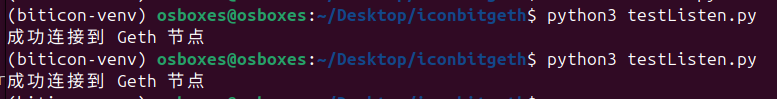
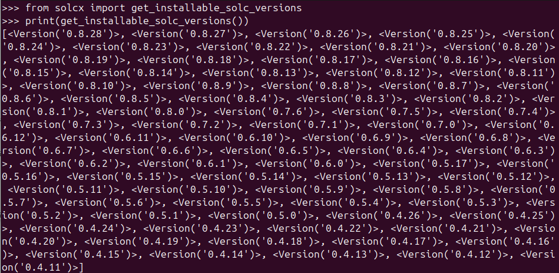

## Linux上安装Geth并搭建私有链

### 安装

```bash
sudo add-apt-repository -y ppa:ethereum/ethereum
sudo apt update
sudo apt install geth
```


一定一定要装老版本，因为我们是实验，新版本有些东西方法用不了


github下载

https://github.com/ethereum/go-ethereum/releases?page=4

低几个版本就可以

要先下载Go语言Golang

```
tar -xvzf go-ethereum-1.11.6.tar.gz

gpg --recv-keys F9585DE6 C2FF8BBF 9BA28146 7B9E2481 D2A67EAC

make geth

sudo cp build/bin/geth /usr/local/bin/
```


查看是否安装成功

```
geth --version			// 查看版本
```


### 创世区块配置

首先创建创世区块配置文件（ genesis.json ），设置链的初始参数如  chainId 、 difficulty 等，例如：

创建一个Genesis文件（genesis.json）

```bash
{
  "config": {
     "chainId": 10,
     "homesteadBlock": 0,
     "eip155Block": 0,
     "eip158Block": 0
  },
  "coinbase"   : "0x0000000000000000000000000000000000000000",
  "difficulty" : "0x2000",
  "extraData"  : "",
  "gasLimit"   : "0xffffffff",
  "nonce"      : "0x0000000000000042",
  "mixhash"    : "0x0000000000000000000000000000000000000000000000000000000000000000",
  "parentHash" : "0x0000000000000000000000000000000000000000000000000000000000000000",
  "timestamp"  : "0x00",
  "alloc": {
     "08a58f09194e403d02a1928a7bf78646cfc260b0": {
         "balance": "0x200000000000000000000000000000000000000000000000000000000000000"
     },
     "87366ef81db496edd0ea2055ca605e8686eec1e6": {
         "balance": "0x200000000000000000000000000000000000000000000000000000000000000"
     }
  }
}
```


| 参数名         | 描述                                                         |
| -------------- | ------------------------------------------------------------ |
| chainId        | 指定了独立的区块链网络 ID。网络 ID 在连接到其他节点的时候会用到，以太坊公网的网络 ID 是 1，为了不与公有链网络冲突，运行私有链节点的时候要指定自己的网络 ID。不同 ID 网络的节点无法相互连接 |
| homesteadBlock | 当设置为0表示使用homestead发布该链                           |
| nonce          | nonce就是一个64位随机数，用于挖矿，注意它和mixhash的设置需要满足以太坊的Yellow paper, 4.3.4. Block Header Validity, (44)章节所描述的条件 |
| mixhash        | 与nonce配合用于挖矿，由上一个区块的一部分生成的hash。注意它和nonce的设置需要满足以太坊的Yellow paper, 4.3.4. Block Header Validity, (44)章节所描述的条件 |
| difficulty     | 设置设置当前区块的难度，越大挖矿就越难                       |
| alloc          | 用来预置账号以及账号的以太币数量，因为私有链挖矿比较容易，所以我们也可以不需要预置有币的账号，需要的时候自己创建即可以 |
| coinbase       | 矿工账号，可以随便写                                         |
| timestamp      | 设置创世块的时间戳                                           |
| parentHash     | 上一个区块的hash，创世区块的该项参数就为0                    |
| extraData      | 附加信息，可以随便写                                         |
| gasLimit       | 该值设置对GAS的消耗总量限制，用来限制区块能包含的交易信息总和。我们创建的是私有链，可以填最大 |


### 初始化

使用  geth 命令初始化区块链：

```
geth --datadir ./data init genesis.json
```


这里  --datadir 指定数据存储目录为  ./data 


### 启用节点

启动私有链：

```
geth --datadir ./data --nodiscover console 2>>geth.log
```


一般来说使用web3进行连接就要开启PRC，下面是整体的命令，将输出内容重定向到geth.log文件的同时可以执行Geth命令行

PRC通信：


```
geth --datadir ./data --nodiscover --allow-insecure-unlock --http --http.addr 0.0.0.0 --http.port 8545 --http.api personal,web3,eth,net,debug,txpool --networkid 10 console 2>&1 | tee -a geth.log
```


`2>&1`：将标准错误（stderr）重定向到标准输出（stdout），这样所有输出（包括错误和普通日志）都会被传递到管道。

`| tee -a geth.log`：`tee` 命令会将从管道中接收到的输出同时写入到 `geth.log` 文件中，并将其显示在终端中。`-a` 选项表示将输出追加到 `geth.log` 文件，而不是覆盖文件内容。


由于要使用personal这个namespace，要加上，高版本无效

```
--rpc.enabledeprecatedpersonal
```

高版本无效


PRC启动的时候参数说明：

| 参数名        | 描述                                                         |
| ------------- | ------------------------------------------------------------ |
| identity      | 区块链的标识，用于标示目前网络的名字                         |
| nodiscover    | 关闭p2p网络的自动发现，需要手动添加节点，这样有利于我们隐藏私有网络 |
| init          | 指定创世块文件的位置，并创建创世块                           |
| datadir       | 当前区块数据存放的位置                                       |
| port          | 网络监听端口，默认30303                                      |
| rpc           | 启动rpc通信                                                  |
| rpcapi        | 设置允许连接rpc的客户端，一般为db,eth,net,web3               |
| rpccorsdomain | 指定什么url能连接到你的节点执行rpc定制端任务，如果输入的是“*”，则任何url都可以连接到你的rpc实例 |
| rpcaddr       | 连接rpc的地址，默认为localhost                               |
| rpcport       | 连接rpc的端口，默认为8545                                    |
| networkid     | 设置当前区块链的网络ID，用于区分不同的网络，是一个数字       |
| console       | 启动命令行模式，可以在Geth中执行命令                         |


如果创建创世区块之前已经启动了私有链，在创建了创世区块配置文件后，可以通过以下命令重新进入geth控制台，并使用配置文件更新区块：

```bash
geth --datadir data --networkid 10 console
```


启用之后命令如下：

```
personal.newAccount()：创建账户
personal.unlockAccount()：解锁账户
eth.accounts：枚举系统中的账户
eth.getBalance()：查看账户余额，返回值的单位是 Wei（Wei 是以太坊中最小单位，类似比特币中的聪，1 ether = 10^18 Wei）
eth.blockNumber：列出区块总数
eth.getBlock()：根据区块编码获取区块详细信息
eth.getTransaction()：根据交易hash获取交易详细信息
miner.start()：开始挖矿
miner.stop()：停止挖矿
eth.coinbase：挖矿奖励的账户
web3.fromWei()：Wei 换算成以太币
web3.toWei()：以太币换算成 Wei
txpool.status：交易池中的状态
admin.addPeer()：连接到其他节点
```


### 启用信息

```
> admin.nodeInfo
{
  enode: "enode://1709a3ff18fbaedc756251158b215f35b39c648d53511998c0587c4ac1e8ad0247c5b78119b7369ebf0c6421aa2f3ba52513e35cdb51e40d0bf4705f6278e601@127.0.0.1:30303?discport=0",
  enr: "enr:-J-4QEPG58uiVaMAhWAWAaDgLV_dpNe9u4CEJ_cGhqm5S73VHbW5X6JXhyYoj9nzPSB-gCFcdzhFQAdtYkgdWUAudeWGAZO_67yTg2V0aMrJhPxk7ASDEYwwgmlkgnY0gmlwhH8AAAGJc2VjcDI1NmsxoQMXCaP_GPuu3HViURWLIV81s5xkjVNRGZjAWHxKweitAoRzbmFwwIN0Y3CCdl8",
  id: "e367a92d5a26524844b3ef43e44173ea62d6241113bd8f45d60b56ed5181202f",
  ip: "127.0.0.1",
  listenAddr: "[::]:30303",
  name: "Geth/v1.14.12-stable-293a300d/linux-amd64/go1.23.3",
  ports: {
    discovery: 0,
    listener: 30303
  },
  protocols: {
    eth: {
      config: {
        arrowGlacierBlock: 13773000,
        berlinBlock: 12244000,
        byzantiumBlock: 4370000,
        cancunTime: 1710338135,
        chainId: 1,
        constantinopleBlock: 7280000,
        daoForkBlock: 1920000,
        daoForkSupport: true,
        depositContractAddress: "0x00000000219ab540356cbb839cbe05303d7705fa",
        eip150Block: 2463000,
        eip155Block: 2675000,
        eip158Block: 2675000,
        ethash: {},
        grayGlacierBlock: 15050000,
        homesteadBlock: 1150000,
        istanbulBlock: 9069000,
        londonBlock: 12965000,
        muirGlacierBlock: 9200000,
        petersburgBlock: 7280000,
        shanghaiTime: 1681338455,
        terminalTotalDifficulty: 5.875e+22
      },
      difficulty: 17179869184,
      genesis: "0xd4e56740f876aef8c010b86a40d5f56745a118d0906a34e69aec8c0db1cb8fa3",
      head: "0xd4e56740f876aef8c010b86a40d5f56745a118d0906a34e69aec8c0db1cb8fa3",
      network: 1
    },
    snap: {}
  }
}

```


## 编写智能合约sol

Voting.sol

```solidity
pragma solidity ^0.8.0;

contract Voting {
    struct Candidate {
        uint id;
        string name;
        uint voteCount;
    }

    mapping(address => bool) public voters;
    mapping(uint => Candidate) public candidates;
    mapping(address => bool) public hasVoted;
    
    uint public candidatesCount;
    uint public totalVotes;

    event votedEvent(uint indexed candidateId);

    constructor() {
        addCandidate("Alice");
        addCandidate("Bob");
    }

    function addCandidate(string memory _name) private {
        candidatesCount++;
        candidates[candidatesCount] = Candidate(candidatesCount, _name, 0);
    }

    function registerVoter() public {
        require(!voters[msg.sender], "Voter is already registered.");
        voters[msg.sender] = true;
    }

    function vote(uint _candidateId) public {
        require(voters[msg.sender], "You must register to vote.");
        require(!hasVoted[msg.sender], "You have already voted.");
        require(_candidateId > 0 && _candidateId <= candidatesCount, "Invalid candidate.");

        hasVoted[msg.sender] = true;
        candidates[_candidateId].voteCount++;
        totalVotes++;

        emit votedEvent(_candidateId);
    }

    function getCandidate(uint _candidateId) public view returns (string memory name, uint voteCount) {
        Candidate memory candidate = candidates[_candidateId];
        return (candidate.name, candidate.voteCount);
    }
}
```


## web3库


### 创建虚拟环境

```
pip3 install virtualenv
```

```
python3 -m venv biticon-venv
```


```
source biticon-venv/bin/activate
```


停用

```
deactivate
```


### web3安装

使用Truffle或者直接web3.js部署

安装

```
pip install web3
```


安装失败

https://pypi.org/project/web3/#files

官网下载whl，然后本地install

```
pip install web3-7.6.0-py3-none-any.whl
```


### 测试

```python
from web3 import Web3

# 连接到本地 Geth 节点的 HTTP-RPC 接口（假设是默认的 8545 端口）
w3 = Web3(Web3.HTTPProvider('http://127.0.0.1:8545'))

# 检查是否连接成功
if w3.is_connected():
    print("成功连接到 Geth 节点")
else:
    print("连接失败")

```





## 部署智能合约py


安装：

```
pip install py-solc-x
```


python3安装Solidity编辑器

查看可安装的版本

```python
from solcx import get_installable_solc_versions

print(get_installable_solc_versions())
```




但这里我们直接用经典的`0.8.0` 版本进行实验，安装的时候记得使用debug功能

```python
from solcx import install_solc
import logging

logging.basicConfig(level=logging.DEBUG)

install_solc('0.8.0')
```


安装又出问题，墙的问题，可以设置代理或者还是下载包手动安装。

https://github.com/ethereum/solidity/releases

然后编译安装


### solc-select

安装不了，或者需求大了需要不同版本

使用

```
pip install solc-select
```


```
solc-select use 0.8.28 --always-install
```

直接方便快捷

```
solc --version
```

查看是否安装成功


## 创建用户

personal已经弃用了，改为使用clef


python3创建用户

```python
from web3 import Web3

# 连接到本地的 Geth 节点
w3 = Web3(Web3.HTTPProvider('http://localhost:8545'))

# 检查是否成功连接
if not w3.is_connected():
    print("无法连接到 Geth 节点")
    exit(1)
else:
    print("成功连接到 Geth 节点")

# 创建一个新账户
def create_account():
    account = w3.eth.account.create()
    print(f"新账户地址: {account.address}")
    print(f"新账户私钥: {account._private_key.hex()}")
    return account

# 从私钥导入账户
def import_account(private_key):
    try:
        account = w3.eth.account.from_key(private_key)
        print(f"导入的账户地址: {account.address}")
        return account
    except Exception as e:
        print(f"导入账户失败: {e}")
        return None

# 选择操作
def main():
    # 创建新账户
    account = create_account()

    # 可选择导入账户
    private_key_to_import = '0x28ceaf7143eae0a4b3b9ed07e5f6f3ebce0d577ab26d76fa4f6347d0fd1a7839'  # 在这里替换为你要导入的私钥
    if private_key_to_import:
        imported_account = import_account(private_key_to_import)

    # 你也可以通过 Geth 控制台或者 API 验证账户信息
    print("当前账户列表: ", w3.eth.accounts)

if __name__ == "__main__":
    main()

```


```
新账户地址: 0x3A4a3a466d221bc42C100D76410c2786Bd83015A
新账户私钥: 52b813460bdfebe51b11ae8d066694ccfac04e6f6bee9f3c153dbec46a5c6408

personal_importRawKey("0x3A4a3a466d221bc42C100D76410c2786Bd83015A", "52b813460bdfebe51b11ae8d066694ccfac04e6f6bee9f3c153dbec46a5c6408")
```


SmartBuild.py

```python
from web3 import Web3
from solcx import compile_standard, install_solc


# 连接到本地geth节点
w3 = Web3(Web3.HTTPProvider('http://localhost:8545'))

# 编译智能合约
with open("Voting.sol", "r") as file:
    contract_source_code = file.read()

compiled_sol = compile_standard({
    "language": "Solidity",
    "sources": {
        "Voting.sol": {
            "content": contract_source_code
        }
    },
    "settings": {
        "outputSelection": {
            "*": {
                "*": ["abi", "evm.bytecode"]
            }
        }
    }
})

# 获取合约ABI和字节码
abi = compiled_sol['contracts']['Voting.sol']['Voting']['abi']
bytecode = compiled_sol['contracts']['Voting.sol']['Voting']['evm']['bytecode']['object']

# 设置账户和合约实例
account = w3.eth.accounts[0]
Voting = w3.eth.contract(abi=abi, bytecode=bytecode)

# 部署合约
tx_hash = Voting.constructor().transact({'from': account})
tx_receipt = w3.eth.waitForTransactionReceipt(tx_hash)

# 获取合约地址
contract_address = tx_receipt['contractAddress']
print(f"Contract deployed at address: {contract_address}")
```


## 创建前端交互页面

flask


```python
from flask import Flask, render_template, request, redirect, url_for
from web3 import Web3

app = Flask(__name__)

# 连接到Geth
w3 = Web3(Web3.HTTPProvider('http://localhost:8545'))

# 智能合约ABI和地址
abi = [...]  # 从编译的合约中获取
contract_address = '0xYourContractAddress'

contract = w3.eth.contract(address=contract_address, abi=abi)
account = w3.eth.accounts[0]

@app.route('/')
def index():
    candidates = []
    for i in range(1, 3):  # 假设有2个候选人
        name, vote_count = contract.functions.getCandidate(i).call()
        candidates.append({'name': name, 'vote_count': vote_count})
    return render_template('index.html', candidates=candidates)

@app.route('/vote/<int:candidate_id>', methods=['POST'])
def vote(candidate_id):
    tx_hash = contract.functions.vote(candidate_id).transact({'from': account})
    w3.eth.waitForTransactionReceipt(tx_hash)
    return redirect(url_for('index'))

if __name__ == '__main__':
    app.run(debug=True)
```


## 总结

由上可知区块链的作用：

- 公开透明：所有投票和计票活动都会记录在区块链上，任何人都可以验证投票的合法性，且无法篡改。
- 数据安全：通过智能合约确保投票的公正性和合法性，且每次投票都记录在区块链中，不可能被伪造。
- 去中心化：投票过程不依赖于任何单一的机构，减少了中央服务器攻击的风险。


以下是一个基于 Python、 web3 库以及  geth 搭建私有链来实现简单电子投票系统的示例框架，包含智能合约的基本部署与交互功能：

```python
from web3 import Web3, HTTPProvider
import json

# 连接到本地 geth 节点
w3 = Web3(HTTPProvider('http://localhost:8545'))

# 智能合约 ABI（示例，需根据实际合约修改）
contract_abi = [
    {
        "constant": False,
        "inputs": [{"name": "voter", "type": "address"}, {"name": "candidate", "type": "uint256"}],
        "name": "vote",
        "outputs": [],
        "payable": False,
        "stateMutability": "nonpayable",
        "type": "function"
    },
    {
        "constant": True,
        "inputs": [],
        "name": "getVotes",
        "outputs": [{"name": "", "type": "uint256[]"}],
        "payable": False,
        "stateMutability": "view",
        "type": "function"
    },
    # 其他函数如注册等的 ABI 定义...
]

# 智能合约地址（先部署合约后获取并填入此处）
contract_address = '0x...'
contract = w3.eth.contract(address=contract_address, abi=contract_abi)

# 假设已有账户地址和私钥用于交互（在实际中需妥善管理）
account_address = '0x...'
private_key = '...'

# 投票函数
def vote(voter, candidate):
    nonce = w3.eth.getTransactionCount(account_address)
    txn_dict = contract.functions.vote(voter, candidate).buildTransaction({
        'chainId': 12345,  # 与私有链配置的 chainId 一致
        'gas': 200000,
        'gasPrice': w3.toWei('40', 'gwei'),
        'nonce': nonce
    })
    signed_txn = w3.eth.account.signTransaction(txn_dict, private_key)
    result = w3.eth.sendRawTransaction(signed_txn.rawTransaction)
    return result.hex()

# 获取票数统计函数
def get_votes():
    return contract.functions.getVotes().call()

# 示例用法
if __name__ == "__main__":
    # 投票示例
    vote_result = vote('0x123...', 1)  # 假设 1 是某个候选人编号
    print(f"投票交易哈希: {vote_result}")
    # 获取票数
    votes = get_votes()
    print(f"各候选人票数: {votes}")
```


上述代码实现了与部署在私有链上的智能合约进行交互的基本功能，包括投票和获取票数统计。但这只是一个基础框架，实际的电子投票系统还需要更多完善工作：


二、智能合约开发与部署

1. 开发智能合约代码（例如使用 Solidity 语言）实现注册、投票、计票等功能。以下是一个简单的投票智能合约示例代码：


```solidity
pragma solidity ^0.8.0;

contract Voting {
    mapping(address => bool) public voters;
    mapping(uint256 => uint256) public candidateVotes;

    constructor() {
   }

    function register(address voter) public {
       voters[voter] = true;
    }
    
    function vote(uint256 candidate) public {
        require(voters[msg.sender], "Voter not registered");
        candidateVotes[candidate] += 1;
    }
    
    function getVotes() public view returns (uint256[] memory) {
        uint256[] memory votes = new uint256[](candidateVotes.length);
        for (uint256 i = 0; i < candidateVotes.length; i++) {
            votes[i] = candidateVotes[i];
        }
        return votes;
    }
}
```

2. 使用  solc 编译器编译合约代码得到字节码和 ABI。
3. 通过  web3 库在 Python 中部署智能合约：


```python
# 部署合约示例代码
def deploy_contract():
    # 读取合约字节码和 ABI
    with open('Voting.bin', 'r') as bin_file:
        contract_bytecode = bin_file.read()
    with open('Voting.abi', 'r') as abi_file:
        contract_abi = json.load(abi_file)

    # 创建合约对象
    contract = w3.eth.contract(abi=contract_abi, bytecode=contract_bytecode)

    # 获取部署账户的交易计数
    nonce = w3.eth.getTransactionCount(account_address)

    # 构建部署交易
    txn_dict = contract.constructor().buildTransaction({
        'chainId': 12345,
        'gas': 400000,
        'gasPrice': w3.toWei('40', 'gwei'),
        'nonce': nonce
    })

    # 对交易进行签名
    signed_txn = w3.eth.account.signTransaction(txn_dict, private_key)

    # 发送交易并获取合约地址
    result = w3.eth.sendRawTransaction(signed_txn.rawTransaction)
    tx_receipt = w3.eth.waitForTransactionReceipt(result)
    contract_address = tx_receipt['contractAddress']
    print(f"合约已部署，地址: {contract_address}")
    return contract_address
```


三、去中心化投票协议设计
在上述代码基础上，去中心化投票协议可以体现在以下方面：


1. 注册环节：任何用户都可以通过调用智能合约的  register 函数进行注册，没有中心化的机构来审核，只要符合合约规定的地址格式等要求即可。
2. 投票环节：已注册的选民通过调用  vote 函数进行投票，交易直接在区块链网络中广播并被节点验证和记录，不存在中心化的投票箱或服务器来收集选票，确保了投票过程的去中心化。
3. 计票环节：通过智能合约的  getVotes 函数可以获取票数统计结果，这个结果是基于区块链上各个节点共同维护的账本数据，不是由某个中心机构计算得出，保证了计票的公正性和透明性。


四、区块链保障投票安全与透明性分析


1. 投票过程公开透明：

\- 由于区块链的分布式账本特性，所有投票交易都被记录在各个节点的账本上，任何人都可以查看交易记录（虽然选民信息可能经过加密处理以保护隐私），确保了投票过程的可追溯性和公开性。例如，可以通过区块链浏览器查看每一笔投票交易的时间、投票者地址（可能是匿名化处理后的）、投票对象等信息。

2. 数据安全：

\- 选票数据篡改难以实现，因为区块链采用了密码学技术保证数据的完整性。一旦投票交易被记录在区块链上，要篡改数据需要修改超过 51%的节点数据，这在实际中几乎是不可能的，保证了选票数据的安全性。
\- 用户隐私保护方面，虽然交易是公开的，但可以采用加密技术对选民身份等敏感信息进行处理，例如使用零知识证明等技术，让选民在不暴露自己身份的情况下证明自己有投票资格并且投票行为被正确记录，从而在一定程度上保护了用户隐私。

这只是一个基于区块链的电子投票系统的初步设计与实现框架，在实际应用中还需要考虑更多的安全性、性能优化、合规性等方面的问题，比如对智能合约进行严格的安全审计、处理高并发投票场景、遵循相关法律法规对投票系统的要求等。


参考资料：

- https://blog.csdn.net/a_littleBAI/article/details/115363038
- [在Ubuntu下使用Geth搭建自己的以太坊私有链-CSDN博客](https://blog.csdn.net/kevinyankai/article/details/98623397)
- [pip安装web3失败](https://blog.csdn.net/qq_62018762/article/details/130194218?fromshare=blogdetail&sharetype=blogdetail&sharerId=130194218&sharerefer=PC&sharesource=weixin_51334923&sharefrom=from_link)
- [GitCode - solc-select](https://gitcode.com/gh_mirrors/so/solc-select/overview)
- [personal未定义](https://blog.csdn.net/weixin_45539802/article/details/131230966)
- [Solidity 示例 — Solidity 中文文档 — 登链社区](https://learnblockchain.cn/docs/solidity/solidity-by-example.html#voting)
- https://github.com/guobin1234/gb-voting-project


# 基于区块链的电子投票系统设计与实现

传统电子投票系统存在投票过程不透明、选票数据篡改和用户隐私泄露等问题。

为了解决这些挑战，本课题基于区块链技术设计并实现电子投票系统。

使用已有的开源区块链系统（如以太坊、FISCO-BCOS等），完成私有链的搭建以及智能合约部署；

设计去中心化的电子投票协议，编写智能合约完成注册、投票、计票等功能；

分析区块链在保障投票过程公开透明和数据安全上的作用。


## 分析

在分析区块链在投票过程中的作用时，可以着重讨论以下几点：

1. **数据透明性**：区块链的不可篡改特性确保了所有的投票数据公开且无法被修改，增加了系统的透明度。
2. **数据安全性**：通过加密技术保护用户的投票内容，防止数据泄露。智能合约可以确保投票流程的自动执行，避免人为干预。
3. **去中心化**：通过去中心化的架构，消除了单一中央管理机构的控制，降低了伪造和舞弊的风险。
4. **身份验证与隐私保护**：区块链上的公私钥机制可以确保投票者的身份得到验证，同时通过加密技术保障隐私，确保投票内容不被泄露。

三、去中心化投票协议设计
在上述代码基础上，去中心化投票协议可以体现在以下方面：


1. 注册环节：任何用户都可以通过调用智能合约的  register 函数进行注册，没有中心化的机构来审核，只要符合合约规定的地址格式等要求即可。
2. 投票环节：已注册的选民通过调用  vote 函数进行投票，交易直接在区块链网络中广播并被节点验证和记录，不存在中心化的投票箱或服务器来收集选票，确保了投票过程的去中心化。
3. 计票环节：通过智能合约的  getVotes 函数可以获取票数统计结果，这个结果是基于区块链上各个节点共同维护的账本数据，不是由某个中心机构计算得出，保证了计票的公正性和透明性。


四、区块链保障投票安全与透明性分析


1. 投票过程公开透明：

\- 由于区块链的分布式账本特性，所有投票交易都被记录在各个节点的账本上，任何人都可以查看交易记录（虽然选民信息可能经过加密处理以保护隐私），确保了投票过程的可追溯性和公开性。例如，可以通过区块链浏览器查看每一笔投票交易的时间、投票者地址（可能是匿名化处理后的）、投票对象等信息。

2. 数据安全：

\- 选票数据篡改难以实现，因为区块链采用了密码学技术保证数据的完整性。一旦投票交易被记录在区块链上，要篡改数据需要修改超过 51%的节点数据，这在实际中几乎是不可能的，保证了选票数据的安全性。
\- 用户隐私保护方面，虽然交易是公开的，但可以采用加密技术对选民身份等敏感信息进行处理，例如使用零知识证明等技术，让选民在不暴露自己身份的情况下证明自己有投票资格并且投票行为被正确记录，从而在一定程度上保护了用户隐私。

这只是一个基于区块链的电子投票系统的初步设计与实现框架，在实际应用中还需要考虑更多的安全性、性能优化、合规性等方面的问题，比如对智能合约进行严格的安全审计、处理高并发投票场景、遵循相关法律法规对投票系统的要求等。


```
VotingSystem/
├── contracts/                # 智能合约文件夹
│   └── Voting.sol            # Voting 合约文件
├── migrations/               # 部署脚本文件夹
│   └── 1_deploy_contracts.js # 部署 Voting 合约的迁移脚本
├── test/                     # 测试文件夹
│   └── voting.test.js        # Voting 合约测试脚本
├── src/                      # 前端代码文件夹
│   ├── index.html            # 前端页面 HTML 文件
│   ├── app.js                # JavaScript 文件，包含 Web3.js 与合约交互逻辑
│   └── style.css             # 样式文件
├── truffle-config.js         # Truffle 配置文件
├── package.json              # 项目依赖和脚本配置文件
└── README.md                 # 项目说明文件
```


参考资料：

https://github.com/guobin1234/gb-voting-project

https://github.com/PXY1996/graduation-project

https://github.com/Raymondhsm/BlockChainVote