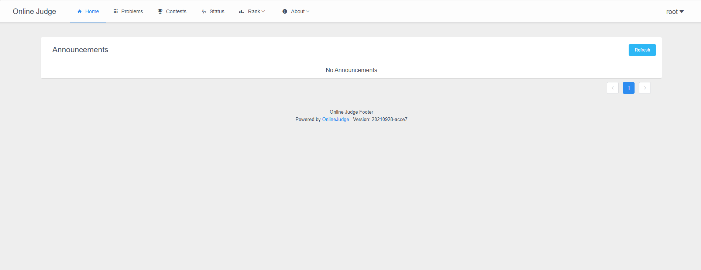
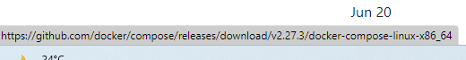

# 搭建在线oj


## 搭建

严禁反复造轮子

这里选择`UOJ` 来进行搭建


直接copy

安装Docker：

```
curl -fsSL https://get.docker.com -o get-docker.sh
sudo sh get-docker.sh
```


Docker服务启动：

```
sudo systemctl start docker   # 启动 docker 服务
sudo docker --version         # 检查 docker 是否正常安装
```


安装QDUOJ

```
apt install docker-compose
```


```
 git clone -b 2.0 https://github.com/QingdaoU/OnlineJudgeDeploy.git && cd OnlineJudgeDeploy
 docker-compose up -d
```


查看docker容器状态

```
docker ps -a
```


## 登录

root

rootroot

通过浏览器访问服务器的 https 80 端口或者 https 443 端口，就可以开始使用了。后台管理路径为`/admin`, 安装过程中自动添加的超级

管理员用户名为 `root`，密码为 `rootroot`， **请务必及时修改密码**。




看到这个就证明你已经搭成功了！！！！


当然很多人都是无法直接顺利安装的，我安装的时候也遇到很多问题，这里把我的参考方案贴出来，仅供参考。


## 问题

### 换源

ubuntu20.04LTS

`/etc/apt/sources.list`


```
deb https://mirrors.aliyun.com/ubuntu/ focal main restricted universe multiverse
deb-src https://mirrors.aliyun.com/ubuntu/ focal main restricted universe multiverse

deb https://mirrors.aliyun.com/ubuntu/ focal-security main restricted universe multiverse
deb-src https://mirrors.aliyun.com/ubuntu/ focal-security main restricted universe multiverse

deb https://mirrors.aliyun.com/ubuntu/ focal-updates main restricted universe multiverse
deb-src https://mirrors.aliyun.com/ubuntu/ focal-updates main restricted universe multiverse

# deb https://mirrors.aliyun.com/ubuntu/ focal-proposed main restricted universe multiverse
# deb-src https://mirrors.aliyun.com/ubuntu/ focal-proposed main restricted universe multiverse

deb https://mirrors.aliyun.com/ubuntu/ focal-backports main restricted universe multiverse
deb-src https://mirrors.aliyun.com/ubuntu/ focal-backports main restricted universe multiverse

```


换了之后要：

```
sudo apt update
sudo apt upgrade
```


### docker和docker-compose的版本不匹配

```
root@vm:~/OnlineJudgeDeploy# docker-compose up -d
Traceback (most recent call last):
  File "/usr/local/bin/docker-compose", line 8, in <module>
    sys.exit(main())
  File "/usr/local/lib/python3.8/dist-packages/compose/cli/main.py", line 81, in main
    command_func()
  File "/usr/local/lib/python3.8/dist-packages/compose/cli/main.py", line 200, in perform_command
    project = project_from_options('.', options)
  File "/usr/local/lib/python3.8/dist-packages/compose/cli/command.py", line 60, in project_from_options
    return get_project(
  File "/usr/local/lib/python3.8/dist-packages/compose/cli/command.py", line 152, in get_project
    client = get_client(
  File "/usr/local/lib/python3.8/dist-packages/compose/cli/docker_client.py", line 41, in get_client
    client = docker_client(
  File "/usr/local/lib/python3.8/dist-packages/compose/cli/docker_client.py", line 124, in docker_client
    kwargs = kwargs_from_env(environment=environment, ssl_version=tls_version)
TypeError: kwargs_from_env() got an unexpected keyword argument 'ssl_version'
```


docker和docker-compose的版本不匹配


先卸载使用pip安装的docker-compose

```
pip uninstall docker-compose
```


查看docker的版本号

```
docker version
```


然后去github找到对应自己的compose版本号

[Releases · docker/compose · GitHub](https://github.com/docker/compose/releases?page=1)





下载安装

```
sudo curl -L "https://github.com/docker/compose/releases/download/v2.27.3/docker-compose-linux-x86_64" -o /usr/local/bin/docker-compose
```

服务器在线上不太好操作，直接本地下载离线包，然后传上去

```shell
sudo mv docker-compose-Linux-x86_64 /usr/local/bin/docker-compose
```


权限赋予

```
sudo chmod +x /usr/local/bin/docker-compose
sudo ln -s /usr/local/bin/docker-compose /usr/bin/docker-compose
```


查看版本

```
sudo docker-compose version 或 docker-compose -v
```


### github无法gitclone

一句命令

```shell
git config --global url."https://github.com".insteadOf git://github.com
```


### github无法访问

```
vim /etc/hosts
```


```
20.205.243.166 github.com
185.199.108.133 raw.githubusercontent.com
185.199.109.133 raw.githubusercontent.com
185.199.110.133 raw.githubusercontent.com
199.232.68.133 raw.githubusercontent.com
185.199.111.133 raw.githubusercontent.com
151.101.76.133 raw.githubusercontent.com
151.101.108.133 raw.githubusercontent.com
151.101.228.133 raw.githubusercontent.com
151.101.128.133 raw.githubusercontent.com
151.101.0.133 raw.githubusercontent.com


141.193.213.21 docker.com
54.230.21.59 download.docker.com
18.173.31.124 download.docker.com
18.173.31.22 download.docker.com
54.230.21.56 download.docker.com
```


```
service network restart
/etc/init.d/network  restart
```


### https://registry-1.docker.io/v2/超时

 net/http: request canceled while waiting for connection 


```shell
sudo vi /etc/docker/daemon.json
```


添加已下内容

2024/11/15实测能用：

```
{
  "registry-mirrors": [ "https://cr.console.aliyun.com","https://docker.m.daocloud.io","https://public.ecr.aws","https://dockerhub.timeweb.cloud"
   ]
}
```


重启服务：

```
systemctl daemon-reload
systemctl restart docker
```


增加请求时间：（没用用）

```
export DOCKER_CLIENT_TIMEOUT=120
export COMPOSE_HTTP_TIMEOUT=120
```


更换DNS服务器

```
sudo vi /etc/resolv.conf
```


```
删掉默认的nameserver地址在后面增加
nameserver 8.8.8.8
nameserver 8.8.4.4
```


### Job for docker.service failed because the control process exited with error code


```
cd /etc/docker/
```


```
mv daemon.json daemon.conf
```


```
systemctl restart docker
```


### 访问不到网站

检查开放端口

```
netstat -tuln
netstat -anp
```


开放端口号：

```
iptables -A INPUT -ptcp --dport  80 -j ACCEPT
iptables -A INPUT -ptcp --dport  22 -j ACCEPT
```


关闭端口号：

```
iptables -A OUTPUT -p tcp --dport 端口号-j DROP
```


```
service iptables save 保存设置
```


注意注意，看一下你的服务器是什么，如果是那些管控很严格的云的话，可以试着把映射给换一下，比如说把10086端口映射到80之类的。


### docker命令

卸载旧的：

```
docker compose stop
docker compose rm
```


开启

```
docker compose start
```

装新的：

```
docker compose up -d
```


查看容器

```
docker ps
```

