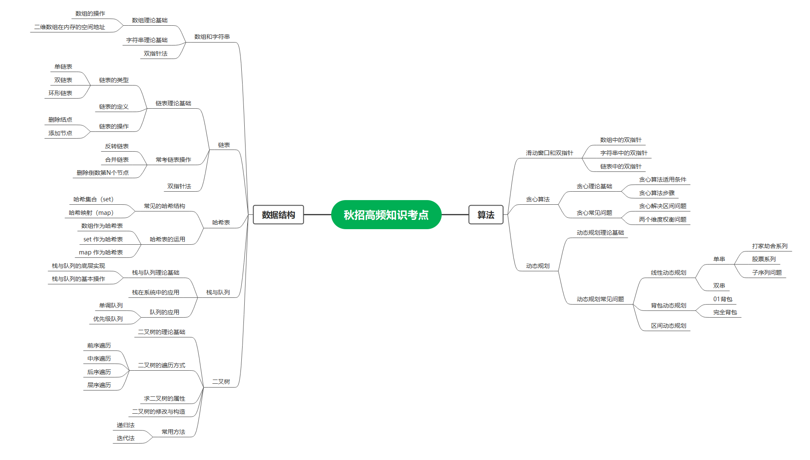
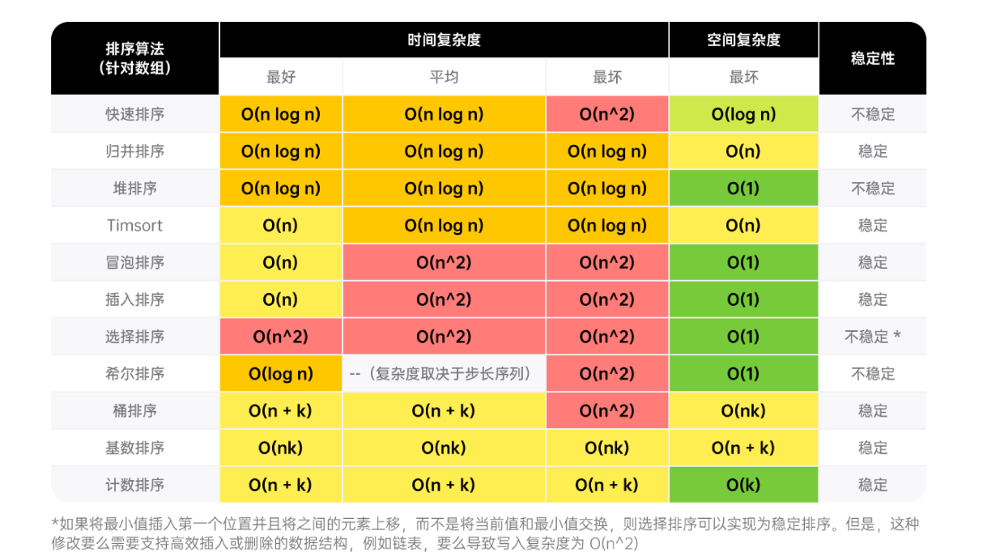

[TOC]


# 四.刷题向

[](https://imgtu.com/i/viEnc4)


这种类型的题目主要以数组的形式出题，当然若是树或者链表啥的，就要稍微修改一下。

这种题目若是以数组的形式来出题，又可以分为有序数组和无序数组，有序数组比较好做，一个双指针直接稿定，当然你也可以暴力或者哈希表；

### [1. 两数之和 无序数组 ](https://leetcode.cn/problems/two-sum/)

而无序数组第一个想到就是暴力破解；

```c++
class Solution {
public:
    vector<int> twoSum(vector<int>& nums, int target) {
        int n = nums.size();
        for (int i = 0; i < n; ++i) {
            for (int j = i + 1; j < n; ++j) {
                if (nums[i] + nums[j] == target) {
                    return {i, j};
                }
            }
        }
        return {};
    }
};
```


哈希表：

```c++
class Solution {
public:
    vector<int> twoSum(vector<int>& nums, int target) {
        unordered_map<int,int> hashtable;
        for(int i=0;i<nums.size();i++)
        {
            auto it = hashtable.find(target-nums[i]);
            if(it!=hashtable.end()){
                return {it->second,i};
            }
            hashtable[nums[i]]=i;
        }
        return {};
    }
};
```

### [167. 两数之和 II   有序数组(返回下标)](https://leetcode.cn/problems/two-sum-ii-input-array-is-sorted/)

这道题也可以用暴力破解，这里就不浪费时间了。

双指针法：

```c++
class Solution {
public:
    vector<int> twoSum(vector<int>& numbers, int target) {
        //方法一双指针
        int i=0,j=numbers.size();
        while(i<j){
            int target1=numbers[i]+numbers[j-1];
            if(target1==target){
                return {i+1,j};
            }
            else if(target1<target)i++;
            else j--;
        }
        return {};
    }
};
```

哈希表法：

```c++
class Solution {
public:
    vector<int> twoSum(vector<int>& numbers, int target) {
        unordered_map<int,int> hashtable;
        for(int i=0;i<numbers.size();i++)
        {
            auto it = hashtable.find(target-numbers[i]);
            if(it!=hashtable.end()){
                return {it->second+1,i+1};
            }
            hashtable[numbers[i]]=i;
        }
        return {};
    }
};
```

### [2. 两数相加，链表的位数相加进位](https://leetcode.cn/problems/add-two-numbers/)

```cpp
/**
 * Definition for singly-linked list.
 * struct ListNode {
 *     int val;
 *     ListNode *next;
 *     ListNode() : val(0), next(nullptr) {}
 *     ListNode(int x) : val(x), next(nullptr) {}
 *     ListNode(int x, ListNode *next) : val(x), next(next) {}
 * };
 */
class Solution {
public:
    ListNode* addTwoNumbers(ListNode* l1, ListNode* l2) {
        struct ListNode* pre = nullptr;
        struct ListNode* tail = nullptr;
        int flag = 0;
        while(l1 || l2){
            int m = l1?l1->val:0;
            int n = l2?l2->val:0;
            int sum = m + n + flag;
            flag = sum >= 10 ? 1 : 0;
            if(!pre){pre = tail = new ListNode(sum%10);}
            else{
                tail -> next = new ListNode(sum%10);
                tail = tail -> next;
            }
            if(l1)l1=l1->next;
            if(l2)l2=l2->next;
            if(!l1&&!l2&&flag){tail->next = new ListNode(1);}
        }
        return pre;
    }
};
```


### [2. 两数相加 ](https://leetcode.cn/problems/add-two-numbers/)链表

```c++
class Solution {
public:
    ListNode* addTwoNumbers(ListNode* l1, ListNode* l2) {
        struct ListNode* head=nullptr;
        struct ListNode* tail=nullptr;
        int flag=0;
        while(l1||l2){
            int m = l1 ? l1 -> val : 0;
            int n = l2 ? l2 -> val : 0;
            int sum = m + n + flag;
            flag = sum >= 10 ? 1 : 0;            
            if(!head){head = tail = new ListNode(sum%10);}
            else{
                tail -> next =new ListNode(sum%10);
                tail = tail -> next;
            }
            
            if(l1){l1 = l1 -> next;}
            if(l2){l2 = l2 -> next;}
            if(!l1&&!l2&&sum>=10){tail -> next =new ListNode(1);}
        }
        return head;

        }
};
```


### [237. 删除链表中的节点 ](https://leetcode.cn/problems/delete-node-in-a-linked-list/)

操作整个结构体

```c++
class Solution {
public:
    void deleteNode(ListNode* node) {
        *node=*node->next;
    }
};
```

操作结构体内每个元素

```c++
class Solution {
public:
    void deleteNode(ListNode* node) {
        node->val=node->next->val;
        node->next=node->next->next;
    }
};
```


### [剑指 Offer 18. 删除链表的节点 ](https://leetcode.cn/problems/shan-chu-lian-biao-de-jie-dian-lcof/)

调用此函数删除节点值为val的节点：


```c++
class Solution {
public:
    ListNode* deleteNode(ListNode* head, int val) {
        struct ListNode* pre = head;
        struct ListNode* cur = head->next;
        if(pre->val==val){return head->next;}
        while(cur!=nullptr&&cur->val!=val){
            pre = cur;
            cur = cur->next;
        }
        if(cur!=NULL){pre->next=cur->next;}
        return head;
    }
};
```


### [83. 删除排序链表中的重复元素 ](https://leetcode.cn/problems/remove-duplicates-from-sorted-list/)


```c++
class Solution {
public:
    ListNode* deleteDuplicates(ListNode* head) {
        struct ListNode* temp = head;
        if(!head){return head;}
        while(temp->next){
            if(temp->val!=temp->next->val){
                temp=temp->next;
            }
            else{
                temp->next=temp->next->next;
            }
        }
        return head;
    }
};
```

### [82. 删除排序链表中的重复元素 II](https://leetcode.cn/problems/remove-duplicates-from-sorted-list-ii/)

```cpp
/**
 * Definition for singly-linked list.
 * struct ListNode {
 *     int val;
 *     ListNode *next;
 *     ListNode() : val(0), next(nullptr) {}
 *     ListNode(int x) : val(x), next(nullptr) {}
 *     ListNode(int x, ListNode *next) : val(x), next(next) {}
 * };
 */
class Solution {
public:
    ListNode* deleteDuplicates(ListNode* head) {
        if (!head)return head;
        ListNode* dummy = new ListNode(0, head);
        ListNode* cur = dummy;
        while (cur->next && cur->next->next) {
            if (cur->next->val == cur->next->next->val) {
                int x = cur->next->val;
                while (cur->next && cur->next->val == x)cur->next = cur->next->next;
            }
            else cur = cur->next;
        }
        return dummy->next;
    }
};
```

### [86. 分隔链表](https://leetcode.cn/problems/partition-list/)

```cpp
/**
 * Definition for singly-linked list.
 * struct ListNode {
 *     int val;
 *     ListNode *next;
 *     ListNode() : val(0), next(nullptr) {}
 *     ListNode(int x) : val(x), next(nullptr) {}
 *     ListNode(int x, ListNode *next) : val(x), next(next) {}
 * };
 */
class Solution {
public:
    ListNode* partition(ListNode* head, int x) {
        ListNode* small = new ListNode(0);
        ListNode* smallHead = small;
        ListNode* large = new ListNode(0);
        ListNode* largeHead = large;
        while (head != nullptr) {
            if (head->val < x) {
                small->next = head;
                small = small->next;
            } else {
                large->next = head;
                large = large->next;
            }
            head = head->next;
        }
        large->next = nullptr;
        small->next = largeHead->next;
        return smallHead->next;
    }
};
```

### [143. 重排链表](https://leetcode.cn/problems/reorder-list/)

```cpp
/**
 * Definition for singly-linked list.
 * struct ListNode {
 *     int val;
 *     ListNode *next;
 *     ListNode() : val(0), next(nullptr) {}
 *     ListNode(int x) : val(x), next(nullptr) {}
 *     ListNode(int x, ListNode *next) : val(x), next(next) {}
 * };
 */
class Solution {
public:
    void reorderList(ListNode* head) {
        if(!head||!head->next)return;
        vector<ListNode*> Ans;
        struct ListNode* newHead = head;
        while(newHead){
            Ans.emplace_back(newHead);
            newHead=newHead->next;
        }
        int i=0,j=Ans.size()-1;
        while(i<j){
            Ans[i]->next=Ans[j];
            i++;
            if(i==j)break;
            Ans[j]->next=Ans[i];
            j--;
        }
        Ans[i]->next=nullptr;
    }
};
```


### [206. 翻转链表 ](https://leetcode.cn/problems/reverse-linked-list/)

要求头尾，尾变头；

迭代法：

```c++
class Solution {
public:
    ListNode* reverseList(ListNode* head) {
        struct ListNode* pre = nullptr;
        struct ListNode* cur = head;
        while(cur){
            struct ListNode* next = cur->next;
            cur -> next =pre;
            pre = cur;
            cur = next;
        }
        return pre;

    }
};
```

### [92. 反转链表 II ](https://leetcode.cn/problems/reverse-linked-list-ii/)

```cpp
/**
 * Definition for singly-linked list.
 * struct ListNode {
 *     int val;
 *     ListNode *next;
 *     ListNode() : val(0), next(nullptr) {}
 *     ListNode(int x) : val(x), next(nullptr) {}
 *     ListNode(int x, ListNode *next) : val(x), next(next) {}
 * };
 */
class Solution {
public:
    void reverseList(ListNode* head){
        struct ListNode* pre = nullptr;
        struct ListNode* cur = head;
        while(cur){
            struct ListNode* next = cur->next;
            cur->next = pre;
            pre = cur;
            cur = next;
        }
    }
    ListNode* reverseBetween(ListNode* head, int left, int right) {
        if(left==right||!head||!head->next)return head;
        struct ListNode* dummy = new ListNode(0,head);
        struct ListNode* frontHead = dummy;
        for(int i=0;i<left-1;i++){
            frontHead=frontHead->next;
        }
        struct ListNode* endHead = frontHead;
        for(int i=0;i<right-left+1;i++){
            endHead=endHead->next;
        }
        struct ListNode* prev = frontHead->next;
        struct ListNode* end = endHead->next;
		
        frontHead->next=nullptr;
        endHead->next=nullptr;

        reverseList(prev);

        frontHead->next=endHead;
        prev->next=end;

        return dummy->next;
    }
};
```


### [141. 环形链表 ](https://leetcode.cn/problems/linked-list-cycle/)

判断链表中是否有环；

快慢指针

```c++
class Solution {
public:
    bool hasCycle(ListNode *head) {
        if(head==NULL||head->next==NULL){return false;}
        struct ListNode* slow = head;
        struct ListNode* fast = head->next;
        while(slow!=fast){
            if(fast == NULL || fast ->next == NULL ){
                return false;
            }
            slow = slow->next;
            fast = fast->next->next;
        }
        return true;
    }
};
```


哈希表：

```c++
class Solution {
public:
    bool hasCycle(ListNode *head) {
        unordered_set<ListNode*> per;
        while(head!=nullptr){
            if(per.count(head)){return true;}
            per.insert(head);
            head = head -> next;
        }
        return false;
    }
};
```


### [142. 环形链表 II](https://leetcode.cn/problems/linked-list-cycle-ii/)

哈希表：

```cpp
/**
 * Definition for singly-linked list.
 * struct ListNode {
 *     int val;
 *     ListNode *next;
 *     ListNode(int x) : val(x), next(NULL) {}
 * };
 */
class Solution {
public:
    ListNode *detectCycle(ListNode *head) {
        //哈希表
        unordered_set<ListNode *> visited;
        while(head){
            if(visited.count(head)){
                return head;
            }
            visited.insert(head);
            head = head->next;
        }
        return nullptr;
    }
};
```

双指针：

```cpp
/**
 * Definition for singly-linked list.
 * struct ListNode {
 *     int val;
 *     ListNode *next;
 *     ListNode(int x) : val(x), next(NULL) {}
 * };
 */
class Solution {
public:
    ListNode *detectCycle(ListNode *head) {
        //双指针
        struct ListNode *slow = head;
        struct ListNode *fast = head;
        struct ListNode *Ans = head;
        while (fast != nullptr) {
            slow = slow->next;
            if (fast->next == nullptr)return nullptr;
            fast = fast->next->next;
            if (fast == slow) {
                while (Ans != slow) {
                    Ans = Ans->next;
                    slow = slow->next;
                }
                return Ans;
            }
        }
        return nullptr;
    }
};
```


### [面试题 02.07. 链表相交 ](https://leetcode.cn/problems/intersection-of-two-linked-lists-lcci/)

### [160. 相交链表 ](https://leetcode.cn/problems/intersection-of-two-linked-lists/)

双指针：

```c++
class Solution {
public:
    ListNode *getIntersectionNode(ListNode *headA, ListNode *headB) {
        struct ListNode* pA = headA;
        struct ListNode* pB = headB;
        while(pA!=nullptr||pB!=nullptr){
            if(pA==pB){return pA;}
            pA=pA==nullptr?headB:pA->next;
            pB=pB==nullptr?headA:pB->next;
        }
        return NULL;
    }
};
```

哈希表：先遍历headA，再遍历headB；

```c++
class Solution {
public:
    ListNode *getIntersectionNode(ListNode *headA, ListNode *headB) {
        unordered_set<ListNode*> cur;
        struct ListNode* temp = headA;
        while(temp!=nullptr){
            cur.insert(temp);
            temp = temp->next;
        }
        temp = headB;
        while(temp!=nullptr){
            if(cur.count(temp)){
                return temp;
            }
            temp=temp->next;
        }
        return NULL;
    }
};
```


### [剑指 Offer 06. 从尾到头打印链表 ](https://leetcode.cn/problems/cong-wei-dao-tou-da-yin-lian-biao-lcof/)

遍历插入

```c++
class Solution {
public:
    vector<int> reversePrint(ListNode* head) {
        //方法一
        vector<int> nums;
        while(head!=NULL){
            nums.insert(nums.begin(),head->val);
            head=head->next;
        }
        return nums;
    }
};
```

压栈做法：

```c++
class Solution {
public:
    vector<int> reversePrint(ListNode* head) {
        //方法二
        vector<int> nums;
        stack<int> tcc;
        while(head!=NULL){
           tcc.push(head->val);
            head=head->next;
        }
         while(!tcc.empty()){
            nums.push_back(tcc.top());
             tcc.pop();
        }
        return nums;
    }
};
```

```cpp
/**
 * Definition for singly-linked list.
 * struct ListNode {
 *     int val;
 *     ListNode *next;
 *     ListNode(int x) : val(x), next(NULL) {}
 * };
 */
class Solution {
public:
    vector<int> reversePrint(ListNode* head) {
        // 数组就是数组，不过头插法很耗时
        // vector<int> Ans;
        // struct ListNode* pre = head;
        // while(pre){
        //     Ans.insert(Ans.begin(),pre->val);
        //     pre = pre->next;
        // }
        // return Ans;

        // 数组法改进
        // struct ListNode* pre = head;
        // int len = 0 ;
        // while(pre){
        //     len++;
        //     pre = pre->next;
        // }
        // vector<int> Ans(len);
        // pre = head;
        // while(pre){
        //     Ans[len-1] = pre->val;
        //     pre = pre->next;
        //     len--;
        // }
        // return Ans;

        // 栈方法
        stack<ListNode*> stk;
        struct ListNode* pre = head;
        vector<int> Ans;
        while(pre){
            stk.push(pre);
            pre = pre->next;
        }
        while(!stk.empty()){
            Ans.push_back(stk.top()->val);
            stk.pop();
        }
        return Ans;
    }
};
```


### [21. 合并两个有序链表 ](https://leetcode.cn/problems/merge-two-sorted-lists/)

递归法：

```c++
class Solution {
public:
    ListNode* mergeTwoLists(ListNode* list1, ListNode* list2) {
        if(list1==nullptr){
            return list2;
        }
        else if(list2==nullptr){
            return list1;
        }
        else if(list1->val<list2->val){
            list1->next=mergeTwoLists(list1->next,list2);
            return list1;
        }else{
            list2->next=mergeTwoLists(list1,list2->next);
            return list2;
        }
    }
};
```


迭代法：

```c++
class Solution {
public:
    ListNode* mergeTwoLists(ListNode* list1, ListNode* list2) {
        struct ListNode* preHead = new ListNode(-1);
        struct ListNode* temp = preHead;
        while(list1!=nullptr&&list2!=nullptr){
            if(list1->val<list2->val){
                temp->next=list1;
                list1=list1->next;
            }
            else{
                temp->next=list2;
                list2=list2->next;
            }
            temp=temp->next;
        }
        temp->next=list1==nullptr?list2:list1;
        return preHead->next;
    }
};
```


### [1374. 生成每种字符都是奇数个的字符串 ](https://leetcode.cn/problems/generate-a-string-with-characters-that-have-odd-counts/)

```c++
class Solution {
public:
    string generateTheString(int n) {
        if(n%2==0){
            return string(n-1,'a')+'b';
        }
        else{
            return string(n,'a');
        }
    }
};
```


### [9. 回文数 ](https://leetcode.cn/problems/palindrome-number/)

-121,121,0,1331,134431,13431

```c++
class Solution {
public:
    bool isPalindrome(int x) {
        if(x<0||(x%10==0&&x!=0)){return false;}
        int i=0;
        while(x>i){
            i=i*10+x%10;
            x=x/10;
        }
        return x==i||x==i/10;
    }
};
```


### [121. 买卖股票的最佳时机 ](https://leetcode.cn/problems/best-time-to-buy-and-sell-stock/)（动态规划）

(本质最大子序列和)

暴力法：（过不了，超时）

```cpp
class Solution{
public:
    int maxProfit(vector<int>& prices){
        int len=(int)prices.size(),ans=0;
        for(int i=0;i<n;++i){
            for(int j=i+1;j<n;++j){
                ans=max(ans,prices[j]-prices[i]);
            }
        }
        return ans;
    }
}
```

一次遍历：（这个背下来，子序列和）

```cpp
class Solution {
public:
    int maxProfit(vector<int>& prices) {
        int MaxAns=0,sum=0;
        for(int i=1;i<prices.size();i++)
        {
            MaxAns=max(sum=sum+(prices[i]-prices[i-1]),MaxAns);
            if(sum<0)sum=0;
        }
        return MaxAns;
    }
};
```

### [135. 分发糖果 ](https://leetcode.cn/problems/candy/)

```cpp
class Solution {
public:
    int candy(vector<int>& ratings) {
        int len = ratings.size();
        vector<int> left(len);
        for(int i=0;i<len;i++){
            if(i>0&&ratings[i]>ratings[i-1]){
                left[i]=left[i-1]+1;
            }
            else{
                left[i]=1;
            }
        }
        int right=0,count=0;
        for(int i=len-1;i>=0;i--){
            if(i<len-1&&ratings[i]>ratings[i+1]){
                right++;
            }
            else{
                right=1;
            }
            count+=max(left[i],right);
        }
        return count;
    }
};
```

### [75. 颜色分类 ](https://leetcode.cn/problems/sort-colors/)

最直接法：

```cpp
class Solution {
public:
    void sortColors(vector<int>& nums) {
        int len=nums.size();
        int ex_flag=0;
        for(int i=0;i<len;i++){
            if(nums[i]==0){
                swap(nums[i],nums[ex_flag]);
                ex_flag++;
            }
        }
        for(int i=ex_flag;i<len;i++){
            if(nums[i]==1){
                swap(nums[i],nums[ex_flag]);
                ex_flag++;
            }
        }       
    }
};
```

上点双指针：

```cpp
class Solution {
public:
    void sortColors(vector<int>& nums) {
        int len=nums.size();
        int ex_flag=0,hx_flag=0;
        for(int i=0;i<len;i++){
            if(nums[i]==1){
                swap(nums[i],nums[ex_flag]);
                ex_flag++;
            }
            else if(nums[i]==0){
                swap(nums[i],nums[hx_flag]);
                if(hx_flag<ex_flag){
                    swap(nums[i],nums[ex_flag]);
                }
                ex_flag++;
                hx_flag++;
            }
        }
         
    }
};
```

### [70. 爬楼梯 ](https://leetcode.cn/problems/climbing-stairs/)

```cpp
class Solution {
public:
    int climbStairs(int n) {
        //第一种方法，递归超时
        // if(n==1)return 1;
        // else if(n==2)return 2;
        // return climbStairs(n-1)+climbStairs(n-2);

        //第二种方法，动态规划
        // int p=0,q=0,r=1;
        // for(int i=0;i<n;i++){
        //     p=q;
        //     q=r;
        //     r=p+q;
        // }
        // return r;

        //第三种方法，动态规划：
        if(n<=1)return n;
        vector<int> dp(n+1);
        dp[1]=1;
        dp[2]=2;
        for(int i=3;i<=n;i++){
            dp[i]=dp[i-1]+dp[i-2];
        }
        return dp[n];
    }
};
```

### [25. K 个一组翻转链表](https://leetcode.cn/problems/reverse-nodes-in-k-group/)

思路很清晰就是一次弄出k个节点，然后切断，翻转，再拼接；

创建虚拟节点，遍历出要翻转的节点，保存首尾地址，进行翻转，然后拼接回去；

```cpp
/**
 * Definition for singly-linked list.
 * struct ListNode {
 *     int val;
 *     ListNode *next;
 *     ListNode() : val(0), next(nullptr) {}
 *     ListNode(int x) : val(x), next(nullptr) {}
 *     ListNode(int x, ListNode *next) : val(x), next(next) {}
 * };
 */
class Solution {
public:
    ListNode* reverseKGroup(ListNode* head, int k) {
        ListNode* roll = new ListNode(0);//创建虚拟节点
        roll -> next = head;//虚拟节点的下一个节点为头节点
        ListNode *start = roll ;
        ListNode *end = roll ;

        while(1){
            //遍历循环探链表真相
            //----------------------------------
            for(int i=0;i<k&&end;i++)end=end->next;//遍历k个节点
            //----------------------------------
            
            //指针为空即退出循环
            //----------------------------------
            if(!end)break;//end指针遍历null即退出循环
            //----------------------------------
            
		    //新建节点保节点信息
            //----------------------------------
            ListNode* startNext = start->next;//创建两个节点来保存原有的两个关键节点信息，不让二者在翻转子链表的过程中收到影响；
            ListNode* endNext = end->next;
		   //-----------------------------------
            
            //断开链表求单独翻转
            //-----------------------------------
            end -> next = nullptr;		//断开链表，指向nullptr
            start -> next = reverseList(start->next);//调用刚刚写的翻转链表的函数，进行切割好的子链表的翻转操作；
		   //-----------------------------------
            
            //链表翻转后有所指向
            //-----------------------------------
            startNext -> next = endNext;//通过翻转前保存的关键节点的信息进行拼接
            //-----------------------------------
            
            //重新定位预备下次操作
            //----------------------------------
            start = end = startNext;//进行定位
            //----------------------------------
        }
        return roll->next;      //返回翻转后的头节点，就是虚拟节点的下一个节点
    }

    ListNode* reverseList(ListNode* head){		//翻转链表操作，返回头节点 pre
        ListNode* pre = nullptr;
        ListNode* cur = head;      
        while(cur){
            ListNode* next = cur->next;
            cur -> next = pre;
            pre = cur;
            cur = next;
        }
        return pre;
    }
};
```


### [9. 回文数 ](https://leetcode.cn/problems/palindrome-number/)

最优：

```cpp
class Solution {
public:
    bool isPalindrome(int x) {
        if(x<0||(x%10==0&&x!=0)){return false;}
        int i=0;
        while(x>i){
            i=i*10+x%10;
            x=x/10;
        }
        return x==i||x==i/10;
    }
};
```


### [389. 找不同 ](https://leetcode.cn/problems/find-the-difference/)


```cpp
class Solution {
public:
    char findTheDifference(string s, string t) {
        //第一种方法，统计两个字符串的ascii值的总和
        // int ss = 0 , tt =0;
        // for(auto i:s){
        //     ss+=i;
        // }
        // for(auto i:t){
        //     tt+=i;
        // }
        // return tt-ss;


        //第二种方法,位运算
        // int ret = 0;
        // for(char i:s){
        //     ret^=i;
        // }
        // for(char i:t){
        //     ret^=i;
        // }
        // return ret;

        //第三种方法，计数法
        vector<int> cnt(26,0);
        for(char i:s){
            cnt[i-'a']++;
        }
        for(char i:t){
            cnt[i-'a']--;
            if(cnt[i-'a']<0)return i;
        }
        return ' ';
    }
};
```


### [剑指 Offer II 021. 删除链表的倒数第 n 个结点 ](https://leetcode.cn/problems/SLwz0R/)

```cpp
/**
 * Definition for singly-linked list.
 * struct ListNode {
 *     int val;
 *     ListNode *next;
 *     ListNode() : val(0), next(nullptr) {}
 *     ListNode(int x) : val(x), next(nullptr) {}
 *     ListNode(int x, ListNode *next) : val(x), next(next) {}
 * };
 */
class Solution {
public:
    ListNode* removeNthFromEnd(ListNode* head, int n) {
        struct ListNode* dummy = new ListNode(0,head);
        struct ListNode* fast = head;
        struct ListNode* low = dummy;
        while(n>0){
            fast = fast -> next;
            n--;
        }
        while(fast){
            fast = fast -> next;
            low = low -> next;
        }
        low -> next = low -> next -> next;
        struct ListNode* ans = dummy -> next;
        delete dummy;
        return ans;
    }
};
```


### [剑指 Offer 03. 数组中重复的数字](https://leetcode.cn/problems/shu-zu-zhong-zhong-fu-de-shu-zi-lcof/)

```cpp
class Solution {
public:
    int findRepeatNumber(vector<int>& nums) {
        unordered_map<int,int>  hashtable;
        for(int i=0;i<nums.size();i++){
            auto it = hashtable.find(nums[i]);
            if(it!=hashtable.end()){
                return nums[i];
            }
            hashtable[nums[i]]=i;
        }
        return 0;
    }
};
```


### [剑指 Offer 04. 二维数组中的查找](https://leetcode.cn/problems/er-wei-shu-zu-zhong-de-cha-zhao-lcof/)

```cpp
class Solution {
public:
    bool searchMatrix(vector<vector<int>>& matrix, int target) {
        // 遍历暴力,用时击败6.45% 内存击败5.81%
        // for(const auto &num:matrix){
        //     for(auto &c:num){
        //         if(c==target)return true;
        //     }
        // }
        // return false;

        // 优化暴力，二分查找，调用stl函数 其实要自己写个二分查找函数滴，用时击败20.92% 内存击败27.46%
        //   for (const auto& row: matrix) {
        //     auto it = lower_bound(row.begin(), row.end(), target);
        //     if (it != row.end() && *it == target) {
        //         return true;
        //     }
        // }
        // return false;

        // 双指针,牢记 (标记法)，用时击败83.06% 内存击败84.16%
        if(matrix.size()==0){return false;}
        int i=0,j=matrix[0].size()-1;
        while(j>=0&&i<matrix.size()){
            if(matrix[i][j]<target)i++;
            else if(matrix[i][j]>target)j--;
            else return true;
        }
        return false;
    
    }
};
```


### [剑指 Offer 10- I. 斐波那契数列 ](https://leetcode.cn/problems/fei-bo-na-qi-shu-lie-lcof/)


```cpp
class Solution {
public:
    int fib(int n) {
        // 递归法,一般都是超时,需要改进为记忆化递归才能不超时
        // if(n==0)return 0;
        // if(n==1)return 1;
        // if(n==2)return 1;
        // return fib(n-1)+fib(n-2);

        // 维护数组
        vector<int> Ans={0,1,1};
        if(n<3)return Ans[n];
        while(n>2){
            Ans[0] = Ans[1];
            Ans[1] = Ans[2];
            Ans[2] = (Ans[0] + Ans[1]) % 1000000007;
            n--;
        }
        return Ans[2];

        // 维护变量，和数组差不多
        // int Ans=0;
        // int next=1;
        // for (int i = 0; i < n; i++) {
        //     int sum = (Ans + next) % 1000000007;
        //     Ans=next;
        //     next=sum;
        // }
        // return Ans;

        // 打表法，呃为了时间的极致做法
        // vector<int> Ans={0,1,1,2,3,5,8,13,21,34,55,89,144,233,377,610,987,1597,2584,4181,6765,10946,17711,28657,46368,75025,121393,196418,317811,514229,832040,1346269,2178309,3524578,5702887,9227465,14930352,24157817,39088169,63245986,102334155,165580141,267914296,433494437,701408733,134903163,836311896,971215059,807526948,778742000,586268941,365010934,951279875,316290802,267570670,583861472,851432142,435293607,286725742,722019349,8745084,730764433,739509517,470273943,209783453,680057396,889840849,569898238,459739080,29637311,489376391,519013702,8390086,527403788,535793874,63197655,598991529,662189184,261180706,923369890,184550589,107920472,292471061,400391533,692862594,93254120,786116714,879370834,665487541,544858368,210345902,755204270,965550172,720754435,686304600,407059028,93363621,500422649,593786270,94208912,687995182};
        // return Ans[n];

    }
};
```


### [剑指 Offer 10- II. 青蛙跳台阶问题](https://leetcode.cn/problems/qing-wa-tiao-tai-jie-wen-ti-lcof/)

```cpp
class Solution {
public:
    int numWays(int n) {
        int MOD = 1000000007;
        if(n==0)return 1;
        if(n < 2)return n;
        int p=0,q=1,r=1;
        for(int i=2;i<=n;i++){
            p=q;
            q=r;
            r=(p+q)%MOD;
        }
        return r;
    }
};
```


### [剑指 Offer 22. 链表中倒数第k个节点](https://leetcode.cn/problems/lian-biao-zhong-dao-shu-di-kge-jie-dian-lcof/)

```cpp
/**
 * Definition for singly-linked list.
 * struct ListNode {
 *     int val;
 *     ListNode *next;
 *     ListNode(int x) : val(x), next(NULL) {}
 * };
 */
class Solution {
public:
    ListNode* getKthFromEnd(ListNode* head, int k) {
        ListNode* cur = head;
        ListNode* pre = head;
        while(k > 0){
            cur=cur->next;
            k--;        
        }
    
        while(cur){
            pre = pre -> next;
            cur = cur -> next;
        }
        return pre;
    }
};
```


### [860. 柠檬水找零 ](https://leetcode.cn/problems/lemonade-change/)

```cpp
class Solution {
public:
    bool lemonadeChange(vector<int>& bills) {
        unordered_map<int,int>  cash;
        for(auto b:bills){
            if(b==5)cash[5]++;
            else if(b==10){
                if(cash[5]>0){
                    cash[5]--;
                    cash[10]++;
                }
                else{return false;}
            }
            else if(b==20){
                if(cash[10]>0&&cash[5]>0){
                    cash[10]--;
                    cash[5]--;
                }
                else if(cash[10]==0&&cash[5]>2){
                    cash[5]-=3;
                }
                else{return false;}
            }
        }
        return true;
    }
};
```


### [680. 验证回文串 II ](https://leetcode.cn/problems/valid-palindrome-ii/)

```cpp
class Solution {
public:
    bool checkPalindrome(const string& s,int low,int high){
        for(int i=low,j=high;i<j;++i,--j){
            if(s[i]!=s[j]){
                return false;
            }
        }
        return true;
    }
    bool validPalindrome(string s) {
        int low = 0 , high = s.size() -1;
        while(low < high){
            char c1 = s[low],c2=s[high];
            if(c1==c2){
                low++;
                high--;
            }
            else{
                return checkPalindrome(s,low,high-1)||checkPalindrome(s,low+1,high);
            }
        }
        return true;
    }
};
```


### [605. 种花问题 ](https://leetcode.cn/problems/can-place-flowers/)

```cpp
class Solution {
public:
    
    bool canPlaceFlowers(vector<int>& flowerbed, int n) {
        //数学归纳法
        if(flowerbed.size()==0)return n==0;
        int canPlace=0;
        int countOfZero=1;
        for(int bed:flowerbed){
            if(bed==0)countOfZero++;
            else{
                canPlace+=(countOfZero-1)/2;
                if(canPlace>=n)return true;
                countOfZero=0;
            }
        }
        countOfZero++;
        canPlace+=(countOfZero-1)/2;

        return canPlace>=n;
        
        
        // 判断后面有没有位置可以种花
        for(int i=0;i<flowerbed.size();++i){
            if(flowerbed[i]==0&&(i+1==flowerbed.size()||flowerbed[i+1]==0)){
                n--;
                i++;
            }
            else if(flowerbed[i]==1){i++;}
        }
        return n<=0;
        
    }
};
```


### [剑指 Offer II 072. 求平方根 ](https://leetcode.cn/problems/jJ0w9p/)

```cpp
class Solution {
public:
    int mySqrt(int x) {
        //二分法
        // int low = 0 , high = x,ans = 0;
        // while(low<=high){
        //     int mid = low + (high-low)/ 2 ;
        //     if((long long)mid*mid<=x){
        //         ans = mid;
        //         low = mid + 1;
        //     }else{
        //         high = mid - 1;
        //     }
        // }
        // return ans;

        //牛顿迭代法
        long ans = x;
        while( ans * ans > x ){
            ans = ( ans + x / ans ) / 2;
        } 
        return (int) ans;
    }
};
```


### [剑指 Offer 15. 二进制中1的个数 ](https://leetcode.cn/problems/er-jin-zhi-zhong-1de-ge-shu-lcof/)

```cpp
class Solution {
public:
    int hammingWeight(uint32_t n) {
        //初始位运算
        int ans = 0 ,i = 32;
        while(i>0){
            ans+=(n&1);
            n=n>>1;
            i--;
        }
        return ans;

        //改进位运算
        // int ans = 0;
        // while(n){
        //     n &= n-1;
        //     ans++;
        // }
        // return ans;

        //库函数方法
        // return __builtin_popcount(n);


        //递归
        // if(n==0)return 0;
        // return hammingWeight(n/2)+n%2;
    }
};
```


### [剑指 Offer 57. 和为s的两个数字 ](https://leetcode.cn/problems/he-wei-sde-liang-ge-shu-zi-lcof/)


```cpp
class Solution {
public:
    vector<int> twoSum(vector<int>& nums, int target) {
        // 哈希表法
        // unordered_map<int,int> hashtable;
        // int len = nums.size();
        // for(int i= 0;i<len;i++){
        //     auto it = hashtable.find(target-nums[i]);
        //     if(it != hashtable.end()){
        //         return {nums[it->second],nums[i]};
        //     }
        //     hashtable[nums[i]]=i;
        // }
        // return {};

        //双指针
        int len = nums.size();
        int i=0,j=len-1;
        while(i<j){
            int sum = nums[i]+nums[j];
            if(sum>target)j--;
            else if(sum<target)i++;
            else{return {nums[i],nums[j]};}
        }
        return {};
    }
};
```


### [剑指 Offer 52. 两个链表的第一个公共节点 ](https://leetcode.cn/problems/liang-ge-lian-biao-de-di-yi-ge-gong-gong-jie-dian-lcof/)

```cpp
/**
 * Definition for singly-linked list.
 * struct ListNode {
 *     int val;
 *     ListNode *next;
 *     ListNode(int x) : val(x), next(NULL) {}
 * };
 */
class Solution {
public:
    ListNode *getIntersectionNode(ListNode *headA, ListNode *headB) {
        struct ListNode* l1 = headA;
        struct ListNode* l2 = headB;
        while(l1||l2){
            if(l1==l2){return l1;}
            l1 = l1 ? l1->next : headB ;
            l2 = l2 ? l2->next : headA ;           
        }
        return nullptr;
    }
};
```


### [剑指 Offer II 023. 两个链表的第一个重合节点 ](https://leetcode.cn/problems/3u1WK4/)

```cpp
/**
 * Definition for singly-linked list.
 * struct ListNode {
 *     int val;
 *     ListNode *next;
 *     ListNode(int x) : val(x), next(NULL) {}
 * };
 */
class Solution {
public:
    ListNode *getIntersectionNode(ListNode *headA, ListNode *headB) {
        ListNode* pA = headA;
        ListNode* pB = headB;
        while(pA||pB){
            if(pA==pB){return pA;}
            pA = pA ? pA -> next : headB ; 
            pB = pB ? pB -> next : headA ; 
        }
        return nullptr;
    }
};
```


### [剑指 Offer II 027. 回文链表 ](https://leetcode.cn/problems/aMhZSa/)

```cpp
/**
 * Definition for singly-linked list.
 * struct ListNode {
 *     int val;
 *     ListNode *next;
 *     ListNode() : val(0), next(nullptr) {}
 *     ListNode(int x) : val(x), next(nullptr) {}
 *     ListNode(int x, ListNode *next) : val(x), next(next) {}
 * };
 */
class Solution {
public:
    bool isPalindrome(ListNode* head) {
        //遍历数值放数组，然后双指针
        // struct ListNode* pA = head;
        // vector<int> nums;
        // int i = 0,j = -1; 
        // while(pA){
        //     nums.emplace_back(pA->val);
        //     pA = pA -> next;
        //     j++;
        // } 
        // while(i<j){
        //     if(nums[i]!=nums[j]){return false;}
        //     i++;
        //     j--;
        // }
        // return true;

        //找中点，翻转，遍历两个链表
        struct ListNode* fast = head;
        struct ListNode* slow = head;
        struct ListNode* pre = nullptr;
        while(fast&&fast->next){
            fast = fast->next->next;//快指针是慢指针的两倍，所以更快

            ListNode* temp = slow ->next;
            slow -> next = pre;
            pre = slow;
            slow = temp;
        }
        if(fast)slow=slow->next;
        while(slow){
            if(slow->val!=pre->val){return false;}
            slow = slow -> next;
            pre = pre -> next;
        }
        return true;
    }
};
```


### [876. 链表的中间结点 ](https://leetcode.cn/problems/middle-of-the-linked-list/)

```cpp
/**
 * Definition for singly-linked list.
 * struct ListNode {
 *     int val;
 *     ListNode *next;
 *     ListNode() : val(0), next(nullptr) {}
 *     ListNode(int x) : val(x), next(nullptr) {}
 *     ListNode(int x, ListNode *next) : val(x), next(next) {}
 * };
 */
class Solution {
public:
    ListNode* middleNode(ListNode* head) {
        struct ListNode* slow=head;
        struct ListNode* fast=head;
        while(fast!=NULL&&fast->next!=NULL){
            slow=slow->next;
            fast=fast->next->next;
        }
        return slow;
    }
};
```

### [104. 二叉树的最大深度](https://leetcode.cn/problems/maximum-depth-of-binary-tree/)

```cpp
/**
 * Definition for a binary tree node.
 * struct TreeNode {
 *     int val;
 *     TreeNode *left;
 *     TreeNode *right;
 *     TreeNode() : val(0), left(nullptr), right(nullptr) {}
 *     TreeNode(int x) : val(x), left(nullptr), right(nullptr) {}
 *     TreeNode(int x, TreeNode *left, TreeNode *right) : val(x), left(left), right(right) {}
 * };
 */
class Solution {
public:
    int maxDepth(TreeNode* root) {
        if(!root){return 0;}
        return max(maxDepth(root->left),maxDepth(root->right))+1;
    }
};
```

### [27. 移除元素](https://leetcode.cn/problems/remove-element/)

```cpp
class Solution {
public:
    int removeElement(vector<int>& nums, int val) {
        int len = nums.size(),left=0,right=0;
        while(right<len){
            if(nums[right]!=val){
                swap(nums[left],nums[right]);
                left++;
            }
            right++;
        }
        return left;
    }
};
```

### [203. 移除链表元素 ](https://leetcode.cn/problems/remove-linked-list-elements/)

```cpp
/**
 * Definition for singly-linked list.
 * struct ListNode {
 *     int val;
 *     ListNode *next;
 *     ListNode() : val(0), next(nullptr) {}
 *     ListNode(int x) : val(x), next(nullptr) {}
 *     ListNode(int x, ListNode *next) : val(x), next(next) {}
 * };
 */
class Solution {
public:
    ListNode* removeElements(ListNode* head, int val) {
        struct ListNode* dummyHead=new ListNode(0,head);
        struct ListNode* temp=dummyHead;
        while(temp->next!=NULL){
            if(temp->next->val==val){
                temp->next=temp->next->next;
            }
            else{
                temp=temp->next;
            }
        }
        return dummyHead->next;
    }
};
```


### [26. 删除有序数组中的重复项 ](https://leetcode.cn/problems/remove-duplicates-from-sorted-array/)

```cpp
class Solution {
public:
    int removeDuplicates(vector<int>& nums) {
        int len = nums.size(),left=1,right=1;
        while(right<len){
            if(nums[right]!=nums[right-1]){
                nums[left]=nums[right];
                left++;
            }
            right++;
        }
        return left;
    }
};
```

### [80. 删除有序数组中的重复项 II ](https://leetcode.cn/problems/remove-duplicates-from-sorted-array-ii/)

```cpp
class Solution {
public:
    int removeDuplicates(vector<int>& nums) {
        int n = nums.size();
        if (n <= 2)return n;
        int slow = 2, fast = 2;
        while (fast < n) {
            if (nums[slow - 2] != nums[fast]) {
                nums[slow] = nums[fast];
                slow++;
            }
            fast++;
        }
        return slow;
        
        //奇妙通解
        // int len = 0;
        // for (int i = 0; i < nums.size(); i++) {
        //     if (len < 2 || nums[i] != nums[len-2]){                
        //         nums[len] = nums[i];
        //         len++;
        //     }               
        // }
        // return len;
    }
};
```

### [75. 颜色分类](https://leetcode.cn/problems/sort-colors/)

```cpp
class Solution {
public:
    void sortColors(vector<int>& nums) {
        //方法一：两次循环即可On
        // int len=nums.size();
        // int ex_flag=0;
        // for(int i=0;i<len;i++){
        //     if(nums[i]==0){
        //         swap(nums[i],nums[ex_flag]);
        //         ex_flag++;
        //     }
        // }
        // for(int i=ex_flag;i<len;i++){
        //     if(nums[i]==1){
        //         swap(nums[i],nums[ex_flag]);
        //         ex_flag++;
        //     }
        // }
		
        //一次循环
        // int len=nums.size();
        // int ex_flag=0,hx_flag=0;
        // for(int i=0;i<len;i++){
        //     if(nums[i]==1){
        //         swap(nums[i],nums[ex_flag]);
        //         ex_flag++;
        //     }
        //     else if(nums[i]==0){
        //         swap(nums[i],nums[hx_flag]);
        //         if(hx_flag<ex_flag){
        //             swap(nums[i],nums[ex_flag]);
        //         }
        //         ex_flag++;
        //         hx_flag++;
        //     }
        // }
         
        //双指针一次循环
         int len = nums.size(),left=-1,right=len,i=0;
         while(i<right){
             if(nums[i]==0){
                 left++;
                 swap(nums[left],nums[i]);
                 i++;
             }
             else if(nums[i]==2){
                 right--;
                 swap(nums[right],nums[i]);
             }
             else{
                 i++;
             }
         }
    }
};
```

### [88. 合并两个有序数组 ](https://leetcode.cn/problems/merge-sorted-array/)

```cpp
class Solution {
public:
    void merge(vector<int>& nums1, int m, vector<int>& nums2, int n) {
        // for(int i=0;i<n;i++)
        // {
        //     nums1[m+i]=nums2[i];
        // }
        // sort(nums1.begin(),nums1.end());

        int len = m+n-1;
        m--;
        n--;
        while(n>=0){
            while(m>=0&&nums1[m]>nums2[n]){
                swap(nums1[len],nums1[m]);
                len--;
                m--;
            }
            swap(nums1[len],nums2[n]);
            len--;
            n--;
        }
    }
};
```

### [707. 设计链表 ](https://leetcode.cn/problems/design-linked-list/)

```cpp
class MyLinkedList {
public:
    MyLinkedList() {
        this->size=0;
        this->head=new ListNode(0);
    }
    
    int get(int index) {
        if(index<0||index>=size){
            return -1;
        }
        ListNode *cur = head;
        for(int i=0;i<=index;i++){
            cur =cur->next;
        }
        return cur->val;
    }
    
    void addAtHead(int val) {
        addAtIndex(0,val);
    }
    
    void addAtTail(int val) {
        addAtIndex(size,val);
    }
    
    void addAtIndex(int index, int val) {
        if(index>size)return;
        index=max(0,index);
        size++;
        ListNode *pred = head;
        for(int i=0;i<index;i++){
            pred = pred->next;
        }
        ListNode *toAdd = new ListNode(val);
        toAdd->next=pred->next;
        pred->next=toAdd;
    }
    
    void deleteAtIndex(int index) {
        if(index<0||index>=size)return;
        size--;
        ListNode *pred =head;
        for(int i=0;i<index;i++){
            pred = pred->next;
        } 
        ListNode *p = pred->next;
        pred->next=pred->next->next;
        delete p;
    }
private:
    int size;
    ListNode *head;
};

/**
 * Your MyLinkedList object will be instantiated and called as such:
 * MyLinkedList* obj = new MyLinkedList();
 * int param_1 = obj->get(index);
 * obj->addAtHead(val);
 * obj->addAtTail(val);
 * obj->addAtIndex(index,val);
 * obj->deleteAtIndex(index);
 */
```


### [328. 奇偶链表 ](https://leetcode.cn/problems/odd-even-linked-list/)

```cpp
/**
 * Definition for singly-linked list.
 * struct ListNode {
 *     int val;
 *     ListNode *next;
 *     ListNode() : val(0), next(nullptr) {}
 *     ListNode(int x) : val(x), next(nullptr) {}
 *     ListNode(int x, ListNode *next) : val(x), next(next) {}
 * };
 */
class Solution {
public:
    ListNode* oddEvenList(ListNode* head) {
        if(head == NULL || head->next == NULL) return head;
        struct ListNode *pA=head;
        struct ListNode *pB=head -> next;
        struct ListNode *pB_Head=pB;
        while(pB!=NULL && pB->next!=NULL){
            pA->next=pA->next->next;
            pB->next=pB->next->next;
            pA=pA->next;
            pB=pB->next;
        }
        pA->next=pB_Head;
        return head;
    }
};
```

### [61. 旋转链表](https://leetcode.cn/problems/rotate-list/)

```cpp
class Solution{
public:
    ListNode* rotateRight(ListNode* head,int k){
        if(!head||!head->next){return head;}
        int n=1;
        ListNode *cur=head;
        while(cur->next){
            n++;
            cur=cur->next;
        }
        cur->next=head;
        for(int i=0;i<n-k%n-1;i++){head=head->next;}
        ListNode *newHead=head->next;
        head->next=nullptr;
        return newHead;
    }
};
```

### [2351. 第一个出现两次的字母](https://leetcode.cn/problems/first-letter-to-appear-twice/)

```cpp
class Solution {
public:
    char repeatedCharacter(string s) {
        unordered_set<char> hashtable;
        for(auto n:s){
            if(hashtable.count(n)){
                return n;
            }
            hashtable.insert(n);
        }
        return ' ';
    }
};
```

### [622. 设计循环队列](https://leetcode.cn/problems/design-circular-queue/)

```cpp
class MyCircularQueue {
public:
    MyCircularQueue(int k) {
        data.resize(k);
        head=-1;
        tail=-1;
        size=k;
    }
    
    bool enQueue(int value) {
        if(isFull())return false;
        if(isEmpty())head=0;
        tail=(tail+1)%size;
        data[tail]=value;
        return true;
    }
    
    bool deQueue() {
        if(isEmpty())return false;
        if(head==tail){
            head=-1;
            tail=-1;
            return true;
        }
        head = (head+1)%size;
        return true;
    }
    
    int Front() {
        if(isEmpty())return -1;
        return data[head];
    }
    
    int Rear() {
        if(isEmpty())return -1;
        return data[tail];
    }
    
    bool isEmpty() {
        return head==-1;
    }
    
    bool isFull() {
        return ((tail+1)%size)==head;
    }
private:
    vector<int> data;
    int head;
    int tail;
    int size;
};

/**
 * Your MyCircularQueue object will be instantiated and called as such:
 * MyCircularQueue* obj = new MyCircularQueue(k);
 * bool param_1 = obj->enQueue(value);
 * bool param_2 = obj->deQueue();
 * int param_3 = obj->Front();
 * int param_4 = obj->Rear();
 * bool param_5 = obj->isEmpty();
 * bool param_6 = obj->isFull();
 */
```

### [346. 数据流中的移动平均值](https://leetcode.cn/problems/moving-average-from-data-stream/)

```cpp
class MovingAverage {
private:
    queue<int> my_queue;
    int size;
    double sum;
public:
    MovingAverage(int size) {
        this->size=size;
        this->sum=0.0;
    }
    
    double next(int val) {
        if(my_queue.size()==size){
            sum-=my_queue.front();
            my_queue.pop();
        }
        my_queue.emplace(val);
        sum+=val;
        return sum/my_queue.size();
    }
};

/**
 * Your MovingAverage object will be instantiated and called as such:
 * MovingAverage* obj = new MovingAverage(size);
 * double param_1 = obj->next(val);
 */
```

### [144. 二叉树的前序遍历 ](https://leetcode.cn/problems/binary-tree-preorder-traversal/)

```cpp
/**
 * Definition for a binary tree node.
 * struct TreeNode {
 *     int val;
 *     TreeNode *left;
 *     TreeNode *right;
 *     TreeNode() : val(0), left(nullptr), right(nullptr) {}
 *     TreeNode(int x) : val(x), left(nullptr), right(nullptr) {}
 *     TreeNode(int x, TreeNode *left, TreeNode *right) : val(x), left(left), right(right) {}
 * };
 */
class Solution {
    void fronttree(TreeNode* root,vector<int> &ans){
        if(!root){
            return ;
        }
        ans.push_back(root->val);
        fronttree(root->left,ans);
        fronttree(root->right,ans);
    }
public:
    vector<int> preorderTraversal(TreeNode* root) {
        vector<int> ans;
        fronttree(root,ans);
        return ans;
        
    }
};
```

### [94. 二叉树的中序遍历 ](https://leetcode.cn/problems/binary-tree-inorder-traversal/)

```cpp
/**
 * Definition for a binary tree node.
 * struct TreeNode {
 *     int val;
 *     TreeNode *left;
 *     TreeNode *right;
 *     TreeNode() : val(0), left(nullptr), right(nullptr) {}
 *     TreeNode(int x) : val(x), left(nullptr), right(nullptr) {}
 *     TreeNode(int x, TreeNode *left, TreeNode *right) : val(x), left(left), right(right) {}
 * };
 */
class Solution {
public:
    void mitree(TreeNode* root,vector<int> & ans){
        if(!root){
            return ;
        }       
        mitree(root->left,ans);
        ans.push_back(root->val);
        mitree(root->right,ans);
    }
    vector<int> inorderTraversal(TreeNode* root) {
        vector<int> ans;
        mitree(root,ans);
        return ans;
    }
};
```

### [145. 二叉树的后序遍历](https://leetcode.cn/problems/binary-tree-postorder-traversal/)

```cpp
/**
 * Definition for a binary tree node.
 * struct TreeNode {
 *     int val;
 *     TreeNode *left;
 *     TreeNode *right;
 *     TreeNode() : val(0), left(nullptr), right(nullptr) {}
 *     TreeNode(int x) : val(x), left(nullptr), right(nullptr) {}
 *     TreeNode(int x, TreeNode *left, TreeNode *right) : val(x), left(left), right(right) {}
 * };
 */
class Solution {
public:
    void hotree(TreeNode* root,vector<int> &ans){
        if(!root){
            return;
        } 
        hotree(root->left,ans);
        hotree(root->right,ans);
        ans.push_back(root->val);
    }
    vector<int> postorderTraversal(TreeNode* root) {
        vector<int> ans;
        hotree(root,ans);
        return ans;
    }
};
```

### [104. 二叉树的最大深度](https://leetcode.cn/problems/maximum-depth-of-binary-tree/)

```cpp
/**
 * Definition for a binary tree node.
 * struct TreeNode {
 *     int val;
 *     TreeNode *left;
 *     TreeNode *right;
 *     TreeNode() : val(0), left(nullptr), right(nullptr) {}
 *     TreeNode(int x) : val(x), left(nullptr), right(nullptr) {}
 *     TreeNode(int x, TreeNode *left, TreeNode *right) : val(x), left(left), right(right) {}
 * };
 */
class Solution {
private:
    int Ans;
public:
    void digui(TreeNode* root,int depth){
        if(!root)return ;
        if(!root->left&&!root->right){
            Ans = max(Ans,depth);
        }
        digui(root->left,depth+1);
        digui(root->right,depth+1);
    }
    int maxDepth(TreeNode* root) {
        // if(!root)return 0;
        // return max(maxDepth(root->left),maxDepth(root->right))+1;
        digui(root,1);
        return Ans;
    }
};
```

### [101. 对称二叉树](https://leetcode.cn/problems/symmetric-tree/)

```cpp
/**
 * Definition for a binary tree node.
 * struct TreeNode {
 *     int val;
 *     TreeNode *left;
 *     TreeNode *right;
 *     TreeNode() : val(0), left(nullptr), right(nullptr) {}
 *     TreeNode(int x) : val(x), left(nullptr), right(nullptr) {}
 *     TreeNode(int x, TreeNode *left, TreeNode *right) : val(x), left(left), right(right) {}
 * };
 */
class Solution {
public:
    bool isSymmetric(TreeNode* root) {
        return isMirror(root,root);
    }
    bool isMirror(TreeNode* root1,TreeNode* root2){
        if(!root1&&!root2)return true;
        if(!root1||!root2)return false;
        return (root1->val==root2->val)&&isMirror(root1->left,root2->right)&&isMirror(root1->right,root2->left);
    }
};
```

### [1603. 设计停车系统 ](https://leetcode.cn/problems/design-parking-system/)

```cpp
class ParkingSystem {
private:
    vector<int> Ans;
public:
    ParkingSystem(int big, int medium, int small) {
        Ans.insert(Ans.end(),{big,medium,small});
    }  
    bool addCar(int carType) {
        if(Ans[carType-1]==0)return false;
        else {Ans[carType-1]--;return true;}
    }
};

/**
 * Your ParkingSystem object will be instantiated and called as such:
 * ParkingSystem* obj = new ParkingSystem(big, medium, small);
 * bool param_1 = obj->addCar(carType);
 */
```

### [面试题 16.01. 交换数字](https://leetcode.cn/problems/swap-numbers-lcci/)

```cpp
class Solution {
public:
    void swapCal(vector<int>& numbers){
        //会溢出；
        if(numbers[0]==numbers[1])return ;
        numbers[0]=numbers[0]+numbers[1];
        numbers[1]=numbers[0]-numbers[1];
        numbers[0]=numbers[0]-numbers[1];
    }
    void swapXOR(vector<int>& numbers){
        //异或大法
        if(numbers[0]==numbers[1])return ;
        numbers[0]^=numbers[1];
        numbers[1]^=numbers[0];
        numbers[0]^=numbers[1];
    }
    void swapTemp(vector<int>& numbers){
        //变量法
        int temp = numbers[0];
        numbers[0]=numbers[1];
        numbers[1]=temp;
    }
    vector<int> swapNumbers(vector<int>& numbers) {
        //swapCal(numbers);
        //swapXOR(numbers);
        //swapTemp(numbers);
        swap(numbers[0],numbers[1]);//库函数法
        return numbers;
    }
};
```

### [147. 对链表进行插入排序 ](https://leetcode.cn/problems/insertion-sort-list/)

```cpp
/**
 * Definition for singly-linked list.
 * struct ListNode {
 *     int val;
 *     ListNode *next;
 *     ListNode() : val(0), next(nullptr) {}
 *     ListNode(int x) : val(x), next(nullptr) {}
 *     ListNode(int x, ListNode *next) : val(x), next(next) {}
 * };
 */
class Solution {
public:
    ListNode* insertionSortList(ListNode* head) {
        //插入排序排序链表
        struct ListNode* newHead = new ListNode(0,head);
        struct ListNode* lastHead = head;
        struct ListNode* cur = head->next;
        while(cur){
            if(lastHead->val<=cur->val){
                lastHead = lastHead->next;
            }
            else{
                struct ListNode* prev = newHead;
                while(prev->next->val<=cur->val)prev=prev->next;
                lastHead->next=cur->next;
                cur->next=prev->next;
                prev->next=cur;
            }
            cur=lastHead->next;
        }
        return newHead->next;
    }
};
```

### [24. 两两交换链表中的节点](https://leetcode.cn/problems/swap-nodes-in-pairs/)

```cpp
/**
 * Definition for singly-linked list.
 * struct ListNode {
 *     int val;
 *     ListNode *next;
 *     ListNode() : val(0), next(nullptr) {}
 *     ListNode(int x) : val(x), next(nullptr) {}
 *     ListNode(int x, ListNode *next) : val(x), next(next) {}
 * };
 */
class Solution {
public:
    ListNode* swapPairs(ListNode* head) {
        //迭代法
        // if(!head||!head->next)return head;
        // struct ListNode* newHead = new ListNode(0,head);
        // struct ListNode* cur = newHead;
        // while(cur->next!=nullptr&&cur->next->next!=nullptr){
        //     struct ListNode* node1 = cur->next;
        //     struct ListNode* node2 = cur->next->next;
        //     cur->next=node2;
        //     node1->next=node2->next;
        //     node2->next=node1;
        //     cur=node1;
            
        // }
        // return newHead->next;

        //递归法：
        if(!head||!head->next)return head;
        struct ListNode* one = head;
        struct ListNode* two = one->next;
        struct ListNode* three = two->next;

        two->next=one;
        one->next=swapPairs(three);
        return two;
    }
};
```

### [485. 最大连续 1 的个数 ](https://leetcode.cn/problems/max-consecutive-ones/)

```cpp
class Solution {
public:
    int findMaxConsecutiveOnes(vector<int>& nums) {
        int sign = 0 , cnt = 0;
        int len = nums.size();
        for(int i = 0 ; i < len ; i++ ){
            if(nums[i]==1){
                sign++;
            }
            else{               
                cnt = max (sign,cnt);
                sign = 0;
            }
        }
        cnt = max (cnt , sign) ; 
        return cnt;

        // int MaxAns = 0;
        // int sum = 0;
        // int i = 0;
        // while(i<nums.size()){
        //     if(nums[i]==1){sum++;}
        //     else{sum=0;}
        //     i++;
        //     MaxAns = max(sum,MaxAns);
        // }
        // return MaxAns;
    }
};
```


### [169. 多数元素](https://leetcode.cn/problems/majority-element/)

```cpp
class Solution {
public:
    int majorityElement(vector<int>& nums) {
        //排序取中值法
        // sort(nums.begin(),nums.end());
        // return nums[nums.size()/2];

        //随机法
        // while(true){
        //     int key = nums[rand()%nums.size()];
        //     int count = 0;
        //     for(auto num:nums){
        //         if(num==key){count++;}
        //     }
        //     if(count>nums.size()/2)return key;
        // }
        // return -1;

        //投票法
        // int candidate = -1;
        // int count = 0;
        // for (int num : nums) {
        //     if (num == candidate)
        //         ++count;
        //     else{
        //         count--;
        //         if(count<0){
        //         candidate = num;
        //         count = 1;
        //         }
        //     }
        // }
        // return candidate;

        //哈希表
        unordered_map<int,int> hashtable;
        int count = 0, Ans = 0;
        for(int num:nums){
            hashtable[num]++;
            if(hashtable[num]>count){
                Ans = num;
                count = hashtable[num];
            } 
        }
        return Ans;
    }
};
```


### [867. 转置矩阵 ](https://leetcode.cn/problems/transpose-matrix/)

```cpp
class Solution {
public:
    vector<vector<int>> transpose(vector<vector<int>>& matrix) {
        int lie = matrix[0].size();
        int hang = matrix.size();
        vector<vector<int>> Ans(lie, vector<int>(hang, 0));
        for(int i=0;i<hang;i++){
            for(int j=0;j<lie;j++){
                Ans[j][i]=matrix[i][j];
            }
        }
        return Ans;
    }
};
```

### [374. 猜数字大小 ](https://leetcode.cn/problems/guess-number-higher-or-lower/)

```cpp
/** 
 * Forward declaration of guess API.
 * @param  num   your guess
 * @return 	     -1 if num is lower than the guess number
 *			      1 if num is higher than the guess number
 *               otherwise return 0
 * int guess(int num);
 */

class Solution {
public:
    int guessNumber(int n) {
        int low = 0,high = n;
        int value = guess(n);
        if(value==0)return n;
        while(low<high){
            int mid = low + (high-low)/2;
            value = guess(mid);
            switch(value){
                case -1:high=mid;break;
                case 1:low=mid+1;break;
                case 0:return mid;
            }
        }
        return 0;
    }
};
```

### [164. 最大间距](https://leetcode.cn/problems/maximum-gap/)

排好序后查找；

```cpp
class Solution {
public:
    int maximumGap(vector<int>& nums) {
        //sort库函数方法，不符合题意
        // int len = nums.size();
        // int MaxAns = 0;
        // if(len<2)return 0;
        // sort(nums.begin(),nums.end());
        // for(int i=1;i<len;i++){
        //     MaxAns = max(MaxAns,nums[i]-nums[i-1]);
        // }
        // return MaxAns;

        //基数排序
        int len = nums.size();
        if(len<2)return 0;

        int exp = 1;
        vector<int> buf(len);
        int maxVal = *max_element(nums.begin(),nums.end());
        
        while(maxVal>=exp){
            vector<int> cnt(10);
            for(int i=0;i<len;i++){
                int digit = (nums[i]/exp)%10;
                cnt[digit]++;
            }
            for(int i=1;i<10;i++){
                cnt[i]=cnt[i]+cnt[i-1];
            }
            for(int i=len-1;i>=0;i--){
                int digit = (nums[i]/exp)%10;
                buf[cnt[digit]-1]=nums[i];
                cnt[digit]--;
            }
            copy(buf.begin(),buf.end(),nums.begin());
            exp*=10;
        }

        int MaxAns = 0;
        for(int i=1;i<len;i++){
            MaxAns = max(MaxAns,nums[i]-nums[i-1]);
        }
        return MaxAns;
    }
};
```

### [344. 反转字符串 ](https://leetcode.cn/problems/reverse-string/)

```cpp
class Solution {
public:
    void swap1(vector<char>& s,int i,int j){
            if(i==j)return;
            s[i]^=s[j];
            s[j]^=s[i];
            s[i]^=s[j];
    }
    void reverseString(vector<char>& s) {
        int i=0,j=s.size()-1;
        while(i<=j){
            swap1(s,i,j);
            i++;
            j--;
        }
    }
};
```

### [7. 整数反转 ](https://leetcode.cn/problems/reverse-integer/)

```cpp
class Solution {
public:
    int reverse(int x) {
        int Ans = 0;
        while(x!=0){
            if (Ans < INT_MIN / 10 || Ans > INT_MAX / 10)return 0;
            Ans = Ans*10 + x%10;
            x = x/10;
        }
        return Ans;
    }
};
```

### [14. 最长公共前缀 ](https://leetcode.cn/problems/longest-common-prefix/)

```cpp
class Solution {
public:
    string longestCommonPrefix(vector<string>& strs) {
        //先排序，比前后两个即可
        // if(strs.empty())return string();//为空弹出
        // sort(strs.begin(),strs.end());//对这个字符数组进行排序
        // string st=strs.front(),en=strs.back();//取首尾两个值
        // int i=0,num = min(st.size(),en.size());//最短的长度为遍历条件
        // for(i=0;i<num&&st[i]==en[i];i++);//遍历两个，递增
        // return string(st,0,i);//返回短的那个下标0到i的前缀

        //纵向比较，一个一个进行比较
        if(strs.empty())return string();
        int length = strs[0].size();
        int count = strs.size();
        for(int i=0;i<length;i++){
            char c=strs[0][i];
            for(int j=1;j<count;j++){
                if(i==strs[j].size()||strs[j][i]!=c){
                    return string(strs[0],0,i);
                }
            }
        }
        return strs[0];
        
    }
};
```

### [204. 计数质数 ](https://leetcode.cn/problems/count-primes/)

```cpp
class Solution {
public:
    int countPrimes(int n) {
        //埃式筛
        int Ans = 0;
        vector<int> sum(n,1);
        for(int i=2;i<n;i++){
            if(sum[i]){
                Ans++;
                if((long long)i*i<n){
                    for(int j=i*i;j<n;j+=i){
                        sum[j]=0;
                    }
                }
            }
        }
        return Ans;
    }
};
```

### [326. 3 的幂 ](https://leetcode.cn/problems/power-of-three/)

```cpp
class Solution {
public:
    bool isPowerOfThree(int n) {
        //取巧法
        //1162261467是数值范围内最大的3的倍数
        return n>0&&1162261467%n==0;

        //循环除法
        // while(n>0&&n%3==0)n/=3;
        // return n==1;

        //枚举法
        // vector<int> Ans = { 1, 3, 9, 27, 81, 243, 729, 2187, 
        // 6561, 19683, 59049, 177147, 531441, 1594323, 4782969, 
        // 14348907, 43046721, 129140163, 387420489, 1162261467 };
        // return find(Ans.begin(), Ans.end(), n) != Ans.end();//查表 从表头到表尾查询为n的结果，没有就返回false；
    }
};
```

### [412. Fizz Buzz ](https://leetcode.cn/problems/fizz-buzz/submissions/)

```cpp
class Solution {
public:
    vector<string> fizzBuzz(int n) {
        vector<string> Ans;
        for(int i=1;i<=n;i++){
            string cnt;
            if(i%3==0)cnt+="Fizz";
            if(i%5==0)cnt+="Buzz";
            if(cnt.size()==0)cnt+=to_string(i);
            Ans.emplace_back(cnt);
        }
        return Ans;
    }
};
```

### [217. 存在重复元素](https://leetcode.cn/problems/contains-duplicate/)

```cpp
class Solution {
public:
    bool containsDuplicate(vector<int>& nums) {
        // int n=nums.size();
        // sort(nums.begin(),nums.end());
        // for(int i=0;i<n-1;i++)
        // {
        //     if(nums[i]==nums[i+1])
        //     {
        //         return true;
        //     }
        // }
        // return false;

        //哈希表
        unordered_set<int> Ans;
        for(int n:nums){
            if(Ans.count(n)>0)return true;
            Ans.insert(n);
        }
        return false;
    }
};
```

### [136. 只出现一次的数字 ](https://leetcode.cn/problems/single-number/)

```cpp
class Solution {
public:
    int singleNumber(vector<int>& nums) {
        //第一种方法，异或大法
        // int ans=0;
        // for(auto s:nums){
        //     ans=ans^s;
        // }
        // return ans;

        //第二种方法
        // sort(nums.begin(),nums.end());
        // int len = nums.size();
        // if(len==1){return nums[0];}
        // int i=0;
        // int ans = 0 ;
        // while(!ans&&i<len){
        //     if(nums[i]==nums[i+1]){
        //         i=i+2;
        //     }else{
        //         ans = nums[i];
        //     }
        // }
        // return ans;
		
        //哈希表大法
        unordered_set<int> Ans;
        for(int n:nums){
            if(Ans.find(n)==Ans.end())Ans.insert(n);
            else Ans.erase(n);
        }
        return *Ans.begin();
    }
};
```

### [剑指 Offer 21. 调整数组顺序使奇数位于偶数前面 ](https://leetcode.cn/problems/diao-zheng-shu-zu-shun-xu-shi-qi-shu-wei-yu-ou-shu-qian-mian-lcof/)

```cpp
class Solution {
public:
    vector<int> exchange(vector<int>& nums) {
        //双指针
        int i = 0 , j =nums.size()-1;
        while(i<j){
            while(i<j&&nums[i]%2!=0)i++;
            while(i<j&&nums[j]%2==0)j--;
            swap(nums[i],nums[j]);
        }
        return nums;
    }
};
```

### [剑指 Offer 56 - I. 数组中数字出现的次数 ](https://leetcode.cn/problems/shu-zu-zhong-shu-zi-chu-xian-de-ci-shu-lcof/)

```cpp
class Solution {
public:
    vector<int> singleNumbers(vector<int>& nums) {
        int m=1,n=0,x=0,y=0;
        for(int num:nums)n^=num;//两个只出现一次的异或结果
        while((n&m)==0)m<<=1;//循环左移 找到标志位，后面用于分组；
        for(int num:nums){
            if(num&m)x^=num;
            else y^=num;
        }
        return vector<int> {x,y};
    }
};
```

### [剑指 Offer 05. 替换空格 ](https://leetcode.cn/problems/ti-huan-kong-ge-lcof/)

```cpp
class Solution {
public:
    string replaceSpace(string s) {
        //原地添加
        // int count = 0,len = s.size();
        // for(char s1:s)if(s1==' ')count++;
        // s.resize(len+2*count);
        // for(int i=len-1,j=s.size()-1;i<j;i--,j--){
        //     if(s[i]!=' ')s[j]=s[i];
        //     else{
        //         s[j-2]='%';
        //         s[j-1]='2';
        //         s[j]='0';
        //         j-=2;
        //     }
        // }
        // return s;

        //新增空间来存储
        // string Ans;
        // for(char s1:s){
        //     if(s1==' '){
        //         Ans.push_back('%');
        //         Ans.push_back('2');
        //         Ans.push_back('0');
        //     }
        //     else Ans.push_back(s1);
        // }
        // return Ans;

        // 简化写法
        string Ans;
        for(char c:s){
            if(c!=' ')Ans+=c;
            else Ans+="%20";
        }
        return Ans;
    }
};
```

### [1716. 计算力扣银行的钱](https://leetcode.cn/problems/calculate-money-in-leetcode-bank/)

```cpp
class Solution {
public:
    int totalMoney(int n) {
        //变量过多的解法：
        // int Ans=0;
        // int howeek = 1;
        // int nowMoney=1;    
        // while(n>0){
        //     int week =7;
        //     while(week>0&&n>0)Ans+=nowMoney,nowMoney++,week--,n--;
        //     howeek++;
        //     if(week==0){nowMoney=howeek;}
        // }
        // return Ans;

        int ans=0;
        for(int i=0;i<n;i++){
            ans+=i/7+i%7+1;//一周七天 第一天星期一 为1. 每过一周就比上一周每一天都增加了一块钱
        }
        return ans;
    }
};
```

### [50. Pow(x, n) ](https://leetcode.cn/problems/powx-n/)

```cpp
class Solution {
public:
    // 递归快速幂
    // double quickMul(double x,long long N){
    //     if(N==0)return 1.0;
    //     double y = quickMul(x,N/2);
    //     return N%2==0?y*y:y*y*x;
    // }

    // 迭代快速幂
    double quickMul(double x,long long N){
        double Ans = 1.0;
        double x_c = x;
        while(N>0){
            if(N%2==1)Ans*=x_c;
            x_c*=x_c;
            N/=2;
        }
        return Ans;
    }
    
    double myPow(double x, int n) {
        long long N = n;
        return N>=0 ? quickMul(x,N):1.0/quickMul(x,-N);
    }
};
```

### [剑指 Offer 53 - II. 0～n-1中缺失的数字](https://leetcode.cn/problems/que-shi-de-shu-zi-lcof/)

```cpp
class Solution {
public:
    int missingNumber(vector<int>& nums) {
        // 异或大法
        // int Ans = 0;
        // for(int i=0;i<nums.size();i++){
        //     Ans = Ans^i^nums[i];
        // }
        // return Ans^nums.size();
		
        // 二分查找
        int left = 0 , right = nums.size()-1;
        while(left<=right){
            int mid = (left+right)/2;
            if(nums[mid]==mid)left = mid+1;
            else right = mid -1;
        }
        return left;
    }
};
```

### [剑指 Offer 50. 第一个只出现一次的字符 ）](https://leetcode.cn/problems/di-yi-ge-zhi-chu-xian-yi-ci-de-zi-fu-lcof/)

```cpp
class Solution {
public:
    char firstUniqChar(string s) {
        unordered_map<char,int> hashtable;
        for(char c:s){
            hashtable[c-'a']++;
        }
        for(char c:s){
            if(hashtable[c-'a']==1)return c;
        }
        return ' ';
    }
};
```

### [剑指 Offer 65. 不用加减乘除做加法](https://leetcode.cn/problems/bu-yong-jia-jian-cheng-chu-zuo-jia-fa-lcof/)

```cpp
class Solution {
public:
    int add(int a, int b) {
        // 抖机灵法
        // return a+b;

        // 递归法
        // if(a==0)return b;
        // return add((unsigned int)(a&b)<<1,(unsigned int)a^b);

        // 迭代法
        while(b!=0){
            unsigned int carry = (unsigned int)(a&b)<<1;
            a = a^b;
            b = carry;
        }
        return a;
    }
};
```

### [剑指 Offer 44. 数字序列中某一位的数字 ](https://leetcode.cn/problems/shu-zi-xu-lie-zhong-mou-yi-wei-de-shu-zi-lcof/)

```cpp
class Solution {
public:
    int findNthDigit(int n) {// 输入一个第n位的数值
        //不太会
        int flag = 1; // 目标是几位数
        long start = 1; // flag位数 的第一个数是多少
        long count = 9; // flag位数 共占多少位
        while (n > count) {
            n -= count;
            flag++;
            start *= 10;
            count = start * 9 * flag;
        }
        long num = start + (n - 1) / flag;
        return to_string(num)[(n - 1) % flag] - '0';
    }
};
```

### [剑指 Offer 68 - II. 二叉树的最近公共祖先](https://leetcode.cn/problems/er-cha-shu-de-zui-jin-gong-gong-zu-xian-lcof/)

```cpp
/**
 * Definition for a binary tree node.
 * struct TreeNode {
 *     int val;
 *     TreeNode *left;
 *     TreeNode *right;
 *     TreeNode(int x) : val(x), left(NULL), right(NULL) {}
 * };
 */
class Solution {
public:
    TreeNode* lowestCommonAncestor(TreeNode* root, TreeNode* p, TreeNode* q) {
        if(!root||root==p||root==q)return root;
        TreeNode* left = lowestCommonAncestor(root->left,p,q);
        TreeNode* right = lowestCommonAncestor(root->right,p,q);
        if(!left&&!right)return NULL;
        else if(!left&&right)return right;
        else if(left&&!right)return left;
        else return root;
    }
};
```

### [剑指 Offer 68 - I. 二叉搜索树的最近公共祖先 ](https://leetcode.cn/problems/er-cha-sou-suo-shu-de-zui-jin-gong-gong-zu-xian-lcof/)

```cpp
/**
 * Definition for a binary tree node.
 * struct TreeNode {
 *     int val;
 *     TreeNode *left;
 *     TreeNode *right;
 *     TreeNode(int x) : val(x), left(NULL), right(NULL) {}
 * };
 */
class Solution {
public:
    TreeNode* lowestCommonAncestor(TreeNode* root, TreeNode* p, TreeNode* q) {
        while(true){
            if(root->val>p->val&&root->val>q->val)root=root->left;
            else if(root->val<p->val&&root->val<q->val)root=root->right;
            else return root;
        }
    }
};
```

### [剑指 Offer 42. 连续子数组的最大和 ](https://leetcode.cn/problems/lian-xu-zi-shu-zu-de-zui-da-he-lcof/)

```cpp
class Solution {
public:
    int maxSubArray(vector<int>& nums) {
        // 修改数组行为
        // int Ans = nums[0];
        // for(int i=1;i<nums.size();i++){
        //     if(nums[i-1]>0)nums[i]+=nums[i-1];
        //     Ans = max(Ans,nums[i]);
        // }
        // return Ans;

        // 动态规划
        // int pre = 0, maxAns = nums[0];
        // for (int num: nums) {
        //     pre = max(pre + num, num);
        //     maxAns = max(maxAns, pre);
        // }
        // return maxAns;

        // 和第一种做法差不多
        int len = nums.size();
        int Ans = INT_MIN;
        vector<int> dp(len);
        dp[0] = nums[0];
        // 状态转移方程:dp[i] = max(dp[i - 1] + nums[i], nums[i])
        for (int i = 1; i < len; i++) {
            dp[i] = max(dp[i - 1] + nums[i], nums[i]);
        }
        for (int val : dp) Ans = max(Ans, val);
        return Ans;

    }
};
```

### [剑指 Offer 46. 把数字翻译成字符串](https://leetcode.cn/problems/ba-shu-zi-fan-yi-cheng-zi-fu-chuan-lcof/)

```cpp
class Solution {
public:
    int translateNum(int num) {
        // 动态规划dp数组
        // string s = to_string(num);
        // int len = s.size();
        // vector<int> dp(len+1);
        // dp[0]=1;
        // dp[1]=1;
        // for(int i=2;i<=len;i++){
        //     if(s[i-2]=='1'||(s[i-2]=='2'&&s[i-1]<='5'))dp[i]=dp[i-2]+dp[i-1];
        //     else dp[i]=dp[i-1];
        // }
        // return dp[len];

        // 维护变量优化
        string s = to_string(num);
        int len = s.size();
        int r0=1,r1=1;
        int r2=1;
        for(int i=2;i<=len;i++){
            if(s[i-2]=='1'||(s[i-2]=='2'&&s[i-1]<='5'))r2=r1+r0;
            else r2=r1;
            r0 = r1;
            r1 = r2;
        }
        return r2;
    }
};
```

### [剑指 Offer 27. 二叉树的镜像 ](https://leetcode.cn/problems/er-cha-shu-de-jing-xiang-lcof/)

```cpp
/**
 * Definition for a binary tree node.
 * struct TreeNode {
 *     int val;
 *     TreeNode *left;
 *     TreeNode *right;
 *     TreeNode(int x) : val(x), left(NULL), right(NULL) {}
 * };
 */
class Solution {
public:
    TreeNode* mirrorTree(TreeNode* root) {
        if(!root)return root;
        TreeNode* left  = mirrorTree(root->left);
        TreeNode* right = mirrorTree(root->right);
        root->right=left;
        root->left=right;
        return root;
    }
};
```

### [剑指 Offer 09. 用两个栈实现队列](https://leetcode.cn/problems/yong-liang-ge-zhan-shi-xian-dui-lie-lcof/)

```cpp
class CQueue {
private:
    stack<int> stack1,stack2;
public:
    CQueue() {
        while(!stack1.empty())stack1.pop();
        while(!stack2.empty())stack2.pop();
    }

    void appendTail(int value) {
        stack1.push(value);
    }
    
    int deleteHead() {
        if(stack2.empty()){
            while(!stack1.empty()){
                stack2.push(stack1.top());
                stack1.pop();
            }
            if(stack2.empty()){
                return -1;
            }
        }
        if(!stack2.empty()){
            int top = stack2.top();
            stack2.pop();
            return top;
        }
        else return -1;

    }
};

/**
 * Your CQueue object will be instantiated and called as such:
 * CQueue* obj = new CQueue();
 * obj->appendTail(value);
 * int param_2 = obj->deleteHead();
 */
```

### [剑指 Offer 30. 包含min函数的栈](https://leetcode.cn/problems/bao-han-minhan-shu-de-zhan-lcof/)

```cpp
class MinStack {
private:
    stack<int> stack1,stack2;
public:
    /** initialize your data structure here. */
    MinStack() {
        while(!stack1.empty())stack1.pop();
        while(!stack2.empty())stack2.pop();
    }
    
    void push(int x) {
        if(stack1.empty()||stack2.top()>=x)stack2.push(x);
        stack1.push(x);
    }
    
    void pop() {
        if(stack1.top()==stack2.top())stack2.pop();
        stack1.pop();
    }
    
    int top() {
        return stack1.top();
    }
    
    int min() {
        return stack2.top();
    }
};

/**
 * Your MinStack object will be instantiated and called as such:
 * MinStack* obj = new MinStack();
 * obj->push(x);
 * obj->pop();
 * int param_3 = obj->top();
 * int param_4 = obj->min();
 */
```

### [剑指 Offer 31. 栈的压入、弹出序列 ](https://leetcode.cn/problems/zhan-de-ya-ru-dan-chu-xu-lie-lcof/)

```cpp
class Solution {
public:
    bool validateStackSequences(vector<int>& pushed, vector<int>& popped) {
        // 栈方法
        // stack<int> stack1;
        // int index = 0;
        // for(int i=0;i<pushed.size();i++){
        //     stack1.push(pushed[i]);
        //     while(!stack1.empty()&&(stack1.top()==popped[index])&&index<popped.size()){
        //         stack1.pop();
        //         index++;
        //     }
        // }
        // return stack1.empty();

        // 模拟栈
        int push = 0, pop = 0;
        for(int i = 0; i < pushed.size(); i++){
        pushed[push] = pushed[i];
        while(push >= 0 && pushed[push] == popped[pop]){
            push--;
            pop++;
        }
        push++;
        }
        return push == 0;
    }
};
```

### [剑指 Offer 66. 构建乘积数组](https://leetcode.cn/problems/gou-jian-cheng-ji-shu-zu-lcof/)

```cpp
class Solution {
public:
    vector<int> constructArr(vector<int>& a) {
        // 暴力法 超出时间限制
        // int len = a.size();
        // vector<int> Ans(len);     
        // for(int i=0;i<len;i++){
        //     int sum = 1;
        //     for(int j=0;j<len;j++){
        //         if(i!=j)sum*=a[j];
        //     }
        //     Ans[i]=sum;
        // }
        // return Ans;

        // 乘积数组,两次遍历 一个额外数组
        // int len = a.size();
        // vector<int> Ans(len);
        // int left = 1;
        // for(int i=0;i<len;i++){
        //     Ans[i] = left;
        //     left *= a[i];
        // }
        // int right=1;
        // for(int i=len-1;i>=0;i--){
        //     Ans[i]*=right;
        //     right *=a[i];
        // }
        // return Ans;

        // 三个数组做法,要判断一下为空的情况
        int len = a.size();
        if(len<=1)return a;
        vector<int> Ans(len);
        vector<int> left(len);
        left[0]=1;
        vector<int> right(len);
        right[len-1]=1;
        for(int i=0;i<len-1;i++){
            left[i+1]=a[i]*left[i];
        }
        for(int i=len-1;i>0;i--){
            right[i-1]=a[i]*right[i];
        }
        for(int i=0;i<len;i++){
            Ans[i]=left[i]*right[i];
        }
        return Ans;
    }
};
```

### [剑指 Offer 58 - I. 翻转单词顺序](https://leetcode.cn/problems/fan-zhuan-dan-ci-shun-xu-lcof/)

```cpp
class Solution {
public:
    string reverseWords(string s) {
        string ans;
        int len=s.size();
        int i=len-1;
        int j=len-1;
        while(i>=0){
            while(i>=0&&s[i]==' ') i--;
            if(i<0) break;//开头有空格 会使得i==-1 此时就直接结束掉
            j=i;
            while(j>=0&&s[j]!=' ') j--;
            ans+=string(s,j+1,i-j)+' ';
            i=j;
        }
        ans.pop_back();
        return ans;
    }
};
```

### [剑指 Offer 58 - II. 左旋转字符串](https://leetcode.cn/problems/zuo-xuan-zhuan-zi-fu-chuan-lcof/)

```cpp
class Solution {
public:
    string reverseLeftWords(string s, int n) {
        // 直接做法，切割两部分进行拼接
        // int len = s.size();
        // return string(s,n,len-1)+string(s,0,n);

        // 拼接取值法
        return string(s+s,n,s.size());
    }
};
```

### [剑指 Offer 11. 旋转数组的最小数字 ](https://leetcode.cn/problems/xuan-zhuan-shu-zu-de-zui-xiao-shu-zi-lcof/)

```cpp
class Solution {
public:
    int minArray(vector<int>& numbers) {
        // 硬排序 返回下标为0的值，很明显这是得不偿失的
        // sort(numbers.begin(),numbers.end());
        // return numbers[0];

        // 硬遍历，遍历一次，维护一个最小值变量；
        // int min_Ans = numbers[0];
        // for(int num:numbers){
        //     min_Ans = min(min_Ans,num);
        // }
        // return min_Ans;

        // 二分查找
        int len = numbers.size();
        if (len == 1)return numbers[0];
        int left = 0;
        int right = len - 1;
        while (left < right) {
            int mid = left + ((right - left) >> 1);
            if (numbers[mid] < numbers[right]) {
                right = mid;
            } else if (numbers[mid] > numbers[right]) {
                left = mid + 1;
            } else {
                right--;
            }
        }
        return numbers[left];

    }
};
```

### [2180. 统计各位数字之和为偶数的整数个数](https://leetcode.cn/problems/count-integers-with-even-digit-sum/)

```cpp
class Solution {
public:
    int countEven(int num) {
        // 取各位基数 相加
        if(num == 1000) return 499;
        int Ans = 0;
        for(int i=1;i<=num;i++){
            int sum = 0;
            sum = i/1000 + (i%1000)/100 + ((i%1000)%100)/10 + i%10;
            if(sum%2==0)Ans++;
        }
        return Ans;
    }
};
```

### [剑指 Offer 32 - I. 从上到下打印二叉树](https://leetcode.cn/problems/cong-shang-dao-xia-da-yin-er-cha-shu-lcof/)

```cpp
/**
 * Definition for a binary tree node.
 * struct TreeNode {
 *     int val;
 *     TreeNode *left;
 *     TreeNode *right;
 *     TreeNode(int x) : val(x), left(NULL), right(NULL) {}
 * };
 */
class Solution {
public:
    vector<int> levelOrder(TreeNode* root) {
        // 方法一
        // vector<int> Ans;
        // if(!root)return Ans;
        // queue<TreeNode*> q;
        // q.push(root);
        // while(!q.empty()){
        //     TreeNode* Node = q.front();
        //     q.pop();
        //     Ans.push_back(Node->val);
        //     if(Node->left){
        //         q.push(Node->left);
        //     }
        //     if(Node->right){
        //         q.push(Node->right);
        //     }
        // }
        // return Ans;

        // 方法二
        vector<int> Ans;
        deque<TreeNode*> q;
        q.push_back(root);
        while(!q.empty()){
            TreeNode* l1 = q.front();
            if(l1){
                Ans.push_back(l1->val);
                q.push_back(l1->left);
                q.push_back(l1->right);
            }
            q.pop_front();
        }
        return Ans;
    }
};
```

### [剑指 Offer 32 - II. 从上到下打印二叉树 II](https://leetcode.cn/problems/cong-shang-dao-xia-da-yin-er-cha-shu-ii-lcof/)

```cpp
/**
 * Definition for a binary tree node.
 * struct TreeNode {
 *     int val;
 *     TreeNode *left;
 *     TreeNode *right;
 *     TreeNode(int x) : val(x), left(NULL), right(NULL) {}
 * };
 */
class Solution {
public:
    vector<vector<int>> levelOrder(TreeNode* root) {
        vector<vector<int>> Ans;
        if(!root)return Ans;
        queue<TreeNode*> p1;
        p1.push(root);
        while(!p1.empty()){
            int len = p1.size();
            vector<int> Num;
            for(int i=0;i<len;i++){
                TreeNode*  Node = p1.front();
                p1.pop();
                if(!Node)continue;
                Num.push_back(Node->val);
                if(Node->left)p1.push(Node->left);
                if(Node->right)p1.push(Node->right);
            }
            Ans.push_back(Num); 
        }
        return Ans;
    }
};
```

### [剑指 Offer 32 - III. 从上到下打印二叉树 III ](https://leetcode.cn/problems/cong-shang-dao-xia-da-yin-er-cha-shu-iii-lcof/)

```cpp
/**
 * Definition for a binary tree node.
 * struct TreeNode {
 *     int val;
 *     TreeNode *left;
 *     TreeNode *right;
 *     TreeNode(int x) : val(x), left(NULL), right(NULL) {}
 * };
 */
class Solution {
public:
    vector<vector<int>> levelOrder(TreeNode* root) {
        vector<vector<int>> Ans;
        if(!root)return Ans;
        queue<TreeNode*> q1;
        q1.push(root);
        int isic = 0;
        while(!q1.empty()){
            vector<int> sum;
            int len = q1.size();
            isic++;
            for(int i=0;i<len;i++){
                TreeNode* Node = q1.front();
                q1.pop();
                if(!Node)continue;
                sum.push_back(Node->val);
                if(Node->left)q1.push(Node->left);
                if(Node->right)q1.push(Node->right);
            }
            if(isic%2==0)reverse(sum.begin(),sum.end());
            Ans.push_back(sum);
        }
        return Ans;
    }
};
```

### [148. 排序链表 ](https://leetcode.cn/problems/sort-list/)

快排超时：

```cpp
/**
 * Definition for singly-linked list.
 * struct ListNode {
 *     int val;
 *     ListNode *next;
 *     ListNode() : val(0), next(nullptr) {}
 *     ListNode(int x) : val(x), next(nullptr) {}
 *     ListNode(int x, ListNode *next) : val(x), next(next) {}
 * };
 */
class Solution {
public:
    void quickSort(ListNode *pre,ListNode *end){
            //如果节点数小于1就返回
        if(pre==end||pre->next==end||pre->next->next==end) return;
        //选第一个节点为基准
        struct ListNode *b=pre->next;
        //建立临时链表
        struct ListNode *cur=new ListNode(0);
        //临时左右两指针
        struct ListNode *r=b,*l=cur;
        //遍历，右指针下一节点为end，说明当前是最后一个元素，结束
        while(r->next!=end){
            //如果当前元素小于基准，就加入临时链表，并在原链表中删除
            if(r->next->val<b->val){
                l->next=r->next;
                l=l->next;
                r->next=r->next->next;
            } else{
                //不小于基准，右指针后移
                r=r->next;
            }
        }
        //临时链表接在原链表前面，并把伪头结点指向临时节点头结点
        l->next=pre->next;
        pre->next=cur->next;
        //对基准的左右两边递归，注意输入都是伪头结点和两链表的尾节点的下一节点
        quickSort(pre,b);
        quickSort(b,end);
    }
    ListNode* sortList(ListNode* head) {
        if(head==nullptr||head->next==nullptr) return head;
        //伪头结点
        struct ListNode *pre=new ListNode(0,head);
        //快排
        quickSort(pre,nullptr);
        //返回头结点
        return pre->next;
    }
};
```

插入排序：

```cpp
/**
 * Definition for singly-linked list.
 * struct ListNode {
 *     int val;
 *     ListNode *next;
 *     ListNode() : val(0), next(nullptr) {}
 *     ListNode(int x) : val(x), next(nullptr) {}
 *     ListNode(int x, ListNode *next) : val(x), next(next) {}
 * };
 */
class Solution {
public:
    ListNode* sortList(ListNode* head) {
        if(head==nullptr||head->next==nullptr) return head;
        //伪头结点
        struct ListNode* newHead=new ListNode(0,head);
        struct ListNode* pre = head;
        struct ListNode* cur = head->next;
        while(cur){
            if(pre->val<=cur->val){
                pre = pre -> next;
            }
            else{
                struct ListNode* tail = newHead;
                while(tail->next->val<=cur->val)tail=tail->next;
                pre->next = cur->next;
                cur ->next = tail->next;
                tail ->next =cur;
            }
            cur = pre->next;
        } 
        //返回头结点
        return newHead->next;
    }
};
```

自顶向下归并排序

```cpp
/**
 * Definition for singly-linked list.
 * struct ListNode {
 *     int val;
 *     ListNode *next;
 *     ListNode() : val(0), next(nullptr) {}
 *     ListNode(int x) : val(x), next(nullptr) {}
 *     ListNode(int x, ListNode *next) : val(x), next(next) {}
 * };
 */
class Solution {
public:
    ListNode* sortList(ListNode* headA,ListNode* headB){
        if(headA==nullptr)return headA;
        if(headA->next==headB){
            headA->next=nullptr;
            return headA;
        }
        struct ListNode* fast = headA;
        struct ListNode* slow = headA;
        while(fast!=headB){
            slow = slow->next;
            fast = fast->next;
            if(fast!=headB)fast=fast->next;
        }
        struct ListNode* mid = slow;
        return merge(sortList(headA,mid),sortList(mid,headB));
    }
    ListNode* merge(ListNode* headA,ListNode* headB){
        struct ListNode* newHead = new ListNode(0);
        struct ListNode* temp = newHead,*temp1=headA,*temp2=headB;
        while(temp1&&temp2){
            if(temp1->val<=temp2->val){
                temp->next=temp1;
                temp1=temp1->next;
            }
            else{
                temp->next=temp2;
                temp2=temp2->next;
            }
            temp=temp->next;
        }
        temp->next=temp1?temp1:temp2;
        return newHead->next;
    }
    ListNode* sortList(ListNode* head) {
        // 额外空间
        // vector<int> Ans;
        // struct ListNode* pre = head;
        // while(pre){
        //     Ans.push_back(pre->val);
        //     pre=pre->next;
        // }
        // pre = head;
        // sort(Ans.begin(),Ans.end());
        // for(int num:Ans){
        //     pre->val=num;
        //     pre=pre->next;
        // }
        // return head;

        // 自顶向下归并排序（快慢指针找链表中点、两排序链表合并）
        return sortList(head,nullptr);

    }
};
```


### [200. 岛屿数量](https://leetcode.cn/problems/number-of-islands/)

```cpp
class Solution {
private:
    void dfs(vector<vector<char>>& grid,int i,int j){
        if(i<0||j<0||i>=grid.size()||j>=grid[0].size()||grid[i][j]=='0')return;
        grid[i][j]='0';
        dfs(grid,i,j+1);
        dfs(grid,i-1,j);
        dfs(grid,i+1,j);
        dfs(grid,i,j-1);
    }
public:
    int numIslands(vector<vector<char>>& grid) {
        int height = grid.size();
        int width = grid[0].size();
        int Ans = 0;
        for(int i=0;i<height;i++){
            for(int j=0;j<width;j++){
                if(grid[i][j]=='1'){
                    Ans++;
                    dfs(grid,i,j);
                }
            }
        }
        return Ans;
    }
};
```

### [386. 字典序排数](https://leetcode.cn/problems/lexicographical-numbers/)

```cpp
class Solution {
public:
    vector<int> lexicalOrder(int n) {
        vector<int> Ans(n);
        int number = 1;
        for(int i=0;i<n;i++){
            Ans[i]=number;
            if(number*10<=n)number*=10;
            else{
                while(number%10==9||number+1>n)number/=10;
                number++;
            }
        }
        return Ans;
    }
};
```

### [155. 最小栈 ](https://leetcode.cn/problems/min-stack/)

```cpp
class MinStack {
private:
    stack<int> Ans;
    stack<int> Min_stack;
public:
    MinStack() {
        while(!Ans.empty())Ans.pop();
        while(!Min_stack.empty())Min_stack.pop();
    }
    
    void push(int val) {
        if(Ans.empty()||Min_stack.top()>=val)Min_stack.push(val);
        Ans.push(val);
    }
    
    void pop() {
        if(Min_stack.top()==Ans.top())Min_stack.pop();
        Ans.pop();
    }
    
    int top() {
        return Ans.top();
    }
    
    int getMin() {
        return Min_stack.top();
    }
};

/**
 * Your MinStack object will be instantiated and called as such:
 * MinStack* obj = new MinStack();
 * obj->push(val);
 * obj->pop();
 * int param_3 = obj->top();
 * int param_4 = obj->getMin();
 */
```

### [716. 最大栈](https://leetcode.cn/problems/max-stack/)

双栈做法超时

```cpp
class MaxStack {
private:
    stack<int> stk;
    stack<int> Max_stk;
public:
    MaxStack() {
        while(!stk.empty())stk.pop();
        while(!Max_stk.empty())Max_stk.pop();
    }
    
    void push(int x) {
        if(Max_stk.empty()||Max_stk.top()<=x)Max_stk.push(x);
        stk.push(x);
    }
    
    int pop() {     
        int Ans = stk.top();
        stk.pop();
        if(Max_stk.top()==Ans)Max_stk.pop();
        return Ans;
    }
    
    int top() {
        return stk.top();
    }
    
    int peekMax() {
        return Max_stk.top();
    }
    
    int popMax() {
        stack<int> stk2;
        int Ans = Max_stk.top();
        Max_stk.pop();
        while(stk.top()!=Ans){
            stk2.push(stk.top());
            stk.pop();
        }
        stk.pop();
        while(!stk2.empty()){
            push(stk2.top());
            stk2.pop();
        }
        return Ans;
    }
};

/**
 * Your MaxStack object will be instantiated and called as such:
 * MaxStack* obj = new MaxStack();
 * obj->push(x);
 * int param_2 = obj->pop();
 * int param_3 = obj->top();
 * int param_4 = obj->peekMax();
 * int param_5 = obj->popMax();
 */
```

数组做法，超时

```cpp
class MaxStack {
private:
    vector<int> Ans;
public:
    MaxStack() {
        Ans.clear();
    }
    
    void push(int x) {
        Ans.emplace_back(x);
    }
    
    int pop() {
        int num = Ans.back();
        Ans.erase(Ans.end() - 1);
        return num;
    }
    
    int top() {
        return Ans.back();
    }
    
    int peekMax() {
        return *max_element(Ans.begin(),Ans.end());
    }
    
    int popMax() {
        int num = *max_element(Ans.begin(),Ans.end());
        for(vector<int>::reverse_iterator it=Ans.rbegin();it!=Ans.rend();it++){
            if(*it==num){
                Ans.erase(next(it).base());
                break;
            }
        }
        return num;
    }
};

/**
 * Your MaxStack object will be instantiated and called as such:
 * MaxStack* obj = new MaxStack();
 * obj->push(x);
 * int param_2 = obj->pop();
 * int param_3 = obj->top();
 * int param_4 = obj->peekMax();
 * int param_5 = obj->popMax();
 */
```

双链表+map 实现

```cpp
class MaxStack {
public:

    /* 栈顶  --  栈底 */
    list<int> contain;              // int
    map<int, vector<list<int>::iterator>> mp;       // <int, indexs>

    MaxStack() {
        contain.clear();
        mp.clear();
    }
    
    void push(int x) {
        contain.push_front(x);
        
        if (mp.count(x) == 0) {
            mp.emplace(x, vector<list<int>::iterator>());
        }
        mp[x].emplace_back(contain.begin());        
    }
    
    int pop() {
        int backVal = contain.front();
        
        mp[backVal].pop_back();
         if (mp[backVal].size() == 0) {
            mp.erase(backVal);
        }
        contain.pop_front();

        return backVal;
    }
    
    int top() {
        return *contain.begin();
    }
    
    int peekMax() {
        return mp.rbegin()->first;
    }
    
    int popMax() {
        int maxVal = mp.rbegin()->first;
        auto iter = mp[maxVal].back();
        contain.erase(iter);
        
        mp.rbegin()->second.pop_back();
        if (mp[maxVal].size() == 0) {
            mp.erase(maxVal);
        }

        return maxVal;
    }
};

/**
 * Your MaxStack object will be instantiated and called as such:
 * MaxStack* obj = new MaxStack();
 * obj->push(x);
 * int param_2 = obj->pop();
 * int param_3 = obj->top();
 * int param_4 = obj->peekMax();
 * int param_5 = obj->popMax();
 */
```

### [2042. 检查句子中的数字是否递增 ](https://leetcode.cn/problems/check-if-numbers-are-ascending-in-a-sentence/)

```cpp
class Solution {
public:
    bool areNumbersAscending(string s) {
        int num = 0;
        int min = -1;
        for(int i=0;i<s.size();i++){
            if(isdigit(s[i])){
                while(isdigit(s[i])){
                    num = num*10 + s[i]-'0';
                    i++;
                }
                if(min>=num)return false;
                else min = num,num = 0;
            }
        }
        return true;
    }
};
```

### [1803. 统计异或值在范围内的数对有多少 ](https://leetcode.cn/problems/count-pairs-with-xor-in-a-range/)

```cpp
class Solution {
public:
    int countPairs(vector<int>& nums, int low, int high) {
        // 暴力法,不出意料地超时了
        // sort(nums.begin(),nums.end());
        // int len = nums.size();
        // int Ans = 0;
        // for(int i=0;i<len-1;i++){
        //     for(int j=i+1;j<len;j++){
        //         int XOR_num = nums[i]^nums[j];
        //         if(XOR_num>=low&&XOR_num<=high)Ans++;
        //     }
        // }
        // return Ans;

        // 哈希表，再看看
        int ans = 0;
        unordered_map<int, int> cnt;
        for (int x: nums) ++cnt[x];
        for (++high; high; high >>= 1, low >>= 1) {
            unordered_map<int, int> nxt;
            for (auto &[x, c] : cnt) {
                if (high & 1 && cnt.count(x ^ (high - 1))) ans += c * cnt[x ^ (high - 1)];
                if (low & 1 && cnt.count(x ^ (low - 1)))   ans -= c * cnt[x ^ (low - 1)];
                nxt[x >> 1] += c;
            }
            cnt = move(nxt);
        }
        return ans / 2;

    }
};
```

### [2185. 统计包含给定前缀的字符串 ](https://leetcode.cn/problems/counting-words-with-a-given-prefix/)

```cpp
class Solution {
public:
    int prefixCount(vector<string>& words, string pref) {
        // 暴力解法
        // int len = pref.size();
        // int Ans  = 0;     
        // for(int i=0;i<words.size();i++){
        //     int sum = 0;
        //     int j =0;
        //     while(j<len&&j<words[i].size()){
        //         if(words[i][j]==pref[j])sum++;
        //         j++;
        //     }
        //     if(sum==len)Ans++;
        // }
        // return Ans;

        // compare 函数 两个字符串相同，返回0。调用字符串小与被调用字符串，返回-1。调用字符串大于被调用字符串，返回1。
        int Ans = 0;
        for(auto &c:words){
            if(c.compare(0,pref.size(),pref)==0)Ans++;
        }
        return Ans;
    }
};
```

### [6283. 正整数和负整数的最大计数 ](https://leetcode.cn/problems/maximum-count-of-positive-integer-and-negative-integer/)

```cpp
class Solution {
public:
    int maximumCount(vector<int>& nums) {
        int pos = 0;
        int neg = 0;
        int Ans = 0;
        int zero_index = 0;
        int len = nums.size();
        for(auto &num:nums){
            if(num<0)neg++;
            else if(num==0)zero_index++;
            else if(num>0)break;
        }
        pos = len-zero_index-neg;
        return Ans= pos>=neg ?pos:neg;
    }
};
```

### [6285. 执行 K 次操作后的最大分数](https://leetcode.cn/problems/maximal-score-after-applying-k-operations/)

```cpp
class Solution {
public:
    long long maxKelements(vector<int>& nums, int k) {
        make_heap(nums.begin(),nums.end());       // 创建堆，建堆之后，自动排好序
        long long Ans=0;                          // 返回累加答案
        while(k--){                               // 判断k!=0
            int Max_now=nums[0];                  // Max_now 取数组首位
            Ans+=Max_now;                         // res 根据题目要求加上最大元素
            pop_heap(nums.begin(),nums.end());    // 将最大元素弹出
            nums.back()=(Max_now+2)/3;            // 将(首元素+2)/3 可以取出向上取整的最新值
            push_heap(nums.begin(),nums.end());   // 将最大堆重新排序
        }
        return Ans;                               // 返回结果

        // 同理可不可以直接将数组进行排序,很显然直接超时
        // sort(nums.rbegin(),nums.rend());
        // long long Ans = 0;
        // while(k--){
        //     Ans += nums[0];
        //     nums[0]=(nums[0]+2)/3;
        //     sort(nums.rbegin(),nums.rend());
        // }
        // return Ans;
    }
};
```

### [445. 两数相加 II ](https://leetcode.cn/problems/add-two-numbers-ii/)

```cpp
/**
 * Definition for singly-linked list.
 * struct ListNode {
 *     int val;
 *     ListNode *next;
 *     ListNode() : val(0), next(nullptr) {}
 *     ListNode(int x) : val(x), next(nullptr) {}
 *     ListNode(int x, ListNode *next) : val(x), next(next) {}
 * };
 */
class Solution {
public:
    ListNode* addTwoNumbers(ListNode* l1, ListNode* l2) {
        // 三栈不可取，简直暴力做法
        // stack<int> stk1,stk2,stk3;
        // struct ListNode* pre1 = l1;
        // struct ListNode* pre2 = l2;
        // struct ListNode* Ans = new ListNode(-1);
        // struct ListNode* newHead = Ans;
        // while(pre1){
        //     stk1.push(pre1->val);
        //     pre1 = pre1->next;
        // }
        // while(pre2){
        //     stk2.push(pre2->val);
        //     pre2 = pre2->next;
        // }
        // pre1 = l1;
        // pre2 = l2;
        // int flag = 0;

        // while(!stk1.empty() || !stk2.empty()){
        //     int m = stk1.empty() ? 0 : stk1.top();
        //     int n = stk2.empty() ? 0 : stk2.top();
        //     int sum = m + n + flag;
        //     flag = sum>=10 ? 1:0;
        //     stk3.push(sum%10);
        //     if(!stk1.empty())stk1.pop();
        //     if(!stk2.empty())stk2.pop();
        // }
        // if(flag)stk3.push(1);       
        // while(!stk3.empty()){
        //     Ans->next=new ListNode(stk3.top());
        //     Ans = Ans->next;
        //     stk3.pop();
        // }
        // return newHead->next;

        // 两栈做法
        stack<int> s1, s2;
        while (l1) {
            s1.push(l1 -> val);
            l1 = l1 -> next;
        }
        while (l2) {
            s2.push(l2 -> val);
            l2 = l2 -> next;
        }
        int flag = 0;
        ListNode* ans = nullptr;
        while (!s1.empty() || !s2.empty() || flag != 0) {
            int a = s1.empty() ? 0 : s1.top();
            int b = s2.empty() ? 0 : s2.top();
            if (!s1.empty()) s1.pop();
            if (!s2.empty()) s2.pop();
            int sum = a + b + flag;
            flag = sum>=10 ? 1:0;
            struct ListNode* curnode = new ListNode(sum%10);
            curnode -> next = ans;
            ans = curnode;
        }
        return ans;
    }
};
```

### [15. 三数之和](https://leetcode.cn/problems/3sum/)

```cpp
class Solution {
public:
    vector<vector<int>> threeSum(vector<int>& nums) {
        // 双指针 去重，用时击败92.90% 内存击败40.93%
        vector<vector<int>> Ans;
        int len = nums.size();   
        if(len<3)return Ans;                                    // nums数组长度小于3，不符合题意，直接返回
        sort(nums.begin(),nums.end());                          // 排序数组
        int k = 0 ;                                             // 让k指向下标为0
        while(k<len-2){                                         // k只要循环到len-3即可，故k<len-2
            if(nums[k]>0)return Ans;                            // nums[k]只要为正数就无需循环了，直接返回
            int i = k + 1;                                      // 定义一个指针 指向k的下一个下标
            int j = len - 1;                                    // 定义一个指针 一开始指向数组的最后一个元素
            while(i<j){                                         // 当两个指针不相等的时候进行循环
                int sum = nums[k]+nums[i]+nums[j];              // 计算sum值，即k，i，j三个指针所指数组元素之和
                if(sum==0){                                     // 条件语句，如果和为0时
                    Ans.push_back({nums[k],nums[i],nums[j]});   // 直接将这三个元素push_back进Ans数组里
                    while(i<j&&nums[j]==nums[j-1])j--;          // 当前k下的j指针去重；
                    while(i<j&&nums[i]==nums[i+1])i++;          // 当前k下的i指针去重；
                    i++;                                        // i指向不和上一个元素相等的位置
                    j--;                                        // j指向不和上一个元素相等的位置
                }
                else if(sum>0)j--;                              // 如果sum>0，右边的j指针就向左挪动一位
                else if(sum<0)i++;                              // 如果sum<0，左边的i指针就向右挪动一位
            }
            while(k<len-2&&nums[k]==nums[k+1])k++;              // k指针本身也要去重
            k++;                                                // k也要挪到下一个不同的元素上去
        } 
        return Ans;                                             // 返回答案
    }
};
```

### [633. 平方数之和](https://leetcode.cn/problems/sum-of-square-numbers/)

```cpp
class Solution {
public:
    bool judgeSquareSum(int c) {
        // 暴力法 使用sqrt
        // for(long i=0;i*i<=c;i++){
        //     double j = sqrt(c-i*i);
        //     if(j==(int)j)return true;
        // }
        // return false;

        // 双指针
        long left = 0;
        long right = sqrt(c);
        while(left<=right){
            long sum = left*left + right*right;
            if(sum==c)return true;
            else if(sum>c)right--;
            else if(sum<c)left++;
        }
        return false;
    }
};
```

### [2348. 全 0 子数组的数目](https://leetcode.cn/problems/number-of-zero-filled-subarrays/)

描述：

```cpp
给你一个整数数组 nums ，返回全部为 0 的 子数组 数目。
子数组 是一个数组中一段连续非空元素组成的序列。
    
输入：nums = [0,0,0,2,0,0]
输出：9
解释：
子数组 [0] 出现了 5 次。
子数组 [0,0] 出现了 3 次。
子数组 [0,0,0] 出现了 1 次。
不存在长度大于 3 的全 0 子数组，所以我们返回 9 。

```

这道题就是找规律，

当只有[0]时，就只有[0] 这一种子数组；

当有[0,0]时，就是[0],[0],[0,0]这三种子数组；

当有[0,0,0]时，就是[0],[0],[0],\[0,0],\[0,0],\[0,0,0] 这六种子数组。

显而易见，子数组的数量可以和增加的0的个数形成一定关系：

```cpp
假设Ans是当前子数组数目，sum是当前连续0的元素个数
则 	[0]时， sum=1，Ans=1；
  	[0,0]时 ，sum=2,Ans=Ans+sum=1+2=3;
	[0,0,0]时，sum=3,Ans=Ans+sum=3+3=6;
可以得到一定关系就是f(n)=f(n-1)+n;	n为连续0的个数
```

所以可以直接得到这个解法：

```cpp
class Solution {
public:
    long long zeroFilledSubarray(vector<int>& nums) {
        // 只着眼于眼前
        long long Ans = 0;
        int sum = 0;
        for(auto &c:nums){
            if(c)sum=0;
            else{
                sum++;
                Ans += sum ;
            }
        }
        return Ans;
    }
};
```

然后发现这个十分熟悉，是我们最喜欢的变种数列，可以发现：其实1，3，6，10，15这些数字的相邻元素的差值是个公差为1的等差数列，这不是激发了找Sn的兴趣了嘛

```cpp
找到公式如下： Sn=N*((1+N)/2)
```

然后就可以写一些脱裤子放屁的解法了。

```cpp
class Solution {
public:
    long long zeroFilledSubarray(vector<int>& nums) {
        // 还看向诗和远方
        long long Ans = 0;
        double num = 0.0;
        for(int i=0;i<nums.size();i++){
            bool val = (i==nums.size()-1&&nums[i]==0);
            if(nums[i]||val){
                if(val)num++;
                Ans += (double)(num*((1+num)/2));
                num=0;
            }
            else num++;
        }
        return Ans;
    }
};
```

### [1352. 最后 K 个数的乘积](https://leetcode.cn/problems/product-of-the-last-k-numbers/)

```cpp
class ProductOfNumbers {
private:
    vector<int> Ans;
    int size;   // 省去计算Ans.size()的时间
public:
    ProductOfNumbers() {
        Ans.clear();
        Ans.push_back(1);
        size = 1;
    }
    
    void add(int num) {
        if(num){
            if(Ans.empty())Ans.push_back(num);
            else Ans.push_back(Ans[size-1]*num);
            size++;
        }
        else{
            size=1;
            Ans.resize(0);
            Ans.push_back(1);
        }
    }
    
    int getProduct(int k) {
        if(k>=size)return 0;
        return Ans[size-1] / Ans[size-k-1];
    }
};

/**
 * Your ProductOfNumbers object will be instantiated and called as such:
 * ProductOfNumbers* obj = new ProductOfNumbers();
 * obj->add(num);
 * int param_2 = obj->getProduct(k);
 */
```

### [151. 反转字符串中的单词](https://leetcode.cn/problems/reverse-words-in-a-string/)

```cpp
class Solution {
public:
    string reverseWords(string s) {
        // 额外空间
        // string Ans;
        // int len = s.size();
        // if(len==0)return Ans;
        // int i = len-1,j=i;
        // while(i>=0&&s[i]==' ')i--;
        // while(i>=0){
        //     j=i;
        //     while(j>=0&&s[j]!=' ')j--;
        //     Ans = Ans + string(s,j+1,i-j)+' ';
        //     while(j>=0&&s[j]==' ')j--;
        //     i=j;
        // }
        // Ans.pop_back();
        // return Ans;

        string ans;
        int len=s.size();
        int i=len-1;
        int j=len-1;
        while(i>=0){
            while(i>=0&&s[i]==' ') i--;
            if(i<0) break;//开头有空格 会使得i==-1 此时就直接结束掉
            j=i;
            while(j>=0&&s[j]!=' ') j--;
            ans+=string(s,j+1,i-j)+' ';
            i=j;
        }
        ans.pop_back();
        return ans;
    }
};
```

### [415. 字符串相加](https://leetcode.cn/problems/add-strings/)

```cpp
class Solution {
public:
    string addStrings(string num1, string num2) {
        int len1 = num1.size();
        int len2 = num2.size();
        int i = len1-1,j = len2-1;
        int flag = 0;
        string Ans="";
        while(i>=0||j>=0){
            int m = i>=0 ? num1[i]-'0' : 0;
            int n = j>=0 ? num2[j]-'0' : 0;
            int sum = m+n+flag;
            flag = sum>=10?1:0;
            Ans.push_back(sum%10+'0');
            i--;
            j--;
        }
        if(flag)Ans.push_back('1');
        reverse(Ans.begin(),Ans.end());
        return Ans;
    }
};
```

### [258. 各位相加 ](https://leetcode.cn/problems/add-digits/)

```cpp
class Solution {
public:
    int addDigits(int num) {
        // 模拟即可
        // while (num >= 10) {
        //     int sum = 0;
        //     while (num > 0) {
        //         sum += num % 10;
        //         num /= 10;
        //     }
        //     num = sum;
        // }
        // return num;

        // 数学方法，官解详情
        return (num - 1) % 9 + 1;
    }
};
```

### [1806. 还原排列的最少操作步数](https://leetcode.cn/problems/minimum-number-of-operations-to-reinitialize-a-permutation/)

```cpp
class Solution {
public:
    int reinitializePermutation(int n) {
        // 直接暴力模拟 时间击败10.08% 内存击败40.34%
        // vector<int> perm(n),arr(n);
        // for(int i=0;i<n;i++)perm[i]=i;
        // int i,Ans=1;
        // while(true){
        //     for(i=0;i<n;i++)arr[i]=i%2==0?perm[i/2]:perm[n/2+(i-1)/2];           
        //     for(i=0;i<n&&arr[i]==i;i++);
        //     if(i==n)return Ans;

        //     for(i=0;i<n;i++)perm[i]=arr[i];
        //     Ans++;
        // }
        // return Ans;

        // 数学不会
        if (n == 2)return 1;
        int step = 1, pow2 = 2;
        while (pow2 != 1) {
            step++;
            pow2 = pow2 * 2 % (n - 1);
        }
        return step;
    }
};
```

### [189. 轮转数组](https://leetcode.cn/problems/rotate-array/)

```cpp
class Solution {
public:
    void rotate(vector<int>& nums, int k) { 
        // 新增数组法额外空间       
        int len = nums.size();
        vector<int> Ans(len);
        for(int i=0;i<len;i++)Ans[(i+k)%len]=nums[i];
        nums.assign(Ans.begin(),Ans.end());        // assign覆盖函数，并且之前内容会消除掉

        // k %= nums.size();                       // 取余操作，翻转len和2*len的效果一样
        // reverse(nums, 0, nums.size() - 1);      // 翻转原数组
        // reverse(nums, 0, k - 1);                // 翻转0到k-1的子数组
        // reverse(nums, k, nums.size() - 1);      // 翻转k到len-1的子数组
    }
    void reverse(vector<int>& nums, int start, int end) {
        while (start < end) {
            swap(nums[start], nums[end]);
            start += 1;
            end -= 1;
        }
    }
};
```

### [114. 二叉树展开为链表](https://leetcode.cn/problems/flatten-binary-tree-to-linked-list/)

```cpp
/**
 * Definition for a binary tree node.
 * struct TreeNode {
 *     int val;
 *     TreeNode *left;
 *     TreeNode *right;
 *     TreeNode() : val(0), left(nullptr), right(nullptr) {}
 *     TreeNode(int x) : val(x), left(nullptr), right(nullptr) {}
 *     TreeNode(int x, TreeNode *left, TreeNode *right) : val(x), left(left), right(right) {}
 * };
 */
class Solution {
private:
    vector<TreeNode*> Ans;
public:
    void Pre_order(TreeNode* root){
        if(root){
            Ans.push_back(root);
            Pre_order(root->left);
            Pre_order(root->right);
        }
    }
    void flatten(TreeNode* root) {
        Pre_order(root);
        for(int i=1;i<Ans.size();i++){
            TreeNode *prev = Ans[i-1], *curr = Ans[i];
            prev->left = nullptr;
            prev->right = curr;
        }
    }
};
```

### [11. 盛最多水的容器](https://leetcode.cn/problems/container-with-most-water/)

```cpp
class Solution {
public:
    int maxArea(vector<int>& height) {
        // 双指针 模拟即可
        int i = 0;
        int j = height.size()-1;
        int Ans = 0;
        while(i<j){
            Ans = max(Ans,min(height[i],height[j])*(j-i));
            height[i]>height[j] ? j-- : i++;
        }
        return Ans;
    }
};
```

### [461. 汉明距离](https://leetcode.cn/problems/hamming-distance/)

```cpp
class Solution {
public:
    int hammingDistance(int x, int y) {
        // 暴力做法
        int Ans = 0;
        while(x!=0||y!=0){
            Ans += (x&1)^(y&1);
            x>>=1;
            y>>=1;
        }
        return Ans;

        // 官方库
        // return __builtin_popcount(x ^ y);
    }
};
```

### [13. 罗马数字转整数](https://leetcode.cn/problems/roman-to-integer/)

```cpp
class Solution {
public:
    int romanToInt(string s) {
        // 暴力做法
        int Ans=0;
        int len=s.size();
        for(int i=0;i<len;i++){
            if(s[i]=='M')Ans+=1000;
            else if(s[i]=='D')Ans+=500;
            else if(s[i]=='V')Ans+=5;
            else if(s[i]=='L')Ans+=50;
            else if(s[i]=='I'){
                if(s[i+1]=='V')Ans+=4,i++;
                else if(s[i+1]=='X')Ans+=9,i++;
                else Ans+=1;
            }
            else if(s[i]=='X'){
                if(s[i+1]=='L')Ans+=40,i++;
                else if(s[i+1]=='C')Ans+=90,i++;
                else Ans+=10;
            }
            else if(s[i]=='C'){
                if(s[i+1]=='D')Ans+=400,i++;
                else if(s[i+1]=='M')Ans+=900,i++;
                else Ans+=100;
            }
        }
        return Ans;
    }
};
```

### [495. 提莫攻击](https://leetcode.cn/problems/teemo-attacking/)

```cpp
class Solution {
public:
    int findPoisonedDuration(vector<int>& timeSeries, int duration) {
        // 因为题目是个非递减的数组，所以问题直接简化
        int Ans = 0;
        for(int i=1;i<timeSeries.size();i++){
            Ans = Ans + min(timeSeries[i]-timeSeries[i-1],duration);
        }
        return Ans+duration;
    }
};
```

### [575. 分糖果（Easy）](https://leetcode.cn/problems/distribute-candies/)

```cpp
class Solution {
public:
    int distributeCandies(vector<int>& candyType) {
        // 数组先来序，计算一下不同数字个数即可
        int len = candyType.size();
        sort(candyType.begin(),candyType.end());
        int Ans = 0; 
        for(int i=0;i<len-1;i++){
            if(candyType[i]!=candyType[i+1])Ans++;
        }
        Ans++;
        return min(Ans,len/2);

        // 哈希表实质，然后取最小值即可
        // return min(unordered_set<int>(candyType.begin(), candyType.end()).size(), candyType.size() / 2);

    }  
};
```

### [753. 破解保险箱](https://leetcode.cn/problems/cracking-the-safe/)

```cpp
class Solution {
    //   Hierholzer 算法过程：
    //1. 选择任一顶点为起点，遍历所有相邻边。
    //2. 深度搜索，访问相邻顶点。将经过的边都删除。
    //3. 如果当前顶点没有相邻边，则将顶点入栈。
    //4. 栈中的顶点倒序输出，就是从起点出发的欧拉回路。
private:
    unordered_set<int> seen;        // 用来判断当前边是否经历过
    string ans;                     // 答案输出
    int highest;
    int k;

public:
    void dfs(int node) {
        for (int x = 0; x < k; ++x) {
            int nei = node * 10 + x;
            if (!seen.count(nei)) {
                seen.insert(nei);
                dfs(nei % highest);
                ans += (x + '0');
            }
        }
    }

    string crackSafe(int n, int k) {
        highest = pow(10, n - 1);   // 
        this->k = k;                // 赋当前class的k值
        dfs(0);                     // 深度优先搜索
        ans += string(n - 1, '0');  // n>2是就要往后面（n-1）的位置后加上个'0'
        return ans;                 // 返回答案
    }
};
```

**Hierholzer 算法过程**：

1. 选择任一顶点为起点，遍历所有相邻边。
2. 深度搜索，访问相邻顶点。将经过的边都删除。
3. 如果当前顶点没有相邻边，则将顶点入栈。
4. 栈中的顶点倒序输出，就是从起点出发的欧拉回路。


### [22. 括号生成](https://leetcode.cn/problems/generate-parentheses/)

```cpp
class Solution {
public:
    vector<string> res;
    vector<string> generateParenthesis(int n) {
        backtrack(n,0,"");
        return res;
    }

    void backtrack(int left,int right,string path){
        if(!left&&!right){res.push_back(path);return;}
        if(left)backtrack(left-1,right+1,path+'(');
        if(right)backtrack(left,right-1,path+')');
    }
};
```

### [108. 将有序数组转换为二叉搜索树](https://leetcode.cn/problems/convert-sorted-array-to-binary-search-tree/)

```cpp
/**
 * Definition for a binary tree node.
 * struct TreeNode {
 *     int val;
 *     TreeNode *left;
 *     TreeNode *right;
 *     TreeNode() : val(0), left(nullptr), right(nullptr) {}
 *     TreeNode(int x) : val(x), left(nullptr), right(nullptr) {}
 *     TreeNode(int x, TreeNode *left, TreeNode *right) : val(x), left(left), right(right) {}
 * };
 */
class Solution {
public:
    TreeNode* order(vector<int>& nums,int left,int right){
        if(left>right)return nullptr;
        int mid = (left+right+1)/2;
        TreeNode* root = new TreeNode(nums[mid]);
        root->left = order(nums,left,mid-1);
        root->right = order(nums,mid+1,right);
        return root;

    }
    TreeNode* sortedArrayToBST(vector<int>& nums) {
        return order(nums,0,nums.size()-1);
    }
};
```

### [91. 解码方法](https://leetcode.cn/problems/decode-ways/)

```cpp
class Solution {
public:
    int numDecodings(string s) {
        // 动态规划
        if(s[0]=='0')return 0;              // 处理前导零
        int pre = 1,curr = 1;
        for(int i=1;i<s.size();i++){
            int temp = curr;
            if(s[i]=='0'){
                if(s[i-1]=='1'||s[i-1]=='2')curr = pre;
                else return 0;               // 处理前导零
            }
            else if(s[i-1]=='1'||(s[i-1]=='2'&&s[i]>='1'&&s[i]<='6'))curr=curr+pre;
            pre = temp;
        }
        return curr;
    }
};
```

### [3. 无重复字符的最长子串](https://leetcode.cn/problems/longest-substring-without-repeating-characters/)

```cpp
class Solution {
public:
    int lengthOfLongestSubstring(string s) {
        // 哈希表+滑动窗口
        // int Ans = 0;
        // int rk = -1;
        // int len = s.size();
        // unordered_set<char> hashtable;
        // for(int i=0;i<len;i++){
        //     if(i!=0)hashtable.erase(s[i-1]);
        //      while (rk + 1 < len && !hashtable.count(s[rk + 1])) {
        //         // 不断地移动右指针
        //         hashtable.insert(s[rk + 1]);
        //         ++rk;
        //     }
        //     Ans = max(Ans,rk-i+1);
        // }
        // return Ans;

        // 三指针
        // int start=0, end=0, length=0, result=0;
        // while (end < s.size())
        // {
        //     char tmpChar = s[end];
        //     for (int index = start; index < end; index++)
        //     {
        //         if (tmpChar == s[index])
        //         {
        //             start = index + 1;
        //             length = end - start;
        //             break;
        //         }
        //     }
        //     end++;
        //     length++;
        //     result = max(result, length);
        // }
        // return result;

        // 根据三指针思路复述,巧妙！！
        int start = 0,end=0,length=0,result=0;
        while(end<s.size()){
            char val_c = s[end];        //取当前没有重复字符的字符
            for(int index=start;index<end;index++){
                if(val_c==s[index]){
                    start=index+1;
                    length=end-start;
                    break;
                }
            }
            length++;
            end++;
            result = max(result,length);
        }
        return result;
    }
};
```

### [面试题 03.04. 化栈为队](https://leetcode.cn/problems/implement-queue-using-stacks-lcci/)

```cpp
class MyQueue {
private:
    stack<int> stk1,stk2;
public:
    /** Initialize your data structure here. */
    MyQueue() { 
        while(!stk1.empty())stk1.pop();
        while(!stk2.empty())stk2.pop();
    }
    
    /** Push element x to the back of queue. */
    void push(int x) {
        stk1.push(x);
    }
    
    /** Removes the element from in front of queue and returns that element. */
    int pop() {
        int res = peek();
        stk2.pop();
        return res;
    }
    
    /** Get the front element. */
    int peek() {
        if(stk2.empty()){
            while(!stk1.empty()){
                stk2.push(stk1.top());
                stk1.pop();
            }
        }
        return stk2.top(); 
    }
    
    /** Returns whether the queue is empty. */
    bool empty() {
        return stk1.empty()&&stk2.empty();
    }
};

/**
 * Your MyQueue object will be instantiated and called as such:
 * MyQueue* obj = new MyQueue();
 * obj->push(x);
 * int param_2 = obj->pop();
 * int param_3 = obj->peek();
 * bool param_4 = obj->empty();
 */
```

### [面试题 10.01. 合并排序的数组](https://leetcode.cn/problems/sorted-merge-lcci/)

```cpp
class Solution {
public:
    void merge(vector<int>& A, int m, vector<int>& B, int n) {
        int pA = m-1;
        int pB = n-1;
        int length = m+n-1;
        int curr = 0;
        while(pB>=0||pA>=0){
             if (pA == -1) {            // m=0这回事
                curr = B[pB--];
            } else if (pB == -1) {
                curr = A[pA--];
            } else if (A[pA] > B[pB]) {
                curr = A[pA--];
            } else {
                curr = B[pB--];
            }
            A[length--] = curr;
        }
    }
};
```

### [面试题 16.06. 最小差](https://leetcode.cn/problems/smallest-difference-lcci/)

```cpp
class Solution {
public:
    int smallestDifference(vector<int>& a, vector<int>& b) {
        // 老实排序，双指针
        sort(a.begin(),a.end());
        sort(b.begin(),b.end());
        int i = 0 , j = 0;
        unsigned int res = 2147483647;
        while(i<a.size()&&j<b.size()){
            if(a[i]!=b[j]){
                res=min(res,(unsigned int) abs(a[i]-b[j]));
                a[i]>b[j]?j++:i++;
            }
            else return 0;
        }
        return res;
    }
};
```

### [48. 旋转图像](https://leetcode.cn/problems/rotate-image/)

```cpp
class Solution {
public:
    void rotate(vector<vector<int>>& matrix) {
        // 先水平翻转，再对角线翻转可得
        int len = matrix.size();    // 因为题目说了是n*n的矩阵
        for(int i=0;i<len/2;i++)for(int j=0;j<len;j++)swap(matrix[i][j],matrix[len-i-1][j]);
        for(int i=0;i<len;i++)for(int j=0;j<i;j++)swap(matrix[i][j],matrix[j][i]);
    }
};
```

### [350. 两个数组的交集 II](https://leetcode.cn/problems/intersection-of-two-arrays-ii/)

```cpp
class Solution {
public:
    vector<int> intersect(vector<int>& nums1, vector<int>& nums2) {
        sort(nums1.begin(),nums1.end());
        sort(nums2.begin(),nums2.end());
        int len1=nums1.size(),len2=nums2.size();
        vector<int> vec;
        int index1=0,index2=0;
        while(index1<len1&&index2<len2)
        {
            if(nums1[index1]<nums2[index2])
            {
                index1++;
            }
            else if(nums1[index1]>nums2[index2])
            {
                index2++;
            }
            else{
                vec.push_back(nums1[index1]);
                index1++;
                index2++;
            }
        }
        return vec;
    }
};
```

### [704. 二分查找](https://leetcode.cn/problems/binary-search/)

```cpp

```

### [2283. 判断一个数的数字计数是否等于数位的值](https://leetcode.cn/problems/check-if-number-has-equal-digit-count-and-digit-value/)

```cpp
class Solution {
public:
    bool digitCount(string num) {
        // 哈希表做法
        unordered_map<char,int> hashtable;
        for(char c:num){hashtable[c]++;
        }
        for(int i=0;i<num.size();i++){
            if(num[i]-'0'==hashtable[i+'0']){
                continue;
            }
            else return false;
        }
        return true;

        // 数组做法
        // vector<int> Ans(10);
        // for(char c:num){
        //     Ans[c-'0']++;
        // }
        // for(int i=0;i<num.size();i++){
        //     if(num[i]-'0'==Ans[i])continue;
        //     else return false;
        // }
        // return true;
    }
};
```

### [554. 砖墙](https://leetcode.cn/problems/brick-wall/)

```cpp
class Solution {
public:
    int leastBricks(vector<vector<int>>& wall) {
        unordered_map<int,int> hashtable;
        int height = wall.size();
        for(auto &num:wall){
            int sum=0;
            for(int i=0;i<num.size()-1;i++){
                sum +=num[i];
                hashtable[sum]++;
            }
        }
        // 记录每一行的缝所在的位置 

        int Ans = height;
        for(auto &[_,cnt]:hashtable){
            Ans = min(Ans,height-cnt);
        }
        // 找到缝最多的那个位置，和高度做差就是穿过砖块最少的
        return Ans;
    }
};
```

### [239. 滑动窗口最大值](https://leetcode.cn/problems/sliding-window-maximum/)

```cpp
class Solution {
public:
    vector<int> maxSlidingWindow(vector<int>&v, int k) {
        // int n = nums.size();
        // deque<int> q;
        // for (int i = 0; i < k; ++i) {
        //     while (!q.empty() && nums[i] >= nums[q.back()]) {
        //         q.pop_back();
        //     }
        //     q.push_back(i);
        // }

        // vector<int> ans = {nums[q.front()]};
        // for (int i = k; i < n; ++i) {
        //     while (!q.empty() && nums[i] >= nums[q.back()]) {
        //         q.pop_back();
        //     }
        //     q.push_back(i);
        //     while (q.front() <= i - k) {
        //         q.pop_front();
        //     }
        //     ans.push_back(nums[q.front()]);
        // }
        // return ans;

        // vector<int> Ans;
        // deque<int> dq;
        // for(int i=0;i<v.size();i++)
        // {
        //     while(dq.size()&&v[dq.back()]<=v[i]) dq.pop_back();
        //     dq.push_back(i);                            
        //     if(i-dq.front()+1>k) dq.pop_front();        // 下标超出范围就pop掉队首
        //     if(i>=k-1) Ans.push_back(v[dq.front()]);
        // }
        // return Ans;

        vector<int> Ans;
        deque<int> dq;
        // 要处理几个关键点：在当前k范围内，最大值要放在首位；最大值下标超范围要及时pop掉；如果下标在k范围内，就puss_back答案
        for(int i=0;i<v.size();i++){
            while(!dq.empty()&&v[dq.back()]<=v[i])dq.pop_back();
            dq.push_back(i);
            if(dq.front()<i-k+1)dq.pop_front();
            if(i>=k-1)Ans.push_back(v[dq.front()]);
        }
        return Ans;
    }
};
```

### [208. 实现 Trie (前缀树)](https://leetcode.cn/problems/implement-trie-prefix-tree/)

```cpp
class Trie {
private:
    bool isEnd;
    Trie* next[26];
public:
    Trie() {
        isEnd = false;
        memset(next, 0, sizeof(next));
    }
    
    void insert(string word) {
        Trie* node = this;
        for(char c:word){
            if(node->next[c-'a']==nullptr){
                node->next[c-'a']=new Trie();
            }
            node = node->next[c-'a'];
        }
        node->isEnd=true;
    }
    
    bool search(string word) {
        Trie* node = this;
        for(char c:word){
            node = node->next[c-'a'];
            if(node==nullptr)return false;
        }
        return node->isEnd;
    }
    
    bool startsWith(string prefix) {
        Trie* node = this;
        for(char c:prefix){
            node = node->next[c-'a'];
            if(node==nullptr)return false;
        }
        return true;
    }
};

/**
 * Your Trie object will be instantiated and called as such:
 * Trie* obj = new Trie();
 * obj->insert(word);
 * bool param_2 = obj->search(word);
 * bool param_3 = obj->startsWith(prefix);
 */
```

### [300. 最长递增子序列（dp）](https://leetcode.cn/problems/longest-increasing-subsequence/)

```cpp
class Solution {
public:
    int lengthOfLIS(vector<int>& nums) {
        int n=nums.size();
        if(n==0){return 0;}
        vector<int> dp(n,1);
        for(int i=0;i<n;i++){
            for(int j=0;j<i;j++){
                if(nums[j]<nums[i])dp[i]=max(dp[i],dp[j]+1);
            }
        }
        return *max_element(dp.begin(),dp.end());
    }
};
```

### [53. 最大子数组和（dp）](https://leetcode.cn/problems/maximum-subarray/)

```cpp
class Solution {
public:
    int maxSubArray(vector<int>& nums) {
        int len = nums.size();
        vector<int> dp(nums);
        for(int i=1;i<len;i++)dp[i]=max(dp[i],dp[i]+dp[i-1]);
        return *max_element(dp.begin(),dp.end());
    }
};
```

### [面试题 17.12. BiNode](https://leetcode.cn/problems/binode-lcci/)

```cpp
/**
 * Definition for a binary tree node.
 * struct TreeNode {
 *     int val;
 *     TreeNode *left;
 *     TreeNode *right;
 *     TreeNode(int x) : val(x), left(NULL), right(NULL) {}
 * };
 */
class Solution {
private:
    TreeNode* node;
public:
    TreeNode* convertBiNode(TreeNode* root) {
        if(!root)return nullptr;
        convertBiNode(root->right);
        root->right=node;
        node=root;
        convertBiNode(root->left);
        root->left=nullptr;
        return node;
    }
};
```

### [1807. 替换字符串中的括号内容](https://leetcode.cn/problems/evaluate-the-bracket-pairs-of-a-string/)

```cpp
class Solution {
public:
    string evaluate(string s, vector<vector<string>>& knowledge) {
        // 暴力模拟,超时了
        // string Ans;
        // int len = s.size();
        // int k_size = knowledge.size();
        // for(int i=0;i<len;i++){
        //     if(s[i]=='('){
        //         int j = i+1;
        //         string now;
        //         while(s[j]!=')')now+=s[j],j++;
        //         int k=0;
        //         while(k<k_size){
        //             if(knowledge[k][0]==now){
        //                 Ans+=knowledge[k][1];
        //                 break;
        //             }
        //             else k++;
        //         }
        //         if(k==k_size)Ans+='?';
        //         i=j;
        //     }
        //     else Ans+=s[i];
        // }
        // return Ans;

        // 哈希表求解
         unordered_map<string, string> hashtable;
        for (auto &ss : knowledge)hashtable[ss[0]] = ss[1];
        bool addKey = false;
        string key, res;
        for (char c : s) {
            if (c == '(')addKey = true;
            else if (c == ')') {
                if (hashtable.count(key) > 0)res += hashtable[key];
                else res.push_back('?');
                addKey = false;
                key.clear();
            }
            else {
                if (addKey)key.push_back(c);
                else res.push_back(c);
            }
        }
        return res;
    }
};
```

### [143. 重排链表](https://leetcode.cn/problems/reorder-list/)

```cpp
/**
 * Definition for singly-linked list.
 * struct ListNode {
 *     int val;
 *     ListNode *next;
 *     ListNode() : val(0), next(nullptr) {}
 *     ListNode(int x) : val(x), next(nullptr) {}
 *     ListNode(int x, ListNode *next) : val(x), next(next) {}
 * };
 */
class Solution {
public:
    void reorderList(ListNode* head) {
        // if(!head||!head->next)return;
        // vector<ListNode*> Ans;
        // struct ListNode* newHead = head;
        // while(newHead){
        //     Ans.emplace_back(newHead);
        //     newHead=newHead->next;
        // }
        // int i=0,j=Ans.size()-1;
        // while(i<j){
        //     Ans[i]->next=Ans[j];
        //     i++;
        //     if(i==j)break;
        //     Ans[j]->next=Ans[i];
        //     j--;
        // }
        // Ans[i]->next=nullptr;

        // 找中间节点，然后分隔，然后后半段逆序输出，然后两链表合并
        if(!head)return;
        ListNode* mid = middleNode(head);
        ListNode* l1 = head;
        ListNode* l2 = mid->next;
        mid->next=nullptr;
        l2 = reverseList(l2);
        mergeList(l1,l2);
    }
    // 寻找链表中点
    ListNode* middleNode(ListNode* head){
        ListNode* slow = head;
        ListNode* fast = head;
        while(fast&&fast->next){
            slow=slow->next;
            fast=fast->next->next;
        }
        return slow;
    }
    // 翻转链表
    ListNode* reverseList(ListNode* head){
        ListNode* pre = nullptr;
        ListNode* cur = head;
        while(cur){
            ListNode* next = cur->next;
            cur->next = pre;
            pre = cur;
            cur = next;
        }
        return pre;
    }
    // 两链表合并
    void mergeList(ListNode* list1,ListNode* list2){
        ListNode* l1_temp;
        ListNode* l2_temp;
        while(list1&&list2){
            l1_temp=list1->next;
            l2_temp=list2->next;

            list1->next=list2;
            list1=l1_temp;

            list2->next=list1;
            list2=l2_temp;
        }
    }
};
```

### [369. 给单链表加一 ](https://leetcode.cn/problems/plus-one-linked-list/)

```cpp
/**
 * Definition for singly-linked list.
 * struct ListNode {
 *     int val;
 *     ListNode *next;
 *     ListNode() : val(0), next(nullptr) {}
 *     ListNode(int x) : val(x), next(nullptr) {}
 *     ListNode(int x, ListNode *next) : val(x), next(next) {}
 * };
 */
class Solution {
public:
    ListNode* plusOne(ListNode* head) {
        if(head==nullptr)return head;
        ListNode* fast=head;
        ListNode* slow=new ListNode(0,head);//哑节点
        while(fast)
        {
            if(fast->val!=9)slow=fast;//快指针用来帮慢指针定位最后一串9之前的位置
            fast=fast->next;
        }
        ListNode* cur=slow->next;
        while(cur)//慢指针之后的所有9（若存在9）全部置零
        {
            cur->val=0;
            cur=cur->next;
        }
        slow->val++;//慢指针本身加一
        return slow->next==head?slow:head;//若是慢指针停在哑节点位置，说明数字全是9，返回哑节点
    }
};
```

### [945. 使数组唯一的最小增量](https://leetcode.cn/problems/minimum-increment-to-make-array-unique/)

```cpp
class Solution {
public:
    int minIncrementForUnique(vector<int>& nums) {
        // 排序后 每一位只需要比前一位多1即可。
        sort(nums.begin(),nums.end());
        int Ans = 0;
        for(int i=1;i<nums.size();i++){
            if(nums[i]<=nums[i-1]){
                Ans += nums[i-1]-nums[i]+1;
                nums[i]=nums[i-1]+1;
            }
        }
        return Ans;
    }
};
```

### [2287. 重排字符形成目标字符串](https://leetcode.cn/problems/rearrange-characters-to-make-target-string/)

```cpp
class Solution {
public:
    int rearrangeCharacters(string s, string target) {
        unordered_map<char,int> hashtable;
        for(char& i : s)hashtable[i]++;
        int Ans = -1; 
        bool judge = true;
        while(judge)
        {
            for(char& i : target)
            {
                if(hashtable[i] == 0)
                {
                    judge = false;
                    break;
                }
                hashtable[i]--;
            }
            Ans++;   
        }
        return Ans;
    }
};
```

### [817. 链表组件](https://leetcode.cn/problems/linked-list-components/)

```cpp
/**
 * Definition for singly-linked list.
 * struct ListNode {
 *     int val;
 *     ListNode *next;
 *     ListNode() : val(0), next(nullptr) {}
 *     ListNode(int x) : val(x), next(nullptr) {}
 *     ListNode(int x, ListNode *next) : val(x), next(next) {}
 * };
 */
class Solution {
public:
    int numComponents(ListNode* head, vector<int>& nums) {
        unordered_set<int> s(nums.begin(),nums.end());
        ListNode* pre = head;
        int r = 1, Ans = 0;
        while(pre){
            if(s.count(pre->val)) Ans += r, r = 0;
            else r = 1;
            pre = pre->next;
        }
        return Ans;
    }
};
```

### [剑指 Offer II 022. 链表中环的入口节点](https://leetcode.cn/problems/c32eOV/)

```cpp
/**
 * Definition for singly-linked list.
 * struct ListNode {
 *     int val;
 *     ListNode *next;
 *     ListNode(int x) : val(x), next(NULL) {}
 * };
 */
class Solution {
public:
    ListNode *detectCycle(ListNode *head) {
        // 哈希表
        // ListNode* pre = head;
        // unordered_set<ListNode*> map;
        // while(pre){
        //     if(map.count(pre))return pre;
        //     else map.insert(pre);
        //     pre=pre->next;
        // }
        // return nullptr;

        // 双指针
        if(!head||!head->next)return nullptr;
        ListNode* slow = head;
        ListNode* fast = head;
        while(fast&&fast->next){
            slow=slow->next;
            fast=fast->next->next;
            if(slow==fast)break;
        }
        if(slow!=fast)return nullptr;
        fast = head;
        while(slow!=fast){
            slow=slow->next;
            fast=fast->next;
        }
        return slow;
    }
};
```

### [2181. 合并零之间的节点](https://leetcode.cn/problems/merge-nodes-in-between-zeros/)

```cpp
/**
 * Definition for singly-linked list.
 * struct ListNode {
 *     int val;
 *     ListNode *next;
 *     ListNode() : val(0), next(nullptr) {}
 *     ListNode(int x) : val(x), next(nullptr) {}
 *     ListNode(int x, ListNode *next) : val(x), next(next) {}
 * };
 */
class Solution {
public:
    ListNode* mergeNodes(ListNode* head) {
        // ListNode* pre = head;
        // ListNode* Ans = new ListNode(0);
        // ListNode* res = Ans;
        // while(pre->next){
        //     if(pre->val==0){
        //         ListNode* now = pre->next;
        //         int sum = 0;
        //         while(now&&now->val!=0){
        //             sum+=now->val;
        //             now=now->next;
        //         }
        //         res->next = new ListNode(sum);
        //         res=res->next;

        //         pre = now;
        //     }
        // }
        // return Ans->next;

        // 原地修改
        ListNode *pre = head;
        int sum = 0;
        for (ListNode *cur = head->next; cur != NULL; cur = cur->next) {
            sum += cur->val;      /* 节点元素累和 */
            if (cur->val == 0) {  /* 当前节点为0, 进行节点修改 */
                pre->val = sum;
                pre->next = (cur->next == NULL) ? NULL : cur; /* 最后一个节点特殊判断 */
                pre = cur;
                sum = 0;
            }
        }
        return head;
    }
};
```

### [2095. 删除链表的中间节点](https://leetcode.cn/problems/delete-the-middle-node-of-a-linked-list/)

```cpp
/**
 * Definition for singly-linked list.
 * struct ListNode {
 *     int val;
 *     ListNode *next;
 *     ListNode() : val(0), next(nullptr) {}
 *     ListNode(int x) : val(x), next(nullptr) {}
 *     ListNode(int x, ListNode *next) : val(x), next(next) {}
 * };
 */
class Solution {
public:
    ListNode* deleteMiddle(ListNode* head) {
        if(!head||!head->next)return nullptr;
        ListNode* slow = head;
        ListNode* fast = head;
        ListNode* prev = new ListNode(0,head);
        while(fast&&fast->next){
            prev = prev->next;
            slow = slow->next;
            fast = fast->next->next;
        }
        prev->next = slow->next;
        return head;

    }
};
```

### [1265. 逆序打印不可变链表](https://leetcode.cn/problems/print-immutable-linked-list-in-reverse/)

```cpp
/**
 * // This is the ImmutableListNode's API interface.
 * // You should not implement it, or speculate about its implementation.
 * class ImmutableListNode {
 * public:
 *    void printValue(); // print the value of the node.
 *    ImmutableListNode* getNext(); // return the next node.
 * };
 */

class Solution {
public:
    void printLinkedListInReverse(ImmutableListNode* head) {
        // 栈方法
        // stack<ImmutableListNode*> stk;
        // ImmutableListNode* pre = head;
        // while(pre){
        //     stk.push(pre);
        //     pre = pre->getNext();
        // }
        // while(!stk.empty()){
        //     stk.top()->printValue();
        //     stk.pop();
        // }

        // 双指针
        if (head == nullptr)return;
        ImmutableListNode* fast_begin = head->getNext();
        while (fast_begin != nullptr) {
            ImmutableListNode* slow = head;
            ImmutableListNode* fast = fast_begin;
            while (fast != nullptr) {
                slow = slow->getNext();
                fast = fast->getNext();
            }
            slow->printValue();
            fast_begin = fast_begin->getNext();
        }
        head->printValue();
    }
};
```

### [23. 合并K个升序链表](https://leetcode.cn/problems/merge-k-sorted-lists/)

```cpp
/**
 * Definition for singly-linked list.
 * struct ListNode {
 *     int val;
 *     ListNode *next;
 *     ListNode() : val(0), next(nullptr) {}
 *     ListNode(int x) : val(x), next(nullptr) {}
 *     ListNode(int x, ListNode *next) : val(x), next(next) {}
 * };
 */
class Solution {
public:
    ListNode* mergeKLists(vector<ListNode*>& lists) {

        //第一种方法：两两合并
        // ListNode* res = nullptr;
        // for(auto list:lists){
        //     res = merge2Lists(res,list);
        // }
        // return res;
        int len = lists.size();
        if(len == 0){
            return NULL;
        }

        while(len>1){
            int index = 0;
            for(int i=0; i<len;i=i+2){
                if( i == len -1){
                    lists[index]=lists[i];
                    index++;
                }else{
                    lists[index]=merge2Lists(lists[i],lists[i+1]);
                    index++;
                }
            }
            len = index;
        }


        return lists[0];
    }
private: 
    ListNode* merge2Lists(ListNode* list1,ListNode* list2){
        ListNode *pre = new ListNode(0);
        ListNode *cur = pre;
        while(list1!=nullptr&&list2!=nullptr){
            if(list1->val<list2->val){
                cur->next=list1;
                list1 = list1->next;
            }
            else{
                cur->next = list2 ; 
                list2 = list2 -> next ;
            }
            cur = cur -> next ;
        }
        cur -> next = list1==nullptr?list2:list1;
        return pre -> next;
    }
};
```

### [1480. 一维数组的动态和](https://leetcode.cn/problems/running-sum-of-1d-array/)

```cpp
class Solution {
public:
    vector<int> runningSum(vector<int>& nums) {
        // 动态规划
        // int len = nums.size();
        // vector<int> Ans(len);
        // Ans[0]=nums[0];
        // for(int i=1;i<len;i++){
        //     Ans[i] = Ans[i-1] + nums[i]; 
        // }
        // return Ans;

        // 原地修改
        int len = nums.size();
        for(int i=1;i<len;i++){
            nums[i] = nums[i-1] + nums[i];
        }
        return nums;
    }

};
```

### [724. 寻找数组的中心下标](https://leetcode.cn/problems/find-pivot-index/)

```cpp
class Solution {
public:
    int pivotIndex(vector<int>& nums) {
        // 前缀和思想
        int len = nums.size();
        int total = 0;
        for(auto &num:nums)total+=num;
        int sum = 0;
        for(int i=0;i<len;i++){
            if(sum*2+nums[i]==total){
                return i;
            }
            else sum+=nums[i];
        }
        return -1;
    }
};
```

### [374. 猜数字大小](https://leetcode.cn/problems/guess-number-higher-or-lower/)

```cpp
/** 
 * Forward declaration of guess API.
 * @param  num   your guess
 * @return 	     -1 if num is lower than the guess number
 *			      1 if num is higher than the guess number
 *               otherwise return 0
 * int guess(int num);
 */

class Solution {
public:
    int guessNumber(int n) {
        // 二分查找
        int left = 0 , right = n;
        while(left<=right){
            int mid = (right-left)/2 + left;
            int value = guess(mid);

            if(value==0)return mid;
            else if(value==1)left=mid+1;
            else right=mid-1;
        }
        return -1;

    }
};
```

### [35. 搜索插入位置](https://leetcode.cn/problems/search-insert-position/)

```cpp
class Solution {
public:
    int searchInsert(vector<int>& nums, int target) {
        // if(target>nums[nums.size()-1]) return nums.size();
        // int left = 0,right = nums.size()-1;
        // while(left<right){
        //     int mid = left+(right-left)/2;
        //     if(nums[mid]> target){right = mid;}
        //     else if(nums[mid] == target){return mid;}
        //     else{left = mid+1;}
        // }
        // return right;

        // 二分查找
        int left = 0 , right = nums.size()-1;
        while(left<=right){
            int mid = (right-left)/2 + left;
            if(nums[mid]==target)return mid;
            else if(nums[mid]>target)right=mid-1;
            else left=mid+1;
        }
        return left;
    }
};
```

### [852. 山脉数组的峰顶索引](https://leetcode.cn/problems/peak-index-in-a-mountain-array/)

```cpp
class Solution {
public:
    int peakIndexInMountainArray(vector<int>& arr) {
        // 枚举法
        // int len=arr.size(),index=0;
        // for(int i=0;i<len;i++){
        //     int max=arr[index];
        //     if(arr[i]>max){
        //         max=arr[i];
        //         index=i;
        //     }
        // }
        // return index;

        // 二分查找法
        int left = 0, right = arr.size() - 1 , ans = 0;
        while (left <= right) {
            int mid = (right-left) / 2  + left;
            if (arr[mid] > arr[mid + 1]) {
                ans = mid;
                right = mid - 1;
            }
            else left = mid + 1;
        }
        return ans;
    }
};
```

### [367. 有效的完全平方数](https://leetcode.cn/problems/valid-perfect-square/)

```cpp
class Solution {
public:
    bool isPerfectSquare(int num) {
        //第一种方法
        // int i=sqrt(num);
        // if(i*i==num){return true;}
        // return false ;

        //第二种方法
        // long left=1,right=num;
        // if(num==1){return true;
        // }
        // while(left<right){
        //     long squre=left*left;
        //     if(squre==num){
        //         return true;
        //     }
        //     else if(squre<num){
        //         left++;
        //     }
        //     else {return false;}
        // }
        // return false;

        // 二分查找
        int left = 0, right = num ;
        double res = (double)num;
        while(left<=right){
            int mid = (right-left)/2+left;
            double now = (double) mid*mid;
            if(now==res)return true;
            else if(now>res)right=mid-1;
            else left=mid+1;
        }
        return false;
    }
};
```

### [69. x 的平方根](https://leetcode.cn/problems/sqrtx/)

```cpp
class Solution {
public:
    int mySqrt(int x) {
        //第一种方法
        // if(x==0){
        //     return 0;
        // }
        // int ans = exp(0.5*log(x));
        // return ((long long)(ans+1)*(ans+1)<=x?ans+1:ans);

        // 二分法
        int left = 0, right = x,res = -1;
        while(left<=right){
            int mid = (right-left)/2 + left;
            if((long long)mid*mid<=x){
                res=mid;
                left=mid+1;
            }
            else right=mid-1;
        }
        return res;
    }
};
```

### [744. 寻找比目标字母大的最小字母](https://leetcode.cn/problems/find-smallest-letter-greater-than-target/)

```cpp
class Solution {
public:
    char nextGreatestLetter(vector<char>& letters, char target) {
        // 二分查找
        int left = 0, right = letters.size()-1,res=0;
        while(left<=right){
            int mid = (right-left)/2 + left;
            if(letters[mid]<=target)left=mid+1;
            else if(letters[mid]>target)res=mid,right=mid-1;
        }
        return letters[res];

        // 暴力求解
        // for(auto &cc:letters)if(cc>target)return cc;
        // return letters[0];
    }
};
```

### [278. 第一个错误的版本](https://leetcode.cn/problems/first-bad-version/submissions/)

```cpp
// The API isBadVersion is defined for you.
// bool isBadVersion(int version);

class Solution {
public:
    int firstBadVersion(int n) {
        int left=1,right=n;
        long mid =0; 
        while(left<=right){
            mid = left + (right-left)/2;
            if(!isBadVersion(mid)){
                left = mid + 1;
            }
            else{
                right = mid - 1;
            }
        }
        return left;
    }
};
```


```cpp
    /**
     * 范围查询规律
     * 初始化:
     *   int left = 0;
     *   int right = nums.length - 1;
     * 循环条件
     *   left <= right
     * 右边取值
     *   right = mid - 1
     * 左边取值
     *   left = mid + 1
     * 查询条件
     *   >= target值, 则 nums[mid] >= target时, 都减right = mid - 1
     *   >  target值, 则 nums[mid] >  target时, 都减right = mid - 1
     *   <= target值, 则 nums[mid] <= target时, 都加left = mid + 1
     *   <  target值, 则 nums[mid] <  target时, 都加left = mid + 1
     * 结果
     *   求大于(含等于), 返回left
     *   求小于(含等于), 返回right
     * 核心思想: 要找某个值, 则查找时遇到该值时, 当前指针(例如right指针)要错过它, 让另外一个指针(left指针)跨过他(体现在left <= right中的=号), 则找到了
     */
```


### [34. 在排序数组中查找元素的第一个和最后一个位置](https://leetcode.cn/problems/find-first-and-last-position-of-element-in-sorted-array/)

```cpp
class Solution {
public:
    vector<int> searchRange(vector<int>& nums, int target) {
        // 找到target和target-1即可
        // 找到第一个target
        int left = My_bound(nums,target);
        if(left>=nums.size()||nums[left]!=target)return {-1,-1};
        int right = My_bound(nums,target+1);
        return {left,right-1};
    }
    int My_bound(vector<int>& nums,int target){
        int len = nums.size();
        int left = 0 , right = len - 1;
        while(left<=right){
            int mid = left + (right-left)/2;
            if(nums[mid]>=target)right=mid-1;
            else left=mid+1;
        }
        return left;
    }
};
```


### [441. 排列硬币](https://leetcode.cn/problems/arranging-coins/)

```cpp
class Solution {
public:
    int arrangeCoins(int n) {
        // 数学方法，直接等差数列求前n项和公式，然后等于行数，构建一元二次方程，韦达定理
        //  return (int) ((sqrt((long long) 8 * n + 1) - 1) / 2);

        // 循环迭代模拟输入
        // int res = 0;
        // while (n - res > 0)
        //     n -= ++res;
        // return res;

        // 还是得找到前n项和公式：S=k*(k+1)/2 然后去试k 二分法
        int left = 0 , right = n;
        if(n==1)return 1;
        while(left<=right){
            int mid = left + (right-left)/2;
            if((long long)mid*(mid+1)<=(long long)2*n)left=mid+1;
            else right=mid-1;
        }
        return right;
    }
};
```

### [167. 两数之和 II - 输入有序数组](https://leetcode.cn/problems/two-sum-ii-input-array-is-sorted/)

```cpp
class Solution {
public:
    vector<int> twoSum(vector<int>& numbers, int target) {
        //方法一双指针
        // int i=0,j=numbers.size();
        // while(i<j){
        //     int target1=numbers[i]+numbers[j-1];
        //     if(target1==target){
        //         return {i+1,j};
        //     }
        //     else if(target1<target){
        //         i++;
        //     }
        //     else{
        //         j--;
        //     }
        // }
        // return {};
        

        //方法二 哈希表
        // unordered_map<int,int> hashtable;
        // for(int i=0;i<numbers.size();i++)
        // {
        //     auto it = hashtable.find(target-numbers[i]);
        //     if(it!=hashtable.end()){
        //         return {it->second+1,i+1};
        //     }
        //     hashtable[numbers[i]]=i;
        // }
        // return {};

        // 二分查找
        int len = numbers.size();
        for(int i=0;i<len;i++){
            int left = i+1,right = len-1;
            while(left<=right){
                int mid = left + (right-left)/2;
                if(numbers[i]+numbers[mid]==target)return {i+1,mid+1};
                else if(numbers[i]+numbers[mid]>target)right=mid-1;
                else left=mid+1;
            }
        }
        return {-1,-1};
    }
};
```


### [1825. 求出 MK 平均值 - 力扣（LeetCode）](https://leetcode.cn/problems/finding-mk-average/)

```cpp
class MKAverage {
private:
    // 暴力超出时间限制，因为只用了一个deque双端队列和vector容器而已
    int max_size;
    int now_size;
    deque<int> q1;
    int k_max_min_num;
    long long ans;
public:
    MKAverage(int m, int k) {
        this->max_size=m;
        this->k_max_min_num=k;
        this->now_size=0;
        this->ans=0;
    }
    
    void addElement(int num) {
        now_size++;
        if(now_size>max_size)q1.pop_front();
        q1.push_back(num);
    }
    
    int calculateMKAverage() {
        if(now_size<max_size)return -1;
        ans=0;
        vector<int> res;
        for(auto it = q1.begin();it!=q1.end();it++)res.push_back(*it);
        sort(res.begin(),res.end());
        for(int i=k_max_min_num;i<res.size()-k_max_min_num;i++)ans+=res[i];
        return ans/(res.size()-2*k_max_min_num);
    }
};

/**
 * Your MKAverage object will be instantiated and called as such:
 * MKAverage* obj = new MKAverage(m, k);
 * obj->addElement(num);
 * int param_2 = obj->calculateMKAverage();
 */
```


### [3158. 求出出现两次数字的 XOR 值 - 力扣（LeetCode）](https://leetcode.cn/problems/find-the-xor-of-numbers-which-appear-twice/description/)

```c++
class Solution {
public:
    int duplicateNumbersXOR(vector<int>& nums) {
        // unordered_set 的使用方法
        unordered_set<int> cnt;
        int ans = 0;
        for(int i=0;i<nums.size();++i){
            if(cnt.find(nums[i])!=cnt.end())ans^=nums[i];
            else cnt.emplace(nums[i]);
        }
        return ans;
    }
};
```


## 算法专场

### C++基础语法专场

最基础：

顺序语句：

```cpp
#include <iostream>
//#include <stdio.h>  等同于 #include <cstdio>
//然后可以使用scanf和printf
using namespace std;

int main(void)
{
    int a;
    cin >> a;
    cout<<"Hello World!"<<endl;
    return 0;
}
```

类型因为变量而产生的；

数组

```cpp
int array[10];
int array[10]={0,1,2,3,4,5,6,7,8,9};//0补全
int array[]={100,90,80,40};

int array[2][3];
int array[2][3]={{1,2,3},{4,5,6}};
int array[2][3]={1,2,3,4,5,6};
int array[][3]={1,2,3,4,5,6};

&array[0]
array[0];
array;

```


### 二分法：

#### [704. 二分查找 ](https://leetcode.cn/problems/binary-search/)

```c++
class Solution {
public:
    int search(vector<int>& nums, int target) {
        int n_size=nums.size();
        if(n_size==1)
        {
            if(nums[0]==target)
            {
                return 0;
            }
            return -1;
        }
        int low=0,high=n_size,mid;
        while(high>=low)
        {
            mid=(high+low)/2;
            if(target>nums[mid])
            {
                low=mid+1;
            }
            else if(target<nums[mid])
            {
                high=mid-1;
            }
            else{return mid;}
        }
        return -1;
    }
};
```


### 双指针：

#### [283. 移动零 ](https://leetcode.cn/problems/move-zeroes/)

[1,2,3,0,12,0] --> [1,2,3,12,0,0]

```c++
class Solution {
public:
    void moveZeroes(vector<int>& nums) {
        int len=nums.size(),left=0,right=0;
        while(right<len)
        {
            if(nums[right]!=0)
            {
                // swap(nums[left],nums[right]);
                int temp = nums[right];
                nums[right]=nums[left];
                nums[left]=temp;
                left++;
            }
            right++;
        }
    }
};
```

#### [167. 两数之和 II - 输入有序数组 ](https://leetcode.cn/problems/two-sum-ii-input-array-is-sorted/)

这道题还可以用哈希表来做：

```c++
class Solution {
public:
    vector<int> twoSum(vector<int>& numbers, int target) {
        //方法一双指针
        int i=0,j=numbers.size();
        while(i<j){
            int target1=numbers[i]+numbers[j-1];
            if(target1==target){
                return {i+1,j};
            }
            else if(target1<target){
                i++;
            }
            else{
                j--;
            }
        }
        return {};
    }
};
```


#### [344. 反转字符串 ](https://leetcode.cn/problems/reverse-string/)

```c++
class Solution {
public:
    void reverseString(vector<char>& s) {
        int len=s.size();
        for(int i=len-1,j=0;i>j;++j,--i){
            // swap(s[j],s[i]);
            char temp = s[j];
            s[j] = s[i];
            s[i] = temp;
        }
    }
};
```

### 排序算法：

#### 排序与查找算法详解：

1、面向过程是以过程为中心，解决问题的思路是调用一个个的函数解决一个个步骤。

2、面向对象是以对象为中心，将变量和解决问题的方法封装到一个类中，可以包括面向过程。

总结：面向过程解决简单问题效率高，面向对象有良好的继承性、拓展性、复用性。

#### 一、冒泡排序

首先先写个交换的函数接口，方便后面使用！

```c
void swap(int *i,int *j)
{
	int temp=*i;
	*i=*j;
	*j=temp;
}
```

假设有一个数组并且它的长度为len：

```c
int arr[]={12,32,53,1,32,54,76,34,1,3,23,432};
int len = sizeof(arr) / sizeof(arr[0]);
```

##### 1.最基础理解的

```c
void Bubble_sort_1(int *a,int len)
{
    int i,j;
    for(i=0;i<len;i++)
    {
        for(j=i+1;j<=len;j++)
        {
            if(arr[i]>arr[j])
            {
                swap(&arr[i],&arr[j]);
            }
        }
    }
}
```

这种并不是真正意义上的冒泡排序，而是两两交换顺序，但是容易理解；

##### 2.进阶版：

```c
void Bubble_sort_2(int *a,int len)
{
	int i,j;
    for(i=0;i<len;i++)
    {
        for(j=len-1;j>=i;j--)
        {
            if(arr[j]>arr[j-1])
            {
                swap(&arr[j],&arr[j+1]);
            }
        }
    }
}
```

这个相比第一个而言，形象了点，较小的数字如同气泡一样浮在水面上，冒泡排序的名字由此而来；

##### 3.完整版：

可以看到进阶版还是有些不足的，比如后面已经排序好了，难道还要去花费时间去遍历嘛？

这时候我们可以设置一个标志位来记录后面的顺序是否已经拍好：

```c
void Bubble_sort_3(int *a,int len)
{
    int i,j;
    static bool flag=1;
    for(i=0;i<len;i++)
    {
        flag=1;
        for(j=len-2;j>=i;j--)
        {
            flag=0;
            if(arr[j]>arr[j+1])
            {
                swap(&arr[j],&arr[j+1]);
            }
        }
        if(flag)break;
    }
}
```

#### 二、选择排序

比冒泡排序机智一点，在明确标志位的时候才进行替换；

也就是选中该长度中最小的和长度数组的头部进行替换！

##### 1.简单选择排序

```c
void Select_Sort_1(int *arr,int len)
{
    int i,j,min;
    for(i=0;i<len;i++)
    {
        min=i;
        for(j=i+1;j<=len;j++)
        {
            if(arr[min]>arr[j])
            {
                min=j;
            }
        }
        if(i!=min)
        {
            swap(&arr[i],&arr[min]);
        }
    }
}
```

#### 三、直接插入排序

直插比冒泡和简单选择排序性能更好：

待定，不稳定，现在还不理解；

```c
void Insert_sort_1(int *arr,int len)
{
    int i,j;
    for(i=2;i<=len;i++)
    {
        if(arr[i]<arr[i-1])
        {
            arr[0]=arr[i];
            for(j=i-1;arr[j]>arr[0];j--)
            {
                arr[j+1]=arr[j];
            }
            arr[j+1]=arr[0];
        }
    }
}
```

```cpp
void Insert_sort_1(int *arr,int len){
    for(int i=1;i<len;i++){
        int j=i;
        while(j<i&&arr[j]<arr[j-1])
            swap(arr[j-1],arr[j]),j--;
    }
}
```


#### 四、快速排序

这是最重要，也是面试必考的那种程度，不会快排，你都不好意思说自己是程序员了！！

其他难的可以不掌握，但是这个必须掌握，背熟并且敲熟；

```c
void swap(int *i,int *j)
{
	int temp=*i;
	*i=*j;
	*j=temp;
}
void printarray(int *arr,int len)
{
	for(int i=0;i<len;i++)
	{
		cout << arr[i] <<",";
	}
}

void quick_sort_1(int *arr,int low,int high)
{
    if(low<=high){return;}
    int i=low-1,j=high+1,x=arr[(low+high)/2];
    while(i<j)
    {
        do i++;while(arr[i]<x);
        do j--;while(arr[j]>x);
        if(i<j){swap(&arr[i],&arr[j]);}
    }
    quick_sort_1(arr,low,j);
    quick_sort_1(arr,j,high);
}
int main(void)
{
    int arr[]={1,12,32,53,1,32,54,76,34,1,3,3,432};
	int len=sizeof(arr)/sizeof(arr[0]);
    quick_sort_1(arr,0,len-1);
    printarray(arr,len1);
    return 0;
}
```


核心算法：

```c
void quick_sort_1(int *arr,int low,int high)
{
    if(low>=high){return ;}
    int i=low-1,j=high+1,x=arr[(low+high)/2];
    while(i<j)
    {
        do i++;while(arr[i]<x);
        do j--;while(arr[j]>x);
        if(i<j){swap(&arr[i],&arr[j]);}
    }
    quick_sort_1(arr,low,j);
    quick_sort_1(arr,j+1,high);
}
```

递归

#### 五、归并排序

```c

```

#### 六、基数排序

```cpp
void jishu_sort(vector<int>& nums){
    int exp=1;
    int len = nums.size();
    vector<int> buf(len);
    int maxVal = *max_element(nums.begin(),nums.end());
    while(maxVal>=exp){
        vector<int> cnt(10);
        for(int i=0;i<len;i++){
            int digit = (nums[i]/exp)%10;
            cnt[digit]++;
        }
        for(int i=1;i<10;i++){
            
        }
    }
    
}
```


#### 六、二分查找

```c
int Binary_Search(int *arr,int len,int target)
{
    int low,high,mid=0;
    low=1;
    high=len;
    while(low<=high)
    {
        mid=(low+high)/2;
        if(target<arr[mid]){high=mid-1;}
        else if(target>arr[mid]){low=mid+1;}
        else {return mid;}
    }
    return 0;
}
```

arr传入一个数组，len为数组大小，target为想要查找的目标值;

二分查找：

```c++
class Solution {
public:
    int searchInsert(vector<int>& nums, int target) {
        if(target>nums[nums.size()-1]) return nums.size();
        int left = 0,right = nums.size()-1;
        while(left<right){
            int mid = left+(right-left)/2;
            if(nums[mid]> target){right = mid;}
            else if(nums[mid] == target){return mid;}
            else{left = mid+1;}
        }
        return right;
    }
};
```


二分查找万能模板：找出`arr[i]<=target` 的`最小i`

```cpp
int binarySearch(vector<int> &arr,int target){
    int left = 0, right = arr.size()-1;
    while(left<=right){
        int mid = left + (right-left)>>1;//改为int mid = (left+right)/2;
        if(arr[mid]>=target)right=mid-1;
        else left = mid+1;
    }
    return left;
}

//运行此函数，binarySearch(arr,target),查找某个target首次出现的位置或者适合target插入的位置；
//某个数最后出现的位置，binarySearch(arr,target+1)-1,也很好理解，查找比target值大的一的元素的前一个位置，就是target最后出现的位置
//
```

- **查找某个target首次出现的位置，如果不存在，返回-1。**如果 `binarySearch(arr, target) == arr.length`，代表所有元素都小于 `target`，不存在这样的位置；如果有多个元素等于 `target`，则`binarySearch(arr, target)`代表首个 `target`的下标；如果`arr[binarySearch(arr, target)] != target`，则不存在某个数等于 `target`，`binarySearch(arr, target)`代表最靠左的大于` target`的数。

- **查找某个数 target最后出现的位置，如果不存在，返回-1。**转换为用` int Ans = binarySearch(arr, target+ 1) - 1 `来解决。 如果`Ans < 0`，返回 -1；否则，如果`arr[Ans] == target`，`Ans` 就是答案；否则，返回 -1。

- **查找某个数 `target` 首次出现的位置，如果不存在 `target`，则求出适合插入 `target` 的位置**。`binarySearch(arr, target)`就是答案。

- **查找小于`target`的最后一个数**。转换为用`binarySearch(arr, target) - 1`来解决，注意判断存在性。

- **查找大于`target`的第一个的数**。转换为用`binarySearch(arr, target+ 1)`来解决，注意判断存在性。

- **前提是单调不减函数。如果改为单调不增函数，则需要把第五行的 if 条件，把大于等于改为小于等于。**

  

#### 排序大法：

```cpp
#include <iostream>
#include <queue>
#include <vector>
#include <algorithm>
using namespace std;
const int N = 1e5 + 10;

int a[N];
int n;

// 快速排序
void quick_sort(int l, int r)
{
    if (l >= r) return;
    int i = l - 1, j = r + 1, x = a[l + r >> 1];
    while (i < j)
    {
        do i++; while (a[i] < x);
        do j--; while (a[j] > x);
        if (i < j) swap(a[i], a[j]);
    }
    quick_sort(l, j);
    quick_sort(j + 1, r);
}

// 归并排序
int tmp[N];
void merge_sort(int l, int r)
{
    if (l >= r) return;
    int mid = l + r >> 1;
    merge_sort(l, mid);
    merge_sort(mid + 1, r);
    // 归并
    int i = l, j = mid + 1, k = 0;
    while (i <= mid && j <= r)
        tmp[k++] = (a[i] < a[j]) ? a[i++] : a[j++];
    while (i <= mid) tmp[k++] = a[i++];
    while (j <= r) tmp[k++] = a[j++];
    for (i = l, j = 0; i <= r; i++, j++) a[i] = tmp[j]; 
}

// 堆排序 - 手写
int h[N], siz;
void down(int u)
{
    int t = u;
    if (u * 2 <= siz && h[u * 2] < h[t]) t = u * 2;
    if (u * 2 + 1 <= siz && h[u * 2 + 1] < h[t]) t = u * 2 + 1;
    if (u != t)
    {
        swap(h[u], h[t]);
        down(t);
    }
}
void heap_sort()
{
    // 堆数组下标从 1 开始
    for (int i = 1; i <= n; i++) h[i] = a[i - 1];
    // 建堆
    siz = n;
    for (int i = n / 2; i; i--) down(i);
    // 进行排序
    for (int i = 0; i < n; i++)
    {
        a[i] = h[1];
        h[1] = h[siz--];
        down(1);
    }
}

// 堆排序 (STL)
void heap_sort_stl()
{
    priority_queue<int, vector<int>, greater<int>> h;
    for (int i = 0; i < n; i++) h.push(a[i]);
    for (int i = 0; i < n; i++) 
    {
        a[i] = h.top();
        h.pop();
    }
}

// 冒泡排序
void bubble_sort()
{
    for (int i = n - 1; i > 0; i--)
        for (int j = 0; j < i; j++)
            if (a[j] > a[j + 1]) 
                swap(a[j], a[j + 1]);
}

// 选择排序
void select_sort()
{
    for (int i = 0; i < n; i++)
    {
        int min = i;
        for (int j = i + 1; j < n; j++)
            if (a[min] > a[j]) min = j;
        swap(a[i], a[min]);
    }
}

// 插入排序
void insert_sort()
{
    for (int i = 1; i < n; i++)
    {
        int j = i;
        while (j > 0 && a[j - 1] > a[j])
            swap(a[j - 1], a[j]), j--;
    }
}

// 希尔排序
void shell_sort()
{
    // 将待排序序列分隔成若干子序列
    for (int step = n / 2; step > 0; step /= 2)
    {
        // 插入排序
        for (int i = step; i < n; i++)
        {
            int j = i;
            while (j >= step && a[j - step] > a[j])
                swap(a[j], a[j - step]), j -= step;
        }
    }
}

// 计数排序
void counting_sort()
{
    // 找出序列中的最大值
    int max = a[0];
    for (int i = 1; i < n; i++) if (a[i] > max) max = a[i];  
    // 开辟最大值 + 1 的数组，并赋 0
    int count[max + 1] = {0};
    // 统计整数出现的次数
    for (int i = 0; i < n; i++) count[a[i]] ++;
    // 根据整数出现的次数，对整数进行排序
    int k = 0;
    for (int i = 0; i <= max; i++)
        while (count[i]--) a[k++] = i;
}

int main()
{
    cin >> n;
    for (int i = 0; i < n; i++) cin >> a[i];
    // sort(a, a + n); // api
    // quick_sort(0, n - 1);
    // merge_sort(0, n - 1);
    // bubble_sort();
    // select_sort();
    // insert_sort();
    // heap_sort();
    // heap_sort_stl();
    // shell_sort();
    // counting_sort();
    for (int i = 0; i < n; i++) cout << a[i] << " ";
    return 0;
}
```


#### 七、贪心算法

A星寻路，背包问题，最佳路径，大问题归纳成小问题然后迭代，只能做当前最佳选择，不一定能得到整体最优解。


## dp动态规划学习


动态规划，英语 **Dynamic programming** ，简称 **DP**

动态规划解决的是 **最优子结构**、**重复子问题** 

考虑能否将问题规模减小，找出状态转移方程

标志点：子问题有无重复出现？

| 算法       | 分治       | 动态规划   | 贪心     |
| ---------- | ---------- | ---------- | -------- |
| 适用类型   | 通用       | 优化       | 优化     |
| 子问题     | 每个都不同 | 有很多重复 | 只有一个 |
| 最优子结构 | 没有要求   | 必须满足   | 必须满足 |
| 子问题数   | 全部都要解 | 全部都要解 | 只解一个 |


- 递归

- 自顶向下（记忆化递归），问题规模减少的过程
- 自底向上（迭代），问题规模增加的过程


## 线性动态规划

关键点：**状态定义**、**状态转移**、**初始化**、**边界条件**

#### 单串问题

#### [300. 最长递增子序列](https://leetcode.cn/problems/longest-increasing-subsequence/)

```cpp
class Solution {
public:
    int lengthOfLIS(vector<int>& nums) {
        //dp做法
        int n=nums.size();
        if(n==0){return 0;}
        vector<int> dp(n,1);
        for(int i=0;i<n;++i){
            for(int j=0;j<i;++j){
                if(nums[j]<nums[i]){
                    dp[i]=max(dp[i],dp[j]+1);
                }
            }
        }
        return *max_element(dp.begin(),dp.end());
    }
};
```


#### [1.爬楼梯 ](https://leetcode.cn/problems/climbing-stairs/)

```c++
class Solution {
public:
    int climbStairs(int n) {
        if(n<=1)return n;
        int dp[n+1];
        dp[1]=1;
        dp[2]=2;
        for(int i=3;i<=n;i++)dp[i]=dp[i-1]+dp[i-2];
        return dp[n];
    }
};
```


#### [2.青蛙跳台阶问题 ](https://leetcode.cn/problems/qing-wa-tiao-tai-jie-wen-ti-lcof/)

```c++
class Solution {
    #define MOD 1000000007
public:
    int numWays(int n) {
        if(n<=1)return 1;
        int dp[n+1];
        dp[0]=1;
        dp[1]=1;
        for(int i=2;i<=n;i++)dp[i] = (dp[i-1]+dp[i-2])%MOD;
        return dp[n];
    }
};
```


#### [3. 将数字变成 0 的操作次数](https://leetcode.cn/problems/number-of-steps-to-reduce-a-number-to-zero/)

```c++
class Solution {
    // #define INMAX 1000001
    // int dp[INMAX];
public:
    int numberOfSteps(int num) {
        int res = 0;
        while(num!=0){
            if(num%2==0)num=num/2;
            else num=num-1;
            res++;
        }
        return res;

        //  强行动态规划
        // dp[0]=0;
        // for(int i=1;i<=num;i++){
        //     if(i%2==0)dp[i]=dp[i/2]+1;
        //     else dp[i]=dp[i-1]+1;
        // }
        // return dp[num];
    }
};
```


#### [4.爬楼梯的最少成本](https://leetcode.cn/problems/GzCJIP/)

```c++
class Solution {
    #define maxlen 1001
    int dp[maxlen];
public:
    // 本质还是斐波那契数列
    int minCostClimbingStairs(vector<int>& cost) {
        dp[1]=0;
        dp[2]=0;
        for(int i=2;i<=cost.size();i++){
            dp[i] = min(dp[i-1]+cost[i-1],dp[i-2]+cost[i-2]);
        }
        return dp[cost.size()];
    }
};
```


#### [5.使用最小花费爬楼梯](https://leetcode.cn/problems/min-cost-climbing-stairs/)

```c++
class Solution {
    #define INMAX 1001
    int dp[INMAX];
public:
    int minCostClimbingStairs(vector<int>& cost) {
        dp[0]=dp[1]=0;
        int n=cost.size();
        for(int i=2;i<=n;i++)dp[i]=min(dp[i-1]+cost[i-1],dp[i-2]+cost[i-2]);
        return dp[n];
    }
};
```


#### [6.打家劫舍](https://leetcode.cn/problems/house-robber/)

```c++
class Solution {
    #define INMAX 110
    int dp[INMAX];
public:
    int rob(vector<int>& nums) {
        int n = nums.size()-1;
        if(n<=0)return nums[0];
        dp[0]=nums[0];
        dp[1]=max(nums[0],nums[1]);
        for(int i=2;i<=n;i++)dp[i]=max(dp[i-1],dp[i-2]+nums[i]);
        return dp[n];
    }
};
```

cursor版本：

```c++
int rob(vector<int>& nums) {
    int n = nums.size();
    if (n == 0) {
        return 0;
    }
    vector<int> dp(n+1);
    dp[0] = 0;
    dp[1] = nums[0];
    for (int i = 2; i <= n; i++) {
        dp[i] = max(dp[i-1], dp[i-2] + nums[i-1]);
    }
    return dp[n];
}
```


#### [7.打家劫舍 II](https://leetcode.cn/problems/house-robber-ii/)

```c++
class Solution {
    #define INMAX 110
    int dp[INMAX][2];
    // dp[i][0]表示前i个元素且第0个元素不选的情况下，前面i个元素的最大金额
public:
    int rob(vector<int>& nums) {
        int n = nums.size();
        if(n==1)return nums[0];
        else if(n==2)return max(nums[0],nums[1]);
        // 分两种情况，一种是第0个元素选择了的情况，那么最后一个就不能选；
        // 第二种情况是第0个元素没有选择，则最后一个元素可以选；
        dp[0][0]=0;
        dp[0][1]=nums[0];
        
        dp[1][0]=nums[1];
        dp[1][1]=nums[0];

        for(int i=2;i<n;i++){
            for(int j=0;j<2;j++){
                // 特殊判断，当到最后一个元素时，且第一个元素选择了，则最后一个不能选，故金额数仍为前一个dp
                if(i==n-1&&j==1)dp[i][j]=dp[i-1][j];
                // 正常执行两次即可
                else dp[i][j]=max(dp[i-1][j],dp[i-2][j]+nums[i]);
            }
        }
        return max(dp[n-1][0],dp[n-1][1]);
    }
};
```


cursor版本：

```c++
int rob(vector<int>& nums) {
    int n = nums.size();
    if (n == 0) {
        return 0;
    }
    if (n == 1) {
        return nums[0];
    }
    vector<int> dp1(n+1);
    dp1[0] = 0;
    dp1[1] = nums[0];
    for (int i = 2; i < n; i++) {
        dp1[i] = max(dp1[i-1], dp1[i-2] + nums[i-1]);
    }
    vector<int> dp2(n+1);
    dp2[0] = 0;
    dp2[1] = nums[1];
    for (int i = 2; i <= n; i++) {
        dp2[i] = max(dp2[i-1], dp2[i-2] + nums[i-1]);
    }
    return max(dp1[n-1], dp2[n]);
}
```


#### [8.解码方法](https://leetcode.cn/problems/decode-ways/)


```c++
class Solution {
    #define maxn 110
    int dp[maxn];
public:
    int numDecodings(string s) {
        int len = s.length();
        dp[0]=(s[0]=='0')?0:1;
        for(int i=1;i<len;++i){
            dp[i]=0;
            if(s[i]!='0')dp[i]+=dp[i-1];
            if(s[i-1]=='1'||s[i-1]=='2'){
                int val = (s[i-1]-'0')*10 + s[i]-'0';
                if(val<=26){
                    if(i==1)dp[i]++;
                    else dp[i]+=dp[i-2];
                }
            }
        }
        return dp[len-1];
    }
};
```


#### [9.获取生成数组中的最大值](https://leetcode.cn/problems/get-maximum-in-generated-array/)

```c++
class Solution {
    #define maxn 110
    int nums[maxn];
public:
    int getMaximumGenerated(int n) {
        nums[0]=0;
        nums[1]=1;
        for(int i=0;i<=n;++i){
            if(2<=2*i&&2*i<=n)nums[2*i] = nums[i];
            if(2<=(2*i+1)&&(2*i+1)<= n)nums[2*i+1] = nums[i]+nums[i+1];
        }
        int res = 0;
        for(int i=0;i<=n;++i){
            res = max(res,nums[i]);
        }
        return res;
    }
};
```


#### [10.分隔数组以得到最大和](https://leetcode.cn/problems/partition-array-for-maximum-sum/)

```c++
class Solution {
    #define maxn 510
    int dp[maxn];
public:
    int maxSumAfterPartitioning(vector<int>& arr, int k) {
        // 对于第i个元素来说，应该是第j个元素分隔后一位开始乘以最大值，dp[i]=dp[j]+cnt*maxv;
        // cnt<=k;
        int maxv,cnt;
        int n = arr.size();
        for(int i=0;i<n;++i){
            maxv=0;
            dp[i]=0;
            cnt=0;
            for(int j=i;j>=0;--j){
                maxv = max(maxv,arr[j]);
                ++cnt;
                if(cnt>k)break;
                if(j)dp[i]=max(dp[i],dp[j-1]+cnt*maxv);
                else dp[i]=max(dp[i],cnt*maxv);
            }
        }
        return dp[n-1];
    }
};
```


#### [11.单词拆分](https://leetcode.cn/problems/word-break/)

```c++
// 看不懂
```


#### [12.哪种连续子字符串更长](https://leetcode.cn/problems/longer-contiguous-segments-of-ones-than-zeros/)

```c++
class Solution {
public:
    bool checkZeroOnes(string s) {
        int len = s.length();
        int oneLen=0;
        int zeroLen=0;
        int i=0;
        while(i<len){
            int oneNow=0;
            int zeroNow=0;
            while(s[i]=='0')zeroNow++,i++;
            while(s[i]=='1')oneNow++,i++;
            oneLen=max(oneLen,oneNow);
            zeroLen=max(zeroLen,zeroNow);
        }
        return oneLen>zeroLen;
    }
};
```

不用动态规划更好，这道题

```c++
class Solution {
    #define maxn 110
    int dp[2][maxn];
    int maxv[2];
public:
    bool checkZeroOnes(string s) {
        int n = s.size();
        memset(dp,0,sizeof(dp));
        maxv[0]=maxv[1]=0;
        dp[ s[0] - '0' ][0]=1;
        maxv[ s[0] - '0' ]=1;
        for(int i=1;i<n;++i){
            if(s[i]==s[i-1]){
                dp[s[i]-'0'][i]=dp[s[i]-'0'][i-1]+1;
            }
            else dp[s[i]-'0'][i]=1;
            maxv[0]=max(maxv[0],dp[0][i]);
            maxv[1]=max(maxv[1],dp[1][i]);
        }
        return maxv[1]>maxv[0];
    }
};
```


#### [13.寻找数组的中心下标](https://leetcode.cn/problems/find-pivot-index/)

```c++
// 不用动态规划更好
```


#### [14.统计全为 1 的正方形子矩阵](https://leetcode.cn/problems/count-square-submatrices-with-all-ones/)

```c++

```


## 树

树，根节点，父节点，子节点

**叶节点**：没有子节点的节点；

**兄弟节点**：有共同父节点的一些子节点；

**祖先**：节点的父节点、父节点的父节点，以此类推，直到根节点；

**后代**：节点的子节点、子节点的子节点，以此类推，直到叶节点为止；

**路径**：连接节点和其中一个后代的一系列的边；

**路径长度**：路径里边的数目；

**深度**：层数，连接节点与根节点的路径长度+1；

**高度**：树里最长路径的长度+1，也就是叶节点的最大层数；

树的经典问题：

- 建树问题；
- 结构判断问题；
- 数据压缩问题；
- 编码解码问题；
- 序列化反序列化问题；
- 自底向上整合子树结果；
- 层序遍历的变种；


### [654. 最大二叉树 ](https://leetcode.cn/problems/maximum-binary-tree/)

```c++
/**
 * Definition for a binary tree node.
 * struct TreeNode {
 *     int val;
 *     TreeNode *left;
 *     TreeNode *right;
 *     TreeNode() : val(0), left(nullptr), right(nullptr) {}
 *     TreeNode(int x) : val(x), left(nullptr), right(nullptr) {}
 *     TreeNode(int x, TreeNode *left, TreeNode *right) : val(x), left(left), right(right) {}
 * };
 */
class Solution {
public:
    TreeNode* constructMaximumBinaryTree(vector<int>& nums) {
        if(nums.empty())return nullptr;
        int n = nums.size();
        struct TreeNode* Ans = build_tree(nums,0,n-1);
        return Ans;
    }

    TreeNode* build_tree(vector<int>& nums,int left,int right){
        if(left > right)return nullptr;
        int max_idx=-1,max_num=-1;
        for(int i=left;i<=right;++i){
            if(nums[i]>max_num){
                max_num=nums[i];
                max_idx=i;
            }
        }
        TreeNode *result = new TreeNode(max_num);
        result->left=build_tree(nums,left,max_idx-1);
        result->right=build_tree(nums,max_idx+1,right);
        return result;
    }
};
```


## ==重要算法题==


| 序号 | 函数                | 目的                                                         |
| ---- | ------------------- | ------------------------------------------------------------ |
| 1    | **strcpy(s1, s2);** | 复制字符串 s2 到字符串 s1。                                  |
| 2    | **strcat(s1, s2);** | 连接字符串 s2 到字符串 s1 的末尾。                           |
| 3    | **strlen(s1);**     | 返回字符串 s1 的长度。                                       |
| 4    | **strcmp(s1, s2);** | 如果 s1 和 s2 是相同的，则返回 0；如果 s1<s2 则返回小于 0；如果 s1>s2 则返回大于 0。 |
| 5    | **strchr(s1, ch);** | 返回一个指针，指向字符串 s1 中字符 ch 的第一次出现的位置。   |
| 6    | **strstr(s1, s2);** | 返回一个指针，指向字符串 s1 中字符串 s2 的第一次出现的位置。 |

strcat连接到末尾，strcpy复制，strlen计算长度，strcmp比对相同返回0，strchr返回一个字符ch出现的位置

strstr返回一个指针，指向s1中s2出现的位置


### strcpy 实现s1=s2的功能

不考虑内存重叠的详细版：

```c++
char *mycpy(char *s1,const char *s2){	//源字符串参数用const修饰，防止修改源字符串。
    assert(s1!=NULL && s2!=NULL);	//检查指针的有效性时使用assert(!dst && !src);
    char *p1 = s1;
    while((*s1++ = *s2++)!='\0');
    return p1;
}
```


```c++
char* myStrcpy(char* dest, const char* src) {
    char* ptr = dest;
    while (*src != '\0') {
        *dest++ = *src++;
    }
    *dest = '\0';
    return ptr;
}
```


```c
char *strcpy(char *strDest, const char *strSrc)
{
    if (strDest == NULL || strSrc == NULL)return NULL;
    if (strDest == strSrc)return strDest;
    char *tempDest = strDest;
    while((*strDest++ = *strSrc++) != '\0');
    return tempDest;
}
```


### strcat 实现两个字符串的拼接

```c++
char *mycat(char *s1,const char *s2){
    assert(s1!=NULL&&s2!=NULL);
    char *p1 = s1;
    while(*s1!='\0')s1++;
    while((*s1++ = *s2++)!='\0');
    return p1;
}
```


cursor版本：

```c
char *strcat(char* dest,const char* src){
    char* ptr = dest + strlen(dest);
    while(*src!='\0')*ptr++=*src++;
    *ptr = '\0';
    return dest;
}
```


### strlen 计算字符串长度不包括'\0'

```c++
int mylen(const char *s1){
    const char *p = s1;
    while((*p)++!='\0');
    return p-s1-1;
}
```


```c
int strlen(const char *s1){
    const char *p = s1;
    while((*p)++!='\0');
    return p-s1-1;
}
```


### strstr 在s1中寻找s2，返回s2的指针

```c
char * strstr(const char *str1, const char *str2)
{
    char *cp = (char *)str1;
    char *s1, *s2;
    if (!*str2)return((char *)str1);
    while (*cp)
    {
        s1 = cp;
        s2 = (char *)str2;
        while (*s2 && !(*s1 - *s2))s1++, s2++;
        if (!*s2)return(cp);
        cp++;
    }
    return(NULL);
}

```


### 字符串反转

```c
#include <stdio.h>
#include <string.h>

void swap(char *i,char *j){
	char temp = *i;
	*i = *j;
	*j = temp;
}
void reverseString(char *ss){
	char *s1 = ss;
	char *s2 = ss + strlen(ss) - 1;
	while(s1<s2){
		swap(s1,s2);
		s1++;
		s2--;
	}
}
int main(){
	char ss[]="123456";
	
	printf("%s\n",ss);
	
	reverseString(ss);
	printf("%s\n",ss);
	return 0;
}
```


### memcpy实现

cursor版本：

```c++
void* my_memcpy(void* dest, const void* src, size_t n) {
    char* cdest = static_cast<char*>(dest);
    const char* csrc = static_cast<const char*>(src);
    for (size_t i = 0; i < n; i++) {
        cdest[i] = csrc[i];
    }
    return dest;
}
```


### atoi函数实现字符串到整型的转换

```c++
int myAtoi(string str) {
    int sign = 1, base = 0, i = 0;
    while (str[i] == ' ')i++;
    if (str[i] == '-' || str[i] == '+') {
        sign = (str[i++] == '-') ? -1 : 1;
    }
    while (isdigit(str[i])) {
        if (base > INT_MAX / 10 || (base == INT_MAX / 10 && str[i] - '0' > 7)) {
            return (sign == 1) ? INT_MAX : INT_MIN;
        }
        base = 10 * base + (str[i++] - '0');
    }
    return base * sign;
}
```


### 单链表排序（希尔排序）：

```c++
/**
 * struct ListNode {
 *	int val;
 *	struct ListNode *next;
 * };
 */

class Solution {
public:
    /**
     * 
     * @param head ListNode类 the head node
     * @return ListNode类
     */
    ListNode* mergeList(ListNode* head1,ListNode* head2){
        ListNode* head = new ListNode(-1);
        ListNode* cur = head;
        while(head1&&head2){
            if(head1->val<=head2->val){
                cur->next=head1;
                head1=head1->next;
            }
            else {
                cur->next=head2;
                head2=head2->next;
            }
            cur=cur->next;
        }
        cur->next=head1?head1:head2;
        return head->next;
    }
    ListNode* sortInList(ListNode* head1,ListNode* head2){
        if(!head1)return head1;
        if(head1->next==head2){
            head1->next=nullptr;
            return head1;
        }
        ListNode* slow = head1;
        ListNode* fast = head1;
        while(fast!=head2){
            slow=slow->next;
            fast=fast->next;
            if(fast!=head2){
                fast=fast->next;
            }
        }
        ListNode* mid = slow;
        return mergeList(sortInList(head1,mid),sortInList(mid,head2));
    }
    ListNode* sortInList(ListNode* head) {
        // write code here
        return sortInList(head,nullptr);
    }
};
```


### 数组排序（希尔排序）：

```c++
#include <cstdio>
#include <vector>
class Solution {
private:
    vector<int>temp;
public:
    /**
     * 代码中的类名、方法名、参数名已经指定，请勿修改，直接返回方法规定的值即可
     * 将给定数组排序
     * @param arr int整型vector 待排序的数组
     * @return int整型vector
     */
    void mergeArr(vector<int>&arr,int low,int mid,int high){
        int i=low,j=mid+1,index=0;
        while(i<=mid&&j<=high){
            if(arr[i]<=arr[j]){
                temp[index++]=arr[i++];
            }
            else{
                temp[index++]=arr[j++];
            }
        }
        while(i<=mid)temp[index++]=arr[i++];
        while(j<=high)temp[index++]=arr[j++];
        for(i=low,index=0;i<=high;index++,i++){
            arr[i]=temp[index];
        }
    }
    void shellsort(vector<int>&arr,int low,int high){
        if(low<high){
            int mid = (low + high)>>1;
            shellsort(arr,low,mid);
            shellsort(arr,mid+1,high);
            mergeArr(arr,low,mid,high);
        }    
    }                     
    vector<int> MySort(vector<int>& arr) {
        // write code here                                       
        temp.resize(arr.size(),0);
        shellsort(arr,0,arr.size()-1);
        return arr;
    }
};
```

### 数组排序（快速排序）：

chargpt版本：

```c++
#include <algorithm>
#include <vector>
class Solution {
public:
    /**
     * 代码中的类名、方法名、参数名已经指定，请勿修改，直接返回方法规定的值即可
     * 将给定数组排序
     * @param arr int整型vector 待排序的数组
     * @return int整型vector
     */
    void swap(int* i,int *j){
        int temp = *i;
        *i = *j;
        *j = temp;
    }
    int partition(vector<int>& arr,int low,int high){
        int pivot = arr[high];
        int i = low - 1;
        for(int j=low;j<=high-1;j++){
            if(arr[j]<=pivot){
                i++;
                swap(&arr[i],&arr[j]);
            }
        }
        swap(&arr[i+1],&arr[high]);
        return i+1;
    }
    void quicksort(vector<int>& arr,int low,int high){
        if(low<high){
            int pi = partition(arr, low, high);
            quicksort(arr, low, pi-1);
            quicksort(arr, pi+1, high);
        }
    }
    vector<int> MySort(vector<int>& arr) {
        // write code here
        quicksort(arr,0,arr.size()-1);
        return arr;
    }
};
```


leetcode版本：

```c++
#include <algorithm>
#include <vector>
class Solution {
public:
    /**
     * 代码中的类名、方法名、参数名已经指定，请勿修改，直接返回方法规定的值即可
     * 将给定数组排序
     * @param arr int整型vector 待排序的数组
     * @return int整型vector
     */
    void swap(int* i,int *j){
        int temp = *i;
        *i = *j;
        *j = temp;
    }
    void quick_sort_1(vector<int> &nums,int low,int high)
    {
        if(low>=high){return ;}
        int i=low-1,j=high+1,x=nums[low+high>>1];
        while(i<j)
        {
            do i++;while(nums[i]<x);
            do j--;while(nums[j]>x);
            if(i<j){swap(&nums[i],&nums[j]);}
        }
        quick_sort_1(nums,low,j);
        quick_sort_1(nums,j+1,high);
    }
    vector<int> MySort(vector<int>& arr) {
        // write code here
        quick_sort_1(arr, 0, arr.size()-1);
        return arr;
    }
};
```

### 最长公共子串

```c++
#include <vector>
class Solution {
public:
    /**
     * longest common substring
     * @param str1 string字符串 the string
     * @param str2 string字符串 the string
     * @return string字符串
     */
    string LCS(string str1, string str2) {
        // write code here
        vector<vector<int>> dp(str1.length()+1,vector<int>(str2.length()+1,0));
        int max = 0,pos = 0;
        for(int i=1;i<=str1.length();i++){
            for(int j=1;j<=str2.length();j++){
                dp[i][j]=(str1[i-1]==str2[j-1])? dp[i-1][j-1]+1:0;
                if(dp[i][j]>max)max=dp[i][j],pos=i-1;
            }
        }
        return str1.substr(pos-max+1,max);
    }
};
```

### 求平方根

```c++
#include <random>
class Solution {
public:
    /**
     * 
     * @param x int整型 
     * @return int整型
     */
    // int sqrt(int x){
    //     if(x<=0)return 0;
    //     int r=x;
    //     while(r>x/r) r=(r+x/r)/2;
    //     return int(r);
    // }
    int sqrt(int x) {
        // write code here
        if(x<=0)return 0;
        int left=1,right=x;
        while(1){
            int mid = (right+left)>>1;
            if(mid<=x/mid&&(mid+1)>x/(mid+1)){
                return int(mid);
            }
            else if(mid<x/mid){
                left = mid+1;
            }
            else right = mid - 1 ;
        }
        return 0;
    }
};
```


## 实现二叉树先序，中序和后序遍历

### 递归版本：

```c++
/**
 * struct TreeNode {
 *  int val;
 *  struct TreeNode *left;
 *  struct TreeNode *right;
 * };
 */

#include <vector>
class Solution {
  public:
    /**
     *
     * @param root TreeNode类 the root of binary tree
     * @return int整型vector<vector<>>
     */
    void front_tree(TreeNode* root, vector<int>& ans) {
        if (!root)return ;
        ans.push_back(root->val);
        front_tree(root->left, ans);
        front_tree(root->right, ans);
    }
    void mid_tree(TreeNode* root,vector<int>& ans){
        if(!root)return ;
        mid_tree(root->left,ans);
        ans.push_back(root->val);
        mid_tree(root->right,ans);
    }
    void last_tree(TreeNode* root,vector<int>& ans){
        if(!root)return ;
        last_tree(root->left,ans);
        last_tree(root->right,ans);
        ans.push_back(root->val);
    }
    void push_vector(TreeNode* root,vector<vector<int>>&res) {
        vector<int> ans;
        vector<int> ans1;
        vector<int> ans2;
        front_tree(root,ans);
        res.push_back(ans);
        mid_tree(root,ans1);
        res.push_back(ans1);
        last_tree(root,ans2);
        res.push_back(ans2);
    }
    vector<vector<int> > threeOrders(TreeNode* root) {
        // write code here
        vector<vector<int>> res;
        push_vector(root, res);
        return res;
    }
};
```


### 迭代版本：

```c++
/**
 * struct TreeNode {
 *	int val;
 *	struct TreeNode *left;
 *	struct TreeNode *right;
 * };
 */

#include <deque>
#include <vector>
class Solution {
public:
    /**
     * 
     * @param root TreeNode类 the root of binary tree
     * @return int整型vector<vector<>>
     */
    vector<int> preOrder(TreeNode* root){
        if(!root)return {};
        vector<int> ans;
        stack<TreeNode*> stk;
        stk.push(root);
        while(!stk.empty()){
            TreeNode* node = stk.top();
            stk.pop();
            ans.push_back(node->val);
            if(node->right)stk.push(node->right);
            if(node->left)stk.push(node->left);
        }
        return ans;
    }
    vector<int> midOrder(TreeNode* root){
        if(!root)return {};
        vector<int> ans;
        stack<TreeNode*> stk;
        while(!stk.empty()||root){
            while(root){
                stk.push(root);
                root=root->left;
            }
            if(!stk.empty()){
                root = stk.top();
                stk.pop();
                ans.push_back(root->val);
                root=root->right;
            }
        }
        return ans;
    }

    vector<int> endOrder(TreeNode* root){
        if(!root)return {};
        vector<int> ans;
        stack<TreeNode*> stk;
        stk.push(root);
        while(!stk.empty()){
            TreeNode* node = stk.top();
            stk.pop();
            ans.push_back(node->val);
            if(node->left)stk.push(node->left);
            if(node->right)stk.push(node->right);
        }
        reverse(ans.begin(),ans.end());
        return ans;
    }
    vector<vector<int> > threeOrders(TreeNode* root) {
        // write code here
        vector<vector<int>> res;
        res.push_back(preOrder(root));
        res.push_back(midOrder(root));
        res.push_back(endOrder(root));
        return res;
    }
};
```


## 大数加法NC1

```c++
#include <string>
class Solution {
public:
    /**
     * 代码中的类名、方法名、参数名已经指定，请勿修改，直接返回方法规定的值即可
     * 计算两个数之和
     * @param s string字符串 表示第一个整数
     * @param t string字符串 表示第二个整数
     * @return string字符串
     */
    string solve(string s, string t) {
        // write code here
        int len1 = s.size()-1;
        int len2 = t.size()-1;
        int flag = 0;
        string ss;
        if(len1<0||len2<0)return len1==0?t:s;
        while(len1>=0||len2>=0){
            int m = len1>=0 ?  s[len1]-'0' : 0;
            int n = len2>=0 ? t[len2]-'0' : 0;
            len1--;
            len2--;
            int sum = m + n + flag;
            flag = sum>=10 ? 1 : 0;
            char cc = sum%10 +'0';
            ss= cc+ss;

        }
        if(flag)ss="1"+ss;
        return ss;
    }
};
```


## **NC142** 最长重复子串

可以使用滑动窗口做法：

```c
#include <string>
class Solution {
public:
    /**
     * 代码中的类名、方法名、参数名已经指定，请勿修改，直接返回方法规定的值即可
     * 
     * @param a string字符串 待计算字符串
     * @return int整型
     */
    bool check(string& a,int nowlen , int start){
        for(int i=start;i<start+nowlen;++i){
            if(a[i]!=a[i+nowlen])return false;
        }
        return true;
    }
    int solve(string a) {
        // write code here
        // 滑动窗口做法
        if(a.length()<=1)return 0;
        int len = a.length();
        int maxLen = len/2;
        for(int nowLen=maxLen;nowLen>=1;--nowLen){		// 改变滑动窗口长度
            for(int j=0;j<=len-2*nowLen;++j){
                if(check(a,nowLen,j))return 2*nowLen;
            }
        }
        return 0;
    }
};
```

## 大坑——输入输出都是stdin stdout

```c++
#include <iostream>
#include <vector>
#include <string>
using namespace std;
int main(){
    vector<int> input;
    string temp;
    vector<vector<int>> matrix;
    while((getline(cin,temp))&&temp!=""){
        for(int i=0;i<temp.size();++i){
            int num=0;
            while(temp[i]!=' '&&temp[i]!='\0'){
                num=num*10+(temp[i]!='\0');
                ++i;
            }
            input.push_back(num);
        }
        matrix.push_back(input);
        input.clear();
    }
}
```


## 读取未给出行列数的矩阵并转置

```c++
#include <vector>
#include <iostream>
#include <string>
using namespace std;
int main(void){
  vector<int> input;
  string temp;
  vector<vector<int>> matrix;
  while((getline(cin,temp))&&temp!=""){
    for(int i=0;i<temp.size();i++){
      int num=0;
      while(temp[i]!=' '&&temp[i]!='\0'){
        num=num*10+(temp[i]-'0');
        ++i;
      }
      input.push_back(num);
    }
    matrix.push_back(input);
    input.clear();
  }
  int row = matrix.size();
  int col = matrix[0].size();
  int ans[col][row];
  for(int i=0;i<row;i++){
    for(int j=0;j<col;j++){
      ans[j][i]=matrix[i][j];
    }
  }
  for(int i=0;i<col;i++){
    for(int j=0;j<row;j++){
      printf("%d ",ans[i][j]);
    }  
  }
  printf("\n");
}
```


## 打字，最小，贪心

用变量small表示键入当前字符后并保持输入状态为小写字母，所需的最小次数。若当前字符为大写，则新的small应从（旧的small + 1次shift键 + 1次字母键）和（旧的big + 1次CapsLock键 + 1次字母键）中取较小值。其他情况依次类推。
		用变量big表示键入当前字符后并保持输入状态为大写字母，所需的最小次数。

AA

small 0	2

big 1	2

val1 0	2	4

val2 0	2	3

```c++
#include <iostream>
#include <stdio.h>
#include <vector>
#include <string>
using namespace std;
int main(void){
  int num;
  cin >> num;
  for(int i=0;i<num;i++){
    string ss;
    cin >> ss;
    int small =0,big =1;
    int val1 = 0,val2 =0;
    for(char cc:ss){
      if(cc<='Z'&&cc>='A'){
        val1=min(small+2,big+2);
        val2=min(small+2,big+1);
      }
      else {
        val1=min(small+1,big+2);
        val2=min(small+2,big+2); 
      }
      small = val1;
      big = val2;
    }
    cout << min(small,big) << endl;
  }
  
  return 0;
}
```


## 字符串十六进制转十进制

```c++
#include <stdio.h>
#include <iostream>
#include <string>
#include <vector>
#include <cmath>
using namespace std;

int main(void){
  string ss;
  vector<int> res;
  while(cin >> ss){
    int now = 0;
    int len = ss.length();
    for(int i=len-1;i>=2;i--){
      int ans=0;
      if(ss[i]>='A'&&ss[i]<='F'){
        ans = (ss[i] - 'A')+ 10;
      }
      else {
        ans = ss[i] - '0';
      }
      res.push_back(ans);
    }
    for(int i=0;i<res.size();i++){
      if(i<1)now = res[i] + now;
      else now = (res[i]*pow(16,i)) + now;
    }
    cout << now << endl;
    res.clear();
    ss.clear();
  }
  return 0;
}
```


## 喝汽水问题 动态规划

```c++
#include<iostream>
using namespace std;
int fun(int n)
{
     if (n == 1)return 0;
     if (n == 2)return 1;
     return 1 + fun(n - 2);
}
int main()
{
    int n=0;
    while(cin >> n){
      while(n != 0){
        printf("%d\n", fun(n));
        n = 0;
      } 
    }
    return 0;
}

```


## 插入结果为最小字典序

```c++
#include <iostream>
#include <string>

using namespace std;

int main(void){
  string ss;
  cin >> ss;
  char cc;
  cin >> cc;
  string ans="";
  if(cc<=ss[0]){
    ans=cc+ss;
    cout << ans << endl;
    return 0;
  }
  for(int i=1;i<ss.length();i++){
    if(cc<ss[i]){
      ans = ss.substr(0,i) + cc + ss.substr(i,ss.length());
      cout << ans << endl;
      return 0;
    }
  }
  ans = ss + cc;
  cout << ans << endl;
  return 0;
}
```


## 算法八股

内容取自leetcode，已标注来源


**数组（动态数组/列表）**

规定 `n=arr.length`

- 在结尾添加或删除元素：O(1)
- 在任意索引中添加或删除元素：O(n)
- 访问或修改任意索引处的元素：O(1)
- 检查元素是否存在：O(n)
- 双指针：O(n·k),k为每次迭代所做的工作，包括滑动窗口
- 构建前缀和：O(n)
- 求给定前缀和的子数组的和：O(1)


**字符串（不可变）**

规定 `n=s.length`

- 添加或删除字符：O(n)
- 任意索引处的访问元素：O(1)
- 两个字符串之间的连接：O(n+m)，m是另一个字符串的长度
- 创建子字符串：O(m)，m为子字符串的长度
- 双指针：O(n·k),k为每次迭代所做的工作，包括滑动窗口
- 通过连接数组、stringbuilder等构建字符串：O(n)


**链表**

给定n作为链表中的节点数

- 给定指针位置的后面添加或删除元素：O(1)
- 如果是双向链表，给定指针位置添加或删除元素：O(1)
- 在没有指针的任意位置添加或删除元素：O(n)
- 无指针任意位置的访问元素：O(n)
- 检查元素是否存在：O(n)
- 在位置 `i` 和 `j` 之间反转：O(j-i)
- 使用快慢指针或哈希表映射完成一次遍历：O(n)


**哈希表/字典**

给定 `n=dic.length`

- 添加或删除键值对：O(1)
- 检查key是否存在：O(1)
- 检查值是否存在：O(n)
- 访问或修改与key相关的值：O(1)
- 遍历所有键值：O(n)

attention:注意: O(1) 操作相对于 n 是常数.实际上，哈希算法可能代价很高。例如，如果你的键是字符串，那么它将花费 O(m)，其中 m 是字符串的长度。 这些操作只需要相对于哈希映射大小的常数时间。


**栈**

栈操作依赖于他们的实现，栈只需要支持弹出和推入。如果使用动态数组来实现：

给定 `n=stack.length`

- 推入元素：O(1)
- 弹出元素：O(1)
- 查看（查看栈顶元素）：O(1)
- 访问或修改任意索引处的元素：O(1)
- 检查元素是否存在：O(n)


**队列**

队列操作依赖于它们的实现，队列只需要支持出队列和入队列。如果使用双链表实现：

给定 n = queue.length,

- 入队的元素: O(1)
- 出队的元素: O(1)
- 查看 (查看队列前面的元素): O(1)
- 访问或修改任意索引处的元素: O(n)
- 检查元素是否存在: O(n)


Attention：大多数编程语言实现队列的方式比简单的双链表更复杂。根据实现的不同，通过索引访问元素可能比 O*(*n) 快，但有一个重要的常量除数。


**二叉树问题（DFS/BFS）**

给定n作为树的节点，

大多数算法的时间复杂度为O(n⋅k),k 是在每个节点上做的操作数, 通常是O(1)。这只是一个普遍规律，并非总是如此。我们在这里假设 BFS 是用高效队列实现的。


**二叉搜索树**

给定n作为树中的节点：

- 添加或删除元素：最坏的情况下O(n)，平均情况O(log n)
- 检查元素是否存在：最坏情况下O(n)，平均情况O(log n)

平均情况是当树很平衡时 —— 每个深度都接近满。最坏的情况是树只是一条直线。


**堆/优先队列**

给定 `n=heap.length` 并讨论最小堆

- 添加一个元素：O(log n)
- 删除最小的元素：O(log n)
- 找到最小的元素：O(1)
- 查看元素是否存在：$O(n)$


**二分查找**

在最坏的情况下，二分查找的时间复杂度为 $O(log n)$，其中 n 是初始搜索空间的大小。


**其他**

- 排序: O(n⋅logn), 其中 n 是要排序的数据的大小
- 图上的 DFS 和 BFS：O(n⋅k+e)，其中 n 是节点数，e 是边数，前提是每个节点处理花费都是O(1)，不需要重复遍历。
- DFS 和 BFS 空间复杂度：通常为O(n)，但如果它在图形中，则可能为 O(n+e) 来存储图形
- 动态规划时间复杂度：O(n⋅k)，其中 n 是状态数，k 是每个状态所需要的操作数
- 动态规划空间复杂度：O(n)，其中n是状态数


**排序算法复杂度：**




### 算法题模板

**构建前缀和：**

```cpp
vector<int> fn(vector<int>& arr) {
    vector<int> prefix(arr.size());
    prefix[0] = arr[0];

    for (int i = 1; i < arr.size(); i++) {
        prefix[i] = prefix[i - 1] + arr[i];
    }

    return prefix;
}
```


**二叉树：DFS（递归）**

```c++
int dfs(TreeNode* root) {
    if (root == nullptr) {
        return 0;
    }

    int ans = 0;
    // 根据题意补充代码
    dfs(root.left);
    dfs(root.right);
    return ans;
}
```


**二叉树：DFS（迭代）**

```c++
int dfs(TreeNode* root) {
    stack<TreeNode*> stack;
    stack.push(root);
    int ans = 0;

    while (!stack.empty()) {
        TreeNode* node = stack.top();
        stack.pop();
        // 根据题意补充代码
        if (node->left != nullptr) {
            stack.push(node->left);
        }
        if (node->right != nullptr) {
            stack.push(node->right);
        }
    }

    return ans;
}
```


**二叉树：BFS**

```c++
int fn(TreeNode* root) {
    queue<TreeNode*> queue;
    queue.push(root);
    int ans = 0;

    while (!queue.empty()) {
        int currentLength = queue.size();
        // 做一些当前层的操作

        for (int i = 0; i < currentLength; i++) {
            TreeNode* node = queue.front();
            queue.pop();
            // 根据题意补充代码
            if (node->left != nullptr) {
                queue.push(node->left);
            }
            if (node->right != nullptr) {
                queue.push(node->right);
            }
        }
    }

    return ans;
}
```


**二分查找万能模板：**

```cpp
int binarySearch(vector<int> &arr,int target){
    int left = 0, right = arr.size()-1;
    while(left<=right){
        int mid = left + (right-left)>>1;//改为int mid = (left+right)/2;
        if(arr[mid]>=target)right=mid-1;
        else left = mid+1;
    }
    return left;
}

//运行此函数，binarySearch(arr,target),查找某个target首次出现的位置或者适合target插入的位置；
//某个数最后出现的位置，binarySearch(arr,target+1)-1,也很好理解，查找比target值大的一的元素的前一个位置，就是target最后出现的位置
//
```

- `binarySearch(arr, target)` ：查找某个target首次出现的位置、查找适合某个target插入的位置
- `binarySearch(arr, target) -1`：查找小于`target`的最后一个数
- `binarySearch(arr, target + 1)`：查找大于`target`的第一个数
- `binarySearch(arr, target+ 1) - 1 ` ： 查找某个`target`最后出现的位置
- **查找某个target首次出现的位置，如果不存在，返回-1。**如果 `binarySearch(arr, target) == arr.length`，代表所有元素都小于 `target`，不存在这样的位置；如果有多个元素等于 `target`，则`binarySearch(arr, target)`代表首个 `target`的下标；如果`arr[binarySearch(arr, target)] != target`，则不存在某个数等于 `target`，`binarySearch(arr, target)`代表最靠左的大于` target`的数。
- **查找某个数 target最后出现的位置，如果不存在，返回-1。**转换为用` int Ans = binarySearch(arr, target+ 1) - 1 `来解决。 如果`Ans < 0`，返回 -1；否则，如果`arr[Ans] == target`，`Ans` 就是答案；否则，返回 -1。
- **查找某个数 `target` 首次出现的位置，如果不存在 `target`，则求出适合插入 `target` 的位置**。`binarySearch(arr, target)`就是答案。
- **查找小于`target`的最后一个数**。转换为用`binarySearch(arr, target) - 1`来解决，注意判断存在性。
- **查找大于`target`的第一个的数**。转换为用`binarySearch(arr, target+ 1)`来解决，注意判断存在性。
- **前提是单调不减函数。如果改为单调不增函数，则需要把第五行的 if 条件，把大于等于改为小于等于。**


# 待定：

删除链表中重复的节点

合法括号

二叉树中序遍历

二分法求开平方根

数组中子数组和的最大值

数组排序（快排、希尔排）

判断链表是否有环

旋转链表

给出二叉树的前序和中序，写出后序

字符串16进制转十进制

翻转字符串句子，但是单词不反转

实现strcpy

给一个集合，输出集合的所有子集

"之"字形遍历二叉树

删除链表倒数第n个节点

从字符串中找出连续最长的数字串

实现memcpy功能的代码

验证栈序列


extern c是什么作用、给你一个裸机你怎么输出printf，printf多少能够可以输出不同的数据类型，而且不受限，define有什么缺陷，可以用什么替换define，new和malloc的区别，voliate关键字的作用，动态链接和静态链接的区别，c中include的作用，PLC和C语言编程有什么区别、说一下自己理解的虚函数的作用等等，接下来是操作系统的问题，系统开始就运用main函数吗？用户态和内核态是什么？为什么要有用户态和内核态，如何转换?用户态跳中断到内核态，和用户态跳中断到用户态的区别，然后中断有什么需要设置的？


## HOT106

7+5+9+18+11+24+32=106题

### 1.反转链表LeetCode 206

[206. 反转链表 - 力扣（LeetCode）](https://leetcode.cn/problems/reverse-linked-list/)

```c++
/**
 * Definition for singly-linked list.
 * struct ListNode {
 *     int val;
 *     ListNode *next;
 *     ListNode() : val(0), next(nullptr) {}
 *     ListNode(int x) : val(x), next(nullptr) {}
 *     ListNode(int x, ListNode *next) : val(x), next(next) {}
 * };
 */
class Solution {
public:
    ListNode* reverseList(ListNode* head) {
        ListNode* pre = nullptr;
        ListNode* cur = head;
        while(cur){
            ListNode* next = cur->next;
            cur->next=pre;
            pre=cur;
            cur=next;
        }
        return pre;
    }
};
```


### 2. 相交链表LeetCode 160

[160. 相交链表 - 力扣（LeetCode）](https://leetcode.cn/problems/intersection-of-two-linked-lists/)

```c++
/**
 * Definition for singly-linked list.
 * struct ListNode {
 *     int val;
 *     ListNode *next;
 *     ListNode(int x) : val(x), next(NULL) {}
 * };
 */
class Solution {
public:
    ListNode *getIntersectionNode(ListNode *headA, ListNode *headB) {
        ListNode* pA = headA;
        ListNode* pB = headB;
        while(pA||pB){
            if(pA==pB)return pA;
            pA = pA ? pA->next:headB;
            pB = pB ? pB->next:headA;
            
        }
        return nullptr;
    }
};
```


### 3. 合并两个有序链表LeetCode 21

[21. 合并两个有序链表 - 力扣（LeetCode）](https://leetcode.cn/problems/merge-two-sorted-lists/)

```c++
/**
 * Definition for singly-linked list.
 * struct ListNode {
 *     int val;
 *     ListNode *next;
 *     ListNode() : val(0), next(nullptr) {}
 *     ListNode(int x) : val(x), next(nullptr) {}
 *     ListNode(int x, ListNode *next) : val(x), next(next) {}
 * };
 */
class Solution {
public:
    ListNode* mergeTwoLists(ListNode* list1, ListNode* list2) {
        ListNode* pA = list1;
        ListNode* pB = list2;
        ListNode* res = new ListNode(0);
        ListNode* prev = res;
        while(pA&&pB){
            if(pA->val>=pB->val){
                res->next=pB;
                pB=pB->next;
            }
            else {
                res->next=pA;
                pA=pA->next;
            }
            res = res->next;
        }
        res->next=pA?pA:pB;
        return prev->next;
    }
};
```


### 4. 分隔链表LeetCode 86

[86. 分隔链表 - 力扣（LeetCode）](https://leetcode.cn/problems/partition-list/)

```c++
/**
 * Definition for singly-linked list.
 * struct ListNode {
 *     int val;
 *     ListNode *next;
 *     ListNode() : val(0), next(nullptr) {}
 *     ListNode(int x) : val(x), next(nullptr) {}
 *     ListNode(int x, ListNode *next) : val(x), next(next) {}
 * };
 */
class Solution {
public:
    ListNode* partition(ListNode* head, int x) {
        ListNode* pA = new ListNode(0);
        ListNode* prev_pA = pA;
        ListNode* pB = new ListNode(0);
        ListNode* prev_pB = pB;
        while(head){
            if(head->val<x){
                pA->next=head;
                pA=pA->next;
            }
            else{
                pB->next=head;
                pB=pB->next;
            } 
            head=head->next;
        }
        pB->next=nullptr;
        pA->next=prev_pB->next;
        return prev_pA->next;
    }
};
```


### 5. 环形链表II (LeetCode 142)

[142. 环形链表 II - 力扣（LeetCode）](https://leetcode.cn/problems/linked-list-cycle-ii/)

要构建两次相遇

```c++
/**
 * Definition for singly-linked list.
 * struct ListNode {
 *     int val;
 *     ListNode *next;
 *     ListNode(int x) : val(x), next(NULL) {}
 * };
 */
class Solution {
public:
    ListNode *detectCycle(ListNode *head) {
        // 双指针
        ListNode* slow = head;
        ListNode* fast = head;
        while(slow&&fast){
            slow=slow->next;
            if(!fast->next)return nullptr;
            fast = fast->next->next;
            if(slow==fast){
                fast = head;
                while(fast!=slow){
                    slow=slow->next;
                    fast=fast->next;
                }
                return fast;
            }
        }
        return nullptr;
    }
};
```


### 6. 反转链表II (LeetCode 92)

[92. 反转链表 II - 力扣（LeetCode）](https://leetcode.cn/problems/reverse-linked-list-ii/)


```c++
/**
 * Definition for singly-linked list.
 * struct ListNode {
 *     int val;
 *     ListNode *next;
 *     ListNode() : val(0), next(nullptr) {}
 *     ListNode(int x) : val(x), next(nullptr) {}
 *     ListNode(int x, ListNode *next) : val(x), next(next) {}
 * };
 */
class Solution {
public:
    void reverseList(ListNode* head){
        ListNode* pre = nullptr;
        ListNode* cur = head;
        while(cur){
            ListNode* next = cur->next;
            cur->next = pre;
            pre = cur;
            cur = next;
        }
    }
    ListNode* reverseBetween(ListNode* head, int left, int right) {
        if(left==right||!head||!head->next)return head;
        ListNode* dummy = new ListNode(0,head);
        
        ListNode* frontHead = dummy;
        for(int i=0;i<left-1;i++)frontHead=frontHead->next;

        ListNode* endHead = frontHead;
        for(int i=0;i<right-left+1;i++)endHead=endHead->next;

        ListNode* prev = frontHead->next;
        ListNode* end = endHead->next;

        frontHead->next=nullptr;
        endHead->next=nullptr;

        reverseList(prev);

        frontHead->next=endHead;
        prev->next=end;

        return dummy->next;
    }
};
```


### 7. 复制带随机指针的链表(LeetCode 138)

[138. 复制带随机指针的链表 - 力扣（LeetCode）](https://leetcode.cn/problems/copy-list-with-random-pointer/)

```c++
/*
// Definition for a Node.
class Node {
public:
    int val;
    Node* next;
    Node* random;
    
    Node(int _val) {
        val = _val;
        next = NULL;
        random = NULL;
    }
};
*/

class Solution {
public:
    Node* copyRandomList(Node* head) {
        if(!head)return nullptr;
        unordered_map<Node*,Node*> hashtable;  
        Node* p = head;
        while(p){
            Node* newNode = new Node(p->val);
            hashtable[p]=newNode;
            p=p->next;
        }
        p=head;
        while(p){
            Node* newNode = hashtable[p];
            if(p->next)newNode->next=hashtable[p->next];
            if(p->random)newNode->random=hashtable[p->random];
            p = p->next;
        }
        return hashtable[head];
    }
};
```


### 8. 有效的括号LeetCode 20

```c++
class Solution {
public:
    bool isValid(string s) {
        if(s.empty())return true;
        stack<char> stk;
        for(char cc:s){
            if(cc=='(')stk.push(')');
            else if(cc=='{')stk.push('}');
            else if(cc=='[')stk.push(']');
            else {
                if(stk.empty()||cc!=stk.top())return false;
                else stk.pop();
            }
        }
        return stk.empty();
    }
};
```


### ==9. 基本计算器LeetCode 224==

[224. 基本计算器 - 力扣（LeetCode）](https://leetcode.cn/problems/basic-calculator/)

```c++
class Solution {
public:
    int calculate(string s) {
        stack<int> ops;
        ops.push(1);
        int sign = 1;
        int ret = 0;
        int n=s.length();
        int i=0;
        while(i<n){
            if(s[i]==' ')i++;
            else if(s[i]=='+'){
                sign = ops.top();
                i++;
            }
            else if(s[i]=='-'){
                sign = -ops.top();
                i++;
            }
            else if(s[i]=='('){
                ops.push(sign);
                i++;
            }
            else if(s[i]==')'){
                ops.pop();
                i++;
            }
            else {
                long num = 0;
                while(i<n&&s[i]>='0'&&s[i]<='9'){
                    num = num*10 + s[i]-'0';
                    i++;
                }
                ret += sign*num;
            }
        }
        return ret;
    }
};
```


### 10. 最小栈LeetCode 155

[155. 最小栈 - 力扣（LeetCode）](https://leetcode.cn/problems/min-stack/)

```c++
class MinStack {
    stack<int> stk1;// 存数
    stack<int> stk2;
public:
    MinStack() {
        while(!stk1.empty())stk1.pop();
        while(!stk2.empty())stk2.pop();
    }
    
    void push(int val) {
        if(stk2.empty()||stk2.top()>=val)stk2.push(val);
        stk1.push(val);
    }
    
    void pop() {
        if(stk1.top()==stk2.top())stk2.pop();
        stk1.pop();
    }
    
    int top() {
        return stk1.top();
    }
    
    int getMin() {
        return stk2.top();
    }
};

/**
 * Your MinStack object will be instantiated and called as such:
 * MinStack* obj = new MinStack();
 * obj->push(val);
 * obj->pop();
 * int param_3 = obj->top();
 * int param_4 = obj->getMin();
 */
```


### 11. 验证栈序列LeetCode 946

[946. 验证栈序列 - 力扣（LeetCode）](https://leetcode.cn/problems/validate-stack-sequences/)


```c++
class Solution {
public:
    bool validateStackSequences(vector<int>& pushed, vector<int>& popped) {
        stack<int> stk;
        int j=0;
        for(int i=0;i<pushed.size();i++){
            stk.push(pushed[i]);
            while(!stk.empty()&&popped[j]==stk.top()){
                stk.pop();
                j++;
            }
        }
        return stk.empty();
    }
};
```

### 12. 每日温度LeetCode 739

[739. 每日温度 - 力扣（LeetCode）](https://leetcode.cn/problems/daily-temperatures/)

```c++
class Solution {
public:
    vector<int> dailyTemperatures(vector<int>& temperatures) {
        stack<int> stk;
        vector<int> ans(temperatures.size(),0);
        for(int i=0;i<temperatures.size();i++){
            while(!stk.empty()&&temperatures[i]>temperatures[stk.top()]){
                ans[stk.top()]=i-stk.top();
                stk.pop();
            }
            stk.push(i);
        }
        return ans;
    }
};
```


### 13. 用栈实现队列LeetCode 232

[232. 用栈实现队列 - 力扣（LeetCode）](https://leetcode.cn/problems/implement-queue-using-stacks/)

```c++
class MyQueue {
    stack<int> instk,outstk;
    void inout(){
        while(!instk.empty()){
            outstk.push(instk.top());
            instk.pop();
        }
    }
public:
    MyQueue() {
        while(!instk.empty())instk.pop();
        while(!outstk.empty())outstk.pop();
    }
    
    void push(int x) {
        instk.push(x);
    }
    
    int pop() {
        int val = peek();
        outstk.pop();
        return val;
    }
    
    int peek() {
        int val=0;
        if(outstk.empty())inout();
        val=outstk.top();
        return val;
    }
    
    bool empty() {
        return instk.empty()&&outstk.empty();
    }
};

/**
 * Your MyQueue object will be instantiated and called as such:
 * MyQueue* obj = new MyQueue();
 * obj->push(x);
 * int param_2 = obj->pop();
 * int param_3 = obj->peek();
 * bool param_4 = obj->empty();
 */
```


### ==14. 滑动窗口最大值LeetCode 239==（未做）


### 15. 设计循环双端队列LeetCode 641

[641. 设计循环双端队列 - 力扣（LeetCode）](https://leetcode.cn/problems/design-circular-deque/)

```c++
struct Double_ListNode{
    int val;
    Double_ListNode* prev;
    Double_ListNode* next;
    Double_ListNode(int _val):val(_val),prev(nullptr),next(nullptr){}
    Double_ListNode(int _val,Double_ListNode* next):val(_val),prev(nullptr),next(next){}
};

class MyCircularDeque {
    int size;
    int capacity;
    Double_ListNode* head;
    Double_ListNode* end;

public:
    MyCircularDeque(int k):capacity(k),size(0),head(nullptr),end(nullptr){}
    
    bool insertFront(int value) {
        if(size==capacity)return false;
        Double_ListNode *node = new Double_ListNode(value);
        if(size==0)head=end=node;
        else{
            node->next=head;
            head->prev=node;
            head=node;
        }
        size++;
        return true;
    }
    
    bool insertLast(int value) {
        if(size==capacity)return false;
        Double_ListNode *node = new Double_ListNode(value);
        if(size==0)head=end=node;
        else{
            end->next=node;
            node->prev=end;
            end=node;
        }
        size++;
        return true;
    }
    
    bool deleteFront() {
        if(size==0)return false;
        Double_ListNode *node = head;
        head = head->next;
        if(head)head->prev=nullptr;
        delete node;
        size--;
        return true;

    }
    
    bool deleteLast() {
        if(size==0)return false;
        Double_ListNode *node = end;
        end = end->prev;
        if(end)end->next=nullptr;
        delete node;
        size--;
        return true;
    }
    
    int getFront() {
        if(size==0)return -1;
        return head->val;
    }
    
    int getRear() {
        if(size==0)return -1;
        return end->val;
    }
    
    bool isEmpty() {
        return size==0;
    }
    
    bool isFull() {
        return size==capacity;
    }
};

/**
 * Your MyCircularDeque object will be instantiated and called as such:
 * MyCircularDeque* obj = new MyCircularDeque(k);
 * bool param_1 = obj->insertFront(value);
 * bool param_2 = obj->insertLast(value);
 * bool param_3 = obj->deleteFront();
 * bool param_4 = obj->deleteLast();
 * int param_5 = obj->getFront();
 * int param_6 = obj->getRear();
 * bool param_7 = obj->isEmpty();
 * bool param_8 = obj->isFull();
 */
```


### 16. 移除链表元素LeetCode 203

[203. 移除链表元素 - 力扣（LeetCode）](https://leetcode.cn/problems/remove-linked-list-elements/)

```c++
/**
 * Definition for singly-linked list.
 * struct ListNode {
 *     int val;
 *     ListNode *next;
 *     ListNode() : val(0), next(nullptr) {}
 *     ListNode(int x) : val(x), next(nullptr) {}
 *     ListNode(int x, ListNode *next) : val(x), next(next) {}
 * };
 */
class Solution {
public:
    ListNode* removeElements(ListNode* head, int val) {
        ListNode* dummy = new ListNode(0,head);
        ListNode* res = dummy;
        while(res&&res->next){
            if(res->next->val==val){
                while(res->next&&res->next->val==val)res->next=res->next->next;
            }
            res=res->next;
        }
        return dummy->next;
    }
};
```


### 17. K 个一组翻转链表LeetCode 25

[25. K 个一组翻转链表 - 力扣（LeetCode）](https://leetcode.cn/problems/reverse-nodes-in-k-group/)


```c++
/**
 * Definition for singly-linked list.
 * struct ListNode {
 *     int val;
 *     ListNode *next;
 *     ListNode() : val(0), next(nullptr) {}
 *     ListNode(int x) : val(x), next(nullptr) {}
 *     ListNode(int x, ListNode *next) : val(x), next(next) {}
 * };
 */
class Solution {
public:
    void reverseTwoList(ListNode* head){
        ListNode* pre = nullptr;
        ListNode* cur = head;
        while(cur){
            ListNode* next = cur->next;
            cur->next=pre;
            pre=cur;
            cur=next;
        }
    }
    ListNode* reverseKGroup(ListNode* head, int k) {
        ListNode* dummy = new ListNode(0,head);
        ListNode* start = dummy;
        ListNode* end = dummy;
        while(1){
            for(int i=0;i<k&&end;i++)end=end->next;
            if(!end)break;

            ListNode* startNext = start->next;
            ListNode* endNext = end->next;

            start->next=nullptr;
            end->next=nullptr;

            reverseTwoList(startNext);
            
            start->next = end;

            startNext->next=endNext;

            start=end=startNext;
        }
        return dummy->next;
    }
};
```


### 18. 回文链表LeetCode 234

[234. 回文链表 - 力扣（LeetCode）](https://leetcode.cn/problems/palindrome-linked-list/)

其实应该快慢指针，然后中间为分界线，前面保留，后面反转，判断完后再翻转回去，复原链表；

```c++
/**
 * Definition for singly-linked list.
 * struct ListNode {
 *     int val;
 *     ListNode *next;
 *     ListNode() : val(0), next(nullptr) {}
 *     ListNode(int x) : val(x), next(nullptr) {}
 *     ListNode(int x, ListNode *next) : val(x), next(next) {}
 * };
 */
class Solution {
public:
    bool isPalindrome(ListNode* head) {
        vector<int> res;
        while (head != nullptr) {
            res.emplace_back(head->val);
            head = head->next;
        }
        for (int i = 0, j = res.size() - 1; i < j; ++i, --j) {
            if (res[i] != res[j]) {
                return false;
            }
        }
        return true;
    }
};
```


### 19. 奇偶链表LeetCode 328

[328. 奇偶链表 - 力扣（LeetCode）](https://leetcode.cn/problems/odd-even-linked-list/)

```c++
/**
 * Definition for singly-linked list.
 * struct ListNode {
 *     int val;
 *     ListNode *next;
 *     ListNode() : val(0), next(nullptr) {}
 *     ListNode(int x) : val(x), next(nullptr) {}
 *     ListNode(int x, ListNode *next) : val(x), next(next) {}
 * };
 */
class Solution {
public:
    ListNode* oddEvenList(ListNode* head) {
        if(!head||!head->next)return head;
        ListNode* oneListNode = head;
        ListNode* twoListNode = head->next;
        ListNode* pB_twoListNode = twoListNode;
        while(twoListNode&&twoListNode->next){
            oneListNode->next=oneListNode->next->next;
            twoListNode->next=twoListNode->next->next;
            oneListNode=oneListNode->next;
            twoListNode=twoListNode->next;
        }
        oneListNode->next=pB_twoListNode;
        return head;
    }
};
```


### 20. 从尾到头打印链表（剑指Offer 06）

[剑指 Offer 06. 从尾到头打印链表 - 力扣（LeetCode）](https://leetcode.cn/problems/cong-wei-dao-tou-da-yin-lian-biao-lcof/)

```c++
/**
 * Definition for singly-linked list.
 * struct ListNode {
 *     int val;
 *     ListNode *next;
 *     ListNode(int x) : val(x), next(NULL) {}
 * };
 */
class Solution {
public:
    vector<int> reversePrint(ListNode* head) {
        stack<ListNode*> stk;
        vector<int> ans;
        while(head){
            stk.push(head);
            head=head->next;
        }
        while(!stk.empty()){
            ans.push_back(stk.top()->val);
            stk.pop();
        }
        return ans;
    }
};
```


### 21. 链表中倒数第 k 个节点（剑指Offer 22）

[剑指 Offer 22. 链表中倒数第k个节点 - 力扣（LeetCode）](https://leetcode.cn/problems/lian-biao-zhong-dao-shu-di-kge-jie-dian-lcof/)

```c++
/**
 * Definition for singly-linked list.
 * struct ListNode {
 *     int val;
 *     ListNode *next;
 *     ListNode(int x) : val(x), next(NULL) {}
 * };
 */
class Solution {
public:
    ListNode* getKthFromEnd(ListNode* head, int k) {
        ListNode* cur = head;
        ListNode* ans = head;
        while(k--)cur=cur->next;
        while(cur){
            ans=ans->next;
            cur=cur->next;
        }
        return ans;
    }
};
```


### 22. 合并两个有序数组( LeetCode 88 )

[88. 合并两个有序数组 - 力扣（LeetCode）](https://leetcode.cn/problems/merge-sorted-array/)

```c++
class Solution {
public:
    void merge(vector<int>& nums1, int m, vector<int>& nums2, int n) {
        int len = m+n-1;
        m--;
        n--;
        while(n>=0){
            while(m>=0&&nums1[m]>nums2[n]){
                swap(nums1[len],nums1[m]);
                len--;
                m--;
            }
            swap(nums1[len],nums2[n]);
            len--;
            n--;
        }
    }
};
```


### 23. 颜色分类( LeetCode 75 )

[75. 颜色分类 - 力扣（LeetCode）](https://leetcode.cn/problems/sort-colors/)

```c++
class Solution {
public:
    void sortColors(vector<int>& nums) {
        int len = nums.size(),left=-1,right=len,i=0;
        while(i<right){
            if(nums[i]==0){
                left++;
                swap(nums[left],nums[i]);
                i++;
            }
            else if(nums[i]==2){
                right--;
                swap(nums[right],nums[i]);
            }
            else i++;
        }
    }
};
```


### 24. 部分排序 （面试题 16）

[面试题 16.16. 部分排序 - 力扣（LeetCode）](https://leetcode.cn/problems/sub-sort-lcci/)

```c++
class Solution {
public:
    vector<int> subSort(vector<int>& array) {
        int len = array.size();
        if(len==0)return {-1,-1};
        int left = -1;
        int right = -1;
        int maxl = INT_MIN;
        int minl = INT_MAX;
        for(int i=0;i<len;++i){
            if(array[i]<maxl)right=i;
            else maxl = max(maxl,array[i]);

            if(array[len-i-1]>minl)left=len-i-1;
            else minl=min(minl,array[len-1-i]);
        }
        return {left,right};
    }
};
```


### 25. 计算右侧小于当前元素的个数 ( LeetCode 315)（未做）

[315. 计算右侧小于当前元素的个数](https://leetcode.cn/problems/count-of-smaller-numbers-after-self/)

```c++
class Solution {
public:
    vector<int> countSmaller(vector<int>& nums) {
        int n = nums.size();
        vector<int> ans(n);
        for(int i = 0; i < n; i++) nums[i] += 1e4 + 5;
        vector<int> cnt(1e5);
        for(int i = n - 1; i >= 0; i--) {
            int x = nums[i];
            for(int j = x + 1; j < 1e5; j += j & -j) cnt[j]++;
            int res = 0;
            for(int j = x; j; j -= j & -j) res += cnt[j];
            ans[i] = res;
        }
        return ans;
    }
};
```


### 26. 合并 K 个升序链表（LeetCode 23）

[23. 合并 K 个升序链表 - 力扣（LeetCode）](https://leetcode.cn/problems/merge-k-sorted-lists/)

```c++
/**
 * Definition for singly-linked list.
 * struct ListNode {
 *     int val;
 *     ListNode *next;
 *     ListNode() : val(0), next(nullptr) {}
 *     ListNode(int x) : val(x), next(nullptr) {}
 *     ListNode(int x, ListNode *next) : val(x), next(next) {}
 * };
 */
class Solution {
public:
    ListNode* mergeKTwoLists(ListNode* head1,ListNode* head2){
        ListNode* pA = head1;
        ListNode* pB = head2;
        ListNode* dummy = new ListNode(0);
        ListNode* ans = dummy;
        while(pA&&pB){
            if(pA->val<=pB->val){
                dummy->next = pA;
                pA=pA->next; 
            }
            else {
                dummy->next=pB;
                pB=pB->next;
            }
            dummy = dummy->next;
        }
        dummy->next=pA?pA:pB;
        return ans->next;
    }

    ListNode* mergeKLists(vector<ListNode*>& lists) {
        int len = lists.size();
        if(len==0)return nullptr;
        while(len>1){
            int index = 0;
            for(int i=0;i<len;i+=2){
                if(i==len-1)lists[index++]=lists[i];
                else lists[index++]=mergeKTwoLists(lists[i],lists[i+1]);
            }
            len = index;
        }
        return lists[0];
    }
};
```


### 27. 有序数组的平方( LeetCode 977 )

[977. 有序数组的平方 - 力扣（LeetCode）](https://leetcode.cn/problems/squares-of-a-sorted-array/)

```c++
class Solution {
public:
    vector<int> sortedSquares(vector<int>& nums) {
        int n=nums.size();
        vector<int> cns(n);
        int i=0,j=n-1;
        while(i<=j)
        {
            if(nums[i]*nums[i]<=nums[j]*nums[j])cns[--n]=nums[j]*nums[j--];
            else cns[--n]=nums[i]*nums[i++];
        }
        return cns;
    }
};
```


### 28. 盛最多水的容器 ( LeetCode 11)

[11. 盛最多水的容器 - 力扣（LeetCode）](https://leetcode.cn/problems/container-with-most-water/)

```c++
class Solution {
public:
    int maxArea(vector<int>& height) {
        // 双指针 模拟即可
        int i = 0;
        int j = height.size()-1;
        int Ans = 0;
        while(i<j){
            Ans = max(Ans,min(height[i],height[j])*(j-i));
            height[i]>height[j] ? j-- : i++;
        }
        return Ans;
    }
};
```


### ==29. 分发饼干（ LeetCode 455 ）==

[455. 分发饼干 - 力扣（LeetCode）](https://leetcode.cn/problems/assign-cookies/)

贪心

```c++
class Solution {
public:
    int findContentChildren(vector<int>& g, vector<int>& s) {
        sort(g.begin(),g.end());
        sort(s.begin(),s.end());
        int i=0;
        int j=0;
        while(i<g.size()&&j<s.size()){
            if(g[i]<=s[j])i++;
            j++;
        }
        return i;
    }
};
```


### 30. 柠檬水找零（ LeetCode 860 ）

[860. 柠檬水找零 - 力扣（LeetCode）](https://leetcode.cn/problems/lemonade-change/)

```c++
class Solution {
public:
    bool lemonadeChange(vector<int>& bills) {
        int len = bills.size();
        int five_cash = 0,ten_cash = 0;
        for(int cc:bills){
            if(cc==5)five_cash++;
            else if(cc==10&&five_cash>=1){
                five_cash--;
                ten_cash++;
            }
            else if((cc==20)&&(five_cash>=3||(ten_cash>=1&&five_cash>=1))){
                if(ten_cash>=1){
                    ten_cash--;
                    five_cash--;
                }
                else {
                    five_cash=five_cash-3;
                }
            }
            else {
                return false;
            }
        }
        return true;
    }
};
```


### 31. 用最少数量的箭引爆气球（ LeetCode 452 ）

[452. 用最少数量的箭引爆气球 - 力扣（LeetCode）](https://leetcode.cn/problems/minimum-number-of-arrows-to-burst-balloons/)

排序贪心

```c++
class Solution {
public:
    static bool cmp(vector<int>&u,vector<int>& v){
        return u[1]<v[1];
    }

    int findMinArrowShots(vector<vector<int>>& points) {
        if(points.empty())return 0;
        sort(points.begin(),points.end(),cmp);
        int pos = points[0][1];
        int ans = 1;
        
        for(const vector<int>& ballon:points){
            if(ballon[0]>pos){
                pos=ballon[1];
                ++ans;
            }
        }
        return ans;
    }
};
```

需要注意$sort$函数的cmp写法

```c++
static bool cmp(vector<int>& u,vector<int>& v){
    return u[1]<v[1];
}
// 根据结构体的vector[1]进行升序排序
```


### 32. 移掉 K 位数字（ LeetCode 402 ）

[402. 移掉 K 位数字 - 力扣（LeetCode）](https://leetcode.cn/problems/remove-k-digits/)

```c++
class Solution {
public:
    string removeKdigits(string num, int k) {
        int n = num.size();
        string vec ="";
        int res = n-k;
        if(res==0)return "0";
        for(char cc:num){
            while(k!=0&&!vec.empty()&&vec[vec.size()-1]>cc){
                vec.pop_back();
                k--;
            }
            vec+=cc;
        }

       vec = vec.substr(0,res);
		// 防止整个字符串都是递增的，直接截取相应的长度即可
        while(*vec.begin()=='0'&&vec.size()!=1)vec.erase(vec.begin());
        return vec;
    }
};
```


### 33. 跳跃游戏（ LeetCode 55 ）

[55. 跳跃游戏 - 力扣（LeetCode）](https://leetcode.cn/problems/jump-game/)

```c++
class Solution {
public:
    bool canJump(vector<int>& nums) {
        // int len = nums.size();
        // if(len==1)return true;
        // int maxStep = 0;
        // for(int i=0;i<len-1;++i){
        //     if(i<=maxStep){
        //         maxStep = max(maxStep,nums[i]+i);
        //         if(maxStep>=len-1)return true;
        //     }
        // }
        // return false;

        int k=0;
        for(int i=0;i<nums.size();++i){
            if(i>k)return false;
            k = max(k,i+nums[i]);
        }
        return true;
    }
};
```


### 34. 摆动序列（ LeetCode 376 ）（未做）

[376. 摆动序列 - 力扣（LeetCode）](https://leetcode.cn/problems/wiggle-subsequence/)

```c++

```


### 35. 买卖股票的最佳时机 II（ LeetCode 122 ）

[122. 买卖股票的最佳时机 II - 力扣（LeetCode）](https://leetcode.cn/problems/best-time-to-buy-and-sell-stock-ii/)

```c++
class Solution {
public:
    int maxProfit(vector<int>& prices) {
        // 贪心算法
        // int len = prices.size();
        // if(len<=1)return 0;
        // int ans=0;
        // for(int i=1;i<len;++i){
        //     if(prices[i]>prices[i-1])ans+=(prices[i]-prices[i-1]);
        // }
        // return ans;

        
        // 动态规划
        int n = prices.size();
        int dp[n][2];
        // dp[i][0]表示第i天交易完后手里没有股票的最大利润；,dp[0][0]初始化为0
        // dp[i][1]表示第i天交易完后手里持有一支股票的最大利润;，dp[0][1]初始化为-prices[0];
        // dp[i][0]可能是前一天没有持有股票则：dp[i-1][0] 或者前一天有股票，但是现在卖掉，所以dp[i-1][1]+prices[i]
        // dp[i][1]可能是前一天没有持有股票，但是现在买入，为dp[i-1][0]-prices[i] 或者前一天有股票，现在继续持有，为：dp[i-1][1]
        dp[0][0]=0;
        dp[0][1]=-prices[0];
        for(int i=1;i<n;++i){
            dp[i][0]=max(dp[i-1][0],dp[i-1][1]+prices[i]);
            dp[i][1]=max(dp[i-1][1],dp[i-1][0]-prices[i]);
        }
        return dp[n-1][0];

    }
};
```


### 36. 三数之和（LeetCode 15）

[15. 三数之和 - 力扣（LeetCode）](https://leetcode.cn/problems/3sum/)

```c++
class Solution {
public:
    vector<vector<int>> threeSum(vector<int>& nums) {
        // 双指针 去重，用时击败92.90% 内存击败40.93%
        vector<vector<int>> Ans;
        int len = nums.size();   
        if(len<3)return Ans;                                    
        // nums数组长度小于3，不符合题意，直接返回
        
        sort(nums.begin(),nums.end());                          
        // 排序数组
        
        int k = 0 ;                                             
        // 让k指向下标为0
        
        while(k<len-2){                                         
            // k只要循环到len-3即可，故k<len-2
            
            if(nums[k]>0)return Ans;                            
            // nums[k]只要为正数就无需循环了，直接返回
            
            int i = k + 1;                                      
            // 定义一个指针 指向k的下一个下标
            
            int j = len - 1;                                    
            // 定义一个指针 一开始指向数组的最后一个元素
            
            while(i<j){                                         
                // 当两个指针不相等的时候进行循环
                
                int sum = nums[k]+nums[i]+nums[j];              
                // 计算sum值，即k，i，j三个指针所指数组元素之和
                
                if(sum==0){                                     
                    // 条件语句，如果和为0时
                    
                    Ans.push_back({nums[k],nums[i],nums[j]});   
                    // 直接将这三个元素push_back进Ans数组里
                    
                    while(i<j&&nums[j]==nums[j-1])j--;          
                    // 当前k下的j指针去重；
                    
                    while(i<j&&nums[i]==nums[i+1])i++;          
                    // 当前k下的i指针去重；
                    
                    i++;                                        
                    // i指向不和上一个元素相等的位置
                    
                    j--;                                        
                    // j指向不和上一个元素相等的位置
                }
                
                else if(sum>0)j--;                              
                // 如果sum>0，右边的j指针就向左挪动一位
                
                else if(sum<0)i++;                              
                // 如果sum<0，左边的i指针就向右挪动一位
                
            }
            
            while(k<len-2&&nums[k]==nums[k+1])k++;              
            // k指针本身也要去重
            
            k++;                                                
            // k也要挪到下一个不同的元素上去
            
        } 
        
        return Ans;                                             
        // 返回答案
    }
};
```


### 37. 最接近三数之和（LeetCode 16）

[16. 最接近的三数之和 - 力扣（LeetCode）](https://leetcode.cn/problems/3sum-closest/)

```c++
class Solution {
public:
    int threeSumClosest(vector<int>& nums, int target) {
        int len = nums.size();
        sort(nums.begin(),nums.end());
        int ans = 1e7;
        for(int i=0;i<len;++i){
            int start =i+1,end = len-1;
            while(start<end){
                int sum = nums[start]+nums[end]+nums[i];
                if(abs(target-sum)<abs(target-ans))ans=sum;
                if(sum>target)end--;
                else if(sum<target)start++;
                else return ans;
            }
        }
        return ans;
    }
};
```


### 38. 加油站（ LeetCode 134 ）

[134. 加油站 - 力扣（LeetCode）](https://leetcode.cn/problems/gas-station/)

```c++
class Solution {
public:
    int canCompleteCircuit(vector<int>& gas, vector<int>& cost) {
        // 暴力，不出所料，超时了
        // int len = gas.size();
        // for(int i=0;i<len;++i){
        //     int j=i;
        //     int remain = gas[i];
        //     while(remain-cost[j]>=0){
        //         remain=remain-cost[j]+gas[(j+1)%len];
        //         j=(j+1)%len;
        //         if(j==i)return i;
        //     }
        // }
        // return -1;

        // 优化暴力
        int len = gas.size();
        for(int i=0;i<len;++i){
            int j=i;
            int remain = gas[i];
            while(remain-cost[j]>=0){
                remain=remain-cost[j]+gas[(j+1)%len];
                j=(j+1)%len;
                if(j==i)return i;
            }
            if(j<i)return -1;
            i=j;
        }
        return -1;
    }
};
```


### ==39. 合并区间（ LeetCode 56 ）==

[56. 合并区间 - 力扣（LeetCode）](https://leetcode.cn/problems/merge-intervals/)

```c++
class Solution {
    static bool cmp(vector<int>& u,vector<int>& v){
        return u[0]<v[0];
    }

public:
    vector<vector<int>> merge(vector<vector<int>>& intervals) {
        int len = intervals.size();
        if(len==0)return {};
        sort(intervals.begin(),intervals.end(),cmp);
        vector<vector<int>> res;
        for(int i=0;i<len;++i){
            int left = intervals[i][0],right = intervals[i][1];
            if(!res.size()||res.back()[1]<left){
                res.push_back({left,right});
            }
            else {
                res.back()[1]=max(res.back()[1],right);
            }
        }
        return res;
    }
};
```


### 40. 岛屿数量（ LeetCode 200 ）

[200. 岛屿数量 - 力扣（LeetCode）](https://leetcode.cn/problems/number-of-islands/)

```c++
class Solution {
private:
    void dfs(vector<vector<char>>& grid,int i,int j){
        if(i<0||j<0||i>=grid.size()||j>=grid[0].size()||grid[i][j]=='0')return;
        grid[i][j]='0';
        dfs(grid,i,j+1);
        dfs(grid,i-1,j);
        dfs(grid,i+1,j);
        dfs(grid,i,j-1);
    }
public:
    int numIslands(vector<vector<char>>& grid) {
        int height = grid.size();
        int width = grid[0].size();
        int Ans = 0;
        for(int i=0;i<height;i++){
            for(int j=0;j<width;j++){
                if(grid[i][j]=='1'){
                    Ans++;
                    dfs(grid,i,j);
                }
            }
        }
        return Ans;
    }
};
```


### ==41. N 皇后（ LeetCode 51 ）==

[51. N 皇后 - 力扣（LeetCode）](https://leetcode.cn/problems/n-queens/)

```c++
class Solution {
    vector<vector<string>> res;
public:
    vector<vector<string>> solveNQueens(int n) {
        vector<string> cur(n,string(n,'.'));    // 构造一个全为.的字符数组
        backtracking(cur,0,n);                  // 
        return res;                             // 返回答案
    }

    void backtracking(vector<string>& cur,int level ,int n){
        if(level==n){                           // level==n 
            res.push_back(cur);
            return;
        }
        for(int j=0;j<n;++j){
            if(isValid(cur,level,j)){           // 判断列
                cur[level][j]='Q';
                backtracking(cur,level+1,n);
                cur[level][j]='.';
            }
        }
    }

    bool isValid(const vector<string>& cur,int i,int j){
        int n=cur.size();
        for(int a=0;a<n;++a){                   // 上
            if(cur[a][j]=='Q')return false;
        }
        for(int a=i,b=j;a>=0&&b>=0;--a,--b){    // 左上
            if(cur[a][b]=='Q')return false;
        }
        for(int a=i,b=j;a>=0&&b<n;--a,++b){     // 右上
            if(cur[a][b]=='Q')return false;
        }
        return true;                    // 其他地方都是未放过皇后的
    }
};
```


### ==42. 子集（ LeetCode 78 ）==

[78. 子集 - 力扣（LeetCode）](https://leetcode.cn/problems/subsets/)

```c++
class Solution {
public:
    vector<int> t;
    vector<vector<int>> ans;

    void dfs(int cur,vector<int>&nums){
        if(cur==nums.size()){
            ans.push_back(t);
            return ;
        }
        t.push_back(nums[cur]); // 考虑当前位置
        dfs(cur+1,nums);

        t.pop_back();           // 不考虑当前位置
        dfs(cur+1,nums);
    }
    vector<vector<int>> subsets(vector<int>& nums) {
        dfs(0,nums);
        return ans;
    }
};
```


### 43. 组合总和 II（ LeetCode 40 ）

[40. 组合总和 II - 力扣（LeetCode）](https://leetcode.cn/problems/combination-sum-ii/)

```c++

```


### 44. 括号生成（ LeetCode 22 ）

[22. 括号生成 - 力扣（LeetCode）](https://leetcode.cn/problems/generate-parentheses/)

```c++
class Solution {
public:
    vector<string> res;
    vector<string> generateParenthesis(int n) {
        backtrack(n,0,"");
        return res;
    }

    void backtrack(int left,int right,string path){
        if(!left&&!right){res.push_back(path);return;}
        if(left)backtrack(left-1,right+1,path+'(');
        if(right)backtrack(left,right-1,path+')');
    }
};
```


### 45. 路径总和Ⅲ（ LeetCode 437 ）

[437. 路径总和 III - 力扣（LeetCode）](https://leetcode.cn/problems/path-sum-iii/)

```c++

```


\7. 接雨水 II（ LeetCode 407 ）

\8. 组合（ LeetCode 77 ）

\9. 组合总和 II（ LeetCode 216 ）

\10. 分割回文串（ LeetCode 131 ）

\11. 全排列（ LeetCode 46 ）


### 51. 二叉树的前序遍历（ LeetCode 144 ）

### 52. 二叉树的中序遍历（ LeetCode 94 ）

### 53. 二叉树的后序遍历（ LeetCode 145 ）

### 54. 二叉树的层序遍历（ LeetCode 102 ）

https://leetcode.cn/problems/binary-tree-level-order-traversal/

```c++
/**
 * Definition for a binary tree node.
 * struct TreeNode {
 *     int val;
 *     TreeNode *left;
 *     TreeNode *right;
 *     TreeNode() : val(0), left(nullptr), right(nullptr) {}
 *     TreeNode(int x) : val(x), left(nullptr), right(nullptr) {}
 *     TreeNode(int x, TreeNode *left, TreeNode *right) : val(x), left(left), right(right) {}
 * };
 */
class Solution {
public:
    vector<vector<int>> levelOrder(TreeNode* root) {
		vector<vector<int>> res;
        deque<TreeNode*> dq;
        if(root)dq.push_back(root);
        while(!dq.empty()){
            int size = dq.size();
            vector<int> nowRes;
            for(int i=0;i<size;++i){
                TreeNode* node = dq.front();
                nowRes.push_back(node->val);
                dq.pop_front();
                if(node->left)dq.push_back(node->left);
                if(node->right)dq.push_back(node->right);
            }
            res.push_back(nowRes);
        }
        return res;
    }
};
```


### 55. 二叉树的锯齿形层序遍历（ LeetCode 103 ）

https://leetcode.cn/problems/binary-tree-zigzag-level-order-traversal/

```c++
/**
 * Definition for a binary tree node.
 * struct TreeNode {
 *     int val;
 *     TreeNode *left;
 *     TreeNode *right;
 *     TreeNode() : val(0), left(nullptr), right(nullptr) {}
 *     TreeNode(int x) : val(x), left(nullptr), right(nullptr) {}
 *     TreeNode(int x, TreeNode *left, TreeNode *right) : val(x), left(left), right(right) {}
 * };
 */
class Solution {
public:
    vector<vector<int>> zigzagLevelOrder(TreeNode* root) {
        vector<vector<int>> res;
        deque<TreeNode*> dq;
        if(root)dq.push_back(root);
        int flag = -1;
        while(!dq.empty()){
            int size = dq.size();
            vector<int> nowRes;
            flag++;
            for(int i=0;i<size;++i){
                TreeNode* node = dq.front();
                nowRes.push_back(node->val);
                dq.pop_front();
                if(node->left)dq.push_back(node->left);
                if(node->right)dq.push_back(node->right);
            }
            if(flag%2!=0)reverse(nowRes.begin(),nowRes.end());
            res.push_back(nowRes);
        }
        return res;
    }
};
```


\6. 从前序与中序遍历序列构造二叉树（ LeetCode 105 ）LeetCode889 根据前序和后序遍历构造二叉树LeetCode106 从中序与后序遍历序列构造二叉树

路径总和 II（ LeetCode 113 ）

\7. 二叉树的最近公共祖先（ LeetCode 236 ）

\8. 二叉树的右视图（ LeetCode 199 ）

\9. 二叉树展开为链表（ LeetCode 114 ）

\10. 将有序数组转换为二叉搜索树（ LeetCode 108 ）

\11. 把二叉搜索树转换为累加树（ LeetCode 538 ）

\12. 删除二叉搜索树中的节点（ LeetCode 450 ）

\13. 二叉树的序列化与反序列化（ LeetCode 297 ）

\14. 完全二叉树的节点个数（ LeetCode 222 ）

\15. 二叉树的最大深度（ LeetCode 104 ）

\16. 二叉树的最小深度（ LeetCode 111 ）

\17. 二叉树的所有路径（ LeetCode 257 ）

\18. 平衡二叉树（ LeetCode 110 ）

\19. 左叶子之和（ LeetCode 404 ）

\20. 找树左下角的值（ LeetCode 513

\21. 修剪二叉搜索树（ LeetCode 669 ）

\22. 二叉搜索树的最近公共祖先（ LeetCode 235 ）

\23. 二叉搜索树的最小绝对差（ LeetCode 530 ）二

\24. 最大二叉树（ LeetCode 654 ）

\1. 爬楼梯（ LeetCode 70 ）

\2. 斐波那契数（ LeetCode 509 ）

\3. 最大子序和（ LeetCode 53 ）

\4. 零钱兑换（ LeetCode 322 ）

\5. 零钱兑换 II（ LeetCode 518 ）

\6. 最小路径和（ LeetCode 64 ）初始化条件

\7. 编辑距离（ LeetCode 72 ）

\8. 买卖股票的最佳时机（ LeetCode 121 ）

\9. 买卖股票的最佳时机II（ LeetCode 122 ）

\10. 买卖股票的最佳时机III（ LeetCode 123 ）

\11. 买卖股票的最佳时机IV（ LeetCode 188 ）

\12. 最佳买卖股票时机含冷冻期(LeetCode 309)

\13. 买卖股票的最佳时机含手续费(LeetCode 714)

\14. 完全平方数（ LeetCode 279 ）

\15. 三角形最小路径和（ LeetCode 120 ）

\16. 不同路径（ LeetCode 62 ）

\17. 不同路径II（ LeetCode 63 ）

\18. 整数拆分（ LeetCode 343 ）

\19. 不同的二叉搜索树（ LeetCode 96 ）

\20. 地下城游戏（ LeetCode 174 ）

\21. 打家劫舍（ LeetCode 198 ）

[198. 打家劫舍 - 力扣（LeetCode）](https://leetcode.cn/problems/house-robber/)

```c++
class Solution {
    #define IMAX 110
    int dp[IMAX];
public:
    int rob(vector<int>& nums) {
        int len = nums.size();
        if(len<=1)return nums[0];
        dp[0]=nums[0];
        dp[1]=max(nums[0],nums[1]);
        for(int i=2;i<len;++i)dp[i]=max(dp[i-1],dp[i-2]+nums[i]);
        return dp[len-1];
    }
};
```


\22. 打家劫舍II（ LeetCode 213 ）

[213. 打家劫舍 II - 力扣（LeetCode）](https://leetcode.cn/problems/house-robber-ii/)

```c++
class Solution {
    #define INMAX 110
    int dp[INMAX][2];
    // dp[i][0]表示前i个元素且第0个元素不选的情况下，前面i个元素的最大金额
public:
    int rob(vector<int>& nums) {
        int n = nums.size();
        if(n==1)return nums[0];
        else if(n==2)return max(nums[0],nums[1]);
        // 分两种情况，一种是第0个元素选择了的情况，那么最后一个就不能选；
        // 第二种情况是第0个元素没有选择，则最后一个元素可以选；
        dp[0][0]=0;
        dp[0][1]=nums[0];
        
        dp[1][0]=nums[1];
        dp[1][1]=nums[0];

        for(int i=2;i<n;i++){
            for(int j=0;j<2;j++){
                // 特殊判断，当到最后一个元素时，且第一个元素选择了，则最后一个不能选，故金额数仍为前一个dp
                if(i==n-1&&j==1)dp[i][j]=dp[i-1][j];
                // 正常执行两次即可
                else dp[i][j]=max(dp[i-1][j],dp[i-2][j]+nums[i]);
            }
        }
        return max(dp[n-1][0],dp[n-1][1]);
    }
};
```


\23. 打家劫舍III（ LeetCode 337 ）

[337. 打家劫舍 III - 力扣（LeetCode）](https://leetcode.cn/problems/house-robber-iii/)

```c++
/**
 * Definition for a binary tree node.
 * struct TreeNode {
 *     int val;
 *     TreeNode *left;
 *     TreeNode *right;
 *     TreeNode() : val(0), left(nullptr), right(nullptr) {}
 *     TreeNode(int x) : val(x), left(nullptr), right(nullptr) {}
 *     TreeNode(int x, TreeNode *left, TreeNode *right) : val(x), left(left), right(right) {}
 * };
 */
class Solution {
public:
    int dfs(TreeNode* root){
        if(!root)return 0;
        root->val+=dfs(root->left)+dfs(root->right);
        int t=0;
        if(root->left)t+=root->left->val;
        if(root->right)t+=root->right->val;
        root->val=max(root->val,t);
        return t;
    }
    int rob(TreeNode* root) {
        dfs(root);
        return root->val;
    }
};
```


\24. 最长递增子序列（ LeetCode 300 ）

[300. 最长递增子序列 - 力扣（LeetCode）](https://leetcode.cn/problems/longest-increasing-subsequence/)

考虑当前元素的前j个元素即可

```c++
class Solution {
public:
    int lengthOfLIS(vector<int>& nums) {
        int n=nums.size();
        if(n==0){return 0;}
        vector<int> dp(n,1);
        for(int i=0;i<n;i++){
            for(int j=0;j<i;j++){
                if(nums[j]<nums[i])dp[i]=max(dp[i],dp[j]+1);
            }
        }
        return *max_element(dp.begin(),dp.end());
    }
};
```


\25. 最长连续递增序列（ LeetCode 674 ）

[674. 最长连续递增序列 - 力扣（LeetCode）](https://leetcode.cn/problems/longest-continuous-increasing-subsequence/)

```c++
class Solution {
public:
    int findLengthOfLCIS(vector<int>& nums) {
        int len = nums.size();
        int ans = 0;
        int start = 0;
        for(int i=0;i<len;++i){
            if(i>0&&nums[i]<=nums[i-1])start=i;
            ans = max(ans,i-start+1);
        }
        return ans;
    }
};
```


\26. 分割等和子集（ LeetCode 416 ）

\27. 最长重复子数组（ LeetCode 718 ）

\28. 最长公共子序列（ LeetCode 1143 ）

\29. 最长回文子序列（ LeetCode 516 ）

\30. 最长回文子串（ LeetCode 5 ）

[5. 最长回文子串 - 力扣（LeetCode）](https://leetcode.cn/problems/longest-palindromic-substring/)

```c++

```


\31. 目标和（ LeetCode 494 ）

\32. 最后一块石头的重量 II（ LeetCode 1049 ）