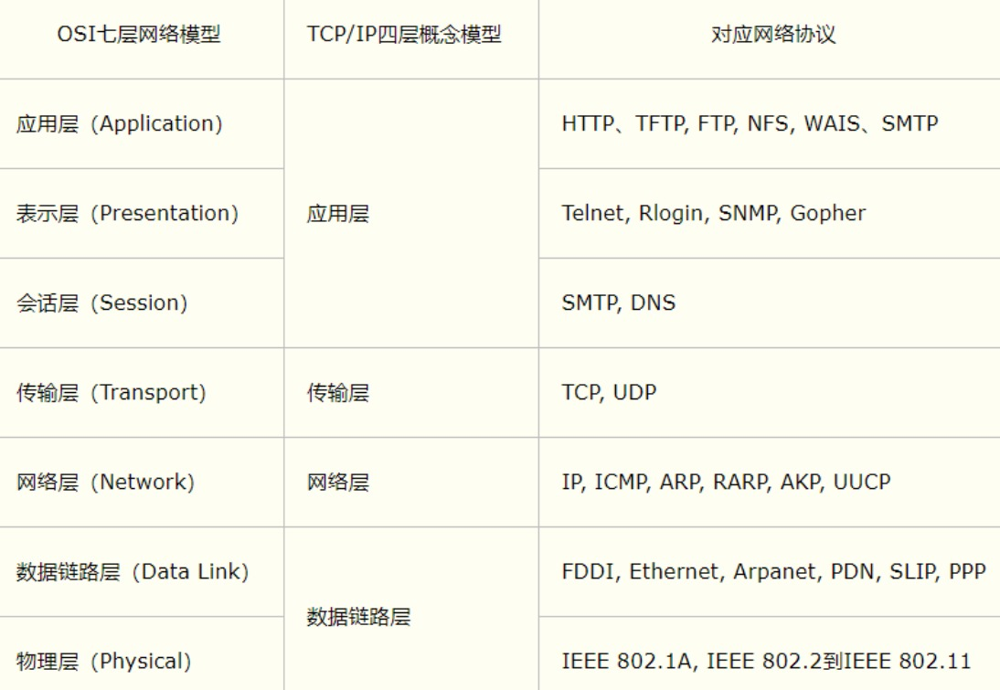
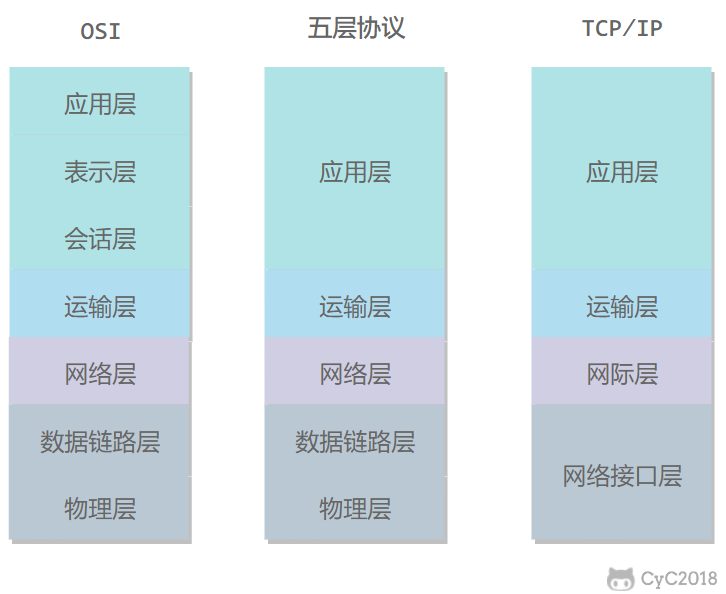
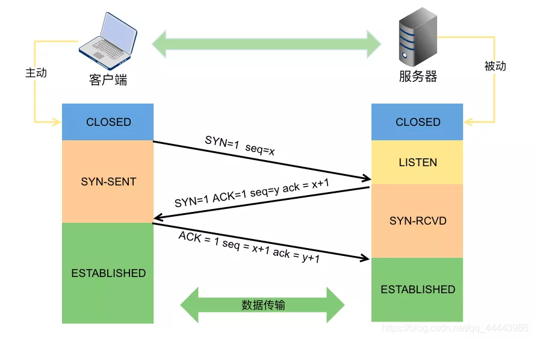
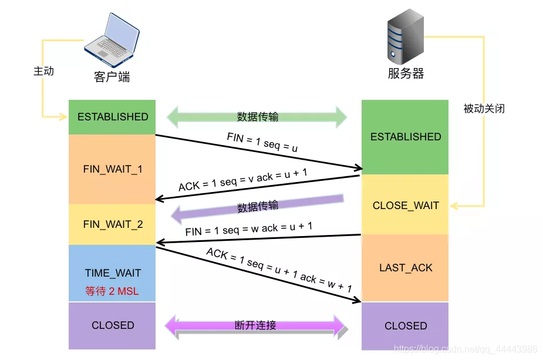

# 计网层次

## OSI的7层网络模型？

分为应用层、表示层、会话层、运输层、网络层、链路层、物理层。

- 应用层(数据)：确定进程之间**通信的性质**以及满足用户需要以及提供网络和用户应用，为应用程序提供服务，DNS，HTTP，HTTPS，DHCP，FTP，POP3(Post Office Protocol)、SMTP(Simple Mail Transfer Protocol)都是这层的协议。
- 表示层(数据)：主要解决用户信息的**语法表示**问题，表示层提供各种**用于应用层数据的编码和转换功能**,确保一个系统的应用层发送的数据能被另一个系统的应用层识别，**如数据转换，压缩和加密，解密**。
- 会话层(数据)：会话层就是负责**建立、管理和终止表示层实体之间的通信会话**。该层的通信由不同设备中的应用程序之间的服务请求和响应组成。 比如服务器验证用户登录就是在会话层。
- 传输层(段)：实现网络不同主机上的用户进程之间的数据通信，可靠与不可靠的传输，传输层的错误检测，流量控制，拥塞控制。TCP UDP就这层。
- 网络层(包)：本层通过**IP寻址**来建立两个节点之间的连接，为源端的运输层送来的分组，**选择合适的路由和交换节点**，正确无误地按照地址传送给目的端的运输层。IP就是这层。
- 数据链路层(帧)：将上层数据封装成帧，用**MAC**地址访问媒介，并由错误检测和修正
- 物理层(比特流)：设备之间比特流的传输，物理接口，电气特性(常用设备有(各种物理设备)集线器、中继器、调制解调器、网线、双绞线、同轴电缆。这些都是物理层的传输介质。)


**OSI（物联网淑惠试用）**

其中表示层和会话层用途如下：

- 表示层：数据压缩、加密以及数据描述，这使得应用程序不必关心在各台主机中数据内部格式不用的问题；
- 会话层：建立及管理会话；

五层协议没有表示层和会话层，而是将这些功能留给应用程序的开发者进行处理；


## TCP/IP四层协议

TCP四层模型是我们实践过程中发现比较合理的分层，虽然我们实际过程中都没有按OSI分为七层，但是OSI对我们实践过程分层有着指导性的意义。




**计算机网络体系结构**



**简短的概述：**

- 应用层：负责给应用程序提供统一的接口；
- 表示层：负责把数据转换成兼容另一个系统能识别的格式；
- 会话层：负责建立、管理和终止表示层实体之间的通信会话；
- 传输层：负责端到端的数据传输；
- 网络层：负责数据的路由、转发、分片；
- 数据链路层：负责数据的封帧和差错检测，以及MAC寻址；
- 物理层，负责在物理网络中传输数据帧；


**五层协议：**

- 应用层：为特定应用程序提供数据传输服务，例如HTTP、DNS等/协议。数据单位为报文；
- 传输层：为进程提供通用数据传输服务。由于应用层协议很多，定义通用的传输层协议就可以支持不断增多的应用层协议。传输层包括两种协议：传输控制协议TCP，提供面向连接、可靠的数据传输服务，数据单位为报文段；用户数据报协议UDP，提供无连接、尽最大努力的数据传输服务，数据单位为用户数据段。TCP主要提供完整性服务，UDP主要提供及时性服务；
- 网络层：为主机提供数据传输服务。而传输层协议是为主机中的进程提供数据传输服务。网络层把传输层传递下来的报文段或用户数据报封装成分组；
- 数据链路层：网络层针对的还是主机之间的数据传输服务，而主机之间有很多链路，链路层协议就是为同一链路的主机提供数据传输服务。数据链路层把网络层传下来的分组封装成帧；
- 物理层：考虑的是怎样在传输媒体上传输数据比特流，而不是指具体的传输媒体。物理层的作用是尽可能屏蔽传输媒体和通信手段的差异，使数据链路层感觉不到这些差异；（集线器、中继器、调制解调器、网线、双绞线、同轴电缆等）


**TCP/IP协议**

只有四层，相当于五层协议中数据链路层和物理层合并为网络接口层。

应用在各层传输时，向下过程中，需要添加下层协议所需要的首部或者尾部，而在向上的过程中不断拆开首部和尾部。

路由器只有下面三层协议，因为路由器位于网络核心中，不需要为进程或者应用程序提供服务，因此也就不需要传输层和应用层。


## TCP与UDP

**1.TCP、UDP的区别？**

- TCP是面向连接的，UDP是面向无连接的。

- TCP是面向字节流的，UDP是基于数据报的。

- TCP提供可靠服务（正确性、顺序性），UDP提供不可靠服务。

- TCP程序结构复杂，占用资源多；UDP程序结构简单，占用资源少。

- TCP有拥塞控制；UDP没有拥塞控制，因此网络出现拥塞不会使源主机的发送速率降低，适合于实时应用，如IP电话、实时视频会议。

- TCP只支持一对一；UDP支持一对一、一对多、多对一、多对多。

  

**2. TCP如何保证可靠传输？**

- **校验和：**发送数据报的二进制相加然后取反，检测数据在传输过程中的变化，有差错则丢弃。

- **确认应答：**接收方收到正确的报文就会确认。

- **超时重传**：发送方等待一定时间后没有收到确认报文则重传。

- **序列号：**发送方对每一个数据包编号，接收方对数据包排序，保证不乱序、不重复。

- **窗口机制（流量控制）**：双方会协调发送的数据包大小，保证接收方能及时接收。

- **拥塞控制机制：**如果网络拥塞，发送方会降低发送速率，降低整个网络的拥塞程度。


**3.应用程序ping发出的是什么报文？**

应用程序ping发出的是**ICMP请求报文。**

ping的原理是利用网络上机器IP地址的唯一性，给目标IP地址发送一个数据包，通过对方回复的数据包来确定两台网络机器是否连接相通，时延是多少。


**5.TCP三次握手，四次挥手？**

| 标记    | 含义                                                 |
| ------- | ---------------------------------------------------- |
| URG     | Urgent：紧急位，URG=1，表示紧急数据                  |
| **ACK** | **Acknowledgement：确认位，ACK=1，确认号才生效**     |
| PSH     | Push：推送位，PSH=1，尽快地把数据交付给应用层        |
| PST     | Reset：重置位，RST=1，重新建立连接                   |
| **SYN** | **Synchronization：同步位，SYN=1，表示连接请求报文** |
| **FIN** | **Finish：终止位，FIN=1表示释放连接**                |

### 三次握手

**1.三次握手的流程？**




第一次握手：客户端告诉服务端，我可以发；

第二次握手：服务端收到客户端发来的信息，再发送确认信息回去，告诉客户端，我可以收也可以发；

第三次握手：客户端收到服务端发来的信息，再发送确认信息回去，告诉服务端，我可以收。


**五句话拓展：**

服务端新建套接字，绑定地址信息后开始监听，进入LISTEN状态。

客户端新建套接字绑定地址信息后调用connect，发送连接请求SYN，并进入SYN_SENT状态，等待服务器的确认。

服务端一旦监听到连接请求，就会将连接放入内核等待队列中，并向客户端发送SYN和确认报文段ACK，进入SYN_RECD状态。

客户端收到SYN+ACK报文后向服务端发送确认报文段ACK，并进入ESTABLISHED状态，开始读写数据。

服务端一旦收到客户端的确认报文，就进入ESTABLISHED状态，就可以进行读写数据了


**具体流程：**

- `第一次`：客户向服务器发送连接请求段，建立连接请求控制段（SYN=1），表示传输的报文段的第一个数据字节的序列号是x，此序列号代表整个报文段的序号（seq=x）；客户端进入 SYN_SEND （同步发送状态）；

- `第二次`：服务器发回确认报文段，同意建立新连接的确认段（SYN=1），确认序号字段有效（ACK=1），服务器告诉客户端报文段序号是y（seq=y），表示服务器已经收到客户端序号为x的报文段，准备接受客户端序列号为x+1的报文段（ack_seq=x+1）；服务器由LISTEN进入SYN_RCVD （同步收到状态）;

- `第三次`:客户对服务器的同一连接进行确认.确认序号字段有效(ACK=1),客户此次的报文段的序列号是x+1(seq=x+1),客户期望接受服务器序列号为y+1的报文段(ack_seq=y+1);当客户发送ack时，客户端进入ESTABLISHED 状态;当服务收到客户发送的ack后，也进入ESTABLISHED状态;第三次握手可携带数据;


**1.为什么是三次？而不是两次或者是四次？**

先总结：两次不安全，四次太多了。tcp通信需要确保双方都具有数据收发的能力，得到ACK响应则认为对方具有数据收发的能力，因此双方都要发送SYN确保对方具有通信的能力。第一次握手是客户端发送SYN，服务端接收，服务端得出客户端的发送能力和服务端的接收能力都正常；第二次握手是服务端发送SYN+ACK，客户端接收，客户端得出客户端发送接收能力正常，服务端发送接收能力也都正常，但是此时服务器并不能确认客户端的接收能力是否正常；第三次握手客户端发送ACK，服务器接收，服务端才能得出客户端发送接收能力正常，服务端自己发送接收能力也都正常。


**2.三次握手可以携带数据吗？**

第一次、第二次握手不可以携带数据，而第三次握手是可以携带数据的。假设第一次可以携带数据，如果有人恶意攻击服务器，每次都在第一次握手中的SYN报文放入大量数据，重复发送大量SYN报文，此时服务器会花费大量内存空间来缓冲这些报文，服务器就更容易被攻击了。


**3.握手失败，服务端会怎样处理？**

握手失败的原因有两种（按照发生在哪一步骤来进行区分），第一种是服务端没有收到SYN，则什么都不做；

第二种是服务端回复了SYN+ACK后，长时间没有收到ACK响应，则超时后就会发送RST重置连接报文，释放资源。


**4.ISN代表什么？意义何在？ISN是固定不变的吗？ISN为何要动态随机**

ISN全称是`Initial Sequence Number`，是TCP发送方的字节数据编号的原点，告诉对方我要开始发送数据的初始化序列号。

ISN如果是固定的，攻击者很容易猜出后序的确认号，为了安全起见，避免被第三方猜到从而发送伪造的RST报文，因此ISN是动态生成的。


**5.什么是半连接队列**

服务器第一次收到客户端的SYN之后，就会处于SYN_RECD状态，此时双方还没有完全建立连接。

服务器会把这种状态下的请求连接放在一个队列里，我们把这种队列称之为半连接队列。

当然还有一个全连接队列，就是已经完成三次握手，建立起来连接的就会放在全连接队列中，如果队列满了就有可能出现丢包现象。


**6.为什么服务器端易受SYN攻击？有什么防范措施吗？**

- 因为服务器端的资源是在第二次握手时分配的，而客户端的资源是在第三次握手时才分配的，若服务器收到大量伪造的IP地址发来的SYN包，则需要不断回复并等待确认，由于等待不到确认这些连接就会占满未连接队列，导致后来正常的连接请求报文被丢弃，从而引起网络拥塞甚至系统瘫痪。

- 防范措施：限制单个IP地址最大连接数、限制单位时间内连接数、修改重传次数为0（只要收不到客户端的响应则立即丢弃该连接）。


### 四次挥手

**2.四次挥手的流程？**



第一次挥手：客户端向服务端发起请求，说我要释放连接啦；

第二次挥手：服务端向客户端发起确认，但这里还有一些东西没处理完，说处理完就下；

第三次挥手：服务端处理完后就向客户端发起释放连接请求；

第四次挥手：客户端收到请求后，发送信息给服务端，说好吧，你下吧；然后客户端等待2MSL后，才自己下机。


**7句话拓展：**

客户端主动调用close时，向服务端发送结束报文段FIN报，同时进入FIN_WAIT1状态；

服务器会收到结束报文段FIN报，服务器返回确认报文段ACK并进入CLOSE_WAIT状态，此时如果服务端有数据要发送的话，客户端依然需要接收。

客户端收到服务器对结束报文段的确认，就会进入到FIN_WAIT2状态，开始等待服务器的结束报文段；

服务器端数据发送完毕后，当服务器真正调用close关闭连接时，会向客户端发送结束报文段FIN包，此时服务器进入LAST_ACK状态，等待最后一个ACK的带来；

客户端收到服务器发来的结束报文段, 进入TIME_WAIT, 并发出送确认报文段ACK；

服务器收到了对结束报文段确认的ACK，进入CLOSED状态，断开连接。

而客户端要等待2MSL的时间，才会进入到CLOSED状态


**具体流程：**

- `第一次`：客户向服务器发送释放连接报文段，发送端数据发送完毕，请求释放连接（FIN=1），传输的第一个数据字节的序号是x（seq=x）；客户端状态由ESTABLISHED进入FIN_WAIT_1（终止等待1状态）；

- `第二次`：服务器向客户发送确认段，确认字号段有效（ACK=1），服务器传输的数据序号是y（seq=y），服务器期望接收客户数据序号为x+1（ack_seq=x+1）;服务器状态由ESTABLISHED进入CLOSE_WAIT（关闭等待）；客户端收到ACK段后，由FIN_WAIT_1进入FIN_WAIT_2；

- `第三次`:服务器向客户发送释放连接报文段，请求释放连接（FIN=1），确认字号段有效（ACK=1），表示服务器期望接收客户数据序号为x+1（ack_seq=x+1）;表示自己传输的第一个字节序号是y+1（seq=y+1）；服务器状态由CLOSE_WAIT 进入 LAST_ACK （最后确认状态）；

- `第四次`：客户向服务器发送确认段，确认字号段有效（ACK=1），表示客户传输的数据序号是x+1（seq=x+1），表示客户期望接收服务器数据序号为y+1+1（ack_seq=y+1+1）；客户端状态由FIN_WAIT_2进入TIME_WAIT，等待2MSL时间，进入CLOSED状态；服务器在收到最后一次ACK后，由LAST_ACK进入CLOSED；


**1.为什么握手是三次，而挥手时需要四次呢？**

其实在TCP握手的时候，接收端将SYN包和ACK确认包合并到一个包中发送的，所以减少了一次包的发送。对于四次挥手，由于TCP是全双工通信，主动关闭方发送FIN请求不代表完全断开连接，只能表示主动关闭方不再发送数据了。而接收方可能还要发送数据，就不能立即关闭服务器端到客户端的数据通道，所以就不能将服务端的FIN包和对客户端的ACK包合并发送，只能先确认ACK，等服务器无需发送数据时在发送FIN包，所以四次挥手时需要四次数据包的交互。


**2.TIME_WAIT状态有什么作用，为什么主动关闭方没有直接进入CLOSED状态释放资源？**

答：如果主动关闭方进入CLOSED状态后，被动关闭方发送FIN包后没有得到ACK确认，超时后就会重传一个FIN包。如果客户端没有TIME_WAIT状态而直接进入CLOSED状态释放资源，下次启动新的客户端就可能使用了与之前客户端相同的地址信息，有两个危害，第一种是这个刚启动的新的客户端绑定地址成功时，就会收到了一个重传的FIN包，对新连接就会造成影响。第二种是如果该新客户端向相同的服务端发送SYN连接请求，但是此时服务端处于LAST_ACK状态，要求收到的是ACK而不是SYN，因此就会发送RST重新建立请求。


**3.为什么TIME_WAIT状态需要经过2MSL才能进入CLOASE状态?**

答：MSL指的是报文在网络中最大生存时间。在客户端发送对服务端的FIN确认包ACK后，这个ACK包有可能到达不了，服务器端如果接收不到ACK包就会重新发送FIN包。所以客户端发送ACK后需要留出2MSL时间（ACK到达服务器器+服务器发送FIN重传包，一来一回）等待确认服务器端缺失收到了ACK包。也就是说客户端如果等待2MSL时间也没收到服务器端重传的FIN包，则就可以确认服务器已经收到客户端发送的ACK包。

- 1个 MSL 保证四次挥手中主动关闭方最后的 ACK 报文能最终到达对端
- 1个 MSL 保证对端没有收到 ACK 之后进行重传的 FIN 报文能够到达


**4.一台主机上出现大量的TIME_WAIT是什么原因？应该如何处理？**

TIME_WAIT是主动关闭方出现的，一台主机出现大量的TIME_WAIT证明这台主机上发起大量的主动关闭连接。常见于一些爬虫服务器。这时候我们应该调整TIME_WAIT的等待时间，或者开启套接字地址重用选项。


**5.一台主机上出现大量的CLOSE_WAIT是什么原因？应该如何处理？**

答：CLOSE_WAIT是被动关闭方收到FIN请求进行回复之后的状态，等待上层程序进一步处理，若出现大量CLOSE_WAIT，有可能是被动关闭方主机程序中忘了最后一步断开连接后调用close释放资源。这是一个 BUG.，只需要加上对应的 close 即可解决问题。


**tcp连接管理中的保活机制**

答：tcp通信中，若两端长时间没有数据往来，则这时候每隔一段时间，服务端会向客户端发送一个保活探测数据报，要求客户端进行回复。若连续多次没有收到响应，就认为连接已经断开。长时间默认为7200s，每隔一段时间默认为75s，连续多次无响应默认为9次。这些数据都可以在套接字中修改，接口：Setsockopt。


**为什么TCP建立连接是三次握手，而关闭连接却是四次挥手？**

- 建立连接的时候，服务器在LISTEN状态下，不需要等待，可以立即建立连接，把ACK和SYN放在一个报文里发送给客户端，因此只需要三次握手。

- 而关闭连接时，服务器收到对方的FIN报文时，仅仅表示对方不再发送数据了但是还能接受数据，而自己未必将所有数据都发送完了，所以服务器可以立即关闭，也可以发送一些数据后再关闭，所以服务器的确认报文（ACK=1）和连接释放报文（FIN=1，ACK=1）一般分开发送，因此形成四次握手。


**网络编程的作用？**

网络编程的本质使用套接字来进行进程间通信，但这些进程是分布在不同主机上的进程，因此网络编程在物联网方面有比较大的作用。


**TCP连接可能出错在什么地方**

TCP连接出错可能出现在以下几个环节：

- 三次握手：TCP连接建立的第一步是三次握手，如果客户端发送的SYN包没有被服务器正确响应，或者服务器发送的SYN+ACK包没有被客户端正确响应，就会导致连接建立失败。
- 数据传输：在数据传输的过程中，如果一个数据包在传输过程中丢失或者出现错误，就会触发超时重传机制。如果重传次数达到了阈值，就会放弃该数据包的传输，导致连接中断。
- 滑动窗口：TCP协议使用滑动窗口机制来控制数据包的发送和接收。如果滑动窗口的大小设置不当，就会导致数据包的丢失和延迟，进而导致连接失败。
- 超时控制：TCP协议使用超时重传机制来控制数据包的传输。如果超时时间设置过短，就会导致过多的数据包重传，影响传输效率；如果超时时间设置过长，就会导致连接的延迟和断开。
- 拥塞控制：TCP协议使用拥塞控制机制来防止网络拥塞。如果拥塞窗口的大小设置不当，就会导致网络拥塞，影响数据传输效率。


### TCP超时重传

**TCP超时重传机制？**

TCP（Transmission Control Protocol）是一种面向连接的传输协议，在数据传输过程中会有超时重传机制，以确保数据传输的可靠性。当发送端发送数据时，如果在一定时间内未收到接收端的确认信息（ACK），就会触发超时重传机制，发送端会重新发送未收到确认的数据。

具体来说，==TCP中的超时重传机制是基于定时器实现的==。当发送端发送数据时，会启动一个定时器，并在定时器到期之前等待接收端的确认信息。如果在定时器到期之前收到了接收端的确认信息，则定时器被取消。如果在定时器到期时未收到确认信息，则发送端会将未收到确认的数据重新发送，并重新启动定时器，等待接收端的确认信息。

TCP超时重传的时间间隔是根据网络情况自适应调整的。当网络延迟较大时，超时重传的时间间隔会相应增加，以避免重复发送过多的数据，影响网络带宽的利用率。当网络延迟较小时，超时重传的时间间隔会相应缩短，以尽快获取接收端的确认信息，提高数据传输的效率。

总之，TCP的超时重传机制是通过定时器实现的，当发送端未收到接收端的确认信息时，会重新发送未确认的数据，并重新启动定时器，等待接收端的确认信息，以确保数据传输的可靠性。

TCP超时重传机制的实现是在操作系统的内核中完成的。以Linux内核为例，下面是一个简单的超时重传的流程：

发送端发送数据包，并启动定时器，计时器的超时时间是由TCP协议的内部算法计算得出的；
如果在计时器到期之前，接收到了ACK确认报文，就取消该定时器；
如果定时器超时了，但是还没有收到ACK确认报文，则重传该数据包，并再次启动一个新的定时器；
如果在超时重传次数达到了一定的阈值，就放弃该数据包的发送。

下面是一个简化的TCP超时重传的内核代码实现，具体实现可能因为不同的内核版本、不同的操作系统而有所不同：

```c
// 超时重传的定时器
struct timer_list retransmit_timer;

// 发送数据包
void tcp_send_packet(struct tcp_sock *tsk, struct tcp_packet *pkt) {
    // 启动定时器
    mod_timer(&retransmit_timer, jiffies + tsk->rto);
}

// 超时重传的处理函数
void tcp_retransmit_timer_handler(unsigned long arg) {
    struct tcp_sock *tsk = (struct tcp_sock *)arg;
    // 重传数据包
    tcp_send_packet(tsk, &tsk->snd_buf[tsk->snd_una]);
    // 重新启动定时器
    mod_timer(&retransmit_timer, jiffies + tsk->rto);
}

// 初始化超时重传定时器
void tcp_init_retransmit_timer(struct tcp_sock *tsk) {
    init_timer(&retransmit_timer);
    retransmit_timer.function = tcp_retransmit_timer_handler;
    retransmit_timer.expires = jiffies + tsk->rto;
    retransmit_timer.data = (unsigned long)tsk;
}
```


在上面的代码中，tcp_send_packet函数用于发送数据包，如果该数据包超时未收到确认报文，则会启动超时重传定时器；tcp_retransmit_timer_handler函数是定时器的回调函数，当定时器超时时，会执行该函数，实现数据包的重传；tcp_init_retransmit_timer函数用于初始化超时重传的定时器。

当发送方发送数据包后，如果在超时时间内未收到ACK确认报文，超时重传定时器会被触发，tcp_retransmit_timer_handler函数会被调用，实现数据包的重传。在数据包被重传后，超时重传定时器会被重新启动，等待下一次超时重传。


### TCP拥塞控制

**TCP拥塞控制**

TCP拥塞控制算法是指TCP协议中通过控制发送数据包的速率来避免网络拥塞的一种机制。TCP协议中的拥塞控制算法主要包括以下四种：慢启动、拥塞避免、快速重传和快速恢复。

慢启动：在发送数据之前，TCP首先将拥塞窗口设为1，然后随着每次传输成功，窗口大小会加倍，直到达到一个阈值，此时切换到拥塞避免状态。慢启动算法的优点是在网络开始拥塞时能够快速适应并减少发送数据包的数量，但是由于窗口增长速度过快可能会引起网络拥塞。

拥塞避免：在拥塞避免状态下，TCP每次传输成功，拥塞窗口会按照线性增长的方式增加，而不是指数级增长。这样可以在保持一定发送速率的同时，避免网络拥塞。拥塞避免算法的优点是可以有效地避免网络拥塞，但是增长速度过慢可能会导致网络利用率降低。

快速重传：当TCP发现一个数据包丢失时，通常需要等待一定时间再进行重传，但快速重传算法可以在接收到重复的确认包时立即重传数据包。快速重传算法的优点是可以提高数据传输的效率，但是可能会增加网络负担。

快速恢复：快速恢复算法是在快速重传的基础上进行改进的，当接收到三个重复的确认包时，TCP可以假设之前发送的数据包已经到达接收端，并立即将拥塞窗口大小减半，以此来避免网络拥塞。快速恢复算法的优点是可以快速地恢复传输速率，但是可能会导致网络拥塞。

以上四种拥塞控制算法各有优缺点，可以根据具体的网络环境和传输需求选择合适的算法。


### TCP和UDP的区别？重要

- TCP是面向连接的。在通信之前需要三次握手建立连接，通信之后断开连接时需要四次挥手；UDP不需要进行连接建立。
- TCP是可靠传输服务。通过TCP传输数据可以保证数据无差错、不丢失、不重复；UDP尽最大努力交付，不保证可靠交付。
- 每个TCP对应的是点对点的连接；UDP支持一对一、一对多、多对一、多对多等多种方式的通讯。
- UDP对系统资源要求较少，通讯效率高，实时性好，应用于高速传输并且对实时性有要求的通信；TCP适合需要可靠连接，比如付费、加密数据等等方向都需要依靠TCP。
- TCP 首部长度较长，会有一定的开销，首部在没有使用「选项」字段时是 20 个字节，如果使用了「选项」字段则会变长的；UDP 首部只有 8 个字节，并且是固定不变的。
- TCP 是流式传输，没有边界，但保证顺序和可靠。UDP 是一个包一个包的发送，是有边界的，可能会丢包和乱序。
- TCP 的数据大小如果大于 MSS 大小，则会在传输层进行分片，目标主机收到后，也同样在传输层组装 TCP 数据包，如果中途丢失了一个分片，只需要传输丢失的这个分片。UDP 的数据大小如果大于 MTU 大小，则会在 IP 层进行分片，目标主机收到后，在 IP 层组装完数据，接着再传给传输层。
- 应用场景：TCP用于FTP文件传输，HTTP / HTTPS；UDP用于包总量较少的通信，如 DNS、SNMP 等，视频、音频等多媒体通信，广播通信。


## PING是怎么工作的？

ICMP主要的功能包括：确认IP包是否成功送达目标地址、报告发送过程中IP包被废弃的原因、改善网络设置等。在IP通信中如果某个IP包因为某种原因未能达到目标地址，具体的原因将由ICMP通知。

ping命令执行的时候，源主机首先会构建一个ICMP回送请求消息数据包，由ICMP协议将这个数据包连同服务端IP一起交给IP层，IP层将以服务端IP作为目的地址，本机IP地址作为源地址，协议字段设置为1，再加上一些其他控制信息，构建一个IP数据包；然后加入MAC头；如果在本地ARP映射表中查找出服务端IP所对应的MAC地址，则可以直接使用，如果没有，则需要发送ARP协议查询MAC地址。获得MAC地址后，由数据链路层构建一个数据帧，目的地址是IP层传过来的MAC地址，源地址则是本机的MAC地址；还要附加上一些控制信息，依据以太网的介质访问规则将它们传送出去。


目的收到这个数据帧后，先检查它的目的MAC地址，并和本机的MAC地址对比，如符合，则接收，否则就丢弃。接收后检查该数据帧，将IP数据包从帧中提取出来，交给本机的IP层。IP层检查后，将有用的信息提取后交给ICMP协议。主机B会构建一个ICMP回送响应消息数据包，回送响应数据包的类型字段为0，序号为接收到的请求数据包中的序号，然后再发送出去给主机A。

在规定的时候间内，源主机如果没有接到ICMP的应答包，则说明目标主机不可达；如果接收到了ICMP回送响应消息，则说明目标主机可达。


## 路由器、交换机、集线器的区别？

（1）路由器工作在网络层，根据网络层提供的信息（IP地址）来选择路由。

（2）交换机工作在数据链路层，通过数据链路层提供的信息（MAC地址）来选择端口。

（3）集线器工作在物理层，只对信号进行整形、放大后再重发（广播给其他所有端口）。

（4）调制解调器是模拟信号和数字信号的“翻译员”；

（5）双绞线可以减少电磁辐射和外部电磁干扰的影响；